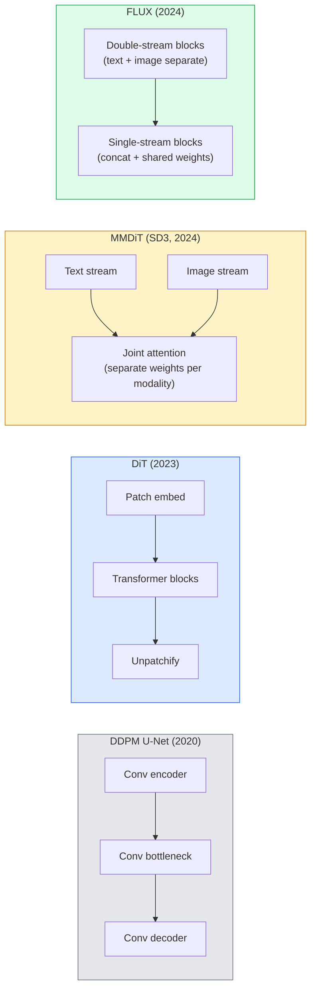

# Диффузионные трансформеры и выпрямленный поток

> U-Net — не главный секрет диффузии. Замените его на трансформер, поменяйте расписание шума на прямолинейный поток — и внезапно вы получаете SD3, FLUX и практически любую модель генерации изображений по тексту (text-to-image) 2026 года.

**Тип:** Learn + Build
**Языки:** Python
**Предварительные требования:** этап 4, урок 10 (диффузия DDPM), этап 4, урок 14 (ViT), этап 7, урок 02 (самовнимание)
**Время:** ~75 минут

## Учебные цели

- Проследить эволюцию от U-Net DDPM (Урок 10) к диффузионному трансформеру (Diffusion Transformer, DiT), MMDiT (SD3) и одно- и двухпоточному DiT (FLUX)
- Объяснить выпрямленный поток (rectified flow): почему прямолинейная траектория между шумом и данными позволяет моделям сэмплировать за 20 шагов вместо 1000
- Реализовать небольшой блок DiT и цикл обучения выпрямленного потока, каждый менее чем в 100 строк
- Различать варианты моделей (SD3, FLUX.1-dev, FLUX.1-schnell, Z-Image, Qwen-Image) по архитектуре, числу параметров и лицензированию

## Проблема

Урок 10 построил DDPM с денойзером на основе U-Net. Этот рецепт доминировал в 2020-2023 годах: U-Net + бета-расписание + функция потерь предсказания шума. Он породил Stable Diffusion 1.5 и 2.1, а также DALL-E 2.

Каждая современная модель генерации изображений по тексту 2026 года ушла от него дальше. Stable Diffusion 3, FLUX, SD4, Z-Image, Qwen-Image, Hunyuan-Image — ни одна не использует U-Net. Они используют диффузионные трансформеры (DiT). SD3 и FLUX также заменяют расписание шума DDPM на выпрямленный поток, что выпрямляет путь от шума к данным и позволяет делать инференс за 1-4 шага с помощью моделей согласованности (consistency models) или дистиллированных вариантов.

Этот сдвиг важен, потому что именно он сделал генерацию изображений на основе диффузии управляемой, точной по промптам (SD3/SD4 решили задачу рендеринга текста) и быстрой для продакшена. Понимание DiT и выпрямленного потока — это понимание генеративного стека для изображений 2026 года.

## Концепция

### От U-Net к трансформеру



- **DiT** (Peebles & Xie, 2023) — замена U-Net на трансформер в духе ViT над латентными патчами. Кондиционирование через адаптивную нормализацию слоя (AdaLN).
- **MMDiT** (SD3, Esser et al., 2024) — два потока с отдельными весами для текстовых и графических токенов, которые используют общее совместное внимание.
- **FLUX** (Black Forest Labs, 2024) — первые N блоков двухпоточные, как в SD3, а последующие объединяют потоки и используют общие веса (однопоточные), что повышает эффективность на большей глубине.
- **Z-Image** (2025) — эффективный однопоточный DiT с 6 млрд параметров, бросающий вызов принципу «масштаб любой ценой».

### Выпрямленный поток в одном абзаце

DDPM определяет прямой процесс как зашумлённое SDE, в котором `x_t` всё сильнее искажается. Обученный обратный процесс — это второе SDE, решаемое за 1000 малых шагов.

Выпрямленный поток определяет **прямолинейную** интерполяцию между чистыми данными и чистым шумом:

```
x_t = (1 - t) * x_0 + t * epsilon,     t in [0, 1]
```

Обучите сеть предсказывать скорость `v_theta(x_t, t) = epsilon - x_0` — направление вперёд вдоль прямолинейного пути от чистых данных к шуму (`dx_t/dt`). Во время сэмплирования вы интегрируете эту скорость в обратном направлении, чтобы шаг за шагом двигаться от шума к данным. Итоговое ОДУ намного ближе к прямой линии, поэтому для сэмплирования требуется гораздо меньше шагов интегрирования.

SD3 называет это **сопоставлением выпрямленных потоков (Rectified Flow Matching)**. FLUX, Z-Image и большинство моделей 2026 года используют ту же целевую функцию. Типичный инференс: 20-30 шагов Эйлера (детерминированных) против 50+ шагов DDIM в старом режиме DDPM. Дистиллированные варианты turbo / schnell / LCM снижают это до 1-4 шагов.

### Кондиционирование AdaLN

DiT кондиционируются на шаг по времени и класс/текст через **адаптивную нормализацию слоя**: предсказать `scale` и `shift` из вектора кондиционирования и применить их после LayerNorm. Гораздо чище, чем модуляция в стиле FiLM в U-Net, и стандарт в каждом современном DiT.

```
cond -> MLP -> (scale, shift, gate)
norm(x) * (1 + scale) + shift, then residual add * gate
```

### Текстовые энкодеры в SD3 и FLUX

- **SD3** использует три текстовых энкодера: две модели CLIP + T5-XXL. Эмбеддинги объединяются и подаются в графический поток как условие по тексту.
- **FLUX** использует один CLIP-L + T5-XXL.
- Варианты **Qwen-Image / Z-Image** используют собственные внутренние текстовые энкодеры, согласованные со своими базовыми LLM.

Текстовый энкодер — большая часть причины, почему SD3/FLUX намного лучше понимают промпты, чем SD1.5. Один только T5-XXL содержит 4,7 млрд параметров.

### Наведение без классификатора по-прежнему работает

Выпрямленный поток меняет сэмплер, а не кондиционирование. Наведение без классификатора (classifier-free guidance: отбрасывание текста с вероятностью 10% во время обучения и смешивание условных и безусловных предсказаний при инференсе) работает с выпрямленным потоком так же. Большинство моделей 2026 года используют коэффициент наведения 3.5-5 — ниже, чем 7.5 у SD1.5, потому что модели с выпрямленным потоком по умолчанию точнее следуют промптам.

### Модели согласованности, Turbo, Schnell и LCM

Четыре названия для одной и той же идеи: дистиллировать медленную многошаговую модель в быструю малошаговую модель.

- **LCM (латентная модель согласованности, Latent Consistency Model)** — обучить студента, предсказывающего конечное `x_0` из любого промежуточного `x_t` за один шаг.
- **SDXL Turbo / FLUX schnell** — модели с 1-4 шагами, обученные с использованием состязательной дистилляции диффузии.
- **SD Turbo** — модели согласованности в стиле OpenAI, адаптированные под латентную диффузию.

При развёртывании любой новой модели предоставляют как контрольную точку «полного качества», так и вариант «turbo / schnell». Schnell (нем. «быстрый», принятое в Black Forest Labs обозначение) работает за 1-4 шага и подходит для конвейеров реального времени.

### Ландшафт моделей в 2026 году

| Модель | Размер | Архитектура | Лицензия |
|-------|------|--------------|---------|
| Stable Diffusion 3 Medium | 2B | MMDiT | SAI Community |
| Stable Diffusion 3.5 Large | 8B | MMDiT | SAI Community |
| FLUX.1-dev | 12B | двух- и однопоточный DiT | некоммерческая |
| FLUX.1-schnell | 12B | та же, дистиллированная | Apache 2.0 |
| FLUX.2 | — | дальнейшее развитие FLUX.1 | смешанная |
| Z-Image | 6B | S3-DiT (масштабируемый однопоточный) | разрешительная |
| Qwen-Image | ~20B | DiT + текстовый энкодер Qwen | Apache 2.0 |
| Hunyuan-Image-3.0 | ~80B | DiT | исследовательская |
| SD4 Turbo | 3B | DiT + дистилляция | SAI Commercial |

FLUX.1-schnell — стандарт с открытым исходным кодом в 2026 году. Z-Image — лидер по эффективности. FLUX.2 и SD4 — текущие лидеры по качеству.

### Почему этот сдвиг парадигмы важен

DDPM + U-Net работали. DiT + выпрямленный поток работают **лучше, быстрее и масштабируются чище**. Этот переход похож на переход от RNN к трансформерам в NLP: обе архитектуры решали одну и ту же задачу, но трансформеры масштабировались и теперь доминируют. Каждая статья 2026 года о генерации изображений, видео или 3D использует денойзер в форме DiT и обычно целевую функцию выпрямленного потока. U-Net DDPM теперь в основном служит учебным целям (Урок 10).

```figure
cv3-rectified-flow
```

## Реализация

### Шаг 1: Блок DiT с AdaLN

```python
import torch
import torch.nn as nn


class AdaLNZero(nn.Module):
    """
    Adaptive LayerNorm with a gate. Predicts (scale, shift, gate) from the conditioning.
    Init such that the whole block starts as identity ("zero init").
    """

    def __init__(self, dim, cond_dim):
        super().__init__()
        self.norm = nn.LayerNorm(dim, elementwise_affine=False)
        self.mlp = nn.Linear(cond_dim, dim * 3)
        nn.init.zeros_(self.mlp.weight)
        nn.init.zeros_(self.mlp.bias)

    def forward(self, x, cond):
        scale, shift, gate = self.mlp(cond).chunk(3, dim=-1)
        h = self.norm(x) * (1 + scale.unsqueeze(1)) + shift.unsqueeze(1)
        return h, gate.unsqueeze(1)


class DiTBlock(nn.Module):
    def __init__(self, dim=192, heads=3, mlp_ratio=4, cond_dim=192):
        super().__init__()
        self.adaln1 = AdaLNZero(dim, cond_dim)
        self.attn = nn.MultiheadAttention(dim, heads, batch_first=True)
        self.adaln2 = AdaLNZero(dim, cond_dim)
        self.mlp = nn.Sequential(
            nn.Linear(dim, dim * mlp_ratio),
            nn.GELU(),
            nn.Linear(dim * mlp_ratio, dim),
        )

    def forward(self, x, cond):
        h, gate1 = self.adaln1(x, cond)
        a, _ = self.attn(h, h, h, need_weights=False)
        x = x + gate1 * a
        h, gate2 = self.adaln2(x, cond)
        x = x + gate2 * self.mlp(h)
        return x
```

`AdaLNZero` стартует как тождественное отображение, потому что веса его MLP инициализируются нулями. Обучение постепенно уводит блок от тождественности; это резко стабилизирует глубокие трансформерные диффузионные модели.

### Шаг 2: Небольшой DiT

```python
def timestep_embedding(t, dim):
    import math
    half = dim // 2
    freqs = torch.exp(-math.log(10000) * torch.arange(half, device=t.device) / half)
    args = t[:, None].float() * freqs[None]
    return torch.cat([args.sin(), args.cos()], dim=-1)


class TinyDiT(nn.Module):
    def __init__(self, image_size=16, patch_size=2, in_channels=3, dim=96, depth=4, heads=3):
        super().__init__()
        self.patch_size = patch_size
        self.num_patches = (image_size // patch_size) ** 2
        self.patch = nn.Conv2d(in_channels, dim, kernel_size=patch_size, stride=patch_size)
        self.pos = nn.Parameter(torch.zeros(1, self.num_patches, dim))
        self.time_mlp = nn.Sequential(
            nn.Linear(dim, dim * 2),
            nn.SiLU(),
            nn.Linear(dim * 2, dim),
        )
        self.blocks = nn.ModuleList([DiTBlock(dim, heads, cond_dim=dim) for _ in range(depth)])
        self.norm_out = nn.LayerNorm(dim, elementwise_affine=False)
        self.head = nn.Linear(dim, patch_size * patch_size * in_channels)

    def forward(self, x, t):
        n = x.size(0)
        x = self.patch(x)
        x = x.flatten(2).transpose(1, 2) + self.pos
        t_emb = self.time_mlp(timestep_embedding(t, self.pos.size(-1)))
        for blk in self.blocks:
            x = blk(x, t_emb)
        x = self.norm_out(x)
        x = self.head(x)
        return self._unpatchify(x, n)

    def _unpatchify(self, x, n):
        p = self.patch_size
        h = w = int(self.num_patches ** 0.5)
        x = x.view(n, h, w, p, p, -1).permute(0, 5, 1, 3, 2, 4).reshape(n, -1, h * p, w * p)
        return x
```

### Шаг 3: Обучение выпрямленного потока

```python
import torch.nn.functional as F

def rectified_flow_train_step(model, x0, optimizer, device):
    model.train()
    x0 = x0.to(device)
    n = x0.size(0)
    t = torch.rand(n, device=device)
    epsilon = torch.randn_like(x0)
    x_t = (1 - t[:, None, None, None]) * x0 + t[:, None, None, None] * epsilon

    target_velocity = epsilon - x0
    pred_velocity = model(x_t, t)

    loss = F.mse_loss(pred_velocity, target_velocity)
    optimizer.zero_grad()
    loss.backward()
    optimizer.step()
    return loss.item()
```

Сравните с функцией потерь предсказания шума в DDPM (Урок 10): та же структура, другая цель. Вместо предсказания шума `epsilon` мы предсказываем **скорость** `epsilon - x_0`, которая указывает от данных к шуму вдоль прямолинейной интерполяции.

### Шаг 4: Сэмплер Эйлера

Выпрямленный поток — это ОДУ. Метод Эйлера — простейший и для хорошо обученной модели с выпрямленным потоком почти так же точен, как решатели более высокого порядка при 20+ шагах.

```python
@torch.no_grad()
def rectified_flow_sample(model, shape, steps=20, device="cpu"):
    model.eval()
    x = torch.randn(shape, device=device)
    dt = 1.0 / steps
    t = torch.ones(shape[0], device=device)
    for _ in range(steps):
        v = model(x, t)
        x = x - dt * v
        t = t - dt
    return x
```

20 шагов. На обученной модели это даёт сэмплы, сопоставимые с 1000-шаговым DDPM.

### Шаг 5: Сквозная проверка работоспособности

```python
import numpy as np

def synthetic_blobs(num=200, size=16, seed=0):
    rng = np.random.default_rng(seed)
    out = np.zeros((num, 3, size, size), dtype=np.float32)
    yy, xx = np.meshgrid(np.arange(size), np.arange(size), indexing="ij")
    for i in range(num):
        cx, cy = rng.uniform(4, size - 4, size=2)
        r = rng.uniform(2, 4)
        mask = (xx - cx) ** 2 + (yy - cy) ** 2 < r ** 2
        colour = rng.uniform(-1, 1, size=3)
        for c in range(3):
            out[i, c][mask] = colour[c]
    return torch.from_numpy(out)
```

Обучите `TinyDiT` на этих данных с помощью выпрямленного потока. После 500 шагов сэмплированные выходы должны выглядеть как слабо очерченные цветные пятна.

## Использование

Для реальной генерации изображений с FLUX / SD3 / Z-Image `diffusers` поставляет каждую из них с единым API:

```python
from diffusers import FluxPipeline, StableDiffusion3Pipeline
import torch

pipe = FluxPipeline.from_pretrained(
    "black-forest-labs/FLUX.1-schnell",
    torch_dtype=torch.bfloat16,
).to("cuda")

out = pipe(
    prompt="a golden retriever surfing a tsunami, hyperrealistic, studio lighting",
    guidance_scale=0.0,           # schnell was trained without CFG
    num_inference_steps=4,
    max_sequence_length=256,
).images[0]
out.save("surf.png")
```

Три строки. `FLUX.1-schnell` за четыре шага. Замените идентификатор модели на `black-forest-labs/FLUX.1-dev`, чтобы повысить качество, используя 20-30 шагов и CFG.

Для SD3:

```python
pipe = StableDiffusion3Pipeline.from_pretrained(
    "stabilityai/stable-diffusion-3.5-large",
    torch_dtype=torch.bfloat16,
).to("cuda")
out = pipe(prompt, guidance_scale=3.5, num_inference_steps=28).images[0]
```

## Итоговые артефакты

Этот урок производит:

- `outputs/prompt-dit-model-picker.md` — выбирает между SD3, FLUX.1-dev, FLUX.1-schnell, Z-Image, SD4 Turbo с учётом ограничений качества, задержки и лицензии.
- `outputs/skill-rectified-flow-trainer.md` — создаёт полный цикл обучения выпрямленного потока с AdaLN DiT и сэмплированием методом Эйлера.

## Упражнения

1. **(Лёгкое)** Обучите приведённый выше TinyDiT на синтетическом наборе данных с пятнами за 500 шагов. Сравните сэмплы, полученные при 10, 20 и 50 шагах Эйлера.
2. **(Среднее)** Добавьте текстовое кондиционирование, объединив обучаемый эмбеддинг класса с эмбеддингом времени (10 «классов» пятен по цвету). Сэмплируйте с классами 0, 5 и 9 и проверьте соответствие цветов.
3. **(Сложное)** Вычислите расстояние Фреше (прокси для FID) между сэмплами, сгенерированными версиями сети с выпрямленным потоком и DDPM одинакового размера, обученными на одних и тех же данных за одинаковое число шагов. Сообщите, какая из них сходится быстрее.

## Ключевые термины

| Термин | Как его обычно называют | Что он означает на самом деле |
|------|----------------|----------------------|
| DiT | «Диффузионный трансформер» | Трансформер, который заменяет U-Net в роли диффузионного денойзера и работает с латентными представлениями, разбитыми на патчи |
| AdaLN | «Адаптивная нормализация слоя» | Кондиционирование по шагу времени и тексту с помощью обучаемых масштаба, сдвига и управляющего коэффициента, применяемых после LayerNorm; стандарт для всех современных DiT |
| MMDiT | «Мультимодальный DiT (SD3)» | Отдельные потоки с разными весами для текстовых токенов и токенов изображения, использующие общий механизм совместного внимания |
| Однопоточная / двухпоточная архитектура | «Приём FLUX» | Первые N блоков двухпоточные, с отдельными весами для каждой модальности; последующие — однопоточные, с объединением токенов и общими весами ради эффективности |
| Выпрямленный поток | «Прямой путь от шума к данным» | Линейная интерполяция между данными и шумом; сеть предсказывает скорость, поэтому при инференсе требуется меньше шагов решения ОДУ |
| Целевая скорость | «epsilon - x_0» | Целевое значение регрессии при обучении выпрямленного потока, направленное от чистых данных к шуму |
| CFG | «Наведение без классификатора» | Смешивание условных и безусловных предсказаний; применяется и в моделях с выпрямленным потоком |
| Schnell / turbo / LCM | «Дистилляция до 1-4 шагов» | Малошаговые варианты, дистиллированные из моделей полного качества и предназначенные для продакшен-систем реального времени |

## Дополнительные материалы

- [Scalable Diffusion Models with Transformers (Peebles & Xie, 2023)](https://arxiv.org/abs/2212.09748) — статья о DiT
- [Scaling Rectified Flow Transformers (Esser et al., SD3 paper)](https://arxiv.org/abs/2403.03206) — масштабирование MMDiT и выпрямленного потока
- [Карточка модели и технический отчёт FLUX.1 (Black Forest Labs)](https://huggingface.co/black-forest-labs/FLUX.1-dev) — подробности двух- и однопоточной архитектуры
- [Z-Image: Efficient Image Generation Foundation Model (2025)](https://arxiv.org/html/2511.22699v1) — однопоточный DiT с 6 млрд параметров
- [Elucidating the Design Space of Diffusion (Karras et al., 2022)](https://arxiv.org/abs/2206.00364) — основной источник по компромиссам при проектировании диффузионных моделей
- [Latent Consistency Models (Luo et al., 2023)](https://arxiv.org/abs/2310.04378) — как LCM-LoRA обеспечивает инференс за 4 шага
