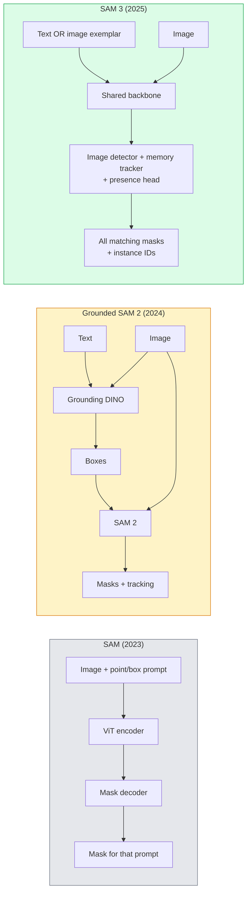

# SAM 3 и сегментация с открытым словарём

> Дайте модели текстовый промпт и изображение — получите маски для каждого подходящего объекта. SAM 3 сделал это одним прямым проходом.

**Тип:** Use + Build
**Языки:** Python
**Предварительные требования:** этап 4, урок 07 (U-Net); этап 4, урок 08 (Mask R-CNN); этап 4, урок 18 (CLIP)
**Время:** ~60 минут

## Учебные цели

- Различать SAM (только визуальные промпты), Grounded SAM / SAM 2 (детектор + SAM) и SAM 3 (встроенные текстовые промпты через промптируемую сегментацию концептов, Promptable Concept Segmentation)
- Объяснить архитектуру SAM 3: общая базовая сеть + детектор изображений + трекер видео на основе памяти + голова присутствия + раздельная конструкция детектора и трекера
- Использовать интеграцию SAM 3 в Hugging Face `transformers` для детекции по тексту, сегментации и отслеживания в видео
- Выбирать между SAM 3, Grounded SAM 2, YOLO-World и SAM-MI по задержке, сложности концепта и целевой платформе развёртывания

## Проблема

SAM 2023 года был моделью только с визуальными промптами: вы кликаете точку или рисуете прямоугольник, и она возвращает маску. Для запроса «дайте мне все апельсины на этой фотографии» требовался детектор (Grounding DINO) для получения прямоугольников, а затем SAM сегментировал каждый из них. Grounded SAM превратил это в конвейер, но это был каскад из двух замороженных моделей с неизбежным накоплением ошибок.

SAM 3 (Meta, ноябрь 2025, ICLR 2026) свернул этот каскад. Он принимает короткую именную группу или пример-изображение в качестве промпта и возвращает все подходящие маски и идентификаторы экземпляров за один прямой проход. Это и есть **Promptable Concept Segmentation (PCS)**. В сочетании с обновлением Object Multiplex от марта 2026 года (SAM 3.1) модель эффективно отслеживает несколько экземпляров одного концепта на протяжении видео.

Этот урок посвящён структурному сдвигу, который это представляет. 2D-сегментация, детекция и связывание текста с изображением объединились в одну модель. Продакшен-вопрос теперь не «какой конвейер собрать из компонентов», а «какая промптируемая модель решает мою задачу целиком».

## Концепция

### Три поколения



### Промптируемая сегментация концептов (Promptable Concept Segmentation)

«Концептуальный промпт» — это короткая именная группа (`"yellow school bus"`, `"striped red umbrella"`, `"hand holding a mug"`) или пример-изображение. Модель возвращает маски сегментации для каждого экземпляра на изображении, соответствующего концепту, плюс уникальный идентификатор экземпляра для каждого совпадения.

Это отличается от классического SAM с визуальными промптами тремя способами:

1. Не требуется промпт для каждого экземпляра — один текстовый промпт возвращает все совпадения.
2. Открытый словарь — концептом может быть всё, что описывается на естественном языке.
3. Возвращает несколько экземпляров сразу, а не одну маску на промпт.

### Ключевые архитектурные элементы

- **Общая базовая сеть** — единый ViT обрабатывает изображение. И голова детектора, и трекер на основе памяти используют полученные ею признаки.
- **Голова присутствия** — предсказывает, присутствует ли концепт на изображении вообще. Отделяет «есть ли это здесь?» от «где это?». Снижает число ложных срабатываний на отсутствующих концептах.
- **Раздельный детектор-трекер** — детекция на уровне изображения и отслеживание на уровне видео имеют отдельные головы, чтобы не мешать друг другу.
- **Банк памяти** — хранит признаки для каждого экземпляра по кадрам для отслеживания в видео (тот же механизм, что использовал SAM 2).

### Обучение в масштабе

SAM 3 обучался на **4 миллионах уникальных концептов**, сгенерированных дата-движком, который итеративно размечает и корректирует данные с помощью ИИ и проверки людьми. Новый **бенчмарк SA-CO** содержит 270 тыс. уникальных концептов — в 50 раз больше, чем предыдущие бенчмарки. SAM 3 достигает 75-80% от человеческой производительности на SA-CO и вдвое превосходит существующие системы на PCS для изображений и видео.

### SAM 3.1 Object Multiplex

Обновление марта 2026 года: **Object Multiplex** вводит механизм разделяемой памяти для совместного отслеживания множества экземпляров одного концепта одновременно. Раньше отслеживание N экземпляров означало N отдельных банков памяти. Multiplex сворачивает это в один разделяемый банк памяти с запросами для каждого экземпляра. Результат: существенно более быстрое отслеживание нескольких объектов без потери точности.

### Где Grounded SAM всё ещё важен в 2026 году

- Когда вам нужен конкретный детектор с открытым словарём (DINO-X, Florence-2).
- Когда лицензия SAM 3 (доступ на HF по запросу) является препятствием.
- Когда вам нужен больший контроль над порогом детектора, чем предоставляет SAM 3.
- Для исследовательской / абляционной работы над компонентом детектора.

Модульные конвейеры по-прежнему имеют своё место. Для большинства продакшен-задач SAM 3 — более простой ответ.

### YOLO-World против SAM 3

- **YOLO-World** — только детектор с открытым словарём (без масок). Реального времени. Лучший вариант, когда нужны прямоугольники на высоком fps.
- **SAM 3** — полная сегментация + отслеживание. Медленнее, но с более богатым выводом.

Продакшен-разделение: YOLO-World для быстрых конвейеров только детекции (навигация роботов, быстрые дашборды), SAM 3 для всего, что требует масок или отслеживания.

### Эффективность SAM-MI

SAM-MI (2025-2026) решает проблему узкого места декодера SAM. Ключевые идеи:

- **Разреженное промптирование точками** — использует несколько тщательно выбранных точек вместо плотных промптов; снижает число вызовов декодера на 96%.
- **Неглубокая агрегация масок** — объединяет грубые предсказания масок в одну более чёткую маску.
- **Раздельная инъекция масок** — декодер получает предвычисленные признаки маски вместо повторного запуска.

Результат: ускорение примерно в 1,6 раза по сравнению с Grounded-SAM на бенчмарках с открытым словарём.

### Формат вывода для трёх моделей

Все возвращают одну и ту же общую структуру (прямоугольники + метки + оценки + маски + идентификаторы), что удобно — вашему конвейеру ниже по потоку не нужно ветвиться в зависимости от того, какая модель отработала.

```figure
cv3-open-vocab
```

## Реализация

### Шаг 1: Построение промпта

Постройте вспомогательную функцию, которая превращает пользовательское предложение в список концептуальных промптов SAM 3. Это граница, где «то, что ввёл пользователь» встречается с «тем, что потребляет модель».

```python
def split_concepts(sentence):
    """
    Heuristic splitter for multi-concept prompts.
    Returns list of short noun phrases.
    """
    for sep in [",", ";", "and", "or", "&"]:
        if sep in sentence:
            parts = [p.strip() for p in sentence.replace("and ", ",").split(",")]
            return [p for p in parts if p]
    return [sentence.strip()]

print(split_concepts("cats, dogs and balloons"))
```

SAM 3 принимает один концепт за прямой проход; для запросов с несколькими концептами нужно перебирать их в цикле или пакетировать.

### Шаг 2: Вспомогательные функции постобработки

Превратите необработанные выходные данные SAM 3 в аккуратный список детекций, соответствующий контракту конвейера из этапа 4, урока 16.

```python
from dataclasses import dataclass
from typing import List

@dataclass
class ConceptDetection:
    concept: str
    instance_id: int
    box: tuple          # (x1, y1, x2, y2)
    score: float
    mask_rle: str       # run-length encoded


def rle_encode(binary_mask):
    flat = binary_mask.flatten().astype("uint8")
    runs = []
    prev, count = flat[0], 0
    for v in flat:
        if v == prev:
            count += 1
        else:
            runs.append((int(prev), count))
            prev, count = v, 1
    runs.append((int(prev), count))
    return ";".join(f"{v}x{c}" for v, c in runs)
```

RLE удерживает размер полезной нагрузки ответа небольшим даже для множества масок высокого разрешения. Тот же формат работает в SAM 2, SAM 3 и Grounded SAM 2.

### Шаг 3: Унифицированный интерфейс сегментации с открытым словарём

Скройте любую имеющуюся реализацию (SAM 3, Grounded SAM 2, YOLO-World + SAM 2) за единым методом. Нижестоящий код при смене реализации не изменится.

```python
from abc import ABC, abstractmethod
import numpy as np

class OpenVocabSeg(ABC):
    @abstractmethod
    def detect(self, image: np.ndarray, concept: str) -> List[ConceptDetection]:
        ...


class StubOpenVocabSeg(OpenVocabSeg):
    """
    Deterministic stub used for pipeline testing when real models are not loaded.
    """
    def detect(self, image, concept):
        h, w = image.shape[:2]
        return [
            ConceptDetection(
                concept=concept,
                instance_id=0,
                box=(w * 0.2, h * 0.3, w * 0.5, h * 0.8),
                score=0.89,
                mask_rle="0x100;1x50;0x200",
            ),
            ConceptDetection(
                concept=concept,
                instance_id=1,
                box=(w * 0.55, h * 0.25, w * 0.85, h * 0.75),
                score=0.74,
                mask_rle="0x80;1x40;0x220",
            ),
        ]
```

Реальный подкласс `SAM3OpenVocabSeg` оборачивал бы `transformers.Sam3Model` и `Sam3Processor`.

### Шаг 4: Использование SAM 3 через Hugging Face (справка)

Для реальной модели — интеграция `transformers`:

```python
from transformers import Sam3Processor, Sam3Model
import torch

processor = Sam3Processor.from_pretrained("facebook/sam3")
model = Sam3Model.from_pretrained("facebook/sam3").eval()

inputs = processor(images=pil_image, return_tensors="pt")
inputs = processor.set_text_prompt(inputs, "yellow school bus")

with torch.no_grad():
    outputs = model(**inputs)

masks = processor.post_process_masks(
    outputs.masks, inputs.original_sizes, inputs.reshaped_input_sizes
)
boxes = outputs.boxes
scores = outputs.scores
```

Один промпт — все совпадения возвращаются за один вызов.

### Шаг 5: Измерьте, что Grounded SAM 2 давал вам бесплатно

Честный бенчмарк: что происходит, когда вы заменяете Grounded SAM 2 на SAM 3 в реальном конвейере?

- Задержка: SAM 3 экономит один прямой проход (нет отдельного детектора), но сама модель тяжелее; обычно результат нейтрален или даёт небольшое ускорение.
- Точность: SAM 3 существенно лучше справляется с редкими или составными концептами («полосатый красный зонт»). Результаты схожи для распространённых концептов из одного слова.
- Гибкость: Grounded SAM 2 позволяет менять детекторы (DINO-X, Florence-2, Grounding DINO 1.5); SAM 3 монолитен.

Вывод: SAM 3 — вариант по умолчанию для сегментации с открытым словарём в 2026 году. Grounded SAM 2 по-прежнему правильный ответ, когда важна гибкость детектора или другие условия лицензии.

## Использование

Продакшен-паттерны развёртывания:

- **Разметка в реальном времени** — SAM 3 + функция CVAT «метка как текстовый промпт». Аннотаторы выбирают имя метки; SAM 3 предварительно размечает каждый подходящий экземпляр. Проверка и исправление.
- **Видеоаналитика** — SAM 3.1 Object Multiplex для отслеживания нескольких объектов; кадры подаются в трекер на основе памяти.
- **Робототехника** — SAM 3 для манипуляций с открытым словарём («возьми красную чашку»); работает как примитив планирования.
- **Медицинская визуализация** — SAM 3, дообученный на медицинских концептах; требует запроса доступа на HF.

Ultralytics оборачивает SAM 3 в своём Python-пакете:

```python
from ultralytics import SAM

model = SAM("sam3.pt")
results = model(image_path, prompts="yellow school bus")
```

Тот же интерфейс, что у YOLO и SAM 2.

## Итоговые артефакты

Этот урок производит:

- `outputs/prompt-open-vocab-stack-picker.md` — промпт, который выбирает SAM 3 / Grounded SAM 2 / YOLO-World / SAM-MI на основе задержки, сложности концепта и лицензирования.
- `outputs/skill-concept-prompt-designer.md` — навык, который превращает высказывания пользователя в корректно сформированные концептуальные промпты SAM 3 (разбиение, устранение неоднозначности, резервные варианты).

## Упражнения

1. **(Лёгкое)** Запустите SAM 3 на 10 изображениях с выбранными вами концептуальными промптами. Сравните с SAM 2 + Grounding DINO 1.5 на тех же изображениях. Сообщите, какие концепты пропустила каждая модель.
2. **(Среднее)** Постройте поверх SAM 3 интерфейс «клик, чтобы включить / клик, чтобы исключить»: текстовый промпт возвращает кандидатов-экземпляров; пользователь кликами отмечает, какие считаются положительными. Выведите итоговый набор концептов в формате JSON.
3. **(Сложное)** Дообучите SAM 3 на пользовательском наборе концептов (например, 5 типов электронных компонентов) с 20 размеченными изображениями на каждый. Сравните с SAM 3 в режиме без примеров (zero-shot) на том же тестовом наборе; измерьте улучшение IoU масок.

## Ключевые термины

| Термин | Как обычно говорят | Что это означает на самом деле |
|--------|--------------------|--------------------------------|
| Сегментация с открытым словарём | «Сегментация по тексту» | Построение масок для объектов, описанных на естественном языке, а не принадлежащих фиксированному набору классов |
| PCS | «Промптируемая сегментация концептов» | Основная задача SAM 3: получить именную группу или пример-изображение и сегментировать все подходящие экземпляры |
| Концептуальный промпт | «Текст на входе» | Короткая именная группа или пример-изображение, но не полное предложение |
| Голова присутствия | «Это здесь есть?» | Модуль SAM 3, который перед локализацией определяет, присутствует ли концепт на изображении |
| SA-CO | «Бенчмарк SAM 3» | Бенчмарк сегментации с открытым словарём на 270 тыс. концептов; в 50 раз больше предыдущих бенчмарков с открытым словарём |
| Object Multiplex | «Обновление SAM 3.1» | Отслеживание нескольких объектов с общей памятью; быстрое совместное отслеживание множества экземпляров |
| Grounded SAM 2 | «Модульный конвейер» | Каскад из детектора и SAM 2; по-прежнему актуален, когда важна возможность заменить детектор |
| SAM-MI | «Эффективный вариант SAM» | Инъекция масок, обеспечивающая ускорение в 1,6 раза по сравнению с Grounded-SAM |

## Дополнительные материалы

- [SAM 3: Segment Anything with Concepts (arXiv 2511.16719)](https://arxiv.org/abs/2511.16719)
- [SAM 3.1 Object Multiplex (Meta AI, март 2026)](https://ai.meta.com/blog/segment-anything-model-3/)
- [Страница модели SAM 3 на Hugging Face](https://huggingface.co/facebook/sam3)
- [Руководство по Grounded SAM 2 (PyImageSearch)](https://pyimagesearch.com/2026/01/19/grounded-sam-2-from-open-set-detection-to-segmentation-and-tracking/)
- [Документация Ultralytics по SAM 3](https://docs.ultralytics.com/models/sam-3/)
- [SAM3-I: Instruction-aware SAM (arXiv 2512.04585)](https://arxiv.org/abs/2512.04585)
