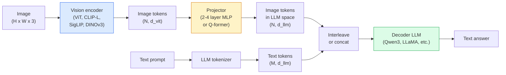

# Визуально-языковые модели — паттерн ViT-MLP-LLM

> Энкодер изображений превращает изображение в токены. MLP-проектор отображает эти токены в пространство эмбеддингов LLM. Языковая модель делает всё остальное. Этот паттерн — ViT-MLP-LLM — используется в каждой продакшен VLM 2026 года.

**Тип:** Learn + Use
**Языки:** Python
**Предварительные требования:** этап 4, урок 14 (ViT), этап 4, урок 18 (CLIP), этап 7, урок 02 (самовнимание)
**Время:** ~75 минут

## Учебные цели

- Сформулировать архитектуру ViT-MLP-LLM и объяснить вклад каждого из трёх компонентов
- Сравнить Qwen3-VL, InternVL3.5, LLaVA-Next и GLM-4.6V по количеству параметров, длине контекста и производительности на бенчмарках
- Объяснить DeepStack: почему многоуровневые признаки ViT обеспечивают более точное согласование зрения и языка, чем признаки только последнего слоя
- Измерять галлюцинации VLM в продакшене с помощью Cross-Modal Error Rate (CMER) и реагировать на этот сигнал

## Проблема

CLIP (этап 4, урок 18) даёт общее пространство эмбеддингов для изображений и текста — этого достаточно для классификации без примеров (zero-shot) и поиска. Но CLIP не может ответить на вопрос «сколько красных машин на этом изображении?», потому что не генерирует текст — он только оценивает сходство.

Визуально-языковые модели (Vision-Language Models, VLM) — Qwen3-VL, InternVL3.5, LLaVA-Next, GLM-4.6V — пристыковывают энкодер изображений семейства CLIP к полноценной языковой модели. Модель видит изображение и вопрос и генерирует ответ. В 2026 году открытые VLM не уступают GPT-5 и Gemini-2.5-Pro на мультимодальных бенчмарках (MMMU, MMBench, DocVQA, ChartQA, MathVista, OSWorld) или превосходят их.

Эта тройка компонентов (ViT, проектор, LLM) — стандарт. Различия между моделями сводятся к тому, какой ViT, какой проектор, какая LLM используются, к обучающим данным и рецепту согласования. Как только вы понимаете паттерн, замена любого компонента становится механической операцией.

## Концепция

### Архитектура ViT-MLP-LLM



1. **Энкодер изображений** — предобученный ViT (CLIP-L/14, SigLIP, DINOv3 или дообученный вариант). Производит патч-токены.
2. **Проектор** — небольшой модуль (MLP из 2-4 слоёв или Q-former), который отображает визуальные токены в размерность эмбеддингов LLM. Именно здесь происходит основная часть дообучения.
3. **LLM** — декодер-языковая модель (Qwen3, Llama, Mistral, GLM, InternLM). Считывает последовательность визуальных и текстовых токенов, генерирует текст.

В принципе все три компонента можно обучать. На практике энкодер изображений и LLM в основном остаются замороженными, пока обучается проектор — несколько миллиардов параметров полезного сигнала, полученных дёшево.

### DeepStack

Обычное проецирование использует только последний слой ViT. DeepStack (Qwen3-VL) берёт признаки с нескольких уровней глубины ViT и объединяет их в стек. Более глубокие слои несут семантику высокого уровня; более поверхностные слои несут детальную пространственную и текстурную информацию. Подача обоих типов признаков в LLM сокращает разрыв между «что содержит изображение» (семантика) и «где именно» (пространственная привязка).

### Три этапа обучения

Современные VLM обучаются поэтапно:

1. **Согласование** — заморозить ViT и LLM. Обучать только проектор на парах изображение-подпись. Учит проектор отображать визуальное пространство в языковое.
2. **Предварительное обучение** — разморозить всё. Обучать на масштабных чередующихся данных изображение-текст (500M+ пар). Формирует визуальные знания модели.
3. **Обучение на инструкциях** — дообучение на курируемых тройках (изображение, вопрос, ответ). Учит диалоговому поведению и форматам задач. Именно это превращает «языковую модель с визуальным восприятием» в пригодного к использованию ассистента.

Большинство LoRA-дообучений нацелены на этап 3 с небольшим размеченным набором данных.

### Сравнение семейств моделей (начало 2026 года)

| Модель | Параметры | Энкодер изображений | LLM | Контекст | Сильные стороны |
|-------|--------|----------------|-----|---------|-----------|
| Qwen3-VL-235B-A22B (MoE) | 235B (22B активных) | собственный ViT + DeepStack | Qwen3 | 256K | Общий SOTA, агент для GUI |
| Qwen3-VL-30B-A3B (MoE) | 30B (3B активных) | собственный ViT + DeepStack | Qwen3 | 256K | Более компактная MoE-альтернатива |
| Qwen3-VL-8B (плотная) | 8B | собственный ViT | Qwen3 | 128K | Плотный продакшен-вариант по умолчанию |
| InternVL3.5-38B | 38B | InternViT-6B | Qwen3 + GPT-OSS | 128K | Сильные результаты на MMBench / MMVet |
| InternVL3.5-241B-A28B | 241B (28B активных) | InternViT-6B | Qwen3 | 128K | Конкурентоспособна с GPT-4o |
| LLaVA-Next 72B | 72B | SigLIP | Llama-3 | 32K | Открытая, легко дообучается |
| GLM-4.6V | ~70B | собственный | GLM | 64K | С открытым исходным кодом, сильный OCR |
| MiniCPM-V-2.6 | 8B | SigLIP | MiniCPM | 32K | Подходит для периферийных устройств |

### Визуальные агенты

Qwen3-VL-235B демонстрирует лучшую в мире производительность на OSWorld — бенчмарке для **визуальных агентов**, которые управляют GUI (десктоп, мобильные устройства, веб). Модель видит скриншот, понимает интерфейс и генерирует действия (клик, ввод текста, прокрутка). В сочетании с инструментами это замыкает цикл для типичных десктопных задач. Именно это лежит в основе большинства демо «ПК с ИИ» 2026 года.

### Агентные возможности и варианты RoPE

VLM нужно знать, **когда** кадр находится в видео. Qwen3-VL эволюционировал от T-RoPE (временных вращательных позиционных эмбеддингов) к **текстовому выравниванию по времени** — явным текстовым токенам временных меток, чередующимся с кадрами видео. Модель видит «`<timestamp 00:32>` кадр, промпт» и может рассуждать о временных связях.

### Проблема согласования

12% пар изображение-текст в наборе данных, собранном из веба, содержат описания, не полностью подкреплённые изображением. VLM, обученная на таких данных, незаметно учится галлюцинировать — выдумывать объекты, неверно считывать числа, изобретать несуществующие связи. В продакшене это доминирующий тип отказа.

Skywork.ai ввела **Cross-Modal Error Rate (CMER)** для отслеживания этого:

```
CMER = fraction of outputs where the text confidence is high but the image-text similarity (via a CLIP-family checker) is low
```

Высокий CMER означает, что модель уверенно утверждает вещи, не подкреплённые изображением. Мониторинг CMER и обращение с ним как с продакшен-KPI снизили частоту галлюцинаций примерно на 35% в их развёртывании. Секрет не в том, чтобы «исправить модель», а в том, чтобы «направлять выводы с высоким CMER на проверку человеком».

### Дообучение с LoRA / QLoRA

Полное дообучение VLM с 70B параметров недостижимо для большинства команд. LoRA (ранг 16-64) на слоях внимания и проектора, либо QLoRA с 4-битными базовыми весами, помещается на одной A100 / H100. Стоимость: 5,000-50,000 примеров, $100-$5,000 на вычисления, 2-10 часов обучения.

### Пространственное рассуждение всё ещё слабое

Современные VLM набирают 50-60% на бенчмарках пространственного рассуждения (выше-ниже, слева-справа, подсчёт, расстояние). Если ваш сценарий использования зависит от того, «какой объект находится поверх какого», тщательно валидируйте результаты — типичная производительность VLM ниже человеческой. Альтернативы, превосходящие VLM в чисто пространственных задачах: специализированный оценщик ключевых точек / позы, модель глубины или модель детекции с постобработкой геометрии прямоугольников.

```figure
v4-vlm-projector
```

## Реализация

### Шаг 1: Проектор

Часть, которую вы будете обучать чаще всего. MLP из 2-4 слоёв с GELU.

```python
import torch
import torch.nn as nn


class Projector(nn.Module):
    def __init__(self, vit_dim=768, llm_dim=4096, hidden=4096):
        super().__init__()
        self.net = nn.Sequential(
            nn.Linear(vit_dim, hidden),
            nn.GELU(),
            nn.Linear(hidden, llm_dim),
        )

    def forward(self, x):
        return self.net(x)
```

На входе тензор токенов `(N_patches, d_vit)`. На выходе `(N_patches, d_llm)`. LLM обрабатывает каждую выходную строку как ещё один токен.

### Шаг 2: Собрать ViT-MLP-LLM целиком

Скелет прямого прохода для минимальной VLM. Реальный код использует `transformers`; здесь показана концептуальная схема.

```python
class MinimalVLM(nn.Module):
    def __init__(self, vit, projector, llm, image_token_id):
        super().__init__()
        self.vit = vit
        self.projector = projector
        self.llm = llm
        self.image_token_id = image_token_id  # placeholder token in text prompt

    def forward(self, image, input_ids, attention_mask):
        # 1. vision features
        vision_tokens = self.vit(image)                     # (B, N_patches, d_vit)
        vision_embeds = self.projector(vision_tokens)       # (B, N_patches, d_llm)

        # 2. text embeddings
        text_embeds = self.llm.get_input_embeddings()(input_ids)  # (B, M, d_llm)

        # 3. replace image placeholder tokens with vision embeds
        merged = self._merge(text_embeds, vision_embeds, input_ids)

        # 4. run LLM
        return self.llm(inputs_embeds=merged, attention_mask=attention_mask)

    def _merge(self, text_embeds, vision_embeds, input_ids):
        out = text_embeds.clone()
        expected = vision_embeds.size(1)
        for b in range(input_ids.size(0)):
            positions = (input_ids[b] == self.image_token_id).nonzero(as_tuple=True)[0]
            if len(positions) != expected:
                raise ValueError(
                    f"batch item {b} has {len(positions)} image tokens but vision_embeds has {expected} patches."
                    " Every sample in the batch must be pre-padded to the same number of image placeholder tokens.")
            out[b, positions] = vision_embeds[b]
        return out
```

Токен-заполнитель `<image>` в тексте заменяется реальными эмбеддингами изображения — тот же паттерн используют LLaVA, Qwen-VL и InternVL.

### Шаг 3: Вычисление CMER

Лёгкая проверка на этапе выполнения.

```python
import torch.nn.functional as F


def cross_modal_error_rate(image_emb, text_emb, text_confidence, sim_threshold=0.25, conf_threshold=0.8):
    """
    image_emb, text_emb: embeddings of image and generated text (normalised internally)
    text_confidence:     mean per-token probability in [0, 1]
    Returns:             fraction of high-confidence outputs with low image-text alignment
    """
    image_emb = F.normalize(image_emb, dim=-1)
    text_emb = F.normalize(text_emb, dim=-1)
    sim = (image_emb * text_emb).sum(dim=-1)        # cosine similarity
    high_conf_low_sim = (text_confidence > conf_threshold) & (sim < sim_threshold)
    return high_conf_low_sim.float().mean().item()
```

Относитесь к CMER как к продакшен-KPI. Отслеживайте его по конечным точкам, по типам промптов, по клиентам. Рост CMER означает, что модель начинает галлюцинировать на каком-то распределении входных данных.

### Шаг 4: Игрушечный VLM-классификатор (готовый к запуску)

Демонстрирует, что проектор обучается. На вход подаются фиктивные «признаки ViT»; крошечный токен в стиле LLM предсказывает класс.

```python
class ToyVLM(nn.Module):
    def __init__(self, vit_dim=32, llm_dim=64, num_classes=5):
        super().__init__()
        self.projector = Projector(vit_dim, llm_dim, hidden=64)
        self.head = nn.Linear(llm_dim, num_classes)

    def forward(self, vision_tokens):
        projected = self.projector(vision_tokens)
        pooled = projected.mean(dim=1)
        return self.head(pooled)
```

Это можно обучить на синтетических парах (признак, класс) менее чем за 200 шагов — этого достаточно, чтобы показать, что паттерн проектора работает.

## Использование

Три способа, которыми продакшен-команды используют VLM в 2026 году:

- **Размещённый API** — OpenAI Vision, Anthropic Claude Vision, Google Gemini Vision. Нулевая инфраструктура, риск зависимости от вендора.
- **Самостоятельный хостинг моделей с открытым исходным кодом** — Qwen3-VL или InternVL3.5 через `transformers` и `vllm`. Полный контроль, более высокие первоначальные затраты усилий.
- **Дообучение под домен** — загрузить Qwen2.5-VL-7B или LLaVA-1.6-7B, LoRA на 5k-50k собственных примеров, обслуживать через `vllm` или `TGI`.

```python
from transformers import AutoProcessor, AutoModelForVision2Seq
import torch
from PIL import Image

model_id = "Qwen/Qwen3-VL-8B-Instruct"
processor = AutoProcessor.from_pretrained(model_id)
model = AutoModelForVision2Seq.from_pretrained(model_id, torch_dtype=torch.bfloat16, device_map="auto")

messages = [{
    "role": "user",
    "content": [
        {"type": "image", "image": Image.open("plot.png")},
        {"type": "text", "text": "What does this chart show?"},
    ],
}]
inputs = processor.apply_chat_template(messages, add_generation_prompt=True, tokenize=True, return_dict=True, return_tensors="pt").to("cuda")
generated = model.generate(**inputs, max_new_tokens=256)
answer = processor.decode(generated[0][inputs["input_ids"].shape[1]:], skip_special_tokens=True)
```

`apply_chat_template` скрывает токенизацию плейсхолдера `<image>`; модель самостоятельно выполняет объединение внутри себя.

## Итоговые артефакты

Этот урок производит:

- `outputs/prompt-vlm-selector.md` — выбирает Qwen3-VL / InternVL3.5 / LLaVA-Next / API исходя из точности, задержки, длины контекста и бюджета.
- `outputs/skill-cmer-monitor.md` — генерирует код для инструментирования продакшен-конечной точки VLM метрикой CMER, дашбордами по конечным точкам и порогами оповещений.

## Упражнения

1. **(Лёгкое)** Прогоните три промпта («что это?», «посчитай объекты», «опиши сцену») через любую открытую VLM на пяти изображениях. Оцените каждый ответ вручную как верный / частично верный / галлюцинация. Вычислите приблизительный показатель по типу CMER.
2. **(Среднее)** Дообучите Qwen2.5-VL-3B или LLaVA-1.6-7B с LoRA (ранг 16) на 500 изображениях целевого домена с подписями. Сравните точность в стиле MMBench без примеров и после дообучения.
3. **(Сложное)** Замените энкодер изображений VLM на DINOv3 вместо стандартного SigLIP/CLIP. Переобучите только проектор (заморозив LLM и DINOv3). Измерьте, улучшаются ли задачи плотного предсказания (подсчёт, пространственное рассуждение).

## Ключевые термины

| Термин | Как его называют | Что он означает на самом деле |
|------|----------------|----------------------|
| ViT-MLP-LLM | «Паттерн VLM» | Энкодер изображений + проектор + языковая модель; любая VLM 2026 года |
| Проектор | «Мост» | MLP из 2-4 слоёв (или Q-former), отображающий визуальные токены в пространство эмбеддингов LLM |
| DeepStack | «Приём с признаками Qwen3-VL» | Многоуровневые признаки ViT, объединённые в стек, а не только признаки последнего слоя |
| Токен изображения | «Плейсхолдер <image>» | Специальный токен в текстовом потоке, заменяемый спроецированными визуальными эмбеддингами |
| CMER | «KPI галлюцинаций» | Межмодальная доля ошибок; высока, когда уверенность в тексте высокая, а сходство изображения и текста низкое |
| Визуальный агент | «VLM, которая кликает» | VLM, управляющая GUI (OSWorld, мобильные устройства, веб) с помощью вызовов инструментов |
| Q-former | «Мост с фиксированным числом токенов» | Проектор в стиле BLIP-2, производящий фиксированное число визуальных токенов запроса |
| Согласование / предварительное обучение / обучение на инструкциях | «Три этапа» | Стандартный конвейер обучения VLM |

## Дополнительные материалы

- [Qwen3-VL Technical Report (arXiv 2511.21631)](https://arxiv.org/abs/2511.21631)
- [InternVL3.5 Advancing Open-Source Multimodal Models (arXiv 2508.18265)](https://arxiv.org/html/2508.18265v1)
- [Серия LLaVA-Next](https://llava-vl.github.io/blog/2024-05-10-llava-next-stronger-llms/)
- [BentoML: лучшие VLM с открытым исходным кодом 2026 года](https://www.bentoml.com/blog/multimodal-ai-a-guide-to-open-source-vision-language-models)
- [MMMU: бенчмарк Multi-discipline Multimodal Understanding](https://mmmu-benchmark.github.io/)
- [VLM в промышленном производстве (Robotics Tomorrow, март 2026 года)](https://www.roboticstomorrow.com/story/2026/03/when-machines-learn-to-see-like-experts-the-rise-of-vision-language-models-in-manufacturing/26335/)
