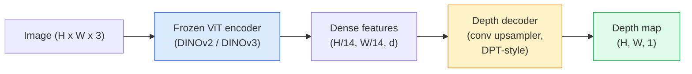

# Монокулярная оценка глубины и геометрии

> Карта глубины — это одноканальное изображение, где каждый пиксель представляет собой расстояние от камеры. Предсказать её по одному RGB-кадру раньше было невозможно без стерео или LiDAR. В 2026 году замороженный энкодер ViT плюс лёгкая голова даёт результат в пределах нескольких процентов от эталонных значений.

**Тип:** Build + Use
**Языки:** Python
**Предварительные требования:** этап 4, урок 14 (ViT), этап 4, урок 17 (самообучение в компьютерном зрении), этап 4, урок 07 (U-Net)
**Время:** ~60 минут

## Учебные цели

- Различать относительную и метрическую глубину и указывать, какую из них решает каждая продакшен-модель (MiDaS, Marigold, Depth Anything V3, ZoeDepth)
- Использовать Depth Anything V3 (на базе DINOv2) для предсказания глубины произвольных отдельных изображений без калибровки
- Объяснить, почему монокулярная глубина вообще работает по одному изображению (перспективные признаки, градиенты текстуры, выученные априорные знания) и что она не может восстановить (абсолютный масштаб, скрытую геометрию)
- Поднимать 2D-детекции в 3D-точки, используя карту глубины и внутренние параметры камеры-обскуры (pinhole camera)

## Проблема

Глубина — это недостающая ось в 2D компьютерном зрении. Имея RGB, вы знаете, где объекты расположены в плоскости изображения, но не знаете, как далеко они находятся. Датчики глубины (стереоустановки, LiDAR, времяпролётные датчики) решают эту проблему напрямую, но они дороги, хрупки и ограничены по дальности.

Монокулярная оценка глубины — предсказание глубины по одному RGB-кадру — раньше давала размытый, ненадёжный результат. К 2026 году крупные предобученные энкодеры это изменили: Depth Anything V3 использует замороженную базовую архитектуру DINOv2 и выдаёт карты глубины, которые обобщаются на помещения, улицу, медицину и спутниковые снимки. Marigold переформулирует глубину как задачу условной диффузии. ZoeDepth регрессирует истинные метрические расстояния.

Глубина также служит мостом между 2D-детекцией и 3D-пониманием: умножьте пиксели детектированного прямоугольника на глубину — и вы поднимете 2D-объект в 3D-облако точек. Это лежит в основе каждой системы окклюзии в AR, каждого конвейера обхода препятствий и каждого робота, который «берёт чашку».

## Концепция

### Относительная и метрическая глубина

- **Относительная глубина** — упорядоченные значения `z` без реальной единицы измерения. «Пиксель A ближе, чем пиксель B, но соотношение расстояний не привязано к метрам».
- **Метрическая глубина** — абсолютное расстояние в метрах от камеры. Требует, чтобы модель выучила статистическую связь между признаками изображения и реальным расстоянием.

MiDaS и Depth Anything V3 выдают относительную глубину. Marigold выдаёт относительную глубину. ZoeDepth, UniDepth и Metric3D выдают метрическую глубину. Метрические модели чувствительны к внутренним параметрам камеры; относительные модели — нет.

### Паттерн энкодер-декодер



Depth Anything V3 замораживает энкодер и обучает только декодер в стиле DPT. Энкодер предоставляет богатые признаки; декодер интерполирует их обратно до разрешения изображения и регрессирует глубину.

### Почему одно изображение вообще позволяет получить глубину

2D-изображение содержит множество монокулярных признаков, коррелирующих с глубиной:

- **Перспектива** — параллельные линии в 3D сходятся в 2D.
- **Градиент текстуры** — удалённые поверхности имеют более мелкую, плотную текстуру.
- **Порядок окклюзии** — ближние объекты заслоняют дальние.
- **Постоянство размера** — известные объекты (автомобили, люди) дают приблизительный масштаб.
- **Атмосферная перспектива** — удалённые объекты выглядят более размытыми и голубоватыми в сценах на улице.

ViT, обученный на миллиардах изображений, усваивает эти признаки. При достаточном объёме данных и мощной базовой архитектуре монокулярная глубина достигает разумной точности без какого-либо явного 3D-надзора.

### Что монокулярная глубина не может сделать

- **Абсолютный метрический масштаб** без внутренних параметров камеры или известного объекта в сцене. Сеть может предсказать «чашка вдвое дальше, чем ложка», не зная, находится ли чашка в 1 м или в 10 м.
- **Скрытую геометрию** — обратная сторона стула не видна и не может быть надёжно выведена.
- **Действительно нетекстурированные / отражающие поверхности** — зеркала, стекло, однородные стены. Сеть выдаёт правдоподобную, но неверную глубину.

### Depth Anything V3 в 2026 году

- Ванильный DINOv2 ViT-L/14 в качестве энкодера (заморожен).
- Декодер DPT.
- Обучен на полученных из разных источников парах изображений с позами камер (явный надзор по глубине не требуется, помимо фотометрической согласованности).
- Предсказывает пространственно согласованную геометрию по **произвольному числу визуальных входов, с известными позами камеры или без них**.
- SOTA в монокулярной глубине, геометрии с произвольного ракурса, визуальном рендеринге, оценке позы камеры.

Это готовая к использованию модель, к которой стоит обращаться, когда в 2026 году нужна глубина.

### Marigold — диффузия для глубины

Marigold (Ke et al., CVPR 2024) переформулирует оценку глубины как условную диффузию из изображения в изображение. Условие: RGB. Цель: карта глубины. В качестве базовой архитектуры используется предобученный U-Net из Stable Diffusion 2. Итоговые карты глубины исключительно чёткие на границах объектов. Компромисс: инференс медленнее, чем у моделей прямого распространения (10-50 шагов удаления шума).

### Внутренние параметры и камера-обскура (pinhole camera)

Чтобы поднять пиксель `(u, v)` с глубиной `d` в 3D-точку `(X, Y, Z)` в координатах камеры:

```
fx, fy, cx, cy = camera intrinsics
X = (u - cx) * d / fx
Y = (v - cy) * d / fy
Z = d
```

Внутренние параметры берутся из метаданных EXIF, калибровочного шаблона или монокулярного оценщика внутренних параметров (Perspective Fields, UniDepth). Без внутренних параметров всё ещё можно отрендерить облако точек, задав приближённые внутренние параметры камеры: угол обзора 60-70° и главную точку около центра изображения. Это годится для визуализации, но не для измерений.

### Оценка

Две стандартные метрики:

- **AbsRel** (абсолютная относительная ошибка): `mean(|d_pred - d_gt| / d_gt)`. Чем ниже, тем лучше. 0.05-0.1 для продакшен-моделей.
- **delta < 1.25** (точность по порогу): доля пикселей, где `max(d_pred/d_gt, d_gt/d_pred) < 1.25`. Чем выше, тем лучше. 0.9+ для SOTA.

Для относительной глубины (Depth Anything V3, MiDaS) оценивание использует инвариантные к масштабу и сдвигу версии обеих метрик.

```figure
depth-sweep
```

## Реализация

### Шаг 1: Метрики глубины

```python
import torch

def abs_rel_error(pred, target, mask=None):
    if mask is not None:
        pred = pred[mask]
        target = target[mask]
    return (torch.abs(pred - target) / target.clamp(min=1e-6)).mean().item()


def delta_accuracy(pred, target, threshold=1.25, mask=None):
    if mask is not None:
        pred = pred[mask]
        target = target[mask]
    ratio = torch.maximum(pred / target.clamp(min=1e-6), target / pred.clamp(min=1e-6))
    return (ratio < threshold).float().mean().item()
```

Всегда маскируйте недопустимые пиксели глубины (нулевые, NaN, насыщенные) перед оцениванием.

### Шаг 2: Выравнивание по масштабу и сдвигу

Для моделей относительной глубины выровняйте предсказание с эталоном перед вычислением метрик. Метод наименьших квадратов для `a * pred + b = target`:

```python
def align_scale_shift(pred, target, mask=None):
    if mask is not None:
        p = pred[mask]
        t = target[mask]
    else:
        p = pred.flatten()
        t = target.flatten()
    A = torch.stack([p, torch.ones_like(p)], dim=1)
    coeffs, *_ = torch.linalg.lstsq(A, t.unsqueeze(-1))
    a, b = coeffs[:2, 0]
    return a * pred + b
```

Запускайте `align_scale_shift` перед `abs_rel_error` при оценивании MiDaS / Depth Anything.

### Шаг 3: Поднятие глубины в облако точек

```python
import numpy as np

def depth_to_point_cloud(depth, intrinsics):
    H, W = depth.shape
    fx, fy, cx, cy = intrinsics
    v, u = np.meshgrid(np.arange(H), np.arange(W), indexing="ij")
    z = depth
    x = (u - cx) * z / fx
    y = (v - cy) * z / fy
    return np.stack([x, y, z], axis=-1)


depth = np.random.uniform(0.5, 4.0, (240, 320))
intr = (320.0, 320.0, 160.0, 120.0)
pc = depth_to_point_cloud(depth, intr)
print(f"point cloud shape: {pc.shape}  (H, W, 3)")
```

Одна функция для каждого приложения с 3D-поднятием. Экспортируйте облако точек в `.ply` и откройте в MeshLab или CloudCompare.

### Шаг 4: Дымовой тест на синтетической сцене глубины

```python
def synthetic_depth(size=96):
    yy, xx = np.meshgrid(np.arange(size), np.arange(size), indexing="ij")
    # Floor: linear gradient from near (top) to far (bottom)
    depth = 1.0 + (yy / size) * 4.0
    # Box in the middle: closer
    mask = (np.abs(xx - size / 2) < size / 6) & (np.abs(yy - size * 0.6) < size / 6)
    depth[mask] = 2.0
    return depth.astype(np.float32)


gt = torch.from_numpy(synthetic_depth(96))
pred = gt + 0.3 * torch.randn_like(gt)  # simulated prediction
aligned = align_scale_shift(pred, gt)
print(f"before align  absRel = {abs_rel_error(pred, gt):.3f}")
print(f"after align   absRel = {abs_rel_error(aligned, gt):.3f}")
```

### Шаг 5: Использование Depth Anything V3 (справка)

```python
import torch
from transformers import pipeline
from PIL import Image

pipe = pipeline(task="depth-estimation", model="LiheYoung/depth-anything-v2-large")

image = Image.open("street.jpg").convert("RGB")
out = pipe(image)
depth_np = np.array(out["depth"])
```

Три строки. `out["depth"]` — это PIL-изображение в градациях серого; преобразуйте его в numpy для вычислений. Специально для Depth Anything V3 замените идентификатор модели, как только она будет выпущена; API не изменится.

## Использование

- **Depth Anything V3** (Meta AI / ByteDance, 2024-2026) — вариант по умолчанию для относительной глубины. Самая быстрая продакшен-модель на базе ViT-large.
- **Marigold** (ETH, 2024) — наивысшее визуальное качество, медленный инференс.
- **UniDepth** (ETH, 2024) — метрическая глубина с оценкой внутренних параметров камеры.
- **ZoeDepth** (Intel, 2023) — метрическая глубина; более старая, но всё ещё надёжная.
- **MiDaS v3.1** — устаревшая, но стабильная; хороший базовый вариант для сравнения.

Типичный паттерн интеграции:

1. Поступает RGB-кадр.
2. Модель глубины выдаёт карту глубины.
3. Детектор выдаёт прямоугольники.
4. Поднимите центроиды прямоугольников через глубину в 3D; объедините с облаком точек, если оно доступно.
5. Дальше по потоку: окклюзия в AR, планирование пути, оценка размера объекта, замена стерео.

Для использования в реальном времени Depth Anything V2 Small (квантованная в INT8) даёт ~30 fps на потребительском GPU при разрешении 518x518.

## Итоговые артефакты

Этот урок производит:

- `outputs/prompt-depth-model-picker.md` — выбирает между Depth Anything V3, Marigold, UniDepth, MiDaS с учётом задержки, потребности в метрической/относительной глубине и типа сцены.
- `outputs/skill-depth-to-pointcloud.md` — навык, который строит облака точек из карт глубины с корректной обработкой внутренних параметров и экспортом в `.ply`.

## Упражнения

1. **(Лёгкое)** Запустите Depth Anything V2 на 10 любых изображениях вашего рабочего стола. Сохраните глубину как PNG в градациях серого и изучите результат. Найдите один объект, чья предсказанная глубина выглядит неверно, и объясните, почему монокулярные признаки не сработали.
2. **(Среднее)** Имея RGB + глубину от Depth Anything V2, поднимите их в облако точек и отрендерите с помощью `open3d`. Сравните две сцены (в помещении / на улице) и отметьте, какая выглядит более правдоподобно.
3. **(Сложное)** Возьмите пять пар изображений, отличающихся только положением известного объекта (например, бутылка передвинута на 30 см ближе). Используйте UniDepth для предсказания метрической глубины на обоих изображениях. Сообщите предсказанную разницу расстояний по сравнению с истинными 30 см.

## Ключевые термины

| Термин | Как обычно говорят | Что это означает на самом деле |
|------|----------------|----------------------|
| Монокулярная глубина | «Глубина по одному изображению» | Оценка глубины по одному RGB-кадру, без стерео или LiDAR |
| Относительная глубина | «Упорядоченная глубина» | Упорядоченные значения z без реальных единиц измерения |
| Метрическая глубина | «Абсолютное расстояние» | Глубина в метрах; требует калибровки или модели, обученной с метрическим надзором |
| AbsRel | «Абсолютная относительная ошибка» | Среднее значение |d_pred - d_gt| / d_gt; стандартная метрика глубины |
| Точность delta | «delta < 1.25» | Доля пикселей, для которых предсказание отличается от эталона не более чем на 25% |
| Камера-обскура | «fx, fy, cx, cy» | Модель камеры, используемая для поднятия (u, v, d) в (X, Y, Z) |
| DPT | «Трансформер для плотного предсказания» | Свёрточный декодер, устанавливаемый поверх замороженных энкодеров ViT для оценки глубины |
| Базовая архитектура DINOv2 | «Причина, по которой это работает» | Признаки, полученные самообучением и обобщающиеся на разные предметные области без меток глубины |

## Дополнительные материалы

- [Страница статьи Depth Anything V3](https://depth-anything.github.io/) — передовая монокулярная оценка глубины с энкодером DINOv2
- [Marigold (Ke et al., CVPR 2024)](https://marigoldmonodepth.github.io/) — оценка глубины на основе диффузии
- [UniDepth (Piccinelli et al., 2024)](https://arxiv.org/abs/2403.18913) — метрическая глубина с оценкой внутренних параметров камеры
- [MiDaS v3.1 (Intel ISL)](https://github.com/isl-org/MiDaS) — канонический базовый вариант для относительной глубины
- [Публикация о DINOv3 в блоге Meta](https://ai.meta.com/blog/dinov3-self-supervised-vision-model/) — семейство энкодеров, повышающее точность оценки глубины
