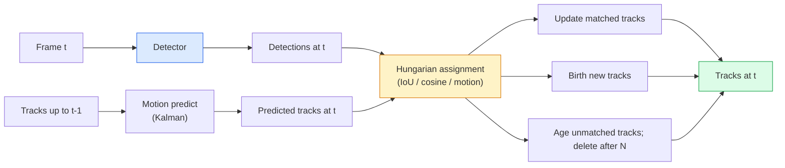

# Многообъектное отслеживание и память видео (Video Memory)

> Отслеживание — это детекция плюс сопоставление (association). Выполняйте детекцию на каждом кадре. Сопоставляйте детекции текущего кадра с треками предыдущего кадра по ID.

**Тип:** Build**Языки:** Python**Предварительные требования:** Фаза 4 Урок 06 (YOLO Detection), Фаза 4 Урок 08 (Mask R-CNN), Фаза 4 Урок 24 (SAM 3)**Время:** ~60 минут
## Учебные цели

- Различать отслеживание по детекциям (tracking-by-detection) и отслеживание на основе запросов (query-based tracking), называть семейства алгоритмов (SORT, DeepSORT, ByteTrack, BoT-SORT, трекер памяти SAM 2, SAM 3.1 Object Multiplex)
- Реализовать с нуля сопоставление IoU + венгерский алгоритм (Hungarian assignment) для классического отслеживания по детекциям
- Объяснить банк памяти (memory bank) SAM 2 и почему он лучше справляется с перекрытиями (occlusion), чем сопоставление на основе IoU
- Читать три метрики отслеживания (MOTA, IDF1, HOTA) и выбирать, какая из них важна для конкретной задачи

## Проблема

Детектор сообщает, где находятся объекты на одном кадре. Трекер сообщает, какая детекция в кадре `t` относится к тому же объекту, что и детекция в кадре `t-1`. Без этого нельзя посчитать объекты, пересекающие линию, проследить мяч сквозь перекрытие (occlusion) или узнать, что «машина №4 находится в полосе движения уже 8 секунд».

Отслеживание необходимо для любого продукта, работающего с видео: спортивная аналитика, видеонаблюдение, автономное вождение, анализ медицинского видео, мониторинг дикой природы, подсчёт вордмарок (wordmark counting). Базовые компоненты общие: детектор на каждом кадре, модель движения (фильтр Калмана или что-то более сложное), этап сопоставления (association) (венгерский алгоритм по IoU / косинусному сходству / обученным признакам) и жизненный цикл трека (создание, обновление, удаление).

2026 год принёс два новых паттерна: **отслеживание на основе памяти в SAM 2** (признаковая память вместо сопоставления по модели движения) и **SAM 3.1 Object Multiplex** (разделяемая память для множества экземпляров одного концепта). Этот урок сначала разбирает классический стек, а затем — подход на основе памяти.

## Концепция

### Отслеживание по детекциям



Каждый трекер, с которым вы столкнётесь в 2026 году, — это вариация данного цикла. Различия:

- **SORT** (2016): фильтр Калмана + венгерский алгоритм по IoU. Простой, быстрый, без модели внешнего вида.
- **DeepSORT** (2017): SORT + признак внешнего вида на основе CNN для каждого трека (ReID-эмбеддинг). Лучше справляется с пересечениями траекторий.
- **ByteTrack** (2021): сопоставляет детекции с низкой уверенностью на втором этапе; не требует признаков внешнего вида, но лучший по результатам на MOT17.
- **BoT-SORT** (2022): Byte + компенсация движения камеры + ReID.
- **StrongSORT / OC-SORT** — потомки ByteTrack с улучшенными моделями движения и внешнего вида.

### Фильтр Калмана в одном абзаце

Фильтр Калмана поддерживает для каждого трека состояние `(x, y, w, h, dx, dy, dw, dh)` с ковариацией. На каждом кадре состояние сначала **предсказывается (predict)** с помощью модели постоянной скорости, а затем **обновляется (update)** с использованием сопоставленной детекции. Обновление доверяет детекции сильнее, когда неопределённость предсказания высока. Это даёт сглаженные траектории и возможность продолжать трек через короткое перекрытие (1-5 кадров).

Каждый классический трекер использует фильтр Калмана на этапе предсказания движения.

### Венгерский алгоритм

Дана матрица стоимости `M x N` (треки x детекции); нужно найти взаимно однозначное назначение, минимизирующее суммарную стоимость. Стоимость обычно равна `1 - IoU(track_bbox, detection_bbox)` или отрицательному косинусному сходству признаков внешнего вида. Время выполнения — O((M+N)^3); при M, N до ~1000 этого достаточно быстро в Python через `scipy.optimize.linear_sum_assignment`.

### Ключевая идея ByteTrack

Стандартные трекеры отбрасывают детекции с низкой уверенностью (< 0.5). ByteTrack сохраняет их как **кандидатов второго этапа**: после сопоставления треков с детекциями высокой уверенности несопоставленные треки пытаются сопоставиться с детекциями низкой уверенности при чуть более мягком пороге IoU. Это восстанавливает короткие перекрытия и смены ID рядом с толпой.

### Отслеживание на основе памяти в SAM 2

SAM 2 обрабатывает видео, поддерживая **банк памяти (memory bank)** с пространственно-временными признаками для каждого экземпляра. Получив промпт (клик, рамку, текст) на одном кадре, модель кодирует экземпляр в память. На последующих кадрах к памяти применяется перекрёстное внимание (cross-attention) относительно признаков нового кадра, и декодер создаёт маску для того же экземпляра на новом кадре.

Ни фильтра Калмана, ни венгерского алгоритма назначения. Сопоставление здесь неявно заложено в операции внимания к памяти (memory-attention).

Плюсы:
- Устойчив к сильным перекрытиям (память переносит идентичность экземпляра через много кадров).
- Поддерживает открытый словарь при сочетании с текстовыми промптами SAM 3.
- Работает без отдельной модели движения.

Минусы:
- Медленнее, чем ByteTrack, при отслеживании множества объектов.
- Банк памяти растёт, что ограничивает контекстное окно.

### SAM 3.1 Object Multiplex

Более ранние версии отслеживания в SAM 2 / SAM 3 хранят отдельный банк памяти на каждый экземпляр. Для 50 объектов — 50 банков памяти. Object Multiplex (март 2026) сворачивает их в одну разделяемую память с токенами-запросами для каждого экземпляра (per-instance query tokens). Стоимость растёт сублинейно относительно числа экземпляров.

В 2026 году Multiplex стал вариантом по умолчанию для отслеживания толпы: концертные толпы, работники складов, перекрёстки с движением.

### Три метрики, которые нужно знать

- **MOTA (Multi-Object Tracking Accuracy)** — 1 - (FN + FP + ID switches) / GT. Взвешена по типу ошибки; единая метрика, которая смешивает ошибки детекции и сопоставления.
- **IDF1 (ID F1)** — гармоническое среднее точности и полноты ID. Фокусируется именно на том, насколько хорошо каждый эталонный трек (ground-truth track) сохраняет свой ID во времени. Лучше, чем MOTA, для задач, чувствительных к сменам ID.
- **HOTA (Higher Order Tracking Accuracy)** — раскладывается на точность детекции (DetA) и точность сопоставления (AssA). Стандарт сообщества с 2020 года; самая полная метрика.

Для видеонаблюдения (кто есть кто): в отчётах используют IDF1. Для спортивной аналитики (подсчёт передач): HOTA. Для общего академического сравнения: HOTA.

```figure
cv3-track-assoc
```

## Реализация

### Шаг 1: Матрица стоимости на основе IoU

```python
import numpy as np


def bbox_iou(a, b):
    """
    a, b: (N, 4) arrays of [x1, y1, x2, y2].
    Returns (N_a, N_b) IoU matrix.
    """
    ax1, ay1, ax2, ay2 = a[:, 0], a[:, 1], a[:, 2], a[:, 3]
    bx1, by1, bx2, by2 = b[:, 0], b[:, 1], b[:, 2], b[:, 3]
    inter_x1 = np.maximum(ax1[:, None], bx1[None, :])
    inter_y1 = np.maximum(ay1[:, None], by1[None, :])
    inter_x2 = np.minimum(ax2[:, None], bx2[None, :])
    inter_y2 = np.minimum(ay2[:, None], by2[None, :])
    inter = np.clip(inter_x2 - inter_x1, 0, None) * np.clip(inter_y2 - inter_y1, 0, None)
    area_a = (ax2 - ax1) * (ay2 - ay1)
    area_b = (bx2 - bx1) * (by2 - by1)
    union = area_a[:, None] + area_b[None, :] - inter
    return inter / np.clip(union, 1e-8, None)
```

### Шаг 2: Минимальный трекер в стиле SORT

Фиксированный фильтр Калмана с постоянной скоростью здесь опущен для краткости — мы используем простое сопоставление по IoU; в продакшене этап предсказания Калмана необходим. Полную версию предоставляет Python-пакет `sort`.

```python
from scipy.optimize import linear_sum_assignment


class Track:
    def __init__(self, tid, bbox, frame):
        self.id = tid
        self.bbox = bbox
        self.last_frame = frame
        self.hits = 1

    def update(self, bbox, frame):
        self.bbox = bbox
        self.last_frame = frame
        self.hits += 1


class SimpleTracker:
    def __init__(self, iou_threshold=0.3, max_age=5):
        self.tracks = []
        self.next_id = 1
        self.iou_threshold = iou_threshold
        self.max_age = max_age

    def step(self, detections, frame):
        if not self.tracks:
            for d in detections:
                self.tracks.append(Track(self.next_id, d, frame))
                self.next_id += 1
            return [(t.id, t.bbox) for t in self.tracks]

        track_boxes = np.array([t.bbox for t in self.tracks])
        det_boxes = np.array(detections) if len(detections) else np.empty((0, 4))

        iou = bbox_iou(track_boxes, det_boxes) if len(det_boxes) else np.zeros((len(track_boxes), 0))
        cost = 1 - iou
        cost[iou < self.iou_threshold] = 1e6

        matched_track = set()
        matched_det = set()
        if cost.size > 0:
            row, col = linear_sum_assignment(cost)
            for r, c in zip(row, col):
                if cost[r, c] < 1.0:
                    self.tracks[r].update(det_boxes[c], frame)
                    matched_track.add(r); matched_det.add(c)

        for i, d in enumerate(det_boxes):
            if i not in matched_det:
                self.tracks.append(Track(self.next_id, d, frame))
                self.next_id += 1

        self.tracks = [t for t in self.tracks if frame - t.last_frame <= self.max_age]
        return [(t.id, t.bbox) for t in self.tracks]
```

60 строк. Принимает детекции по кадрам, возвращает ID треков по кадрам. Реальные системы добавляют предсказание Калмана, повторное сопоставление второго этапа ByteTrack и признаки внешнего вида.

### Шаг 3: Тест на синтетической траектории

```python
def synthetic_frames(num_frames=20, num_objects=3, H=240, W=320, seed=0):
    rng = np.random.default_rng(seed)
    starts = rng.uniform(20, 200, size=(num_objects, 2))
    velocities = rng.uniform(-5, 5, size=(num_objects, 2))
    frames = []
    for f in range(num_frames):
        dets = []
        for i in range(num_objects):
            cx, cy = starts[i] + f * velocities[i]
            dets.append([cx - 10, cy - 10, cx + 10, cy + 10])
        frames.append(dets)
    return frames


tracker = SimpleTracker()
for f, dets in enumerate(synthetic_frames()):
    tracks = tracker.step(dets, f)
```

Три объекта, двигающиеся по прямым линиям, должны сохранять свои ID на протяжении всех 20 кадров.

### Шаг 4: Метрика смены ID

```python
def count_id_switches(tracks_per_frame, gt_per_frame):
    """
    tracks_per_frame:  list of list of (track_id, bbox)
    gt_per_frame:      list of list of (gt_id, bbox)
    Returns number of ID switches.
    """
    prev_assignment = {}
    switches = 0
    for tracks, gts in zip(tracks_per_frame, gt_per_frame):
        if not tracks or not gts:
            continue
        t_boxes = np.array([b for _, b in tracks])
        g_boxes = np.array([b for _, b in gts])
        iou = bbox_iou(g_boxes, t_boxes)
        for g_idx, (gt_id, _) in enumerate(gts):
            j = iou[g_idx].argmax()
            if iou[g_idx, j] > 0.5:
                t_id = tracks[j][0]
                if gt_id in prev_assignment and prev_assignment[gt_id] != t_id:
                    switches += 1
                prev_assignment[gt_id] = t_id
    return switches
```

Это упрощённая метрика, близкая к IDF1: она считает, сколько раз эталонный объект (ground-truth object) меняет назначенный ему предсказанный ID трека. Реальные инструменты для MOTA / IDF1 / HOTA находятся в `py-motmetrics` и `TrackEval`.

## Использование

Продакшен-трекеры в 2026 году:

- `ultralytics` — встроенные YOLOv8 + ByteTrack / BoT-SORT. `results = model.track(source, tracker="bytetrack.yaml")`. Вариант по умолчанию.
- `supervision` (Roboflow) — обёртки над ByteTrack плюс утилиты аннотирования.
- SAM 2 / SAM 3.1 — отслеживание на основе памяти через `processor.track()`.
- Собственный стек: детектор (YOLOv8 / RT-DETR) + `sort-tracker` / `OC-SORT` / `StrongSORT`.

Выбор:

- Пешеходы / автомобили / коробки при 30+ fps: **ByteTrack с ultralytics**.
- Много экземпляров одного класса в толпе: **SAM 3.1 Object Multiplex**.
- Сильные перекрытия при различимом внешнем виде: **DeepSORT / StrongSORT** (признаки ReID).
- Спорт / сложные взаимодействия: **BoT-SORT** или обучаемые трекеры (MOTRv3).

## Итоговые артефакты

Этот урок производит:

- `outputs/prompt-tracker-picker.md` — выбирает SORT / ByteTrack / BoT-SORT / SAM 2 / SAM 3.1 в зависимости от типа сцены, характера перекрытий и бюджета задержки.
- `outputs/skill-mot-evaluator.md` — пишет полный инструмент оценивания (evaluation harness) для MOTA / IDF1 / HOTA относительно эталонных треков (ground-truth tracks).

## Упражнения

1. **(Лёгкое)** Запустите приведённый выше синтетический трекер с 3, 10 и 30 объектами. Сообщите число смен ID в каждом случае. Определите, где простое сопоставление только по IoU начинает давать сбои.
2. **(Среднее)** Добавьте перед сопоставлением этап предсказания фильтром Калмана с постоянной скоростью. Покажите, что короткие (2-3 кадра) перекрытия больше не вызывают смен ID.
3. **(Сложное)** Интегрируйте трекер SAM 2 на основе памяти (через `transformers`) в качестве альтернативного backend-трекера. Запустите SimpleTracker и SAM 2 на 30-секундном ролике с толпой людей и сравните число смен ID, вручную разметив эталонные ID для 5 заметных людей.

## Ключевые термины

| Термин | Как говорят | Что это значит на самом деле |
|------|----------------|----------------------|
| Отслеживание по детекциям (Tracking-by-detection) | «Сначала детектируй, потом сопоставляй» | Детектор на каждом кадре + назначение венгерским алгоритмом по IoU / внешнему виду |
| Фильтр Калмана (Kalman filter) | «Предсказание движения» | Линейная динамика + ковариация для сглаженных предсказаний трека и обработки перекрытий |
| Венгерский алгоритм (Hungarian algorithm) | «Оптимальное назначение» | Решает задачу двудольного сопоставления с минимальной стоимостью; `scipy.optimize.linear_sum_assignment` |
| ByteTrack | «Второй проход по детекциям с низкой уверенностью» | Повторно сопоставляет несопоставленные треки с детекциями низкой уверенности, чтобы восстановиться после коротких перекрытий |
| DeepSORT | «SORT + внешний вид» | Добавляет признак ReID для сопоставления между кадрами; лучше сохраняет ID |
| Банк памяти (Memory bank) | «Приём SAM 2» | Пространственно-временные признаки для каждого экземпляра, хранящиеся по кадрам; перекрёстное внимание (cross-attention) заменяет явное сопоставление |
| Object Multiplex | «Разделяемая память SAM 3.1» | Единая разделяемая память с запросами для каждого экземпляра для быстрого отслеживания множества объектов |
| HOTA | «Современная метрика отслеживания» | Раскладывается на точность детекции и точность сопоставления; стандарт сообщества |

## Дополнительные материалы

- [SORT (Bewley et al., 2016)](https://arxiv.org/abs/1602.00763) — минимальная статья про отслеживание по детекциям
- [DeepSORT (Wojke et al., 2017)](https://arxiv.org/abs/1703.07402) — добавляет признак внешнего вида
- [ByteTrack (Zhang et al., 2022)](https://arxiv.org/abs/2110.06864) — второй проход по детекциям с низкой уверенностью
- [BoT-SORT (Aharon et al., 2022)](https://arxiv.org/abs/2206.14651) — компенсация движения камеры
- [HOTA (Luiten et al., 2020)](https://arxiv.org/abs/2009.07736) — декомпозированная метрика отслеживания
- [SAM 2 video segmentation (Meta, 2024)](https://ai.meta.com/sam2/) — трекер на основе памяти
- [SAM 3.1 Object Multiplex (Meta, March 2026)](https://ai.meta.com/blog/segment-anything-model-3/)
