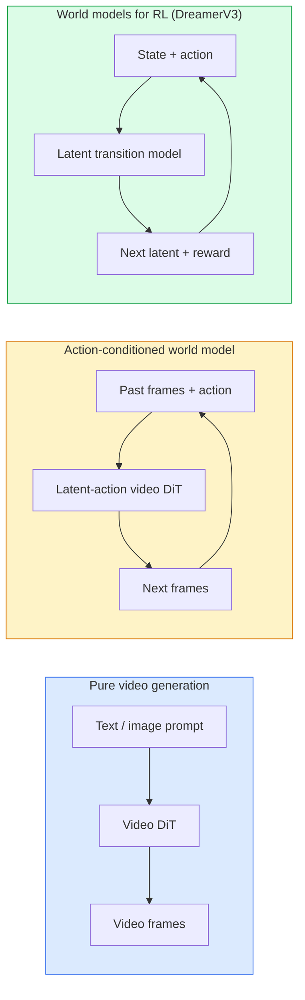

# Мировые модели и видеодиффузия

> Видеомодель, которая предсказывает следующие секунды сцены, — это симулятор мира. Обусловьте это предсказание действиями — и вы получите обученный игровой движок.

**Тип:** Learn + Build
**Языки:** Python
**Предварительные требования:** этап 4, урок 10 («Диффузия»), этап 4, урок 12 («Понимание видео»), этап 4, урок 23 («DiT + выпрямленный поток»)
**Время:** ~75 минут

## Учебные цели

- Объяснить разницу между чистой моделью генерации видео (Sora 2) и моделью мира (world model), обусловленной действиями (Genie 3, DreamerV3)
- Описать видео-DiT: пространственно-временные патчи, 3D-позиционное кодирование, совместное внимание по токенам (T, H, W)
- Проследить, как модель мира встраивается в робототехнику: VLM планирует → видеомодель моделирует → обратная динамика выдаёт действия
- Выбирать между Sora 2, Genie 3, Runway GWM-1 Worlds, Wan-Video и HunyuanVideo для конкретного случая использования (креативное видео, интерактивная симуляция, синтез для автономного вождения)

## Проблема

Генерация видео и моделирование мира сошлись в 2026 году. Модель, способная сгенерировать связную минуту видео, в каком-то смысле выучила, как движется мир: постоянство объектов, гравитацию, причинность, стиль. Если обусловить это предсказание действиями (пойти влево, открыть дверь), видеомодель становится обучаемым симулятором, способным заменить игровой движок, симулятор вождения или робототехническую среду.

Ставки конкретны. Genie 3 генерирует играбельные окружения из одного изображения. Runway GWM-1 Worlds синтезирует бесконечные исследуемые сцены. Sora 2 создаёт минутные видео с синхронизированным аудио и смоделированной физикой. NVIDIA Cosmos-Drive, Wayve Gaia-2 и Tesla DrivingWorld генерируют реалистичное видео вождения для обучающих данных беспилотных автомобилей. Парадигма модели мира незаметно становится основой переноса из симуляции в реальность в робототехнике.

Этот урок даёт общую картину этапа 4. Он связывает генерацию изображений, понимание видео и агентное рассуждение в архитектурный паттерн, к которому движется передовой край исследований.

## Концепция

### Три семейства моделирования мира



- **Sora 2** — чистая генерация видео, обусловленная промптами. Нет интерфейса действий. Вы не можете «управлять» ею в процессе генерации.
- **Genie 3**, **GWM-1 Worlds**, **Mirage / Magica** — модели мира, обусловленные действиями. Они выводят латентные действия из наблюдаемого видео, а затем обусловливают этими действиями предсказания будущих кадров. Такие модели интерактивны: вы нажимаете клавиши или двигаете камеру, и сцена реагирует.
- **DreamerV3** и классическое семейство RL-моделей мира предсказывают в латентном пространстве с явным обусловливанием действиями и обучаются на сигнале вознаграждения. Они менее наглядны, но полезнее для RL, эффективно использующего выборки.

### Архитектура видео-DiT

```
Video latent:          (C, T, H, W)
Patchify (spatial):    grid of P_h x P_w patches per frame
Patchify (temporal):   group P_t frames into a temporal patch
Resulting tokens:      (T / P_t) * (H / P_h) * (W / P_w) tokens
```

Позиционное кодирование трёхмерно: вращательное или обучаемый эмбеддинг для каждой координаты (t, h, w). Внимание может быть:

- **Полное совместное** — все токены внимают всем токенам. O(N^2) при N токенах. Непрактично для длинных видео.
- **Разделённое** — чередование временного внимания (та же пространственная позиция, по времени: `(H*W) * T^2`) и пространственного внимания (тот же момент времени, по пространству: `T * (H*W)^2`). Используется в TimeSformer и большинстве видео-DiT.
- **Оконное** — локальные окна в (t, h, w). Используется в Video Swin.

Каждая модель видеодиффузии 2026 года использует один из этих трёх паттернов, а также обусловливание AdaLN (урок 23) и выпрямленный поток.

### Обусловливание действиями: модели с латентным действием

Genie обучается **латентному действию** для каждого кадра, дискриминативно предсказывая действие между парой последовательных кадров. Декодер модели затем обусловливается выведенным латентным действием, а не явными клавишами клавиатуры. При инференсе пользователь может задать латентное действие (или сэмплировать его из нового априорного распределения), и модель сгенерирует следующий кадр, согласующийся с этим действием.

Sora полностью обходится без интерфейса действий. Её декодер предсказывает следующие пространственно-временные токены по прошлым пространственно-временным токенам. Промпт задаёт начало; ничто не управляет генерацией в процессе.

### Физическая правдоподобность

В релизе Sora 2 2026 года особо подчёркивалась **физическая правдоподобность**: вес, баланс, постоянство объектов, причинно-следственные связи. Команда измеряла её по выставленным вручную оценкам правдоподобности; по сравнению с Sora 1 модель заметно улучшилась в сценах с падающими предметами, столкновениями персонажей и намеренными неудачами (например, неудавшимся прыжком).

Правдоподобность остаётся главным режимом отказа. Видео 2024-2025 годов, где люди едят спагетти или пьют из стаканов, выявляли отсутствие у модели устойчивого представления объектов. Модели 2026 года (Sora 2, Runway Gen-5, HunyuanVideo) снижают, но не устраняют эти проблемы.

### Модели мира для автономного вождения

Модели мира для вождения генерируют реалистичные дорожные сцены, обусловленные траекториями, ограничивающими рамками или навигационными картами. Применение:

- **Cosmos-Drive-Dreams** (NVIDIA) — генерирует минуты видео вождения для обучения RL.
- **Gaia-2** (Wayve) — синтез сцен, обусловленный траекторией, для оценки политики.
- **DrivingWorld** (Tesla) — моделирует разнообразную погоду, время суток, условия трафика.
- **Vista** (ByteDance) — реактивный синтез сцен вождения.

Они заменяют дорогостоящий сбор данных из реального мира для граничных случаев — переход пешеходов в неположенном месте ночью, обледенелые перекрёстки, необычные типы транспортных средств, — которые иначе потребовали бы миллионов миль вождения.

### Робототехнический стек: VLM + видеомодель + обратная динамика

Формирующийся трёхкомпонентный цикл робототехники:

1. **VLM** разбирает цель («возьми красную чашку»), планирует последовательность действий высокого уровня.
2. **Модель генерации видео** моделирует, как будет выглядеть выполнение каждого действия, — предсказывает наблюдения на N кадров вперёд.
3. **Модель обратной динамики** извлекает конкретные моторные команды, которые произвели бы эти наблюдения.

Это заменяет формирование функции вознаграждения и RL, требующее больших объёмов выборок. Модель мира отвечает за «воображение», а обратная динамика замыкает контур управления исполнительными механизмами. Genie Envisioner — одна из реализаций; многие исследовательские группы сходятся к этой структуре.

### Оценивание

- **Визуальное качество** — FVD (расстояние Фреше для видео), пользовательские исследования.
- **Согласованность с промптом** — CLIPScore для каждого кадра, оценивание в стиле VQA.
- **Физическая правдоподобность** — оценивается вручную на наборе бенчмарков (внутренний бенчмарк Sora 2, VBench).
- **Управляемость** (для интерактивных моделей мира) — согласованность «действие → наблюдение»; можно ли вернуться в предыдущее состояние?

### Ландшафт моделей в 2026 году

| Модель | Назначение | Параметры | Результат | Лицензия |
|-------|-----|------------|--------|---------|
| Sora 2 | генерация видео и аудио по тексту | — | 1 мин, 1080p + аудио | только API |
| Runway Gen-5 | генерация видео по тексту или изображению | — | ролики по 10 с | API |
| Runway GWM-1 Worlds | интерактивный мир | — | бесконечная генерация 3D-сцены | API |
| Genie 3 | интерактивный мир из изображения | 11B+ | играбельные кадры | предварительная исследовательская версия |
| Wan-Video 2.1 | открытая генерация видео по тексту | 14B | высококачественные ролики | некоммерческая |
| HunyuanVideo | открытая генерация видео по тексту | 13B | ролики по 10 с | разрешительная |
| Cosmos / Cosmos-Drive | симуляция автономного вождения | 7-14B | сцены вождения | открытая NVIDIA |
| Magica / Mirage 2 | игровой движок на базе ИИ | — | изменяемые миры | продукт |

```figure
v4-world-rollout
```

## Реализация

### Шаг 1: 3D-патчификация для видео

```python
import torch
import torch.nn as nn


class VideoPatch3D(nn.Module):
    def __init__(self, in_channels=4, dim=64, patch_t=2, patch_h=2, patch_w=2):
        super().__init__()
        self.proj = nn.Conv3d(
            in_channels, dim,
            kernel_size=(patch_t, patch_h, patch_w),
            stride=(patch_t, patch_h, patch_w),
        )
        self.patch_t = patch_t
        self.patch_h = patch_h
        self.patch_w = patch_w

    def forward(self, x):
        # x: (N, C, T, H, W)
        x = self.proj(x)
        n, c, t, h, w = x.shape
        tokens = x.reshape(n, c, t * h * w).transpose(1, 2)
        return tokens, (t, h, w)
```

3D-свёртка с шагом (stride), равным размеру ядра, действует как пространственно-временной патчификатор. Сетка токенов `(T, H, W) -> (T/2, H/2, W/2)`.

### Шаг 2: Трёхмерное вращательное позиционное кодирование

Вращательные позиционные эмбеддинги (RoPE), применяемые раздельно по осям `t`, `h`, `w`:

```python
def rope_3d(tokens, t_dim, h_dim, w_dim, grid):
    """
    tokens: (N, T*H*W, D)
    grid: (T, H, W) sizes
    t_dim + h_dim + w_dim == D
    """
    T, H, W = grid
    n, seq, d = tokens.shape
    if t_dim + h_dim + w_dim != d:
        raise ValueError(f"t_dim+h_dim+w_dim ({t_dim}+{h_dim}+{w_dim}) must equal D={d}")
    assert seq == T * H * W
    t_idx = torch.arange(T, device=tokens.device).repeat_interleave(H * W)
    h_idx = torch.arange(H, device=tokens.device).repeat_interleave(W).repeat(T)
    w_idx = torch.arange(W, device=tokens.device).repeat(T * H)
    # Simplified: just scale channels by frequencies. Real RoPE rotates pairs.
    freqs_t = torch.exp(-torch.log(torch.tensor(10000.0)) * torch.arange(t_dim // 2, device=tokens.device) / (t_dim // 2))
    freqs_h = torch.exp(-torch.log(torch.tensor(10000.0)) * torch.arange(h_dim // 2, device=tokens.device) / (h_dim // 2))
    freqs_w = torch.exp(-torch.log(torch.tensor(10000.0)) * torch.arange(w_dim // 2, device=tokens.device) / (w_dim // 2))
    emb_t = torch.cat([torch.sin(t_idx[:, None] * freqs_t), torch.cos(t_idx[:, None] * freqs_t)], dim=-1)
    emb_h = torch.cat([torch.sin(h_idx[:, None] * freqs_h), torch.cos(h_idx[:, None] * freqs_h)], dim=-1)
    emb_w = torch.cat([torch.sin(w_idx[:, None] * freqs_w), torch.cos(w_idx[:, None] * freqs_w)], dim=-1)
    return tokens + torch.cat([emb_t, emb_h, emb_w], dim=-1)
```

Упрощённая аддитивная форма. Настоящий RoPE вращает парные каналы на определённых частотах; позиционная информация при этом та же.

### Шаг 3: Блок разделённого внимания

```python
class DividedAttentionBlock(nn.Module):
    def __init__(self, dim=64, heads=2):
        super().__init__()
        self.time_attn = nn.MultiheadAttention(dim, heads, batch_first=True)
        self.space_attn = nn.MultiheadAttention(dim, heads, batch_first=True)
        self.ln1 = nn.LayerNorm(dim)
        self.ln2 = nn.LayerNorm(dim)
        self.ln3 = nn.LayerNorm(dim)
        self.mlp = nn.Sequential(nn.Linear(dim, 4 * dim), nn.GELU(), nn.Linear(4 * dim, dim))

    def forward(self, x, grid):
        T, H, W = grid
        n, seq, d = x.shape
        # time attention: same (h, w), across t
        xt = x.view(n, T, H * W, d).permute(0, 2, 1, 3).reshape(n * H * W, T, d)
        a, _ = self.time_attn(self.ln1(xt), self.ln1(xt), self.ln1(xt), need_weights=False)
        xt = (xt + a).reshape(n, H * W, T, d).permute(0, 2, 1, 3).reshape(n, seq, d)
        # space attention: same t, across (h, w)
        xs = xt.view(n, T, H * W, d).reshape(n * T, H * W, d)
        a, _ = self.space_attn(self.ln2(xs), self.ln2(xs), self.ln2(xs), need_weights=False)
        xs = (xs + a).reshape(n, T, H * W, d).reshape(n, seq, d)
        xs = xs + self.mlp(self.ln3(xs))
        return xs
```

Временное внимание действует внутри каждой пространственной позиции по времени, а пространственное — внутри каждого кадра по позициям. Две операции O(T^2 + (HW)^2) вместо одной O((THW)^2). Это основа TimeSformer и каждой современной видео-DiT.

### Шаг 4: Собираем крошечную видео-DiT

```python
class TinyVideoDiT(nn.Module):
    def __init__(self, in_channels=4, dim=64, depth=2, heads=2):
        super().__init__()
        self.patch = VideoPatch3D(in_channels=in_channels, dim=dim, patch_t=2, patch_h=2, patch_w=2)
        self.blocks = nn.ModuleList([DividedAttentionBlock(dim, heads) for _ in range(depth)])
        self.out = nn.Linear(dim, in_channels * 2 * 2 * 2)

    def forward(self, x):
        tokens, grid = self.patch(x)
        for blk in self.blocks:
            tokens = blk(tokens, grid)
        return self.out(tokens), grid
```

Это не рабочий видеогенератор, а структурная демонстрация, подтверждающая, что все компоненты согласованы по форме тензоров.

### Шаг 5: Проверка форм тензоров

```python
vid = torch.randn(1, 4, 8, 16, 16)  # (N, C, T, H, W)
model = TinyVideoDiT()
out, grid = model(vid)
print(f"input  {tuple(vid.shape)}")
print(f"tokens grid {grid}")
print(f"output {tuple(out.shape)}")
```

После патчификации ожидается `grid = (4, 8, 8)` и `out = (1, 256, 32)`; затем голова проецирует каждый токен в пространственно-временной патч, готовый к обратной депатчификации в видео.

## Использование

Способы доступа в производственной среде на 2026 год:

- **Sora 2 API** (OpenAI) — генерация видео по тексту, синхронизированное аудио. Премиальные цены.
- **Runway Gen-5 / GWM-1** (Runway) — генерация видео по изображению, интерактивные миры.
- **Wan-Video 2.1 / HunyuanVideo** — открытый исходный код, самостоятельное размещение.
- **Cosmos / Cosmos-Drive** (NVIDIA) — открытые веса для симуляции вождения.
- **Genie 3** — предварительная исследовательская версия, доступ по запросу.

Для создания интерактивной демонстрации модели мира начните с Wan-Video ради качества и добавьте адаптер латентного действия для интерактивности. Для симуляции автономного вождения Cosmos-Drive служит открытым эталоном 2026 года.

Для робототехники — стек, который встречается на практике:

1. Языковая цель -> VLM (Qwen3-VL) -> план высокого уровня.
2. План -> видеомодель с латентным действием -> воображаемая траектория.
3. Траектория -> модель обратной динамики -> действия низкого уровня.
4. Выполненные действия -> наблюдение возвращается на шаг 1.

## Итоговые артефакты

Этот урок производит:

- `outputs/prompt-video-model-picker.md` — выбирает между Sora 2 / Runway / Wan / HunyuanVideo / Cosmos по задаче, лицензии и задержке.
- `outputs/skill-physical-plausibility-checks.md` — навык, определяющий автоматизированные проверки (постоянство объектов, гравитация, непрерывность) для запуска на любом сгенерированном видео перед публикацией.

## Упражнения

1. **(Лёгкое)** Вычислите количество токенов для 5-секундного видео 360p при patch-t=2, patch-h=8, patch-w=8. Оцените затраты памяти для внимания при таком размере.
2. **(Среднее)** Замените приведённый выше блок разделённого внимания на блок полного совместного внимания и измерьте форму и число параметров. Объясните, почему разделённое внимание необходимо для реальных видеомоделей.
3. **(Сложное)** Постройте минимальную видеомодель с латентным действием: возьмите набор данных из троек (frame_t, action_t, frame_{t+1}) (любая простая 2D-игра), обучите крошечную видео-DiT, обусловленную эмбеддингами действий, и покажите, что разные действия приводят к разным следующим кадрам.

## Ключевые термины

| Термин | Как обычно говорят | Что это означает на самом деле |
|------|----------------|----------------------|
| Модель мира | «Обученный симулятор» | Модель, которая предсказывает будущие наблюдения по состоянию и действию |
| Видео-DiT | «Пространственно-временной трансформер» | Диффузионный трансформер с трёхмерной патчификацией и разделённым вниманием |
| Латентное действие | «Выведенное управление» | Дискретное или непрерывное латентное действие, выведенное по парам кадров и используемое для обусловливания генерации следующего кадра |
| Разделённое внимание | «Сначала время, затем пространство» | Две операции внимания в каждом блоке: сначала по времени, затем по пространству, чтобы вычислительная сложность O(N^2) оставалась приемлемой |
| Постоянство объектов | «Объекты остаются реальными» | Свойство сцены, которому должны научиться видеомодели; классический режим отказа в сценах с едой и стеклянной посудой |
| FVD | «Расстояние Фреше для видео» | Аналог FID для видео; основная метрика визуального качества |
| Модель обратной динамики | «От наблюдений к действиям» | По паре (состояние, следующее состояние) выдаёт связывающее их действие и замыкает робототехнический цикл |
| Cosmos-Drive | «Симулятор вождения NVIDIA» | Модель мира с открытыми весами для автономного вождения, RL и оценивания |

## Дополнительные материалы

- [Технический отчёт Sora (OpenAI)](https://openai.com/index/video-generation-models-as-world-simulators/)
- [Genie: Generative Interactive Environments (Bruce et al., 2024)](https://arxiv.org/abs/2402.15391) — модели мира с латентными действиями
- [TimeSformer (Bertasius et al., 2021)](https://arxiv.org/abs/2102.05095) — разделённое внимание для видеотрансформеров
- [DreamerV3 (Hafner et al., 2023)](https://arxiv.org/abs/2301.04104) — модели мира для RL
- [Cosmos-Drive-Dreams (NVIDIA, 2025)](https://research.nvidia.com/labs/toronto-ai/cosmos-drive-dreams/) — модель мира для вождения
- [Top 10 Video Generation Models 2026 (DataCamp)](https://www.datacamp.com/blog/top-video-generation-models)
- [From Video Generation to World Model — репозиторий обзора](https://github.com/ziqihuangg/Awesome-From-Video-Generation-to-World-Model/)
