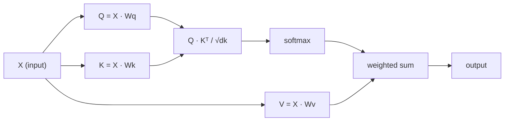

# Самовнимание с нуля

> Внимание (attention) — это таблица поиска, в которой каждое слово спрашивает «кто для меня важен?» — и учится отвечать на этот вопрос.

**Тип:** Build
**Языки:** Python
**Предварительные требования:** этап 3 («Основы глубокого обучения»), этап 5, урок 10 («Последовательность в последовательность»)
**Время:** ~90 минут

## Цели обучения

- Реализовать масштабированное самовнимание на основе скалярного произведения (scaled dot-product self-attention) с нуля, используя только NumPy, включая проекции запроса, ключа и значения (query, key, value) и взвешенную сумму с softmax
- Построить слой многоголового внимания (multi-head attention), который разбивает вычисления по головам, параллельно вычисляет внимание и конкатенирует результаты
- Проследить, как матрица внимания захватывает связи между токенами, и объяснить, почему масштабирование на sqrt(d_k) предотвращает насыщение softmax
- Применить каузальное маскирование, чтобы превратить двунаправленное внимание в авторегрессионное (декодерное) внимание

## Проблема

RNN обрабатывают последовательности по одному токену за раз. К моменту достижения токена 50 информация из токена 1 уже прошла через 50 шагов сжатия. Дальние зависимости сжимаются в скрытое состояние фиксированного размера — узкое место, которое никакой гейтинг LSTM не устраняет полностью.

Статья про внимание Bahdanau 2014 года показала решение: пусть декодер оглядывается назад на каждую позицию энкодера и решает, какие из них важны для текущего шага. Но это по-прежнему было прикручено к RNN. Статья 2017 года «Attention Is All You Need» задала более острый вопрос: что если внимание — это *единственный* механизм? Никакой рекуррентности. Никакой свёртки. Только внимание.

Самовнимание позволяет каждой позиции в последовательности обращать внимание на все остальные позиции за один параллельный шаг. Именно это делает трансформеры быстрыми, масштабируемыми и доминирующими.

## Концепция

### Аналогия с поиском в базе данных

Представьте внимание как мягкий поиск в базе данных:

```
Traditional database:
  Query: "capital of France"  -->  exact match  -->  "Paris"

Attention:
  Query: "capital of France"  -->  similarity to ALL keys  -->  weighted blend of ALL values
```

Каждый токен генерирует три вектора:
- **Запрос (Q)**: «Что я ищу?»
- **Ключ (K)**: «Что я содержу?»
- **Значение (V)**: «Какую информацию я предоставлю, если меня выберут?»

Скалярное произведение между запросом и всеми ключами даёт оценки внимания. Высокая оценка означает «этот ключ соответствует моему запросу». Эти оценки взвешивают значения. Выход — взвешенная сумма значений.

### Вычисление Q, K, V

Каждый эмбеддинг токена проецируется через три обучаемые весовые матрицы:

```
Input embeddings (sequence of n tokens, each d-dimensional):

  X = [x1, x2, x3, ..., xn]       shape: (n, d)

Three weight matrices:

  Wq  shape: (d, dk)
  Wk  shape: (d, dk)
  Wv  shape: (d, dv)

Projections:

  Q = X @ Wq    shape: (n, dk)      each token's query
  K = X @ Wk    shape: (n, dk)      each token's key
  V = X @ Wv    shape: (n, dv)      each token's value
```

Наглядно для одного токена:

```
             Wq
  x_i ------[*]------> q_i    "What am I looking for?"
       |
       |     Wk
       +----[*]------> k_i    "What do I contain?"
       |
       |     Wv
       +----[*]------> v_i    "What do I offer?"
```

### Матрица внимания

Как только у вас есть Q, K, V для всех токенов, оценки внимания образуют матрицу:

```
Scores = Q @ K^T    shape: (n, n)

              k1    k2    k3    k4    k5
        +-----+-----+-----+-----+-----+
   q1   | 2.1 | 0.3 | 0.1 | 0.8 | 0.2 |   <- how much q1 attends to each key
        +-----+-----+-----+-----+-----+
   q2   | 0.4 | 1.9 | 0.7 | 0.1 | 0.3 |
        +-----+-----+-----+-----+-----+
   q3   | 0.2 | 0.6 | 2.3 | 0.5 | 0.1 |
        +-----+-----+-----+-----+-----+
   q4   | 0.9 | 0.1 | 0.4 | 1.7 | 0.6 |
        +-----+-----+-----+-----+-----+
   q5   | 0.1 | 0.3 | 0.2 | 0.5 | 2.0 |
        +-----+-----+-----+-----+-----+

Each row: one token's attention over the entire sequence
```

Понаблюдайте, как один запрос за раз проходит по ключам: каждая строка оценивает каждый токен, softmax превращает оценки в веса, а контекстный вектор — это взвешенная смесь значений.

```figure
attention-matrix
```

### Зачем масштабировать?

Скалярные произведения растут вместе с размерностью dk. Если dk = 64, скалярные произведения могут достигать десятков, загоняя softmax в области, где градиенты затухают. Решение: делить на sqrt(dk).

```
Scaled scores = (Q @ K^T) / sqrt(dk)
```

Это удерживает значения в диапазоне, где softmax даёт полезные градиенты.

### Softmax превращает оценки в веса

Softmax преобразует необработанные оценки в распределение вероятностей по каждой строке:

```
Raw scores for q1:   [2.1, 0.3, 0.1, 0.8, 0.2]
                            |
                         softmax
                            |
Attention weights:   [0.52, 0.09, 0.07, 0.14, 0.08]   (sums to ~1.0)
```

Теперь у каждого токена есть набор весов, показывающих, насколько сильно нужно обращать внимание на каждый другой токен.

### Взвешенная сумма значений

Итоговый выход для каждого токена — это взвешенная сумма всех векторов значений:

```
output_i = sum( attention_weight[i][j] * v_j  for all j )

For token 1:
  output_1 = 0.52 * v1 + 0.09 * v2 + 0.07 * v3 + 0.14 * v4 + 0.08 * v5
```

### Полный конвейер



Формула в одну строку:

```
Attention(Q, K, V) = softmax( Q @ K^T / sqrt(dk) ) @ V
```

```figure
softmax-attention-scaling
```

## Построение

### Шаг 1: softmax с нуля

Softmax преобразует необработанные логиты в вероятности. Вычтите максимум для численной устойчивости.

```python
import numpy as np

def softmax(x):
    shifted = x - np.max(x, axis=-1, keepdims=True)
    exp_x = np.exp(shifted)
    return exp_x / np.sum(exp_x, axis=-1, keepdims=True)

logits = np.array([2.0, 1.0, 0.1])
print(f"logits:  {logits}")
print(f"softmax: {softmax(logits)}")
print(f"sum:     {softmax(logits).sum():.4f}")
```

### Шаг 2: масштабированное внимание на основе скалярного произведения

Основная функция. Принимает матрицы Q, K, V и возвращает выход внимания и матрицу весов.

```python
def scaled_dot_product_attention(Q, K, V):
    dk = Q.shape[-1]
    scores = Q @ K.T / np.sqrt(dk)
    weights = softmax(scores)
    output = weights @ V
    return output, weights
```

### Шаг 3: класс самовнимания с обучаемыми проекциями

Полный модуль самовнимания с весовыми матрицами Wq, Wk, Wv, инициализированными с масштабированием в духе Ксавье.

```python
class SelfAttention:
    def __init__(self, d_model, dk, dv, seed=42):
        rng = np.random.default_rng(seed)
        scale = np.sqrt(2.0 / (d_model + dk))
        self.Wq = rng.normal(0, scale, (d_model, dk))
        self.Wk = rng.normal(0, scale, (d_model, dk))
        scale_v = np.sqrt(2.0 / (d_model + dv))
        self.Wv = rng.normal(0, scale_v, (d_model, dv))
        self.dk = dk

    def forward(self, X):
        Q = X @ self.Wq
        K = X @ self.Wk
        V = X @ self.Wv
        output, weights = scaled_dot_product_attention(Q, K, V)
        return output, weights
```

### Шаг 4: запуск на предложении

Создайте искусственные эмбеддинги для предложения и понаблюдайте за весами внимания.

```python
sentence = ["The", "cat", "sat", "on", "the", "mat"]
n_tokens = len(sentence)
d_model = 8
dk = 4
dv = 4

rng = np.random.default_rng(42)
X = rng.normal(0, 1, (n_tokens, d_model))

attn = SelfAttention(d_model, dk, dv, seed=42)
output, weights = attn.forward(X)

print("Attention weights (each row: where that token looks):\n")
print(f"{'':>6}", end="")
for token in sentence:
    print(f"{token:>6}", end="")
print()

for i, token in enumerate(sentence):
    print(f"{token:>6}", end="")
    for j in range(n_tokens):
        w = weights[i][j]
        print(f"{w:6.3f}", end="")
    print()
```

### Шаг 5: визуализация внимания через ASCII-тепловую карту

Отобразите веса внимания в символы для быстрой визуализации.

```python
def ascii_heatmap(weights, tokens, chars=" ░▒▓█"):
    n = len(tokens)
    print(f"\n{'':>6}", end="")
    for t in tokens:
        print(f"{t:>6}", end="")
    print()

    for i in range(n):
        print(f"{tokens[i]:>6}", end="")
        for j in range(n):
            level = int(weights[i][j] * (len(chars) - 1) / weights.max())
            level = min(level, len(chars) - 1)
            print(f"{'  ' + chars[level] + '   '}", end="")
        print()

ascii_heatmap(weights, sentence)
```

## Применение

`nn.MultiheadAttention` в PyTorch делает ровно то, что мы построили, плюс разбиение на несколько голов и выходную проекцию:

```python
import torch
import torch.nn as nn

d_model = 8
n_heads = 2
seq_len = 6

mha = nn.MultiheadAttention(embed_dim=d_model, num_heads=n_heads, batch_first=True)

X_torch = torch.randn(1, seq_len, d_model)

output, attn_weights = mha(X_torch, X_torch, X_torch)

print(f"Input shape:            {X_torch.shape}")
print(f"Output shape:           {output.shape}")
print(f"Attention weight shape: {attn_weights.shape}")
print(f"\nAttn weights (averaged over heads):")
print(attn_weights[0].detach().numpy().round(3))
```

Ключевое отличие: многоголовое внимание запускает несколько функций внимания параллельно, каждая со своими проекциями Q, K, V размера dk = d_model / n_heads, а затем конкатенирует результаты. Это позволяет модели одновременно обращать внимание на разные типы связей.

## Поставка

Этот урок производит:
- `outputs/prompt-attention-explainer.md` - промпт для объяснения внимания через аналогию с поиском в базе данных

## Упражнения

1. Измените `scaled_dot_product_attention`, добавив опциональную маскирующую матрицу, которая устанавливает определённые позиции в минус бесконечность перед softmax (именно так работает каузальное/декодерное маскирование)
2. Реализуйте многоголовое внимание с нуля: разбейте Q, K, V на `n_heads` частей, запустите внимание на каждой, конкатенируйте и спроецируйте через финальную весовую матрицу Wo
3. Возьмите два разных предложения одинаковой длины, пропустите их через один и тот же экземпляр SelfAttention и сравните их паттерны внимания. Что меняется? Что остаётся неизменным?

## Ключевые термины

| Термин | Что говорят люди | Что это на самом деле означает |
|------|----------------|----------------------|
| Запрос (Query, Q) | «Вектор вопроса» | Обучаемая проекция входа, представляющая, какую информацию ищет этот токен |
| Ключ (Key, K) | «Вектор метки» | Обучаемая проекция, представляющая, какую информацию содержит этот токен, сопоставляемая с запросами |
| Значение (Value, V) | «Вектор содержимого» | Обучаемая проекция, несущая фактическую информацию, которая агрегируется на основе оценок внимания |
| Масштабированное внимание на основе скалярного произведения (scaled dot-product attention) | «Формула внимания» | softmax(QK^T / sqrt(dk)) @ V — масштабирование предотвращает насыщение softmax в пространствах высокой размерности |
| Самовнимание (self-attention) | «Токен смотрит на себя и на других» | Внимание, в котором Q, K, V берутся из одной и той же последовательности, благодаря чему каждая позиция может обращать внимание на все остальные позиции |
| Веса внимания (attention weights) | «Степень сосредоточенности» | Распределение вероятностей по позициям, получаемое применением softmax к масштабированным скалярным произведениям |
| Многоголовое внимание (multi-head attention) | «Параллельное внимание» | Параллельный запуск нескольких функций внимания с разными проекциями и последующая конкатенация результатов для получения более содержательных представлений |

## Дополнительное чтение

- [Attention Is All You Need (Vaswani et al., 2017)](https://arxiv.org/abs/1706.03762) - оригинальная статья про трансформер
- [The Illustrated Transformer (Jay Alammar)](https://jalammar.github.io/illustrated-transformer/) - лучший визуальный разбор полной архитектуры
- [The Annotated Transformer (Harvard NLP)](https://nlp.seas.harvard.edu/annotated-transformer/) - построчная реализация на PyTorch с объяснениями
