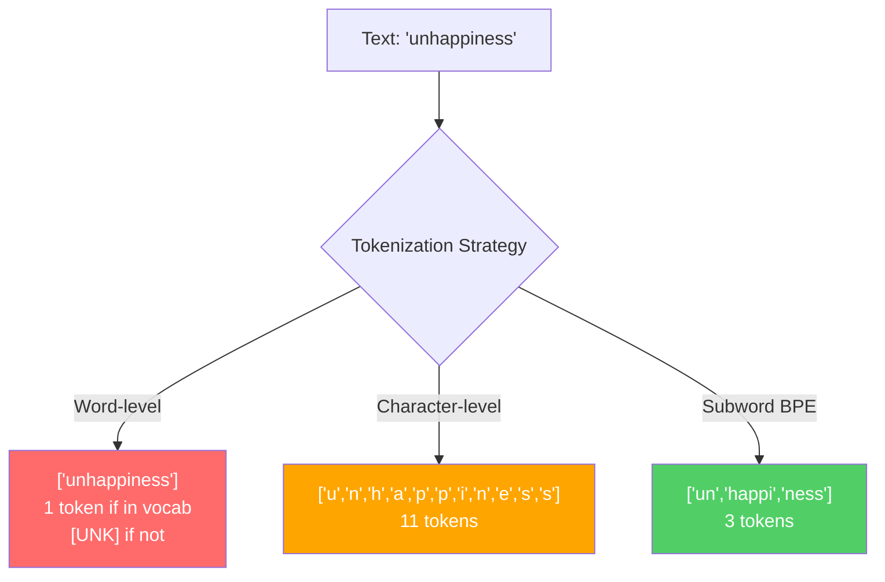
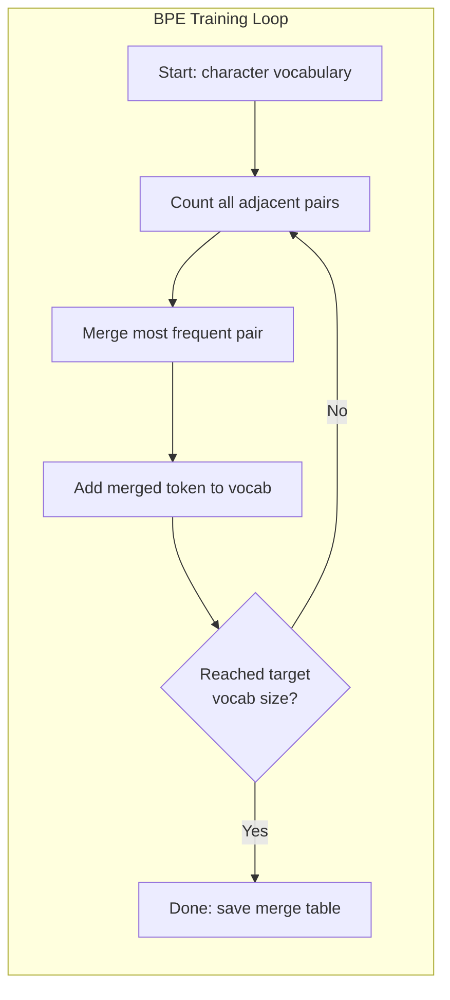
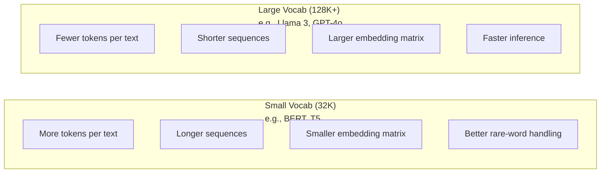

# Токенизаторы: BPE, WordPiece, SentencePiece

> Ваша большая языковая модель (LLM) не читает по-английски. Она не читает ни на одном языке. Она читает целые числа. Токенизатор решает, несут ли эти числа смысл или впустую его растрачивают.

**Тип:** Build
**Языки:** Python
**Предварительные требования:** Этап 05 (Основы NLP)
**Время:** ~90 минут

## Цели обучения

- Реализовать алгоритмы токенизации BPE, WordPiece и Unigram с нуля и сравнить их стратегии слияний
- Объяснить, как размер словаря влияет на эффективность модели: слишком маленький словарь создаёт длинные последовательности, слишком большой — впустую расходует параметры, отвечающие за векторное представление (эмбеддинг)
- Проанализировать артефакты токенизации в разных языках и коде, определив, где именно конкретные токенизаторы дают сбой
- Использовать библиотеки tiktoken и sentencepiece для токенизации текста и изучения полученных идентификаторов токенов

## Проблема

Ваша LLM не читает по-английски. Она вообще не читает ни на одном языке. Она читает числа.

Разрыв между «Hello, world!» и [15496, 11, 995, 0] — это и есть токенизатор. Каждое слово, каждый пробел, каждый знак препинания должны быть преобразованы в целое число, прежде чем модель сможет их обработать. Это преобразование не нейтрально. Оно закладывает в модель допущения, которые впоследствии нельзя отменить.

Сделайте это неправильно — и ваша модель будет впустую тратить объём, кодируя частые слова несколькими токенами. «unfortunately» превращается в четыре токена вместо одного. Ваше контекстное окно на 128K токенов только что сократилось на 75% для текста, насыщенного многосложными словами. Сделайте это правильно — и то же самое контекстное окно вмещает вдвое больше смысла. Разница между «эта модель хорошо работает с кодом» и «эта модель захлёбывается на Python» часто сводится к тому, как был обучен токенизатор.

Каждый ваш API-вызов к GPT-4 или Claude оплачивается за токен. Каждый токен, сгенерированный вашей моделью, стоит вычислений. Чем меньше токенов требуется для представления результата, тем быстрее сквозное выполнение вывода (инференс). Токенизация — это не предобработка. Это архитектура.

## Концепция

### Три подхода, которые провалились (и один, который победил)

Есть три очевидных способа превратить текст в числа. Два из них не работают в масштабе.

**Токенизация по словам** разбивает текст по пробелам и знакам препинания. «The cat sat» становится ["The", "cat", "sat"]. Просто. Но что насчёт «tokenization»? Или «GPT-4o»? Или немецкого сложного слова вроде «Geschwindigkeitsbegrenzung»? Токенизация по словам требует огромного словаря, чтобы покрыть каждое слово в каждом языке. Пропустите слово — и получите пресловутый токен `[UNK]` — способ модели сказать «понятия не имею, что это такое». В одном только английском языке более миллиона словоформ. Добавьте код, URL-адреса, научную нотацию и ещё 100 языков — и вам понадобится бесконечный словарь.

**Посимвольная токенизация** идёт в противоположном направлении. «hello» становится ["h", "e", "l", "l", "o"]. Словарь крошечный (несколько сотен символов). Неизвестных токенов никогда не бывает. Но последовательности становятся чрезвычайно длинными. Предложение, которое при токенизации по словам заняло бы 10 токенов, превращается в 50 посимвольных токенов. Модель вынуждена учить, что «t», «h», «e» вместе означают «the» — расходуя ёмкость внимания на то, что человек усваивает в три года.

**Токенизация по подсловам** находит золотую середину. Частые слова остаются целыми: «the» — один токен. Редкие слова распадаются на осмысленные части: «unhappiness» становится ["un", "happi", "ness"]. Словарь остаётся управляемым (от 30K до 128K токенов). Последовательности остаются короткими. Неизвестные токены практически исчезают, потому что любое слово можно собрать из фрагментов подслов.

Каждая современная LLM использует токенизацию по подсловам. GPT-2, GPT-4, BERT, Llama 3, Claude — все они. Вопрос лишь в том, какой алгоритм.



### BPE: кодирование пар байтов

BPE — это жадный алгоритм сжатия, переработанный для токенизации. Идея достаточно проста, чтобы уместиться на карточке.

Начните с отдельных символов. Посчитайте каждую соседнюю пару в обучающем корпусе. Слейте самую частую пару в новый токен. Повторяйте, пока не достигнете целевого размера словаря.

```figure
tokenizer-bpe
```

Вот как BPE работает на крошечном корпусе со словами «lower», «lowest» и «newest»:

```
Corpus (with word frequencies):
  "lower"  x5
  "lowest" x2
  "newest" x6

Step 0 -- Start with characters:
  l o w e r       (x5)
  l o w e s t     (x2)
  n e w e s t     (x6)

Step 1 -- Count adjacent pairs:
  (e,s): 8    (s,t): 8    (l,o): 7    (o,w): 7
  (w,e): 13   (e,r): 5    (n,e): 6    ...

Step 2 -- Merge most frequent pair (w,e) -> "we":
  l o we r        (x5)
  l o we s t      (x2)
  n e we s t      (x6)

Step 3 -- Recount and merge (e,s) -> "es":
  l o we r        (x5)
  l o we s t      (x2)    <- 'es' only forms from 'e'+'s', not 'we'+'s'
  n e we s t      (x6)    <- wait, the 'e' before 'we' and 's' after 'we'

Actually tracking this precisely:
  After "we" merge, remaining pairs:
  (l,o): 7   (o,we): 7   (we,r): 5   (we,s): 8
  (s,t): 8   (n,e): 6    (e,we): 6

Step 3 -- Merge (we,s) -> "wes" or (s,t) -> "st" (tied at 8, pick first):
  Merge (we,s) -> "wes":
  l o we r        (x5)
  l o wes t       (x2)
  n e wes t       (x6)

Step 4 -- Merge (wes,t) -> "west":
  l o we r        (x5)
  l o west        (x2)
  n e west        (x6)

...continue until target vocab size reached.
```

Таблица слияний и есть токенизатор. Чтобы закодировать новый текст, слияния применяются в том порядке, в котором они были выучены. Обучающий корпус определяет, какие слияния существуют, и этот выбор навсегда формирует то, что видит модель.



### Побайтовый BPE (GPT-2, GPT-3, GPT-4)

Стандартный BPE работает с символами Unicode. Побайтовый BPE работает с сырыми байтами (0-255). Это даёт базовый словарь ровно из 256 элементов, обрабатывает любой язык или кодировку и никогда не порождает неизвестный токен.

Этот подход ввела GPT-2. Базовый словарь покрывает каждый возможный байт. Слияния BPE строятся поверх него. Библиотека tiktoken от OpenAI реализует побайтовый BPE со следующими размерами словаря:

- GPT-2: 50,257 токенов
- GPT-3.5/GPT-4: ~100,256 токенов (кодировка cl100k_base)
- GPT-4o: 200,019 токенов (кодировка o200k_base)

### WordPiece (BERT)

WordPiece похож на BPE, но выбирает слияния иначе. Вместо сырой частоты он максимизирует правдоподобие обучающих данных:

```
BPE merge criterion:      count(A, B)
WordPiece merge criterion: count(AB) / (count(A) * count(B))
```

BPE спрашивает: «Какая пара встречается чаще всего?» WordPiece спрашивает: «Какая пара встречается вместе чаще, чем можно было бы ожидать случайно?» Это тонкое различие даёт разные словари. WordPiece отдаёт предпочтение слияниям, где совместная встречаемость неожиданна, а не просто часта.

WordPiece также использует префикс «##» для продолжающихся подслов:

```
"unhappiness" -> ["un", "##happi", "##ness"]
"embedding"   -> ["em", "##bed", "##ding"]
```

Префикс «##» показывает, что этот фрагмент продолжает предыдущий токен. BERT использует WordPiece со словарём в 30,522 токена. Каждый вариант BERT — DistilBERT, токенизатор RoBERTa на самом деле BPE, но сам BERT — это WordPiece.

### SentencePiece (Llama, T5)

SentencePiece рассматривает входные данные как сырой поток символов Unicode, включая пробелы. Никакого этапа предварительной токенизации. Никаких языкоспецифичных правил о границах слов. Это делает его по-настоящему независимым от языка — он работает на китайском, японском, тайском и других языках, где пробелы не разделяют слова.

SentencePiece поддерживает два алгоритма:
- **Режим BPE**: та же логика слияний, что и в стандартном BPE, применённая к сырым последовательностям символов
- **Режим Unigram**: начинает с большого словаря и итеративно удаляет токены, которые меньше всего влияют на общее правдоподобие. Обратное BPE — вместо слияния происходит отсечение.

Llama 2 использует SentencePiece BPE со словарём в 32,000 токенов. T5 использует SentencePiece Unigram с 32,000 токенов. Обратите внимание: Llama 3 перешла на побайтовый BPE-токенизатор на основе tiktoken со словарём в 128,256 токенов.

### Компромиссы размера словаря

Это реальное инженерное решение с измеримыми последствиями.



Конкретные цифры. Для словаря в 128K при 4,096-мерных эмбеддингах одна только матрица эмбеддингов составляет 128,000 x 4,096 = 524 миллиона параметров. Для словаря в 32K это 131 миллион параметров. Это разница в 400M параметров — только из-за выбора токенизатора.

Но более крупные словари сжимают текст агрессивнее. Тот же абзац на английском, который занимает 100 токенов при словаре в 32K, может занять 70 токенов при словаре в 128K. Это означает на 30% меньше проходов вперёд при генерации. Для модели, обслуживающей миллионы запросов, это прямое снижение затрат на вычисления.

Тенденция очевидна: размеры словарей растут. GPT-2 использовала 50,257. GPT-4 использует ~100K. Llama 3 использует 128K. GPT-4o использует 200K.

| Модель | Размер словаря | Тип токенизатора | Среднее число токенов на английское слово |
|-------|-----------|----------------|---------------------------|
| BERT | 30,522 | WordPiece | ~1.4 |
| GPT-2 | 50,257 | Побайтовый BPE | ~1.3 |
| Llama 2 | 32,000 | SentencePiece BPE | ~1.4 |
| GPT-4 | ~100,256 | Побайтовый BPE | ~1.2 |
| Llama 3 | 128,256 | Побайтовый BPE (tiktoken) | ~1.1 |
| GPT-4o | 200,019 | Побайтовый BPE | ~1.0 |

### Многоязычный налог

Токенизаторы, обученные преимущественно на английском, безжалостны к другим языкам. Корейский текст в токенизаторе GPT-2 в среднем занимает 2-3 токена на слово. С китайским может быть ещё хуже. Это означает, что у корейского пользователя фактически контекстное окно вдвое меньше, чем у англоязычного, — за ту же цену он получает меньшую плотность информации.

Именно поэтому Llama 3 учетверила свой словарь с 32K до 128K. Больше токенов, выделенных на неанглоязычные системы письма, означает более справедливое сжатие для разных языков.

```figure
tokenizer-tradeoff
```

## Реализация

### Шаг 1: Посимвольный токенизатор

Начнём с основы. Посимвольный токенизатор сопоставляет каждому символу его кодовую точку Unicode. Обучение не требуется. Неизвестных токенов нет. Просто прямое отображение.

```python
class CharTokenizer:
    def encode(self, text):
        return [ord(c) for c in text]

    def decode(self, tokens):
        return "".join(chr(t) for t in tokens)
```

«hello» становится [104, 101, 108, 108, 111]. Каждый символ — свой собственный токен. Это базовый уровень, который мы будем улучшать.

### Шаг 2: BPE-токенизатор с нуля

Настоящая реализация. Мы обучаемся на сырых байтах (как GPT-2), считаем пары, сливаем самую частую и записываем каждое слияние по порядку. Таблица слияний и есть токенизатор.

```python
from collections import Counter

class BPETokenizer:
    def __init__(self):
        self.merges = {}
        self.vocab = {}

    def _get_pairs(self, tokens):
        pairs = Counter()
        for i in range(len(tokens) - 1):
            pairs[(tokens[i], tokens[i + 1])] += 1
        return pairs

    def _merge_pair(self, tokens, pair, new_token):
        merged = []
        i = 0
        while i < len(tokens):
            if i < len(tokens) - 1 and tokens[i] == pair[0] and tokens[i + 1] == pair[1]:
                merged.append(new_token)
                i += 2
            else:
                merged.append(tokens[i])
                i += 1
        return merged

    def train(self, text, num_merges):
        tokens = list(text.encode("utf-8"))
        self.vocab = {i: bytes([i]) for i in range(256)}

        for i in range(num_merges):
            pairs = self._get_pairs(tokens)
            if not pairs:
                break
            best_pair = max(pairs, key=pairs.get)
            new_token = 256 + i
            tokens = self._merge_pair(tokens, best_pair, new_token)
            self.merges[best_pair] = new_token
            self.vocab[new_token] = self.vocab[best_pair[0]] + self.vocab[best_pair[1]]

        return self

    def encode(self, text):
        tokens = list(text.encode("utf-8"))
        for pair, new_token in self.merges.items():
            tokens = self._merge_pair(tokens, pair, new_token)
        return tokens

    def decode(self, tokens):
        byte_sequence = b"".join(self.vocab[t] for t in tokens)
        return byte_sequence.decode("utf-8", errors="replace")
```

Цикл обучения — это ядро BPE: считаем пары, сливаем победителя, повторяем. Каждое слияние уменьшает общее число токенов. После `num_merges` раундов словарь вырастает с 256 (базовые байты) до 256 + num_merges.

Кодирование применяет слияния строго в том порядке, в котором они были выучены. Это важно. Если слияние 1 создало «th», а слияние 5 создало «the», кодирование должно применить слияние 1 первым, чтобы «the» могло сформироваться из «th» + «e» на слиянии 5.

Декодирование — обратный процесс: найти каждый идентификатор токена в словаре, конкатенировать байты, декодировать в UTF-8.

### Шаг 3: Кодирование и декодирование туда-обратно

```python
corpus = (
    "The cat sat on the mat. The cat ate the rat. "
    "The dog sat on the log. The dog ate the frog. "
    "Natural language processing is the study of how computers "
    "understand and generate human language. "
    "Tokenization is the first step in any NLP pipeline."
)

tokenizer = BPETokenizer()
tokenizer.train(corpus, num_merges=40)

test_sentences = [
    "The cat sat on the mat.",
    "Natural language processing",
    "tokenization pipeline",
    "unhappiness",
]

for sentence in test_sentences:
    encoded = tokenizer.encode(sentence)
    decoded = tokenizer.decode(encoded)
    raw_bytes = len(sentence.encode("utf-8"))
    ratio = len(encoded) / raw_bytes
    print(f"'{sentence}'")
    print(f"  Tokens: {len(encoded)} (from {raw_bytes} bytes) -- ratio: {ratio:.2f}")
    print(f"  Roundtrip: {'PASS' if decoded == sentence else 'FAIL'}")
```

Коэффициент сжатия показывает, насколько эффективен токенизатор. Коэффициент 0.50 означает, что токенизатор сжал текст до половины числа токенов относительно сырых байтов. Чем ниже, тем лучше. На обучающем корпусе коэффициент будет хорошим. На тексте вне распределения, вроде «unhappiness» (которого нет в корпусе), коэффициент будет хуже — токенизатор откатывается к посимвольному кодированию для невиданных паттернов.

### Шаг 4: Сравнение с tiktoken

```python
import tiktoken

enc = tiktoken.get_encoding("cl100k_base")

texts = [
    "The cat sat on the mat.",
    "unhappiness",
    "Hello, world!",
    "def fibonacci(n): return n if n < 2 else fibonacci(n-1) + fibonacci(n-2)",
    "Geschwindigkeitsbegrenzung",
]

for text in texts:
    our_tokens = tokenizer.encode(text)
    tiktoken_tokens = enc.encode(text)
    tiktoken_pieces = [enc.decode([t]) for t in tiktoken_tokens]
    print(f"'{text}'")
    print(f"  Our BPE:   {len(our_tokens)} tokens")
    print(f"  tiktoken:  {len(tiktoken_tokens)} tokens -> {tiktoken_pieces}")
```

tiktoken использует тот же самый алгоритм, но обучен на сотнях гигабайт текста со 100,000 слияний. Алгоритм идентичен. Разница — в обучающих данных и числе слияний. Ваш токенизатор, обученный на абзаце с 40 слияниями, не может соперничать со 100K слияний tiktoken на массивном корпусе. Но механизм тот же самый.

### Шаг 5: Анализ словаря

```python
def analyze_vocabulary(tokenizer, test_texts):
    total_tokens = 0
    total_chars = 0
    token_usage = Counter()

    for text in test_texts:
        encoded = tokenizer.encode(text)
        total_tokens += len(encoded)
        total_chars += len(text)
        for t in encoded:
            token_usage[t] += 1

    print(f"Vocabulary size: {len(tokenizer.vocab)}")
    print(f"Total tokens across all texts: {total_tokens}")
    print(f"Total characters: {total_chars}")
    print(f"Avg tokens per character: {total_tokens / total_chars:.2f}")

    print(f"\nMost used tokens:")
    for token_id, count in token_usage.most_common(10):
        token_bytes = tokenizer.vocab[token_id]
        display = token_bytes.decode("utf-8", errors="replace")
        print(f"  Token {token_id:4d}: '{display}' (used {count} times)")

    unused = [t for t in tokenizer.vocab if t not in token_usage]
    print(f"\nUnused tokens: {len(unused)} out of {len(tokenizer.vocab)}")
```

Это раскрывает распределение Ципфа в вашем словаре. Несколько токенов доминируют (пробелы, «the», «e»). Большинство токенов используются редко. Промышленные токенизаторы оптимизируются под это распределение — частые паттерны получают короткие идентификаторы токенов, редкие паттерны получают более длинные представления.

## Применение

Ваш BPE с нуля работает. Теперь посмотрим, как выглядят промышленные инструменты.

### tiktoken (OpenAI)

```python
import tiktoken

enc = tiktoken.get_encoding("cl100k_base")

text = "Tokenizers convert text to integers"
tokens = enc.encode(text)
print(f"Tokens: {tokens}")
print(f"Pieces: {[enc.decode([t]) for t in tokens]}")
print(f"Roundtrip: {enc.decode(tokens)}")
```

tiktoken написан на Rust с привязками для Python. Он кодирует миллионы токенов в секунду. Тот же алгоритм BPE, промышленная реализация.

### Hugging Face tokenizers

```python
from tokenizers import Tokenizer
from tokenizers.models import BPE
from tokenizers.trainers import BpeTrainer
from tokenizers.pre_tokenizers import ByteLevel

tokenizer = Tokenizer(BPE())
tokenizer.pre_tokenizer = ByteLevel()

trainer = BpeTrainer(vocab_size=1000, special_tokens=["<pad>", "<eos>", "<unk>"])
tokenizer.train(["corpus.txt"], trainer)

output = tokenizer.encode("The cat sat on the mat.")
print(f"Tokens: {output.tokens}")
print(f"IDs: {output.ids}")
```

Библиотека Hugging Face tokenizers тоже под капотом написана на Rust. Она обучает BPE на корпусах гигабайтного масштаба за секунды. Именно её вы используете при обучении собственной модели.

### Загрузка токенизатора Llama

```python
from transformers import AutoTokenizer

tokenizer = AutoTokenizer.from_pretrained("meta-llama/Llama-3.1-8B")

text = "Tokenizers are the unsung heroes of LLMs"
tokens = tokenizer.encode(text)
print(f"Token IDs: {tokens}")
print(f"Tokens: {tokenizer.convert_ids_to_tokens(tokens)}")
print(f"Vocab size: {tokenizer.vocab_size}")

multilingual = ["Hello world", "Hola mundo", "Bonjour le monde"]
for text in multilingual:
    ids = tokenizer.encode(text)
    print(f"'{text}' -> {len(ids)} tokens")
```

Словарь Llama 3 в 128K значительно лучше сжимает неанглийский текст, чем словарь GPT-2 в 50K. Вы можете проверить это сами — закодируйте одно и то же предложение на нескольких языках и посчитайте токены.

## Итоговое задание

Этот урок производит `outputs/prompt-tokenizer-analyzer.md` — переиспользуемый промпт, который анализирует эффективность токенизации для любого сочетания текста и модели. Подайте на вход образец текста, и он скажет, чей токенизатор справляется с ним лучше всего.

## Упражнения

1. Измените BPE-токенизатор так, чтобы он выводил словарь на каждом шаге слияния. Понаблюдайте, как «t» + «h» становится «th», а затем «th» + «e» становится «the». Проследите, как частые английские слова собираются по кусочку.

2. Добавьте специальные токены (`<pad>`, `<eos>`, `<unk>`) в BPE-токенизатор. Присвойте им идентификаторы 0, 1, 2 и соответствующим образом сдвиньте все остальные токены. Реализуйте этап предварительной токенизации, который разбивает текст по пробелам перед запуском BPE.

3. Реализуйте критерий слияния WordPiece (отношение правдоподобия вместо частоты). Обучите и BPE, и WordPiece на одном и том же корпусе с одинаковым числом слияний. Сравните получившиеся словари — какой из них производит более лингвистически осмысленные подслова?

4. Постройте бенчмарк эффективности многоязычного токенизатора. Возьмите по 10 предложений на английском, испанском, китайском, корейском и арабском. Токенизируйте каждое с помощью tiktoken (cl100k_base) и измерьте среднее число токенов на символ. Количественно оцените «многоязычный налог» для каждого языка.

5. Обучите свой BPE-токенизатор на более крупном корпусе (скачайте статью из Википедии). Подберите число слияний так, чтобы коэффициент сжатия оказался в пределах 10% от tiktoken на том же тексте. Это заставит вас понять взаимосвязь между размером корпуса, числом слияний и качеством сжатия.

## Ключевые термины

| Термин | Как обычно говорят | Что это означает на самом деле |
|------|----------------|----------------------|
| Токен | «Слово» | Единица в словаре модели: это может быть символ, подслово, слово или фрагмент из нескольких слов |
| BPE | «Что-то для сжатия» | Кодирование пар байтов: наиболее частая соседняя пара токенов итеративно сливается до достижения целевого размера словаря |
| WordPiece | «Токенизатор BERT» | Подобен BPE, но при слияниях вместо абсолютной частоты максимизируется отношение правдоподобия count(AB)/(count(A)*count(B)) |
| SentencePiece | «Библиотека токенизации» | Независимый от языка токенизатор, который работает с необработанным Unicode без предварительной токенизации и поддерживает алгоритмы BPE и Unigram |
| Размер словаря | «Сколько слов он знает» | Общее число уникальных токенов: у GPT-2 их 50,257, у BERT — 30,522, у Llama 3 — 128,256 |
| Фертильность (fertility) | «Это не термин из токенизации» | Среднее число токенов на слово — мера эффективности токенизатора для разных языков (1.0 — идеальный результат, 3.0 означает, что модель работает втрое больше) |
| Побайтовый BPE | «Токенизатор GPT» | BPE, работающий с сырыми байтами (0-255), а не с символами Unicode, поэтому неизвестные токены гарантированно не возникают при любых входных данных |
| Таблица слияний | «Файл токенизатора» | Упорядоченный список слияний пар, изученных при обучении; это и есть токенизатор, причём порядок имеет значение |
| Предварительная токенизация | «Разбиение по пробелам» | Правила, применяемые перед токенизацией по подсловам: разбиение по пробельным символам, отделение цифр и обработка знаков препинания |
| Коэффициент сжатия | «Насколько эффективен токенизатор» | Число полученных токенов, делённое на число байтов во входных данных: чем ниже значение, тем лучше сжатие и быстрее инференс |

## Дополнительные материалы

- [Sennrich et al., 2016 -- "Neural Machine Translation of Rare Words with Subword Units"](https://arxiv.org/abs/1508.07909) -- статья, представившая BPE для NLP, превратившая алгоритм сжатия 1994 года в основу современной токенизации
- [Kudo & Richardson, 2018 -- "SentencePiece: A simple and language independent subword tokenizer"](https://arxiv.org/abs/1808.06226) -- независимая от языка токенизация, сделавшая многоязычные модели практичными
- [Репозиторий OpenAI tiktoken](https://github.com/openai/tiktoken) -- промышленная реализация BPE на Rust с привязками для Python, используемая GPT-3.5/4/4o
- [Документация Hugging Face Tokenizers](https://huggingface.co/docs/tokenizers) -- обучение токенизаторов промышленного уровня с производительностью Rust
