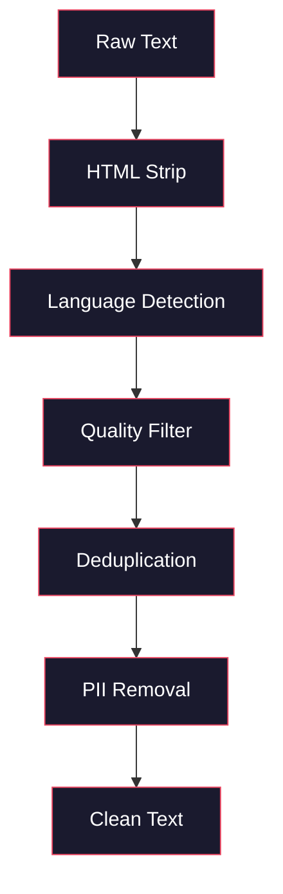
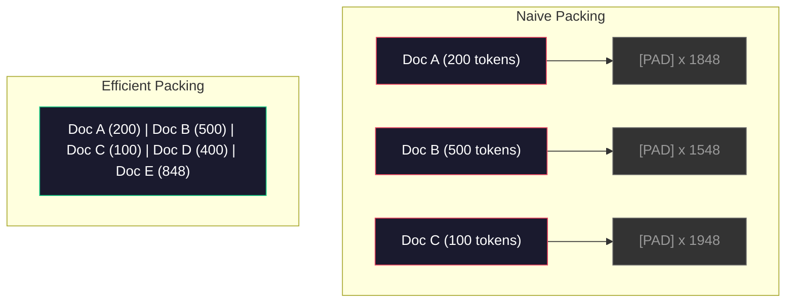

# Конвейеры данных для предварительного обучения

> Модель — это зеркало. Она отражает всё, чем вы её кормите. Скормите ей мусор — она отразит мусор с идеальной беглостью.

**Тип:** Build
**Языки:** Python
**Предварительные требования:** этап 10, уроки 01–02 («Токенизаторы», «Создание токенизатора»)
**Время:** ~90 минут

## Цели обучения

- Построить потоковый конвейер данных, который токенизирует, разбивает на фрагменты, перемешивает и группирует в пакеты терабайты текста без загрузки всего в память
- Реализовать фильтры качества данных (дедупликация, определение языка, фильтрация контента), используемые в реальных конвейерах предварительного обучения
- Создать обучающие последовательности фиксированной длины с корректными масками внимания и обработкой границ документов
- Профилировать пропускную способность конвейера, чтобы загрузчик данных не отставал от скорости обучения на GPU

## Проблема

У вас есть токенизатор. Теперь нужны данные.

Не набор данных. Не CSV-файл. Терабайты текста — очищенного, дедуплицированного, отфильтрованного по качеству, токенизированного в последовательности фиксированной длины и подаваемого в перемешанных пакетах достаточно быстро, чтобы ваш кластер из 8 GPU никогда не ждал следующий пакет.

Большинство людей думают, что обучение LLM — это в первую очередь про архитектуру модели. Это не так. Llama 3 использовала 15,6 триллиона токенов. GPT-3 — 300 миллиардов. DeepSeek-V2 — 8,1 триллиона. Архитектура во всех трёх случаях примерно одинакова: стопка блоков трансформера с механизмом внимания и слоями прямого распространения. Разница в качестве вывода обусловлена в основном данными.

Статья Chinchilla от DeepMind сформулировала это точно. Для заданного вычислительного бюджета существует оптимальное соотношение параметров модели к обучающим токенам. Chinchilla показала, что большинство моделей 2022 года были значительно недообучены — у них было слишком много параметров относительно объёма увиденных данных. Модель с 70 млрд параметров, обученная на 1,4 триллиона токенов (Chinchilla-оптимум), превзошла модель на 280 млрд параметров, обученную на 300 миллиардах токенов (Gopher).

Ваш конвейер данных определяет, выучит ли модель язык или выучит шум.

## Концепция

### Откуда берутся данные

Каждая большая языковая модель обучается на смеси источников. Точный состав — тщательно охраняемый секрет для большинства лабораторий, но известного достаточно, чтобы понимать категории.

| Источник | Объём | Качество | Используется в |
|--------|------|---------|---------|
| Common Crawl | ~250 TB исходных данных | Низкое (требует серьёзной фильтрации) | GPT-3, Llama, большинство открытых моделей |
| Wikipedia | ~20 GB | Высокое | Все основные LLM |
| Код с GitHub | ~1 TB+ | Среднее (много дубликатов и неиспользуемого кода) | StarCoder, CodeLlama, DeepSeek-Coder |
| Книги (BookCorpus, Pile) | ~100 GB | Высокое | GPT-2, GPT-3, ранние модели |
| Научные статьи (arXiv, S2ORC) | ~100 GB | Высокое для STEM | Llama, Galactica |
| StackOverflow, Reddit | ~100 GB | Среднее | Llama, Falcon |
| Отобранные веб-данные (C4, RefinedWeb) | ~5 TB | От среднего до высокого (предварительно отфильтрованы) | T5, Falcon |

Llama 3 раскрыла свою смесь данных: примерно 50% веб-данных, 25% кода, 13% книг и научных статей, 8% математических данных и 4% многоязычных веб-данных. В сумме — 15,6 триллиона токенов из источников общим объёмом более 5 ТБ исходного текста.

Соотношение важно не меньше, чем общий объём. Слишком много веб-данных — и модель превращается в попугая Reddit. Слишком мало кода — и она не умеет программировать. Слишком мало математики — и она проваливается в рассуждениях. Правильно подобрать эту смесь — одна из самых сложных частей обучения LLM, и здесь нет формулы: требуются эксперименты и оценивание.

### Очистка данных

Сырые веб-данные грязны. Типичный дамп Common Crawl содержит:

- HTML-теги и JavaScript
- Шаблонные заголовки, футеры, навигационные меню
- Дублирующиеся страницы (точные и почти-дубликаты)
- Спам, сгенерированный машинами
- Персональные данные (PII)
- Низкокачественный текст (списки ключевых слов, SEO-спам)
- Нетекстовый контент, закодированный как текст

Очистка этого — не опция. Это разница между моделью, которая генерирует связные абзацы, и моделью, которая выдаёт HTML-теги вперемешку со списками товаров.



Каждый шаг устраняет свою категорию шума:

**Удаление HTML:** удалите всю разметку. Оставьте только видимый текстовый контент. Библиотеки вроде `trafilatura` или `readability` извлекают содержимое статьи, отбрасывая навигацию, рекламу и шаблонные блоки.

**Определение языка:** используйте модель определения языка fastText (lid.176.bin), чтобы классифицировать каждый документ. Отфильтруйте по целевым языкам. Документ, классифицированный как английский с уверенностью менее 0,8, вероятно, не является чистым английским текстом.

**Фильтрация по качеству:** здесь становится интереснее. RefinedWeb (набор данных, лежащий в основе Falcon) использует фильтр на основе перплексии: обучите небольшую языковую модель на Wikipedia, затем оцените каждый документ. Высокая перплексия означает, что документ не похож на Wikipedia — вероятно, это спам, списки ключевых слов или машинно-сгенерированный контент. Документы с перплексией выше порога удаляются.

**Дедупликация:** самый значимый шаг очистки. Common Crawl содержит огромное количество дублирующихся страниц — юридические оговорки, уведомления о cookie, условия использования. Обучение на дубликатах впустую тратит вычисления и может привести к тому, что модель запомнит и будет дословно воспроизводить конкретные фрагменты.

**Удаление PII:** имена, адреса электронной почты, номера телефонов, номера социального страхования. Регулярные выражения для структурированного PII, NER-модели для имён в контексте.

### Дедупликация с помощью MinHash

Точная дедупликация проста: хешируйте каждый документ, удалите дубликаты. Но настоящая проблема — это почти-дубликаты. Две копии одной и той же новостной статьи с немного разной рекламой вокруг — это почти-дубликаты. Содержимое идентично на 95%, но побайтно они различаются.

MinHash + локально-чувствительное хеширование (Locality-Sensitive Hashing, LSH) эффективно решает эту задачу.


Идея:

1. **Шинглирование (shingling):** преобразуйте каждый документ в набор n-грамм (например, 5-грамм слов или символов). «быстрая коричневая лиса бежит» с трёхсловными шинглами превращается в {«быстрая коричневая лиса», «коричневая лиса бежит»}.

2. **MinHash:** для набора шинглов каждого документа вычислите k хеш-значений. Каждое хеш-значение — это минимальный хеш среди всех шинглов по разной хеш-функции. Это создаёт "сигнатуру" фиксированного размера, которая аппроксимирует сходство Жаккара между любыми двумя документами.

3. **LSH:** сгруппируйте документы по бакетам на основе групп их MinHash-сигнатуры. Документы в одном бакете — кандидаты в почти-дубликаты. Это избавляет от необходимости сравнивать каждую пару — вы сравниваете только кандидатов.

4. **Проверка:** для каждой пары кандидатов вычислите точное сходство Жаккара. Удалите одну копию, если сходство превышает порог (обычно 0,8).

Команда Llama сообщила об удалении примерно 38% своих веб-данных с помощью дедупликации. Это немалая цифра. Более трети Common Crawl — это дублирующийся или почти-дублирующийся контент.

### Упаковка последовательностей

Ваша модель ожидает входные последовательности фиксированной длины. Ваши документы имеют переменную длину. Некоторые — 50 токенов. Некоторые — 50 000 токенов.

Наивный подход: дополните каждый документ до максимальной длины последовательности паддингом. Это впустую тратит огромные вычислительные ресурсы на токены-заполнители, которые ничего не дают для обучения.

Лучший подход: упакуйте несколько документов в одну последовательность, разделённых токенами конца последовательности. Последовательность из 2048 токенов может содержать три коротких документа, сцепленных с токенами [EOS] между ними.



Маска внимания должна быть настроена корректно. Токены документа A не должны обращать внимание на токены документа B в рамках одной упакованной последовательности. Это требует блочно-диагональной маски внимания.

Длинные документы усекаются или разбиваются на фрагменты по границам последовательности. Точка разбиения имеет значение: разбиение посреди предложения заставляет модель видеть незавершённые мысли. Некоторые конвейеры выравнивают разбиения по границам абзацев или предложений, когда это возможно.

### Закон масштабирования Chinchilla

Для фиксированного вычислительного бюджета C (измеряемого в FLOPs) оптимальный размер модели N и размер набора данных D подчиняются:

```
N_opt ~ C^0.5
D_opt ~ C^0.5
```

На практике это означает, что размер модели и размер набора данных нужно масштабировать примерно одинаково. Модели с в 10 раз большим числом параметров требуется примерно в 10 раз больше обучающих токенов, чтобы достичь того же значения функции потерь.

| Модель | Параметры | Обучающие токены | Оптимальна по Chinchilla? |
|-------|-----------|----------------|-------------------|
| GPT-3 | 175B | 300B | Нет (недообучена в 3–4 раза) |
| Chinchilla | 70B | 1.4T | Да (по замыслу) |
| Llama 2 | 70B | 2T | Обучена сверх оптимума (намеренно) |
| Llama 3 | 70B | 15T | Обучена далеко сверх оптимума |

Llama 3 намеренно нарушает закон Chinchilla. В Meta обнаружили, что обучение на большем объёме данных — далеко за пределами вычислительно-оптимального соотношения — даёт лучшие модели для инференса. Дополнительная стоимость обучения оплачивается один раз, а меньшая модель обходится дешевле при обслуживании — постоянно. Этот подход иногда называют масштабированием, оптимальным для инференса, и он стал отраслевым стандартом с 2024 года.

```figure
l5-data-pipeline
```

## Реализация

### Шаг 1: Очистка текста

Удалите HTML, нормализуйте пробелы, уберите нетекстовый контент. Мы будем использовать текст общественного достояния (Project Gutenberg) в качестве небольшого корпуса.

```python
import re

def clean_text(text):
    text = re.sub(r"<[^>]+>", "", text)
    text = re.sub(r"http\S+", "", text)
    text = re.sub(r"[^\x20-\x7E\n]", "", text)
    text = re.sub(r"\n{3,}", "\n\n", text)
    text = re.sub(r" {2,}", " ", text)
    return text.strip()

def quality_filter(text, min_words=50, max_ratio_caps=0.3, max_ratio_special=0.1):
    words = text.split()
    if len(words) < min_words:
        return False
    caps_ratio = sum(1 for w in words if w.isupper()) / len(words)
    if caps_ratio > max_ratio_caps:
        return False
    special_chars = sum(1 for c in text if not c.isalnum() and not c.isspace())
    if special_chars / max(len(text), 1) > max_ratio_special:
        return False
    return True
```

Фильтр качества отлавливает SEO-спам (ЗАГЛАВНЫМИ БУКВАМИ), машинно-сгенерированный шум (высокая доля специальных символов) и заглушки страниц (слишком короткие). Одни только эти три проверки убирают удивительно большое количество мусора из веб-краулинга.

### Шаг 2: Дедупликация с помощью MinHash

Реализуйте MinHash с нуля. Внешние библиотеки не требуются — только `hashlib`.

```python
import hashlib
from collections import defaultdict

def get_shingles(text, k=5):
    words = text.lower().split()
    if len(words) < k:
        return set()
    return {" ".join(words[i:i+k]) for i in range(len(words) - k + 1)}

def minhash_signature(shingles, num_hashes=128):
    signature = []
    for i in range(num_hashes):
        min_hash = float("inf")
        for shingle in shingles:
            h = int(hashlib.sha256(f"{i}:{shingle}".encode()).hexdigest(), 16)
            min_hash = min(min_hash, h)
        signature.append(min_hash)
    return signature

def lsh_buckets(signature, bands=16):
    rows_per_band = len(signature) // bands
    buckets = []
    for b in range(bands):
        start = b * rows_per_band
        band_data = tuple(signature[start:start + rows_per_band])
        bucket_hash = hashlib.md5(str(band_data).encode()).hexdigest()
        buckets.append((b, bucket_hash))
    return buckets

def deduplicate(documents, threshold=0.8, num_hashes=128, bands=16):
    signatures = []
    shingle_sets = []
    for doc in documents:
        shingles = get_shingles(doc)
        shingle_sets.append(shingles)
        signatures.append(minhash_signature(shingles, num_hashes))

    bucket_map = defaultdict(list)
    for doc_idx, sig in enumerate(signatures):
        for band_id, bucket_hash in lsh_buckets(sig, bands):
            bucket_map[(band_id, bucket_hash)].append(doc_idx)

    duplicate_pairs = set()
    for bucket_docs in bucket_map.values():
        if len(bucket_docs) < 2:
            continue
        for i in range(len(bucket_docs)):
            for j in range(i + 1, len(bucket_docs)):
                duplicate_pairs.add((bucket_docs[i], bucket_docs[j]))

    removed = set()
    for i, j in duplicate_pairs:
        if i in removed or j in removed:
            continue
        s1, s2 = shingle_sets[i], shingle_sets[j]
        if not s1 or not s2:
            continue
        jaccard = len(s1 & s2) / len(s1 | s2)
        if jaccard >= threshold:
            removed.add(j)

    return [doc for idx, doc in enumerate(documents) if idx not in removed], len(removed)
```

Параметры `num_hashes=128` и `bands=16` управляют компромиссом между точностью и полнотой. Больше хешей дают более точные оценки сходства. Больше полос увеличивают полноту (обнаруживает больше дубликатов) ценой большего числа ложных срабатываний. Эти значения хорошо работают для типичного веб-текста.

### Шаг 3: Токенизация и упаковка последовательностей

Возьмите чистый, дедуплицированный текст, токенизируйте его и упакуйте в последовательности фиксированной длины для обучения.

```python
def tokenize_corpus(documents, tokenizer):
    all_tokens = []
    for doc in documents:
        tokens = tokenizer.encode(doc)
        all_tokens.extend(tokens)
        all_tokens.append(tokenizer.eos_id)
    return all_tokens

def pack_sequences(token_ids, seq_length, pad_id=0):
    sequences = []
    attention_masks = []
    for i in range(0, len(token_ids), seq_length):
        seq = token_ids[i:i + seq_length]
        mask = [1] * len(seq)
        if len(seq) < seq_length:
            pad_count = seq_length - len(seq)
            seq = seq + [pad_id] * pad_count
            mask = mask + [0] * pad_count
        sequences.append(seq)
        attention_masks.append(mask)
    return sequences, attention_masks
```

### Шаг 4: DataLoader для обучения

Выдавайте перемешанные пакеты упакованных последовательностей. Именно это потребляет цикл обучения.

```python
import random

class PreTrainingDataLoader:
    def __init__(self, sequences, attention_masks, batch_size, shuffle=True):
        self.sequences = sequences
        self.attention_masks = attention_masks
        self.batch_size = batch_size
        self.shuffle = shuffle

    def __len__(self):
        return (len(self.sequences) + self.batch_size - 1) // self.batch_size

    def __iter__(self):
        indices = list(range(len(self.sequences)))
        if self.shuffle:
            random.shuffle(indices)
        for start in range(0, len(indices), self.batch_size):
            batch_idx = indices[start:start + self.batch_size]
            batch_seqs = [self.sequences[i] for i in batch_idx]
            batch_masks = [self.attention_masks[i] for i in batch_idx]
            yield batch_seqs, batch_masks
```

### Шаг 5: Статистика набора данных

Вычислите цифры, которые имеют значение: общее число токенов, число уникальных токенов, коэффициент сжатия, распределение длины документов.

```python
from collections import Counter

def compute_statistics(documents, token_ids, sequences, tokenizer_vocab_size):
    total_chars = sum(len(d) for d in documents)
    total_tokens = len(token_ids)
    unique_tokens = len(set(token_ids))
    compression_ratio = total_chars / total_tokens

    doc_lengths = [len(d.split()) for d in documents]
    avg_doc_length = sum(doc_lengths) / max(len(doc_lengths), 1)
    max_doc_length = max(doc_lengths) if doc_lengths else 0
    min_doc_length = min(doc_lengths) if doc_lengths else 0

    token_counts = Counter(token_ids)
    top_tokens = token_counts.most_common(10)

    non_pad_tokens = sum(sum(1 for t in seq if t != 0) for seq in sequences)
    total_positions = sum(len(seq) for seq in sequences)
    utilization = non_pad_tokens / max(total_positions, 1)

    stats = {
        "total_documents": len(documents),
        "total_characters": total_chars,
        "total_tokens": total_tokens,
        "unique_tokens": unique_tokens,
        "vocab_utilization": unique_tokens / tokenizer_vocab_size,
        "compression_ratio": compression_ratio,
        "avg_doc_length_words": avg_doc_length,
        "max_doc_length_words": max_doc_length,
        "min_doc_length_words": min_doc_length,
        "num_sequences": len(sequences),
        "sequence_utilization": utilization,
        "top_10_tokens": top_tokens,
    }
    return stats
```

Коэффициент сжатия показывает, насколько эффективен токенизатор на данном корпусе. Английский текст обычно сжимается примерно до 3-4 символов на токен. Если вы видите 1,5 символа на токен, ваш токенизатор разбивает слишком агрессивно. Если 8 и больше — он выучил очень специфичные для домена слияния.

Утилизация последовательности показывает, какая доля упакованных последовательностей — реальные данные, а какая — паддинг. Ниже 90% означает, что упаковка неэффективна — вы тратите вычисления впустую на токены-заполнители.

## Применение

### Сравнение с HuggingFace Datasets

Загрузите тот же корпус через библиотеку datasets от HuggingFace и сравните скорость конвейера.

```python
from datasets import load_dataset
from transformers import AutoTokenizer

ds = load_dataset("wikitext", "wikitext-2-raw-v1", split="train")
tokenizer = AutoTokenizer.from_pretrained("meta-llama/Meta-Llama-3-8B")

import time

start = time.time()
tokenized = ds.map(
    lambda x: tokenizer(x["text"], truncation=True, max_length=2048),
    batched=True,
    num_proc=4,
)
hf_time = time.time() - start
total_tokens = sum(len(t) for t in tokenized["input_ids"])
print(f"HuggingFace: {total_tokens:,} tokens in {hf_time:.2f}s ({total_tokens/hf_time:,.0f} tokens/sec)")
```

Конвейер HuggingFace использует токенизаторы на Rust под капотом и параллельную обработку на 4 ядрах. Ваш чистый Python-конвейер будет медленнее в 10-50 раз. Именно поэтому производственные команды используют скомпилированные токенизаторы. Алгоритм тот же. Разница — в языке реализации.

## Итоговое задание

Этот урок производит промпт для валидации и отладки качества данных в конвейерах обучения LLM. См. `outputs/prompt-data-quality-checker.md`.

## Упражнения

1. **Легко:** добавьте определение языка в конвейер очистки с помощью простой эвристики (анализ набора символов). Оставьте только англоязычные документы и измерьте, сколько документов было удалено.
2. **Средне:** реализуйте точную дедупликацию с помощью хешей SHA-256 наряду с почти-дедупликацией MinHash. Сравните количество дубликатов, обнаруженных каждым методом, на корпусе, собранном из веба.
3. **Сложно:** постройте фильтр качества на основе перплексии. Обучите небольшую биграммную языковую модель на тексте Wikipedia, оцените каждый документ по перплексии и удалите нижние 20%. Сравните качество вывода модели при обучении на отфильтрованных и неотфильтрованных данных.

## Ключевые термины

| Термин | Как обычно говорят | Что это означает на деле |
|------|----------------|----------------------|
| Common Crawl | «Интернет» | Некоммерческий проект, который ежемесячно сканирует веб: ~250 TB исходных данных, служащих отправной точкой для большинства наборов данных обучения LLM |
| MinHash | «Какой-то трюк с хешированием» | Метод оценки сходства Жаккара между множествами с помощью сигнатур фиксированного размера, позволяющий выявлять почти-дубликаты в больших масштабах |
| LSH | «Локально-чувствительное хеширование» | Метод группировки похожих элементов в одном бакете, который сокращает число попарных сравнений с O(n^2) до почти линейного |
| Упаковка последовательностей | «Объединение документов» | Размещение нескольких документов в последовательностях фиксированной длины с корректными масками внимания, устраняющее напрасные затраты на паддинг |
| Масштабирование Chinchilla | «Обучать на большем объёме данных» | При фиксированном вычислительном бюджете для оптимальной производительности размер модели и число обучающих токенов нужно увеличивать примерно одинаково |
| Фертильность токенизации | «Токенов на слово» | Среднее число токенов на слово: 1,3 для английского языка в GPT-4 и больше для письменностей не на основе латиницы |
| Смешивание данных | «Выбор обучающих данных» | Соотношение кода, текста, математических и многоязычных данных: формулы нет, требуются эксперименты |
| Фильтр по перплексии | «Оценка качества» | Небольшая языковая модель оценивает документы: высокая перплексия означает, что текст не похож на чистые эталонные данные |
| Дедупликация | «Удаление копий» | Удаление точных и почти дублирующихся документов; обычно устраняет 30–40% исходных веб-данных |
| Маска внимания | «На какие токены смотреть» | Бинарная маска, которая не позволяет механизму внимания пересекать границы документов в упакованных последовательностях |

## Дополнительные материалы

- [Hoffmann et al., 2022 -- Training Compute-Optimal Large Language Models (Chinchilla)](https://arxiv.org/abs/2203.15556) -- статья, изменившая наш взгляд на масштаб данных
- [Penedo et al., 2023 -- The RefinedWeb Dataset for Falcon LLM](https://arxiv.org/abs/2306.01116) -- как фильтровать Common Crawl до высокого качества
- [Touvron et al., 2023 -- Llama 2: Open Foundation and Fine-Tuned Chat Models](https://arxiv.org/abs/2307.09288) -- детали конвейера данных для Llama 2
- [Lee et al., 2022 -- Deduplicating Training Data Makes Language Models Better](https://arxiv.org/abs/2107.06499) -- почему дедупликация важнее, чем кажется
- [Broder, 1997 -- On the Resemblance and Containment of Documents](https://ieeexplore.ieee.org/document/666900) -- оригинальная статья о MinHash
- [Meta, 2024 -- Llama 3 Technical Report](https://arxiv.org/abs/2407.21783) -- 15,6 трлн токенов, соотношения смеси данных, конвейер фильтрации
