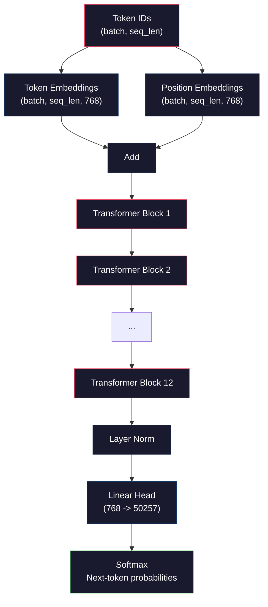
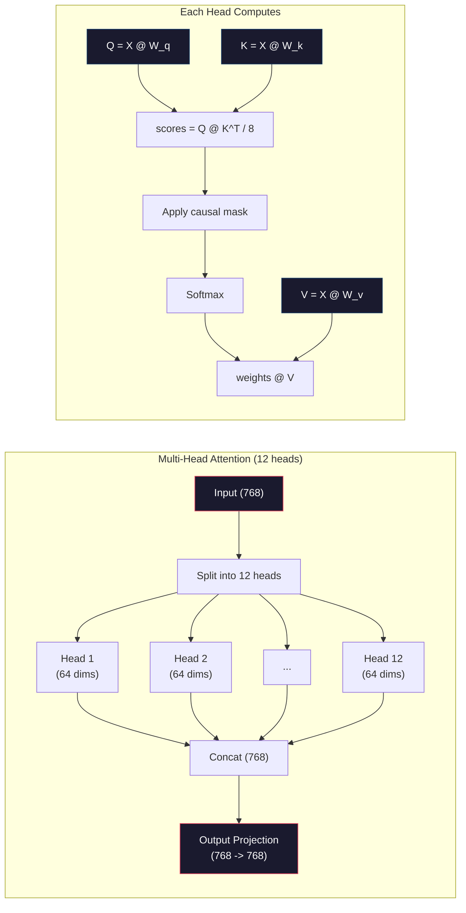
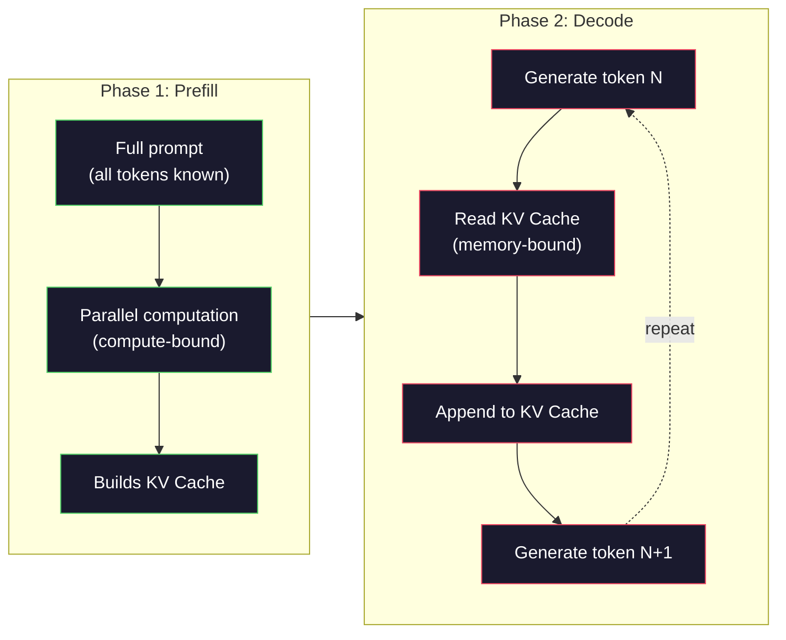

# Предварительное обучение мини-GPT (124M параметров)

> У GPT-2 Small 124 миллиона параметров. Это 12 слоёв трансформера, 12 голов внимания и 768-мерные векторные представления (эмбеддинги). Вы можете обучить её с нуля на одном GPU за несколько часов. Большинство людей никогда этого не делают. Они используют предварительно обученные контрольные точки. Но если вы не обучите модель сами, вы на самом деле не понимаете, что происходит внутри модели, на которой вы строите продукты.

**Тип:** Build
**Языки:** Python (с numpy)
**Предварительные требования:** Фаза 10, уроки 01-03 (токенизаторы, создание токенизатора, конвейеры данных)
**Время:** ~120 минут

## Цели обучения

- Реализовать полную архитектуру GPT-2 (124M параметров) с нуля: эмбеддинги токенов, позиционные эмбеддинги, блоки трансформера и голову языковой модели
- Обучить модель GPT на текстовом корпусе с помощью предсказания следующего токена и функции потерь на основе перекрёстной энтропии
- Реализовать авторегрессионную генерацию текста с сэмплированием по температуре и фильтрацией top-k/top-p
- Отслеживать кривые потерь при обучении и проверять, что модель выучивает связные языковые паттерны

## Проблема

Вы знаете, что такое трансформер. Вы читали диаграммы. Вы можете процитировать «всё, что вам нужно, — это внимание» и нарисовать на доске блоки с подписью «Многоголовое внимание».

Ничто из этого не означает, что вы понимаете, что происходит, когда модель генерирует текст.

В GPT-2 Small 124 438 272 параметра (с учётом связывания весов, weight tying). Каждый из них был установлен запуском цикла обучения: прямой проход, вычисление потерь, обратный проход, обновление весов. Двенадцать блоков трансформера. Двенадцать голов внимания на блок. 768-мерное пространство эмбеддингов. Словарь из 50 257 токенов. Каждый раз, когда модель генерирует токен, все 124 миллиона параметров участвуют в единой цепочке матричных умножений, которая берёт последовательность ID токенов и производит распределение вероятностей для следующего токена.

Если вы никогда не строили это сами, вы работаете с чёрным ящиком. Вы можете использовать API. Вы можете дообучать. Но когда что-то идёт не так — когда модель галлюцинирует, когда она повторяется, когда отказывается следовать инструкциям — у вас нет ментальной модели того, *почему*.

Этот урок строит GPT-2 Small с нуля. Не на PyTorch. На numpy. Каждое матричное умножение видимо. Каждый градиент вычисляется вашим кодом. Вы увидите ровно то, как 124 миллиона чисел сговариваются, чтобы предсказать следующее слово.

## Концепция

### Архитектура GPT

GPT — это авторегрессионная языковая модель. "Авторегрессионная" означает, что она генерирует по одному токену за раз, каждый обусловлен всеми предыдущими токенами. Архитектура — это стопка декодерных блоков трансформера.

Вот полный граф вычислений от ID токенов до вероятностей следующего токена:

1. Поступают ID токенов. Форма: (batch_size, seq_len).
2. Поиск эмбеддингов токенов. Каждый ID отображается в 768-мерный вектор. Форма: (batch_size, seq_len, 768).
3. Поиск позиционных эмбеддингов. Каждая позиция (0, 1, 2, ...) отображается в 768-мерный вектор. Та же форма.
4. Сложение эмбеддингов токенов и позиционных эмбеддингов.
5. Прохождение через 12 блоков трансформера.
6. Финальная нормализация слоя.
7. Линейная проекция на размер словаря. Форма: (batch_size, seq_len, vocab_size).
8. Softmax для получения вероятностей.

Это вся модель. Никаких свёрток. Никакой рекуррентности. Только эмбеддинги, внимание, сети прямого распространения и нормализация слоёв, повторённые 12 раз.



### Блок трансформера

Каждый из 12 блоков устроен одинаково. Это архитектура с предварительной нормализацией (pre-norm): GPT-2 использует pre-norm, а не нормализацию после подслоя (post-norm), как оригинальный трансформер.

1. Нормализация слоя (LayerNorm)
2. Многоголовое самовнимание
3. Остаточное соединение (сложение с входом)
4. Нормализация слоя (LayerNorm)
5. Сеть прямого распространения (MLP)
6. Остаточное соединение (сложение с входом)

Остаточные соединения критически важны. Без них градиенты затухают к тому моменту, когда достигают блока 1 при обратном распространении. С ними градиенты могут проходить напрямую от потерь к любому слою по обходному пути. Именно поэтому можно складывать 12, 32 или даже 96 блоков (по слухам, GPT-4 использует 120).

### Внимание: центральный механизм

Самовнимание позволяет каждому токену учитывать каждый предыдущий токен и определять, сколько внимания ему уделить. Вот как это выглядит математически.

Для каждой позиции токена из входа вычисляются три вектора:
- **Запрос (Query, Q)**: «Что я ищу?»
- **Ключ (Key, K)**: «Что я содержу?»
- **Значение (Value, V)**: «Какую информацию я несу?»

```
Q = input @ W_q    (768 -> 768)
K = input @ W_k    (768 -> 768)
V = input @ W_v    (768 -> 768)

attention_scores = Q @ K^T / sqrt(d_k)
attention_scores = mask(attention_scores)   # causal mask: -inf for future positions
attention_weights = softmax(attention_scores)
output = attention_weights @ V
```

Причинная маска (causal mask) — это то, что делает GPT авторегрессионной. Позиция 5 может обращать внимание на позиции 0-5, но не на 6, 7, 8 и так далее. Это не даёт модели "жульничать", заглядывая в будущие токены во время обучения.

**Многоголовое внимание (multi-head attention)** разбивает 768-мерное пространство на 12 голов по 64 измерения каждая. Каждая голова выучивает свою схему внимания. Одна голова может отслеживать синтаксические связи (согласование подлежащего и сказуемого). Другая — семантическое сходство (синонимы). Третья — позиционную близость (соседние слова). Выходы всех 12 голов объединяются и проецируются обратно в 768 измерений.



Деление на sqrt(d_k) -- sqrt(64) = 8 -- это масштабирование. Без него скалярные произведения становятся большими для высокоразмерных векторов, толкая softmax в области, где градиенты почти нулевые. Это было одним из ключевых наблюдений в оригинальной статье "Attention Is All You Need".

### KV-кеш: почему выполнение вывода (инференс) происходит быстро

Во время обучения вы обрабатываете всю последовательность целиком. Во время инференса вы генерируете по одному токену за раз. Без оптимизации генерация токена N требует повторного вычисления внимания для всех N-1 предыдущих токенов. Это O(N^2) на генерируемый токен, или O(N^3) в сумме для последовательности длины N.

KV-кеш решает эту проблему. После вычисления K и V для каждого токена они сохраняются. При генерации токена N+1 нужно вычислить только Q для нового токена и обратиться к кешированным K и V всех предыдущих токенов. Это снижает стоимость на токен с O(N) до O(1) для вычисления K и V. Вычисление оценок внимания всё ещё O(N), потому что внимание обращается ко всем предыдущим позициям, но при этом удаётся избежать избыточных матричных умножений над входом.

Для GPT-2 с 12 слоями и 12 головами KV-кеш хранит 2 (K + V) x 12 слоёв x 12 голов x 64 измерения = 18 432 значения на токен. Для последовательности из 1024 токенов это около 75 МБ в FP32. Для Llama 3 405B со 128 слоями KV-кеш для одной последовательности может превышать 10 ГБ. Именно поэтому инференс с длинным контекстом упирается в память.

### Предварительное заполнение и декодирование: две фазы инференса

Когда вы отправляете промпт LLM, инференс происходит в две отдельные фазы.

**Предварительное заполнение (prefill)** обрабатывает весь промпт параллельно. Все токены известны, поэтому модель может вычислить внимание для всех позиций одновременно. Эта фаза упирается в вычисления — GPU выполняет матричные умножения на полной пропускной способности. Для промпта из 1000 токенов на A100 предварительное заполнение занимает примерно 20-50 мс.

**Декодирование (decode)** генерирует токены по одному. Каждый новый токен зависит от всех предыдущих токенов. Эта фаза упирается в память — узкое место здесь чтение весов модели и KV-кеша из памяти GPU, а не сами матричные вычисления. Вычислительные ядра GPU в основном простаивают в ожидании чтения из памяти. Для GPT-2 каждый шаг декодирования занимает примерно одинаковое время независимо от того, сколько FLOPs требуют перемножения матриц, потому что ограничением служит пропускная способность памяти.

Это различие важно для производственных систем. Пропускная способность предварительного заполнения масштабируется с вычислительной мощностью GPU (больше FLOPS = быстрее предварительное заполнение). Пропускная способность декодирования масштабируется с пропускной способностью памяти (быстрее память = быстрее декодирование). Именно поэтому NVIDIA в H100 сделала упор на улучшение пропускной способности памяти по сравнению с A100 — это напрямую ускоряет генерацию токенов.



### Цикл обучения

Обучение LLM — это предсказание следующего токена. Дана последовательность токенов [0, 1, 2, ..., N-1], нужно предсказать токены [1, 2, 3, ..., N]. Функция потерь — перекрёстная энтропия между предсказанным моделью распределением вероятностей и фактическим следующим токеном.

Один шаг обучения:

1. **Прямой проход**: пропустите пакет через все 12 блоков. Получите логиты (оценки до softmax) для каждой позиции.
2. **Вычисление потерь**: перекрёстная энтропия между логитами и целевыми токенами (вход, сдвинутый на одну позицию).
3. **Обратный проход**: вычислите градиенты для всех 124M параметров с помощью обратного распространения ошибки.
4. **Шаг оптимизатора**: обновите веса. GPT-2 использует Adam с прогревом скорости обучения и косинусным затуханием.

Расписание скорости обучения важнее, чем можно ожидать. GPT-2 прогревается от 0 до пиковой скорости обучения в течение первых 2000 шагов, затем затухает по косинусной кривой. Начало с высокой скорости обучения приводит к расхождению модели. Постоянно высокая скорость вызывает осцилляции на поздних этапах обучения. Паттерн "прогрев, затем затухание" используется каждой крупной LLM.

### GPT-2 Small: цифры

| Компонент | Форма | Параметры |
|-----------|-------|------------|
| Эмбеддинги токенов | (50257, 768) | 38,597,376 |
| Позиционные эмбеддинги | (1024, 768) | 786,432 |
| Внимание в одном блоке (W_q, W_k, W_v, W_out) | 4 x (768, 768) | 2,359,296 |
| FFN в одном блоке (расширение + сжатие) | (768, 3072) + (3072, 768) | 4,718,592 |
| LayerNorm в одном блоке (2x) | 2 x 768 x 2 | 3,072 |
| Финальный LayerNorm | 768 x 2 | 1,536 |
| **Всего на блок** | | **7,080,960** |
| **Всего (12 блоков)** | | **85,054,464 + 39,383,808 = 124,438,272** |

Проекция вывода (голова логитов) использует общие веса с матрицей эмбеддингов токенов. Это называется связыванием весов (weight tying): оно уменьшает количество параметров на 38M и повышает качество модели, поскольку вынуждает её использовать одно и то же пространство представлений для входа и выхода.

## Реализация

### Шаг 1: Слой эмбеддингов

Эмбеддинги токенов отображают каждый из 50 257 возможных токенов в 768-мерный вектор. Позиционные эмбеддинги добавляют информацию о том, где именно токен находится в последовательности. Оба складываются.

```python
import numpy as np

class Embedding:
    def __init__(self, vocab_size, embed_dim, max_seq_len):
        self.token_embed = np.random.randn(vocab_size, embed_dim) * 0.02
        self.pos_embed = np.random.randn(max_seq_len, embed_dim) * 0.02

    def forward(self, token_ids):
        seq_len = token_ids.shape[-1]
        tok_emb = self.token_embed[token_ids]
        pos_emb = self.pos_embed[:seq_len]
        return tok_emb + pos_emb
```

Стандартное отклонение 0,02 для инициализации взято из статьи о GPT-2. Слишком большое — и начальные прямые проходы производят экстремальные значения, дестабилизирующие обучение. Слишком маленькое — и начальные выходы почти одинаковы для всех входов, делая ранние градиентные сигналы бесполезными.

### Шаг 2: Самовнимание с причинной маской

Сначала рассмотрим одноголовое внимание. Причинная маска устанавливает для будущих позиций отрицательную бесконечность перед применением softmax, гарантируя, что каждая позиция может обращать внимание только на себя и более ранние позиции.

```python
def attention(Q, K, V, mask=None):
    d_k = Q.shape[-1]
    scores = Q @ K.transpose(0, -1, -2 if Q.ndim == 4 else 1) / np.sqrt(d_k)
    if mask is not None:
        scores = scores + mask
    weights = np.exp(scores - scores.max(axis=-1, keepdims=True))
    weights = weights / weights.sum(axis=-1, keepdims=True)
    return weights @ V
```

Реализация softmax вычитает максимум перед экспоненцированием. Без этого exp(большое_число) переполняется до бесконечности. Это приём для численной стабильности, который не меняет результат, потому что softmax(x - c) = softmax(x) для любой константы c.

### Шаг 3: Многоголовое внимание

Разбейте 768-мерный вход на 12 голов по 64 измерения каждая. Каждая голова вычисляет внимание независимо. Объедините результаты и спроецируйте их обратно в 768 измерений.

```python
class MultiHeadAttention:
    def __init__(self, embed_dim, num_heads):
        self.num_heads = num_heads
        self.head_dim = embed_dim // num_heads
        self.W_q = np.random.randn(embed_dim, embed_dim) * 0.02
        self.W_k = np.random.randn(embed_dim, embed_dim) * 0.02
        self.W_v = np.random.randn(embed_dim, embed_dim) * 0.02
        self.W_out = np.random.randn(embed_dim, embed_dim) * 0.02

    def forward(self, x, mask=None):
        batch, seq_len, d = x.shape
        Q = (x @ self.W_q).reshape(batch, seq_len, self.num_heads, self.head_dim).transpose(0, 2, 1, 3)
        K = (x @ self.W_k).reshape(batch, seq_len, self.num_heads, self.head_dim).transpose(0, 2, 1, 3)
        V = (x @ self.W_v).reshape(batch, seq_len, self.num_heads, self.head_dim).transpose(0, 2, 1, 3)

        scores = Q @ K.transpose(0, 1, 3, 2) / np.sqrt(self.head_dim)
        if mask is not None:
            scores = scores + mask
        weights = np.exp(scores - scores.max(axis=-1, keepdims=True))
        weights = weights / weights.sum(axis=-1, keepdims=True)
        attn_out = weights @ V

        attn_out = attn_out.transpose(0, 2, 1, 3).reshape(batch, seq_len, d)
        return attn_out @ self.W_out
```

Последовательность reshape-transpose-reshape — самая запутанная часть многоголового внимания. Вот что происходит: тензор (batch, seq_len, 768) становится (batch, seq_len, 12, 64), затем (batch, 12, seq_len, 64). Теперь у каждой из 12 голов есть своя матрица (seq_len, 64) для вычисления внимания. После этого процесс выполняется в обратном порядке: (batch, 12, seq_len, 64) преобразуется в (batch, seq_len, 12, 64), а затем в (batch, seq_len, 768).

### Шаг 4: Блок трансформера

Один полный блок трансформера: LayerNorm, многоголовое внимание с остаточным соединением, LayerNorm и сеть прямого распространения с остаточным соединением.

```python
class LayerNorm:
    def __init__(self, dim, eps=1e-5):
        self.gamma = np.ones(dim)
        self.beta = np.zeros(dim)
        self.eps = eps

    def forward(self, x):
        mean = x.mean(axis=-1, keepdims=True)
        var = x.var(axis=-1, keepdims=True)
        return self.gamma * (x - mean) / np.sqrt(var + self.eps) + self.beta


class FeedForward:
    def __init__(self, embed_dim, ff_dim):
        self.W1 = np.random.randn(embed_dim, ff_dim) * 0.02
        self.b1 = np.zeros(ff_dim)
        self.W2 = np.random.randn(ff_dim, embed_dim) * 0.02
        self.b2 = np.zeros(embed_dim)

    def forward(self, x):
        h = x @ self.W1 + self.b1
        h = np.maximum(0, h)  # GELU approximation: ReLU for simplicity
        return h @ self.W2 + self.b2


class TransformerBlock:
    def __init__(self, embed_dim, num_heads, ff_dim):
        self.ln1 = LayerNorm(embed_dim)
        self.attn = MultiHeadAttention(embed_dim, num_heads)
        self.ln2 = LayerNorm(embed_dim)
        self.ffn = FeedForward(embed_dim, ff_dim)

    def forward(self, x, mask=None):
        x = x + self.attn.forward(self.ln1.forward(x), mask)
        x = x + self.ffn.forward(self.ln2.forward(x))
        return x
```

Сеть прямого распространения расширяет 768-мерный вход до 3072 измерений (в 4 раза), применяет нелинейность, а затем проецирует результат обратно в 768 измерений. Эта схема расширения и сжатия даёт модели «более широкое» внутреннее представление для работы на каждой позиции. GPT-2 использует активацию GELU, но здесь для простоты применяется ReLU — для понимания архитектуры разница незначительна.

### Шаг 5: Полная модель GPT

Сложите 12 блоков трансформера. Добавьте слой эмбеддингов спереди и проекцию вывода сзади.

```python
class MiniGPT:
    def __init__(self, vocab_size=50257, embed_dim=768, num_heads=12,
                 num_layers=12, max_seq_len=1024, ff_dim=3072):
        self.embedding = Embedding(vocab_size, embed_dim, max_seq_len)
        self.blocks = [
            TransformerBlock(embed_dim, num_heads, ff_dim)
            for _ in range(num_layers)
        ]
        self.ln_f = LayerNorm(embed_dim)
        self.vocab_size = vocab_size
        self.embed_dim = embed_dim

    def forward(self, token_ids):
        seq_len = token_ids.shape[-1]
        mask = np.triu(np.full((seq_len, seq_len), -1e9), k=1)

        x = self.embedding.forward(token_ids)
        for block in self.blocks:
            x = block.forward(x, mask)
        x = self.ln_f.forward(x)

        logits = x @ self.embedding.token_embed.T
        return logits

    def count_parameters(self):
        total = 0
        total += self.embedding.token_embed.size
        total += self.embedding.pos_embed.size
        for block in self.blocks:
            total += block.attn.W_q.size + block.attn.W_k.size
            total += block.attn.W_v.size + block.attn.W_out.size
            total += block.ffn.W1.size + block.ffn.b1.size
            total += block.ffn.W2.size + block.ffn.b2.size
            total += block.ln1.gamma.size + block.ln1.beta.size
            total += block.ln2.gamma.size + block.ln2.beta.size
        total += self.ln_f.gamma.size + self.ln_f.beta.size
        return total
```

Обратите внимание на связывание весов: `logits = x @ self.embedding.token_embed.T`. Проекция вывода повторно использует матрицу эмбеддингов токенов (транспонированную). Это не просто приём для экономии параметров. Это означает, что модель использует одно и то же векторное пространство для понимания токенов (эмбеддинги) и их предсказания (вывод).

### Шаг 6: Цикл обучения

Для реального обучающего прогона на 124M параметрах вам понадобится GPU и PyTorch. Этот цикл обучения демонстрирует механику на маленькой модели, которая работает на чистом numpy. Мы используем крошечную модель (4 слоя, 4 головы, 128 измерений), чтобы сделать её выполнимой.

```python
def cross_entropy_loss(logits, targets):
    batch, seq_len, vocab_size = logits.shape
    logits_flat = logits.reshape(-1, vocab_size)
    targets_flat = targets.reshape(-1)

    max_logits = logits_flat.max(axis=-1, keepdims=True)
    log_softmax = logits_flat - max_logits - np.log(
        np.exp(logits_flat - max_logits).sum(axis=-1, keepdims=True)
    )

    loss = -log_softmax[np.arange(len(targets_flat)), targets_flat].mean()
    return loss


def train_mini_gpt(text, vocab_size=256, embed_dim=128, num_heads=4,
                   num_layers=4, seq_len=64, num_steps=200, lr=3e-4):
    tokens = np.array(list(text.encode("utf-8")[:2048]))
    model = MiniGPT(
        vocab_size=vocab_size, embed_dim=embed_dim, num_heads=num_heads,
        num_layers=num_layers, max_seq_len=seq_len, ff_dim=embed_dim * 4
    )

    print(f"Model parameters: {model.count_parameters():,}")
    print(f"Training tokens: {len(tokens):,}")
    print(f"Config: {num_layers} layers, {num_heads} heads, {embed_dim} dims")
    print()

    for step in range(num_steps):
        start_idx = np.random.randint(0, max(1, len(tokens) - seq_len - 1))
        batch_tokens = tokens[start_idx:start_idx + seq_len + 1]

        input_ids = batch_tokens[:-1].reshape(1, -1)
        target_ids = batch_tokens[1:].reshape(1, -1)

        logits = model.forward(input_ids)
        loss = cross_entropy_loss(logits, target_ids)

        if step % 20 == 0:
            print(f"Step {step:4d} | Loss: {loss:.4f}")

    return model
```

Потери начинаются около ln(vocab_size) — для байтового словаря из 256 токенов это ln(256) = 5,55. Случайная модель присваивает равную вероятность каждому токену. По мере обучения потери снижаются, потому что модель учится предсказывать распространённые паттерны: "th" после "t", пробел после точки и так далее.

В продакшене вы бы использовали оптимизатор Adam с накоплением градиентов, прогревом скорости обучения и обрезкой градиентов. Цикл прямой проход-потери-обратный проход-обновление идентичен. Оптимизатор просто более сложный.

### Шаг 7: Генерация текста

Генерация использует обученную модель для предсказания токенов по одному за раз. Каждое предсказание сэмплируется из выходного распределения (либо берётся жадно как argmax).

```python
def generate(model, prompt_tokens, max_new_tokens=100, temperature=0.8):
    tokens = list(prompt_tokens)
    seq_len = model.embedding.pos_embed.shape[0]

    for _ in range(max_new_tokens):
        context = np.array(tokens[-seq_len:]).reshape(1, -1)
        logits = model.forward(context)
        next_logits = logits[0, -1, :]

        next_logits = next_logits / temperature
        probs = np.exp(next_logits - next_logits.max())
        probs = probs / probs.sum()

        next_token = np.random.choice(len(probs), p=probs)
        tokens.append(next_token)

    return tokens
```

Температура управляет случайностью. Температура 1,0 использует исходное распределение. Температура 0,5 обостряет его (более детерминированно — модель чаще выбирает свои лучшие варианты). Температура 1,5 сглаживает его (более случайно — токены с низкой вероятностью получают больше шансов). Температура 0,0 — это жадное декодирование (всегда выбирается токен с наибольшей вероятностью).

Окно `tokens[-seq_len:]` необходимо, потому что у модели есть максимальная длина контекста (1024 для GPT-2). Как только вы её превышаете, нужно отбрасывать самые старые токены. Это то самое "контекстное окно", о котором все говорят.

```figure
sampling-decoder
```

## Применение

### Полная демонстрация обучения и генерации

```python
corpus = """The transformer architecture has revolutionized natural language processing.
Attention mechanisms allow the model to focus on relevant parts of the input.
Self-attention computes relationships between all pairs of positions in a sequence.
Multi-head attention splits the representation into multiple subspaces.
Each attention head can learn different types of relationships.
The feedforward network provides nonlinear transformations at each position.
Residual connections enable gradient flow through deep networks.
Layer normalization stabilizes training by normalizing activations.
Position embeddings give the model information about token ordering.
The causal mask ensures autoregressive generation during training.
Pre-training on large text corpora teaches the model general language understanding.
Fine-tuning adapts the pre-trained model to specific downstream tasks."""

model = train_mini_gpt(corpus, num_steps=200)

prompt = list("The transformer".encode("utf-8"))
output_tokens = generate(model, prompt, max_new_tokens=100, temperature=0.8)
generated_text = bytes(output_tokens).decode("utf-8", errors="replace")
print(f"\nGenerated: {generated_text}")
```

На маленьком корпусе с маленькой моделью сгенерированный текст будет в лучшем случае частично связным. Он выучит некоторые байтовые паттерны из обучающего текста, но не сможет обобщать так, как GPT-2 делает это с 40 ГБ обучающих данных и полной архитектурой на 124M параметров. Дело не в качестве вывода. Дело в том, что вы можете отследить каждый шаг: поиск эмбеддингов, вычисление внимания, преобразование в сети прямого распространения, проекцию логитов, применение softmax и сэмплирование. Каждая операция видима.

## Итоговое задание

Этот урок создаёт `outputs/prompt-gpt-architecture-analyzer.md` — промпт, который анализирует архитектурные решения в любой модели семейства GPT. Передайте ему карточку модели или технический отчёт, и он разберёт распределение параметров, устройство механизма внимания и решения по масштабированию.

## Упражнения

1. Измените модель, чтобы использовать 24 слоя и 16 голов вместо 12/12. Посчитайте параметры. Как удвоение глубины сравнивается с удвоением ширины (размерности эмбеддингов)?

2. Реализуйте функцию активации GELU (GELU(x) = x * 0.5 * (1 + erf(x / sqrt(2)))) и замените ReLU в сети прямого распространения. Запустите обучение на 500 шагов с каждой активацией и сравните итоговые потери.

3. Добавьте KV-кеш в функцию генерации. Сохраняйте тензоры K и V для каждого слоя после первого прямого прохода и переиспользуйте их для последующих токенов. Измерьте ускорение: сгенерируйте 200 токенов с кешем и без него и сравните время выполнения.

4. Реализуйте сэмплирование top-k (учитываются только k токенов с наибольшей вероятностью) и сэмплирование top-p (ядерное сэмплирование, nucleus sampling: учитывается наименьший набор токенов, чья совокупная вероятность превышает p). Сравните качество вывода при температуре 0,8 для top-k=50 и top-p=0,95.

5. Постройте график кривой потерь при обучении. Обучите модель на 1000 шагов и постройте график потерь от шага. Определите три фазы: быстрый начальный спад (изучение распространённых байтов), более медленная средняя фаза (изучение байтовых паттернов) и плато (переобучение на маленьком корпусе). Форма этой кривой одинакова независимо от того, обучаете вы модель на 128 измерений или GPT-4.

## Ключевые термины

| Термин | Как обычно говорят | Что это означает на самом деле |
|------|----------------|----------------------|
| Авторегрессионная модель | «Генерирует по одному слову» | Каждый выходной токен обусловлен всеми предыдущими токенами: модель предсказывает P(token_n \| token_0, ..., token_{n-1}) |
| Причинная маска | «Не может видеть будущее» | Верхнетреугольная матрица со значениями, равными минус бесконечности, которая во время обучения не позволяет механизму внимания обращаться к будущим позициям |
| Многоголовое внимание | «Несколько схем внимания» | Разделение Q, K и V на параллельные головы (например, в GPT-2 это 12 голов по 64 измерения), позволяющее каждой голове изучать разные типы связей |
| KV-кеш | «Кеширование для ускорения» | Сохранение вычисленных тензоров ключей (Key) и значений (Value) для предыдущих токенов, позволяющее избежать повторных вычислений при авторегрессионной генерации |
| Предварительное заполнение | «Обработка промпта» | Первая фаза инференса, на которой все токены промпта обрабатываются параллельно; она ограничена вычислительной производительностью GPU в FLOPS |
| Декодирование | «Генерация токенов» | Вторая фаза инференса, на которой токены генерируются по одному; она ограничена пропускной способностью памяти GPU |
| Связывание весов | «Общие эмбеддинги» | Использование одной и той же матрицы для входных эмбеддингов токенов и выходной проекционной головы; в GPT-2 это экономит 38M параметров |
| Остаточное соединение | «Обходное соединение» | Непосредственное сложение входа с выходом подслоя (x + sublayer(x)), которое обеспечивает прохождение градиентов в глубоких сетях |
| Нормализация слоя | «Нормализация активаций» | Нормализация по измерению признаков до среднего 0 и дисперсии 1 с обучаемыми параметрами масштаба и смещения |
| Потери на основе перекрёстной энтропии | «Насколько ошибочны предсказания» | -log(вероятность, присвоенная правильному следующему токену), усреднённый по всем позициям; стандартная целевая функция обучения LLM |

## Дополнительные материалы

- [Radford et al., 2019 -- "Language Models are Unsupervised Multitask Learners" (GPT-2)](https://cdn.openai.com/better-language-models/language_models_are_unsupervised_multitask_learners.pdf) -- статья о GPT-2, представившая семейство параметров от 124M до 1.5B
- [Vaswani et al., 2017 -- "Attention Is All You Need"](https://arxiv.org/abs/1706.03762) -- оригинальная статья о трансформере с масштабированным вниманием на основе скалярного произведения и многоголовым вниманием
- [Llama 3 Technical Report](https://arxiv.org/abs/2407.21783) -- как Meta масштабировала архитектуру GPT до 405B параметров на 16K GPU
- [Pope et al., 2022 -- "Efficiently Scaling Transformer Inference"](https://arxiv.org/abs/2211.05102) -- статья, формализовавшая анализ предварительного заполнения, декодирования и KV-кеша
