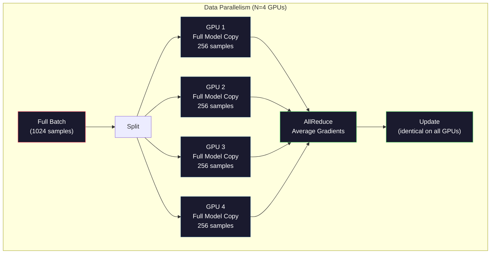
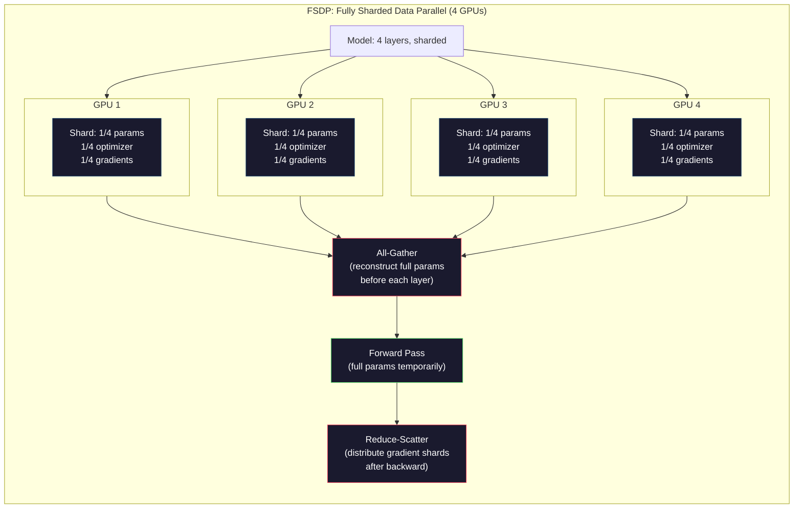
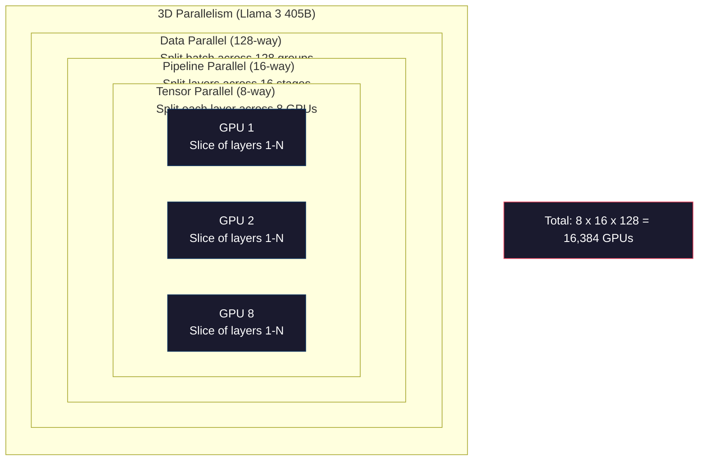

# Масштабирование: распределённое обучение, FSDP, DeepSpeed

> Ваша модель на 124M параметров обучалась на одном GPU. Теперь попробуйте 7 миллиардов параметров. Модель не помещается в память. Данные обрабатываются неделями на одной машине. Распределённое обучение при таком масштабе — не опция. Это единственный путь вперёд.

**Тип:** Build
**Языки:** Python
**Предварительные требования:** Фаза 10, урок 04 (Предварительное обучение Mini GPT)
**Время:** ~120 минут

## Цели обучения

- Объяснить три типа параллелизма (по данным, тензорный, конвейерный) и когда каждый из них необходим в зависимости от размера модели и кластера
- Реализовать параллельное по данным обучение с помощью PyTorch DDP с синхронизацией градиентов между несколькими GPU
- Рассчитать бюджет памяти для заданного размера модели (веса + состояния оптимизатора + градиенты + активации), чтобы определить минимальное оборудование
- Настроить стадии FSDP или DeepSpeed ZeRO для шардирования состояний модели между GPU и обучения моделей, которые превышают память одного GPU

## Проблема

Модели на 7B параметров в FP16 требуется 14GB только для весов. Оптимизатор Adam хранит две дополнительные копии каждого параметра (оценки первого и второго момента). Это ещё 28GB. Градиенты во время обратного распространения добавляют ещё 14GB. Вы на отметке 56GB ещё до того, как сохранена хотя бы одна активация.

У NVIDIA A100 80GB памяти.

56GB из 80GB израсходовано. Остаётся 24GB на активации — промежуточные значения, вычисленные во время прямого прохода, которые должны храниться для обратного распространения. Для последовательности из 2048 токенов с 4096-мерной моделью активации одного слоя занимают около 64MB. При 32 слоях на один пример нужно 2GB. Размер пакета 8 требует 16GB. У вас есть 24GB. Размер пакета 12 всё разрушает.

Теперь попробуйте 70B параметров. Одни только веса: 140GB в FP16. Не помещается на один GPU. Нужно как минимум 2 A100 (2 x 80GB = 160GB) просто чтобы удержать веса. Добавьте состояния оптимизатора и градиенты — понадобится гораздо больше: минимум 3+ GPU, а реалистично — 8-16 в зависимости от стратегии шардирования.

Llama 3 405B обучалась на 16 384 GPU NVIDIA H100. Вычислительные ресурсы для обучения обошлись примерно в $100 миллионов. Обучение сопоставимой модели DeepSeek V3 обошлось примерно в $5.6 миллиона благодаря продуманной архитектуре (Mixture of Experts означает, что на каждый токен активируется лишь часть параметров) и эффективному обучению.

Этот урок охватывает четыре стратегии, которые делают крупномасштабное обучение возможным: параллелизм по данным, тензорный параллелизм, конвейерный параллелизм и полностью шардированный параллелизм по данным. Вы смоделируете каждую из них на чистом Python, чтобы понять механику до того, как впервые прикоснётесь к фреймворку распределённого обучения.

## Концепция

### Почему распределение необходимо

Вот арифметика памяти для реальных моделей. Каждое число вычислено, а не оценено.

| Модель | Параметры | Веса (FP16) | Состояния Adam | Градиенты (FP16) | Итого (без активаций) |
|-------|--------|----------------|-------------|------------------|----------------------|
| GPT-2 Small | 124M | 248 MB | 992 MB | 248 MB | 1.5 GB |
| Llama 3 8B | 8B | 16 GB | 64 GB | 16 GB | 96 GB |
| Llama 3 70B | 70B | 140 GB | 560 GB | 140 GB | 840 GB |
| Llama 3 405B | 405B | 810 GB | 3,240 GB | 810 GB | 4,860 GB |

Столбец «Adam States» — это убийца. Adam хранит скользящее среднее (m) и скользящую дисперсию (v) для каждого параметра, оба в FP32. Для модели 70B это 70B x 4 байта x 2 = 560GB. Одному только оптимизатору нужно семь A100.

У одного H100 80GB. Llama 3 405B требует как минимум 61 H100, чтобы удержать веса, оптимизатор и градиенты. Добавьте активации — и число растёт ещё больше. Meta использовала 16 384 GPU не потому, что хотела, — потому что была вынуждена.

### Параллелизм по данным

Самая простая распределённая стратегия. Скопируйте всю модель на N GPU. Разбейте каждый обучающий пакет на N равных частей. Каждый GPU выполняет прямой и обратный проход на своём фрагменте данных. После обратного прохода усредните градиенты по всем GPU. Каждый GPU обновляет свою копию весов одними и теми же усреднёнными градиентами, сохраняя синхронность всех копий.

**Плюсы:** линейное масштабирование пропускной способности. N GPU обрабатывают в N раз больше данных за шаг. Коммуникация ограничена усреднением градиентов, которое перекрывается с вычислениями.

**Минусы:** каждый GPU хранит полную копию модели, состояний оптимизатора и градиентов. Для модели 70B каждому GPU нужно 840GB. Параллелизм по данным никак не снижает потребление памяти на GPU. Он только сокращает время обучения.

**Арифметика:** эффективный размер пакета = размер пакета на GPU x N. Для N=64 GPU с пакетом 16 на GPU эффективный пакет — 1 024. Llama 3 использовала эффективный размер пакета 16 миллионов токенов за шаг.



### Тензорный параллелизм

Разбейте отдельные слои между GPU. Одно матричное умножение делится между GPU, каждый из которых вычисляет часть результата.

Рассмотрим весовую матрицу формы (8192, 8192) в полносвязном слое FFN. При 4-стороннем тензорном параллелизме каждый GPU хранит фрагмент (8192, 2048). Каждый GPU умножает вход на свой фрагмент, получая частичный результат. Частичные результаты объединяются (через all-reduce или all-gather), чтобы получить полный выход.

**Плюсы:** снижает потребление памяти на GPU для весов модели. Модель 70B, разделённая между 8 GPU, означает, что каждый GPU хранит веса на ~8,75B параметров.

**Минусы:** требует быстрой межGPU-коммуникации после каждого слоя. All-reduce после каждого матричного умножения добавляет задержку. Это хорошо работает с NVLink (900 GB/с между GPU в одном узле), но плохо между узлами, соединёнными InfiniBand (400 Gb/с, около 50 GB/с). Тензорный параллелизм почти всегда ограничен одним узлом (8 GPU).

**Реальное применение:** Megatron-LM положила начало тензорному параллелизму. Llama 3 405B использует 8-сторонний тензорный параллелизм внутри каждого узла.

### Конвейерный параллелизм

Разбейте модель по слоям. GPU 1 выполняет слои 1-8. GPU 2 выполняет слои 9-16. GPU 3 выполняет слои 17-24. GPU 4 выполняет слои 25-32. Данные проходят через конвейер: GPU 1 вычисляет свои слои и отправляет активации на GPU 2, который вычисляет свои слои и отправляет на GPU 3, и так далее.

**Плюсы:** минимальная коммуникация между GPU — только активации на границах слоёв, которые малы по сравнению с градиентами или весами. Работает между узлами, потому что требования к пропускной способности низкие.

**Минусы:** конвейерные пузыри (pipeline bubbles). Пока GPU 4 вычисляет прямой проход на микропакете 1, GPU 1, 2 и 3 простаивают (они уже переслали свою часть). Во время обратного прохода картина обратная. При наивном конвейере загрузка GPU составляет всего 1/N для N стадий конвейера.

**GPipe и PipeDream** решают проблему пузырей, разбивая пакет на микропакеты. GPU 1 начинает работу над микропакетом 2, как только заканчивает прямой проход по микропакету 1. Это перекрывает вычисления между стадиями конвейера. При M микропакетах и N стадиях доля пузырей падает до (N-1)/M. При M=16 микропакетах и N=4 стадиях пузырь составляет 3/16 = 18,75% времени простоя.

### FSDP: полностью шардированный параллелизм по данным

FSDP объединяет масштабируемость параллелизма по данным с эффективностью памяти шардирования. Вместо того чтобы каждый GPU хранил полную копию модели, каждый GPU хранит только 1/N параметров, градиентов и состояний оптимизатора.

Перед прямым проходом слоя FSDP выполняет **all-gather**, чтобы собрать полные параметры со всех GPU в память каждого GPU. После прямого прохода каждый GPU отбрасывает нелокальные параметры. Во время обратного прохода all-gather выполняется снова, чтобы восстановить параметры для вычисления градиентов. После обратного прохода **reduce-scatter** распределяет фрагменты градиентов так, чтобы каждый GPU хранил только 1/N градиентов.

**Арифметика для модели 70B на 8 GPU:**

| Компонент | Без FSDP | С FSDP |
|-----------|-------------|-----------|
| Веса (FP16) | 140 GB на GPU | 17.5 GB на GPU |
| Состояния Adam (FP32) | 560 GB на GPU | 70 GB на GPU |
| Градиенты (FP16) | 140 GB на GPU | 17.5 GB на GPU |
| **Итого** | **840 GB на GPU** | **105 GB на GPU** |

Без FSDP модель 70B не помещается на один GPU с 80GB. С FSDP на 8 GPU каждый GPU использует 105GB — но и это ещё не помещается. Нужно как минимум 16 GPU, чтобы уложиться в 80GB на GPU, либо FSDP нужно сочетать с активационным чекпоинтингом (пересчёт активаций во время обратного прохода вместо их хранения).

Стоимость коммуникации выше, чем у обычного параллелизма по данным, из-за all-gather перед каждым слоем. Но экономия памяти делает возможными ранее невозможные обучающие запуски.



### DeepSpeed ZeRO

ZeRO (Zero Redundancy Optimizer) от DeepSpeed концептуально идентичен FSDP, но был разработан Microsoft независимо. Он определяет три стадии, каждая шардирует всё агрессивнее:

| Стадия | Что шардируется | Экономия памяти | Коммуникация |
|-------|--------|---------------|---------------|
| ZeRO-1 | Только состояния оптимизатора | ~4-кратное снижение | Как у обычного параллелизма по данным |
| ZeRO-2 | + градиенты | ~8-кратное снижение | Немного больше |
| ZeRO-3 | + параметры | ~N-кратное снижение (N GPU) | All-gather на каждый слой |

ZeRO-3 эквивалентен FSDP. Названия разные, механизм одинаковый. PyTorch добавил FSDP как нативную реализацию после того, как DeepSpeed доказал состоятельность концепции.

DeepSpeed также представил ZeRO-Offload (выгрузка состояний оптимизатора в оперативную память CPU, которая дешевле и больше) и ZeRO-Infinity (выгрузка на NVMe SSD). Это обменивает скорость вычислений на объём памяти — выгруженные операции медленнее, но освобождают память GPU.

### Обучение со смешанной точностью

Современное обучение использует несколько форматов чисел с плавающей точкой одновременно:

- **Прямой проход**: FP16 или BF16 (16 бит). Половина памяти по сравнению с FP32. Матричные умножения выполняются в 2 раза быстрее на тензорных ядрах.
- **Мастер-веса**: FP32 (32 бита). Поддерживаются оптимизатором для численной точности при обновлении весов.
- **Масштабирование потерь (loss scaling)**: умножение потерь на большую константу перед обратным проходом, чтобы предотвратить обнуление градиентов FP16 из-за underflow. Деление на ту же константу перед шагом оптимизатора.

BF16 (Brain Float 16) имеет тот же диапазон экспоненты, что и FP32 (8 бит экспоненты), но сниженную точность (7 бит мантиссы против 23 у FP32). Он редко требует масштабирования потерь, потому что может представлять тот же диапазон значений. У FP16 5 бит экспоненты и 10 бит мантиссы — он может представлять мелкозернистые значения, но переполняется/обнуляется при экстремальных величинах.

TPU от Google нативно используют BF16. NVIDIA A100 и H100 поддерживают и FP16, и BF16. Индустрия в основном перешла на BF16, потому что это устраняет головную боль с масштабированием потерь.

**Сравнение памяти для модели 7B:**

| Точность | Веса | Оптимизатор | Градиенты | Итого |
|-----------|---------|-----------|-----------|-------|
| Везде FP32 | 28 GB | 56 GB | 28 GB | 112 GB |
| Смешанная (BF16 + мастер-веса FP32) | 14 GB | 56 GB | 14 GB | 84 GB |

Смешанная точность экономит 28GB на этой модели. Состояния оптимизатора в любом случае остаются в FP32 — именно туда уходит основная часть памяти.

### Megatron-LM и 3D-параллелизм

Реальное крупномасштабное обучение объединяет все три вида параллелизма:

- **Параллелизм по данным** между группами узлов (масштабирование размера пакета)
- **Тензорный параллелизм** внутри узла (разбиение слоёв между 8 GPU)
- **Конвейерный параллелизм** между узлами (разбиение групп слоёв между машинами)

Llama 3 405B на 16 384 H100:
- 8-сторонний тензорный параллелизм внутри каждого узла (8 GPU на узел)
- 16-сторонний конвейерный параллелизм между узлами (16 стадий конвейера)
- 128-сторонний параллелизм по данным по оставшемуся измерению (16 384 / 8 / 16 = 128)

Это 3D-разложение (8 x 16 x 128 = 16 384) — способ масштабирования до тысяч GPU. Каждый GPU видит свой фрагмент данных (параллелизм по данным), хранит один срез каждого слоя (тензорный параллелизм) и вычисляет свой набор слоёв (конвейерный параллелизм).

DeepSeek V3 пошла другим путём. Их архитектура Mixture of Experts активирует только 37B из 671B параметров на токен. Это значит, что каждому GPU нужно вычислять (и хранить активации) только для активных параметров. DeepSeek обучала модель на 2 048 GPU H800 — меньше 1/8 количества GPU у Meta — за $5.6M против оценочных $100M у Meta.



```figure
paged-kv-cache
```

## Реализация

### Шаг 1: симуляция параллелизма по данным

Разбейте пакет между симулируемыми GPU. Каждый GPU вычисляет прямой проход на своём фрагменте. Усредните «градиенты» (мы симулируем их как значения потерь).

```python
import numpy as np

def simulate_data_parallelism(data, num_gpus, model_fn):
    batch_size = len(data)
    shard_size = batch_size // num_gpus
    remainder = batch_size % num_gpus

    gpu_losses = []
    gpu_gradients = []

    offset = 0
    for gpu_id in range(num_gpus):
        extra = 1 if gpu_id < remainder else 0
        shard = data[offset:offset + shard_size + extra]
        offset += shard_size + extra

        loss, grad = model_fn(shard)
        gpu_losses.append(loss)
        gpu_gradients.append(grad)

    avg_loss = np.mean(gpu_losses)
    avg_gradient = np.mean(gpu_gradients, axis=0)

    return avg_loss, avg_gradient
```

Операция all-reduce (усреднение градиентов) — единственная коммуникация в параллелизме по данным. На практике для этого используется библиотека NCCL на GPU NVIDIA, которая реализует кольцевой all-reduce: каждый GPU отправляет 1/N своих градиентов соседу, получает 1/N от другого соседа, и после N-1 шагов у каждого GPU есть полное среднее. Общий объём коммуникации: 2 x размер_градиента x (N-1)/N, приближаясь к 2-кратному размеру градиента при больших N.

### Шаг 2: симуляция тензорного параллелизма

Разбейте весовую матрицу между GPU. Каждый GPU вычисляет частичное матричное умножение. Объедините результаты.

```python
def simulate_tensor_parallelism(input_data, weight_matrix, num_gpus):
    d_in, d_out = weight_matrix.shape
    assert d_out % num_gpus == 0, f"d_out {d_out} not divisible by num_gpus {num_gpus}"
    shard_size = d_out // num_gpus

    partial_results = []
    for gpu_id in range(num_gpus):
        start = gpu_id * shard_size
        end = start + shard_size
        weight_shard = weight_matrix[:, start:end]

        partial = input_data @ weight_shard
        partial_results.append(partial)

    full_output = np.concatenate(partial_results, axis=-1)

    direct_output = input_data @ weight_matrix
    error = np.abs(full_output - direct_output).max()

    return full_output, error
```

Ошибка должна быть строго равна нулю (или машинному эпсилон). Тензорный параллелизм математически точен — он даёт тот же результат, что и вычисление полного матричного умножения на одном GPU. Разбиение идёт по выходному измерению, поэтому каждый GPU производит свой набор столбцов, а конкатенация восстанавливает полный результат.

Для колоночно-параллельных линейных слоёв (разбиение выходного измерения) вы конкатенируете. Для строчно-параллельных (разбиение входного измерения) вы суммируете. В FFN трансформера первый линейный слой (расширение) использует колоночный параллелизм, а второй (сжатие) — строчный. Это избавляет от all-reduce между двумя слоями.

### Шаг 3: симуляция конвейерного параллелизма

Разбейте слои модели между виртуальными GPU. Покажите проблему пузырей, когда ранние стадии простаивают, пока поздние стадии вычисляют.

```python
def simulate_pipeline_parallelism(num_layers, num_stages, num_microbatches):
    layers_per_stage = num_layers // num_stages

    timeline = {}
    clock = 0

    for mb in range(num_microbatches):
        for stage in range(num_stages):
            start_time = max(
                timeline.get((stage, mb - 1, "fwd"), (0, 0))[1] if mb > 0 else 0,
                timeline.get((stage - 1, mb, "fwd"), (0, 0))[1] if stage > 0 else 0,
            )
            end_time = start_time + layers_per_stage
            timeline[(stage, mb, "fwd")] = (start_time, end_time)

    last_fwd_end = max(v[1] for v in timeline.values())

    for mb in range(num_microbatches - 1, -1, -1):
        for stage in range(num_stages - 1, -1, -1):
            deps = [last_fwd_end]
            if mb < num_microbatches - 1 and (stage, mb + 1, "bwd") in timeline:
                deps.append(timeline[(stage, mb + 1, "bwd")][1])
            if stage < num_stages - 1 and (stage + 1, mb, "bwd") in timeline:
                deps.append(timeline[(stage + 1, mb, "bwd")][1])
            start_time = max(deps)
            end_time = start_time + layers_per_stage
            timeline[(stage, mb, "bwd")] = (start_time, end_time)

    total_time = max(v[1] for v in timeline.values())
    compute_time = num_microbatches * num_stages * layers_per_stage * 2
    bubble_fraction = 1.0 - compute_time / (total_time * num_stages)

    return timeline, total_time, bubble_fraction
```

При 4 стадиях и 1 микропакете доля пузырей составляет 75% — три из четырёх GPU простаивают в любой момент времени. При 16 микропакетах она падает примерно до 19%. Цена устранения пузырей — память: нужно хранить активации для всех микропакетов, находящихся в обработке одновременно.

### Шаг 4: калькулятор памяти

Вычислите точные требования к памяти для обучения модели любого размера.

```python
def memory_calculator(
    params_billions,
    precision_bytes=2,
    optimizer="adam",
    num_gpus=1,
    sharding="none",
    sequence_length=2048,
    batch_size_per_gpu=1,
    hidden_dim=None,
    num_layers=None,
):
    params = params_billions * 1e9

    weight_memory = params * precision_bytes

    if optimizer == "adam":
        optimizer_memory = params * 4 * 2
    elif optimizer == "sgd":
        optimizer_memory = params * 4
    else:
        optimizer_memory = 0

    gradient_memory = params * precision_bytes

    total_no_activation = weight_memory + optimizer_memory + gradient_memory

    if hidden_dim and num_layers:
        activation_per_layer = (
            sequence_length * batch_size_per_gpu * hidden_dim * precision_bytes * 4
        )
        activation_memory = activation_per_layer * num_layers
    else:
        activation_memory = params * precision_bytes * 0.5

    if sharding == "fsdp" or sharding == "zero3":
        weight_memory /= num_gpus
        optimizer_memory /= num_gpus
        gradient_memory /= num_gpus
    elif sharding == "zero2":
        optimizer_memory /= num_gpus
        gradient_memory /= num_gpus
    elif sharding == "zero1":
        optimizer_memory /= num_gpus

    per_gpu_total = weight_memory + optimizer_memory + gradient_memory + activation_memory

    return {
        "params_billions": params_billions,
        "weights_gb": weight_memory / 1e9,
        "optimizer_gb": optimizer_memory / 1e9,
        "gradients_gb": gradient_memory / 1e9,
        "activations_gb": activation_memory / 1e9,
        "per_gpu_total_gb": per_gpu_total / 1e9,
        "total_across_gpus_gb": per_gpu_total * num_gpus / 1e9,
        "fits_on_80gb": per_gpu_total / 1e9 <= 80,
        "num_gpus": num_gpus,
        "sharding": sharding,
    }
```

Этот калькулятор отвечает на вопрос, который задаёт каждый ML-инженер: «Сколько GPU мне нужно?» Передайте ему размер модели и посмотрите, поместится ли она. Меняйте стратегию шардирования, пока итог на один GPU не опустится ниже 80GB.

### Шаг 5: симуляция смешанной точности

Сравните использование памяти между FP32, FP16 и обучением со смешанной точностью.

```python
def mixed_precision_comparison(params_billions):
    params = params_billions * 1e9

    fp32_weights = params * 4
    fp32_optimizer = params * 4 * 2
    fp32_gradients = params * 4
    fp32_total = fp32_weights + fp32_optimizer + fp32_gradients

    fp16_weights = params * 2
    fp16_master = params * 4
    fp16_optimizer = params * 4 * 2
    fp16_gradients = params * 2
    fp16_total = fp16_weights + fp16_master + fp16_optimizer + fp16_gradients

    mixed_weights = params * 2
    mixed_optimizer = params * 4 * 2
    mixed_gradients = params * 2
    mixed_total = mixed_weights + mixed_optimizer + mixed_gradients

    return {
        "fp32_total_gb": fp32_total / 1e9,
        "fp16_with_master_gb": fp16_total / 1e9,
        "mixed_bf16_gb": mixed_total / 1e9,
        "savings_vs_fp32": 1 - mixed_total / fp32_total,
    }
```

Самый большой сюрприз для большинства людей: смешанная точность не сокращает память вдвое. Состояния оптимизатора (m и v у Adam) остаются в FP32 независимо от точности. Для модели 7B обучение в FP32 использует 112GB. Смешанная точность использует 84GB. Это снижение на 25%, а не на 50%. Оптимизатор доминирует.

## Применение

### Запуск всех симуляций

```python
def run_all_demos():
    print("=" * 70)
    print("DATA PARALLELISM SIMULATION")
    print("=" * 70)

    np.random.seed(42)
    data = np.random.randn(64, 32)
    weight = np.random.randn(32, 16)

    def model_fn(batch):
        output = batch @ weight
        loss = np.mean(output ** 2)
        grad = 2 * batch.T @ (batch @ weight) / len(batch)
        return loss, grad

    for n_gpus in [1, 2, 4, 8]:
        loss, grad = simulate_data_parallelism(data, n_gpus, model_fn)
        print(f"  {n_gpus} GPUs: loss={loss:.4f}, grad_norm={np.linalg.norm(grad):.4f}")

    print()
    print("=" * 70)
    print("TENSOR PARALLELISM SIMULATION")
    print("=" * 70)

    x = np.random.randn(4, 8192)
    W = np.random.randn(8192, 8192)

    for n_gpus in [1, 2, 4, 8]:
        output, error = simulate_tensor_parallelism(x, W, n_gpus)
        print(f"  {n_gpus} GPUs: output_shape={output.shape}, max_error={error:.2e}")

    print()
    print("=" * 70)
    print("PIPELINE PARALLELISM SIMULATION")
    print("=" * 70)

    for n_mb in [1, 4, 8, 16, 32]:
        _, total_t, bubble = simulate_pipeline_parallelism(32, 4, n_mb)
        print(f"  {n_mb:2d} micro-batches: total_time={total_t:4d}, bubble={bubble:.1%}")

    print()
    print("=" * 70)
    print("MEMORY CALCULATOR")
    print("=" * 70)

    configs = [
        (7, "none", 1),
        (7, "fsdp", 8),
        (70, "none", 1),
        (70, "fsdp", 8),
        (70, "fsdp", 16),
        (405, "fsdp", 64),
        (405, "fsdp", 128),
    ]

    print(f"  {'Model':>8} {'Sharding':>8} {'GPUs':>5} {'Per-GPU':>10} {'Fits 80GB':>10}")
    print("  " + "-" * 50)
    for params, shard, gpus in configs:
        result = memory_calculator(params, num_gpus=gpus, sharding=shard)
        fits = "Yes" if result["fits_on_80gb"] else "No"
        print(f"  {params:>6}B {shard:>8} {gpus:>5} {result['per_gpu_total_gb']:>8.1f}GB {fits:>10}")

    print()
    print("=" * 70)
    print("MIXED PRECISION COMPARISON")
    print("=" * 70)

    for params_b in [7, 13, 70, 405]:
        result = mixed_precision_comparison(params_b)
        print(f"  {params_b}B: FP32={result['fp32_total_gb']:.0f}GB, "
              f"Mixed BF16={result['mixed_bf16_gb']:.0f}GB, "
              f"Savings={result['savings_vs_fp32']:.0%}")
```

## Итоговое задание

Этот урок производит `outputs/prompt-distributed-training-planner.md` — промпт, который принимает размер модели и доступное оборудование, а затем формирует полный план распределённого обучения: стратегию параллелизма, бюджет памяти, накладные расходы на коммуникацию и ожидаемую пропускную способность.

## Упражнения

1. Модифицируйте калькулятор памяти, чтобы включить активационный чекпоинтинг. При чекпоинтинге активации хранятся только на каждом K-м слое (типичное K=1, то есть пересчёт всех). Покажите компромисс между памятью и вычислениями: сколько памяти экономит чекпоинтинг и насколько замедляется обучение (примерно на 33% больше вычислений при полном чекпоинтинге)?

2. Расширьте симуляцию конвейерного параллелизма, реализовав расписание 1F1B (one forward, one backward), используемое PipeDream. Сравните долю пузырей с наивным расписанием для 4 стадий и 8 микропакетов. Расписание 1F1B должно иметь меньший пиковый расход памяти, потому что оно раньше начинает обратные проходы.

3. Реализуйте симулятор накопления градиентов. Вместо all-reduce после каждого микропакета накапливайте градиенты локально в течение K шагов, затем выполняйте all-reduce. Покажите, как это сокращает коммуникацию в K раз, но даёт идентичные финальные градиенты (а значит, идентичное обучение).

4. Постройте оценщик стоимости. По размеру модели, целевому количеству токенов, типу GPU (A100 за $2/час, H100 за $3.50/час) и стратегии параллелизма оцените общую стоимость обучения в долларах. Проверьте на известных цифрах: по имеющимся данным, обучение Llama 3 405B стоило ~$100M, а DeepSeek V3 — ~$5.6M.

5. Добавьте ZeRO-Offload в калькулятор памяти. Предположите, что оперативной памяти CPU 512GB на узел, а NVMe — 2TB. Покажите, как выгрузка состояний оптимизатора в CPU позволяет обучать модель 70B на 4 GPU вместо 16, ценой замедления шагов оптимизатора на 30-50%.

## Ключевые термины

| Термин | Как обычно говорят | Что это означает на самом деле |
|------|----------------|----------------------|
| Параллелизм по данным | «Скопировать модель на каждый GPU» | Каждый GPU обрабатывает свой фрагмент данных; после каждого шага градиенты усредняются с помощью all-reduce |
| Тензорный параллелизм | «Разделить слой между GPU» | Весовые матрицы разбиваются так, чтобы каждый GPU вычислял часть матричного умножения; требуется быстрое соединение NVLink |
| Конвейерный параллелизм | «Разделить слои между GPU» | Каждый GPU выполняет свою группу слоёв; данные проходят по конвейеру микропакетами, чтобы уменьшить пузыри |
| FSDP | «Шардировать всё» | Полностью шардированный параллелизм по данным: каждый GPU хранит 1/N весов, градиентов и состояний оптимизатора; перед вычислением выполняется all-gather |
| ZeRO | «Версия FSDP от DeepSpeed» | Zero Redundancy Optimizer с 3 стадиями: шардирование оптимизатора (стадия 1), затем градиентов (стадия 2) и параметров (стадия 3) |
| All-reduce | «Усреднить между GPU» | Коллективная операция, после которой каждый GPU получает сумму (или среднее) входных данных всех GPU; обычно реализуется как кольцевой all-reduce |
| All-gather | «Собрать со всех GPU» | Коллективная операция, после которой каждый GPU получает конкатенацию данных всех GPU; в FSDP используется для восстановления полных параметров |
| Reduce-scatter | «Просуммировать и распределить» | Коллективная операция, которая редуцирует (суммирует) данные и распределяет разные фрагменты по разным GPU; в FSDP используется для шардирования градиентов |
| Смешанная точность | «Обучать с половинной точностью» | FP16/BF16 используются для прямого и обратного проходов, а FP32 — для состояний оптимизатора; это экономит ~25% памяти, а не 50%, поскольку основная часть памяти приходится на оптимизатор |
| Конвейерный пузырь | «Простой в конвейере» | Доля времени, в течение которого GPU простаивают в ожидании данных от предыдущей стадии; уменьшается при использовании большего числа микропакетов |

## Дополнительные материалы

- [Rajbhandari et al., 2020 -- "ZeRO: Memory Optimizations Toward Training Trillion Parameter Models"](https://arxiv.org/abs/1910.02054) -- статья DeepSpeed ZeRO, определившая три стадии шардирования
- [Shoeybi et al., 2020 -- "Megatron-LM: Training Multi-Billion Parameter Language Models Using Model Parallelism"](https://arxiv.org/abs/1909.08053) -- тензорный параллелизм NVIDIA для трансформеров
- [Narayanan et al., 2021 -- "Efficient Large-Scale Language Model Training on GPU Clusters Using Megatron-LM"](https://arxiv.org/abs/2104.04473) -- 3D-параллелизм, объединяющий параллелизм по данным, тензорный и конвейерный
- [Zhao et al., 2023 -- "PyTorch FSDP: Experiences on Scaling Fully Sharded Data Parallel"](https://arxiv.org/abs/2304.11277) -- нативная реализация FSDP в PyTorch
- [Llama 3 Technical Report](https://arxiv.org/abs/2407.21783) -- обучение на 16 384 GPU с подробностями 3D-параллелизма
- [DeepSeek-V3 Technical Report](https://arxiv.org/abs/2412.19437) -- как архитектура MoE снижает стоимость обучения на порядок
