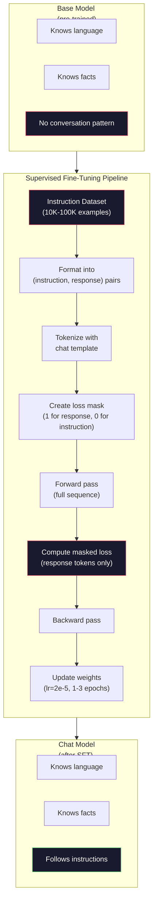

# Обучение на инструкциях (SFT)

> Базовая модель предсказывает следующий токен. Это всё, что она умеет. Она не следует инструкциям, не отвечает на вопросы и не отказывает в выполнении вредоносных запросов. SFT — это мост между предсказателем токенов и полезным ассистентом. Каждая модель, с которой вы когда-либо разговаривали — Claude, GPT, Llama Chat — прошла через этот этап.

**Тип:** Build
**Языки:** Python (с numpy)
**Предварительные требования:** Фаза 10, урок 04 (Предварительное обучение Mini GPT)
**Время:** ~90 минут

## Цели обучения

- Реализовать supervised fine-tuning (SFT), который превращает базовую языковую модель в ассистента, следующего инструкциям
- Форматировать обучающие данные с помощью шаблонов чата с ролями system, user и assistant и маскировать потери на токенах, не относящихся к assistant
- Объяснить, почему SFT необходим: базовые модели продолжают текст, а не отвечают на вопросы
- Оценить качество SFT, сравнивая ответы базовой модели и дообученной модели на отложенном наборе инструкций

## Проблема

В Уроке 04 вы обучили модель. Она умеет предсказывать следующий токен по заданной последовательности. Подайте ей «Архитектура трансформера» — и она может продолжить «произвела революцию в обработке естественного языка». Это впечатляет для предсказателя следующего токена.

Теперь попробуйте вот что: подайте ей «Какая столица Франции?» Базовая модель не отвечает «Париж». Она продолжает паттерн. Она может выдать «Какая столица Германии? Какая столица Испании?», потому что училась на документах, содержащих списки вопросов. Или может выдать «это вопрос, который задают многие люди», потому что это правдоподобное продолжение следующего токена. У модели нет понятия *ответа*. Она знает только *продолжение*.

Это разрыв между GPT-3 (базовая модель, выпущена в июне 2020) и ChatGPT (дообученная на инструкциях, выпущена в ноябре 2022). Та же архитектура. То же предварительное обучение. Разница — 20 000-100 000 тщательно составленных пар (инструкция, ответ), которые научили модель следовать паттерну диалога.

Stanford Alpaca доказала, что миллионы примеров не нужны. В марте 2023 года они дообучили Llama 7B всего на 52 000 парах инструкция-ответ, сгенерированных GPT-3.5. Общая стоимость: $600. В результате получился чат-бот, который мог следовать инструкциям, отвечать на вопросы и вести диалог. Он уступал ChatGPT, но за $600 и несколько часов обучения оказался поразительно близок к нему.

Llama 2 Chat от Meta использовала всего ~27 000 высококачественных примеров для своего первоначального этапа SFT. Ключевая идея: качество важнее количества. 27 000 примеров, написанных квалифицированными аннотаторами, превосходят 1 миллион зашумлённых примеров, собранных из интернета.

## Концепция

### Что на самом деле делает SFT

Supervised Fine-Tuning продолжает тот же цикл обучения, что и предварительное обучение — прямой проход, вычисление потерь, обратный проход, обновление весов — но на данных другого типа. Вместо сырого текста вы обучаете модель на структурированных диалогах:

```json
{
  "system": "You are a helpful assistant.",
  "user": "What is the capital of France?",
  "assistant": "The capital of France is Paris."
}
```

Модель уже знает, что Париж — столица Франции. Она узнала это во время предварительного обучения на Википедии, учебниках и веб-страницах. SFT не учит модель новым фактам. Он учит модель новому *поведению*: когда видишь вопрос, выдавай ответ. Когда видишь инструкцию, выдавай завершение. Когда видишь вредоносный запрос, выдавай отказ.

Представьте это так. Предварительное обучение даёт модели знания. SFT даёт модели манеры.

### Форматы данных

В индустрии доминируют три формата. Каждый кодирует одну и ту же информацию — кто что сказал — разными разделителями.

**Формат Alpaca** (Stanford, март 2023):

```json
{
  "instruction": "Summarize the following article in 3 sentences.",
  "input": "The European Central Bank raised interest rates...",
  "output": "The ECB increased rates by 25 basis points..."
}
```

Простой и широко используемый. Поле `input` необязательно — многим инструкциям не нужен дополнительный контекст. Stanford выпустил 52 000 примеров в этом формате, сгенерированных GPT-3.5 за $600. Это положило начало движению инструкционного дообучения с открытым исходным кодом.

**Формат ShareGPT** (сообщество, 2023):

```json
{
  "conversations": [
    {"from": "system", "value": "You are a helpful assistant."},
    {"from": "human", "value": "What causes tides?"},
    {"from": "gpt", "value": "Tides are caused by the gravitational pull of the Moon..."},
    {"from": "human", "value": "How often do they occur?"},
    {"from": "gpt", "value": "Most coastal areas experience two high tides and two low tides per day..."}
  ]
}
```

Поддерживает многоходовые диалоги. Поле «from» по соглашению использует «human» и «gpt», независимо от фактической модели. Vicuna обучалась на 70 000 диалогах ShareGPT, собранных из транскриптов ChatGPT, которыми делились пользователи.

**Формат ChatML** (OpenAI, используется во многих open-source моделях):

```
<|im_start|>system
You are a helpful assistant.<|im_end|>
<|im_start|>user
What is the capital of France?<|im_end|>
<|im_start|>assistant
The capital of France is Paris.<|im_end|>
```

Использует специальные токены (`<|im_start|>`, `<|im_end|>`) для разделения ролей. Эти токены добавляются в словарь токенизатора во время дообучения. Qwen, Yi и многие другие модели используют ChatML.

Все три формата решают одну и ту же задачу: они сообщают модели «вот инструкция, вот ответ, выучи этот паттерн».

### Почему это работает

Модель уже знает язык благодаря предварительному обучению. Она видела миллиарды примеров вопросов, за которыми следуют ответы, инструкций, за которыми следуют завершения, и диалогов между людьми. Паттерны уже закодированы в весах.

SFT концентрирует эту скрытую способность. Вместо того чтобы модели приходилось выяснять из контекста, должна ли она ответить на вопрос или продолжить документ, SFT явно обучает на паттерне диалога. После нескольких тысяч примеров модель усваивает: когда видишь маркер роли assistant, выдавай полезный ответ.

Вот почему 27 000 примеров достаточно. Вы не учите модель английскому языку. Вы не учите её фактам о мире. Вы учите её одному простому поведению: отвечать на инструкции. Знания уже были на месте.

### Маскированная функция потерь

Это самая важная техническая деталь в SFT, и большинство учебных материалов её пропускают.

Во время предварительного обучения потери вычисляются на каждом токене. Модель учится предсказывать каждый следующий токен в последовательности. Во время SFT потери вычисляются только на токенах *ответа*. Токены инструкции присутствуют для контекста, но модель не штрафуется за неверное «предсказание» их.

Почему? Потому что вы не хотите, чтобы модель училась *генерировать* инструкции. Вы хотите, чтобы она училась *отвечать на* инструкции. Если вычислять потери на токенах инструкции, вы обучаете модель предсказывать «Какая столица Франции?», как будто это она сама задаёт вопрос. Это тратит сигнал градиента впустую и может запутать модель насчёт её роли.

На практике вы создаёте маску потерь: 1 для токенов ответа, 0 для токенов инструкции. Умножьте потери на токен на эту маску перед усреднением.

```
Tokens:    [SYS] You are helpful [USER] What is the capital? [ASST] Paris is the capital [EOS]
Loss mask:   0    0    0     0      0     0   0  0     0       1     1    1   1     1      1
```

В функцию потерь вносят вклад только токены после `[ASST]`. Модель видит весь диалог во время прямого прохода (ей нужна инструкция, чтобы выдать правильный ответ), но обновляет веса только на основе того, насколько хорошо она предсказала ответ.

### Гиперпараметры обучения

SFT использует гиперпараметры, кардинально отличающиеся от предварительного обучения. Вы не обучаете модель с нуля. Вы корректируете модель, которая уже работает.

| Параметр | Предварительное обучение (Llama 2 7B) | SFT (Llama 2 Chat) |
|-----------|---------------------------|---------------------|
| Скорость обучения | 3e-4 (пиковое значение) | 2e-5 |
| Эпохи | 1 (один проход по данным) | 2 |
| Размер пакета | 4M токенов | 64 примера |
| Шаги разогрева | 2,000 | 0-100 |
| Затухание весов | 0.1 | 0.0-0.1 |
| Объём данных | 2T токенов | 27,000 примеров |

Скорость обучения для SFT в 15 раз ниже. Это критически важно. Высокая скорость обучения при дообучении разрушает предобученные знания. Модель «забывает» то, что выучила, и переобучается на маленьком наборе данных дообучения. Это катастрофическое забывание.

Две эпохи означают, что модель видит каждый обучающий пример дважды. Больше 3 эпох на маленьком наборе данных приводит к запоминанию — модель начинает дословно воспроизводить обучающие примеры вместо обобщения.

### Катастрофическое забывание

Дообучение может разрушить общие способности. Если обучать слишком долго на данных для следования инструкциям, модель теряет способность писать код, делать математику или создавать творческий текст. Она становится очень хороша в конкретном формате своих обучающих данных и ужасна во всём остальном.

Три способа смягчения:

1. **Низкая скорость обучения.** От 1e-5 до 5e-5. Меньшие обновления означают меньшее разрушение предобученных признаков.

2. **Короткое обучение.** 1-3 эпохи. Остановка до того, как модель переобучится.

3. **Подмешивание данных предварительного обучения.** Llama 2 Chat подмешивала небольшой процент (2-5%) сырых данных предварительного обучения в набор данных SFT. Это «напоминает» модели о её общих способностях, пока она обучается новому поведению следования инструкциям.

### Реальные цифры

Дообучение модели 7B на 10 000 высококачественных парах инструкций занимает примерно 1 час на одном GPU NVIDIA A100 80GB. Вот арифметика:

- 10 000 примеров x 512 токенов в среднем = 5,12M токенов
- 2 эпохи = 10,24M токенов всего
- Пропускная способность A100 для дообучения модели 7B: ~3 000 токенов/секунду
- 10,24M / 3 000 = ~3 400 секунд = ~57 минут

Для нашей мини-GPT (4 слоя, 128 измерений) обучение происходит почти мгновенно. Суть в том, чтобы понять механику, а не масштаб.



```figure
loss-masking
```

## Реализация

### Шаг 1: набор данных инструкций

Создайте синтетический набор данных инструкций. В продакшене такие компании, как Scale AI и Anthropic, нанимают людей-аннотаторов, чтобы писать их. Мы создадим их программно, чтобы продемонстрировать формат.

```python
import numpy as np

INSTRUCTION_DATA = [
    {
        "instruction": "What is the capital of France?",
        "response": "The capital of France is Paris."
    },
    {
        "instruction": "Explain gravity in one sentence.",
        "response": "Gravity is the force that attracts objects with mass toward each other."
    },
    {
        "instruction": "Write a haiku about the ocean.",
        "response": "Waves crash on the shore, salt and foam beneath the sun, endless blue expanse."
    },
    {
        "instruction": "What is 15 multiplied by 7?",
        "response": "15 multiplied by 7 is 105."
    },
    {
        "instruction": "Name three programming languages.",
        "response": "Three programming languages are Python, Rust, and TypeScript."
    },
    {
        "instruction": "Summarize photosynthesis.",
        "response": "Photosynthesis converts sunlight, water, and carbon dioxide into glucose and oxygen."
    },
    {
        "instruction": "What year did World War II end?",
        "response": "World War II ended in 1945."
    },
    {
        "instruction": "Define machine learning.",
        "response": "Machine learning is a field where algorithms learn patterns from data to make predictions."
    },
]
```

Восемь примеров — это крошечный набор. Stanford Alpaca использовала 52 000. Но механика одинакова, есть у вас 8 или 52 000 примеров: токенизация, маскирование, вычисление потерь только на ответах.

### Шаг 2: токенизация с шаблоном чата

Преобразуйте пары инструкция-ответ в последовательности токенов со специальными маркерами ролей. Маркеры сообщают модели, где заканчивается инструкция и начинается ответ.

```python
SPECIAL_TOKENS = {
    "INST_START": 253,
    "INST_END": 254,
    "RESP_START": 255,
}


def tokenize_instruction_pair(instruction, response, vocab_size=256):
    inst_tokens = list(instruction.encode("utf-8"))
    resp_tokens = list(response.encode("utf-8"))

    inst_tokens = [min(t, vocab_size - 4) for t in inst_tokens]
    resp_tokens = [min(t, vocab_size - 4) for t in resp_tokens]

    tokens = (
        [SPECIAL_TOKENS["INST_START"]]
        + inst_tokens
        + [SPECIAL_TOKENS["INST_END"]]
        + [SPECIAL_TOKENS["RESP_START"]]
        + resp_tokens
    )

    return tokens


def create_loss_mask(tokens):
    mask = np.zeros(len(tokens), dtype=np.float32)
    in_response = False

    for i, token in enumerate(tokens):
        if token == SPECIAL_TOKENS["RESP_START"]:
            in_response = True
            continue
        if in_response:
            mask[i] = 1.0

    return mask
```

Маска потерь состоит из нулей для токенов инструкции и единиц для токенов ответа. Сам токен `RESP_START` получает маску 0, потому что это разделитель, а не часть содержимого ответа.

### Шаг 3: маскированная кросс-энтропийная функция потерь

Стандартная кросс-энтропия, но умноженная на маску потерь. Только токены ответа вносят вклад в градиент.

```python
def masked_cross_entropy_loss(logits, targets, loss_mask):
    batch, seq_len, vocab_size = logits.shape
    logits_flat = logits.reshape(-1, vocab_size)
    targets_flat = targets.reshape(-1)
    mask_flat = loss_mask.reshape(-1)

    max_logits = logits_flat.max(axis=-1, keepdims=True)
    log_softmax = logits_flat - max_logits - np.log(
        np.exp(logits_flat - max_logits).sum(axis=-1, keepdims=True)
    )

    per_token_loss = -log_softmax[np.arange(len(targets_flat)), targets_flat]

    masked_loss = per_token_loss * mask_flat
    num_response_tokens = mask_flat.sum()
    if num_response_tokens == 0:
        return 0.0
    loss = masked_loss.sum() / num_response_tokens

    return loss
```

В знаменателе `num_response_tokens`, а не `seq_len`. Если делить на полную длину последовательности, длинные инструкции разбавляют сигнал градиента. Деление на количество токенов ответа гарантирует одинаковый вес на токен ответа независимо от длины инструкции.

### Шаг 4: цикл обучения SFT

Переиспользуйте MiniGPT из Урока 04. Цикл обучения выглядит почти идентично предварительному обучению, но с форматированием инструкций и маскированными потерями.

```python
import sys
import os
sys.path.insert(0, os.path.join(os.path.dirname(__file__), "..", "..", "04-pre-training-mini-gpt", "code"))
from main import MiniGPT, LayerNorm, FeedForward, MultiHeadAttention, TransformerBlock, Embedding


def sft_train(model, dataset, num_epochs=2, lr=2e-5, seq_len=64):
    formatted_data = []
    for example in dataset:
        tokens = tokenize_instruction_pair(example["instruction"], example["response"])
        mask = create_loss_mask(tokens)
        formatted_data.append((tokens, mask))

    print(f"SFT Training: {len(formatted_data)} examples, {num_epochs} epochs, lr={lr}")
    print(f"Total tokens: {sum(len(t) for t, _ in formatted_data):,}")
    print()

    losses = []

    for epoch in range(num_epochs):
        epoch_loss = 0.0
        num_batches = 0

        indices = np.random.permutation(len(formatted_data))

        for idx in indices:
            tokens, mask = formatted_data[idx]

            if len(tokens) < 3:
                continue
            if len(tokens) > seq_len:
                tokens = tokens[:seq_len]
                mask = mask[:seq_len]

            input_ids = np.array(tokens[:-1]).reshape(1, -1)
            target_ids = np.array(tokens[1:]).reshape(1, -1)
            loss_mask = np.array(mask[1:]).reshape(1, -1)

            logits = model.forward(input_ids)
            loss = masked_cross_entropy_loss(logits, target_ids, loss_mask)

            batch_size, s_len, v_size = logits.shape
            probs = np.exp(logits - logits.max(axis=-1, keepdims=True))
            probs = probs / probs.sum(axis=-1, keepdims=True)
            dlogits = probs.copy()
            dlogits[np.arange(batch_size)[:, None], np.arange(s_len), target_ids] -= 1.0

            mask_expanded = loss_mask[:, :, np.newaxis]
            num_resp = loss_mask.sum()
            if num_resp > 0:
                dlogits = dlogits * mask_expanded / num_resp

            for block in model.blocks:
                block.ffn.W1 -= lr * np.random.randn(*block.ffn.W1.shape) * 0.01
                block.ffn.W2 -= lr * np.random.randn(*block.ffn.W2.shape) * 0.01
                block.ffn.b1 -= lr * np.random.randn(*block.ffn.b1.shape) * 0.01
                block.ffn.b2 -= lr * np.random.randn(*block.ffn.b2.shape) * 0.01

            epoch_loss += loss
            num_batches += 1
            losses.append(loss)

        avg_loss = epoch_loss / max(num_batches, 1)
        print(f"Epoch {epoch + 1}/{num_epochs} | Avg Loss: {avg_loss:.4f}")

    return model, losses
```

Скорость обучения — 2e-5, как у Llama 2 Chat. Сравните это с 3e-4, используемой при предварительном обучении — в 15 раз меньше. Градиент маскирован: токены инструкции дают нулевой градиент. Только токены ответа сдвигают веса.

### Шаг 5: сравнение базовой и SFT-модели

Весь смысл SFT — в поведенческом изменении. Измерим его, проверив, как модель реагирует на входные данные, отформатированные как инструкции, по сравнению с продолжением сырого текста.

```python
def generate_response(model, prompt_tokens, max_new_tokens=50, temperature=0.8):
    tokens = list(prompt_tokens)
    seq_len = model.embedding.pos_embed.shape[0]

    for _ in range(max_new_tokens):
        context = np.array(tokens[-seq_len:]).reshape(1, -1)
        logits = model.forward(context)
        next_logits = logits[0, -1, :]

        next_logits = next_logits / max(temperature, 1e-8)
        probs = np.exp(next_logits - next_logits.max())
        probs = probs / probs.sum()
        probs = np.clip(probs, 1e-10, 1.0)
        probs = probs / probs.sum()

        next_token = np.random.choice(len(probs), p=probs)
        tokens.append(int(next_token))

    return tokens


def evaluate_instruction_following(model, instructions):
    print("Evaluating instruction following:")
    print("-" * 50)

    for instruction in instructions:
        tokens = (
            [SPECIAL_TOKENS["INST_START"]]
            + [min(t, 252) for t in list(instruction.encode("utf-8"))]
            + [SPECIAL_TOKENS["INST_END"]]
            + [SPECIAL_TOKENS["RESP_START"]]
        )

        output = generate_response(model, tokens, max_new_tokens=30, temperature=0.6)
        response_start = len(tokens)
        response_tokens = output[response_start:]
        response_bytes = bytes([t for t in response_tokens if t < 128])
        response_text = response_bytes.decode("utf-8", errors="replace")

        print(f"  Q: {instruction}")
        print(f"  A: {response_text[:80]}")
        print()
```

На крошечной модели с 8 примерами ответы не будут осмысленными. Это ожидаемо. Важна *структура*: модель учится выдавать вывод после маркера ответа, вместо того чтобы продолжать генерировать новые инструкции.

### Шаг 6: измерение катастрофического забывания

Сравните способность модели предсказывать следующий токен до и после SFT. Если SFT наносит ущерб общим способностям, потери на сыром тексте вырастут.

```python
def measure_forgetting(model, test_text, seq_len=64):
    tokens = np.array(list(test_text.encode("utf-8")[:512]))

    total_loss = 0.0
    num_windows = 0

    for start in range(0, len(tokens) - seq_len - 1, seq_len):
        input_ids = tokens[start:start + seq_len].reshape(1, -1)
        target_ids = tokens[start + 1:start + seq_len + 1].reshape(1, -1)

        logits = model.forward(input_ids)

        batch, s_len, vocab_size = logits.shape
        logits_flat = logits.reshape(-1, vocab_size)
        targets_flat = target_ids.reshape(-1)

        max_logits = logits_flat.max(axis=-1, keepdims=True)
        log_softmax = logits_flat - max_logits - np.log(
            np.exp(logits_flat - max_logits).sum(axis=-1, keepdims=True)
        )

        loss = -log_softmax[np.arange(len(targets_flat)), targets_flat].mean()
        total_loss += loss
        num_windows += 1

    return total_loss / max(num_windows, 1)
```

В реальном дообучении вы бы отслеживали эту метрику на протяжении всего обучения. Если потери на сыром тексте вырастают более чем на 10-15%, ваш SFT слишком агрессивен. Снизьте скорость обучения или уменьшите количество эпох.

## Применение

### Полная демонстрация конвейера SFT

```python
if __name__ == "__main__":
    np.random.seed(42)

    test_text = """The transformer architecture processes sequences through self-attention.
Each layer applies multi-head attention followed by a feedforward network.
Residual connections and layer normalization stabilize deep networks.
The model learns to predict the next token given all previous tokens."""

    print("=" * 70)
    print("INSTRUCTION TUNING (SFT) DEMO")
    print("=" * 70)
    print()

    model = MiniGPT(
        vocab_size=256, embed_dim=128, num_heads=4,
        num_layers=4, max_seq_len=128, ff_dim=512
    )
    print(f"Model: {model.count_parameters():,} parameters")
    print(f"Config: 4 layers, 4 heads, 128 dims (mini GPT from Lesson 04)")
    print()

    print("PRE-SFT: Measuring base model loss on raw text")
    base_loss = measure_forgetting(model, test_text)
    print(f"  Base model loss: {base_loss:.4f}")
    print()

    print("=" * 70)
    print("SFT TRAINING")
    print("=" * 70)

    model, losses = sft_train(
        model, INSTRUCTION_DATA, num_epochs=3, lr=2e-5, seq_len=128
    )

    print()
    print("POST-SFT: Measuring fine-tuned model loss on raw text")
    sft_loss = measure_forgetting(model, test_text)
    print(f"  SFT model loss: {sft_loss:.4f}")
    print(f"  Change: {((sft_loss - base_loss) / base_loss * 100):+.1f}%")
    if abs(sft_loss - base_loss) / base_loss < 0.15:
        print("  Minimal forgetting (< 15% change)")
    else:
        print("  Significant forgetting detected")
    print()

    print("=" * 70)
    print("INSTRUCTION FOLLOWING EVALUATION")
    print("=" * 70)
    print()

    test_instructions = [
        "What is the capital of France?",
        "Name a programming language.",
        "Define gravity.",
    ]
    evaluate_instruction_following(model, test_instructions)

    print("=" * 70)
    print("DATA FORMAT EXAMPLES")
    print("=" * 70)
    print()

    for i, example in enumerate(INSTRUCTION_DATA[:3]):
        tokens = tokenize_instruction_pair(example["instruction"], example["response"])
        mask = create_loss_mask(tokens)
        resp_count = int(mask.sum())
        total_count = len(tokens)
        print(f"  Example {i + 1}: {total_count} tokens, {resp_count} response tokens ({resp_count/total_count:.0%} of sequence)")
        print(f"    Instruction: {example['instruction']}")
        print(f"    Response: {example['response']}")
        print()

    print("=" * 70)
    print("TRAINING LOSS CURVE")
    print("=" * 70)
    print()

    if losses:
        window = max(1, len(losses) // 5)
        for i in range(0, len(losses), window):
            chunk = losses[i:i + window]
            avg = sum(chunk) / len(chunk)
            print(f"  Steps {i:3d}-{i + len(chunk) - 1:3d}: avg loss = {avg:.4f}")
```

## Итоговое задание

Этот урок производит `outputs/prompt-sft-data-curator.md` — промпт, который помогает проектировать и курировать наборы данных для SFT. По заданной целевой способности (генерация кода, математика, диалог) он формирует план сбора данных со спецификациями формата, критериями качества и требованиями к разнообразию.

## Упражнения

1. Добавьте поддержку системного промпта. Модифицируйте `tokenize_instruction_pair`, чтобы она принимала системное сообщение и добавляла его перед инструкцией. Создайте 5 примеров с разными системными промптами («Ты поэт», «Ты репетитор по математике») и убедитесь, что модель видит разные системные промпты во время обучения.

2. Реализуйте подмешивание данных. Создайте функцию, которая принимает набор данных SFT и корпус сырого текста, а затем формирует обучающие пакеты, где 5% примеров — это сырой текст (без маскирования), а 95% — пары инструкций (маскированные). Запустите 3 эпохи и сравните метрики забывания с чистым SFT-обучением.

3. Постройте оценщик качества данных. Для каждой пары инструкция-ответ вычислите: (a) длину ответа в токенах, (b) отношение длины инструкции к длине ответа, (c) разнообразие словаря (уникальные токены / всего токенов). Отфильтруйте примеры с длиной ответа < 10 токенов или разнообразием < 0,3. Покажите, как фильтрация влияет на итоговые потери.

4. Реализуйте обучение на многоходовых диалогах. Расширьте токенизацию для обработки 3-ходовых диалогов (user-assistant-user-assistant-user-assistant). Маска потерь должна покрывать все три хода assistant. Проверьте корректность маски, распечатав соответствие токенов и маски для одного примера.

5. Сравните скорости обучения. Обучите одну и ту же модель три раза с lr=1e-4, lr=2e-5 и lr=1e-6. Постройте кривые потерь. Прогон с 1e-4 должен показать быстрое начальное снижение, но более высокие итоговые потери (переобучение). Прогон с 1e-6 должен почти не сдвигаться. Прогон с 2e-5 должен быть оптимальным.

## Ключевые термины

| Термин | Как обычно говорят | Что это означает на самом деле |
|------|----------------|----------------------|
| SFT | «Дообучение на диалогах» | Дообучение с учителем (Supervised Fine-Tuning): продолжение обучения на парах (инструкция, ответ), при котором функция потерь вычисляется только на токенах ответа |
| Обучение на инструкциях | «Обучение модели следовать инструкциям» | Обучение на явных парах инструкция-ответ, благодаря которому базовая модель осваивает паттерн диалога, а не новые знания |
| Маскирование функции потерь | «Игнорирование промпта» | Обнуление функции потерь для токенов инструкции, чтобы градиенты поступали только от предсказаний токенов ответа |
| ChatML | «Язык разметки чата» | Формат токенов, использующий разделители `<\|im_start\|>` и `<\|im_end\|>` для обозначения ролей собеседников в данных диалога |
| Формат Alpaca | «Формат Stanford» | Формат JSON с полями instruction/input/output, использованный для 52K примеров, сгенерированных GPT-3.5 за $600 |
| Катастрофическое забывание | «Модель глупеет» | Дообучение разрушает предобученные способности, поскольку обновления градиентов перезаписывают общие знания паттернами, специфичными для задачи |
| Связывание весов | «Общие эмбеддинги» | Использование одной матрицы для входных эмбеддингов токенов и выходной головы предсказания, что сокращает число параметров и повышает согласованность |
| Шаблон чата | «Способ форматирования промпта» | Конкретная последовательность токенов (маркеры ролей и разделители), которая структурирует диалог для модели |

## Дополнительные материалы

- [Ouyang et al., 2022 -- "Training language models to follow instructions with human feedback" (InstructGPT)](https://arxiv.org/abs/2203.02155) -- статья, представившая инструкционное дообучение + RLHF в OpenAI
- [Taori et al., 2023 -- "Stanford Alpaca: An Instruction-following LLaMA Model"](https://github.com/tatsu-lab/stanford_alpaca) -- 52K примеров инструкций за $600, доказывающих, что SFT работает на маленьких наборах данных
- [Touvron et al., 2023 -- "Llama 2: Open Foundation and Fine-Tuned Chat Models"](https://arxiv.org/abs/2307.09288) -- конвейер SFT + RLHF от Meta на 27K высококачественных примерах
- [Chiang et al., 2023 -- "Vicuna: An Open-Source Chatbot Impressing GPT-4"](https://lmsys.org/blog/2023-03-30-vicuna/) -- обучение на 70K диалогах ShareGPT
- [Zhou et al., 2023 -- "LIMA: Less Is More for Alignment"](https://arxiv.org/abs/2305.11206) -- доказательство того, что 1000 тщательно отобранных примеров могут сравниться с SFT на гораздо больших наборах данных
