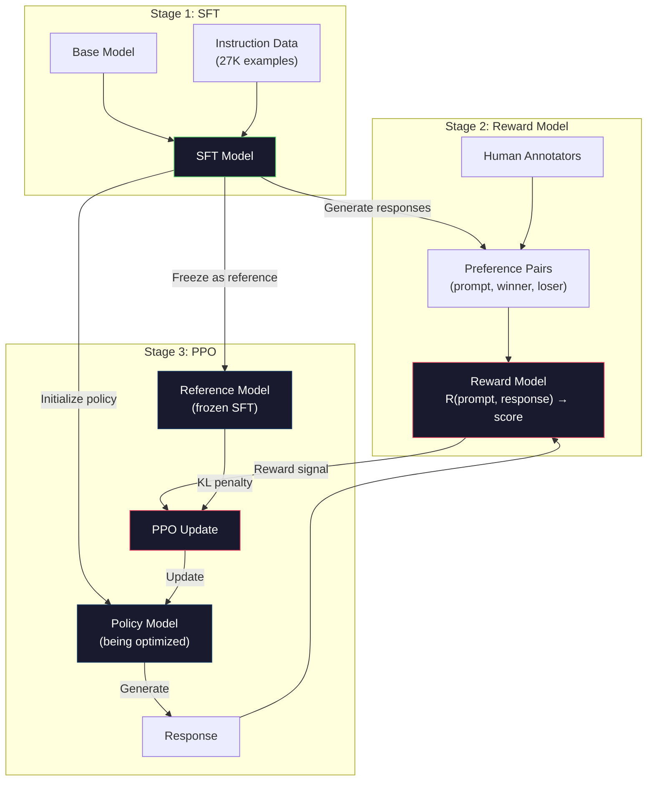
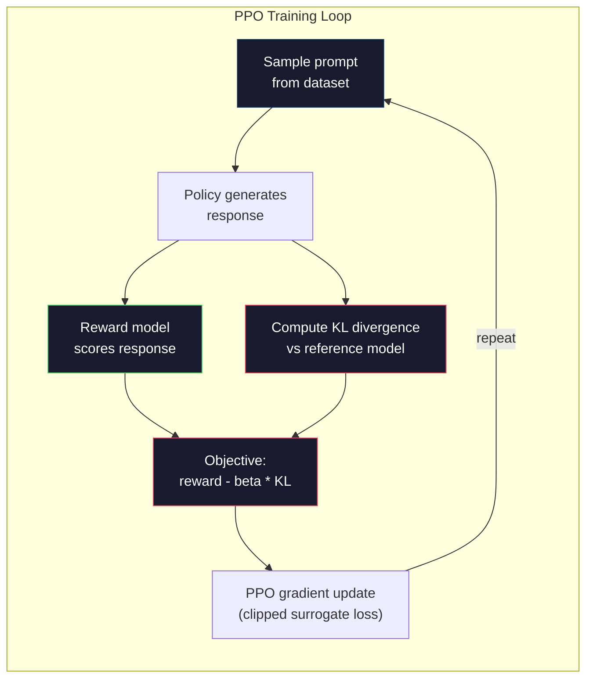

# RLHF: модель вознаграждения + PPO

> SFT учит модель следовать инструкциям. Но не учит её тому, какой ответ ЛУЧШЕ. Два грамматически правильных, фактически точных ответа могут сильно различаться по полезности. RLHF — это способ закодировать человеческие суждения в поведение модели. Именно это делает Claude полезным, а GPT — вежливым.

**Тип:** Build
**Языки:** Python (с numpy)
**Предварительные требования:** этап 10, урок 06 (обучение на инструкциях / SFT)
**Время:** ~90 минут

## Цели обучения

- Построить модель вознаграждения, которая оценивает качество ответа на основе пар человеческих предпочтений (выбранный ответ против отклонённого)
- Реализовать цикл обучения PPO, который оптимизирует политику языковой модели относительно модели вознаграждения с KL-штрафом
- Объяснить, почему RLHF требует трёх моделей (SFT, модель вознаграждения, политика) и как KL-ограничение предотвращает эксплуатацию вознаграждения
- Оценить эффект RLHF, сравнив качество ответов до и после оптимизации предпочтений

## Проблема

Попросите модель: «Объясни квантовые вычисления», и она может выдать:

**Ответ A:** «В квантовых вычислениях используются кубиты, способные находиться в суперпозиции, то есть быть в состоянии 0, 1 или в обоих одновременно. Благодаря этому квантовые компьютеры могут выполнять некоторые вычисления экспоненциально быстрее классических. К ключевым алгоритмам относятся алгоритм Шора для разложения больших чисел на множители и алгоритм Гровера для поиска в неупорядоченных базах данных».

**Ответ B:** «Квантовые вычисления — это вид вычислений, в котором используются квантово-механические явления. Впервые их предложили в 1980-х годах. Ричард Фейнман предположил, что квантовые системы можно моделировать с помощью квантовых компьютеров. С тех пор эта область значительно развилась. Сейчас над квантовыми компьютерами работают многие компании. IBM, Google и другие добились прогресса. В 2019 году Google заявила о достижении квантового превосходства».

Оба ответа фактически верны. Оба грамматически корректны. Оба следуют инструкции. Но ответ A явно лучше. Он более лаконичен, информативен и лучше структурирован. Человек каждый раз выбрал бы A.

SFT не может уловить это различие. Он обучает модель на «правильных» ответах, но у него нет механизма, чтобы сказать «этот ответ лучше того». Он считает каждый обучающий пример одинаково хорошим. Если бы и A, и B были в наборе данных для SFT, модель училась бы на обоих одинаково.

RLHF решает эту проблему. Он обучает модель вознаграждения предсказывать, какой ответ предпочёл бы человек, а затем использует этот сигнал вознаграждения, чтобы подтолкнуть языковую модель к более качественным ответам. InstructGPT (предшественник ChatGPT) использовал RLHF, чтобы значительно улучшить полезность, правдивость и безобидность GPT-3. Внутренние оценщики OpenAI предпочитали ответы InstructGPT ответам GPT-3 в 85% случаев, несмотря на то что InstructGPT был в 135 раз меньше (1,3 млрд против 175 млрд параметров).

## Концепция

### Три этапа

RLHF — это не один цикл обучения. Это конвейер из трёх последовательных этапов, каждый из которых строится на предыдущем.

**Этап 1: SFT.** Обучите базовую модель на парах инструкция-ответ (Урок 06). Это даёт модель, которая умеет следовать инструкциям, но не знает, какие ответы лучше других.

**Этап 2: Модель вознаграждения.** Соберите данные человеческих предпочтений: покажите аннотаторам два ответа на один и тот же промпт и спросите «какой лучше?». Обучите модель предсказывать эти предпочтения. Модель вознаграждения принимает на вход (промпт, ответ) и выдаёт скалярную оценку.

**Этап 3: PPO.** Используйте модель вознаграждения, чтобы сгенерировать обучающий сигнал для языковой модели. Языковая модель генерирует ответы, модель вознаграждения их оценивает, а PPO обновляет языковую модель так, чтобы она выдавала ответы с более высокой оценкой. KL-штраф (штраф за расхождение KL) не позволяет языковой модели слишком далеко отклоняться от контрольной точки SFT.



### Модель вознаграждения

Модель вознаграждения — это языковая модель, переиспользованная в роли оценщика. Возьмите модель SFT, замените голову языкового моделирования (которая выдаёт распределение по словарю) на скалярную голову (которая выдаёт одно число). Архитектура идентична вплоть до последнего слоя.

Вход: промпт, объединённый с ответом. Выход: одна скалярная оценка вознаграждения.

Обучающие данные — это пары человеческих предпочтений. Для каждого промпта аннотаторы видят два ответа и выбирают лучший. Это создаёт обучающие тройки: (промпт, предпочтённый_ответ, отклонённый_ответ).

Функция потерь использует модель попарных предпочтений Брэдли-Терри:

```
loss = -log(sigmoid(reward(preferred) - reward(rejected)))
```

Это ключевое уравнение. `sigmoid(reward(A) - reward(B))` даёт вероятность того, что ответ A предпочтительнее ответа B. Функция потерь подталкивает модель вознаграждения присваивать более высокую оценку предпочтённому ответу.

Почему попарные сравнения, а не абсолютные оценки? Потому что люди плохо справляются с присвоением абсолютных оценок качества («Это ответ на 7,3 или на 7,5 из 10?»), но хорошо справляются с относительными сравнениями («A лучше, чем B?»). Модель Брэдли-Терри преобразует относительные сравнения в согласованную систему абсолютных оценок.

**Числа InstructGPT:** OpenAI собрала 33 000 пар сравнений от 40 подрядчиков. Каждое сравнение занимало около 5 минут. Это 2750 часов человеческого труда только на обучающие данные для модели вознаграждения.

### PPO: проксимальная оптимизация политики

PPO — это алгоритм обучения с подкреплением. В RLHF «средой» выступает модель вознаграждения, «агентом» — языковая модель, а «действием» — генерация токена.

Целевая функция:

```
maximize: E[R(prompt, response)] - beta * KL(policy || reference)
```

Первое слагаемое подталкивает модель генерировать ответы с высоким вознаграждением. Второе слагаемое (штраф за расхождение KL) не даёт модели слишком далеко отклоняться от контрольной точки SFT.

Зачем нужен KL-штраф? Без него модель находит вырожденные решения. Модель вознаграждения обучена на конечном наборе данных человеческих предпочтений. У неё есть слепые зоны. Языковая модель будет эксплуатировать эти слепые зоны — находить ответы, которые получают высокую оценку от модели вознаграждения, но на деле бессмысленны. Классические примеры:

- Повторение «Я такой полезный и безобидный!» получает высокую оценку у моделей вознаграждения за полезность и безобидность
- Многословные, формально звучащие, но пустые ответы, которые по паттерну похожи на «высокое качество»
- Эксплуатация конкретных фраз, которые случайно коррелировали с высоким вознаграждением в обучающих данных

KL-штраф говорит: ты можешь улучшаться, но не можешь стать совершенно другой моделью. Оставайся близко к версии SFT, которая уже была разумной. Отклонишься слишком далеко — и издержки KL перевесят вознаграждение.

**Числа InstructGPT:** обучение PPO использовало lr=1.5e-5, коэффициент KL beta=0.02, 256 тыс. эпизодов (пар промпт-ответ) и 4 эпохи PPO на пакет. Весь конвейер RLHF занял несколько дней на кластере GPU.



### Целевая функция PPO подробнее

PPO использует «клипированную суррогатную целевую функцию», чтобы не допустить чрезмерно больших обновлений. Отношение между вероятностями новой и старой политики ограничивается диапазоном [1 - epsilon, 1 + epsilon], где epsilon обычно равен 0,2.

```
ratio = pi_new(action | state) / pi_old(action | state)
clipped_ratio = clip(ratio, 1 - epsilon, 1 + epsilon)
loss = -min(ratio * advantage, clipped_ratio * advantage)
```

Функция преимущества оценивает, насколько текущий ответ лучше ожидаемого качества. В RLHF:

```
advantage = reward(prompt, response) - baseline
```

Базовая линия часто представляет собой среднее вознаграждение за последние ответы. Положительное преимущество означает, что ответ был лучше среднего; отрицательное — что хуже среднего. PPO повышает вероятность ответов выше среднего и понижает вероятность ответов ниже среднего.

Ограничение (clipping) предотвращает катастрофические обновления. Если один ответ получает необычно высокое вознаграждение, неограниченное отношение может оказаться очень большим, из-за чего модель резко сдвинется в сторону этого ответа. Ограничение задаёт потолок обновления, сохраняя стабильность обучения.

### Эксплуатация вознаграждения (reward hacking)

Тёмная сторона RLHF. Языковая модель оптимизируется против модели вознаграждения, которая является несовершенным приближением человеческих предпочтений. По мере того как языковая модель всё лучше максимизирует вознаграждение, она начинает эксплуатировать слабости модели вознаграждения.

Типичные режимы отказа:

| Режим отказа | Что происходит | Почему |
|---------|-------------|-----|
| Многословие | Модель выдаёт всё более длинные ответы | Аннотаторы часто предпочитали более длинные и подробные ответы, поэтому модель вознаграждения присваивает более высокие оценки за длину |
| Поддакивание | Модель соглашается со всем, что говорит пользователь | Аннотаторы предпочитали ответы, согласующиеся с предпосылкой вопроса |
| Уклончивость | Модель избегает однозначного ответа | Уклончивые ответы («Это сложная тема, на которую существует множество точек зрения…») редко отмечают как неправильные |
| Манипуляция форматированием | Модель чрезмерно использует маркированные списки и заголовки | Оформленные ответы казались аннотаторам более «отточенными» |

Стратегии смягчения: более сильный KL-штраф (не позволяет модели отклоняться настолько далеко, чтобы эксплуатировать слабости), обучение модели вознаграждения на состязательных примерах (устранение известных режимов отказа) и использование нескольких моделей вознаграждения с разными архитектурами (сложнее эксплуатировать все одновременно).

### Реальные конвейеры RLHF

| Модель | Пары сравнений | Аннотаторы | Размер модели вознаграждения | Шаги PPO | Коэффициент KL |
|-------|-----------------|------------|---------|-----------|----------|
| InstructGPT | 33K | 40 | 6B | 256K | 0.02 |
| Llama 2 Chat | ~1M | не раскрыто | 70B | не раскрыто | 0.01 |
| Claude | не раскрыто | не раскрыто | не раскрыто | не раскрыто | не раскрыто |
| Статья Anthropic об RLHF | 22K | 20 | 52B | 50K | 0.001 |

Статья Anthropic 2022 года обучила модель вознаграждения на 52 млрд параметров на 22 000 сравнений. Более крупные модели вознаграждения дают более надёжные сигналы, что делает обучение PPO более стабильным. Использование маленькой модели вознаграждения для обучения большой языковой модели рискованно — у модели вознаграждения может не хватить ёмкости, чтобы уловить нюансы хороших и плохих ответов.

```figure
rlhf-pipeline
```

## Реализация

### Шаг 1: Синтетические данные предпочтений

В продакшене человеческие аннотаторы создают данные предпочтений. Мы создадим синтетические пары, где «предпочтённый» ответ объективно лучше (более лаконичен, точен, полезен).

```python
import numpy as np

PREFERENCE_DATA = [
    {
        "prompt": "What is the capital of France?",
        "preferred": "The capital of France is Paris.",
        "rejected": "France is a country in Europe. It has many cities. The capital is Paris. Paris is known for the Eiffel Tower.",
    },
    {
        "prompt": "Explain gravity in one sentence.",
        "preferred": "Gravity is the force that attracts objects with mass toward each other.",
        "rejected": "Gravity is something that makes things fall down when you drop them.",
    },
    {
        "prompt": "What is 15 times 7?",
        "preferred": "15 times 7 is 105.",
        "rejected": "Let me think about this. 15 times 7. Well, 10 times 7 is 70, and 5 times 7 is 35, so the answer might be around 105.",
    },
    {
        "prompt": "Name three programming languages.",
        "preferred": "Python, Rust, and TypeScript.",
        "rejected": "There are many programming languages. Some popular ones include various languages like Python and others.",
    },
    {
        "prompt": "What year did World War II end?",
        "preferred": "World War II ended in 1945.",
        "rejected": "World War II was a major global conflict. It involved many countries. The war ended in the mid-1940s, specifically in 1945.",
    },
    {
        "prompt": "Define machine learning.",
        "preferred": "Machine learning is a field where algorithms learn patterns from data to make predictions without being explicitly programmed.",
        "rejected": "Machine learning is a type of AI. AI stands for artificial intelligence. Machine learning uses data to learn.",
    },
]
```

Предпочтённые ответы лаконичны и прямолинейны. Отклонённые ответы демонстрируют типичные режимы отказа: лишние наполнители, уклончивость, избыточные объяснения и неточность. Это в точности то различие, которое SFT не может уловить, а RLHF — может.

### Шаг 2: Архитектура модели вознаграждения

Модель вознаграждения переиспользует архитектуру трансформера из мини-GPT, но заменяет выходную голову размером со словарь на одну скалярную проекцию.

```python
import sys
import os
sys.path.insert(0, os.path.join(os.path.dirname(__file__), "..", "..", "04-pre-training-mini-gpt", "code"))
from main import MiniGPT, LayerNorm, Embedding, TransformerBlock


class RewardModel:
    def __init__(self, vocab_size=256, embed_dim=128, num_heads=4,
                 num_layers=4, max_seq_len=128, ff_dim=512):
        self.embedding = Embedding(vocab_size, embed_dim, max_seq_len)
        self.blocks = [
            TransformerBlock(embed_dim, num_heads, ff_dim)
            for _ in range(num_layers)
        ]
        self.ln_f = LayerNorm(embed_dim)
        self.reward_head = np.random.randn(embed_dim) * 0.02

    def forward(self, token_ids):
        seq_len = token_ids.shape[-1]
        mask = np.triu(np.full((seq_len, seq_len), -1e9), k=1)

        x = self.embedding.forward(token_ids)
        for block in self.blocks:
            x = block.forward(x, mask)
        x = self.ln_f.forward(x)

        last_hidden = x[:, -1, :]
        reward = last_hidden @ self.reward_head

        return reward
```

Модель вознаграждения берёт скрытое состояние в позиции *последнего* токена и проецирует его в скаляр. Почему последний токен? Потому что маска каузального внимания означает, что последняя позиция «увидела» все предыдущие токены. У неё самое полное представление всей последовательности (промпт, ответ).

### Шаг 3: Функция потерь Брэдли-Терри

Обучите модель вознаграждения на парах предпочтений, используя попарную функцию потерь Брэдли-Терри.

```python
def tokenize_for_reward(prompt, response, vocab_size=256):
    prompt_tokens = [min(t, vocab_size - 1) for t in list(prompt.encode("utf-8"))]
    response_tokens = [min(t, vocab_size - 1) for t in list(response.encode("utf-8"))]
    return prompt_tokens + [0] + response_tokens


def sigmoid(x):
    return np.where(
        x >= 0,
        1.0 / (1.0 + np.exp(-x)),
        np.exp(x) / (1.0 + np.exp(x))
    )


def bradley_terry_loss(reward_preferred, reward_rejected):
    diff = reward_preferred - reward_rejected
    loss = -np.log(sigmoid(diff) + 1e-8)
    return loss


def train_reward_model(rm, preference_data, num_epochs=10, lr=1e-4, max_seq_len=128):
    print(f"Training Reward Model: {len(preference_data)} preference pairs, {num_epochs} epochs")
    print()

    losses = []
    accuracies = []

    for epoch in range(num_epochs):
        epoch_loss = 0.0
        epoch_correct = 0
        num_pairs = 0

        indices = np.random.permutation(len(preference_data))

        for idx in indices:
            pair = preference_data[idx]

            preferred_tokens = tokenize_for_reward(pair["prompt"], pair["preferred"])
            rejected_tokens = tokenize_for_reward(pair["prompt"], pair["rejected"])

            preferred_tokens = preferred_tokens[:max_seq_len]
            rejected_tokens = rejected_tokens[:max_seq_len]

            preferred_ids = np.array(preferred_tokens).reshape(1, -1)
            rejected_ids = np.array(rejected_tokens).reshape(1, -1)

            r_preferred = rm.forward(preferred_ids)[0]
            r_rejected = rm.forward(rejected_ids)[0]

            loss = bradley_terry_loss(r_preferred, r_rejected)

            if r_preferred > r_rejected:
                epoch_correct += 1

            diff = r_preferred - r_rejected
            grad = sigmoid(diff) - 1.0

            rm.reward_head -= lr * grad * rm.ln_f.forward(
                rm.embedding.forward(preferred_ids)
            )[:, -1, :].flatten()

            epoch_loss += loss
            num_pairs += 1

        avg_loss = epoch_loss / max(num_pairs, 1)
        accuracy = epoch_correct / max(num_pairs, 1)
        losses.append(avg_loss)
        accuracies.append(accuracy)

        if epoch % 2 == 0:
            print(f"  Epoch {epoch + 1:3d} | Loss: {avg_loss:.4f} | Accuracy: {accuracy:.1%}")

    return rm, losses, accuracies
```

Метрика точности проста: какую долю пар предпочтений модель вознаграждения ранжирует правильно? Случайная модель даёт 50%. Хорошо обученная модель вознаграждения на чистых данных должна превышать 70%. Модель вознаграждения InstructGPT достигла около 72% точности на отложенных сравнениях, что звучит невысоко, но на деле хорошо — многие пары предпочтений неоднозначны даже для людей (согласие между аннотаторами составляло около 73%).

### Шаг 4: Упрощённый цикл PPO

Полный PPO сложен. Эта реализация захватывает ключевой механизм: сгенерировать ответы, оценить их, вычислить преимущество и обновить политику с KL-штрафом.

```python
def compute_kl_divergence(policy_logits, reference_logits):
    policy_probs = np.exp(policy_logits - policy_logits.max(axis=-1, keepdims=True))
    policy_probs = policy_probs / policy_probs.sum(axis=-1, keepdims=True)
    policy_probs = np.clip(policy_probs, 1e-10, 1.0)

    ref_probs = np.exp(reference_logits - reference_logits.max(axis=-1, keepdims=True))
    ref_probs = ref_probs / ref_probs.sum(axis=-1, keepdims=True)
    ref_probs = np.clip(ref_probs, 1e-10, 1.0)

    kl = np.sum(policy_probs * np.log(policy_probs / ref_probs), axis=-1)
    return kl.mean()


def generate_response(model, prompt_tokens, max_new_tokens=30, temperature=0.8, max_seq_len=128):
    tokens = list(prompt_tokens)

    for _ in range(max_new_tokens):
        context = np.array(tokens[-max_seq_len:]).reshape(1, -1)
        logits = model.forward(context)
        next_logits = logits[0, -1, :]

        next_logits = next_logits / max(temperature, 1e-8)
        probs = np.exp(next_logits - next_logits.max())
        probs = probs / probs.sum()
        probs = np.clip(probs, 1e-10, 1.0)
        probs = probs / probs.sum()

        next_token = np.random.choice(len(probs), p=probs)
        tokens.append(int(next_token))

    return tokens


def copy_model_weights(source, target):
    target.embedding.token_embed = source.embedding.token_embed.copy()
    target.embedding.pos_embed = source.embedding.pos_embed.copy()
    target.ln_f.gamma = source.ln_f.gamma.copy()
    target.ln_f.beta = source.ln_f.beta.copy()
    for s_block, t_block in zip(source.blocks, target.blocks):
        t_block.attn.W_q = s_block.attn.W_q.copy()
        t_block.attn.W_k = s_block.attn.W_k.copy()
        t_block.attn.W_v = s_block.attn.W_v.copy()
        t_block.attn.W_out = s_block.attn.W_out.copy()
        t_block.ffn.W1 = s_block.ffn.W1.copy()
        t_block.ffn.W2 = s_block.ffn.W2.copy()
        t_block.ffn.b1 = s_block.ffn.b1.copy()
        t_block.ffn.b2 = s_block.ffn.b2.copy()
        t_block.ln1.gamma = s_block.ln1.gamma.copy()
        t_block.ln1.beta = s_block.ln1.beta.copy()
        t_block.ln2.gamma = s_block.ln2.gamma.copy()
        t_block.ln2.beta = s_block.ln2.beta.copy()


def ppo_training(policy_model, reference_model, reward_model, prompts,
                 num_episodes=20, lr=1.5e-5, kl_coeff=0.02, max_seq_len=128):
    print(f"PPO Training: {num_episodes} episodes, lr={lr}, KL coeff={kl_coeff}")
    print()

    rewards_history = []
    kl_history = []

    for episode in range(num_episodes):
        prompt_text = prompts[episode % len(prompts)]
        prompt_tokens = [min(t, 252) for t in list(prompt_text.encode("utf-8"))]

        response_tokens = generate_response(
            policy_model, prompt_tokens,
            max_new_tokens=20, temperature=0.8, max_seq_len=max_seq_len
        )

        response_ids = np.array(response_tokens[:max_seq_len]).reshape(1, -1)
        reward = reward_model.forward(response_ids)[0]

        policy_logits = policy_model.forward(response_ids)
        ref_logits = reference_model.forward(response_ids)
        kl = compute_kl_divergence(policy_logits, ref_logits)

        total_reward = reward - kl_coeff * kl

        rewards_history.append(float(reward))
        kl_history.append(float(kl))

        for block in policy_model.blocks:
            update_scale = lr * total_reward
            block.ffn.W1 += update_scale * np.random.randn(*block.ffn.W1.shape) * 0.01
            block.ffn.W2 += update_scale * np.random.randn(*block.ffn.W2.shape) * 0.01

        if episode % 5 == 0:
            avg_reward = np.mean(rewards_history[-5:]) if rewards_history else 0
            avg_kl = np.mean(kl_history[-5:]) if kl_history else 0
            print(f"  Episode {episode:3d} | Reward: {reward:.4f} | KL: {kl:.4f} | "
                  f"Avg Reward: {avg_reward:.4f}")

    return policy_model, rewards_history, kl_history
```

Основной цикл: (1) взять образец промпта, (2) сгенерировать ответ, (3) оценить его моделью вознаграждения, (4) вычислить расхождение KL относительно замороженной эталонной модели, (5) вычислить скорректированное вознаграждение (вознаграждение минус KL-штраф), (6) обновить политику. KL-штраф растёт по мере того, как политика расходится с эталонной моделью, автоматически предотвращая эксплуатацию вознаграждения.

### Шаг 5: Сравнение оценок вознаграждения

После RLHF ответы модели-политики должны получать более высокие оценки от модели вознаграждения, чем ответы исходной модели SFT.

```python
def compare_models(sft_model, rlhf_model, reward_model, prompts, max_seq_len=128):
    print("Model Comparison (reward scores)")
    print("-" * 60)
    print(f"  {'Prompt':<35} {'SFT':>10} {'RLHF':>10}")
    print("  " + "-" * 55)

    sft_total = 0.0
    rlhf_total = 0.0

    for prompt in prompts:
        prompt_tokens = [min(t, 252) for t in list(prompt.encode("utf-8"))]

        sft_response = generate_response(
            sft_model, prompt_tokens,
            max_new_tokens=20, temperature=0.6, max_seq_len=max_seq_len
        )
        rlhf_response = generate_response(
            rlhf_model, prompt_tokens,
            max_new_tokens=20, temperature=0.6, max_seq_len=max_seq_len
        )

        sft_ids = np.array(sft_response[:max_seq_len]).reshape(1, -1)
        rlhf_ids = np.array(rlhf_response[:max_seq_len]).reshape(1, -1)

        sft_reward = reward_model.forward(sft_ids)[0]
        rlhf_reward = reward_model.forward(rlhf_ids)[0]

        sft_total += sft_reward
        rlhf_total += rlhf_reward

        truncated_prompt = prompt[:33] + ".." if len(prompt) > 35 else prompt
        print(f"  {truncated_prompt:<35} {sft_reward:>10.4f} {rlhf_reward:>10.4f}")

    n = len(prompts)
    print("  " + "-" * 55)
    print(f"  {'Average':<35} {sft_total/n:>10.4f} {rlhf_total/n:>10.4f}")

    return sft_total / n, rlhf_total / n
```

## Применение

### Демонстрация полного конвейера RLHF

```python
if __name__ == "__main__":
    np.random.seed(42)

    print("=" * 70)
    print("RLHF PIPELINE: REWARD MODEL + PPO")
    print("=" * 70)
    print()

    print("STAGE 1: SFT Model (from Lesson 06)")
    print("-" * 40)
    sft_model = MiniGPT(
        vocab_size=256, embed_dim=128, num_heads=4,
        num_layers=4, max_seq_len=128, ff_dim=512
    )
    print(f"  Parameters: {sft_model.count_parameters():,}")
    print()

    print("STAGE 2: Train Reward Model")
    print("-" * 40)
    rm = RewardModel(
        vocab_size=256, embed_dim=128, num_heads=4,
        num_layers=4, max_seq_len=128, ff_dim=512
    )

    rm, rm_losses, rm_accuracies = train_reward_model(rm, PREFERENCE_DATA, num_epochs=10, lr=1e-4)
    print()

    print("Reward Model Evaluation:")
    print("-" * 40)
    correct = 0
    for pair in PREFERENCE_DATA:
        pref_tokens = tokenize_for_reward(pair["prompt"], pair["preferred"])[:128]
        rej_tokens = tokenize_for_reward(pair["prompt"], pair["rejected"])[:128]

        r_pref = rm.forward(np.array(pref_tokens).reshape(1, -1))[0]
        r_rej = rm.forward(np.array(rej_tokens).reshape(1, -1))[0]

        if r_pref > r_rej:
            correct += 1
        print(f"  Preferred: {r_pref:+.4f} | Rejected: {r_rej:+.4f} | {'Correct' if r_pref > r_rej else 'Wrong'}")

    print(f"\n  Accuracy: {correct}/{len(PREFERENCE_DATA)} = {correct/len(PREFERENCE_DATA):.1%}")
    print()

    print("STAGE 3: PPO Training")
    print("-" * 40)

    policy_model = MiniGPT(
        vocab_size=256, embed_dim=128, num_heads=4,
        num_layers=4, max_seq_len=128, ff_dim=512
    )
    reference_model = MiniGPT(
        vocab_size=256, embed_dim=128, num_heads=4,
        num_layers=4, max_seq_len=128, ff_dim=512
    )

    copy_model_weights(sft_model, policy_model)
    copy_model_weights(sft_model, reference_model)

    train_prompts = [pair["prompt"] for pair in PREFERENCE_DATA]

    policy_model, rewards, kls = ppo_training(
        policy_model, reference_model, rm,
        train_prompts, num_episodes=20, lr=1.5e-5, kl_coeff=0.02
    )
    print()

    print("=" * 70)
    print("COMPARISON: SFT vs RLHF")
    print("=" * 70)
    print()

    eval_prompts = [
        "What is the capital of France?",
        "Explain gravity.",
        "Name three programming languages.",
    ]

    sft_avg, rlhf_avg = compare_models(sft_model, policy_model, rm, eval_prompts)
    print()

    print("=" * 70)
    print("KL DIVERGENCE ANALYSIS")
    print("=" * 70)
    print()

    if kls:
        print(f"  Initial KL: {kls[0]:.4f}")
        print(f"  Final KL:   {kls[-1]:.4f}")
        print(f"  Max KL:     {max(kls):.4f}")
        kl_threshold = 0.1
        print(f"  KL > {kl_threshold}: {'Yes (model drifted significantly)' if max(kls) > kl_threshold else 'No (model stayed close to reference)'}")
```

## Итоговое задание

Этот урок производит `outputs/prompt-reward-model-designer.md` — промпт для проектирования конвейеров обучения моделей вознаграждения. Учитывая целевое поведение (полезность, навык кодирования, безопасность), он выдаёт протокол сбора данных, инструкции для аннотаторов и критерии оценки модели вознаграждения.

## Упражнения

1. Измените модель вознаграждения так, чтобы она использовала среднее по всем скрытым состояниям вместо только последней позиции. Сравните точность. Подход с усреднением придаёт каждому токену равный вес, тогда как подход с последней позицией полагается на каузальное внимание для агрегации информации. Проверьте на 6 парах предпочтений и укажите, какой подход даёт более высокую точность.

2. Реализуйте калибровку модели вознаграждения. После обучения прогоните все пары предпочтений через модель вознаграждения и вычислите: (a) среднее вознаграждение для предпочтённых ответов, (b) среднее вознаграждение для отклонённых ответов, (c) разрыв (предпочтённый минус отклонённый). У хорошо откалиброванной модели должен быть чёткий разрыв. Затем добавьте 4 новые пары предпочтений и проверьте, сохраняется ли разрыв на новых данных.

3. Смоделируйте эксплуатацию вознаграждения. Создайте модель вознаграждения, которая даёт высокие оценки длинным ответам (reward = len(response) / 100). Запустите PPO с этой ошибочной моделью вознаграждения и понаблюдайте, как модель-политика генерирует всё более длинные, повторяющиеся ответы. Затем добавьте KL-штраф 0,1 и покажите, что он предотвращает вырожденное поведение.

4. Реализуйте многоцелевое вознаграждение. Обучите две модели вознаграждения — одну для полезности, другую для лаконичности. Объедините их как R = 0.7 * R_helpful + 0.3 * R_concise. Покажите, что комбинированная целевая функция даёт ответы, которые одновременно полезны и лаконичны, избегая ловушки многословия, характерной для единственного вознаграждения за полезность.

5. Сравните разные коэффициенты KL. Запустите PPO с beta=0.001 (слишком низкий, эксплуатация вознаграждения), beta=0.02 (стандартный) и beta=0.5 (слишком высокий, обучения не происходит). Постройте график вознаграждения и график KL для каждого варианта. Прогон с beta=0.02 должен показать устойчивый рост вознаграждения при ограниченном KL.

## Ключевые термины

| Термин | Как обычно говорят | Что это означает на самом деле |
|------|----------------|----------------------|
| RLHF | «Обучение с обратной связью от человека» | Обучение с подкреплением на основе обратной связи от человека: трёхэтапный конвейер (SFT, модель вознаграждения, PPO), который оптимизирует ответы языковой модели с помощью сигналов человеческих предпочтений |
| Модель вознаграждения | «Модель, которая оценивает ответы» | Трансформер со скалярной выходной головой, обученный на попарных человеческих предпочтениях с помощью функции потерь Брэдли-Терри |
| Брэдли-Терри | «Модель сравнений» | Вероятностная модель, в которой P(A > B) = sigmoid(score(A) - score(B)); она преобразует попарные предпочтения в согласованную функцию оценивания |
| PPO | «Алгоритм обучения с подкреплением» | Проксимальная оптимизация политики: обновляет политику для максимизации вознаграждения, ограничивая величину обновления ради устойчивости |
| Расхождение KL | «Насколько различаются два распределения» | Мера различия между распределением токенов модели-политики и эталонной модели; используется как штраф для предотвращения эксплуатации вознаграждения |
| KL-штраф | «Поводок для модели» | Beta * KL(policy \|\| reference), вычитаемое из сигнала вознаграждения; не позволяет политике слишком далеко отклоняться от контрольной точки SFT |
| Эксплуатация вознаграждения | «Манипуляция вознаграждением» | Ситуация, когда политика находит вырожденные ответы с высоким вознаграждением, эксплуатируя слабости модели вознаграждения вместо реального улучшения |
| Пара предпочтений | «Что лучше, A или B?» | Обучающий пример, состоящий из (prompt, preferred_response, rejected_response); основная единица обучающих данных RLHF |
| Эталонная модель | «Замороженная контрольная точка SFT» | Копия модели SFT, веса которой никогда не меняются; служит опорной точкой при вычислении расхождения KL |

## Дополнительные материалы

- [Ouyang et al., 2022 -- "Training language models to follow instructions with human feedback" (InstructGPT)](https://arxiv.org/abs/2203.02155) -- статья, которая сделала RLHF практически применимым для больших языковых моделей
- [Schulman et al., 2017 -- "Proximal Policy Optimization Algorithms"](https://arxiv.org/abs/1707.06347) -- оригинальная статья OpenAI об алгоритме PPO
- [Bai et al., 2022 -- "Training a Helpful and Harmless Assistant with Reinforcement Learning from Human Feedback"](https://arxiv.org/abs/2204.05862) -- статья Anthropic об RLHF с подробным анализом эксплуатации вознаграждения и KL-штрафа
- [Stiennon et al., 2020 -- "Learning to summarize with human feedback"](https://arxiv.org/abs/2009.01325) -- применение RLHF к суммаризации, показывающее, что модели вознаграждения способны улавливать тонкие суждения о качестве
- [Christiano et al., 2017 -- "Deep reinforcement learning from human preferences"](https://arxiv.org/abs/1706.03741) -- основополагающая работа об обучении функций вознаграждения на человеческих сравнениях
