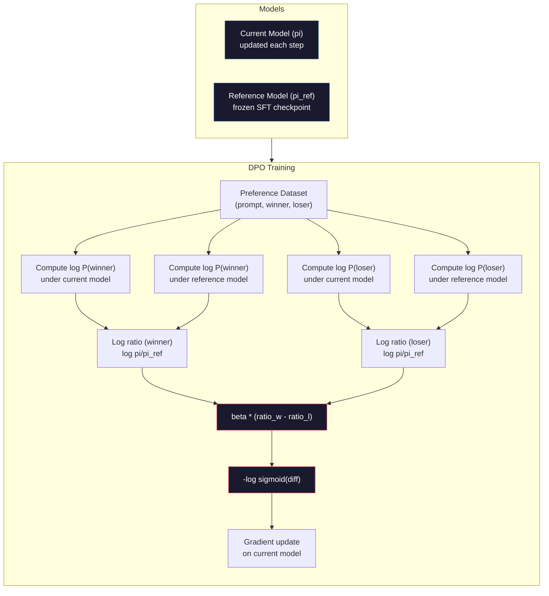

# DPO: прямая оптимизация предпочтений (Direct Preference Optimization)

> RLHF работает. Но требует обучения трёх моделей (SFT, модель вознаграждения, политика), борьбы с нестабильностью PPO и настройки KL-штрафа. DPO ставит вопрос: что, если всё это можно пропустить? DPO напрямую оптимизирует языковую модель на парах предпочтений. Без модели вознаграждения. Без PPO. Один цикл обучения. Те же результаты.

**Тип:** Build
**Языки:** Python (с numpy)
**Предварительные требования:** Этап 10, урок 07 (RLHF)
**Время:** ~90 минут

## Цели обучения

- Реализовать обучение DPO, которое напрямую оптимизирует языковую модель на парах предпочтений без отдельной модели вознаграждения
- Вывести функцию потерь DPO и объяснить, как она неявно представляет модель вознаграждения через логарифмические вероятности политики
- Сравнить DPO и RLHF по стабильности обучения, затратам на вычисления и количеству необходимых моделей
- Настроить параметр beta, чтобы контролировать, насколько обученная политика отклоняется от референсной модели

## Проблема

В Уроке 07 вы построили конвейер RLHF. Три этапа. Три модели. SFT-модель, модель вознаграждения и модель политики, оптимизируемая с помощью PPO. Одна только модель вознаграждения требовала тысяч пар человеческих предпочтений и отдельного цикла обучения. PPO требовал тщательной настройки коэффициента KL, скорости обучения, коэффициента отсечения (clip ratio) и числа эпох.

На практике обучение PPO печально известно своей нестабильностью. Небольшие изменения гиперпараметров приводят к расхождению обучения. Модель вознаграждения — несовершенный прокси человеческих предпочтений, и политика находит способы эксплуатировать её слабости. KL-штраф помогает, но требует собственной настройки — слишком низкий приводит к взлому вознаграждения (reward hacking), слишком высокий — модель почти не учится.

Именно эта сложность объясняет, почему большинство моделей с открытым исходным кодом годами испытывали трудности с RLHF после публикации InstructGPT. Трёхэтапный конвейер хрупок. У каждого этапа свои режимы отказа, и ошибки накапливаются.

В мае 2023 года Рафаэль Рафаилов, Арчит Шарма и коллеги из Стэнфорда опубликовали статью «Direct Preference Optimization: Your Language Model is Secretly a Reward Model». Ключевая идея: отдельная модель вознаграждения не нужна. Оптимальная функция вознаграждения математически определяется собственными вероятностями токенов языковой модели. Модель вознаграждения можно полностью пропустить и оптимизировать языковую модель напрямую на парах предпочтений.

DPO сводит RLHF к одному шагу обучения с учителем. Одна модель. Одна функция потерь. Один цикл обучения. Никакого обучения с подкреплением. Zephyr-7B, одна из первых моделей, использовавших DPO в промышленном масштабе, сравнялась или превзошла модели, обученные с помощью полного RLHF, на нескольких бенчмарках. Meta использовала DPO как часть конвейера согласования Llama 3. Anthropic упоминала методы в стиле DPO в своих исследованиях по согласованию.

## Концепция

### Ключевая идея

RLHF оптимизирует следующую целевую функцию:

```
maximize: E[R(x, y)] - beta * KL(pi || pi_ref)
```

где R — модель вознаграждения, pi — политика, pi_ref — референсная модель, а beta — коэффициент KL.

Статья о DPO показала, что у этой целевой функции есть аналитическое оптимальное решение. Для любой функции вознаграждения R оптимальная политика:

```
pi*(y | x) = pi_ref(y | x) * exp(R(x, y) / beta) / Z(x)
```

где Z(x) — нормализующая константа. Преобразуя:

```
R(x, y) = beta * log(pi*(y | x) / pi_ref(y | x)) + beta * log Z(x)
```

Это и есть прорыв. Вознаграждение выражается целиком через вероятности модели политики и вероятности референсной модели. Обучать отдельную модель вознаграждения не нужно. Вознаграждение *неявно* заложено в отношении вероятностей.

Подставляя это в модель предпочтений Брэдли-Терри:

```
P(y_w > y_l | x) = sigmoid(R(x, y_w) - R(x, y_l))
                  = sigmoid(beta * (log pi(y_w|x)/pi_ref(y_w|x) - log pi(y_l|x)/pi_ref(y_l|x)))
```

Члены Z(x) сокращаются, потому что оба ответа обусловлены одним и тем же промптом x. Остаётся функция, зависящая только от логарифмических вероятностей модели политики и референсной модели на предпочтённом и отвергнутом ответах.

### Функция потерь DPO

```
L_DPO = -log(sigmoid(beta * (log pi(y_w|x)/pi_ref(y_w|x) - log pi(y_l|x)/pi_ref(y_l|x))))
```

Разберём каждую часть:

- **y_w** = предпочтённый (выигравший) ответ
- **y_l** = отвергнутый (проигравший) ответ
- **x** = промпт
- **pi** = текущая модель (обучаемая)
- **pi_ref** = референсная модель (замороженная контрольная точка SFT)
- **beta** = параметр температуры, контролирующий отклонение от референсной модели (обычно от 0,1 до 0,5)

Отношение `log pi(y|x) / pi_ref(y|x)` — это логарифмическое отношение вероятностей. Когда это отношение положительно, текущая модель присваивает ответу y более высокую вероятность, чем референсная. Когда отрицательно — более низкую.

Функция потерь DPO подталкивает модель увеличивать логарифмическое отношение вероятностей для предпочтённых ответов и уменьшать его для отвергнутых. Параметр beta контролирует, насколько агрессивно модель может отклоняться от референсной — маленький beta допускает большие отклонения, большой beta удерживает модель ближе к референсной.



### Почему DPO проще

| Аспект | RLHF (PPO) | DPO |
|--------|-----------|-----|
| Обучаемые модели | 3 (SFT + модель вознаграждения + политика) | 1 (только политика) |
| Циклы обучения | 3 (SFT, обучение RM, PPO) | 2 (SFT, DPO) |
| Гиперпараметры | lr, коэффициент KL, коэффициент отсечения, lr для RM, эпохи x3 | lr, beta, эпохи |
| Модель вознаграждения | Требуется (отдельное обучение) | Неявно представлена в вероятностях модели |
| Алгоритм RL | PPO (сложный, нестабильный) | Обучение с учителем (стабильное) |
| Память GPU | 3-4 модели в памяти во время PPO | 2 модели (текущая + референсная) |
| Стабильность обучения | Чувствительна к гиперпараметрам | Устойчива, аналогично SFT |

Во время обучения DPO требует хранить в памяти две модели — текущую и замороженную референсную. RLHF требует три или четыре: политику, референсную модель, модель вознаграждения и, опционально, базовую функцию ценности. Для модели на 70B параметров каждая копия занимает 140 ГБ в FP16. Экономия памяти за счёт исключения модели вознаграждения существенна.

### Когда DPO превосходит RLHF

**Небольшие наборы данных.** На 5 000–20 000 парах предпочтений DPO часто не уступает RLHF или превосходит его. Модели вознаграждения в RLHF нужно достаточно данных для обобщения — при ограниченных данных она переобучается и выдаёт ненадёжный сигнал вознаграждения. DPO обходит эту проблему, вообще не нуждаясь в модели вознаграждения.

**Ограниченные вычисления.** DPO требует примерно треть вычислений полного RLHF (один цикл обучения вместо трёх). Для команд без крупных GPU-кластеров это практичный выбор.

**Быстрая итерация.** Хотите попробовать 10 разных наборов данных предпочтений, чтобы понять, какой даёт лучшую модель? DPO позволяет запускать каждый эксперимент за часы. RLHF требует переобучения модели вознаграждения для каждого набора данных.

### Когда RLHF превосходит DPO

**Обучение в большом масштабе.** На масштабе GPT-4 или Claude отдельная модель вознаграждения в RLHF способна улавливать более тонкие сигналы предпочтений. Модель вознаграждения выступает как обучаемая функция потерь, адаптирующаяся к сложным критериям качества.

**Сложные сигналы вознаграждения.** Когда «лучше» включает несколько измерений (полезность, безопасность, честность), модель вознаграждения может выучить этот компромисс между несколькими целями. DPO трактует каждую пару предпочтений как бинарный сигнал — один лучше, другой хуже — без моделирования причины.

**Итеративное согласование.** Конвейеры RLHF могут генерировать новые ответы текущей политикой, получать от людей оценки и переобучать модель вознаграждения в онлайн-цикле. DPO работает на фиксированном наборе данных пар предпочтений. Constitutional AI (подход Anthropic) активно использует это итеративное свойство RLHF.

### После DPO: KTO, ORPO, SimPO

DPO вдохновил семейство упрощённых методов согласования.

**KTO (Kahneman-Tversky Optimization, 2024):** Пары даже не нужны. KTO работает с непарной обратной связью — просто пометьте каждый ответ как «хороший» или «плохой», не сравнивая его с альтернативой. Это радикально упрощает сбор данных. Вместо того чтобы показывать аннотаторам два ответа и спрашивать «какой лучше?», вы показываете один ответ и спрашиваете «он хороший?». Функция потерь применяет неприятие потерь из теории перспектив: плохие ответы штрафуются сильнее, чем хорошие поощряются.

**ORPO (Odds Ratio Preference Optimization, 2024):** Объединяет SFT и согласование в один шаг обучения. Вместо того чтобы сначала выполнять SFT, а затем DPO, ORPO модифицирует функцию потерь SFT, добавляя в неё сигнал предпочтений. Функция потерь состоит из двух членов: стандартной потери предсказания следующего токена на предпочтённом ответе плюс член отношения шансов (odds ratio), увеличивающий разрыв между вероятностями предпочтённого и отвергнутого ответов. Один цикл обучения вместо двух.

**SimPO (Simple Preference Optimization, 2024):** Полностью устраняет референсную модель. Вместо вычисления логарифмических отношений вероятностей относительно замороженной референсной модели SimPO использует среднюю логарифмическую вероятность ответа (нормализованную по длине) как неявное вознаграждение. Это экономит память (референсная модель не нужна) и упрощает обучение. Нормализация по длине не даёт модели предпочитать более короткие ответы.

| Метод | Год | Моделей в памяти | Нужны пары? | Нужна референсная модель? | Циклы обучения |
|--------|------|-----------------|-------------|-----------------|----------------|
| RLHF | 2022 | 3-4 | Да (для RM) | Да | 3 |
| DPO | 2023 | 2 | Да | Да | 2 |
| KTO | 2024 | 2 | Нет (непарные данные) | Да | 2 |
| ORPO | 2024 | 1 | Да | Нет | 1 |
| SimPO | 2024 | 1 | Да | Нет | 1 |

Тенденция очевидна: каждый следующий метод устраняет ещё один элемент сложности. RLHF требовал модель вознаграждения и PPO. DPO устранил оба. KTO устранил парные данные. ORPO устранил отдельный этап SFT. SimPO устранил референсную модель. Издержки согласования (alignment tax) — затраты вычислений и сложности на переход от базовой модели к согласованной — продолжают снижаться.

### Реальные развёртывания DPO

**Zephyr-7B (HuggingFace, октябрь 2023):** база Mistral 7B, SFT на UltraChat (200 тыс. примеров), затем DPO на UltraFeedback (60 тыс. пар предпочтений). Набрала 6,47 на MT-Bench — лучший результат среди моделей 7B на тот момент. Для сравнения, Llama 2 Chat 70B набрала 6,86, то есть Zephyr оказалась в пределах 6% от модели в 10 раз большего размера, используя только согласование через DPO.

**Llama 3 (Meta, апрель 2024):** DPO применялась после начальных этапов RLHF. Это сочетание говорит о том, что DPO и RLHF могут дополнять друг друга — RLHF для широкого согласования, DPO для точечной доработки.

**Neural Magic / nm-chat (2024):** DPO применялась к нескольким моделям с открытым исходным кодом, стабильно показывая улучшение на 5–15% по бенчмаркам согласования по сравнению с базовыми моделями, прошедшими только SFT.

```figure
dpo-loss
```

## Реализация

### Шаг 1: Набор данных предпочтений

Тот же формат, что и в RLHF — тройки (промпт, предпочтённый, отвергнутый). DPO потребляет эти данные напрямую, без промежуточной модели вознаграждения.

```python
import numpy as np
import sys
import os
sys.path.insert(0, os.path.join(os.path.dirname(__file__), "..", "..", "04-pre-training-mini-gpt", "code"))
from main import MiniGPT, LayerNorm, Embedding, TransformerBlock

PREFERENCE_DATA = [
    {
        "prompt": "What is the capital of France?",
        "preferred": "The capital of France is Paris.",
        "rejected": "France is a country in Europe. It has many cities. The capital is Paris. Paris is known for the Eiffel Tower.",
    },
    {
        "prompt": "Explain gravity in one sentence.",
        "preferred": "Gravity is the force that attracts objects with mass toward each other.",
        "rejected": "Gravity is something that makes things fall down when you drop them.",
    },
    {
        "prompt": "What is 15 times 7?",
        "preferred": "15 times 7 is 105.",
        "rejected": "Let me think about this. 15 times 7. Well, 10 times 7 is 70, and 5 times 7 is 35, so the answer might be around 105.",
    },
    {
        "prompt": "Name three programming languages.",
        "preferred": "Python, Rust, and TypeScript.",
        "rejected": "There are many programming languages. Some popular ones include various languages like Python and others.",
    },
    {
        "prompt": "What year did World War II end?",
        "preferred": "World War II ended in 1945.",
        "rejected": "World War II was a major global conflict. It involved many countries. The war ended in the mid-1940s, specifically in 1945.",
    },
    {
        "prompt": "Define machine learning.",
        "preferred": "Machine learning is a field where algorithms learn patterns from data to make predictions without being explicitly programmed.",
        "rejected": "Machine learning is a type of AI. AI stands for artificial intelligence. Machine learning uses data to learn.",
    },
]
```

### Шаг 2: Логарифмическая вероятность последовательности

Функция потерь DPO требует вычисления суммарной логарифмической вероятности ответа при заданном промпте. Это значит, что нужно прогнать модель на полной последовательности (промпт + ответ) и просуммировать логарифмические вероятности каждого токена ответа.

```python
def tokenize_sequence(text, vocab_size=256):
    return [min(t, vocab_size - 1) for t in list(text.encode("utf-8"))]


def compute_sequence_log_prob(model, prompt_tokens, response_tokens, max_seq_len=128):
    full_sequence = prompt_tokens + response_tokens
    if len(full_sequence) > max_seq_len:
        full_sequence = full_sequence[:max_seq_len]

    if len(full_sequence) < 2:
        return 0.0

    input_ids = np.array(full_sequence[:-1]).reshape(1, -1)
    target_ids = np.array(full_sequence[1:])

    logits = model.forward(input_ids)
    logits = logits[0]

    max_logits = logits.max(axis=-1, keepdims=True)
    log_probs = logits - max_logits - np.log(
        np.exp(logits - max_logits).sum(axis=-1, keepdims=True)
    )

    prompt_len = len(prompt_tokens)
    response_start = max(0, prompt_len - 1)
    response_end = len(target_ids)

    if response_start >= response_end:
        return 0.0

    response_log_probs = log_probs[response_start:response_end, :]
    response_targets = target_ids[response_start:response_end]

    total_log_prob = 0.0
    for i, target in enumerate(response_targets):
        total_log_prob += response_log_probs[i, target]

    return total_log_prob
```

Эта функция — рабочая лошадка DPO. Для каждой пары предпочтений она запускается четыре раза: модель на предпочтённом ответе, модель на отвергнутом ответе, референсная модель на предпочтённом ответе, референсная модель на отвергнутом ответе. Это 4 прямых прохода на один обучающий пример против генерации + оценки вознаграждения + оценки функции преимущества + обновления PPO в RLHF. Проще, быстрее, стабильнее.

### Шаг 3: Функция потерь DPO

Суть статьи в коде. Одна функция. Одна функция потерь. Никакой модели вознаграждения.

```python
def sigmoid(x):
    return np.where(
        x >= 0,
        1.0 / (1.0 + np.exp(-x)),
        np.exp(x) / (1.0 + np.exp(x))
    )


def dpo_loss(policy_logprob_preferred, policy_logprob_rejected,
             ref_logprob_preferred, ref_logprob_rejected, beta=0.1):
    preferred_ratio = policy_logprob_preferred - ref_logprob_preferred
    rejected_ratio = policy_logprob_rejected - ref_logprob_rejected

    logit = beta * (preferred_ratio - rejected_ratio)

    loss = -np.log(sigmoid(logit) + 1e-8)

    preferred_reward = beta * preferred_ratio
    rejected_reward = beta * rejected_ratio

    return loss, {
        "preferred_ratio": float(preferred_ratio),
        "rejected_ratio": float(rejected_ratio),
        "logit": float(logit),
        "implicit_preferred_reward": float(preferred_reward),
        "implicit_rejected_reward": float(rejected_reward),
        "reward_margin": float(preferred_reward - rejected_reward),
    }
```

`preferred_ratio` и `rejected_ratio` — это логарифмические отношения вероятностей из вывода DPO. Когда текущая модель присваивает предпочтённому ответу более высокую вероятность (относительно референсной) и более низкую — отвергнутому, логит положителен, а потери низкие. Обучающий сигнал подталкивает модель именно в этом направлении.

`implicit_preferred_reward` и `implicit_rejected_reward` — это вознаграждения, которые неявно назначает функция потерь DPO. Их можно извлечь, чтобы проверить, что обучение работает — разрыв между вознаграждением предпочтённого и отвергнутого ответов должен расти в ходе обучения.

### Шаг 4: Цикл обучения DPO

Стандартный цикл обучения с учителем. Без PPO. Без модели вознаграждения. Только прямые проходы и обновления градиента.

```python
def copy_model_weights(source, target):
    target.embedding.token_embed = source.embedding.token_embed.copy()
    target.embedding.pos_embed = source.embedding.pos_embed.copy()
    target.ln_f.gamma = source.ln_f.gamma.copy()
    target.ln_f.beta = source.ln_f.beta.copy()
    for s_block, t_block in zip(source.blocks, target.blocks):
        t_block.attn.W_q = s_block.attn.W_q.copy()
        t_block.attn.W_k = s_block.attn.W_k.copy()
        t_block.attn.W_v = s_block.attn.W_v.copy()
        t_block.attn.W_out = s_block.attn.W_out.copy()
        t_block.ffn.W1 = s_block.ffn.W1.copy()
        t_block.ffn.W2 = s_block.ffn.W2.copy()
        t_block.ffn.b1 = s_block.ffn.b1.copy()
        t_block.ffn.b2 = s_block.ffn.b2.copy()
        t_block.ln1.gamma = s_block.ln1.gamma.copy()
        t_block.ln1.beta = s_block.ln1.beta.copy()
        t_block.ln2.gamma = s_block.ln2.gamma.copy()
        t_block.ln2.beta = s_block.ln2.beta.copy()


def dpo_train(policy_model, reference_model, preference_data,
              num_epochs=5, lr=5e-6, beta=0.1, max_seq_len=128):
    print(f"DPO Training: {len(preference_data)} pairs, {num_epochs} epochs, "
          f"lr={lr}, beta={beta}")
    print()

    losses = []
    margins = []

    for epoch in range(num_epochs):
        epoch_loss = 0.0
        epoch_margin = 0.0
        num_examples = 0

        indices = np.random.permutation(len(preference_data))

        for idx in indices:
            pair = preference_data[idx]

            prompt_tokens = tokenize_sequence(pair["prompt"])
            preferred_tokens = tokenize_sequence(pair["preferred"])
            rejected_tokens = tokenize_sequence(pair["rejected"])

            pi_logprob_w = compute_sequence_log_prob(
                policy_model, prompt_tokens, preferred_tokens, max_seq_len
            )
            pi_logprob_l = compute_sequence_log_prob(
                policy_model, prompt_tokens, rejected_tokens, max_seq_len
            )
            ref_logprob_w = compute_sequence_log_prob(
                reference_model, prompt_tokens, preferred_tokens, max_seq_len
            )
            ref_logprob_l = compute_sequence_log_prob(
                reference_model, prompt_tokens, rejected_tokens, max_seq_len
            )

            loss, metrics = dpo_loss(
                pi_logprob_w, pi_logprob_l,
                ref_logprob_w, ref_logprob_l, beta
            )

            update_direction = 1.0 if metrics["logit"] < 0 else -0.1
            for block in policy_model.blocks:
                block.ffn.W1 += lr * update_direction * np.random.randn(*block.ffn.W1.shape) * 0.01
                block.ffn.W2 += lr * update_direction * np.random.randn(*block.ffn.W2.shape) * 0.01

            epoch_loss += loss
            epoch_margin += metrics["reward_margin"]
            num_examples += 1
            losses.append(float(loss))
            margins.append(metrics["reward_margin"])

        avg_loss = epoch_loss / max(num_examples, 1)
        avg_margin = epoch_margin / max(num_examples, 1)

        print(f"  Epoch {epoch + 1}/{num_epochs} | Loss: {avg_loss:.4f} | "
              f"Avg Margin: {avg_margin:.4f}")

    return policy_model, losses, margins
```

Цикл обучения освежающе прост по сравнению с RLHF. Для каждой пары предпочтений: вычислить четыре логарифмические вероятности (две модели, два ответа), подставить их в функцию потерь DPO, вычислить градиент, обновить политику. Без шага генерации. Без вывода модели вознаграждения. Без оценки функции преимущества. Без отсечения (clipping).

### Шаг 5: Сравнение DPO и RLHF

Измерьте неявные разрывы вознаграждения и сдвиги логарифмических вероятностей, чтобы сравнить DPO с моделью RLHF из Урока 07.

```python
def evaluate_preference_accuracy(model, reference_model, preference_data, beta=0.1, max_seq_len=128):
    correct = 0
    total = 0

    for pair in preference_data:
        prompt_tokens = tokenize_sequence(pair["prompt"])
        preferred_tokens = tokenize_sequence(pair["preferred"])
        rejected_tokens = tokenize_sequence(pair["rejected"])

        pi_w = compute_sequence_log_prob(model, prompt_tokens, preferred_tokens, max_seq_len)
        pi_l = compute_sequence_log_prob(model, prompt_tokens, rejected_tokens, max_seq_len)
        ref_w = compute_sequence_log_prob(reference_model, prompt_tokens, preferred_tokens, max_seq_len)
        ref_l = compute_sequence_log_prob(reference_model, prompt_tokens, rejected_tokens, max_seq_len)

        preferred_reward = beta * (pi_w - ref_w)
        rejected_reward = beta * (pi_l - ref_l)

        if preferred_reward > rejected_reward:
            correct += 1
        total += 1

    return correct / max(total, 1)


def analyze_implicit_rewards(model, reference_model, preference_data, beta=0.1, max_seq_len=128):
    print("Implicit Reward Analysis:")
    print("-" * 65)
    print(f"  {'Prompt':<30} {'Pref Reward':>12} {'Rej Reward':>12} {'Margin':>10}")
    print("  " + "-" * 60)

    for pair in preference_data:
        prompt_tokens = tokenize_sequence(pair["prompt"])
        preferred_tokens = tokenize_sequence(pair["preferred"])
        rejected_tokens = tokenize_sequence(pair["rejected"])

        pi_w = compute_sequence_log_prob(model, prompt_tokens, preferred_tokens, max_seq_len)
        pi_l = compute_sequence_log_prob(model, prompt_tokens, rejected_tokens, max_seq_len)
        ref_w = compute_sequence_log_prob(reference_model, prompt_tokens, preferred_tokens, max_seq_len)
        ref_l = compute_sequence_log_prob(reference_model, prompt_tokens, rejected_tokens, max_seq_len)

        pref_reward = beta * (pi_w - ref_w)
        rej_reward = beta * (pi_l - ref_l)
        margin = pref_reward - rej_reward

        truncated = pair["prompt"][:28] + ".." if len(pair["prompt"]) > 30 else pair["prompt"]
        print(f"  {truncated:<30} {pref_reward:>12.4f} {rej_reward:>12.4f} {margin:>10.4f}")

    print()
```

### Шаг 6: Анализ чувствительности к beta

Параметр beta — это эквивалент коэффициента KL из RLHF в мире DPO. Он контролирует, насколько модель может отклониться от референсной. Этот эксперимент показывает его эффект.

```python
def beta_sensitivity_analysis(sft_model, preference_data, betas, max_seq_len=128):
    print("Beta Sensitivity Analysis")
    print("-" * 60)
    print(f"  {'Beta':>8} {'Final Loss':>12} {'Final Margin':>14} {'Accuracy':>10}")
    print("  " + "-" * 55)

    results = []

    for beta in betas:
        policy = MiniGPT(
            vocab_size=256, embed_dim=128, num_heads=4,
            num_layers=4, max_seq_len=max_seq_len, ff_dim=512
        )
        reference = MiniGPT(
            vocab_size=256, embed_dim=128, num_heads=4,
            num_layers=4, max_seq_len=max_seq_len, ff_dim=512
        )
        copy_model_weights(sft_model, policy)
        copy_model_weights(sft_model, reference)

        policy, losses, margins_list = dpo_train(
            policy, reference, preference_data,
            num_epochs=3, lr=5e-6, beta=beta, max_seq_len=max_seq_len
        )

        accuracy = evaluate_preference_accuracy(
            policy, reference, preference_data, beta, max_seq_len
        )

        final_loss = losses[-1] if losses else 0
        final_margin = margins_list[-1] if margins_list else 0

        print(f"  {beta:>8.3f} {final_loss:>12.4f} {final_margin:>14.4f} {accuracy:>10.1%}")
        results.append({
            "beta": beta,
            "final_loss": final_loss,
            "final_margin": final_margin,
            "accuracy": accuracy,
        })

        print()

    return results
```

Малый beta (0,01) позволяет модели свободно отклоняться от референсной — быстрое обучение, но риск вырожденных решений. Большой beta (1,0) удерживает модель близко к референсной — стабильно, но медленно. Оптимальная точка для большинства приложений — от 0,1 до 0,3.

## Применение

### Полная демонстрация конвейера DPO

```python
if __name__ == "__main__":
    np.random.seed(42)

    print("=" * 70)
    print("DPO: DIRECT PREFERENCE OPTIMIZATION")
    print("=" * 70)
    print()

    print("STEP 1: Initialize SFT Model (from Lesson 06)")
    print("-" * 50)
    sft_model = MiniGPT(
        vocab_size=256, embed_dim=128, num_heads=4,
        num_layers=4, max_seq_len=128, ff_dim=512
    )
    print(f"  Parameters: {sft_model.count_parameters():,}")
    print()

    print("STEP 2: DPO Training")
    print("-" * 50)

    policy_model = MiniGPT(
        vocab_size=256, embed_dim=128, num_heads=4,
        num_layers=4, max_seq_len=128, ff_dim=512
    )
    reference_model = MiniGPT(
        vocab_size=256, embed_dim=128, num_heads=4,
        num_layers=4, max_seq_len=128, ff_dim=512
    )
    copy_model_weights(sft_model, policy_model)
    copy_model_weights(sft_model, reference_model)

    policy_model, losses, margins = dpo_train(
        policy_model, reference_model, PREFERENCE_DATA,
        num_epochs=5, lr=5e-6, beta=0.1
    )
    print()

    print("=" * 70)
    print("STEP 3: Evaluate")
    print("=" * 70)
    print()

    pre_accuracy = evaluate_preference_accuracy(
        sft_model, reference_model, PREFERENCE_DATA, beta=0.1
    )
    post_accuracy = evaluate_preference_accuracy(
        policy_model, reference_model, PREFERENCE_DATA, beta=0.1
    )

    print(f"  Preference accuracy (pre-DPO):  {pre_accuracy:.1%}")
    print(f"  Preference accuracy (post-DPO): {post_accuracy:.1%}")
    print()

    analyze_implicit_rewards(policy_model, reference_model, PREFERENCE_DATA, beta=0.1)

    print("=" * 70)
    print("STEP 4: Training Dynamics")
    print("=" * 70)
    print()

    if losses:
        print("  Loss curve:")
        window = max(1, len(losses) // 5)
        for i in range(0, len(losses), window):
            chunk = losses[i:i + window]
            avg = sum(chunk) / len(chunk)
            print(f"    Steps {i:3d}-{i + len(chunk) - 1:3d}: loss = {avg:.4f}")
        print()

    if margins:
        print("  Reward margin curve:")
        window = max(1, len(margins) // 5)
        for i in range(0, len(margins), window):
            chunk = margins[i:i + window]
            avg = sum(chunk) / len(chunk)
            print(f"    Steps {i:3d}-{i + len(chunk) - 1:3d}: margin = {avg:.4f}")
        print()

    print("=" * 70)
    print("STEP 5: Beta Sensitivity")
    print("=" * 70)
    print()

    beta_results = beta_sensitivity_analysis(
        sft_model, PREFERENCE_DATA, betas=[0.01, 0.1, 0.3, 1.0]
    )

    print("=" * 70)
    print("DPO vs RLHF COMPARISON")
    print("=" * 70)
    print()
    print("  DPO advantages:")
    print("    - 1 training loop (vs 3 for RLHF)")
    print("    - 2 models in memory (vs 3-4 for RLHF)")
    print("    - Supervised learning (vs RL, more stable)")
    print("    - No reward model to train or maintain")
    print()
    print("  RLHF advantages:")
    print("    - Separate reward model captures complex preferences")
    print("    - Online learning: generate, rate, retrain")
    print("    - Better for multi-objective alignment")
    print("    - Proven at largest scales (GPT-4, Claude)")
    print()
    print("  Practical guidance:")
    print("    - Start with DPO. It's simpler and often sufficient.")
    print("    - Switch to RLHF if DPO plateaus on your eval metrics.")
    print("    - Many production systems use both: RLHF first, DPO to refine.")
```

## Итоговое задание

Этот урок производит `outputs/prompt-alignment-method-selector.md` — промпт, который помогает выбрать подходящий метод согласования (SFT, RLHF, DPO, KTO, ORPO, SimPO) для вашей задачи. Учитывая доступность данных, вычислительный бюджет и цели согласования, он рекомендует метод и план обучения.

## Упражнения

1. Реализуйте KTO (Kahneman-Tversky Optimization). KTO не требует пар — просто пометьте каждый ответ как «хороший» или «плохой». Потеря для хорошего ответа — `-log(sigmoid(beta * log_ratio))`, а для плохого — `-log(1 - sigmoid(beta * log_ratio))` с множителем неприятия потерь (обычно 1,5x) на потере плохого ответа. Обучите на тех же данных (трактуя предпочтённый ответ как «хороший», а отвергнутый как «плохой» независимо друг от друга) и сравните точность с DPO.

2. Реализуйте DPO с нормализацией по длине. Вместо необработанных логарифмических вероятностей делите на число токенов ответа: `normalized_logprob = total_logprob / num_tokens`. Это не даёт модели предпочитать более короткие ответы (у которых суммарная логарифмическая вероятность выше). Сравните неявные разрывы вознаграждения с нормализацией и без неё.

3. Постройте комбинированную функцию потерь в стиле ORPO. Добавьте к потере DPO стандартную потерю предсказания следующего токена на предпочтённом ответе: `L = L_sft(preferred) + alpha * L_dpo`. Попробуйте значения alpha 0,1, 0,5 и 1,0. Комбинированная потеря должна давать модель, которая одновременно следует инструкциям (за счёт члена SFT) и предпочитает лучшие ответы (за счёт члена DPO), устраняя необходимость в отдельном этапе SFT.

4. Реализуйте итеративный DPO. Запустите DPO на 3 эпохи, затем сгенерируйте новые ответы обученной моделью, соедините их с исходными предпочтёнными ответами в новые пары предпочтений и снова запустите DPO. Два раунда этого процесса «самоигры» (self-play). Сравните точность предпочтений после первого и второго раунда, чтобы понять, помогает ли итеративное уточнение.

5. Сравните DPO с разными референсными моделями. Вместо использования контрольной точки SFT как референсной модели попробуйте: (a) базовую модель (до SFT), (b) контрольную точку с первой эпохи DPO, (c) экспоненциальное скользящее среднее модели политики. Сообщите, какая референсная модель даёт наивысшую точность предпочтений и наиболее стабильную кривую обучения.

## Ключевые термины

| Термин | Как обычно говорят | Что это значит на самом деле |
|------|----------------|----------------------|
| DPO | «RLHF без RL» | Прямая оптимизация предпочтений (Direct Preference Optimization): алгоритм обучения с учителем, который оптимизирует языковую модель непосредственно на парах предпочтений, обходясь без модели вознаграждения и PPO |
| Неявное вознаграждение | «Вознаграждение находится в модели» | Функция вознаграждения определяется логарифмическим отношением вероятностей политики и референсной модели — отдельная модель вознаграждения не нужна |
| Параметр beta (DPO) | «Температура» | Определяет, насколько политика может отклоняться от референсной модели: малый beta допускает большие отклонения, большой beta удерживает модель близко к референсной |
| Логарифмическое отношение вероятностей | «Насколько изменилась модель» | log pi(y\|x) - log pi_ref(y\|x) — положительное значение означает, что текущая модель присваивает ответу более высокую вероятность, чем референсная |
| Референсная модель | «Замороженная контрольная точка» | Копия SFT-модели, веса которой никогда не меняются; служит точкой отсчёта для вычисления отношений вероятностей |
| KTO | «DPO без пар» | Kahneman-Tversky Optimization: работает с непарными метками «хороший» и «плохой», не требуя пар предпочтений |
| ORPO | «Согласование за один шаг» | Odds Ratio Preference Optimization: объединяет SFT и согласование в одном цикле обучения, добавляя член предпочтений к функции потерь SFT |
| SimPO | «Референсная модель не нужна» | Simple Preference Optimization: устраняет референсную модель, используя в качестве неявного вознаграждения среднюю логарифмическую вероятность с нормализацией по длине |
| Издержки согласования | «Цена обеспечения безопасности моделей» | Дополнительные вычисления, данные и сложность, необходимые для перехода от базовой модели к согласованной; DPO значительно сокращает эти издержки |

## Дополнительные материалы

- [Rafailov et al., 2023 -- "Direct Preference Optimization: Your Language Model is Secretly a Reward Model"](https://arxiv.org/abs/2305.18290) -- статья о DPO, упростившая согласование от RLHF до обучения с учителем
- [Tunstall et al., 2023 -- "Zephyr: Direct Distillation of LM Alignment"](https://arxiv.org/abs/2310.16944) -- Zephyr-7B, показывающая, что DPO на UltraFeedback не уступает RLHF на бенчмарках
- [Ethayarajh et al., 2024 -- "KTO: Model Alignment as Prospect Theoretic Optimization"](https://arxiv.org/abs/2402.01306) -- устранение необходимости в парных предпочтениях
- [Hong et al., 2024 -- "ORPO: Monolithic Preference Optimization without Reference Model"](https://arxiv.org/abs/2403.07691) -- объединение SFT и согласования в один шаг
- [Meng et al., 2024 -- "SimPO: Simple Preference Optimization with a Reference-Free Reward"](https://arxiv.org/abs/2405.14734) -- полное устранение референсной модели
- [Llama 3 Technical Report](https://arxiv.org/abs/2407.21783) -- конвейер согласования Meta, сочетающий RLHF и DPO
