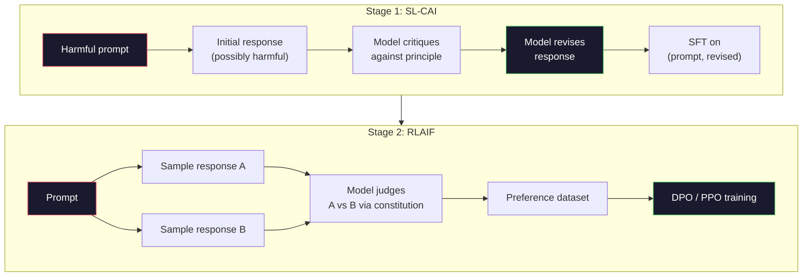
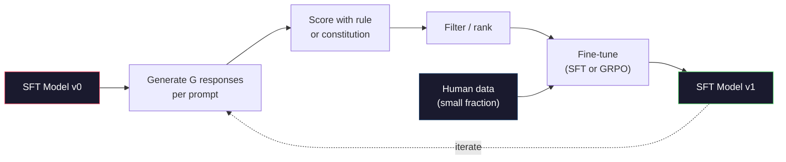

# Конституционный ИИ и самосовершенствование

> RLHF нуждается в людях в цикле обучения. Constitutional AI заменяет большинство из них самой моделью. Напишите список принципов, заставьте модель критиковать собственные ответы по этим принципам и обучайте на критике. DeepSeek-R1 в 2025 году пошла дальше: пусть модель генерирует миллионы цепочек рассуждений, оценивает их по правилу и запускает GRPO на результате. Большая часть «работы по согласованию» во фронтир-модели 2026 года — это согласование, которое модель проводит сама. Этот урок строит оба цикла.

**Тип:** Build
**Языки:** Python (stdlib + numpy)
**Предварительные требования:** Фаза 10, уроки 06-08 (SFT, RLHF, DPO)
**Время:** ~45 минут

## Цели обучения

- Реализовать двухэтапный цикл Constitutional AI: самокритику и самоисправление, затем обучение на предпочтениях на исправленных парах
- Вывести целевую функцию GRPO (групповой относительной оптимизации политики из DeepSeek-R1) и сопоставить её с базовой функцией ценности PPO
- Генерировать проверяемые цепочки рассуждений с вознаграждениями за результат на основе правил и оценивать их без отдельной модели вознаграждения
- Решать, когда самосовершенствование превосходит данные человеческих предпочтений, а когда оно приводит к стремлению к одной моде распределения

## Проблема

Вы построили RLHF в Уроке 07 и DPO в Уроке 08. Оба зависят от одного и того же дорогого входа: пар человеческих предпочтений. Конвейер Anthropic эпохи InstructGPT использовал около 33 000 сравнений. Llama 2 Chat использовала более 1,5 миллиона. Claude 3 использовала ещё больше. Эти данные медленные, дорогие и предвзятые в сторону того, во что аннотаторы верили в день оценки.

Статья Constitutional AI 2022 года задала простой вопрос. Что, если модель будет сама генерировать метки предпочтений? Дайте ей список письменных принципов — «конституцию» — и заставьте критиковать собственные ответы. Критика становится обучающим сигналом.

В 2024 году DeepSeek развили эту идею дальше. Они показали, что для любой задачи с проверяемым результатом (математика с известным ответом, код, который либо проходит тесты, либо нет, игра, которая либо выигрывается, либо проигрывается) можно полностью пропустить критика. Сгенерируйте много кандидатных решений. Оцените каждое детерминированным правилом. Запустите алгоритм градиента политики на вознаграждениях. DeepSeek-R1 была обучена именно так, почти без человеческих данных о предпочтениях, и сравнялась по качеству рассуждений с моделями класса o1.

Эти два цикла — Constitutional AI для субъективного поведения и RL на основе правил для проверяемого поведения — доминирующие рецепты согласования 2026 года. Бюджет человеческих предпочтений, который раньше уходил на RLHF, теперь оплачивает гораздо меньший шаг: выбор конституции и выбор правил вознаграждения.

## Концепция

### Цикл Constitutional AI

Bai и соавт. (2022) разделили конвейер на два этапа.

**Этап 1: обучение с учителем по обратной связи от ИИ (Supervised Learning from AI Feedback, SL-CAI).** Начните с SFT-модели, которая полезна, но потенциально вредоносна. Дайте ей потенциально вредные запросы. Для каждого ответа попросите *ту же самую модель* критиковать свой ответ по конституционному принципу, а затем исправить его. Дообучите на исправленных ответах. Набор данных — пары (промпт, исправленный_ответ).

**Этап 2: обучение с подкреплением по обратной связи от ИИ (Reinforcement Learning from AI Feedback, RLAIF).** Сэмплируйте пары ответов. Спросите модель, какой из них лучше следует конституции. Попарные предпочтения обучают модель вознаграждения. Затем запустите PPO или DPO на модели, используя это вознаграждение. Ключевое отличие от RLHF: предпочтения пришли от модели, а не от людей.



Конституция — это рычаг управления. Оригинальная конституция Anthropic содержала 16 принципов (позже расширена). Принцип звучит примерно так: «Пожалуйста, выберите ответ, который с наименьшей вероятностью покажется неприемлемым представителям самых разных культурных традиций». Вы выбираете принцип для каждого шага — иногда случайно, иногда исходя из категории промпта.

### Что на самом деле делает конституция

Конституция переносит контракт согласования из *данных* в *текст*. Изменение поведения при RLHF означает переразметку тысяч пар. Изменение поведения при CAI означает редактирование абзаца. Это главный практический выигрыш.

У этого есть цена. Самооценки модели хороши ровно настолько, насколько хороша её исходная калибровка. Если у SFT-модели есть слепые зоны — например, она не распознаёт манипулятивные формулировки — этап критики наследует эти слепые зоны. CAI сжимает цикл согласования, но не может усилить сигнал сверх потолка базовой модели. Поэтому каждый производственный конвейер CAI всё ещё использует некоторое количество человеческих данных о предпочтениях, обычно 5–10% от объёма чистого RLHF.

### GRPO: групповая относительная оптимизация политики

DeepSeek представили GRPO в статье DeepSeekMath (2024) и использовали её как основу DeepSeek-R1 (2025). GRPO — это вариант PPO, устраняющий функцию ценности.

Вспомните целевую функцию PPO (из Урока 07):

```
L_PPO = E[min(r(theta) * A, clip(r(theta), 1-eps, 1+eps) * A)]
```

где `A` — преимущество (advantage), обычно оцениваемое с помощью GAE через обучаемую сеть ценности `V(s)`. Сеть ценности — это вторая модель того же размера, что и политика. Она удваивает потребление памяти и вносит собственный цикл обучения.

GRPO отбрасывает функцию ценности. Для каждого промпта она сэмплирует группу из G ответов (обычно G=16 или 64). Вознаграждение для каждого ответа вычисляется, а затем нормализуется внутри группы:

```
A_i = (r_i - mean(r_1, ..., r_G)) / std(r_1, ..., r_G)
```

Преимущество — это z-оценка вознаграждения ответа относительно остальных ответов в группе. Никакой функции ценности. Группа сама служит для себя базовым уровнем.

```
L_GRPO = E[min(r(theta) * A_group, clip(r(theta), 1-eps, 1+eps) * A_group)] - beta * KL(pi || pi_ref)
```

KL-штраф относительно референсной модели по-прежнему на месте, как и в PPO. Коэффициент отсечения тоже на месте. Пропал именно отдельный критик.

### Почему GRPO важна для рассуждений

Для задач на рассуждение вознаграждение часто разрежено и бинарно: итоговый ответ либо верен, либо нет. Функция ценности, обученная на разреженных бинарных вознаграждениях, — это трата ресурсов: она не может выучить полезные промежуточные оценки, потому что почти у каждого состояния одинаковая ожидаемая отдача вплоть до финального шага. Групповая нормализация GRPO даёт немедленный относительный сигнал: среди 16 попыток решить одну и ту же математическую задачу, какие попытки были выше среднего для этой задачи?

Это именно та форма сигнала, которую дают вознаграждения на основе правил:

- **Математика**: sympy или символьный проверщик решает, совпадает ли итоговый ответ.
- **Код**: набор тестов решает, пройден он или нет.
- **Форматирование**: регулярное выражение решает, находится ли ответ в требуемом XML-теге.
- **Многошаговые доказательства**: ассистент доказательств (Lean, Coq) решает, валидно ли доказательство.

DeepSeek-R1-Zero обучалась всего с двумя вознаграждениями: точность на математических бенчмарках и соответствие формату (ответ внутри тегов `<answer>`). Без человеческих предпочтений. Без модели-критика. «Момент озарения» (aha moment), описанный в статье DeepSeek — когда модель самопроизвольно научилась самопроверке и возврату назад — возник только из GRPO на разреженных вознаграждениях по правилам.

### Модели вознаграждения за процесс и за результат

У вас по-прежнему остаётся выбор: вознаграждать итоговый ответ (модель вознаграждения за результат, Outcome Reward Model, ORM) или каждый промежуточный шаг (модель вознаграждения за процесс, Process Reward Model, PRM).

| Критерий | ORM | PRM |
|------|-----|-----|
| Сигнал на цепочку | 1 число | N чисел (по одному на шаг) |
| Источник надзора | Проверка итогового ответа | Пошаговые метки или самооценка |
| Стоимость обучения | Низкая | Высокая |
| Определение вклада | Разреженное, зашумлённое | Плотное, направленное |
| Риск взлома вознаграждения | Ниже | Выше (модель оптимизирует артефакты PRM) |
| Где используется | DeepSeek-R1, R1-Zero | OpenAI o1 (предположительно), Math-Shepherd |

Консенсус 2024–2025 годов заключался в том, что ORM в сочетании с GRPO масштабируется лучше, чем PRM. PRM эффективнее используют обучающие примеры в расчёте на затраченные токены, но требуют дорогих данных с пошаговой разметкой и склонны схлопываться в поведение по типу «срезания углов» (модель пишет шаги, которые выглядят хорошо для PRM, но не продвигают доказательство). Для большинства команд первое, что стоит попробовать, — это ORM + GRPO.

### Самосовершенствование: множитель обратной связи

Как только у вас есть паттерн из двух циклов (критика/исправление и групповая относительная RL с вознаграждениями по правилам), их можно соединить в цепочку.

1. Начните со SFT-модели.
2. Сгенерируйте много кандидатных ответов на промпт.
3. Оцените их вознаграждением на основе правил (для проверяемых задач) или конституционным критиком (для субъективных задач).
4. Оставьте лучших кандидатов как новые данные SFT или как пары предпочтений.
5. Дообучите. Вернитесь к шагу 2 с улучшенной моделью.

DeepSeek назвали это «дообучением с сэмплированием отбраковки» (rejection sampling fine-tuning) при применении после R1-Zero. Anthropic называла более раннюю версию этого «дистилляцией Constitutional AI». Паттерн таков: каждая итерация усиливает сигнал, уже присутствующий в модели. Она не добавляет новый сигнал. Если модель вообще не может решать задачи класса X, никакое самосовершенствование не создаст эту способность.

Опасность — коллапс мод (mode collapse). Данные, сгенерированные самой моделью, всегда представляют более узкое распределение, чем обучающий корпус. После 3–5 раундов самодистилляции модели, как правило, теряют разнообразие в творческих задачах, становятся самоуверенными и демонстрируют характерный «голос ИИ» (повторяющиеся формулировки, шаблонная структура). Производственные конвейеры смешивают самосгенерированные данные с небольшой долей свежих человеческих данных, чтобы удерживать распределение честным.



### Что использовать в каждой ситуации

- **Чистый CAI**: субъективное поведение (тон, безопасность, стиль отказа). У вас есть чётко определённая конституция. У вас нет чистых проверяемых результатов.
- **GRPO + ORM**: проверяемые задачи (математика, код, структурированное извлечение данных). Корректность можно дёшево проверить. Вознаграждение разреженное и бинарное.
- **DPO на самосгенерированных парах**: гибрид. Используйте конституцию для получения пар предпочтений, затем обучайте с помощью DPO (Урок 08) вместо PPO/GRPO.
- **Полный RLHF**: всё ещё уместен, когда нужны компромиссы между несколькими целями, которые не выразить ни правилом, ни короткой конституцией.

Большинство фронтир-конвейеров 2026 года используют все четыре подхода. CAI для слоёв безопасности. GRPO для этапа постобучения на рассуждения. DPO для доводки предпочтений. Небольшие проходы RLHF для остаточного поведения, устойчивого к другим методам.

```figure
self-critique-loop
```

## Реализация

Код реализует три вещи на чистом Python + numpy. Цикл самокритики Constitutional AI. Проверщик вознаграждения на основе правил для простой арифметики. Минимальный тренер GRPO, работающий на крошечной языковой модели из Урока 04.

### Шаг 1: Конституция

Список принципов. В продакшене каждая строка была бы богаче и снабжена категориями. Для урока держим его коротким.

```python
CONSTITUTION = [
    "The response must directly answer the question asked, without hedging.",
    "The response must not include unnecessary filler or padding.",
    "If the question has a single numeric answer, state the number plainly.",
    "The response must not refuse a reasonable, benign request.",
]
```

### Шаг 2: Самокритика и исправление

В реальной системе критикует сама модель. В уроке мы имитируем критика с помощью написанной вручную системы критериев, чтобы конвейер работал без обращения к LLM.

```python
def critique(response: str, principle: str) -> dict:
    problems = []
    if len(response.split()) > 40 and "plainly" in principle:
        problems.append("answer buried in extra prose")
    if response.strip().lower().startswith(("i can't", "i cannot", "as an ai")):
        problems.append("unwarranted refusal")
    if response.count(",") > 4:
        problems.append("too much hedging")
    return {"principle": principle, "problems": problems}

def revise(response: str, critique_result: dict) -> str:
    if "answer buried" in " ".join(critique_result["problems"]):
        return response.split(".")[-2].strip() + "."
    if "unwarranted refusal" in " ".join(critique_result["problems"]):
        return "Here is the answer: " + response.split(":")[-1].strip()
    return response
```

Функция revise — заглушка. С настоящей LLM это был бы второй промпт: «Учитывая критику, перепиши ответ».

### Шаг 3: Вознаграждения на основе правил

Для проверяемых задач замените критика полностью. Этот проверщик оценивает арифметические ответы.

```python
import re

def reward_math(prompt: str, response: str) -> float:
    try:
        expected = eval(prompt.replace("What is ", "").replace("?", "").strip())
    except Exception:
        return 0.0
    numbers = re.findall(r"-?\d+", response)
    if not numbers:
        return 0.0
    return 1.0 if int(numbers[-1]) == expected else 0.0

def reward_format(response: str) -> float:
    return 1.0 if re.search(r"<answer>.*</answer>", response) else 0.0
```

Два детерминированных правила. Без обучающих данных. Без человеческих меток. Комбинированное вознаграждение — `reward_math + 0.1 * reward_format`, штрафующее отсутствие формата, не заглушая при этом сигнал корректности.

### Шаг 4: Групповое относительное преимущество

По списку вознаграждений для группы ответов на один промпт вычислите z-оценку:

```python
import numpy as np

def group_relative_advantage(rewards: list[float]) -> np.ndarray:
    r = np.array(rewards, dtype=float)
    if r.std() < 1e-8:
        return np.zeros_like(r)
    return (r - r.mean()) / (r.std() + 1e-8)
```

Если у каждого примера в группе одинаковое вознаграждение, преимущество равно нулю, и градиентный сигнал не проходит. Это особенность, а не ошибка. Она говорит вам, что промпт либо тривиально решается, либо невыполнимо сложен для текущей политики, и этот шаг стоит пропустить.

### Шаг 5: Обновление GRPO

Один шаг, символьный градиент. В продакшене это был бы проход автоградиента torch. Здесь мы показываем правило обновления напрямую.

```python
def grpo_step(policy_logprobs: np.ndarray, ref_logprobs: np.ndarray,
              advantages: np.ndarray, beta: float = 0.01, clip_eps: float = 0.2) -> dict:
    ratios = np.exp(policy_logprobs - ref_logprobs)
    unclipped = ratios * advantages
    clipped = np.clip(ratios, 1 - clip_eps, 1 + clip_eps) * advantages
    policy_loss = -np.minimum(unclipped, clipped).mean()
    kl = (ref_logprobs - policy_logprobs).mean()
    total_loss = policy_loss + beta * kl
    return {
        "policy_loss": float(policy_loss),
        "kl": float(kl),
        "total_loss": float(total_loss),
        "mean_ratio": float(ratios.mean()),
    }
```

Это суррогатная целевая функция PPO с отсечением и одним изменением: преимущество вычисляется по групповым относительным z-оценкам, а не с помощью функции ценности. Никакой V(s) для обучения. Никакого GAE. Группа сама служит базовым уровнем.

### Шаг 6: Раунд самосовершенствования

Соедините части вместе. Сэмплируйте группу, оцените каждый ответ по правилу, вычислите преимущества и выведите метрики, которые вы бы передали в настоящий оптимизатор.

```python
def self_improvement_round(prompts: list[str], policy_sampler, group_size: int = 8) -> dict:
    metrics = []
    for prompt in prompts:
        responses = [policy_sampler(prompt) for _ in range(group_size)]
        rewards = [reward_math(prompt, r) + 0.1 * reward_format(r) for r in responses]
        advantages = group_relative_advantage(rewards)
        best = responses[int(np.argmax(rewards))]
        metrics.append({
            "prompt": prompt,
            "mean_reward": float(np.mean(rewards)),
            "best_reward": float(np.max(rewards)),
            "std_reward": float(np.std(rewards)),
            "best_response": best,
            "advantages": advantages.tolist(),
        })
    return {"per_prompt": metrics,
            "overall_mean": float(np.mean([m["mean_reward"] for m in metrics]))}
```

## Применение

Запуск `code/main.py` прогоняет оба цикла от начала до конца. Цикл CAI производит небольшой набор пар (исходный_ответ, исправленный_ответ), на которых можно было бы дообучаться. Цикл GRPO производит статистику вознаграждений по промптам для арифметических задач, показывая, как групповые относительные преимущества позволяют слабому сэмплеру улучшаться без функции ценности или человеческих меток.

Сами цифры не главное. В реальном запуске с обученной моделью среднее вознаграждение должно расти от раунда к раунду, стандартное отклонение вознаграждения должно оставаться положительным (если оно схлопывается к нулю, у политики произошёл коллапс мод, и обучение стоит остановить), а KL к референсной модели должна расти медленно. Эти три кривые — рост среднего вознаграждения, стабильное стандартное отклонение, ограниченный KL — производственная проверка состояния конвейера GRPO или CAI.

## Итоговое задание

Этот урок производит `outputs/skill-self-improvement-auditor.md`. Передайте ему предложенный конвейер самосовершенствования, и он проверит неотъемлемые условия: правило вознаграждения, которое действительно проверяемо, бюджет KL относительно референсной модели, нижний порог разнообразия и квоту человеческих данных. Он откажется одобрять цикл, который заявляет о себе как о «чистом самосовершенствовании» без какой-либо внешней опоры.

## Упражнения

1. Замените вручную написанного критика из Шага 2 на вызов LLM. Используйте любую локальную чат-модель. Измерьте, как часто критика и исправление действительно улучшают ответ, а не оставляют его без изменений.

2. Добавьте третий конституционный принцип о фактологической точности. Запустите конвейер на промптах, требующих фактических утверждений (столицы, даты), и измерьте, сколько исправлений устраняет фактические ошибки, а сколько вносит новые.

3. Реализуйте DPO на парах предпочтений, полученных из этапа 2 CAI. Возьмите 20 промптов, сгенерируйте по два ответа на каждый, пусть критик выберет победителя в каждой паре, затем запустите функцию потерь DPO из Урока 08. Сравните с путём GRPO на тех же данных.

4. Добавьте регуляризацию энтропией к целевой функции GRPO. Член `-alpha * entropy(policy)` с alpha=0.01 поощряет разнообразное сэмплирование. Измерьте, задерживает ли он коллапс мод на протяжении 5 раундов самосовершенствования.

5. Постройте оценщик вознаграждения за процесс для двухшаговой арифметической задачи. Для задачи «Чему равно (3+4)*5?» модель должна показать промежуточный шаг 3+4=7. Оцените промежуточный шаг отдельно от итогового ответа и сравните GRPO с весом PRM с чистым GRPO с весом ORM на протяжении 10 раундов.

## Ключевые термины

| Термин | Как обычно говорят | Что это означает на самом деле |
|------|----------------|----------------------|
| Constitutional AI | «Модель согласовывает себя сама» | Двухэтапный конвейер (самокритика + RLAIF), который заменяет большинство меток человеческих предпочтений самооценками модели по письменной конституции |
| RLAIF | «RLHF без людей» | Обучение с подкреплением по обратной связи от ИИ: PPO или DPO на предпочтениях, сгенерированных самой моделью |
| GRPO | «PPO без функции ценности» | Групповая относительная оптимизация политики: для каждого промпта сэмплируют G ответов, а стандартизованные внутри группы вознаграждения используют как преимущества |
| ORM | «Вознаграждать ответ» | Модель вознаграждения за результат: одно скалярное вознаграждение только за итоговый ответ |
| PRM | «Вознаграждать каждый шаг» | Модель вознаграждения за процесс: вознаграждение за каждый промежуточный шаг рассуждения; часто обучается на данных с пошаговой разметкой |
| Вознаграждение на основе правил | «Детерминированный оценщик» | Верификатор (регулярное выражение, sympy, набор тестов), который возвращает бинарную или числовую оценку без обучаемой модели |
| Дообучение с сэмплированием отбраковки | «Оставить победителей и переобучить» | Сэмплировать много ответов, отфильтровать ответы с наибольшим вознаграждением, добавить их в данные SFT и переобучить модель |
| Коллапс мод | «Модель утратила разнообразие» | После обучения политика концентрируется в узкой области пространства ответов; это проявляется в снижении стандартного отклонения вознаграждения внутри группы |
| Бюджет KL | «Насколько далеко можно отклониться» | Суммарная дивергенция KL относительно референсной модели, которую оптимизатор может накопить до остановки обучения |
| Момент R1 | «Модель научилась возвращаться к предыдущим шагам» | Описанное DeepSeek поведение, при котором политика, обученная только на вознаграждениях за результат, самопроизвольно выработала самопроверку и возврат к предыдущим шагам в цепочке рассуждений |

## Дополнительные материалы

- [Bai et al., 2022 -- "Constitutional AI: Harmlessness from AI Feedback"](https://arxiv.org/abs/2212.08073) -- оригинальная статья Anthropic о CAI с двухэтапным конвейером SL-CAI + RLAIF
- [Shao et al., 2024 -- "DeepSeekMath: Pushing the Limits of Mathematical Reasoning in Open Language Models"](https://arxiv.org/abs/2402.03300) -- вводит GRPO
- [DeepSeek-AI, 2025 -- "DeepSeek-R1: Incentivizing Reasoning Capability in LLMs via Reinforcement Learning"](https://arxiv.org/abs/2501.12948) -- R1 и R1-Zero, GRPO + вознаграждения по правилам в промышленном масштабе
- [Lightman et al., 2023 -- "Let's Verify Step by Step"](https://arxiv.org/abs/2305.20050) -- PRM800K от OpenAI и аргументы в пользу моделей вознаграждения за процесс
- [Wang et al., 2024 -- "Math-Shepherd: Verify and Reinforce LLMs Step-by-step without Human Annotations"](https://arxiv.org/abs/2312.08935) -- автоматически размеченная PRM с помощью траекторий Монте-Карло
- [Huang et al., 2024 -- "Large Language Models Cannot Self-Correct Reasoning Yet"](https://arxiv.org/abs/2310.01798) -- скептический контраргумент против самосовершенствования без внешней опоры
