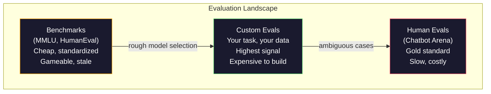
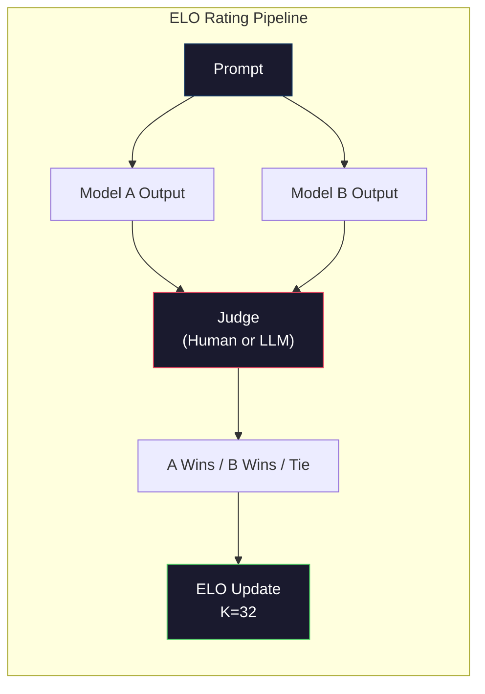

# Оценивание: бенчмарки, собственные наборы тестов, LM Harness

> Закон Гудхарта: когда показатель становится целью, он перестаёт быть хорошим показателем. Каждая передовая лаборатория обыгрывает бенчмарки. Результаты MMLU растут, а модели всё ещё не могут надёжно посчитать количество букв R в слове «strawberry». Единственное оценивание, которое имеет значение, — это ВАШЕ оценивание на ВАШЕЙ задаче, с ВАШИМИ данными.

**Тип:** Build
**Языки:** Python
**Предварительные требования:** этап 10, уроки 01-05 (LLM с нуля)
**Время:** ~90 минут

## Цели обучения

- Построить собственную систему оценивания, которая прогоняет на языковой модели бенчмарки с множественным выбором и открытыми ответами
- Объяснить, почему стандартные бенчмарки (MMLU, HumanEval) насыщаются и перестают различать передовые модели
- Реализовать оценивание конкретной задачи с правильными метриками: точным совпадением, F1, BLEU и оценкой от большой языковой модели (LLM) в роли судьи
- Спроектировать собственный набор тестов для оценивания конкретного сценария использования, а не полагаться исключительно на публичные лидерборды

## Проблема

MMLU был опубликован в 2020 году и содержал 15,908 вопросов по 57 предметам. За три года передовые модели насытили его. GPT-4 набрал 86.4%. Claude 3 Opus набрал 86.8%. Llama 3 405B набрала 88.6%. Лидерборд сжался в диапазон в 3 процентных пункта, где различия — это статистический шум, а не реальный разрыв в возможностях.

При этом те же самые модели проваливают задачи, с которыми справляется десятилетний ребёнок, не задумываясь. Claude 3.5 Sonnet, набравший 88.7% на MMLU, изначально не мог сосчитать буквы в слове «strawberry» — задача, которая не требует ни знаний о мире, ни рассуждений, только посимвольную итерацию. HumanEval тестирует генерацию кода на 164 задачах. Модели набирают на нём 90%+, продолжая при этом выдавать код, который падает на граничных случаях, которые заметил бы любой джуниор-разработчик.

Разрыв между производительностью на бенчмарке и надёжностью в реальном мире — центральная проблема оценивания LLM. Бенчмарки говорят вам о том, как модель работает на бенчмарке. Они почти ничего не говорят о том, как эта модель поведёт себя на вашей конкретной задаче, с вашими конкретными данными, при ваших конкретных сценариях сбоя. Если вы строите бота поддержки клиентов, MMLU не имеет значения. Если вы строите ассистента для кода, HumanEval покрывает только генерацию на уровне функций — он ничего не говорит об отладке, рефакторинге или объяснении кода в нескольких файлах.

Вам нужны собственные наборы тестов для оценивания. Не потому что бенчмарки бесполезны — они полезны для грубого отбора моделей — а потому что итоговое оценивание должно точно соответствовать условиям вашего продакшена.

## Концепция

### Ландшафт оценивания

Существует три категории оценивания, каждая со своей стоимостью и качеством сигнала.

**Бенчмарки** — это стандартизированные наборы тестов. MMLU, HumanEval, SWE-bench, MATH, ARC, HellaSwag. Вы прогоняете модель против бенчмарка и получаете оценку. Преимущество: все используют один и тот же тест, поэтому можно сравнивать модели. Недостаток: модели и обучающие данные всё сильнее загрязняют эти бенчмарки. Лаборатории обучают модели на данных, включающих вопросы бенчмарков. Оценки растут. Возможности — не обязательно.

**Собственные наборы тестов для оценивания** — это наборы тестов, которые вы создаёте под свой конкретный сценарий использования. Вы определяете входные данные, ожидаемые выходные данные и функцию скоринга. Суммаризатор юридических документов оценивается на юридических документах. Генератор SQL оценивается на схеме вашей базы данных. Их дорого создавать, но только такое оценивание позволяет предсказать производительность в продакшене.

**Оценивание людьми** проводят платные аннотаторы, которые судят выходы модели по критериям вроде полезности, корректности, беглости и безопасности. Это золотой стандарт для открытых задач, где автоматический скоринг не справляется. Chatbot Arena собрала более 2 миллионов голосов человеческих предпочтений по более чем 100 моделям. Недостаток: стоимость (от $0.10 до $2.00 за суждение) и скорость (от часов до дней).



### Почему бенчмарки ломаются

Три механизма приводят к тому, что оценки на бенчмарках перестают отражать реальные возможности.

**Загрязнение данных.** Обучающие корпуса собираются со всего интернета. Вопросы бенчмарков живут в интернете. Модели видят ответы во время обучения. Это не жульничество в традиционном смысле — лаборатории не включают данные бенчмарков намеренно. Но сбор данных в масштабе всего веба делает исключение таких данных практически невозможным.

**Обучение под тест.** Лаборатории оптимизируют смеси обучающих данных под производительность на бенчмарках. Если 5% обучающей смеси — это вопросы в стиле MMLU с множественным выбором, модель заучивает формат и распределение ответов. MMLU — это выбор из 4 вариантов. Модели заучивают, что распределение ответов примерно равномерно по A/B/C/D, что помогает даже тогда, когда модель не знает ответа.

**Насыщение.** Когда каждая передовая модель набирает 85-90% на бенчмарке, бенчмарк перестаёт различать модели. Оставшиеся 10-15% вопросов могут быть неоднозначными, неправильно размеченными или требовать редких доменных знаний. Рост с 87% до 89% на MMLU может означать, что модель запомнила ещё два редких вопроса, а не то, что она стала умнее.

### Перплексия: быстрая проверка состояния

Перплексия измеряет, насколько модель удивлена последовательностью токенов. Формально это экспонента от средней отрицательной логарифмической правдоподобности:

```
PPL = exp(-1/N * sum(log P(token_i | context)))
```

Перплексия 10 означает, что модель в среднем настолько же не уверена, как если бы выбирала равномерно среди 10 вариантов на каждой позиции токена. Чем ниже, тем лучше. GPT-2 получает перплексию ~30 на WikiText-103. GPT-3 получает ~20. Llama 3 8B получает ~7.

Перплексия полезна для сравнения моделей на одном и том же тестовом наборе, но у неё есть слепые зоны. Модель может иметь низкую перплексию за счёт хорошего предсказания частых паттернов, оставаясь при этом ужасной в предсказании редких, но важных паттернов. Она также ничего не говорит о следовании инструкциям, рассуждениях или фактической точности. Используйте её как проверку на вменяемость, а не как окончательный вердикт.

### LLM в роли судьи

Используйте сильную модель для оценивания выходов более слабой модели. Идея проста: попросить GPT-4o или Claude Sonnet оценить ответ по шкале от 1 до 5 по корректности, полезности и безопасности. Это стоит около $0.01 за суждение с GPT-4o-mini и на удивление хорошо коррелирует с человеческими суждениями — около 80% согласия на большинстве задач.

Промпт для скоринга важнее модели. Расплывчатый промпт («Оцените этот ответ») даёт шумные оценки. Структурированный промпт с рубрикой («Поставьте 5, если ответ фактически верен и указывает источник, 4 — если верен, но без источника, 3 — если частично верен...») даёт согласованные, воспроизводимые оценки.

Сценарии сбоя: модели-судьи демонстрируют смещение по позиции (предпочитают первый ответ в парных сравнениях), смещение по многословности (предпочитают более длинные ответы) и самопредпочтение (GPT-4 оценивает выходы GPT-4 выше, чем эквивалентные выходы Claude). Способы смягчения: рандомизировать порядок, нормализовать по длине, использовать судью, отличного от оцениваемой модели.

### Рейтинги ELO по парным сравнениям

Подход Chatbot Arena. Покажите два ответа на один и тот же промпт от разных моделей. Человек (или LLM-судья) выбирает лучший. По тысячам таких сравнений вычисляется рейтинг ELO для каждой модели — та же система, что используется в шахматах.

Преимущества ELO: относительное ранжирование надёжнее абсолютного скоринга, ELO изящно справляется с ничьими и сходится за меньшее число сравнений, чем оценивание каждого выхода по отдельности. По состоянию на начало 2026 года рейтинги Chatbot Arena показывают, что GPT-4o, Claude 3.5 Sonnet и Gemini 1.5 Pro находятся в пределах 20 очков ELO друг от друга на вершине рейтинга.



### Фреймворки для оценивания

**lm-evaluation-harness** (EleutherAI): стандартный опенсорсный фреймворк для оценивания. Поддерживает более 200 бенчмарков. Прогоняет любую модель Hugging Face против MMLU, HellaSwag, ARC и так далее одной командой. Используется в Open LLM Leaderboard.

**RAGAS**: фреймворк оценивания специально для RAG-конвейеров. Измеряет достоверность (соответствует ли ответ найденному контексту?), релевантность (релевантен ли найденный контекст вопросу?) и корректность ответа.

**promptfoo**: конфигурационное оценивание для проектирования промптов. Определите тест-кейсы в YAML, прогоните против нескольких моделей, получите отчёт pass/fail. Полезен для регрессионного тестирования промптов — чтобы убедиться, что изменение промпта не ломает существующие тест-кейсы.

### Создание собственных наборов тестов для оценивания

Это единственное оценивание, которое имеет значение для продакшена. Процесс:

1. **Определите задачу.** Что именно должна делать модель? Будьте точны. «Отвечать на вопросы» — слишком расплывчато. «По жалобе клиента из письма извлечь название продукта, категорию проблемы и тональность» — это задача, которую можно оценить.

2. **Создайте тест-кейсы.** Минимум 50 для прототипа набора тестов для оценивания, 200+ для продакшена. Каждый тест-кейс — это пара (вход, ожидаемый_выход). Включите граничные случаи: пустые входы, состязательные входы, неоднозначные входы, входы на других языках.

3. **Определите скоринг.** Точное совпадение для структурированных выходов. BLEU/ROUGE для текстового сходства. LLM в роли судьи — для оценки качества открытых ответов. F1 для задач извлечения. Комбинируйте несколько метрик с весами.

4. **Автоматизируйте.** Каждый набор тестов для оценивания запускается одной командой. Никаких ручных шагов. Храните результаты в формате, позволяющем сравнивать их во времени.

5. **Отслеживайте во времени.** Результат оценивания сам по себе бессмысленен. Нужен тренд. Улучшился ли результат после последнего изменения промпта? Ухудшился ли он после смены модели? Версионируйте свой набор тестов для оценивания вместе с промптами.

| Вид оценивания | Стоимость одного суждения | Согласованность с людьми | Лучше всего подходит для |
|-----------|------------------|----------------------|----------|
| Точное совпадение | ~$0 | 100% (когда применимо) | Структурированный вывод, классификация |
| BLEU/ROUGE | ~$0 | ~60% | Перевод, суммаризация |
| LLM в роли судьи | ~$0.01 | ~80% | Открытая генерация |
| Оценивание людьми | $0.10-$2.00 | Н/П (само является эталоном) | Неоднозначные задачи с высокими ставками |

```figure
perplexity-loss
```

## Реализация

### Шаг 1: минимальная система оценивания

Определите базовые абстракции. У тест-кейса для оценивания есть вход, ожидаемый выход и опциональный словарь метаданных. Скорер принимает предсказание и эталон и возвращает оценку от 0 до 1.

```python
import json
from collections import Counter

class EvalCase:
    def __init__(self, input_text, expected, metadata=None):
        self.input_text = input_text
        self.expected = expected
        self.metadata = metadata or {}

class EvalSuite:
    def __init__(self, name, cases, scorers):
        self.name = name
        self.cases = cases
        self.scorers = scorers

    def run(self, model_fn):
        results = []
        for case in self.cases:
            prediction = model_fn(case.input_text)
            scores = {}
            for scorer_name, scorer_fn in self.scorers.items():
                scores[scorer_name] = scorer_fn(prediction, case.expected)
            results.append({
                "input": case.input_text,
                "expected": case.expected,
                "prediction": prediction,
                "scores": scores,
            })
        return results
```

### Шаг 2: функции скоринга

Постройте точное совпадение, токенный F1 и симулированный скорер LLM в роли судьи.

```python
def exact_match(prediction, expected):
    return 1.0 if prediction.strip().lower() == expected.strip().lower() else 0.0

def token_f1(prediction, expected):
    pred_tokens = set(prediction.lower().split())
    exp_tokens = set(expected.lower().split())
    if not pred_tokens or not exp_tokens:
        return 0.0
    common = pred_tokens & exp_tokens
    precision = len(common) / len(pred_tokens)
    recall = len(common) / len(exp_tokens)
    if precision + recall == 0:
        return 0.0
    return 2 * (precision * recall) / (precision + recall)

def llm_judge_simulated(prediction, expected):
    pred_words = set(prediction.lower().split())
    exp_words = set(expected.lower().split())
    if not exp_words:
        return 0.0
    overlap = len(pred_words & exp_words) / len(exp_words)
    length_penalty = min(1.0, len(prediction) / max(len(expected), 1))
    return round(overlap * 0.7 + length_penalty * 0.3, 3)
```

### Шаг 3: система рейтинга ELO

Реализуйте парные сравнения с обновлениями ELO. Это именно та система, которую Chatbot Arena использует для ранжирования моделей.

```python
class ELOTracker:
    def __init__(self, k=32, initial_rating=1500):
        self.ratings = {}
        self.k = k
        self.initial_rating = initial_rating
        self.history = []

    def _ensure_player(self, name):
        if name not in self.ratings:
            self.ratings[name] = self.initial_rating

    def expected_score(self, rating_a, rating_b):
        return 1 / (1 + 10 ** ((rating_b - rating_a) / 400))

    def record_match(self, player_a, player_b, outcome):
        self._ensure_player(player_a)
        self._ensure_player(player_b)

        ea = self.expected_score(self.ratings[player_a], self.ratings[player_b])
        eb = 1 - ea

        if outcome == "a":
            sa, sb = 1.0, 0.0
        elif outcome == "b":
            sa, sb = 0.0, 1.0
        else:
            sa, sb = 0.5, 0.5

        self.ratings[player_a] += self.k * (sa - ea)
        self.ratings[player_b] += self.k * (sb - eb)

        self.history.append({
            "a": player_a, "b": player_b,
            "outcome": outcome,
            "rating_a": round(self.ratings[player_a], 1),
            "rating_b": round(self.ratings[player_b], 1),
        })

    def leaderboard(self):
        return sorted(self.ratings.items(), key=lambda x: -x[1])
```

### Шаг 4: вычисление перплексии

Вычислите перплексию, используя вероятности токенов. На практике вы получали бы их из логитов модели. Здесь мы симулируем их с помощью распределения вероятностей.

```python
import numpy as np

def perplexity(log_probs):
    if not log_probs:
        return float("inf")
    avg_neg_log_prob = -np.mean(log_probs)
    return float(np.exp(avg_neg_log_prob))

def token_log_probs_simulated(text, model_quality=0.8):
    np.random.seed(hash(text) % 2**31)
    tokens = text.split()
    log_probs = []
    for i, token in enumerate(tokens):
        base_prob = model_quality
        if len(token) > 8:
            base_prob *= 0.6
        if i == 0:
            base_prob *= 0.7
        prob = np.clip(base_prob + np.random.normal(0, 0.1), 0.01, 0.99)
        log_probs.append(float(np.log(prob)))
    return log_probs
```

### Шаг 5: агрегирование результатов

Вычислите сводную статистику по прогону оценивания: среднее, медиану, долю прохождения при пороге и разбивку по каждой метрике.

```python
def summarize_results(results, threshold=0.8):
    all_scores = {}
    for r in results:
        for metric, score in r["scores"].items():
            all_scores.setdefault(metric, []).append(score)

    summary = {}
    for metric, scores in all_scores.items():
        arr = np.array(scores)
        summary[metric] = {
            "mean": round(float(np.mean(arr)), 3),
            "median": round(float(np.median(arr)), 3),
            "std": round(float(np.std(arr)), 3),
            "min": round(float(np.min(arr)), 3),
            "max": round(float(np.max(arr)), 3),
            "pass_rate": round(float(np.mean(arr >= threshold)), 3),
            "n": len(scores),
        }
    return summary

def print_summary(summary, suite_name="Eval"):
    print(f"\n{'=' * 60}")
    print(f"  {suite_name} Summary")
    print(f"{'=' * 60}")
    for metric, stats in summary.items():
        print(f"\n  {metric}:")
        print(f"    Mean:      {stats['mean']:.3f}")
        print(f"    Median:    {stats['median']:.3f}")
        print(f"    Std:       {stats['std']:.3f}")
        print(f"    Range:     [{stats['min']:.3f}, {stats['max']:.3f}]")
        print(f"    Pass rate: {stats['pass_rate']:.1%} (threshold >= 0.8)")
        print(f"    N:         {stats['n']}")
```

### Шаг 6: запуск полного конвейера

Соберите всё вместе. Определите задачу, создайте тест-кейсы, симулируйте две модели, проведите оценивание, вычислите ELO по парным сравнениям и выведите лидерборд.

```python
def demo_model_good(prompt):
    responses = {
        "What is the capital of France?": "Paris",
        "What is 2 + 2?": "4",
        "Who wrote Hamlet?": "William Shakespeare",
        "What language is PyTorch written in?": "Python and C++",
        "What is the boiling point of water?": "100 degrees Celsius",
    }
    return responses.get(prompt, "I don't know")

def demo_model_bad(prompt):
    responses = {
        "What is the capital of France?": "Paris is the capital city of France",
        "What is 2 + 2?": "The answer is four",
        "Who wrote Hamlet?": "Shakespeare",
        "What language is PyTorch written in?": "Python",
        "What is the boiling point of water?": "212 Fahrenheit",
    }
    return responses.get(prompt, "Unknown")

cases = [
    EvalCase("What is the capital of France?", "Paris"),
    EvalCase("What is 2 + 2?", "4"),
    EvalCase("Who wrote Hamlet?", "William Shakespeare"),
    EvalCase("What language is PyTorch written in?", "Python and C++"),
    EvalCase("What is the boiling point of water?", "100 degrees Celsius"),
]

suite = EvalSuite(
    name="General Knowledge",
    cases=cases,
    scorers={
        "exact_match": exact_match,
        "token_f1": token_f1,
        "llm_judge": llm_judge_simulated,
    },
)

results_good = suite.run(demo_model_good)
results_bad = suite.run(demo_model_bad)

print_summary(summarize_results(results_good), "Model A (concise)")
print_summary(summarize_results(results_bad), "Model B (verbose)")
```

«Хорошая» модель даёт точные ответы. «Плохая» модель даёт многословные перефразировки. Точное совпадение сурово наказывает многословную модель. Токенный F1 и LLM в роли судьи гораздо снисходительнее. Это иллюстрирует, почему выбор метрики важен: одна и та же модель выглядит великолепно или ужасно в зависимости от того, как вы её оцениваете.

### Шаг 7: турнир ELO

Прогоните парные сравнения между моделями в несколько раундов.

```python
elo = ELOTracker(k=32)

for case in cases:
    pred_a = demo_model_good(case.input_text)
    pred_b = demo_model_bad(case.input_text)

    score_a = token_f1(pred_a, case.expected)
    score_b = token_f1(pred_b, case.expected)

    if score_a > score_b:
        outcome = "a"
    elif score_b > score_a:
        outcome = "b"
    else:
        outcome = "tie"

    elo.record_match("model_a_concise", "model_b_verbose", outcome)

print("\nELO Leaderboard:")
for name, rating in elo.leaderboard():
    print(f"  {name}: {rating:.0f}")
```

### Шаг 8: сравнение перплексии

Сравните перплексию между «моделями» разного уровня качества.

```python
test_text = "The quick brown fox jumps over the lazy dog in the garden"

for quality, label in [(0.9, "Strong model"), (0.7, "Medium model"), (0.4, "Weak model")]:
    log_probs = token_log_probs_simulated(test_text, model_quality=quality)
    ppl = perplexity(log_probs)
    print(f"  {label} (quality={quality}): perplexity = {ppl:.2f}")
```

## Применение

### lm-evaluation-harness (EleutherAI)

Стандартный инструмент для прогона бенчмарков на любой модели.

```python
# pip install lm-eval
# Command line:
# lm_eval --model hf --model_args pretrained=meta-llama/Llama-3.1-8B --tasks mmlu --batch_size 8

# Python API:
# import lm_eval
# results = lm_eval.simple_evaluate(
#     model="hf",
#     model_args="pretrained=meta-llama/Llama-3.1-8B",
#     tasks=["mmlu", "hellaswag", "arc_easy"],
#     batch_size=8,
# )
# print(results["results"])
```

### promptfoo

Конфигурационное оценивание для проектирования промптов. Определите тесты в YAML и прогоните против нескольких провайдеров.

```yaml
# promptfoo.yaml
providers:
  - openai:gpt-4o-mini
  - anthropic:claude-3-haiku

prompts:
  - "Answer in one word: {{question}}"

tests:
  - vars:
      question: "What is the capital of France?"
    assert:
      - type: contains
        value: "Paris"
  - vars:
      question: "What is 2 + 2?"
    assert:
      - type: equals
        value: "4"
```

### RAGAS для оценивания RAG

```python
# pip install ragas
# from ragas import evaluate
# from ragas.metrics import faithfulness, answer_relevancy, context_precision
#
# result = evaluate(
#     dataset,
#     metrics=[faithfulness, answer_relevancy, context_precision],
# )
# print(result)
```

RAGAS измеряет то, что упускают обычные методы оценивания: заземлён ли ответ модели в найденном контексте, а не просто «корректен» ли ответ в абстрактном смысле.

## Итоговое задание

Этот урок производит `outputs/prompt-eval-designer.md` — переиспользуемый промпт, который проектирует собственные наборы тестов для оценивания любой задачи. Дайте ему описание задачи, и он сгенерирует тест-кейсы, функции скоринга и рекомендацию по порогу pass/fail.

Он также производит `outputs/skill-llm-evaluation.md` — фреймворк принятия решений для выбора правильной стратегии оценивания в зависимости от типа задачи, бюджета и требований к задержке.

## Упражнения

1. Добавьте скорер «согласованности», который прогоняет один и тот же вход через модель 5 раз и измеряет, как часто выходы совпадают. Несогласованные ответы на детерминированных входах выявляют хрупкие промпты или слишком высокую температуру.

2. Расширьте трекер ELO для поддержки нескольких функций-судей (точное совпадение, F1, LLM в роли судьи) с весами. Сравните, как меняется лидерборд, когда вы придаёте большой вес точному совпадению против большого веса F1.

3. Постройте набор тестов для оценивания конкретной задачи: классификации писем по 5 категориям. Создайте 100 тест-кейсов с разнообразными примерами, включая граничные случаи (письма, которые могут относиться к нескольким категориям, пустые письма, письма на других языках). Измерьте, как разные «модели» (на основе правил, сопоставление ключевых слов, симулированная LLM) справляются с задачей.

4. Реализуйте обнаружение загрязнения: для заданного набора вопросов оценивания и обучающего корпуса проверьте, какой процент вопросов оценивания (или их близких перефразировок) присутствует в обучающих данных. Именно так исследователи проверяют валидность бенчмарков.

5. Постройте инструмент «diff моделей». Дав результаты оценивания двух версий модели, выделите, какие конкретные тест-кейсы улучшились, какие ухудшились, а какие остались без изменений. Это эквивалент diff кода для оценивания — необходим для понимания того, помогло изменение или навредило.

## Ключевые термины

| Термин | Как его обычно называют | Что он означает на самом деле |
|------|----------------|----------------------|
| MMLU | «Тот самый бенчмарк» | Massive Multitask Language Understanding — 15,908 вопросов с множественным выбором по 57 предметам; к 2025 году результат превысил 88%, и бенчмарк оказался насыщен |
| HumanEval | «Оценивание кода» | 164 задачи от OpenAI на дополнение функций Python; проверяет только изолированную генерацию функций |
| SWE-bench | «Оценивание реальных задач программирования» | 2,294 задачи из GitHub Issues в 12 репозиториях Python; измеряет способность полностью исправлять ошибки, включая генерацию тестов |
| Перплексия | «Насколько модель растеряна» | exp(-avg(log P(token_i given context))) — чем ниже значение, тем более высокую вероятность модель присваивает фактическим токенам |
| Рейтинг ELO | «Шахматный рейтинг для моделей» | Относительный рейтинг навыков, вычисляемый по результатам парных побед и поражений; Chatbot Arena использует его для ранжирования более 100 моделей |
| LLM в роли судьи | «ИИ оценивает ИИ» | Сильная модель оценивает выходы более слабой по рубрике; согласованность с людьми составляет ~80% при стоимости ~$0.01 за суждение |
| Загрязнение данных | «Модель видела тест» | Обучающие данные содержат вопросы бенчмарка, из-за чего результаты растут без реального улучшения возможностей |
| Набор тестов для оценивания | «Просто набор тестов» | Версионируемая коллекция троек (input, expected_output, scorer), измеряющих конкретную способность |
| Доля прохождения | «На какой процент вопросов модель ответила правильно» | Доля тест-кейсов оценивания с результатом выше порога — более практичная метрика, чем средний результат, поскольку она измеряет надёжность |
| Chatbot Arena | «Сайт с рейтингом моделей» | Платформа LMSYS с 2M+ голосами людей, которая формирует наиболее авторитетный лидерборд LLM на основе рейтингов ELO |

## Дополнительные материалы

- [Hendrycks et al., 2021 -- "Measuring Massive Multitask Language Understanding"](https://arxiv.org/abs/2009.03300) -- статья про MMLU, всё ещё самый цитируемый бенчмарк LLM, несмотря на его насыщение
- [Chen et al., 2021 -- "Evaluating Large Language Models Trained on Code"](https://arxiv.org/abs/2107.03374) -- статья про HumanEval от OpenAI, заложившая методологию оценивания генерации кода
- [Zheng et al., 2023 -- "Judging LLM-as-a-Judge"](https://arxiv.org/abs/2306.05685) -- систематический анализ использования LLM для оценивания LLM, включая выводы о смещении по позиции и смещении по многословности
- [LMSYS Chatbot Arena](https://chat.lmsys.org/) -- краудсорсинговая платформа для сравнения моделей с более чем 2 млн голосов, самый доверенный рейтинг LLM в реальных условиях
