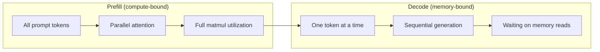
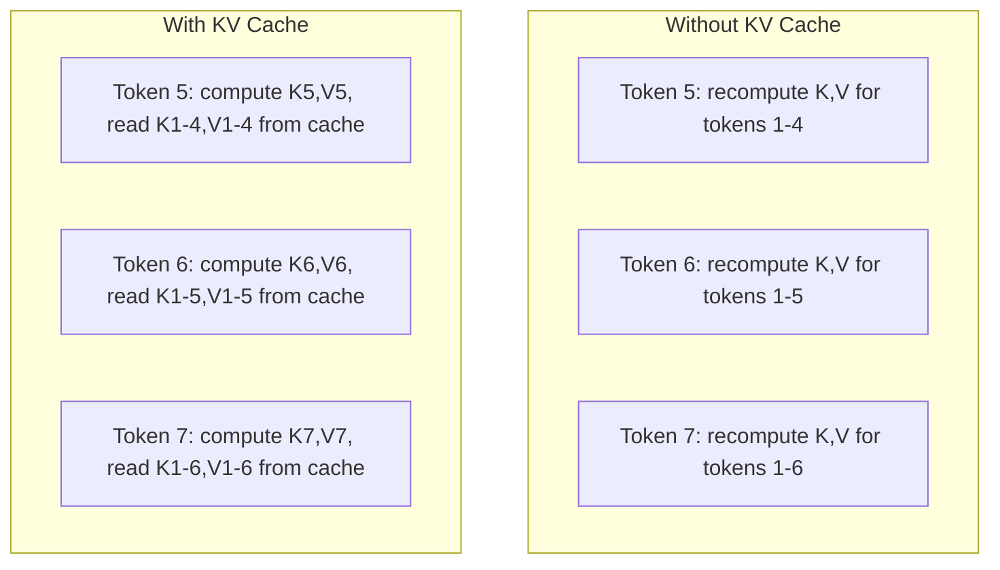
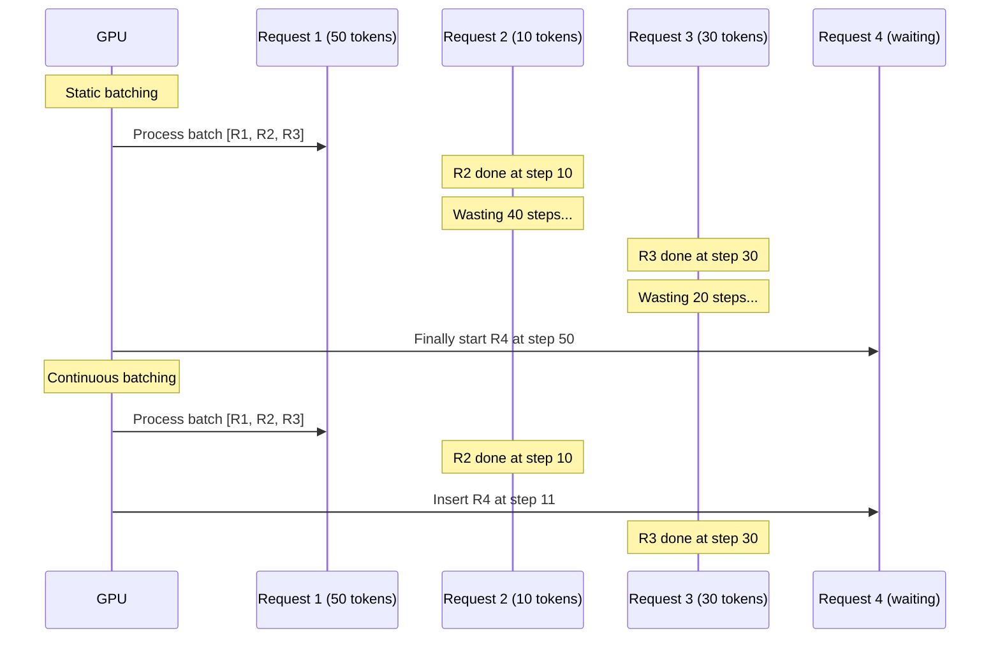
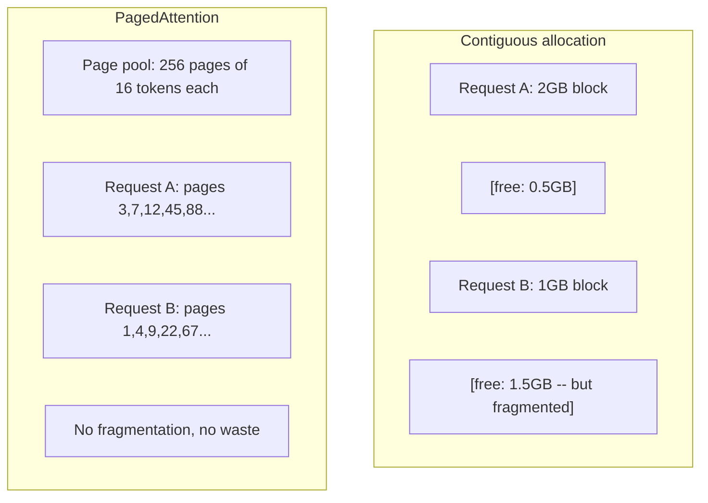
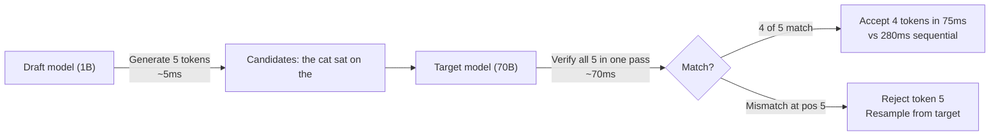

# Оптимизация инференса

> Выполнение вывода (инференс) большой языковой модели (LLM) определяется двумя фазами. Prefill обрабатывает ваш промпт параллельно — этот этап ограничен вычислениями (compute-bound). Decode генерирует токены по одному — этот этап ограничен пропускной способностью памяти (memory-bound). Каждая оптимизация нацелена на одну из этих фаз или на обе.

**Тип:** Build
**Языки:** Python
**Предварительные требования:** Этап 10, уроки 01-08 (архитектура трансформера, внимание)
**Время:** ~120 минут

## Цели обучения

- Реализовать KV-кеш, чтобы устранить избыточные вычисления при авторегрессионной генерации токенов
- Объяснить фазы prefill и decode в инференсе LLM и почему у каждой из них разные узкие места (ограничение вычислениями против ограничения пропускной способностью памяти)
- Реализовать концепции непрерывной пакетной обработки (continuous batching) и PagedAttention для максимизации утилизации GPU при параллельных запросах
- Сравнить техники оптимизации инференса (KV-кеш, спекулятивное декодирование, flash attention) и их компромиссы между пропускной способностью и задержкой

## Проблема

Вы разворачиваете Llama 3 70B на 4xA100 GPU. Один пользователь получает ~50 токенов в секунду. Кажется быстрым. Затем 100 пользователей одновременно обращаются к конечной точке API. Пропускная способность падает до 3 токенов/секунду на пользователя. При счёте за GPU в 25 000 долларов в месяц ответы поступают медленнее, чем печатает человек.

Сама модель не меняется между 1 пользователем и 100 пользователями. Те же веса, та же архитектура, та же математика. Меняется то, как вы планируете работу. Наивный инференс тратит впустую 90%+ доступных вычислений GPU. Пользователь, ожидающий токен 47, удерживает открытым целый слот пакета, пока шина памяти GPU простаивает между matmul-операциями. Тем временем промпт нового пользователя на 2000 токенов мог бы заполнить это мёртвое время полезными вычислениями.

Это не проблема масштабирования. Это проблема планирования. Техники из этого урока — KV-кеширование, непрерывная пакетная обработка, PagedAttention, спекулятивное декодирование, кеширование префиксов — отличают счёт за инференс в 25 тысяч долларов в месяц от счёта в 5 тысяч долларов в месяц при обслуживании того же трафика.

vLLM, обслуживающий Llama 3 70B на 4xA100-80GB, достигает ~50 токенов/секунду на пользователя при низкой конкурентности и удерживает 15-25 TPS/пользователя при 100 одновременных запросах благодаря непрерывной пакетной обработке и PagedAttention. Без этих оптимизаций то же оборудование обслуживает 5 TPS/пользователя при той же конкурентности. Те же GPU, та же модель, в 4 раза выше пропускная способность.

## Концепция

### Prefill против decode

У каждого запроса на инференс LLM есть две различные фазы.

**Prefill** обрабатывает весь входной промпт целиком. Все токены известны заранее, поэтому внимание можно вычислить параллельно по всей последовательности. Это крупное матричное умножение — ядра GPU остаются занятыми. Узкое место — вычисления: сколько FLOPS может выдать ваше оборудование в секунду. A100 выдаёт 312 TFLOPS (BF16). Prefill для промпта на 4096 токенов на модели 70B занимает ~400 мс на одном A100.

**Decode** генерирует выходные токены по одному. Каждый новый токен обращает внимание на все предыдущие токены, но за один forward pass производится только один токен. Матрицы весов имеют тот же размер, что и во время prefill, но вы умножаете их на единственный вектор вместо матрицы. Ядра GPU завершают работу за микросекунды, а затем ждут, пока из памяти поступит следующая партия весов. Узкое место — пропускная способность памяти: насколько быстро вы можете передавать веса модели из HBM в вычислительные блоки. У A100 пропускная способность 2 ТБ/с. Модель 70B в FP16 весит 140 ГБ. Чтение всей модели один раз занимает 70 мс — это ваш минимум для одного шага decode.



**Коэффициент ops:byte** (также называемый арифметической интенсивностью) отражает этот компромисс. Он измеряет, сколько операций выполняется на каждый байт, загруженный из памяти.

```
ops:byte ratio = FLOPs per token / bytes read from memory
```

Во время prefill с пакетом из 4096 токенов вы выполняете ~4096 операций умножения с накоплением на каждый загруженный вес. Коэффициент высокий — вы ограничены вычислениями (compute-bound). Во время decode с размером пакета 1 вы выполняете ~1 операцию на каждый загруженный вес. Коэффициент низкий — вы ограничены пропускной способностью памяти (memory-bound).

Фундаментальная идея: *decode ограничен пропускной способностью памяти, потому что вы читаете всю модель, чтобы произвести один-единственный токен*. Каждая оптимизация ниже либо уменьшает объём читаемых данных, либо увеличивает пакет токенов, обрабатываемых за одно чтение, либо вовсе избегает чтения.

### KV-кеш

Во время внимания query каждого токена обращается к key- и value-векторам всех предыдущих токенов. Без кеширования генерация токена N требует пересчёта key- и value-проекций для всех N-1 предшествующих токенов. Токен 1 проецируется при генерации токена 2, затем снова для токена 3, затем снова для токена 4. К токену 1000 вы спроецировали токен 1 в общей сложности 999 раз.

KV-кеш хранит key- и value-проекции всех предыдущих токенов. При генерации токена N вы вычисляете key и value только для токена N, а затем конкатенируете их с кешированными K/V токенов с 1 по N-1.



**Формула объёма памяти для KV-кеша:**

```
KV cache size = 2 * num_layers * num_kv_heads * head_dim * seq_len * bytes_per_param
```

Для Llama 3 70B (80 слоёв, 8 KV-голов с GQA, head_dim=128, BF16):

```
per token: 2 * 80 * 8 * 128 * 2 bytes = 327,680 bytes = 320 KB
at 4,096 tokens: 320 KB * 4,096 = 1.28 GB
at 128K tokens: 320 KB * 131,072 = 40 GB
```

Один разговор с контекстом 128K для Llama 3 70B потребляет 40 ГБ KV-кеша — половину памяти одного A100. При 100 одновременных пользователях по 4K токенов каждый один только KV-кеш требует 128 ГБ. Именно поэтому управление KV-кешем — центральная задача оптимизации инференса.

### Непрерывная пакетная обработка

Статическая пакетная обработка (static batching) ждёт, пока не соберётся пакет из N запросов, обрабатывает их вместе и ждёт, пока *все* они не завершатся, прежде чем принять новые запросы. Если одному запросу нужно 500 токенов, а другому — 10, короткий запрос простаивает 490 шагов decode после своего завершения.

Непрерывная пакетная обработка (continuous batching, также называемая пакетной обработкой на уровне итераций, iteration-level batching) вставляет новые запросы в пакет сразу же, как только любой запрос завершается. Пакет пересматривается на каждом шаге decode. Запрос, завершившийся после 10 токенов, немедленно заменяется ожидающим запросом.



Прирост пропускной способности зависит от того, насколько сильно варьируется длина вывода. При одинаковой длине непрерывная пакетная обработка не отличается от статической. При переменной длине (типичный случай) непрерывная пакетная обработка может обеспечить в 2-5 раз более высокую пропускную способность, потому что слоты GPU никогда не простаивают.

### PagedAttention

KV-кеш для каждого запроса — это непрерывный блок памяти. По мере того как запросы приходят и уходят, память фрагментируется — точно так же, как фрагментация RAM в операционных системах. Запросу на 4K токенов нужно 1,28 ГБ непрерывной памяти. Даже если у вас в сумме свободно 2 ГБ, у вас может не найтись 1,28 ГБ *непрерывного* блока. Вы либо тратите память впустую, либо отклоняете запрос.

PagedAttention (из vLLM) применяет к KV-кешу виртуальную память в стиле операционных систем. Вместо выделения одного непрерывного блока на запрос он выделяет «страницы» фиксированного размера (обычно по 16 токенов). Страницы могут находиться где угодно в физической памяти GPU. Таблица страниц отображает логические позиции последовательности каждого запроса на физическое расположение страниц.



PagedAttention также обеспечивает **copy-on-write** для общих префиксов. Если 50 запросов используют один и тот же системный промпт, страницы KV-кеша для этого системного промпта хранятся один раз, и на них ссылаются все 50 запросов. Только когда запрос расходится (разные пользовательские сообщения), он получает собственные страницы. Это резко снижает использование памяти для приложений с общими системными промптами.

vLLM сообщает о практически нулевых потерях памяти (~4% против ~60-80% при наивном выделении) благодаря PagedAttention.

### Спекулятивное декодирование

Decode медленный, потому что он последовательный — вы генерируете один токен, подаёте его обратно, генерируете следующий. Но что, если можно было бы дёшево угадать следующие 5 токенов, а затем проверить их все сразу?

Спекулятивное декодирование (speculative decoding) использует маленькую быструю **черновую модель (draft model)** для генерации K кандидатов-токенов. Затем большая **целевая модель (target model)** обрабатывает все K кандидатов за один forward pass (который выглядит как prefill — параллельный, ограниченный вычислениями, эффективный). Если целевая модель соглашается с предсказаниями черновой модели, вы принимаете все K токенов за время одного forward pass целевой модели. Если она не соглашается в позиции j, вы принимаете токены с 1 по j-1 и отбрасываете остальное.



Ускорение зависит от **доли принятия (acceptance rate)** — того, как часто предсказания черновой модели совпадают с целевой. Для Llama 3 8B, выступающей черновой моделью для Llama 3 70B, типична доля принятия 70-85% на естественном языке. Это даёт ускорение decode в 2-3 раза.

Три подхода к спекулятивному декодированию:

| Метод | Источник черновых токенов | Доля принятия | Дополнительные затраты |
|--------|-------------|-----------------|----------|
| Черновая и целевая модели (Leviathan et al.) | Отдельная малая модель | 70-85% | Память для черновой модели |
| EAGLE (Li et al.) | Легковесная голова целевой модели | 75-90% | ~1% дополнительных параметров |
| Поиск по n-граммам | Таблица n-грамм токенов | 40-60% | Незначительные |

**EAGLE** обучает небольшую авторегрессионную голову поверх скрытых состояний целевой модели. Она предсказывает эмбеддинг следующего токена, используя признаки предпоследнего слоя целевой модели. Поскольку она работает на собственных представлениях целевой модели (а не отдельной модели), она достигает более высокой доли принятия при минимальных дополнительных затратах памяти. EAGLE-2 добавляет динамическое дерево черновиков, которое подстраивает количество кандидатов под контекст.

**N-gram-спекулятивное декодирование** поддерживает таблицу n-граммных продолжений из текущего контекста или заранее построенного корпуса. Если черновик совпадает с тем, что уже встречалось ранее в этом же разговоре (повторяющиеся паттерны, код, структурированный вывод), он срабатывает без каких-либо затрат на нейросеть. Доля принятия в среднем ниже, но стоимость каждой спекуляции практически нулевая.

Спекулятивное декодирование *математически точно* — распределение вывода идентично распределению целевой модели. Это не приближение. Этап верификации гарантирует, что каждый принятый токен имеет ровно ту вероятность, которую присвоила бы ему целевая модель.

### Кеширование префиксов

Многие запросы используют один и тот же префикс. Системный промпт чат-бота. Блок контекста RAG. Набор few-shot примеров. Без кеширования префиксов каждый запрос пересчитывает KV-кеш для этих общих токенов с нуля.

Кеширование префиксов (prefix caching) сохраняет KV-кеш для общих префиксов и переиспользует его между запросами. Когда приходит новый запрос с известным префиксом, система копирует (или ссылается на) кешированные записи KV и вычисляет KV только для уникального суффикса.

Для системного промпта на 2000 токенов, общего для всех запросов, кеширование префиксов устраняет ~400 мс prefill на запрос. При 100 запросах/секунду это экономит 40 секунд вычислений GPU на каждую секунду — больше, чем объём работы одного GPU.

RadixAttention от SGLang реализует кеширование префиксов с помощью radix-дерева (trie), которое индексирует префиксы по содержимому их токенов. Любой запрос, совпадающий с сохранённым префиксом, получает свой KV-кеш бесплатно. Дерево поддерживает частичные совпадения префиксов — если у вас совпадает 1500 из 2000 префиксных токенов с кешированной записью, вы переиспользуете эти 1500 и пересчитываете только 500.

### Движки инференса

Три движка доминируют в продакшн-обслуживании LLM:

| Движок | Ключевая инновация | Лучше всего подходит для |
|--------|---------------|----------|
| vLLM | PagedAttention, непрерывная пакетная обработка | Универсального обслуживания моделей, максимальной совместимости |
| SGLang | RadixAttention (кеширование префиксов), структурированная генерация | Многоходовых чат-ботов, ограниченного декодирования |
| TensorRT-LLM | Объединение ядер NVIDIA, квантование FP8 | Максимальной пропускной способности одного GPU на оборудовании NVIDIA |

**vLLM** — отправная точка по умолчанию. Он поддерживает самый широкий диапазон моделей, работает с GPU любого вендора (NVIDIA, AMD, Intel) и достигает высокой пропускной способности благодаря PagedAttention + непрерывной пакетной обработке. API, совместимый с OpenAI, означает, что его можно подставить как замену любому вызову OpenAI API.

**SGLang** строится на тех же основах, что и vLLM, но добавляет RadixAttention для кеширования префиксов и предметно-ориентированный язык для структурированных LLM-программ. Если ваша нагрузка включает многоходовые диалоги, использование инструментов или ограниченное декодирование (вывод в JSON, генерация по regex), SGLang часто превосходит vLLM в 2-5 раз благодаря переиспользованию префиксов.

**TensorRT-LLM** компилирует модели в оптимизированные ядра для GPU NVIDIA. Он объединяет операции (attention + linear + activation в одном ядре), использует FP8 на GPU H100 и интегрируется с NVIDIA Triton Inference Server для продакшн-развёртывания. Он достигает наивысшей пропускной способности на одном GPU на оборудовании NVIDIA, но требует больше настройки и работает только на GPU NVIDIA.

Реальные цифры для Llama 3 70B (4xA100-80GB, BF16):

| Метрика | vLLM | SGLang | TensorRT-LLM |
|--------|------|--------|---------------|
| Пропускная способность (1 пользователь) | ~50 TPS | ~55 TPS | ~65 TPS |
| Пропускная способность (100 пользователей) | ~2,500 TPS суммарно | ~3,200 TPS суммарно | ~3,000 TPS суммарно |
| Время до первого токена | ~400ms | ~300ms (попадание в кеш префиксов) | ~350ms |
| Максимальный контекст | 128K | 128K | 128K |

### Фреймворк ops:byte

Нельзя оптимизировать то, что не измеряешь. Коэффициент ops:byte показывает, ограничены ли вы вычислениями или пропускной способностью памяти, а это определяет, какие оптимизации имеют значение.

```
Compute roof: peak FLOPS of the GPU
Memory roof:  peak bandwidth * ops:byte ratio
```

Когда ops:byte низкий (decode, маленькие пакеты), вы упираетесь в потолок пропускной способности памяти. Добавление вычислительной мощности (более высокая частота, больше ядер) не помогает. Нужно уменьшить объём чтения из памяти (квантование, сжатие KV-кеша) или увеличить размер пакета, чтобы амортизировать чтения на больший объём полезной работы.

Когда ops:byte высокий (prefill, большие пакеты), вы упираетесь в вычислительный потолок. Оптимизация пропускной способности памяти не помогает. Нужны более быстрые GPU, объединение ядер (kernel fusion) или пониженная точность, чтобы выжать больше FLOPS.

| Сценарий | ops:byte | Ограничение | Способ оптимизации |
|----------|----------|-------|---------------|
| Prefill, batch=1 | ~4,096 | Вычисления | Объединение ядер, FP8 |
| Decode, batch=1 | ~1 | Память | Квантование, сжатие KV-кеша |
| Decode, batch=32 | ~32 | Память | Более крупный пакет, непрерывная пакетная обработка |
| Decode, batch=256 | ~256 | Переходная область | Важны оба направления |
| Decode, batch=1024 | ~1,024 | Вычисления | Объединение ядер, тензорный параллелизм |

Точка перехода на A100 находится примерно на ops:byte = 156 (312 TFLOPS / 2 ТБ/с). Ниже 156 вы ограничены пропускной способностью памяти. Выше 156 вы ограничены вычислениями. Непрерывная пакетная обработка подталкивает decode к этой точке перехода, упаковывая больше токенов в одну итерацию.

```figure
context-window-slide
```

## Реализация

### Шаг 1: KV-кеш с нуля

Мы построим многоголовый KV-кеш, который хранит key- и value-проекции по слоям и по головам и демонстрирует паттерн роста памяти.

```python
import numpy as np

class KVCache:
    def __init__(self, num_layers, num_heads, head_dim, max_seq_len, dtype=np.float16):
        self.num_layers = num_layers
        self.num_heads = num_heads
        self.head_dim = head_dim
        self.max_seq_len = max_seq_len
        self.dtype = dtype

        self.k_cache = np.zeros(
            (num_layers, num_heads, max_seq_len, head_dim), dtype=dtype
        )
        self.v_cache = np.zeros(
            (num_layers, num_heads, max_seq_len, head_dim), dtype=dtype
        )
        self.seq_len = 0

    def update(self, layer_idx, new_keys, new_values):
        num_new = new_keys.shape[1]
        end = self.seq_len + num_new
        self.k_cache[layer_idx, :, self.seq_len:end, :] = new_keys
        self.v_cache[layer_idx, :, self.seq_len:end, :] = new_values
        return (
            self.k_cache[layer_idx, :, :end, :],
            self.v_cache[layer_idx, :, :end, :]
        )

    def advance(self, num_tokens):
        self.seq_len += num_tokens

    def memory_bytes(self):
        return self.k_cache.nbytes + self.v_cache.nbytes

    def used_bytes(self):
        per_token = 2 * self.num_layers * self.num_heads * self.head_dim * np.dtype(self.dtype).itemsize
        return per_token * self.seq_len
```

### Шаг 2: внимание с KV-кешем

Упрощённое многоголовое внимание, использующее KV-кеш для шагов decode.

```python
def scaled_dot_product_attention(query, keys, values):
    head_dim = query.shape[-1]
    scores = np.matmul(query, keys.transpose(0, 1, 3, 2)) / np.sqrt(head_dim)
    seq_len_q = scores.shape[-2]
    seq_len_k = scores.shape[-1]
    if seq_len_q > 1:
        mask = np.triu(np.ones((seq_len_q, seq_len_k), dtype=np.float32), k=seq_len_k - seq_len_q + 1)
        scores = scores + mask * (-1e9)
    max_scores = np.max(scores, axis=-1, keepdims=True)
    exp_scores = np.exp(scores - max_scores)
    attn_weights = exp_scores / np.sum(exp_scores, axis=-1, keepdims=True)
    return np.matmul(attn_weights, values)


class MultiHeadAttention:
    def __init__(self, d_model, num_heads):
        self.num_heads = num_heads
        self.head_dim = d_model // num_heads
        scale = np.sqrt(2.0 / d_model)
        self.W_q = np.random.randn(d_model, d_model).astype(np.float32) * scale
        self.W_k = np.random.randn(d_model, d_model).astype(np.float32) * scale
        self.W_v = np.random.randn(d_model, d_model).astype(np.float32) * scale
        self.W_o = np.random.randn(d_model, d_model).astype(np.float32) * scale

    def forward(self, x, kv_cache=None, layer_idx=0):
        batch, seq_len, d_model = x.shape
        Q = np.matmul(x, self.W_q).reshape(batch, seq_len, self.num_heads, self.head_dim).transpose(0, 2, 1, 3)
        K = np.matmul(x, self.W_k).reshape(batch, seq_len, self.num_heads, self.head_dim).transpose(0, 2, 1, 3)
        V = np.matmul(x, self.W_v).reshape(batch, seq_len, self.num_heads, self.head_dim).transpose(0, 2, 1, 3)

        if kv_cache is not None:
            K_full, V_full = kv_cache.update(layer_idx, K[0], V[0])
            K = K_full[np.newaxis, :, :, :]
            V = V_full[np.newaxis, :, :, :]
            if seq_len == 1:
                kv_cache.advance(1)

        attn_out = scaled_dot_product_attention(Q, K, V)
        attn_out = attn_out.transpose(0, 2, 1, 3).reshape(batch, -1, d_model)
        return np.matmul(attn_out, self.W_o)
```

### Шаг 3: симулятор непрерывной пакетной обработки

Он симулирует разницу в планировании между статической и непрерывной пакетной обработкой.

```python
import heapq

class Request:
    def __init__(self, request_id, prompt_tokens, output_tokens, arrival_step):
        self.request_id = request_id
        self.prompt_tokens = prompt_tokens
        self.output_tokens = output_tokens
        self.arrival_step = arrival_step
        self.tokens_generated = 0
        self.start_step = None
        self.end_step = None

    def is_done(self):
        return self.tokens_generated >= self.output_tokens


def simulate_static_batching(requests, batch_size):
    step = 0
    completed = []
    queue = list(requests)
    queue.sort(key=lambda r: r.arrival_step)

    while queue:
        batch = []
        while queue and len(batch) < batch_size:
            r = queue.pop(0)
            r.start_step = max(step, r.arrival_step)
            batch.append(r)

        if batch:
            step = max(step, max(r.start_step for r in batch))
            max_output = max(r.output_tokens for r in batch)
            for r in batch:
                r.tokens_generated = r.output_tokens
                r.end_step = step + max_output
            step += max_output
            completed.extend(batch)

    return completed


def simulate_continuous_batching(requests, batch_size):
    step = 0
    completed = []
    queue = sorted(requests, key=lambda r: r.arrival_step)
    queue_idx = 0
    active = []
    waiting = []

    while queue_idx < len(queue) or active or waiting:
        while queue_idx < len(queue) and queue[queue_idx].arrival_step <= step:
            waiting.append(queue[queue_idx])
            queue_idx += 1

        while waiting and len(active) < batch_size:
            r = waiting.pop(0)
            r.start_step = step
            active.append(r)

        if not active:
            if waiting:
                step += 1
                continue
            elif queue_idx < len(queue):
                step = queue[queue_idx].arrival_step
                continue
            else:
                break

        for r in active:
            r.tokens_generated += 1

        done = [r for r in active if r.is_done()]
        for r in done:
            r.end_step = step + 1
            completed.append(r)
        active = [r for r in active if not r.is_done()]

        step += 1

    return completed


def batching_stats(completed):
    latencies = [r.end_step - r.arrival_step for r in completed]
    total_time = max(r.end_step for r in completed) - min(r.arrival_step for r in completed)
    total_tokens = sum(r.output_tokens for r in completed)
    return {
        "avg_latency": np.mean(latencies),
        "p50_latency": np.median(latencies),
        "p99_latency": np.percentile(latencies, 99),
        "total_time": total_time,
        "throughput": total_tokens / total_time if total_time > 0 else 0,
    }
```

### Шаг 4: кеш префиксов

Кеш префиксов на основе trie, который хранит записи KV для общих префиксов.

```python
class TrieNode:
    def __init__(self):
        self.children = {}
        self.kv_data = None
        self.hit_count = 0


class PrefixCache:
    def __init__(self, max_entries=1000):
        self.root = TrieNode()
        self.max_entries = max_entries
        self.total_entries = 0
        self.hits = 0
        self.misses = 0

    def _walk(self, token_ids):
        node = self.root
        depth = 0
        for tid in token_ids:
            if tid not in node.children:
                break
            node = node.children[tid]
            depth += 1
        return node, depth

    def lookup(self, token_ids):
        node, depth = self._walk(token_ids)
        if depth > 0:
            self.hits += 1
            current = self.root
            for tid in token_ids[:depth]:
                current = current.children[tid]
                current.hit_count += 1
            kv_entries = []
            current = self.root
            for tid in token_ids[:depth]:
                current = current.children[tid]
                if current.kv_data is not None:
                    kv_entries.append(current.kv_data)
            return depth, kv_entries
        self.misses += 1
        return 0, []

    def insert(self, token_ids, kv_per_token):
        node = self.root
        for i, tid in enumerate(token_ids):
            if tid not in node.children:
                if self.total_entries >= self.max_entries:
                    return i
                node.children[tid] = TrieNode()
                self.total_entries += 1
            node = node.children[tid]
            if i < len(kv_per_token):
                node.kv_data = kv_per_token[i]
        return len(token_ids)

    def hit_rate(self):
        total = self.hits + self.misses
        return self.hits / total if total > 0 else 0.0
```

### Шаг 5: симулятор спекулятивного декодирования

Мы симулируем draft-target спекулятивное декодирование с настраиваемой долей принятия.

```python
class DraftModel:
    def __init__(self, vocab_size, acceptance_rate=0.8):
        self.vocab_size = vocab_size
        self.acceptance_rate = acceptance_rate

    def generate(self, context, num_tokens):
        tokens = np.random.randint(0, self.vocab_size, size=num_tokens)
        return tokens

    def get_probs(self, context, token):
        probs = np.random.dirichlet(np.ones(self.vocab_size))
        return probs


class TargetModel:
    def __init__(self, vocab_size):
        self.vocab_size = vocab_size

    def get_probs(self, context, tokens=None):
        if tokens is not None:
            return [np.random.dirichlet(np.ones(self.vocab_size)) for _ in tokens]
        return np.random.dirichlet(np.ones(self.vocab_size))


def speculative_decode(draft_model, target_model, context, num_speculative=5,
                       draft_cost=1.0, target_cost=10.0, verify_cost=12.0):
    total_tokens = 0
    total_cost = 0.0
    accepted_counts = []
    context = list(context)

    max_tokens = 100

    while total_tokens < max_tokens:
        draft_tokens = draft_model.generate(context, num_speculative)
        total_cost += draft_cost * num_speculative

        target_probs = target_model.get_probs(context, draft_tokens)
        total_cost += verify_cost

        accepted = 0
        for i, token in enumerate(draft_tokens):
            draft_p = draft_model.get_probs(context + list(draft_tokens[:i]), token)
            target_p = target_probs[i]

            r = np.random.random()
            acceptance_prob = min(1.0, target_p[token] / (draft_p[token] + 1e-10))

            if r < draft_model.acceptance_rate:
                accepted += 1
                context.append(token)
                total_tokens += 1
            else:
                new_token = np.random.choice(draft_model.vocab_size, p=target_p)
                context.append(new_token)
                total_tokens += 1
                break

        accepted_counts.append(accepted)

        if accepted == num_speculative:
            bonus_probs = target_model.get_probs(context)
            bonus_token = np.random.choice(draft_model.vocab_size, p=bonus_probs)
            context.append(bonus_token)
            total_tokens += 1

    sequential_cost = total_tokens * target_cost
    return {
        "total_tokens": total_tokens,
        "speculative_cost": total_cost,
        "sequential_cost": sequential_cost,
        "speedup": sequential_cost / total_cost if total_cost > 0 else 1.0,
        "avg_accepted": np.mean(accepted_counts),
        "acceptance_rate": np.mean(accepted_counts) / num_speculative,
    }


def compare_speculation_strategies(vocab_size=1000, num_trials=20):
    results = {}

    for name, acceptance_rate, spec_tokens in [
        ("Draft-target (8B->70B)", 0.78, 5),
        ("EAGLE", 0.85, 6),
        ("N-gram", 0.50, 4),
        ("No speculation", 0.0, 0),
    ]:
        if spec_tokens == 0:
            results[name] = {
                "speedup": 1.0,
                "acceptance_rate": 0.0,
                "avg_accepted": 0.0,
            }
            continue

        trial_results = []
        for _ in range(num_trials):
            draft = DraftModel(vocab_size, acceptance_rate=acceptance_rate)
            target = TargetModel(vocab_size)
            context = list(np.random.randint(0, vocab_size, size=10))
            result = speculative_decode(draft, target, context, num_speculative=spec_tokens)
            trial_results.append(result)

        results[name] = {
            "speedup": np.mean([r["speedup"] for r in trial_results]),
            "acceptance_rate": np.mean([r["acceptance_rate"] for r in trial_results]),
            "avg_accepted": np.mean([r["avg_accepted"] for r in trial_results]),
        }

    return results
```

### Шаг 6: профилировщик памяти KV-кеша

Вычислите требования к памяти KV-кеша для реальных конфигураций моделей.

```python
MODEL_CONFIGS = {
    "Llama-3-8B": {
        "num_layers": 32, "num_kv_heads": 8, "head_dim": 128,
        "model_params_b": 8, "gqa": True,
    },
    "Llama-3-70B": {
        "num_layers": 80, "num_kv_heads": 8, "head_dim": 128,
        "model_params_b": 70, "gqa": True,
    },
    "Llama-3-405B": {
        "num_layers": 126, "num_kv_heads": 8, "head_dim": 128,
        "model_params_b": 405, "gqa": True,
    },
    "Mistral-7B": {
        "num_layers": 32, "num_kv_heads": 8, "head_dim": 128,
        "model_params_b": 7, "gqa": True,
    },
    "GPT-4-est": {
        "num_layers": 120, "num_kv_heads": 96, "head_dim": 128,
        "model_params_b": 1800, "gqa": False,
    },
}


def kv_cache_memory(config, seq_len, dtype_bytes=2):
    per_token = 2 * config["num_layers"] * config["num_kv_heads"] * config["head_dim"] * dtype_bytes
    total = per_token * seq_len
    return {
        "per_token_bytes": per_token,
        "per_token_kb": per_token / 1024,
        "total_bytes": total,
        "total_mb": total / (1024 ** 2),
        "total_gb": total / (1024 ** 3),
    }


def memory_budget(config, gpu_memory_gb, model_dtype_bytes=2, kv_dtype_bytes=2):
    model_memory_gb = config["model_params_b"] * 1e9 * model_dtype_bytes / (1024 ** 3)
    overhead_gb = gpu_memory_gb * 0.1
    available_for_kv = gpu_memory_gb - model_memory_gb - overhead_gb

    if available_for_kv <= 0:
        return {"error": "Model does not fit in GPU memory", "model_memory_gb": model_memory_gb}

    per_token = 2 * config["num_layers"] * config["num_kv_heads"] * config["head_dim"] * kv_dtype_bytes
    max_tokens = int(available_for_kv * (1024 ** 3) / per_token)

    return {
        "gpu_memory_gb": gpu_memory_gb,
        "model_memory_gb": round(model_memory_gb, 1),
        "overhead_gb": round(overhead_gb, 1),
        "available_for_kv_gb": round(available_for_kv, 1),
        "max_total_tokens": max_tokens,
        "max_users_at_2k": max_tokens // 2048,
        "max_users_at_4k": max_tokens // 4096,
        "max_users_at_32k": max_tokens // 32768,
    }
```

## Применение

С vLLM:

```python
from vllm import LLM, SamplingParams

llm = LLM(
    model="meta-llama/Llama-3-70B-Instruct",
    tensor_parallel_size=4,
    enable_prefix_caching=True,
    max_model_len=8192,
    gpu_memory_utilization=0.9,
)

params = SamplingParams(temperature=0.7, max_tokens=256)
outputs = llm.generate(["Explain inference optimization in one paragraph."], params)
```

С SGLang для кеширования префиксов + структурированного вывода:

```python
import sglang as sgl

@sgl.function
def classify(s, text):
    s += sgl.system("You are a classifier. Output JSON only.")
    s += sgl.user(f"Classify this text: {text}")
    s += sgl.assistant(sgl.gen("result", regex=r'\{"label": "(positive|negative|neutral)"\}'))

runtime = sgl.Runtime(model_path="meta-llama/Llama-3-70B-Instruct", tp_size=4)
sgl.set_default_backend(runtime)

results = classify.run_batch([
    {"text": "This product is amazing!"},
    {"text": "Terrible experience."},
    {"text": "It was okay I guess."},
])
```

С TensorRT-LLM:

```python
import tensorrt_llm
from tensorrt_llm.runtime import ModelRunner

runner = ModelRunner.from_dir("./llama-70b-trt-engine/", rank=0)

outputs = runner.generate(
    batch_input_ids=[tokenizer.encode("Explain KV caching.")],
    max_new_tokens=256,
    temperature=0.7,
)
```

## Итоговое задание

Этот урок производит:
- `outputs/skill-inference-optimization.md` — навык для диагностики и оптимизации обслуживания инференса LLM

## Упражнения

1. Измените профилировщик KV-кеша, чтобы сравнить квантование KV-кеша FP16 против FP8 против INT4. Для Llama 3 70B при контексте 4K вычислите максимальное количество одновременных пользователей для каждого варианта на 4xA100-80GB. Квантование KV в INT4 должно примерно в 4 раза увеличить пользовательскую ёмкость.

2. Расширьте симулятор непрерывной пакетной обработки, чтобы отслеживать утилизацию GPU (долю заполненных слотов пакета на каждом шаге). Постройте график утилизации во времени для статической и непрерывной пакетной обработки с 50 запросами, длины вывода которых следуют распределению Парето (shape=1.5, scale=20). Непрерывная пакетная обработка должна поддерживать утилизацию >80%.

3. Реализуйте версию KV-кеша с grouped-query attention (GQA), где `num_kv_heads < num_query_heads`. Llama 3 70B использует 64 query-головы, но только 8 KV-голов. Вычислите экономию памяти по сравнению с полным многоголовым вниманием (сокращение размера KV-кеша в 8 раз).

4. Постройте кеш префиксов с вытеснением LRU. Установите max_entries равным 500 и сгенерируйте 1000 запросов, где 60% используют один из 5 общих префиксов. Измерьте hit rate и сравните с неограниченным кешем. При хорошем вытеснении hit rate должен оставаться выше 55%.

5. Расширьте симулятор спекулятивного декодирования, чтобы реализовать спекуляцию на основе дерева (в стиле EAGLE-2). Вместо единой цепочки из K черновых токенов сгенерируйте дерево кандидатов (например, 2 ветви на каждом из 3 уровней = 8 листовых кандидатов). Сравните общее количество принятых токенов за раунд верификации с линейной спекуляцией.

## Ключевые термины

| Термин | Как обычно говорят | Что это означает на самом деле |
|------|----------------|----------------------|
| Prefill | «Обработка промпта» | Параллельное вычисление внимания по всем входным токенам; этап ограничен вычислениями, поскольку полное матричное умножение поддерживает занятость ядер GPU |
| Decode | «Генерация токенов» | Создание одного токена за один forward pass с чтением всех весов модели на каждом шаге; этап ограничен пропускной способностью памяти, поскольку вычисления завершаются до поступления следующих весов |
| KV-кеш | «Кеширование состояний внимания» | Хранение key- и value-проекций всех предыдущих токенов, чтобы не пересчитывать их на каждом шаге decode; сокращает вычисления ценой дополнительной памяти |
| Непрерывная пакетная обработка | «Динамическая пакетная обработка» | Добавление новых запросов в выполняющийся пакет сразу после завершения любого запроса с пересмотром состава на каждой итерации decode, а не после завершения всего пакета |
| PagedAttention | «Виртуальная память для KV-кеша» | Выделение KV-кеша страницами фиксированного размера вместо непрерывных блоков, что устраняет фрагментацию памяти и обеспечивает copy-on-write для общих префиксов |
| Спекулятивное декодирование | «Предложить черновик и проверить» | Быстрая черновая модель предлагает несколько токенов, после чего целевая модель проверяет их все за один forward pass; математически точный метод с ускорением в 2-3 раза |
| EAGLE | «Самоспекулятивное декодирование» | Вариант спекулятивного декодирования, в котором легковесная голова обучается на скрытых состояниях самой целевой модели и достигает более высокой доли принятия, чем отдельная черновая модель |
| Кеширование префиксов | «Переиспользование KV системного промпта» | Хранение вычисленных записей KV-кеша для общих префиксов (системных промптов, примеров с несколькими демонстрациями) и их переиспользование между запросами, чтобы пропускать избыточный prefill |
| Коэффициент ops:byte | «Арифметическая интенсивность» | Отношение числа вычислительных операций к числу прочитанных из памяти байтов; определяет, ограничена ли рабочая нагрузка вычислениями (высокий коэффициент) или пропускной способностью памяти (низкий коэффициент) |
| Время до первого токена | «TTFT» | Задержка от получения запроса до создания первого выходного токена; для длинных промптов определяется преимущественно временем prefill |

## Дополнительные материалы

- Kwon et al., "Efficient Memory Management for Large Language Model Serving with PagedAttention" (2023) -- статья vLLM, представившая paged-управление KV-кешем, ныне отраслевой стандарт для обслуживания инференса
- Leviathan et al., "Fast Inference from Transformers via Speculative Decoding" (2023) -- основополагающая статья, доказывающая, что спекуляция draft-verify даёт точные распределения целевой модели при ускорении в 2-3 раза
- Li et al., "EAGLE: Speculative Sampling Requires Rethinking Feature Uncertainty" (2024) -- достигает более высокой доли принятия, обучая голову на собственных признаках целевой модели вместо использования отдельной черновой модели
- Zheng et al., "SGLang: Efficient Execution of Structured Language Model Programs" (2024) -- представляет RadixAttention для кеширования префиксов и модель программирования для многовызовных LLM-программ
- Williams et al., "Roofline: An Insightful Visual Performance Model for Multicore Architectures" (2009) -- исходная статья про roofline-модель, формализовавшая фреймворк ops:byte для рассуждений о вычислительных узких местах против узких мест памяти
