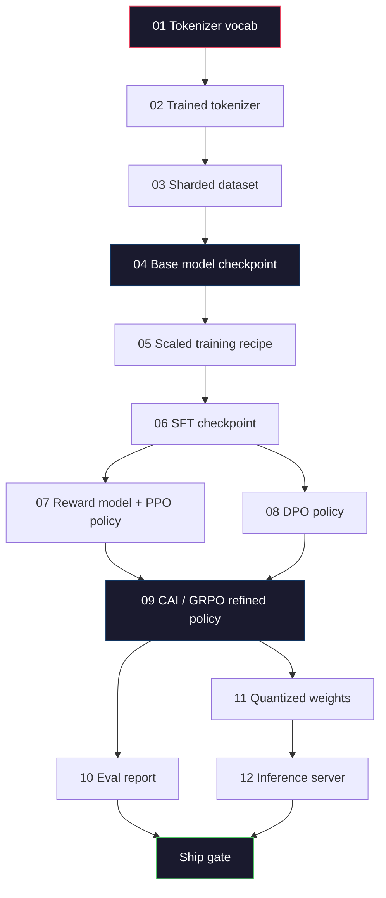
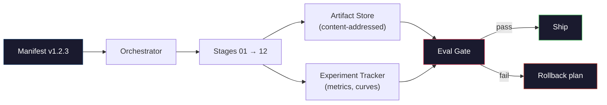

# Построение полного конвейера LLM

> Всё, что было в уроках с 01 по 12, — это один этап одного конвейера. Этот урок — каркас, превращающий эти этапы в единый сквозной прогон: токенизация, предварительное обучение, масштабирование, SFT, согласование, оценивание, квантование, обслуживание. Вы не будете обучать модель на 70B параметров на ноутбуке. Вы создадите слой оркестрации, манифест, шлюз оценивания и план отката — то, чем пользуется передовая команда 2026 года, чтобы решить, что отправить в продакшен. Это итоговый (capstone) урок фазы.

**Тип:** Build
**Языки:** Python (stdlib)
**Предварительные требования:** Все уроки 01-12 фазы 10
**Время:** ~120 минут

## Цели обучения

- Скомпоновать одиннадцать предыдущих уроков (токенизатор, данные, предварительное обучение, масштабирование, SFT, RLHF, DPO, CAI, оценивание, квантование, инференс) в единую воспроизводимую спецификацию конвейера
- Определить контракт артефактов между этапами: что каждый этап потребляет, что производит и как следующий этап проверяет вход
- Построить оркестратор, который отслеживает эксперименты, хеширует артефакты и допускает решение об отправке в продакшен только при прохождении порогов оценивания
- Спроектировать план отката: какие артефакты дёшево пересчитать заново, какие — дорого, и во что обходится повреждённая контрольная точка

## Проблема

Каждый из предыдущих уроков работает сам по себе. Токенизатор обучен. Крошечный GPT предварительно обучен. Набор данных SFT собран. Модель вознаграждения обучена. DPO прогнан. Оценки измерены. Квантованные веса экспортированы. Сервер инференса запущен. Каждый из них — это ноутбук. У каждого свои соглашения, свои пути вывода, свой seed.

Передовой обучающий прогон — это не ноутбук. Llama 3 405B заняла 30 миллионов часов H100 за примерно 54 дня. DeepSeek-V3 использовала около 2.8 миллиона часов H800. За это время одна повреждённая контрольная точка, одно загрязнение данных, одна регрессия в оценках могут стоить команде недели времени по календарю и месяца бюджета GPU. Команды переживают это благодаря гигиене конвейера: у каждого этапа есть детерминированный вход, детерминированный выход, манифест, хеш и шлюз.

Это итоговый урок. Вы не будете прогонять конвейер целиком на ноутбуке. Вы напишете оркестратор, координирующий этапы, манифест, описывающий прогон, верификатор, допускающий решение об отправке, и план воспроизведения, позволяющий третьей стороне пересчитать вашу работу из одного файла. Код небольшой; дисциплина — большая.

Паттерн масштабируется от 100M до 1T параметров без изменений. Одни и те же четыре компонента — манифест, оркестратор, шлюз оценивания, хранилище артефактов — запускают и Llama 3, и вашу любительскую GPT. Разница — в размере чисел внутри конфига каждого этапа, а не в форме конвейера.

## Концепция

### Двенадцать этапов

Каждый урок фазы 10 — это этап. Вот полный граф зависимостей.



Этапы 07 и 08 могут выполняться параллельно. Всё остальное — жёсткая зависимость. Изменение на этапе 02 (токенизатор) делает недействительными все нижестоящие артефакты. Изменение на этапе 10 (оценивание) делает недействительным только решение об отправке.

### Манифест

Манифест — это единый файл, достаточно полно описывающий прогон, чтобы его можно было воспроизвести. Ничто из того, что производит конвейер, не должно зависеть от состояния, отсутствующего в манифесте. Поля скучные и обязательные.

```
pipeline_version: 1.2.3
seed: 42
git_commit: a1b2c3d4
stages:
  01_tokenizer:
    recipe: bpe_32k
    input_hash: sha256:...
    output_hash: sha256:...
    wall_clock_sec: 3600
    cost_usd: 12
```

Выходной хеш этапа N — это входной хеш этапа N+1. Любое отклонение — и конвейер останавливается. Так вы ловите повреждение данных на раннем этапе. Так же коллега на другом континенте проверяет, что его воспроизведение дало тот же артефакт, что и ваше.

На практике команды используют небольшую YAML-схему плюс проверщик манифеста, сверяющий его с предыдущим успешным прогоном. Любое отклонение вне ожидаемых полей (стоимость, время по часам) — тревожный сигнал.

### Типизация артефактов

Выход каждого этапа — типизированный артефакт. Не каталог с произвольными файлами, не pickle, а именованный тип с известной схемой.

| Этап | Тип артефакта | Ключевые поля |
|-------|--------------|-----------|
| 01-02 | Токенизатор | vocab.json, merges.txt, config.json, хеш |
| 03 | Набор данных | shards[], количество строк, количество токенов, статистика дедупликации |
| 04-05 | Контрольная точка | weights.safetensors, config.json, состояние оптимизатора, количество шагов |
| 06 | Модель SFT | контрольная точка + рецепт SFT + смесь данных |
| 07 | Модель вознаграждения | контрольная точка RM + хеш данных о предпочтениях |
| 08-09 | Политика | контрольная точка + хеш эталона + beta + израсходованный бюджет KL |
| 10 | Отчёт об оценивании | результаты бенчмарков + различия регрессий + хеш данных для оценивания |
| 11 | Квантованная модель | квантованные веса + калибровочные данные + изменение точности относительно FP16 |
| 12 | Спецификация сервера | конечная точка + хеш модели + конфигурация + хуки наблюдаемости |

Типизация предотвращает самый частый сбой: использование выхода этапа 08 как входа этапа 06 — отправку модели, обученной через DPO, по пути SFT. Типизированные артефакты и типизированные сигнатуры этапов превращают такие ошибки в сбои на этапе компиляции, а не в проблемы, обнаруженные на пятый день.

### Шлюз оценивания

Отправка в продакшен — это не «обучение завершено». Отправка в продакшен — это «обучение завершено, и шлюз оценивания пройден». Шлюз определяется до начала прогона.

```
gates:
  mmlu:      >= baseline + 0.5   # no regression
  humaneval: >= baseline + 1.0
  truthfulqa: >= baseline         # no drop
  safety_refusal_rate: <= 0.05
  kl_from_reference: <= 25.0
  cost_total_usd: <= 50000
```

Каждый шлюз — числовой порог. Никаких шлюзов «выглядит хорошо». Никаких субъективных согласований. Если все шлюзы пройдены, артефакт помечается как готовый к отправке. Если хотя бы один шлюз не пройден, прогон удерживается в ожидании явного переопределения именованным рецензентом, что само по себе фиксируется в манифесте.

Два шлюза ловят большинство катастроф. Шлюз *регрессии* (новая модель должна быть не хуже предыдущей на основных бенчмарках) ловит ошибки обучения. Шлюз *бюджета KL* (согласованная политика не должна отклониться от эталона дальше X) ловит переусердствование при согласовании. В каждом продакшен-конвейере есть оба.

### Оркестратор

Небольшой кусок кода, который читает манифест, диспетчеризует этапы, отслеживает артефакты и останавливается при любом нарушении контракта. Это не Airflow. Это не Kubeflow. Для гигиены конвейера вам нужно что-то скучное, что вы написали сами.

Задача оркестратора узкая:

1. Разрешить DAG из манифеста.
2. Для каждого этапа проверить, существует ли уже ожидаемый выход с правильным хешем (пропустить, если да).
3. Запустить этап, захватить stdout/stderr, измерить время по часам и стоимость.
4. Проверить выходной хеш относительно ожидаемого входного хеша нижестоящего этапа.
5. При сбое записать частичный манифест с точным указанием сбойного этапа и завершиться с ненулевым кодом.

Это 200 строк на Python. Он будет выглядеть как файл `code/main.py` этого урока. Под капотом реальный конвейер использует `torchrun` или `ray` для выполнения отдельных этапов на кластерах, но сам оркестратор работает на одной машине.

### Отслеживание экспериментов и хранение артефактов

Конвейер опирается на две внешние системы.

**Трекер экспериментов (wandb, neptune, mlflow).** Логирует кривые потерь, метрики оценивания, системную телеметрию по каждому этапу. К трекеру вы обращаетесь, когда нужно сравнить прогон A с прогоном B три недели спустя. Команды почти всегда используют размещённый трекер для этого — написание собственного отнимает время, которое должно уходить на обучение.

**Хранилище артефактов (S3, R2, GCS).** Неизменяемое объектное хранилище для контрольных точек, наборов данных, токенизаторов, отчётов об оценивании. Артефакты адресуются по хешу, а не по имени файла. Имя файла вроде `latest.pt` — это мина замедленного действия; `ckpt-7b-step-20000-sha256:abc123.safetensors` — это контракт.

Оркестратор пишет в оба хранилища. Трекер — для людей, смотрящих на графики. Хранилище артефактов — для следующего этапа, ищущего свои входы.

### Расчёт стоимости

У передового прогона есть цифра в долларах. Бюджетная дисциплина существует в двух местах.

**Оценка до прогона.** Из манифеста вычисляется ожидаемое число FLOPs (для предварительного обучения: 6 x params x tokens), ожидаемые часы GPU (FLOPs / пиковая пропускная способность / утилизация) и стоимость в долларах по текущей ставке аренды. Если оценка превышает бюджетный шлюз, конвейер отказывается стартовать.

**Отслеживание во время прогона.** Время по часам и стоимость каждого этапа логируются в манифест. После каждого этапа проверяется оставшийся бюджет. Если этап превысил план, шлюз следующего этапа оценивается с учётом нового оставшегося бюджета. Вы не узнаёте, что деньги закончились, когда звонит инвестор.

Заявленная стоимость Llama 3 составила $61M. Заявленная стоимость основного прогона предварительного обучения DeepSeek-V3 составила $5.6M. Соотношение объясняется главным образом эффективностью оборудования и архитектурой смеси экспертов (mixture-of-experts), но конкретная стоимость видна именно потому, что обе команды отслеживали её по этапам, а не по прогону целиком.

### Воспроизводимость против детерминированности

Это не одно и то же. *Воспроизводимый* означает, что тот же манифест плюс тот же код плюс та же инфраструктура дают контрольную точку с эквивалентными нижестоящими метриками. *Детерминированный* означает побитово идентичный выход.

Современное обучение LLM воспроизводимо, но не детерминировано. Порядок редукции в распределённом обучении, недетерминированность ядер GPU (cuBLAS, flash-attn) и округление смешанной точности вместе дают числа с плавающей запятой, различающиеся на уровне 1e-5 между прогонами. Это нормально для итоговых метрик, которые не сдвигаются. Это фатально, если вы пытаетесь отлаживаться по побитовым различиям. Лекарство — логировать входной хеш, выходной хеш и заглавные метрики каждого этапа: если они совпадают, прогон «воспроизведён», даже если веса не побитово идентичны.



### План отката

Прежде чем начать прогон, запишите, что произойдёт при сбое каждого этапа. Три категории.

- **Дёшево пересчитать** (часы): токенизатор, оценивание, квантование, сервер инференса. Просто перезапустить.
- **Средне** (дни): SFT, DPO, CAI. Сохранить базовую модель; перезапустить только этапы согласования.
- **Дорого** (недели и миллионы долларов): предварительное обучение. План отката здесь — не «перезапустить». Это «использовать последнюю удачную контрольную точку и перезапустить более дешёвые нижестоящие этапы с пересмотренными данными».

Поскольку зависимости этапов типизированы и хешированы, оркестратор может вычислить набор отката автоматически: сделать недействительным сбойный этап и всех его потомков. Сбой на этапе 06 (SFT) делает недействительными этапы 06, 07, 08, 09, 10, 11, 12. Сбой на этапе 11 (квантование) делает недействительными только 11 и 12. Определив это заранее, вы избегаете импровизации, когда команда вымотана в 4 утра.

### Продакшн-рецепты, наблюдаемые в 2026 году

Большинство передовых команд сошлись на одном и том же скелете.

- Токенизатор: 128k BPE с байтовым фолбэком. Обучен на небольшом сбалансированном многоязычном срезе.
- Предварительное обучение: 10-20T токенов, в основном веб плюс код плюс синтетика. Оптимизатор Muon или AdamW. FSDP2 или DeepSpeed ZeRO-3. Gradient checkpointing. Веса в BF16, мастер-копия в FP32.
- SFT: 500k-2M пар инструкций, смешанных человеческих и синтетических, со строгой дедупликацией против набора для оценивания.
- Согласование: DPO или CAI + GRPO. RLHF — только там, где сигнал предпочтений слишком многомерен для DPO.
- Оценивание: MMLU-Pro, MATH, HumanEval+, GPQA, SWE-Bench Verified, LiveBench, плюс приватный отложенный набор, который публика никогда не видит.
- Квантование: 4-битный GPTQ или AWQ для обслуживания, 8-битный для оценок безопасности, где важны дельты точности.
- Обслуживание: vLLM, TensorRT-LLM или собственная разработка. Непрерывный батчинг. Спекулятивное декодирование. Вытеснение KV-кеша.

Числа меняются каждые полгода. Скелет — нет.

```figure
beam-search
```

## Реализация

Код этого урока — оркестратор и проверщик манифеста, а не двенадцать обучающих скриптов. Каждый этап симулируется заглушкой, производящей выходной артефакт с правильной формой и хешем. Прогон оркестратора целиком доказывает, что сантехника конвейера работает, прежде чем вы сожжёте деньги GPU на реальных этапах.

Полную реализацию см. в `code/main.py`. Ключевые части:

- Датакласс `Manifest`: версия конвейера, seed, git commit, этапы, шлюзы.
- Датакласс `Stage`: имя, тип, входы (хеши), выход (хеш), время по часам, стоимость.
- `Orchestrator.run()`: разрешает DAG, диспетчеризует этапы, проверяет хеши, обновляет манифест.
- `EvalGate.check()`: читает пороги, сравнивает с последним отчётом об оценивании, возвращает pass/fail.
- `ArtifactStore` (заглушка в памяти): put/get по хешу, симулирует S3.
- `CostTracker`: по этапам и накопительно, останавливает работу при превышении лимита.

Конвейер в `main.py` прогоняет двенадцать заглушечных этапов, производит манифест и намеренно задействует шлюз оценивания, который не проходит проверку, чтобы показать, как выглядит удержанный прогон. Замените каждую заглушку на реальный обучающий скрипт из соответствующего урока — и вы получите скелет, которым пользуется реальный передовой конвейер.

## Применение

Канонический рабочий процесс — это три команды.

```
python code/main.py plan    # validate manifest, compute cost estimate, print DAG
python code/main.py run     # execute stages, writing to manifest.out.yaml
python code/main.py gate    # read manifest.out.yaml, apply eval gates, ship-or-hold
```

Каждый раз сначала запускайте `plan`. Большинство ошибок конвейера всплывают на этапе планирования — отсутствующие пороги шлюзов, устаревшие хеши, превышения бюджета. Запуск `plan` бесплатен. Запуск `run` — дорогой. Экономьте деньги, отлавливая ошибки на дешёвой стороне.

Выход `gate` — либо `SHIP`, либо `HOLD: <reason>`. Удержанный прогон — это не сбой; это точка принятия решения. Именованный рецензент либо переопределяет решение (и переопределение логируется), либо одобряет откат.

## Итоговое задание

Этот урок производит `outputs/skill-llm-pipeline-reviewer.md`. Передайте ему предлагаемый манифест конвейера, и он проверит все контракты: типизацию этапов, цепочку хешей, шлюзы, план отката, оценку стоимости. Он отказывается одобрить манифест с отсутствующим шлюзом оценивания, неограниченным бюджетом KL или прогоном, смешивающим данные для оценивания и обучения.

## Упражнения

1. Расширьте оркестратор для поддержки параллельного выполнения этапов 07 и 08. Используйте модуль `concurrent.futures` из stdlib. Убедитесь, что итоговый манифест фиксирует выходы обоих этапов и что входной хеш этапа 09 — детерминированная комбинация обоих.

2. Добавьте шлюз «проверка загрязнения». По хешу набора для оценивания и шардов обучающего набора вычислите пересечение (точное совпадение строк или совпадение 13-грамм). Шлюз не проходит, если пересечение превышает 0.1%. Подайте ему загрязнённый обучающий набор и убедитесь, что шлюз удерживает прогон.

3. Реализуйте оценщик стоимости с нуля. Для этапа 04 (предварительное обучение) оцените FLOPs как 6 x params x tokens, примите MFU (утилизацию FLOPs модели) 40% на H100 при 989 TFLOPs BF16, по $2.50/час-GPU. Приведите оценку для модели 7B, обученной на 2T токенов. Сравните с опубликованными цифрами Llama 2.

4. Постройте частичный откат. Симулируйте сбой на этапе 09 (CAI), затем перезапустите этапы с 09 по 12, оставив 01-08 кешированными. Оркестратор должен обнаружить кешированные артефакты по хешу и пропустить их. Измерьте сэкономленное время по часам по сравнению с полным перезапуском.

5. Добавьте наблюдаемость. Испустите спаны OpenTelemetry для каждого этапа с атрибутами параметров, увиденных токенов, потерь и стоимости. Отправьте спаны в локальный коллектор. Суть не в дашбордах; суть в том, что состояние каждого этапа прослеживается из единого trace ID.

## Ключевые термины

| Термин | Как это называют | Что это на самом деле означает |
|------|----------------|----------------------|
| Манифест | «Файл рецепта» | YAML или JSON, описывающий версию конвейера, seed, конфигурацию каждого этапа и пороги шлюзов — этого достаточно для воспроизведения прогона |
| Адресуемый по содержимому | «По хешу, а не по имени» | Артефакты хранятся по SHA-256 их содержимого, поэтому версию A невозможно перепутать с версией B |
| Шлюз оценивания | «Критерии отправки» | Числовые пороги метрик бенчмарков и показателей безопасности, которые необходимо пройти, прежде чем артефакт будет помечен как готовый к отправке |
| Бюджет KL | «Насколько отклонилось согласование» | Ограничение совокупного KL(policy || reference) на этапах согласования, контролируемое шлюзом |
| MFU | «Сколько ресурсов GPU вы использовали» | Утилизация FLOPs модели — отношение достигнутого числа FLOPs к теоретическому пику. Для масштаба 70B типично 40%, для 7B — 55% |
| План отката | «Что мы делаем, когда всё ломается» | Заранее составленный набор действий на случай сбоя каждого этапа: перезапустить, вернуться к резервному варианту, переобучить с пересмотренными входами |
| Оркестратор | «Дирижёр» | Процесс, который читает манифест, диспетчеризует этапы, проверяет хеши и останавливается при любом нарушении контракта |
| Хранилище артефактов | «Версионируемый S3 для весов» | Неизменяемое объектное хранилище с адресацией по содержимому — единый источник истины для контрольных точек, наборов данных и отчётов об оценивании |
| Воспроизводимый | «Те же метрики при повторном прогоне» | Различающиеся на битовом уровне веса при эквивалентных нижестоящих метриках — реалистичная цель для распределённого обучения LLM |
| Шлюз стоимости | «Нельзя превысить X» | Оценка стоимости до прогона плюс отслеживание во время прогона — конвейер не запускается, если оценка превышает бюджет |

## Дополнительные материалы

- [Dubey et al., 2024 -- "The Llama 3 Herd of Models"](https://arxiv.org/abs/2407.21783) -- наиболее подробное публичное описание передового конвейера, включая данные, обучение, согласование, оценивание
- [DeepSeek-AI, 2024 -- "DeepSeek-V3 Technical Report"](https://arxiv.org/abs/2412.19437) -- ориентированный на эффективность конвейер примерно за 1/10 стоимости обучения класса Llama 3
- [Kaplan et al., 2020 -- "Scaling Laws for Neural Language Models"](https://arxiv.org/abs/2001.08361) -- исходное соотношение масштабирования compute-data-params
- [Hoffmann et al., 2022 -- "Training Compute-Optimal Large Language Models (Chinchilla)"](https://arxiv.org/abs/2203.15556) -- поправка к Kaplan, пересчитавшая современные бюджеты данных
- [PyTorch FSDP2 documentation](https://pytorch.org/docs/stable/fsdp.html) -- примитив распределённого обучения, заменяющий FSDP1 в PyTorch 2.4+
- [Weights & Biases LLM Reports](https://wandb.ai/site/llms) -- реальные манифесты и вывод трекера экспериментов для открытых прогонов LLM, полезные как шаблоны для заимствования
