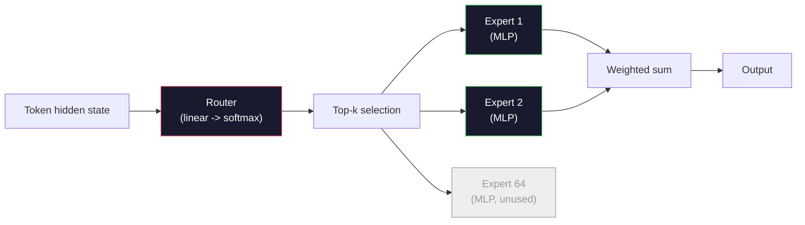

# Открытые модели: разбор архитектур

> В уроке 04 вы построили GPT-2 Small с нуля. Передовые открытые модели 2026 года — это то же семейство с пятью-шестью конкретными изменениями. RMSNorm вместо LayerNorm. SwiGLU вместо GELU. RoPE вместо обученных позиций. GQA или MLA вместо полного MHA. Смесь экспертов в большом масштабе. Математика, которую вы уже знаете, покрывает 95% из них. Этот урок разбирает Llama 3, DeepSeek-V3, Mixtral, Qwen и Gemma бок о бок и указывает точное место, в котором каждая архитектура расходится с базовой.

**Тип:** Learn
**Языки:** Python (stdlib)
**Предварительные требования:** Фаза 10, уроки 04, 05, 12 (предварительное обучение, масштабирование, инференс)
**Время:** ~45 минут

## Цели обучения

- Прочитать config.json Llama 3, Mistral, Mixtral, Gemma 2, Qwen 2.5 и DeepSeek-V3 и объяснить каждое поле
- Назвать конкретное архитектурное изменение, которое каждая модель внесла по сравнению с GPT-2 Small, и обосновать его из первых принципов
- Вычислить количество параметров, размер KV-кеша и объём памяти под активации для любой открытой модели только по её конфигу
- Выбрать подходящую открытую модель для целевого развёртывания с учётом ограничений по задержке, памяти и возможностям

## Проблема

В уроке 04 вы написали 350 строк на numpy и получили модель в форме GPT-2. У Llama 3 405B технический отчёт на 200 страниц. Инстинкт подсказывает, что это разные звери. Это не так. 200 страниц описывают тот же объект с пятью-шестью хорошо обоснованными модификациями плюс тысячей деталей реализации, касающихся масштабирования. Скелет — эмбеддинг, блоки трансформера, внимание, MLP, норма, голова — не изменился.

Этот урок — это диф. Для каждого крупного семейства открытых моделей мы перечисляем, что именно изменилось по сравнению с GPT-2, почему и какой ценой. Когда вы закончите, вы сможете прочитать свежую карточку модели и мысленно перевести её обратно к базовой линии GPT-2.

Практическая польза в том, что когда Meta выпустит Llama 5 или DeepSeek выпустит V4, вам не понадобится новая ментальная модель. Вы посмотрите на конфиг, увидите, какие из известных ручек сдвинулись, и будете знать, каковы последствия для развёртывания. Архитектуры 2026 года — это конечный набор инструментов. Каждая новая модель выбирает свой поднабор.

## Концепция

### Неизменное ядро

Все авторегрессионные открытые модели разделяют:

- Матрицу эмбеддингов токенов (vocab_size x hidden_dim).
- Стек из N блоков декодера: нормализация, самовнимание, остаточная связь, нормализация, MLP, остаточная связь.
- Финальную норму и линейную голову, проецирующую в vocab_size (часто использующую общие веса с эмбеддингами).
- Каузальную маску и функцию потерь на основе перекрёстной энтропии следующего токена.

Это и есть форма. Остальное — ручки настройки.

### Шесть ручек, которые реально двигаются

Во всех передовых открытых моделях 2024–2026 годов раз за разом выбирают одни и те же шесть архитектурных решений:

1. **Нормализация.** LayerNorm -> RMSNorm.
2. **Позиционное кодирование.** Обученное абсолютное -> RoPE (плюс варианты: YaRN, NTK).
3. **Активация.** GELU -> SwiGLU (или GeGLU).
4. **Совместное использование голов внимания.** MHA -> GQA -> MQA -> MLA.
5. **Плотный или разреженный MLP.** Плотный -> смесь экспертов.
6. **Расположение нормализации.** Предварительная нормализация (pre-norm) остаётся. Пост-нормализация (post-norm) исчезла.

Всё остальное (расписание скорости обучения, состав данных, размер батча, длина контекста) находится в конфиге обучения, а не в архитектуре. Шесть ручек.

### Ручка 1: RMSNorm

LayerNorm вычитает среднее, делит на стандартное отклонение, масштабирует и сдвигает. RMSNorm оставляет только масштабирование:

```
RMSNorm(x) = x / sqrt(mean(x^2) + eps) * gamma
```

Без вычитания среднего. Без смещения. На одно матричное умножение меньше на токен. Zhang и Sennrich (2019) показали, что он не уступает LayerNorm на машинном переводе, будучи при этом на 10% быстрее. Каждая современная открытая модель использует его.

Цена: никакой. Выгода: небольшой прирост пропускной способности, более простой код.

### Ручка 2: RoPE

Обученные позиционные эмбеддинги в GPT-2 были таблицей поиска на 1024 слота. Контекст 1025 выходит за пределы таблицы. Модели не могут экстраполировать за пределы длины обучения.

Вращательное позиционное кодирование (Rotary Position Embedding, RoPE; Su et al. 2021) кодирует позицию, попарно поворачивая компоненты каждого вектора Q и K перед скалярным произведением в механизме внимания. Угол поворота — детерминированная функция позиции: конечной обучаемой таблицы позиций здесь нет, а значит, она не может закончиться. Приёмы масштабирования (интерполяция с учётом NTK, YaRN) позволяют модели, обученной на контексте 8k, работать на контексте до 128k во время инференса с умеренной потерей точности.

```
q_rotated = rotate(q, angle(pos))
k_rotated = rotate(k, angle(pos))
score = q_rotated . k_rotated
```

Все модели Llama, Mistral, Qwen, DeepSeek и Gemma используют RoPE. В Gemma 2 применяется гибридный подход: RoPE на большинстве слоёв и локальное внимание со скользящим окном на остальных.

### Ручка 3: SwiGLU

MLP GPT-2 выглядит так: `x -> gelu(xW1 + b1) -> (...)W2 + b2`. SwiGLU (Shazeer 2020) заменяет активацию на управляемое произведение:

```
SwiGLU(x) = (xW1) * sigmoid(xW1) * xV
```

Две параллельные проекции вместо одной, управляемые функцией активации Swish. Эмпирически это даёт лучшую перплексию при том же количестве параметров. В Llama 2 перешли на SwiGLU, а за ней и все остальные. Скрытый размер MLP обычно подбирают так, чтобы общее количество параметров совпадало с исходным плотным MLP: если в GPT-2 использовалось `ff_dim = 4 * hidden`, то в SwiGLU используется `ff_dim = (2/3) * 4 * hidden = 8/3 * hidden`.

### Ручка 4: Совместное использование голов внимания

В GPT-2 использовалось **многоголовое внимание (Multi-Head Attention, MHA)**: у каждой головы своя проекция Q, K, V.

**Многозапросное внимание (Multi-Query Attention, MQA; Shazeer 2019)** использует один K и один V совместно для всех голов. Оно сокращает KV-кеш в num_heads раз, что для типичной модели даёт уменьшение в 12–32 раза. На сложных бенчмарках точность немного падает.

**Внимание с группировкой запросов (Grouped-Query Attention, GQA; Ainslie et al. 2023)** — это золотая середина: G групп Q-голов совместно используют один K и один V. Llama 3 8B использует GQA с 32 Q-головами и 8 KV-головами (G=8), поэтому KV-кеш сокращается в 4 раза по сравнению с полным MHA.

**Многоголовое латентное внимание (Multi-Head Latent Attention, MLA; DeepSeek 2024)** сжимает K и V в общее низкоранговое латентное представление, проецируя их обратно для каждой головы. Это дополнительно сокращает KV-кеш, сохраняя выразительность отдельных голов. DeepSeek-V2 и V3 используют MLA для эффективной работы с длинным контекстом.

| Схема | KV-головы | KV-кеш | Точность |
|--------|----------|----------|----------|
| MHA    | num_heads | полный | наилучшая |
| GQA    | num_groups (G < num_heads) | сокращение в num_heads / G раз | близка к MHA |
| MQA    | 1 | сокращение в num_heads раз | небольшое снижение |
| MLA    | латентное представление, декомпрессия для каждой головы | меньше, чем у MQA | близка к MHA |

Для любой модели свыше ~13B параметров GQA или MLA фактически обязательны. Полный MHA в большом масштабе — это катастрофа для KV-кеша.

### Ручка 5: смесь экспертов

Плотный MLP активирует все свои параметры для каждого токена. MLP со смесью экспертов (MoE) содержит K экспертов в каждом блоке и маршрутизатор, который выбирает для каждого токена top-k экспертов (обычно top-2). Только веса выбранных экспертов участвуют в прямом проходе для этого токена.

```
router_logits = xW_r
indices, weights = top_k(router_logits, k=2)
output = sum_i weights[i] * expert[indices[i]](x)
```

Привлекательность в том, что можно иметь 64 эксперта размером по 7B каждый (так что общее количество параметров огромно), запуская при этом только 2 из них на токен (так что вычисления на токен соответствуют плотной модели на 7B). Mixtral 8x7B имеет 47B параметров всего, но активирует только 13B на токен. DeepSeek-V3 имеет 671B параметров всего, но активирует только 37B на токен.



Плюсы: те же вычисления, больше параметров, выше ёмкость. Минусы: веса экспертов всё равно должны где-то храниться (поэтому для обслуживания моделей нужно больше VRAM, чем для эквивалентной плотной модели), балансировать нагрузку маршрутизатора сложно, а его дообучение в процессе согласования — отдельная область исследований.

### Ручка 6: предварительная нормализация остаётся

Оригинальный трансформер применял нормализацию слоя после каждого подслоя. Каждая открытая модель со времён GPT-2 ставит её *перед* каждым подслоем. Архитектуры с предварительной нормализацией однозначно легче обучать на большой глубине. Тут не о чем спорить.

### Диф по моделям

Вот таблица, которая делает всё это конкретным.

| Модель | Год | Всего параметров | Активных параметров | Нормализация | Активация | Позиция | Внимание | MoE | Контекст |
|-------|------|-------------|---------------|------|-----------|----------|-----------|-----|---------|
| GPT-2 Small | 2019 | 124M | 124M | LayerNorm | GELU | обучаемая | MHA (12 голов) | нет | 1k |
| Llama 3 8B | 2024 | 8B | 8B | RMSNorm | SwiGLU | RoPE | GQA (32/8) | нет | 128k |
| Llama 3 70B | 2024 | 70B | 70B | RMSNorm | SwiGLU | RoPE | GQA (64/8) | нет | 128k |
| Llama 3 405B | 2024 | 405B | 405B | RMSNorm | SwiGLU | RoPE | GQA (128/16) | нет | 128k |
| Mistral 7B | 2023 | 7.2B | 7.2B | RMSNorm | SwiGLU | RoPE | GQA | нет | 32k |
| Mixtral 8x7B | 2023 | 47B | 13B | RMSNorm | SwiGLU | RoPE | GQA | да (8 экспертов, top-2) | 32k |
| Gemma 2 9B | 2024 | 9B | 9B | RMSNorm (до и после) | GeGLU | RoPE + скользящее окно | GQA | нет | 8k |
| Qwen 2.5 72B | 2024 | 72B | 72B | RMSNorm | SwiGLU | RoPE (YaRN) | GQA (64/8) | нет | 128k |
| DeepSeek V2 236B | 2024 | 236B | 21B | RMSNorm | SwiGLU | RoPE | MLA | да (160 экспертов, top-6) | 128k |
| DeepSeek V3 | 2024 | 671B | 37B | RMSNorm | SwiGLU | RoPE | MLA | да (256 экспертов, top-8) | 128k |

Пройдитесь по колонкам. RMSNorm универсален. SwiGLU или его родственник GeGLU универсален. RoPE универсален. GQA универсален выше 7B, кроме случаев замены на MLA. MoE — дифференциатор на верхнем уровне.

### Чтение config.json

Конфиг Llama 3 8B:

```
{
  "hidden_size": 4096,
  "intermediate_size": 14336,
  "num_hidden_layers": 32,
  "num_attention_heads": 32,
  "num_key_value_heads": 8,
  "max_position_embeddings": 131072,
  "rope_theta": 500000.0,
  "rms_norm_eps": 1e-5,
  "vocab_size": 128256
}
```

Каждое поле соответствует чему-то, что вы уже реализовали.

- `hidden_size`: размерность эмбеддинга.
- `intermediate_size`: скрытый размер MLP (3.5x hidden — математика SwiGLU).
- `num_hidden_layers`: глубина стека.
- `num_attention_heads`: Q-головы.
- `num_key_value_heads`: KV-головы (GQA).
- `max_position_embeddings`: длина контекста обучения.
- `rope_theta`: базовая частота RoPE. Meta увеличила её со стандартных 10k до 500k для экстраполяции на длинный контекст.
- `rms_norm_eps`: численная стабильность.
- `vocab_size`: количество токенов.

Только по этим данным вы вычисляете общее количество параметров, KV-кеш и пиковую память под активации. Точные формулы см. в `code/main.py`.

### Бюджет памяти под активации

При обучении моделей с несколькими миллиардами параметров основная часть памяти уходит на активации. Эмпирическое правило для предварительного обучения (с контрольными точками активаций):

```
activation_mem ~ batch_size * seq_len * hidden_size * num_layers * bytes_per_element
```

Для Llama 3 8B при размере пакета 1, длине последовательности 8192, формате BF16, 32 слоях и скрытой размерности 4096 требуется примерно 8 ГБ только под активации с контрольными точками и 40 ГБ без них. Именно поэтому важны flash-attention и ring-attention: они меняют вычисление внимания так, чтобы активации помещались в память.

### Бюджет KV-кеша

Для инференса на максимальном контексте:

```
kv_cache = 2 * num_layers * num_kv_heads * head_dim * max_seq_len * bytes_per_element
```

Llama 3 8B при контексте 128k, BF16, head_dim = hidden / num_heads = 128:
`2 * 32 * 8 * 128 * 131072 * 2 = 17.2 GB` на последовательность.

Веса 8B занимают 16 ГБ в BF16. KV-кеш для одной последовательности на 128k больше, чем сами веса. Именно это давление памяти движет исследованиями GQA, MLA и квантования KV-кеша.

### Когда какая модель побеждает

- **Один GPU 80 ГБ, без MoE**: Llama 3 8B, Mistral 7B, Gemma 2 9B. Легко обслуживать, широкая экосистема инструментов.
- **Один узел (8x80 ГБ), большая ёмкость**: Llama 3 70B, Qwen 2.5 72B. Наибольшие возможности среди открытых плотных моделей.
- **Максимальные возможности среди открытых моделей при допустимой сложности MoE**: DeepSeek V3, Mixtral 8x22B. Лучшее качество на активный FLOP.
- **Потребности в длинном контексте**: Llama 3 (128k с масштабированием RoPE), DeepSeek (преимущество MLA).
- **Обслуживание с низкой задержкой**: Gemma 2 9B (скользящее окно сокращает вычисления на длинном контексте).

```figure
rmsnorm-vs-layernorm
```

## Реализация

Код урока — это калькулятор. По любому config.json он выводит количество параметров по компонентам, размер KV-кеша на максимальном контексте, коэффициент MLP SwiGLU и краткий вердикт по архитектуре (плотная / GQA / MLA / MoE).

```python
config = {
    "hidden_size": 4096, "intermediate_size": 14336,
    "num_hidden_layers": 32, "num_attention_heads": 32,
    "num_key_value_heads": 8, "vocab_size": 128256,
    "max_position_embeddings": 131072,
}
```

Скрипт проходит по архитектуре поле за полем, вычисляет количество параметров для эмбеддинга, механизма внимания (с учётом сокращения GQA), MLP (с учётом расширения SwiGLU), слоёв LayerNorm и головы. Затем он вычисляет KV-кеш на заданной длине контекста и выводит сводку.

Реализацию см. в `code/main.py`.

## Применение

Запустите калькулятор на конфигах Llama 3 8B, Mistral 7B, Mixtral 8x7B и DeepSeek V3, встроенных в скрипт. Сравните разбивку параметров. Обратите внимание, что у моделей MoE общее количество параметров значительно превышает плотные модели, но активное количество параметров зачастую меньше. Обратите внимание, что KV-кеш DeepSeek V3 меньше, чем у Llama 3 405B, несмотря на большее общее количество параметров — это MLA в действии.

Затем подставьте конфиг любой модели, которая есть у вас локально, прочитайте сводку и решите, помещается ли она на ваш GPU.

## Итоговое задание

Этот урок производит `outputs/skill-open-model-picker.md`. Учитывая целевое развёртывание (тип GPU, VRAM, длина контекста, бюджет задержки) и профиль задачи (чат, код, рассуждение, длинный контекст), он рекомендует открытую модель, схему квантования из урока 11 и стек инференса из урока 12, с явным обоснованием по шести архитектурным ручкам.

## Упражнения

1. Прочитайте конфиг Qwen 2.5 72B с HuggingFace. Вычислите общее количество параметров с нуля. Сравните с заявленным значением HF и определите, откуда берётся любая разница (округление размерности головы, коэффициент совместного использования KV и т. д.).

2. DeepSeek V3 использует 256 экспертов с маршрутизацией top-8. Вычислите отношение активированных экспертов к общему числу экспертов и сравните с top-2 из 8 у Mixtral 8x7B. Что смещение от разреженного (25%) к более плотному разреженному (3%) говорит о ёмкости на FLOP?

3. Вычислите KV-кеш для Llama 3 405B при контексте 128k в FP8 и BF16. В FP8 значение вдвое меньше, чем в BF16. Сколько параллельных последовательностей можно обслужить на одном узле 8xH100 (по 80 ГБ каждый = 640 ГБ всего, минус память под веса)?

4. Gemma 2 чередует слои полного внимания и внимания со скользящим окном. Выведите формулу для KV-кеша, если половина слоёв использует скользящее окно на 4096 токенов вместо полного контекста. Сколько памяти это экономит при общем контексте 8k?

5. Найдите недавнюю передовую открытую модель, вышедшую после написания этого урока. Определите, какую из шести ручек она выбрала и не ввела ли она седьмую ручку. Учебная программа устареет в тот момент, когда выйдет новая архитектура — цель в том, чтобы обновить свою таблицу, не перестраивая ментальную модель.

## Ключевые термины

| Термин | Как обычно говорят | Что это означает на самом деле |
|------|----------------|----------------------|
| RMSNorm | «LayerNorm без среднего» | Нормализация только по среднеквадратичному значению с обучаемым масштабом — дешевле LayerNorm и сопоставима с ней по качеству |
| RoPE | «Вращательные позиции» | Попарный поворот компонент каждого вектора Q и K в двумерных плоскостях на зависящий от позиции угол; конечной обучаемой таблицы позиций нет, а масштабирование позволяет работать за пределами длины контекста обучения |
| SwiGLU | «Новая функция активации MLP» | Управляемый линейный блок с функцией Swish: `(xW1) * sigmoid(xW1) * xV` — стандарт для каждой открытой модели с 2024 года |
| GQA | «Промежуточный вариант внимания» | При внимании с группировкой запросов G групп Q-голов совместно используют по одной K- и V-голове — это сокращает KV-кеш без снижения точности, характерного для MQA |
| MLA | «Механизм внимания DeepSeek» | При многоголовом латентном внимании K/V сжимаются в общее низкоранговое латентное представление и восстанавливаются для каждой головы — это даёт самый компактный KV-кеш для крупных моделей |
| MoE | «Разреженные эксперты» | Смесь экспертов: N модулей MLP в каждом блоке, из которых маршрутизатор выбирает top-k для каждого токена, — огромное общее и небольшое активное количество параметров |
| Маршрутизация top-k | «Выбрать k экспертов для каждого токена» | Маршрутизатор вычисляет оценку каждого эксперта и активирует k экспертов с наивысшими оценками; типичное значение k — от 2 (Mixtral) до 8 (DeepSeek) |
| YaRN | «Растянуть RoPE» | Ещё одно расширение RoPE: оно интерполирует углы поворота, чтобы во время инференса увеличить контекст с 8k до 128k и более |
| Внимание со скользящим окном | «Не учитывать всё» | Каждый токен обращает внимание только на последние W токенов, что ограничивает стоимость внимания величиной O(W) на токен; применяется в Gemma 2 и ранних версиях Mistral |
| Активные параметры | «То, что работает для каждого токена» | В моделях MoE это параметры, участвующие в прямом проходе для каждого токена; их намного меньше общего числа параметров, и именно они определяют количество FLOP на токен |

## Дополнительные материалы

- [Dubey et al., 2024 -- "The Llama 3 Herd of Models"](https://arxiv.org/abs/2407.21783) -- источник по архитектуре и обучению плотного семейства Llama 3
- [DeepSeek-AI, 2024 -- "DeepSeek-V3 Technical Report"](https://arxiv.org/abs/2412.19437) -- MLA плюс балансировка нагрузки без вспомогательных потерь плюс MoE на 671B
- [Jiang et al., 2024 -- "Mixtral of Experts"](https://arxiv.org/abs/2401.04088) -- каноническая статья про открытую модель MoE
- [Su et al., 2021 -- "RoFormer: Enhanced Transformer with Rotary Position Embedding"](https://arxiv.org/abs/2104.09864) -- статья про RoPE
- [Shazeer, 2020 -- "GLU Variants Improve Transformer"](https://arxiv.org/abs/2002.05202) -- SwiGLU, GeGLU и их родственники
- [Ainslie et al., 2023 -- "GQA: Training Generalized Multi-Query Transformer Models"](https://arxiv.org/abs/2305.13245) -- статья про GQA
- [Gemma 2 Team, 2024 -- "Gemma 2: Improving Open Language Models at a Practical Size"](https://arxiv.org/abs/2408.00118) -- гибрид полного внимания и внимания со скользящим окном, нормализация до и после подслоя
- [Qwen Team, 2024 -- "Qwen 2.5 Technical Report"](https://arxiv.org/abs/2412.15115) -- расширение контекста YaRN и рецепты обучения на длинном контексте
