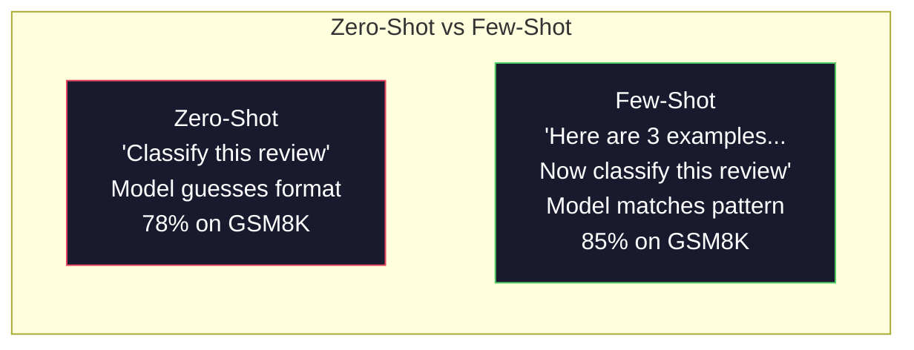
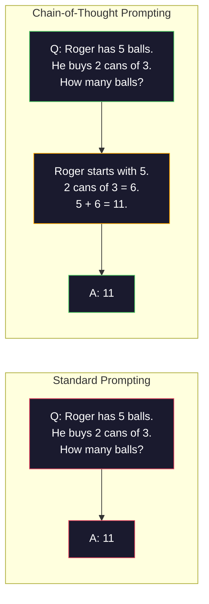
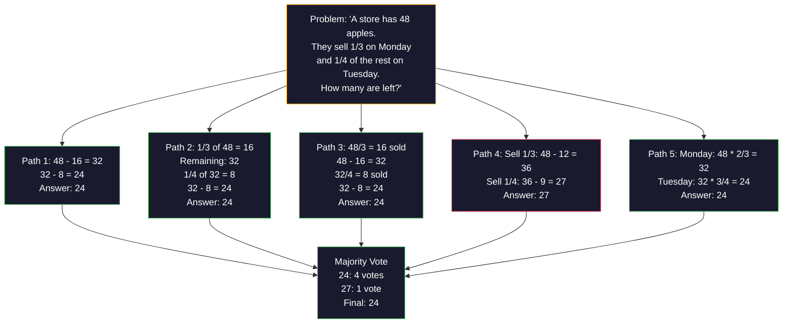
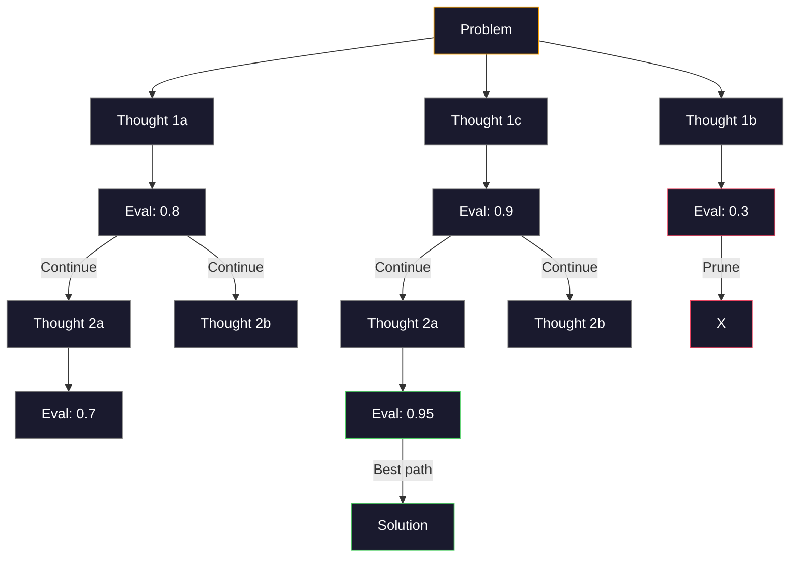

# С несколькими примерами (few-shot), цепочка рассуждений (Chain-of-Thought) и дерево мыслей (Tree-of-Thought)

> Сказать модели, что делать, — это промптинг. Показать ей, как думать, — это инженерия. Разрыв между 78% и 91% точности на одной и той же модели, на той же задаче, на тех же данных — это не более совершенная модель. Это более совершенная стратегия рассуждений.

**Тип:** Build**Языки:** Python**Предварительные требования:** Урок 11.01 (Prompt Engineering)**Время:** ~45 минут
## Цели обучения

- Реализовать промптинг с несколькими примерами (few-shot), выбирая и форматируя демонстрационные примеры, которые максимизируют точность выполнения задачи
- Применить рассуждение по цепочке рассуждений (CoT) для повышения точности на многошаговых задачах, таких как математические текстовые задачи
- Построить промпт с деревом мыслей, который исследует несколько путей рассуждения и выбирает лучший из них
- Измерить прирост точности при переходе от zero-shot к few-shot и CoT на стандартном бенчмарке

## Проблема

Вы разрабатываете приложение для репетиторства по математике. Ваш промпт гласит: «Реши эту текстовую задачу». GPT-5 решает её правильно в 94% случаев на GSM8K, стандартном бенчмарке задач для начальной школы. Вам кажется, что вы уже достигли потолка. Это не так — цепочка рассуждений всё ещё добавляет 3-4 пункта.

Добавьте пять слов -- «Давай подумаем шаг за шагом» -- и точность подскакивает до 91%. Добавьте несколько разобранных примеров, и она достигает 95%. Та же модель. Та же температура. Та же стоимость API. Единственное отличие — вы дали модели черновик.

Это не хак. Так работает рассуждение. Люди не решают многошаговые задачи одним мысленным скачком. Трансформеры тоже. Когда вы заставляете модель генерировать промежуточные токены, эти токены становятся частью контекста для следующего токена. Каждый шаг рассуждения питает следующий. Модель буквально вычисляет свой путь к ответу.

Но «думай шаг за шагом» — это начало, а не конец. Что если сэмплировать пять путей рассуждения и взять решение большинством голосов? Что если позволить модели исследовать дерево возможностей, оценивая и отсекая ветви? Что если чередовать рассуждение с использованием инструментов? Это не гипотезы. Это опубликованные техники с измеренными улучшениями, и в этом уроке вы построите их все.

## Концепция

### Zero-shot и few-shot: когда примеры побеждают инструкции

Промптинг без примеров (zero-shot) даёт модели задачу и ничего больше. Промптинг с несколькими примерами (few-shot) сначала даёт ей примеры.

Wei et al. (2022) измерили это на 8 бенчмарках. Для простых задач вроде классификации тональности zero-shot и few-shot показали результаты в пределах 2% друг от друга. Для сложных задач вроде многошаговой арифметики и символьного рассуждения few-shot повышал точность на 10-25%.

Интуиция такова: примеры — это сжатые инструкции. Вместо того чтобы описывать формат вывода, вы его показываете. Вместо того чтобы объяснять процесс рассуждения, вы его демонстрируете. Модель сопоставляет паттерны по примерам надёжнее, чем интерпретирует абстрактные инструкции.



**Когда побеждает few-shot:** чувствительные к формату задачи, классификация, структурированное извлечение, специфичный для домена жаргон, любая задача, где модели нужно подстроиться под конкретный паттерн.

**Когда побеждает zero-shot:** простые фактические вопросы, творческие задачи, где примеры ограничивают креативность, задачи, где найти хорошие примеры сложнее, чем написать хорошие инструкции.

### Выбор примеров: похожие побеждают случайные

Не все примеры равноценны. Выбор примеров, похожих на целевой ввод, превосходит случайный выбор на 5-15% на задачах классификации (Liu et al., 2022). Три принципа:

1. **Семантическое сходство**: выбирайте примеры, наиболее близкие к вводу в пространстве эмбеддингов
2. **Разнообразие меток**: покрывайте все категории вывода в своих примерах
3. **Соответствие сложности**: подбирайте уровень сложности, соответствующий целевой задаче

Оптимальное число примеров для большинства задач — 3-5. Меньше 3 — модели не хватает сигнала, чтобы извлечь паттерн. Больше 5 — вы попадаете в зону убывающей отдачи и тратите впустую токены контекстного окна. Для классификации с большим числом меток используйте по одному примеру на метку.

### Цепочка рассуждений: даём модели черновик

Промптинг по цепочке рассуждений (Chain-of-Thought, CoT) был предложен Wei et al. (2022) в Google Brain. Идея проста: вместо того чтобы просить у модели только ответ, попросите её сначала показать шаги рассуждения.



Почему это работает механически? Каждый токен, который генерирует трансформер, становится контекстом для следующего токена. Без CoT модели приходится сжимать всё рассуждение в скрытое состояние одного прямого прохода. С CoT модель выносит промежуточные вычисления наружу в виде токенов. Каждый токен рассуждения увеличивает эффективную глубину вычисления.

**Бенчмарки GSM8K (математика для начальной школы, 8,5 тыс. задач):**

| Model | Zero-Shot | Zero-Shot CoT | Few-Shot CoT |
|-------|-----------|---------------|--------------|
| GPT-4o | 78% | 91% | 95% |
| GPT-5 | 94% | 97% | 98% |
| o4-mini (reasoning) | 97% | — | — |
| Claude Opus 4.7 | 93% | 97% | 98% |
| Gemini 3 Pro | 92% | 96% | 98% |
| Llama 4 70B | 80% | 89% | 94% |
| DeepSeek-V3.1 | 89% | 94% | 96% |

**Заметка о рассуждающих моделях.** Модели вроде o-серии OpenAI (o3, o4-mini) и DeepSeek-R1 прогоняют цепочку рассуждений внутренне, прежде чем выдать ответ. Добавление «Давай подумаем шаг за шагом» к рассуждающей модели избыточно, а иногда и контрпродуктивно — они уже это сделали.

Две разновидности CoT:

**Zero-shot CoT**: добавьте в промпт «Давай подумаем шаг за шагом». Примеры не нужны. Kojima et al. (2022) показали, что одно это предложение повышает точность на задачах арифметики, здравого смысла и символьного рассуждения.

**Few-shot CoT**: предоставьте примеры, включающие шаги рассуждения. Эффективнее, чем zero-shot CoT, потому что модель видит именно тот формат рассуждения, который вы ожидаете.

**Когда CoT вредит**: простое фактическое припоминание («Какая столица Франции?»), одношаговая классификация, задачи, где скорость важнее точности. CoT добавляет 50-200 токенов накладных расходов на рассуждение на каждый запрос. Для высокопроизводительных задач низкой сложности это напрасные затраты.

### Самосогласованность: сэмплируем много, голосуем один раз

Wang et al. (2023) предложили самосогласованность (self-consistency). Идея в следующем: один путь CoT может содержать ошибки рассуждения. Но если сэмплировать N независимых путей рассуждения (с температурой > 0) и взять решение большинством голосов по итоговому ответу, ошибки взаимно гасятся.



Самосогласованность подняла точность на GSM8K с 56,5% (одиночный CoT) до 74,4% при N=40 в изначальных экспериментах на PaLM 540B. На GPT-5 улучшение небольшое (с 97% до 98%), потому что базовая точность уже насыщена. Техника проявляет себя лучше всего на моделях с базовой точностью CoT 60-85% -- в той точке, где ошибки одиночного пути часты, но не систематичны. Для рассуждающих моделей (o-серия, R1) самосогласованность поглощается встроенным внутренним сэмплированием.

Компромисс: N сэмплов означают N-кратную стоимость и задержку API. На практике N=5 захватывает большую часть выгоды. N=3 — минимум для осмысленного голосования. N > 10 даёт убывающую отдачу для большинства задач.

### Дерево мыслей: ветвящееся исследование

Yao et al. (2023) предложили дерево мыслей (Tree-of-Thought, ToT). Там, где CoT следует одному линейному пути рассуждения, ToT исследует несколько ветвей и оценивает, какие из них наиболее перспективны, прежде чем продолжить.



У ToT три компонента:

1. **Генерация мыслей**: производит несколько кандидатов следующего шага
2. **Оценка состояния**: оценивает каждого кандидата (в качестве оценщика можно использовать саму LLM)
3. **Алгоритм поиска**: BFS или DFS по дереву, отсекающий ветви с низкой оценкой

На задаче Game of 24 (скомбинировать 4 числа арифметическими операциями, чтобы получить 24) GPT-4 со стандартным промптингом решает 7,3% задач. С CoT — 4,0% (CoT здесь на самом деле вредит, потому что пространство поиска широкое). С ToT — 74%.

ToT дорог. Каждый узел дерева требует вызова LLM. Дерево с коэффициентом ветвления 3 и глубиной 3 требует до 39 вызовов LLM. Используйте его только для задач, где пространство поиска велико, но поддаётся оценке -- планирование, решение головоломок, творческое решение задач с ограничениями.

### ReAct: рассуждение + действие

Yao et al. (2022) объединили следы рассуждения с действиями. Модель чередует размышление (генерацию рассуждения) и действие (вызов инструментов, поиск, вычисление).

```mermaid
graph LR
    Q["Question:\nWhat is the\npopulation of the\ncountry where\nthe Eiffel Tower\nis located?"]
    T1["Thought: I need to\nfind which country\nhas the Eiffel Tower"]
    A1["Action: search\n'Eiffel Tower location'"]
    O1["Observation:\nParis, France"]
    T2["Thought: Now I need\nFrance's population"]
    A2["Action: search\n'France population 2024'"]
    O2["Observation:\n68.4 million"]
    T3["Thought: I have\nthe answer"]
    F["Answer:\n68.4 million"]

    Q --> T1 --> A1 --> O1 --> T2 --> A2 --> O2 --> T3 --> F

    style Q fill:#1a1a2e,stroke:#ffa500,color:#fff
    style T1 fill:#1a1a2e,stroke:#51cf66,color:#fff
    style A1 fill:#1a1a2e,stroke:#e94560,color:#fff
    style O1 fill:#1a1a2e,stroke:#808080,color:#fff
    style T2 fill:#1a1a2e,stroke:#51cf66,color:#fff
    style A2 fill:#1a1a2e,stroke:#e94560,color:#fff
    style O2 fill:#1a1a2e,stroke:#808080,color:#fff
    style T3 fill:#1a1a2e,stroke:#51cf66,color:#fff
    style F fill:#1a1a2e,stroke:#51cf66,color:#fff
```



ReAct превосходит чистый CoT на задачах, интенсивно требующих знаний, потому что может опираться в рассуждении на реальные данные. На HotpotQA (многошаговые вопросы, требующие нескольких переходов) ReAct с GPT-4 достигает точного совпадения 35,1% против 29,4% для одного лишь CoT. Настоящая сила в том, что ошибки рассуждения исправляются наблюдениями -- модель может обновить план в процессе выполнения.

ReAct — основа современных ИИ-агентов. Каждый фреймворк для агентов (LangChain, CrewAI, AutoGen) реализует тот или иной вариант цикла Thought-Action-Observation (мысль-действие-наблюдение). Полноценных агентов вы построите в Фазе 14. Этот урок охватывает паттерн промптинга.

### Структурированный промптинг: XML-теги, разделители, заголовки

По мере усложнения промптов структура не даёт модели путать секции. Три подхода:

**XML-теги** (лучше всего работают с Claude, но надёжны везде):
```
<context>
You are reviewing a pull request.
The codebase uses TypeScript and React.
</context>

<task>
Review the following diff for bugs, security issues, and style violations.
</task>

<diff>
{diff_content}
</diff>

<output_format>
List each issue with: file, line, severity (critical/warning/info), description.
</output_format>
```

**Заголовки Markdown** (универсальны):
```
## Role
Senior security engineer at a fintech company.

## Task
Analyze this API endpoint for vulnerabilities.

## Input
{api_code}

## Rules
- Focus on OWASP Top 10
- Rate each finding: critical, high, medium, low
- Include remediation steps
```

**Разделители** (минималистично, но эффективно):
```
---INPUT---
{user_text}
---END INPUT---

---INSTRUCTIONS---
Summarize the above in 3 bullet points.
---END INSTRUCTIONS---
```

### Цепочки промптов: последовательная декомпозиция

Некоторые задачи слишком сложны для одного промпта. Цепочки промптов разбивают их на шаги, где вывод одного промпта становится вводом следующего.


Цепочки промптов выигрывают у одиночного промпта по трём причинам:

1. **Каждый шаг проще**: модель обрабатывает одну сфокусированную задачу вместо того, чтобы жонглировать всем сразу
2. **Промежуточные выводы можно проверить**: вы можете валидировать и исправлять их между шагами
3. **Разные шаги могут использовать разные модели**: дешёвую модель для извлечения, дорогую для рассуждения

### Сравнение производительности

| Техника | Лучше всего для | Точность на GSM8K (GPT-5) | Вызовы API | Накладные расходы токенов | Сложность |
|-----------|----------|------------------------|-----------|----------------|------------|
| Zero-Shot | Простые задачи | 94% | 1 | Нет | Тривиальная |
| Few-Shot | Соответствие формату | 96% | 1 | 200-500 токенов | Низкая |
| Zero-Shot CoT | Быстрый прирост рассуждения | 97% | 1 | 50-200 токенов | Тривиальная |
| Few-Shot CoT | Максимальная точность за один вызов | 98% | 1 | 300-600 токенов | Низкая |
| Self-Consistency (N=5) | Рассуждения с высокими ставками | 98.5% | 5 | 5-кратная стоимость токенов | Средняя |
| Reasoning model (o4-mini) | Готовая замена CoT | 97% | 1 | скрытая (2-10x внутренняя) | Тривиальная |
| Tree-of-Thought | Задачи поиска/планирования | N/A (74% on Game of 24) | 10-40+ | 10-40-кратная стоимость токенов | Высокая |
| ReAct | Рассуждение, опирающееся на знания | N/A (35.1% on HotpotQA) | 3-10+ | Переменные | Высокая |
| Prompt Chaining | Сложные многошаговые задачи | 96% (pipeline) | 2-5 | 2-5-кратная стоимость токенов | Средняя |

Правильная техника зависит от трёх факторов: требования к точности, бюджета задержки и допустимой стоимости. Для большинства продакшен-систем few-shot CoT с резервным вариантом в виде самосогласованности на 3 сэмплах покрывает 90% случаев использования.

```figure
few-shot-curve
```

## Соберите это

Мы построим решатель математических задач, который объединяет промптинг с несколькими примерами, рассуждение по цепочке рассуждений и голосование методом самосогласованности в единый конвейер. Затем мы добавим дерево мыслей для сложных задач.

Полная реализация находится в `code/advanced_prompting.py`. Вот ключевые компоненты.

### Шаг 1: Хранилище few-shot-примеров

Первый компонент управляет few-shot-примерами и выбирает наиболее релевантные из них для данной задачи.

```python
GSM8K_EXAMPLES = [
    {
        "question": "Janet's ducks lay 16 eggs per day. She eats three for breakfast every morning and bakes muffins for her friends every day with four. She sells every egg at the farmers' market for $2. How much does she make every day at the farmers' market?",
        "reasoning": "Janet's ducks lay 16 eggs per day. She eats 3 and bakes 4, using 3 + 4 = 7 eggs. So she has 16 - 7 = 9 eggs left. She sells each for $2, so she makes 9 * 2 = $18 per day.",
        "answer": "18"
    },
    ...
]
```

У каждого примера три части: вопрос, цепочка рассуждения и итоговый ответ. Именно цепочка рассуждения превращает обычный few-shot пример в CoT few-shot пример.

### Шаг 2: Построитель промптов для цепочки рассуждений

Построитель промптов собирает системное сообщение, few-shot примеры с цепочками рассуждения и целевой вопрос в единый промпт.

```python
def build_cot_prompt(question, examples, num_examples=3):
    system = (
        "You are a math problem solver. "
        "For each problem, show your step-by-step reasoning, "
        "then give the final numerical answer on the last line "
        "in the format: 'The answer is [number]'."
    )

    example_text = ""
    for ex in examples[:num_examples]:
        example_text += f"Q: {ex['question']}\n"
        example_text += f"A: {ex['reasoning']} The answer is {ex['answer']}.\n\n"

    user = f"{example_text}Q: {question}\nA:"
    return system, user
```

Ограничение формата («The answer is [number]») критически важно. Без него самосогласованность не сможет извлечь и сравнить ответы между сэмплами.

### Шаг 3: Голосование методом самосогласованности

Сэмплируем N путей рассуждения и берём ответ большинства.

```python
def self_consistency_solve(question, examples, client, model, n_samples=5):
    system, user = build_cot_prompt(question, examples)

    answers = []
    reasonings = []
    for _ in range(n_samples):
        response = client.chat.completions.create(
            model=model,
            messages=[
                {"role": "system", "content": system},
                {"role": "user", "content": user}
            ],
            temperature=0.7
        )
        text = response.choices[0].message.content
        reasonings.append(text)
        answer = extract_answer(text)
        if answer is not None:
            answers.append(answer)

    vote_counts = Counter(answers)
    best_answer = vote_counts.most_common(1)[0][0] if vote_counts else None
    confidence = vote_counts[best_answer] / len(answers) if best_answer else 0

    return best_answer, confidence, reasonings, vote_counts
```

Температура 0.7 важна. При температуре 0.0 все N сэмплов были бы идентичны, что сводит на нет весь смысл. Нужно достаточно случайности для разнообразных путей рассуждения, но не настолько много, чтобы модель выдавала бессмыслицу.

### Шаг 4: Решатель на основе дерева мыслей

Для задач, где линейное рассуждение не срабатывает, ToT исследует несколько подходов и оценивает, какое направление наиболее перспективно.

```python
def tree_of_thought_solve(question, client, model, breadth=3, depth=3):
    thoughts = generate_initial_thoughts(question, client, model, breadth)
    scored = [(t, evaluate_thought(t, question, client, model)) for t in thoughts]
    scored.sort(key=lambda x: x[1], reverse=True)

    for current_depth in range(1, depth):
        next_thoughts = []
        for thought, score in scored[:2]:
            extensions = extend_thought(thought, question, client, model, breadth)
            for ext in extensions:
                ext_score = evaluate_thought(ext, question, client, model)
                next_thoughts.append((ext, ext_score))
        scored = sorted(next_thoughts, key=lambda x: x[1], reverse=True)

    best_thought = scored[0][0] if scored else ""
    return extract_answer(best_thought), best_thought
```

Сам оценщик — это вызов LLM. Вы спрашиваете модель: «По шкале от 0.0 до 1.0, насколько перспективен этот путь рассуждения для решения задачи?». В этом и заключается ключевая идея ToT -- модель оценивает свои собственные частичные решения.

### Шаг 5: Полный конвейер

Конвейер объединяет все техники со стратегией эскалации.

```python
def solve_with_escalation(question, examples, client, model):
    system, user = build_cot_prompt(question, examples)
    single_response = call_llm(client, model, system, user, temperature=0.0)
    single_answer = extract_answer(single_response)

    sc_answer, confidence, _, _ = self_consistency_solve(
        question, examples, client, model, n_samples=5
    )

    if confidence >= 0.8:
        return sc_answer, "self_consistency", confidence

    tot_answer, _ = tree_of_thought_solve(question, client, model)
    return tot_answer, "tree_of_thought", None
```

Логика эскалации: сначала пробуем дешёвый вариант (одиночный CoT). Если уверенность самосогласованности ниже 0.8 (согласны меньше 4 из 5 сэмплов), эскалируем до ToT. Это балансирует стоимость и точность -- большинство задач решается дёшево, сложные задачи получают больше вычислений.

## Используйте это

### Few-shot-промпты на основе шаблонов

LangChain предоставляет встроенную поддержку шаблонов промптов и парсинга вывода, что упрощает паттерны few-shot и CoT:

```python
from langchain_core.prompts import FewShotPromptTemplate, PromptTemplate
from langchain_openai import ChatOpenAI

example_prompt = PromptTemplate(
    input_variables=["question", "reasoning", "answer"],
    template="Q: {question}\nA: {reasoning} The answer is {answer}."
)

few_shot_prompt = FewShotPromptTemplate(
    examples=examples,
    example_prompt=example_prompt,
    suffix="Q: {input}\nA: Let's think step by step.",
    input_variables=["input"]
)

llm = ChatOpenAI(model="gpt-4o", temperature=0.7)
chain = few_shot_prompt | llm
result = chain.invoke({"input": "If a train travels 120 km in 2 hours..."})
```

В LangChain также есть классы `ExampleSelector` для выбора по семантическому сходству:

```python
from langchain_core.example_selectors import SemanticSimilarityExampleSelector
from langchain_openai import OpenAIEmbeddings

selector = SemanticSimilarityExampleSelector.from_examples(
    examples,
    OpenAIEmbeddings(),
    k=3
)
```

### Скомпилированные промпты

DSPy рассматривает стратегии промптинга как оптимизируемые модули. Вместо ручного составления CoT-промптов вы определяете сигнатуру и позволяете DSPy оптимизировать промпт:

```python
import dspy

dspy.configure(lm=dspy.LM("openai/gpt-4o", temperature=0.7))

class MathSolver(dspy.Module):
    def __init__(self):
        self.solve = dspy.ChainOfThought("question -> answer")

    def forward(self, question):
        return self.solve(question=question)

solver = MathSolver()
result = solver(question="Janet's ducks lay 16 eggs per day...")
```

`ChainOfThought` в DSPy автоматически добавляет следы рассуждения. `dspy.majority` реализует самосогласованность:

```python
result = dspy.majority(
    [solver(question=q) for _ in range(5)],
    field="answer"
)
```

### Сравнение: с нуля против фреймворков

| Характеристика | С нуля (этот урок) | LangChain | DSPy |
|---------|--------------------------|-----------|------|
| Контроль над форматом промпта | Полный | На основе шаблонов | Автоматический |
| Самосогласованность | Ручное голосование | Вручную | Встроена (`dspy.majority`) |
| Выбор примеров | Собственная логика | `ExampleSelector` | `dspy.BootstrapFewShot` |
| Дерево мыслей | Собственный поиск по дереву | Community-цепочки | Не встроено |
| Оптимизация промптов | Ручная итерация | Вручную | Автоматическая компиляция |
| Лучше всего для | Обучения, кастомных конвейеров | Стандартных рабочих процессов | Исследований, оптимизации |

## Итоговое задание

Этот урок производит два артефакта.

**1. Промпт цепочки рассуждений** (`outputs/prompt-reasoning-chain.md`): готовый к продакшену шаблон промпта для few-shot CoT с самосогласованностью. Подставьте свои примеры и предметную область.

**2. Скилл выбора паттерна CoT** (`outputs/skill-cot-patterns.md`): фреймворк для принятия решений, помогающий выбрать правильную технику рассуждения исходя из типа задачи, требований к точности и ограничений по стоимости.

## Упражнения

1. **Измерьте разрыв**: возьмите 10 задач GSM8K. Решите каждую с помощью zero-shot, few-shot, zero-shot CoT и few-shot CoT. Зафиксируйте точность для каждого варианта. Какая техника даёт наибольший прирост на вашей модели?

2. **Эксперимент по выбору примеров**: для тех же 10 задач сравните случайный выбор примеров с вручную подобранными похожими примерами. Измерьте разницу в точности. В какой момент качество примеров начинает значить больше, чем их количество?

3. **Кривая стоимости самосогласованности**: запустите самосогласованность с N=1, 3, 5, 7, 10 на 20 задачах GSM8K. Постройте график точности в зависимости от стоимости (общее число токенов). Где находится «колено» кривой для вашей модели?

4. **Постройте цикл ReAct**: расширьте конвейер инструментом-калькулятором. Когда модель генерирует математическое выражение, выполните его с помощью `eval()` в Python (в песочнице) и верните результат обратно. Измерьте, превосходит ли рассуждение, опирающееся на инструмент, чистый CoT.

5. **ToT для творческих задач**: адаптируйте решатель на основе дерева мыслей для задачи творческого письма: «Напиши историю из 6 слов, одновременно смешную и грустную». Используйте LLM в качестве оценщика. Даёт ли ветвящееся исследование лучшие творческие результаты, чем генерация с одной попытки?

## Ключевые термины

| Термин | Что говорят люди | Что это на самом деле означает |
|------|----------------|----------------------|
| Промптинг с несколькими примерами (few-shot) | «Дай ей немного примеров» | Включение демонстраций вход/выход в промпт, чтобы закрепить формат вывода и поведение модели |
| Цепочка рассуждений (Chain-of-Thought) | «Заставь её думать шаг за шагом» | Извлечение промежуточных токенов рассуждения, расширяющих эффективные вычисления модели перед выдачей итогового ответа |
| Самосогласованность (Self-Consistency) | «Запусти это несколько раз» | Сэмплирование N разнообразных путей рассуждения при температуре > 0 и выбор наиболее частого итогового ответа большинством голосов |
| Дерево мыслей (Tree-of-Thought) | «Дай ей исследовать варианты» | Структурированный поиск по ветвям рассуждения, где каждое частичное решение оценивается и расширяются только перспективные пути |
| ReAct | «Рассуждение + использование инструментов» | Чередование следов рассуждения с внешними действиями (поиск, вычисления, вызовы API) в цикле «мысль — действие — наблюдение» |
| Цепочки промптов (Prompt chaining) | «Разбей это на шаги» | Разложение сложной задачи на последовательные промпты, где вывод каждого становится вводом следующего |
| Zero-shot CoT | «Просто добавь "думай шаг за шагом"» | Добавление в промпт фразы-триггера рассуждения без каких-либо примеров, с опорой на скрытую способность модели к рассуждению |

## Дополнительное чтение

- [Chain-of-Thought Prompting Elicits Reasoning in Large Language Models](https://arxiv.org/abs/2201.11903) -- Wei et al. 2022. Оригинальная статья о CoT из Google Brain. Читайте разделы 2-3 для основных результатов.
- [Self-Consistency Improves Chain of Thought Reasoning in Language Models](https://arxiv.org/abs/2203.11171) -- Wang et al. 2023. Статья о самосогласованности. В таблице 1 есть все нужные цифры.
- [Tree of Thoughts: Deliberate Problem Solving with Large Language Models](https://arxiv.org/abs/2305.10601) -- Yao et al. 2023. Статья о ToT. Результаты по Game of 24 в разделе 4 — самое интересное.
- [ReAct: Synergizing Reasoning and Acting in Language Models](https://arxiv.org/abs/2210.03629) -- Yao et al. 2022. Основа современных ИИ-агентов. Раздел 3 объясняет цикл Thought-Action-Observation.
- [Large Language Models are Zero-Shot Reasoners](https://arxiv.org/abs/2205.11916) -- Kojima et al. 2022. Статья про «Давай подумаем шаг за шагом». Удивительно эффективна для такой простоты.
- [DSPy: Compiling Declarative Language Model Calls into Self-Improving Pipelines](https://arxiv.org/abs/2310.03714) -- Khattab et al. 2023. Рассматривает промптинг как задачу компиляции. Читайте, если хотите выйти за пределы ручного проектирования промптов.
- [OpenAI — Reasoning models guide](https://platform.openai.com/docs/guides/reasoning) -- руководство вендора о том, когда цепочка рассуждений становится внутренним, оплачиваемым за токен режимом «reasoning», а когда остаётся приёмом на уровне промпта.
- [Lightman et al., "Let's Verify Step by Step" (2023)](https://arxiv.org/abs/2305.20050) -- модели вознаграждения процесса (PRM), оценивающие каждый шаг цепочки; сигнал супервизии рассуждения, превосходящий вознаграждения только по итоговому результату.
- [Snell et al., "Scaling LLM Test-Time Compute Optimally" (2024)](https://arxiv.org/abs/2408.03314) -- систематическое исследование длины CoT, сэмплирования для самосогласованности и MCTS; куда уходит «думай шаг за шагом», когда точность важнее задержки.
