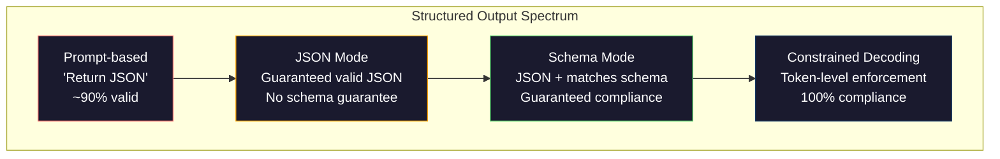
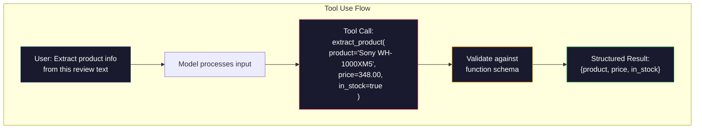

# Структурированный вывод: JSON, валидация схем, ограниченное декодирование

> Ваша LLM возвращает строку. Вашему приложению нужен JSON. Этот разрыв обрушил больше продакшен-систем, чем любая галлюцинация модели. Структурированный вывод — это мост между естественным языком и типизированными данными. Сделаете правильно — и ваша LLM станет надёжным API. Сделаете неправильно — и вы будете парсить свободный текст регулярками в три часа ночи.

**Тип:** Build**Языки:** Python**Предварительные требования:** Фаза 10, Уроки 01-05 (LLMs from Scratch)**Время:** ~90 минут**Связанные материалы:** Фаза 5 · 20 (Structured Outputs & Constrained Decoding) охватывает теорию на уровне декодера (логит-процессоры FSM/CFG, Outlines, XGrammar). Этот урок сфокусирован на продакшен-поверхности SDK (OpenAI `response_format`, использование инструментов Anthropic, Instructor) — сначала прочитайте Фаза 5 · 20, если хотите понять, что происходит под капотом API.

## Цели обучения

- Реализовать режим JSON и вывод, ограниченный схемой, используя параметры API OpenAI и Anthropic
- Построить слой валидации на Pydantic, который отклоняет некорректный вывод LLM и повторяет попытку с обратной связью об ошибке
- Объяснить, как ограниченное декодирование принуждает к валидному JSON на уровне токенов без постобработки
- Спроектировать надёжные промпты для извлечения, которые стабильно превращают неструктурированный текст в типизированные структуры данных

## Проблема

Вы спрашиваете LLM: «Извлеки название товара, цену и наличие из этого текста». Она отвечает:

```
The product is the Sony WH-1000XM5 headphones, which cost $348.00 and are currently in stock.
```

Это совершенно правильный ответ. Он же совершенно бесполезен для вашего приложения. Вашей системе учёта склада нужен `{"product": "Sony WH-1000XM5", "price": 348.00, "in_stock": true}`. Вам нужен объект JSON с конкретными ключами, конкретными типами и конкретными ограничениями значений. Вам не нужно предложение.

Наивное решение: добавить в промпт «Ответь в формате JSON». Это работает в 90% случаев. В оставшихся 10% модель оборачивает JSON в markdown-код-фенсы, добавляет преамбулу вроде «Вот JSON:», или выдаёт синтаксически невалидный JSON, потому что закрыла скобку раньше времени. Ваш JSON-парсер падает. Ваш конвейер ломается. Вы добавляете try/except и цикл повторных попыток. Повторная попытка иногда выдаёт другие данные. Теперь у вас есть проблема согласованности поверх проблемы парсинга.

Это не проблема проектирования промптов. Это проблема декодирования. Модель генерирует токены слева направо. На каждой позиции она выбирает наиболее вероятный следующий токен из словаря в 100 тыс.+ вариантов. Большинство этих вариантов выдали бы невалидный JSON в данной конкретной позиции. Если модель только что выдала `{"price":`, следующий токен должен быть цифрой, кавычкой (для строки), `null`, `true`, `false` или знаком минус. Всё остальное даёт невалидный JSON. Без ограничений модель может выбрать совершенно разумное английское слово, которое катастрофически неверно синтаксически.

## Концепция

### Спектр структурированного вывода

Есть четыре уровня контроля структурированного вывода, каждый следующий надёжнее предыдущего.



**На основе промпта** («Ответь валидным JSON»): без принуждения. Модель обычно соблюдает это, но не всегда. Надёжность: ~90%. Режимы отказа: markdown-фенсы, текст-преамбула, обрезанный вывод, неверная структура.

**Режим JSON**: API гарантирует, что вывод — валидный JSON. `response_format: { type: "json_object" }` у OpenAI включает этот режим. Вывод распарсится без ошибок. Но он может не соответствовать ожидаемой схеме -- лишние ключи, неверные типы, отсутствующие поля.

**Режим схемы**: API принимает JSON Schema и гарантирует, что вывод ей соответствует. В 2026 году каждый крупный провайдер поддерживает это нативно: `response_format: { type: "json_schema", json_schema: {...} }` у OpenAI (также как `tool_choice="required"`), использование инструментов с `input_schema` у Anthropic и `response_schema` + `response_mime_type: "application/json"` у Gemini. Вывод имеет ровно те ключи, типы и ограничения, которые вы указали.

**Ограниченное декодирование**: на каждой позиции токена во время генерации декодер маскирует все токены, которые дали бы невалидный вывод. Если схема требует число, а модель вот-вот выдаст букву, вероятность этого токена обнуляется. Модель может выдавать только токены, ведущие к валидному выводу. Именно это реализуют под капотом режим структурированного вывода OpenAI и библиотеки вроде Outlines и Guidance.

### JSON Schema: язык контракта

JSON Schema — это способ сообщить модели (или слою валидации), какую форму должен иметь вывод. Её использует каждая крупная система структурированного вывода.

```json
{
  "type": "object",
  "properties": {
    "product": { "type": "string" },
    "price": { "type": "number", "minimum": 0 },
    "in_stock": { "type": "boolean" },
    "categories": {
      "type": "array",
      "items": { "type": "string" }
    }
  },
  "required": ["product", "price", "in_stock"]
}
```

Эта схема говорит: вывод должен быть объектом со строкой `product`, неотрицательным числом `price`, булевым значением `in_stock` и опциональным массивом строк `categories`. Любой вывод, не соответствующий этому, отклоняется.

Схемы обрабатывают сложные случаи: вложенные объекты, массивы с типизированными элементами, перечисления (ограничение строки конкретными значениями), сопоставление по шаблону (regex для строк) и комбинаторы (oneOf, anyOf, allOf для полиморфных выводов).

### Паттерн Pydantic

В Python вы не пишете JSON Schema вручную. Вы определяете модель Pydantic, и она генерирует схему за вас.

```python
from pydantic import BaseModel

class Product(BaseModel):
    product: str
    price: float
    in_stock: bool
    categories: list[str] = []
```

Это производит ту же JSON Schema, что и выше. Библиотека Instructor (и SDK OpenAI) принимают модели Pydantic напрямую: передайте класс модели, получите обратно валидированный экземпляр. Если вывод LLM не соответствует, Instructor автоматически повторяет попытку.

### Вызов функций / использование инструментов

Альтернативный интерфейс для той же задачи. Вместо того чтобы просить модель выдать JSON напрямую, вы определяете «инструменты» (функции) с типизированными параметрами. Модель выдаёт вызов функции со структурированными аргументами. OpenAI называет это «function calling» (вызов функций). Anthropic называет это «tool use» (использование инструментов). Результат один и тот же: структурированные данные.



Использование инструментов предпочтительно, когда модели нужно выбрать, какую функцию вызвать, а не просто заполнить параметры. Если у вас 10 разных схем извлечения и модель должна выбрать правильную на основе ввода, использование инструментов даёт вам и выбор схемы, и структурированный вывод.

### Типичные режимы отказа

Даже при принуждении схемой структурированный вывод может ломаться тонкими способами.

**Галлюцинированные значения**: вывод соответствует схеме, но содержит выдуманные данные. Модель выдаёт `{"price": 299.99}`, когда в тексте указано $348. Валидация схемы не может это поймать -- тип верный, значение неверное.

**Путаница с перечислениями**: вы ограничиваете поле значениями `["in_stock", "out_of_stock", "preorder"]`. Модель выдаёт `"available"` -- семантически верно, но не входит в допустимый набор. Хорошее ограниченное декодирование это предотвращает. Подходы на основе промпта — нет.

**Глубина вложенных объектов**: глубоко вложенные схемы (4+ уровня) дают больше ошибок. Каждый уровень вложенности — ещё одно место, где модель может потерять структуру.

**Длина массива**: модель может выдать слишком много или слишком мало элементов в массиве. Схемы поддерживают `minItems` и `maxItems`, но не все провайдеры принуждают к ним на уровне декодирования.

**Пропуск опциональных полей**: модель опускает поля, которые технически опциональны, но семантически важны для вашего случая использования. Задайте их как обязательные в схеме, даже если данные иногда отсутствуют -- заставьте модель явно выдать `null`.

```figure
mx-schema-funnel
```

## Соберите это

### Шаг 1: Валидатор JSON Schema

Постройте валидатор с нуля, который проверяет, соответствует ли объект Python схеме JSON Schema. Именно это выполняется на стороне вывода для проверки соответствия.

```python
import json

def validate_schema(data, schema):
    errors = []
    _validate(data, schema, "", errors)
    return errors

def _validate(data, schema, path, errors):
    schema_type = schema.get("type")

    if schema_type == "object":
        if not isinstance(data, dict):
            errors.append(f"{path}: expected object, got {type(data).__name__}")
            return
        for key in schema.get("required", []):
            if key not in data:
                errors.append(f"{path}.{key}: required field missing")
        properties = schema.get("properties", {})
        for key, value in data.items():
            if key in properties:
                _validate(value, properties[key], f"{path}.{key}", errors)

    elif schema_type == "array":
        if not isinstance(data, list):
            errors.append(f"{path}: expected array, got {type(data).__name__}")
            return
        min_items = schema.get("minItems", 0)
        max_items = schema.get("maxItems", float("inf"))
        if len(data) < min_items:
            errors.append(f"{path}: array has {len(data)} items, minimum is {min_items}")
        if len(data) > max_items:
            errors.append(f"{path}: array has {len(data)} items, maximum is {max_items}")
        items_schema = schema.get("items", {})
        for i, item in enumerate(data):
            _validate(item, items_schema, f"{path}[{i}]", errors)

    elif schema_type == "string":
        if not isinstance(data, str):
            errors.append(f"{path}: expected string, got {type(data).__name__}")
            return
        enum_values = schema.get("enum")
        if enum_values and data not in enum_values:
            errors.append(f"{path}: '{data}' not in allowed values {enum_values}")

    elif schema_type == "number":
        if not isinstance(data, (int, float)):
            errors.append(f"{path}: expected number, got {type(data).__name__}")
            return
        minimum = schema.get("minimum")
        maximum = schema.get("maximum")
        if minimum is not None and data < minimum:
            errors.append(f"{path}: {data} is less than minimum {minimum}")
        if maximum is not None and data > maximum:
            errors.append(f"{path}: {data} is greater than maximum {maximum}")

    elif schema_type == "boolean":
        if not isinstance(data, bool):
            errors.append(f"{path}: expected boolean, got {type(data).__name__}")

    elif schema_type == "integer":
        if not isinstance(data, int) or isinstance(data, bool):
            errors.append(f"{path}: expected integer, got {type(data).__name__}")
```

### Шаг 2: Преобразование модели в стиле Pydantic в схему

Постройте минимальный конвертер из класса в схему. Определите класс Python и автоматически сгенерируйте его JSON Schema.

```python
class SchemaField:
    def __init__(self, field_type, required=True, default=None, enum=None, minimum=None, maximum=None):
        self.field_type = field_type
        self.required = required
        self.default = default
        self.enum = enum
        self.minimum = minimum
        self.maximum = maximum

def python_type_to_schema(field):
    type_map = {
        str: "string",
        int: "integer",
        float: "number",
        bool: "boolean",
    }

    schema = {}

    if field.field_type in type_map:
        schema["type"] = type_map[field.field_type]
    elif field.field_type == list:
        schema["type"] = "array"
        schema["items"] = {"type": "string"}
    elif isinstance(field.field_type, dict):
        schema = field.field_type

    if field.enum:
        schema["enum"] = field.enum
    if field.minimum is not None:
        schema["minimum"] = field.minimum
    if field.maximum is not None:
        schema["maximum"] = field.maximum

    return schema

def model_to_schema(name, fields):
    properties = {}
    required = []

    for field_name, field in fields.items():
        properties[field_name] = python_type_to_schema(field)
        if field.required:
            required.append(field_name)

    return {
        "type": "object",
        "properties": properties,
        "required": required,
    }
```

### Шаг 3: Фильтр допустимых токенов

Смоделируйте ограниченное декодирование. Имея частичную строку JSON и схему, определите, какие категории токенов допустимы в текущей позиции.

```python
def next_valid_tokens(partial_json, schema):
    stripped = partial_json.strip()

    if not stripped:
        return ["{"]

    try:
        json.loads(stripped)
        return ["<EOS>"]
    except json.JSONDecodeError:
        pass

    last_char = stripped[-1] if stripped else ""

    if last_char == "{":
        return ['"', "}"]
    elif last_char == '"':
        if stripped.endswith('":'):
            return ['"', "0-9", "true", "false", "null", "[", "{"]
        return ["a-z", '"']
    elif last_char == ":":
        return [" ", '"', "0-9", "true", "false", "null", "[", "{"]
    elif last_char == ",":
        return [" ", '"', "{", "["]
    elif last_char in "0123456789":
        return ["0-9", ".", ",", "}", "]"]
    elif last_char == "}":
        return [",", "}", "]", "<EOS>"]
    elif last_char == "]":
        return [",", "}", "<EOS>"]
    elif last_char == "[":
        return ['"', "0-9", "true", "false", "null", "{", "[", "]"]
    else:
        return ["any"]

def demonstrate_constrained_decoding():
    partial_states = [
        '',
        '{',
        '{"product"',
        '{"product":',
        '{"product": "Sony"',
        '{"product": "Sony",',
        '{"product": "Sony", "price":',
        '{"product": "Sony", "price": 348',
        '{"product": "Sony", "price": 348}',
    ]

    print(f"{'Partial JSON':<45} {'Valid Next Tokens'}")
    print("-" * 80)
    for state in partial_states:
        valid = next_valid_tokens(state, {})
        display = state if state else "(empty)"
        print(f"{display:<45} {valid}")
```

### Шаг 4: Конвейер извлечения

Объедините всё в конвейер извлечения: определите схему, смоделируйте LLM, выдающую структурированный вывод, валидируйте вывод и обработайте повторные попытки.

```python
def simulate_llm_extraction(text, schema, attempt=0):
    if "headphones" in text.lower() or "sony" in text.lower():
        if attempt == 0:
            return '{"product": "Sony WH-1000XM5", "price": 348.00, "in_stock": true, "categories": ["audio", "headphones"]}'
        return '{"product": "Sony WH-1000XM5", "price": 348.00, "in_stock": true}'

    if "laptop" in text.lower():
        return '{"product": "MacBook Pro 16", "price": 2499.00, "in_stock": false, "categories": ["computers"]}'

    return '{"product": "Unknown", "price": 0, "in_stock": false}'

def extract_with_retry(text, schema, max_retries=3):
    for attempt in range(max_retries):
        raw = simulate_llm_extraction(text, schema, attempt)

        try:
            data = json.loads(raw)
        except json.JSONDecodeError as e:
            print(f"  Attempt {attempt + 1}: JSON parse error -- {e}")
            continue

        errors = validate_schema(data, schema)
        if not errors:
            return data

        print(f"  Attempt {attempt + 1}: Schema validation errors -- {errors}")

    return None

product_schema = {
    "type": "object",
    "properties": {
        "product": {"type": "string"},
        "price": {"type": "number", "minimum": 0},
        "in_stock": {"type": "boolean"},
        "categories": {"type": "array", "items": {"type": "string"}},
    },
    "required": ["product", "price", "in_stock"],
}
```

### Шаг 5: Запустите полный конвейер

```python
def run_demo():
    print("=" * 60)
    print("  Structured Output Pipeline Demo")
    print("=" * 60)

    print("\n--- Schema Definition ---")
    product_fields = {
        "product": SchemaField(str),
        "price": SchemaField(float, minimum=0),
        "in_stock": SchemaField(bool),
        "categories": SchemaField(list, required=False),
    }
    generated_schema = model_to_schema("Product", product_fields)
    print(json.dumps(generated_schema, indent=2))

    print("\n--- Schema Validation ---")
    test_cases = [
        ({"product": "Test", "price": 10.0, "in_stock": True}, "Valid object"),
        ({"product": "Test", "price": -5.0, "in_stock": True}, "Negative price"),
        ({"product": "Test", "in_stock": True}, "Missing price"),
        ({"product": "Test", "price": "ten", "in_stock": True}, "String as price"),
        ("not an object", "String instead of object"),
    ]

    for data, label in test_cases:
        errors = validate_schema(data, product_schema)
        status = "PASS" if not errors else f"FAIL: {errors}"
        print(f"  {label}: {status}")

    print("\n--- Constrained Decoding Simulation ---")
    demonstrate_constrained_decoding()

    print("\n--- Extraction Pipeline ---")
    texts = [
        "The Sony WH-1000XM5 headphones are priced at $348 and currently available.",
        "The new MacBook Pro 16-inch laptop costs $2499 but is sold out.",
        "This is a random sentence with no product info.",
    ]

    for text in texts:
        print(f"\n  Input: {text[:60]}...")
        result = extract_with_retry(text, product_schema)
        if result:
            print(f"  Output: {json.dumps(result)}")
        else:
            print(f"  Output: FAILED after retries")
```

## Используйте это

### Structured Outputs в OpenAI

```python
# from openai import OpenAI
# from pydantic import BaseModel
#
# client = OpenAI()
#
# class Product(BaseModel):
#     product: str
#     price: float
#     in_stock: bool
#
# response = client.beta.chat.completions.parse(
#     model="gpt-5-mini",
#     messages=[
#         {"role": "system", "content": "Extract product information."},
#         {"role": "user", "content": "Sony WH-1000XM5, $348, in stock"},
#     ],
#     response_format=Product,
# )
#
# product = response.choices[0].message.parsed
# print(product.product, product.price, product.in_stock)
```

Режим структурированного вывода OpenAI использует ограниченное декодирование внутренне. Каждый токен, который генерирует модель, гарантированно даёт вывод, соответствующий схеме Pydantic. Повторные попытки не нужны. Валидация не нужна. Ограничение встроено в сам процесс декодирования.

### Использование инструментов в Anthropic

```python
# import anthropic
#
# client = anthropic.Anthropic()
#
# response = client.messages.create(
#     model="claude-opus-4-7",
#     max_tokens=1024,
#     tools=[{
#         "name": "extract_product",
#         "description": "Extract product information from text",
#         "input_schema": {
#             "type": "object",
#             "properties": {
#                 "product": {"type": "string"},
#                 "price": {"type": "number"},
#                 "in_stock": {"type": "boolean"},
#             },
#             "required": ["product", "price", "in_stock"],
#         },
#     }],
#     messages=[{"role": "user", "content": "Extract: Sony WH-1000XM5, $348, in stock"}],
# )
```

Anthropic достигает структурированного вывода через использование инструментов. Модель выдаёт вызов инструмента со структурированными аргументами, соответствующими input_schema. Тот же результат, другая поверхность API.

### Библиотека Instructor

```python
# pip install instructor
# import instructor
# from openai import OpenAI
# from pydantic import BaseModel
#
# client = instructor.from_openai(OpenAI())
#
# class Product(BaseModel):
#     product: str
#     price: float
#     in_stock: bool
#
# product = client.chat.completions.create(
#     model="gpt-5-mini",
#     response_model=Product,
#     messages=[{"role": "user", "content": "Sony WH-1000XM5, $348, in stock"}],
# )
```

Instructor оборачивает любой LLM-клиент и добавляет автоматические повторные попытки с валидацией. Если первая попытка не проходит валидацию, он отправляет ошибки обратно модели как контекст и просит исправить вывод. Это работает с любым провайдером, не только с OpenAI.

## Итоговое задание

Этот урок производит `outputs/prompt-structured-extractor.md` -- переиспользуемый шаблон промпта, извлекающий структурированные данные из любого текста по заданной схеме. Подайте на вход JSON Schema и неструктурированный текст — на выходе получите валидированный JSON.

Он также производит `outputs/skill-structured-outputs.md` -- фреймворк для принятия решений, помогающий выбрать правильную стратегию структурированного вывода исходя из вашего провайдера, требований к надёжности и сложности схемы.

## Упражнения

1. Расширьте валидатор схем поддержкой `oneOf` (данные должны соответствовать ровно одной из нескольких схем). Это обрабатывает полиморфные выводы -- например, поле, которое может быть либо объектом `Product`, либо объектом `Service` с разной формой.

2. Постройте инструмент «diff схем», который сравнивает две схемы и определяет breaking-изменения (удалённые обязательные поля, изменённые типы) в сравнении с не ломающими изменения (добавленные опциональные поля, ослабленные ограничения). Это необходимо для версионирования ваших схем извлечения в продакшене.

3. Реализуйте более реалистичный симулятор ограниченного декодирования. Имея JSON Schema и словарь из 100 токенов (буквы, цифры, пунктуация, ключевые слова), пройдите пошагово по генерации, маскируя недопустимые токены на каждой позиции. Измерьте, какой процент словаря допустим на каждом шаге.

4. Постройте набор для оценки извлечения. Создайте 50 описаний товаров с вручную размеченным JSON-выводом. Прогоните ваш конвейер извлечения на всех 50 и измерьте точное совпадение, точность на уровне полей и соответствие типов. Определите, какие поля сложнее всего извлечь корректно.

5. Добавьте «оценки уверенности» в ваш конвейер извлечения. Для каждого извлечённого поля оцените, насколько модель уверена (на основе вероятностей токенов или путём троекратного запуска извлечения и измерения согласованности). Помечайте поля с низкой уверенностью для проверки человеком.

## Ключевые термины

| Термин | Что говорят люди | Что это на самом деле означает |
|------|----------------|----------------------|
| Режим JSON | «Возвращает JSON» | Флаг API, гарантирующий синтаксически валидный вывод JSON, но не принуждающий к какой-либо конкретной схеме |
| Структурированный вывод | «Типизированный JSON» | Вывод, соответствующий конкретной JSON Schema с правильными ключами, типами и ограничениями |
| Ограниченное декодирование | «Направляемая генерация» | На каждой позиции токена маскируются токены, которые дали бы невалидный вывод -- гарантирует 100% соответствие схеме |
| JSON Schema | «Шаблон JSON» | Декларативный язык для описания структуры, типов и ограничений данных JSON (используется в OpenAPI, JSON Forms и др.) |
| Pydantic | «Python-датаклассы+» | Библиотека Python, определяющая модели данных с валидацией типов, используемая FastAPI и Instructor для генерации JSON Schema |
| Вызов функций (Function calling) | «Использование инструментов» | LLM выдаёт структурированный вызов функции (имя + типизированные аргументы) вместо свободного текста -- поддерживается и OpenAI, и Anthropic |
| Instructor | «Pydantic для LLM» | Библиотека Python, оборачивающая LLM-клиенты, чтобы возвращать валидированные экземпляры Pydantic с автоматической повторной попыткой при ошибке валидации |
| Маскирование токенов | «Фильтрация словаря» | Обнуление вероятностей конкретных токенов во время генерации, чтобы модель не могла их выдать |
| Соответствие схеме | «Соответствует форме» | Вывод содержит все обязательные поля, правильные типы, значения в пределах ограничений и не содержит лишних недопустимых полей |
| Цикл повторных попыток | «Пробуй снова, пока не получится» | Отправка ошибок валидации обратно модели с просьбой исправить вывод -- Instructor делает это автоматически, до настраиваемого максимума |

## Дополнительное чтение

- [OpenAI Structured Outputs Guide](https://platform.openai.com/docs/guides/structured-outputs) -- официальная документация по ограниченному декодированию на основе JSON Schema в API OpenAI
- [Willard & Louf, 2023 -- "Efficient Guided Generation for Large Language Models"](https://arxiv.org/abs/2307.09702) -- статья об Outlines, описывающая, как компилировать JSON Schema в конечные автоматы для ограничений на уровне токена
- [Instructor documentation](https://python.useinstructor.com/) -- стандартная библиотека для получения структурированного вывода от любой LLM с валидацией на Pydantic и повторными попытками
- [Anthropic Tool Use Guide](https://docs.anthropic.com/en/docs/tool-use) -- как Claude реализует структурированный вывод через использование инструментов со схемой ввода input_schema в формате JSON Schema
- [JSON Schema specification](https://json-schema.org/) -- полная спецификация языка схем, используемого каждой крупной системой структурированного вывода
- [Outlines library](https://github.com/outlines-dev/outlines) -- open-source ограниченная генерация с использованием regex и JSON Schema, компилируемых в конечные автоматы
- [Dong et al., "XGrammar: Flexible and Efficient Structured Generation Engine for Large Language Models" (MLSys 2025)](https://arxiv.org/abs/2411.15100) -- современный state-of-the-art движок грамматик; компиляция в автомат с магазинной памятью, маскирующая токены за ~100 нс/токен.
- [Beurer-Kellner et al., "Prompting Is Programming: A Query Language for Large Language Models" (LMQL)](https://arxiv.org/abs/2212.06094) -- статья про LMQL, представляющая ограниченное декодирование как язык запросов с ограничениями типов и значений.
- [Microsoft Guidance (framework docs)](https://github.com/guidance-ai/guidance) -- ограниченная генерация на основе шаблонов; вендоронезависимое дополнение к Outlines и XGrammar.
