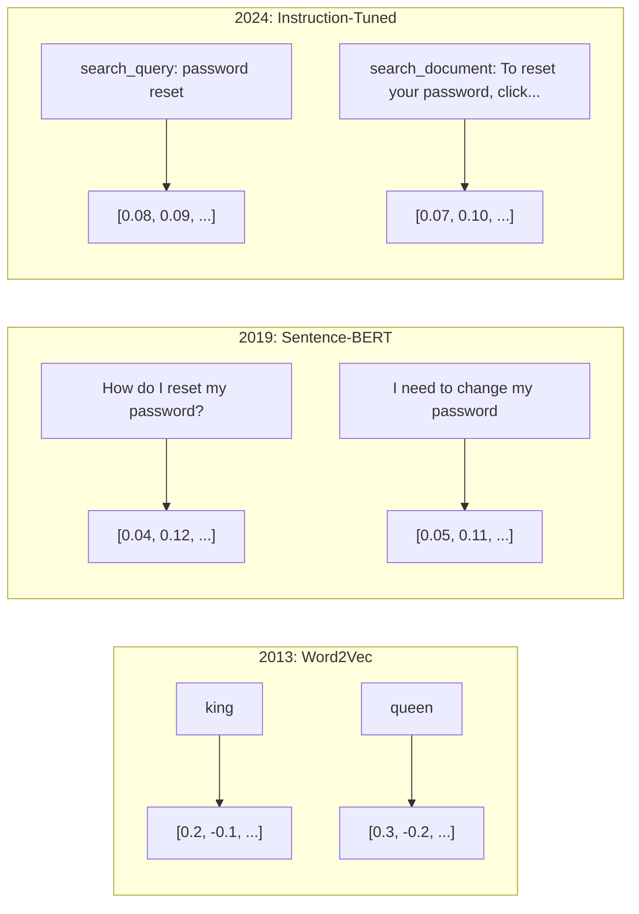
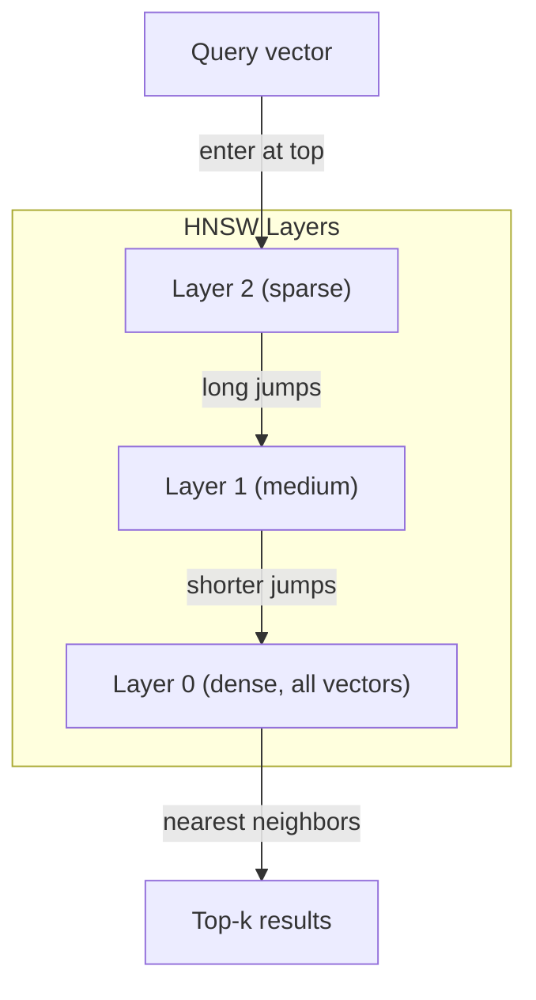

# Эмбеддинги и векторные представления

> Текст дискретен. Математика непрерывна. Каждый раз, когда вы просите LLM найти «похожие» документы, сравнить смыслы или выполнить поиск за пределами ключевых слов, вы полагаетесь на мост между этими двумя мирами. Этот мост — эмбеддинг. Если вы не понимаете эмбеддинги, вы не понимаете современный ИИ. Вы просто им пользуетесь.

**Тип:** Build**Языки:** Python**Предварительные требования:** Фаза 11, Урок 01 (Prompt Engineering)**Время:** ~75 минут**Связанные материалы:** Фаза 5 · 22 (Embedding Models Deep Dive) рассматривает плотные, разреженные и многовекторные представления, усечение по методу матрёшки и выбор модели по отдельным осям. Этот урок сосредоточен на продакшен-конвейере (векторные базы данных, HNSW, математика сходства). Прочитайте Фаза 5 · 22 перед выбором модели.

## Цели обучения

- Сгенерировать текстовые эмбеддинги с помощью API-провайдеров и открытых моделей и вычислить косинусное сходство между ними
- Объяснить, почему эмбеддинги решают проблему несовпадения словаря, с которой не справляется поиск по ключевым словам
- Построить индекс семантического поиска, который находит документы по смыслу, а не по точному совпадению ключевых слов
- Оценить качество эмбеддингов с помощью бенчмарков поиска (precision@k, recall) и выбрать подходящую модель эмбеддингов для своей задачи

## Проблема

У вас 10 000 обращений в поддержку. Клиент пишет: «мой платёж не прошёл». Вам нужно найти похожие прошлые обращения. Поиск по ключевым словам находит обращения, содержащие «платёж» и «не прошёл». Он упускает «транзакция не удалась», «списание отклонено» и «ошибка биллинга». Эти обращения описывают ровно ту же проблему совершенно разными словами.

Это проблема несовпадения словаря. У человеческого языка есть десятки способов сказать одно и то же. Поиск по ключевым словам обрабатывает каждое слово как независимый символ без значения. Он не может знать, что «отклонено» и «не прошёл» относятся к одному и тому же понятию.

Вам нужно такое представление текста, где сходство определяется смыслом, а не написанием. Вам нужен способ расположить «мой платёж не прошёл» и «транзакция была отклонена» близко друг к другу в некотором математическом пространстве, отодвинув «мой платёж пришёл вовремя» далеко в сторону, несмотря на общее слово «платёж».

Это представление и есть эмбеддинг.

## Концепция

### Что такое эмбеддинг?

Эмбеддинг — это плотный вектор чисел с плавающей точкой, представляющий смысл текста. Слово «плотный» важно — каждое измерение несёт информацию, в отличие от разреженных представлений (мешок слов, TF-IDF), где большинство измерений равны нулю.

«The cat sat on the mat» превращается в нечто вроде `[0.023, -0.041, 0.087, ..., 0.012]` — список из 768–3072 чисел в зависимости от модели. Эти числа кодируют смысл. Вы никогда не рассматриваете их напрямую. Вы их сравниваете.

### Прорыв Word2Vec

В 2013 году Томаш Миколов и его коллеги из Google опубликовали Word2Vec. Ключевая идея: обучить нейронную сеть предсказывать слово по его соседям (или соседей по слову), и веса скрытого слоя становятся осмысленными векторными представлениями.

Знаменитый результат:

```
king - man + woman = queen
```

Векторная арифметика над эмбеддингами слов улавливает семантические отношения. Направление от «man» к «woman» примерно совпадает с направлением от «king» к «queen». Это был момент, когда область осознала, что геометрия может кодировать смысл.

Word2Vec выдавал 300-мерные векторы. Каждое слово получало один вектор независимо от контекста. У «bank» в «river bank» и «bank account» был один и тот же эмбеддинг. Это ограничение двигало исследования следующего десятилетия.

### От слов к предложениям

Эмбеддинги слов представляют отдельные токены. Продакшен-системам нужно превращать в эмбеддинги целые предложения, абзацы или документы. Появилось четыре подхода:

**Усреднение (averaging)**: взять среднее всех векторов слов в предложении. Дёшево, с потерями, но на удивление неплохо работает для коротких текстов. Полностью теряет порядок слов — «dog bites man» и «man bites dog» получают идентичные эмбеддинги.

**CLS-токен**: трансформерные модели (BERT, 2018) выдают эмбеддинг специального токена [CLS], который представляет весь вход. Лучше усреднения, но токен [CLS] обучался для предсказания следующего предложения, а не для оценки сходства.

**Контрастивное обучение (contrastive learning)**: модель обучают явно сближать похожие пары и раздвигать непохожие. Sentence-BERT (Reimers & Gurevych, 2019) использовала этот подход и стала основой современных моделей эмбеддингов. Получив «How do I reset my password?» и «I need to change my password», модель учится делать их векторы почти идентичными.

**Эмбеддинги с инструкциями (instruction-tuned)**: самый новый подход. Такие модели, как E5 и GTE, принимают префикс задачи («search_query:», «search_document:»), который сообщает модели, какой тип эмбеддинга нужно выдать. Это позволяет одной модели обслуживать несколько задач.



### Современные модели эмбеддингов

Рынок устоялся вокруг нескольких вариантов продакшен-уровня (оценки MTEB на начало 2026 года, MTEB v2):

| Модель | Провайдер | Размерность | MTEB | Контекст | Стоимость / 1M токенов |
|-------|----------|-----------|------|---------|------------------|
| Gemini Embedding 2 | Google | 3072 (Matryoshka) | 67.7 (retrieval) | 8192 | $0.15 |
| embed-v4 | Cohere | 1024 (Matryoshka) | 65.2 | 128K | $0.12 |
| voyage-4 | Voyage AI | 1024/2048 (Matryoshka) | 66.8 | 32K | $0.12 |
| text-embedding-3-large | OpenAI | 3072 (Matryoshka) | 64.6 | 8192 | $0.13 |
| text-embedding-3-small | OpenAI | 1536 (Matryoshka) | 62.3 | 8192 | $0.02 |
| BGE-M3 | BAAI | 1024 (dense+sparse+ColBERT) | 63.0 multilingual | 8192 | Open-weight |
| Qwen3-Embedding | Alibaba | 4096 (Matryoshka) | 66.9 | 32K | Open-weight |
| Nomic-embed-v2 | Nomic | 768 (Matryoshka) | 63.1 | 8192 | Open-weight |

MTEB (Massive Text Embedding Benchmark) v2 охватывает более 100 задач в областях поиска, классификации, кластеризации, реранжирования и суммаризации. Чем выше значение, тем лучше. К 2026 году открытые модели (Qwen3-Embedding, BGE-M3) сравнялись или превзошли закрытые размещённые модели по большинству осей. Gemini Embedding 2 лидирует в чистом поиске; Voyage/Cohere лидируют в отдельных доменах (финансы, право, код). Всегда проверяйте на своих собственных запросах, прежде чем принимать решение.

### Метрики сходства

Даны два вектора эмбеддингов — три способа измерить, насколько они похожи:

**Косинусное сходство**: косинус угла между двумя векторами. Диапазон от -1 (противоположны) до 1 (идентичное направление). Игнорирует величину — предложение из 10 слов и документ из 500 слов могут получить оценку 1.0, если указывают в одном направлении. Это выбор по умолчанию для 90% случаев использования.

```
cosine_sim(a, b) = dot(a, b) / (||a|| * ||b||)
```

**Скалярное произведение**: необработанное внутреннее произведение двух векторов. Идентично косинусному сходству, если векторы нормализованы (единичной длины). Быстрее вычисляется. Эмбеддинги OpenAI нормализованы, поэтому скалярное произведение и косинусное сходство дают одинаковое ранжирование.

```
dot(a, b) = sum(a_i * b_i)
```

**Евклидово расстояние (L2)**: прямолинейное расстояние в векторном пространстве. Меньше = более похоже. Чувствительно к различиям в величине. Используйте, когда важна абсолютная позиция в пространстве, а не только направление.

```
L2(a, b) = sqrt(sum((a_i - b_i)^2))
```

Когда что использовать:

| Метрика | Используйте, когда | Избегайте, когда |
|--------|----------|-----------|
| Косинусное сходство | Сравниваете тексты разной длины; большинство задач поиска | Величина несёт информацию |
| Скалярное произведение | Эмбеддинги уже нормализованы; нужна максимальная скорость | Векторы имеют разную величину |
| Евклидово расстояние | Кластеризация; пространственные задачи поиска ближайших соседей | Сравниваете документы совершенно разной длины |

### Векторные базы данных и HNSW

Полный перебор при поиске сходства сравнивает запрос с каждым сохранённым вектором. При 1 миллионе векторов с 1536 измерениями это 1,5 миллиарда операций умножения-сложения на запрос. Слишком медленно.

Векторные базы данных решают эту проблему с помощью алгоритмов приближённого поиска ближайших соседей (Approximate Nearest Neighbor, ANN). Доминирующий алгоритм — HNSW (Hierarchical Navigable Small World, иерархический навигируемый мир малого размера):

1. Построить многослойный граф векторов
2. Верхние слои разреженные — дальние связи между удалёнными кластерами
3. Нижние слои плотные — мелкозернистые связи между близкими векторами
4. Поиск начинается на верхнем слое и жадно спускается вниз, уточняя результат
5. Возвращает приближённые топ-k результаты за O(log n) времени вместо O(n)

HNSW обменивает небольшую потерю точности (обычно 95-99% полноты) на колоссальный прирост скорости. При 10 миллионах векторов полный перебор занимает секунды. HNSW — миллисекунды.



Продакшен-варианты:

| База данных | Тип | Лучше всего для | Максимальный масштаб |
|----------|------|----------|-----------|
| Pinecone | Управляемый SaaS | Продакшен без операционных затрат | Миллиарды |
| Weaviate | Открытый исходный код | Самостоятельный хостинг, гибридный поиск | 100M+ |
| Qdrant | Открытый исходный код | Высокая производительность, фильтрация | 100M+ |
| ChromaDB | Встраиваемая | Прототипирование, локальная разработка | 1M |
| pgvector | Расширение Postgres | Уже используете Postgres | 10M |
| FAISS | Библиотека | Внутрипроцессное использование, исследования | 1B+ |

### Стратегии разбиения на фрагменты

Документы слишком длинные, чтобы превращать их в эмбеддинг единым вектором. 50-страничный PDF охватывает десятки тем — его эмбеддинг становится усреднением всего подряд, похожим ни на что конкретное. Вы разбиваете документы на фрагменты и превращаете в эмбеддинг каждый по отдельности.

**Разбиение фиксированного размера**: разбить каждые N токенов с перекрытием в M токенов. Просто и предсказуемо. Хорошо работает, когда у документов нет чёткой структуры. Фрагмент на 512 токенов с перекрытием в 50 токенов: фрагмент 1 — токены 0-511, фрагмент 2 — токены 462-973.

**Разбиение по предложениям**: разбивать по границам предложений, группируя предложения до достижения лимита токенов. Каждый фрагмент содержит как минимум одно законченное предложение. Лучше фиксированного размера, потому что вы никогда не разрезаете мысль пополам.

**Рекурсивное разбиение**: сначала попробовать разбить по самой крупной границе (заголовки разделов). Если всё ещё слишком крупно — попробовать границы абзацев. Затем границы предложений. Затем ограничения по символам. Это `RecursiveCharacterTextSplitter` из LangChain, и он хорошо работает для корпусов со смешанным форматированием.

**Семантическое разбиение**: превратить в эмбеддинг каждое предложение, затем сгруппировать последовательные предложения, чьи эмбеддинги похожи. Когда сходство эмбеддингов падает ниже порога, начать новый фрагмент. Дорого (требует превращения в эмбеддинг каждого предложения по отдельности), но даёт наиболее связные фрагменты.

| Стратегия | Сложность | Качество | Лучше всего для |
|----------|-----------|---------|----------|
| Фиксированный размер | Низкая | Приемлемое | Неструктурированный текст, логи |
| По предложениям | Низкая | Хорошее | Статьи, письма |
| Рекурсивное | Средняя | Хорошее | Markdown, HTML, смешанные документы |
| Семантическое | Высокая | Лучшее | Критичное качество поиска |

Оптимальная точка для большинства систем: фрагменты по 256-512 токенов с перекрытием в 50 токенов.

### Би-энкодеры и кросс-энкодеры

Би-энкодер превращает в эмбеддинг запрос и документы независимо друг от друга, а затем сравнивает векторы. Быстро — вы превращаете запрос в эмбеддинг один раз и сравниваете его с заранее вычисленными эмбеддингами документов. Это то, что вы используете для поиска.

Кросс-энкодер принимает запрос и документ как единый вход и выдаёт оценку релевантности. Медленно — он пропускает каждую пару запрос-документ через полную модель. Но гораздо точнее, потому что может учитывать внимание одновременно между токенами запроса и документа.

Продакшен-паттерн: би-энкодер извлекает топ-100 кандидатов, кросс-энкодер реранжирует их до топ-10. Это конвейер «извлечение, затем реранжирование».


Модели реранжирования: Cohere Rerank 3.5 ($2 за 1000 запросов), BGE-reranker-v2 (бесплатно, открытый исходный код), Jina Reranker v2 (бесплатно, открытый исходный код).

### Эмбеддинги по методу матрёшки

Традиционные эмбеддинги работают по принципу «всё или ничего». 1536-мерный вектор использует 1536 чисел с плавающей точкой. Вы не можете усечь его до 256 измерений без переобучения.

Обучение представлений методом матрёшки (Matryoshka Representation Learning, Kusupati et al., 2022) решает эту проблему. Модель обучается так, что первые N измерений улавливают самую важную информацию — подобно русской матрёшке. Усечение 1536-мерного эмбеддинга по методу матрёшки до 256 измерений теряет часть точности, но сохраняет работоспособность.

Модели OpenAI text-embedding-3-small и text-embedding-3-large поддерживают усечение по методу матрёшки через параметр `dimensions`. Запрос 256 измерений вместо 1536 сокращает хранилище в 6 раз при потере точности примерно на 3-5% на бенчмарках MTEB.

### Бинарное квантование

1536-мерный эмбеддинг, хранящийся как float32, занимает 6144 байта. Умножьте на 10 миллионов документов: 61 ГБ только на векторы.

Бинарное квантование превращает каждое число с плавающей точкой в один бит: положительные значения становятся 1, отрицательные — 0. Хранилище сокращается с 6144 байт до 192 байт — уменьшение в 32 раза. Сходство вычисляется с помощью расстояния Хэмминга (подсчёт различающихся битов), которое процессоры могут выполнить одной инструкцией.

Потеря точности составляет около 5-10% полноты поиска. Распространённый паттерн: бинарное квантование для первого прохода поиска по миллионам векторов, затем переоценка топ-1000 полноточными векторами. Это даёт 95%+ полноточной точности при памяти в 32 раза меньше.

```figure
cosine-similarity
```

## Соберите это

Мы строим движок семантического поиска с нуля. Без векторной базы данных. Без внешнего API эмбеддингов. Чистый Python с numpy для математики.

### Шаг 1: разбиение текста на фрагменты

```python
def chunk_text(text, chunk_size=200, overlap=50):
    words = text.split()
    chunks = []
    start = 0
    while start < len(words):
        end = start + chunk_size
        chunk = " ".join(words[start:end])
        chunks.append(chunk)
        start += chunk_size - overlap
    return chunks


def chunk_by_sentences(text, max_chunk_tokens=200):
    sentences = text.replace("\n", " ").split(".")
    sentences = [s.strip() + "." for s in sentences if s.strip()]
    chunks = []
    current_chunk = []
    current_length = 0
    for sentence in sentences:
        sentence_length = len(sentence.split())
        if current_length + sentence_length > max_chunk_tokens and current_chunk:
            chunks.append(" ".join(current_chunk))
            current_chunk = []
            current_length = 0
        current_chunk.append(sentence)
        current_length += sentence_length
    if current_chunk:
        chunks.append(" ".join(current_chunk))
    return chunks
```

### Шаг 2: построение эмбеддингов с нуля

Мы реализуем простой плотный эмбеддинг с помощью TF-IDF с L2-нормализацией. Это не нейронный эмбеддинг, но он следует тому же контракту: на входе текст, на выходе вектор фиксированного размера, похожие тексты дают похожие векторы.

```python
import math
import numpy as np
from collections import Counter

class SimpleEmbedder:
    def __init__(self):
        self.vocab = []
        self.idf = []
        self.word_to_idx = {}

    def fit(self, documents):
        vocab_set = set()
        for doc in documents:
            vocab_set.update(doc.lower().split())
        self.vocab = sorted(vocab_set)
        self.word_to_idx = {w: i for i, w in enumerate(self.vocab)}
        n = len(documents)
        self.idf = np.zeros(len(self.vocab))
        for i, word in enumerate(self.vocab):
            doc_count = sum(1 for doc in documents if word in doc.lower().split())
            self.idf[i] = math.log((n + 1) / (doc_count + 1)) + 1

    def embed(self, text):
        words = text.lower().split()
        count = Counter(words)
        total = len(words) if words else 1
        vec = np.zeros(len(self.vocab))
        for word, freq in count.items():
            if word in self.word_to_idx:
                tf = freq / total
                vec[self.word_to_idx[word]] = tf * self.idf[self.word_to_idx[word]]
        norm = np.linalg.norm(vec)
        if norm > 0:
            vec = vec / norm
        return vec
```

### Шаг 3: функции сходства

```python
def cosine_similarity(a, b):
    dot = np.dot(a, b)
    norm_a = np.linalg.norm(a)
    norm_b = np.linalg.norm(b)
    if norm_a == 0 or norm_b == 0:
        return 0.0
    return float(dot / (norm_a * norm_b))


def dot_product(a, b):
    return float(np.dot(a, b))


def euclidean_distance(a, b):
    return float(np.linalg.norm(a - b))
```

### Шаг 4: векторный индекс с полным перебором

```python
class VectorIndex:
    def __init__(self):
        self.vectors = []
        self.texts = []
        self.metadata = []

    def add(self, vector, text, meta=None):
        self.vectors.append(vector)
        self.texts.append(text)
        self.metadata.append(meta or {})

    def search(self, query_vector, top_k=5, metric="cosine"):
        scores = []
        for i, vec in enumerate(self.vectors):
            if metric == "cosine":
                score = cosine_similarity(query_vector, vec)
            elif metric == "dot":
                score = dot_product(query_vector, vec)
            elif metric == "euclidean":
                score = -euclidean_distance(query_vector, vec)
            else:
                raise ValueError(f"Unknown metric: {metric}")
            scores.append((i, score))
        scores.sort(key=lambda x: x[1], reverse=True)
        results = []
        for idx, score in scores[:top_k]:
            results.append({
                "text": self.texts[idx],
                "score": score,
                "metadata": self.metadata[idx],
                "index": idx
            })
        return results

    def size(self):
        return len(self.vectors)
```

### Шаг 5: движок семантического поиска

```python
class SemanticSearchEngine:
    def __init__(self, chunk_size=200, overlap=50):
        self.embedder = SimpleEmbedder()
        self.index = VectorIndex()
        self.chunk_size = chunk_size
        self.overlap = overlap

    def index_documents(self, documents, source_names=None):
        all_chunks = []
        all_sources = []
        for i, doc in enumerate(documents):
            chunks = chunk_text(doc, self.chunk_size, self.overlap)
            all_chunks.extend(chunks)
            name = source_names[i] if source_names else f"doc_{i}"
            all_sources.extend([name] * len(chunks))
        self.embedder.fit(all_chunks)
        for chunk, source in zip(all_chunks, all_sources):
            vec = self.embedder.embed(chunk)
            self.index.add(vec, chunk, {"source": source})
        return len(all_chunks)

    def search(self, query, top_k=5, metric="cosine"):
        query_vec = self.embedder.embed(query)
        return self.index.search(query_vec, top_k, metric)

    def search_with_scores(self, query, top_k=5):
        results = self.search(query, top_k)
        return [
            {
                "text": r["text"][:200],
                "source": r["metadata"].get("source", "unknown"),
                "score": round(r["score"], 4)
            }
            for r in results
        ]
```

### Шаг 6: сравнение метрик сходства

```python
def compare_metrics(engine, query, top_k=3):
    results = {}
    for metric in ["cosine", "dot", "euclidean"]:
        hits = engine.search(query, top_k=top_k, metric=metric)
        results[metric] = [
            {"score": round(h["score"], 4), "preview": h["text"][:80]}
            for h in hits
        ]
    return results
```

## Используйте это

С продакшен-API эмбеддингов архитектура остаётся той же самой. Меняется только эмбеддер:

```python
from openai import OpenAI

client = OpenAI()

def openai_embed(texts, model="text-embedding-3-small", dimensions=None):
    kwargs = {"model": model, "input": texts}
    if dimensions:
        kwargs["dimensions"] = dimensions
    response = client.embeddings.create(**kwargs)
    return [item.embedding for item in response.data]
```

Усечение по методу матрёшки с OpenAI — та же модель, меньше измерений, ниже затраты на хранение:

```python
full = openai_embed(["semantic search query"], dimensions=1536)
compact = openai_embed(["semantic search query"], dimensions=256)
```

256-мерный вектор использует в 6 раз меньше хранилища. Для 10 миллионов документов это 10 ГБ против 61 ГБ. Потеря точности составляет примерно 3-5% на стандартных бенчмарках.

Для реранжирования с Cohere:

```python
import cohere

co = cohere.ClientV2()

results = co.rerank(
    model="rerank-v3.5",
    query="What is the refund policy?",
    documents=["Full refund within 30 days...", "No refunds after 90 days..."],
    top_n=3
)
```

Для локальных эмбеддингов без зависимости от API:

```python
from sentence_transformers import SentenceTransformer

model = SentenceTransformer("BAAI/bge-small-en-v1.5")
embeddings = model.encode(["semantic search query", "another document"])
```

Класс VectorIndex из нашей сборки работает с любым из этих вариантов. Замените функцию эмбеддинга, оставьте логику поиска без изменений.

## Итоговое задание

Этот урок производит:
- `outputs/prompt-embedding-advisor.md` — промпт для выбора моделей эмбеддингов и стратегий под конкретные случаи использования
- `outputs/skill-embedding-patterns.md` — навык, который учит агентов эффективно использовать эмбеддинги в продакшене

## Упражнения

1. **Сравнение метрик**: прогоните одни и те же 5 запросов на примерных документах, используя косинусное сходство, скалярное произведение и евклидово расстояние. Запишите топ-3 результата для каждой. Для каких запросов метрики расходятся? Почему?

2. **Эксперимент с размером фрагмента**: проиндексируйте примерные документы с размерами фрагментов 50, 100, 200 и 500 слов. Для каждого прогоните 5 запросов и запишите оценку сходства топ-1. Постройте график зависимости между размером фрагмента и качеством поиска. Найдите точку, где более крупные фрагменты начинают ухудшать результат.

3. **Симуляция матрёшки**: постройте SimpleEmbedder, выдающий 500-мерные векторы. Усеките до 50, 100, 200 и 500 измерений. Измерьте, как деградирует полнота поиска при каждом усечении. Это симулирует поведение матрёшки без необходимости реального приёма обучения.

4. **Бинарное квантование**: возьмите эмбеддинги из движка поиска, преобразуйте их в бинарный вид (1, если положительное, 0, если отрицательное), и реализуйте поиск по расстоянию Хэмминга. Сравните топ-10 результатов с полноточным косинусным сходством. Измерьте процент совпадения.

5. **Разбиение по предложениям**: замените разбиение фиксированного размера на `chunk_by_sentences`. Прогоните те же запросы и сравните оценки поиска. Улучшает ли результаты соблюдение границ предложений?

## Ключевые термины

| Термин | Что говорят люди | Что это на самом деле означает |
|------|----------------|----------------------|
| Эмбеддинг | «Текст в числа» | Плотный вектор, где геометрическая близость кодирует семантическое сходство |
| Word2Vec | «Праотец эмбеддингов» | Модель 2013 года, которая обучала векторы слов, предсказывая контекстные слова; доказала, что векторная арифметика кодирует смысл |
| Косинусное сходство | «Насколько похожи два вектора» | Косинус угла между векторами; 1 = идентичное направление, 0 = ортогональны, -1 = противоположны |
| HNSW | «Быстрый векторный поиск» | Граф Hierarchical Navigable Small World — многослойная структура, обеспечивающая приближённый поиск ближайших соседей за O(log n) |
| Би-энкодер | «Кодируй отдельно, сравнивай быстро» | Кодирует запрос и документ независимо в векторы; позволяет предварительно вычислять и быстро извлекать |
| Кросс-энкодер | «Медленный, но точный реранкер» | Обрабатывает пару запрос-документ совместно через полную модель; более высокая точность, без предварительного вычисления |
| Эмбеддинги по методу матрёшки | «Усекаемые векторы» | Эмбеддинги, обученные так, что первые N измерений улавливают самую важную информацию, что позволяет хранить их переменного размера |
| Бинарное квантование | «1-битные эмбеддинги» | Преобразование векторов с плавающей точкой в бинарный вид (только знаковый бит) для 32-кратного сокращения хранилища с поиском по расстоянию Хэмминга |
| Разбиение на фрагменты | «Разбить документы для эмбеддинга» | Разбиение документов на сегменты по 256-512 токенов, чтобы каждый можно было независимо превратить в эмбеддинг и найти |
| Векторная база данных | «Поисковый движок для эмбеддингов» | Хранилище данных, оптимизированное для хранения векторов и выполнения приближённого поиска ближайших соседей в промышленном масштабе |
| Контрастивное обучение | «Обучение через сравнение» | Подход к обучению, который сближает эмбеддинги похожих пар и раздвигает эмбеддинги непохожих пар |
| MTEB | «Бенчмарк эмбеддингов» | Massive Text Embedding Benchmark — 56 наборов данных в 8 задачах; стандарт для сравнения моделей эмбеддингов |

## Дополнительное чтение

- Mikolov et al., "Efficient Estimation of Word Representations in Vector Space" (2013) — статья про Word2Vec, положившая начало революции эмбеддингов с аналогией king-queen
- Reimers & Gurevych, "Sentence-BERT: Sentence Embeddings using Siamese BERT-Networks" (2019) — как обучать би-энкодеры для сходства на уровне предложений, основа современных моделей эмбеддингов
- Kusupati et al., "Matryoshka Representation Learning" (2022) — техника, лежащая в основе эмбеддингов переменной размерности, которую OpenAI приняла для text-embedding-3
- Malkov & Yashunin, "Efficient and Robust Approximate Nearest Neighbor using Hierarchical Navigable Small World Graphs" (2018) — статья про HNSW, алгоритм, лежащий в основе большинства продакшен-систем векторного поиска
- OpenAI Embeddings Guide (platform.openai.com/docs/guides/embeddings) — практический справочник по моделям text-embedding-3, включая сокращение размерности по методу матрёшки
- MTEB Leaderboard (huggingface.co/spaces/mteb/leaderboard) — живой бенчмарк, сравнивающий все модели эмбеддингов по задачам и языкам
- [Muennighoff et al., "MTEB: Massive Text Embedding Benchmark" (EACL 2023)](https://arxiv.org/abs/2210.07316) — бенчмарк, определяющий 8 категорий задач (классификация, кластеризация, попарная классификация, реранжирование, поиск, STS, суммаризация, поиск двуязычных пар текста), которые отражает лидерборд; прочитайте, прежде чем доверять любой отдельной оценке MTEB.
- [Sentence Transformers documentation](https://www.sbert.net/) — канонический справочник по би-энкодерам и кросс-энкодерам, стратегиям пулинга и конвейеру ingest-split-embed-store RAG, который реализует этот урок.
