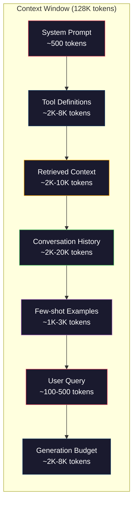
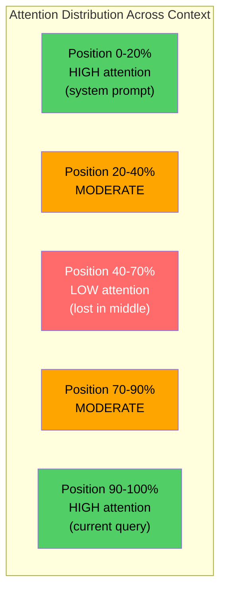
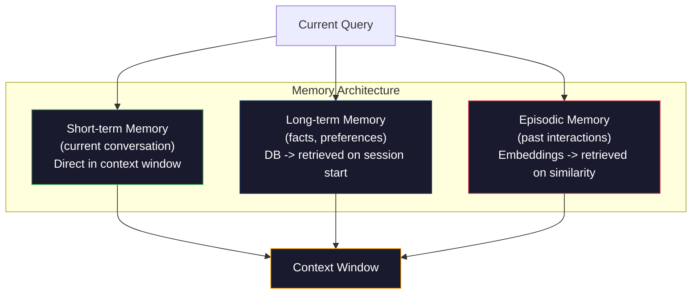

# Проектирование контекста: окна, бюджеты, память и поиск

> Проектирование промптов — лишь часть целого. Проектирование контекста — вся игра целиком. Промпт — это строка, которую вы набираете. Контекст — это всё, что попадает в окно модели: системные инструкции, извлечённые документы, определения инструментов, история диалога, примеры с несколькими примерами и сам промпт. Лучшие AI-инженеры в 2026 году — это инженеры контекста. Они решают, что попадает внутрь, что остаётся снаружи и в каком порядке.

**Тип:** Build**Языки:** Python**Предварительные требования:** Фаза 10 (LLMs from Scratch), Фаза 11 Урок 01-02**Время:** ~90 минут**Связанные материалы:** Фаза 11 · 15 (Prompt Caching) — компоновка, дружественная к кешированию, является расширением проектирования контекста. Фаза 5 · 28 (Long-Context Evaluation) — о том, как измерять эффект «потери в середине» с помощью NIAH/RULER.

## Цели обучения

- Рассчитать бюджеты токенов по всем компонентам контекстного окна (системный промпт, инструменты, история, извлечённые документы, запас на генерацию)
- Реализовать стратегии управления контекстным окном: усечение, суммаризация и скользящее окно для истории диалога
- Расставить приоритеты и упорядочить компоненты контекста, чтобы максимизировать внимание модели к наиболее релевантной информации
- Построить сборщик контекста, который динамически распределяет токены в зависимости от типа запроса и доступного места в окне

## Проблема

У Claude Opus 4.7 окно на 200K токенов (1M в бета-версии). У GPT-5 — 400K. У Gemini 3 Pro — 2M. У Llama 4 заявлено 10M. Эти числа звучат огромно, пока вы их не заполните.

Вот реальная раскладка для ассистента по написанию кода. Системный промпт: 500 токенов. Определения инструментов для 50 инструментов: 8000 токенов. Извлечённая документация: 4000 токенов. История диалога (10 ходов): 6000 токенов. Текущий запрос пользователя: 200 токенов. Бюджет на генерацию (максимальный вывод): 4000 токенов. Итого: 22 700 токенов. Это всего 18% окна на 128K.

Но внимание не масштабируется линейно с длиной контекста. Модель с контекстом в 128K токенов платит квадратичную цену за внимание (O(n^2) в ванильных трансформерах, хотя большинство продакшен-моделей используют эффективные варианты механизма внимания). Что важнее, точность поиска деградирует. Тест «Игла в стоге сена» (Needle in a Haystack) показывает, что модели с трудом находят информацию, размещённую в середине длинных контекстов. Исследование Liu et al. (2023) показало, что LLM извлекают информацию из начала и конца длинных контекстов почти с идеальной точностью, но точность падает на 10-20% для информации, размещённой в середине (позиции 40-70% контекста). Этот эффект «потери в середине» (lost-in-the-middle) варьируется от модели к модели, но затрагивает все современные архитектуры.

Практический вывод: наличие 200K доступных токенов не означает, что использование всех 200K токенов эффективно. Тщательно отобранный контекст на 10K токенов часто превосходит по качеству вываленный контекст на 100K токенов. Проектирование контекста — это дисциплина максимизации отношения сигнал/шум внутри контекстного окна.

Каждый токен, который вы помещаете в окно, вытесняет токен, который мог бы нести более релевантную информацию. Каждое нерелевантное определение инструмента, каждый устаревший ход диалога, каждый фрагмент извлечённого текста, который не отвечает на вопрос, — каждый из них немного ухудшает работу модели над задачей.

## Концепция

### Контекстное окно — дефицитный ресурс

Думайте о контекстном окне как об оперативной памяти, а не о диске. Она быстрая и напрямую доступная, но ограниченная. Вы не можете уместить всё. Вам приходится выбирать.



Каждый компонент конкурирует за место. Больше определений инструментов означает меньше места для истории диалога. Больше извлечённого контекста означает меньше места для примеров с несколькими примерами. Проектирование контекста — это искусство распределения этого бюджета для максимизации качества выполнения задачи.

### Потеря в середине

Самое важное эмпирическое открытие в проектировании контекста. Модели лучше уделяют внимание информации в начале и в конце контекста. Информация в середине получает более низкие оценки внимания и с большей вероятностью игнорируется.

Liu et al. (2023) систематически проверили это. Они размещали релевантный документ среди 20 нерелевантных документов в разных позициях и измеряли точность ответов. Когда релевантный документ был первым или последним, точность составляла 85-90%. Когда он был в середине (позиция 10 из 20), точность падала до 60-70%.

Это имеет прямые инженерные последствия:

- Размещайте самую важную информацию в начале (системный промпт, критичные инструкции)
- Размещайте текущий запрос и наиболее релевантный контекст в конце (эффект недавности помогает)
- Относитесь к середине контекста как к зоне наименьшего приоритета
- Если вам необходимо разместить информацию в середине, продублируйте ключевой момент в конце



### Компоненты контекста

**Системный промпт**: задаёт персону, ограничения и правила поведения. Он идёт первым и остаётся неизменным между ходами. Claude Code использует примерно 6000 токенов на системный промпт, включая определения инструментов и поведенческие инструкции. Держите его компактным. Каждое слово в системном промпте повторяется при каждом вызове API.

**Определения инструментов**: каждый инструмент добавляет 50-200 токенов (имя, описание, схема параметров). 50 инструментов по 150 токенов каждый — это 7500 токенов ещё до начала диалога. Динамический выбор инструментов — включение только тех, что релевантны текущему запросу — может сократить это на 60-80%.

**Извлечённый контекст**: документы из векторной базы данных, результаты поиска, содержимое файлов. Качество поиска напрямую определяет качество ответа. Плохой поиск хуже, чем отсутствие поиска — он заполняет окно шумом и активно вводит модель в заблуждение.

**История диалога**: каждое предыдущее сообщение пользователя и ответ ассистента. Растёт линейно с длиной диалога. Диалог на 50 ходов по 200 токенов на ход — это 10 000 токенов истории. Большая часть из них не относится к текущему запросу.

**Примеры с несколькими примерами**: пары вход/выход, демонстрирующие желаемое поведение. Два-три хорошо подобранных примера часто улучшают качество вывода сильнее, чем тысячи токенов инструкций. Но они стоят места.

**Бюджет на генерацию**: токены, зарезервированные для ответа модели. Если вы заполните окно до предела, у модели не останется места для ответа. Резервируйте как минимум 2000-4000 токенов для генерации.

### Стратегии сжатия контекста

**Суммаризация истории**: вместо того чтобы хранить все предыдущие ходы дословно, периодически суммируйте диалог. «Мы обсудили X, решили Y, и пользователь хочет Z» на 100 токенах заменяет 10 ходов, которые заняли бы 2000 токенов. Запускайте суммаризацию, когда история превышает порог (например, 5000 токенов).

**Фильтрация по релевантности**: оцените каждый извлечённый документ относительно текущего запроса и отбросьте документы ниже порога. Если вы извлекли 10 фрагментов, но только 3 релевантны, отбросьте остальные 7. Лучше иметь 3 высокорелевантных фрагмента, чем 10 посредственных.

**Обрезка инструментов**: классифицируйте намерение запроса пользователя и включайте только инструменты, релевантные этому намерению. Вопрос про код не нуждается в инструментах календаря. Вопрос о планировании не нуждается в инструментах файловой системы. Это может сократить определения инструментов с 8000 токенов до 1000.

**Рекурсивная суммаризация**: для очень длинных документов суммируйте поэтапно. Сначала суммируйте каждый раздел, затем суммируйте сами резюме. 50-страничный документ превращается в дайджест на 500 токенов, который улавливает ключевые моменты.

### Системы памяти

Проектирование контекста охватывает три временных горизонта.

**Кратковременная память**: текущий диалог. Хранится напрямую в контекстном окне. Растёт с каждым ходом. Управляется суммаризацией и усечением.

**Долговременная память**: факты и предпочтения, сохраняющиеся между диалогами. «Пользователь предпочитает TypeScript». «Проект использует PostgreSQL». Хранится в базе данных, извлекается при старте сессии. Claude Code хранит это в файлах CLAUDE.md. ChatGPT хранит это в своей функции памяти.

**Эпизодическая память**: конкретные прошлые взаимодействия, которые могут быть релевантны. «В прошлый вторник мы отлаживали похожую проблему в модуле аутентификации». Хранится в виде эмбеддингов, извлекается, когда текущий диалог совпадает с прошлым эпизодом.



### Динамическая сборка контекста

Ключевая идея: разным запросам нужен разный контекст. Статичный системный промпт + статичные инструменты + статичная история — это расточительно. Лучшие системы динамически собирают контекст под каждый запрос.

1. Классифицировать намерение запроса
2. Выбрать релевантные инструменты (не все инструменты)
3. Извлечь релевантные документы (не фиксированный набор)
4. Включить релевантные ходы истории (не всю историю)
5. Добавить примеры с несколькими примерами, соответствующие типу задачи
6. Упорядочить всё по важности: критичное — в начале, важное — в конце, второстепенное — в середине

Это то, что отличает хорошее AI-приложение от отличного. Модель одна и та же. Контекст — вот что отличает.

```figure
lost-in-the-middle
```

## Соберите это

### Шаг 1: счётчик токенов

Вы не можете бюджетировать то, что не можете измерить. Постройте простой счётчик токенов (приближение с использованием разбиения по пробелам, поскольку точное число зависит от токенизатора).

```python
import json
import numpy as np
from collections import OrderedDict

def count_tokens(text):
    if not text:
        return 0
    return int(len(text.split()) * 1.3)

def count_tokens_json(obj):
    return count_tokens(json.dumps(obj))
```

### Шаг 2: менеджер бюджета контекста

Основная абстракция. Менеджер бюджета отслеживает, сколько токенов использует каждый компонент, и обеспечивает соблюдение лимитов.

```python
class ContextBudget:
    def __init__(self, max_tokens=128000, generation_reserve=4000):
        self.max_tokens = max_tokens
        self.generation_reserve = generation_reserve
        self.available = max_tokens - generation_reserve
        self.allocations = OrderedDict()

    def allocate(self, component, content, max_tokens=None):
        tokens = count_tokens(content)
        if max_tokens and tokens > max_tokens:
            words = content.split()
            target_words = int(max_tokens / 1.3)
            content = " ".join(words[:target_words])
            tokens = count_tokens(content)

        used = sum(self.allocations.values())
        if used + tokens > self.available:
            allowed = self.available - used
            if allowed <= 0:
                return None, 0
            words = content.split()
            target_words = int(allowed / 1.3)
            content = " ".join(words[:target_words])
            tokens = count_tokens(content)

        self.allocations[component] = tokens
        return content, tokens

    def remaining(self):
        used = sum(self.allocations.values())
        return self.available - used

    def utilization(self):
        used = sum(self.allocations.values())
        return used / self.max_tokens

    def report(self):
        total_used = sum(self.allocations.values())
        lines = []
        lines.append(f"Context Budget Report ({self.max_tokens:,} token window)")
        lines.append("-" * 50)
        for component, tokens in self.allocations.items():
            pct = tokens / self.max_tokens * 100
            bar = "#" * int(pct / 2)
            lines.append(f"  {component:<25} {tokens:>6} tokens ({pct:>5.1f}%) {bar}")
        lines.append("-" * 50)
        lines.append(f"  {'Used':<25} {total_used:>6} tokens ({total_used/self.max_tokens*100:.1f}%)")
        lines.append(f"  {'Generation reserve':<25} {self.generation_reserve:>6} tokens")
        lines.append(f"  {'Remaining':<25} {self.remaining():>6} tokens")
        return "\n".join(lines)
```

### Шаг 3: переупорядочивание при потере в середине

Реализуйте стратегию переупорядочивания: самые важные элементы идут в начало и в конец, наименее важные — в середину.

```python
def reorder_lost_in_middle(items, scores):
    paired = sorted(zip(scores, items), reverse=True)
    sorted_items = [item for _, item in paired]

    if len(sorted_items) <= 2:
        return sorted_items

    first_half = sorted_items[::2]
    second_half = sorted_items[1::2]
    second_half.reverse()

    return first_half + second_half

def score_relevance(query, documents):
    query_words = set(query.lower().split())
    scores = []
    for doc in documents:
        doc_words = set(doc.lower().split())
        if not query_words:
            scores.append(0.0)
            continue
        overlap = len(query_words & doc_words) / len(query_words)
        scores.append(round(overlap, 3))
    return scores
```

### Шаг 4: компрессор истории диалога

Суммируйте старые ходы диалога, чтобы вернуть бюджет токенов.

```python
class ConversationManager:
    def __init__(self, max_history_tokens=5000):
        self.turns = []
        self.summaries = []
        self.max_history_tokens = max_history_tokens

    def add_turn(self, role, content):
        self.turns.append({"role": role, "content": content})
        self._compress_if_needed()

    def _compress_if_needed(self):
        total = sum(count_tokens(t["content"]) for t in self.turns)
        if total <= self.max_history_tokens:
            return

        while total > self.max_history_tokens and len(self.turns) > 4:
            old_turns = self.turns[:2]
            summary = self._summarize_turns(old_turns)
            self.summaries.append(summary)
            self.turns = self.turns[2:]
            total = sum(count_tokens(t["content"]) for t in self.turns)

    def _summarize_turns(self, turns):
        parts = []
        for t in turns:
            content = t["content"]
            if len(content) > 100:
                content = content[:100] + "..."
            parts.append(f"{t['role']}: {content}")
        return "Previous: " + " | ".join(parts)

    def get_context(self):
        parts = []
        if self.summaries:
            parts.append("[Conversation Summary]")
            for s in self.summaries:
                parts.append(s)
        parts.append("[Recent Conversation]")
        for t in self.turns:
            parts.append(f"{t['role']}: {t['content']}")
        return "\n".join(parts)

    def token_count(self):
        return count_tokens(self.get_context())
```

### Шаг 5: динамический селектор инструментов

Включайте только инструменты, релевантные текущему запросу. Классифицируйте намерение, затем фильтруйте.

```python
TOOL_REGISTRY = {
    "read_file": {
        "description": "Read contents of a file",
        "tokens": 120,
        "categories": ["code", "files"],
    },
    "write_file": {
        "description": "Write content to a file",
        "tokens": 150,
        "categories": ["code", "files"],
    },
    "search_code": {
        "description": "Search for patterns in codebase",
        "tokens": 130,
        "categories": ["code"],
    },
    "run_command": {
        "description": "Execute a shell command",
        "tokens": 140,
        "categories": ["code", "system"],
    },
    "create_calendar_event": {
        "description": "Create a new calendar event",
        "tokens": 180,
        "categories": ["calendar"],
    },
    "list_emails": {
        "description": "List recent emails",
        "tokens": 160,
        "categories": ["email"],
    },
    "send_email": {
        "description": "Send an email message",
        "tokens": 200,
        "categories": ["email"],
    },
    "web_search": {
        "description": "Search the web for information",
        "tokens": 140,
        "categories": ["research"],
    },
    "query_database": {
        "description": "Run a SQL query on the database",
        "tokens": 170,
        "categories": ["code", "data"],
    },
    "generate_chart": {
        "description": "Generate a chart from data",
        "tokens": 190,
        "categories": ["data", "visualization"],
    },
}

def classify_intent(query):
    query_lower = query.lower()

    intent_keywords = {
        "code": ["code", "function", "bug", "error", "file", "implement", "refactor", "debug", "test"],
        "calendar": ["meeting", "schedule", "calendar", "appointment", "event"],
        "email": ["email", "mail", "send", "inbox", "message"],
        "research": ["search", "find", "what is", "how does", "explain", "look up"],
        "data": ["data", "query", "database", "chart", "graph", "analytics", "sql"],
    }

    scores = {}
    for intent, keywords in intent_keywords.items():
        score = sum(1 for kw in keywords if kw in query_lower)
        if score > 0:
            scores[intent] = score

    if not scores:
        return ["code"]

    max_score = max(scores.values())
    return [intent for intent, score in scores.items() if score >= max_score * 0.5]

def select_tools(query, token_budget=2000):
    intents = classify_intent(query)
    relevant = {}
    total_tokens = 0

    for name, tool in TOOL_REGISTRY.items():
        if any(cat in intents for cat in tool["categories"]):
            if total_tokens + tool["tokens"] <= token_budget:
                relevant[name] = tool
                total_tokens += tool["tokens"]

    return relevant, total_tokens
```

### Шаг 6: полный конвейер сборки контекста

Соедините всё вместе. Дан запрос — динамически соберите оптимальный контекст.

```python
class ContextEngine:
    def __init__(self, max_tokens=128000, generation_reserve=4000):
        self.budget = ContextBudget(max_tokens, generation_reserve)
        self.conversation = ConversationManager(max_history_tokens=5000)
        self.system_prompt = (
            "You are a helpful AI assistant. You have access to tools for "
            "code editing, file management, web search, and data analysis. "
            "Use the appropriate tools for each task. Be concise and accurate."
        )
        self.knowledge_base = [
            "Python 3.12 introduced type parameter syntax for generic classes using bracket notation.",
            "The project uses PostgreSQL 16 with pgvector for embedding storage.",
            "Authentication is handled by Supabase Auth with JWT tokens.",
            "The frontend is built with Next.js 15 using the App Router.",
            "API rate limits are set to 100 requests per minute per user.",
            "The deployment pipeline uses GitHub Actions with Docker multi-stage builds.",
            "Test coverage must be above 80% for all new modules.",
            "The codebase follows the repository pattern for data access.",
        ]

    def assemble(self, query):
        self.budget = ContextBudget(self.budget.max_tokens, self.budget.generation_reserve)

        system_content, _ = self.budget.allocate("system_prompt", self.system_prompt, max_tokens=1000)

        tools, tool_tokens = select_tools(query, token_budget=2000)
        tool_text = json.dumps(list(tools.keys()))
        tool_content, _ = self.budget.allocate("tools", tool_text, max_tokens=2000)

        relevance = score_relevance(query, self.knowledge_base)
        threshold = 0.1
        relevant_docs = [
            doc for doc, score in zip(self.knowledge_base, relevance)
            if score >= threshold
        ]

        if relevant_docs:
            doc_scores = [s for s in relevance if s >= threshold]
            reordered = reorder_lost_in_middle(relevant_docs, doc_scores)
            doc_text = "\n".join(reordered)
            doc_content, _ = self.budget.allocate("retrieved_context", doc_text, max_tokens=3000)

        history_text = self.conversation.get_context()
        if history_text.strip():
            history_content, _ = self.budget.allocate("conversation_history", history_text, max_tokens=5000)

        query_content, _ = self.budget.allocate("user_query", query, max_tokens=500)

        return self.budget

    def chat(self, query):
        self.conversation.add_turn("user", query)
        budget = self.assemble(query)
        response = f"[Response to: {query[:50]}...]"
        self.conversation.add_turn("assistant", response)
        return budget


def run_demo():
    print("=" * 60)
    print("  Context Engineering Pipeline Demo")
    print("=" * 60)

    engine = ContextEngine(max_tokens=128000, generation_reserve=4000)

    print("\n--- Query 1: Code task ---")
    budget = engine.chat("Fix the bug in the authentication module where JWT tokens expire too early")
    print(budget.report())

    print("\n--- Query 2: Research task ---")
    budget = engine.chat("What is the best approach for implementing vector search in PostgreSQL?")
    print(budget.report())

    print("\n--- Query 3: After conversation history builds up ---")
    for i in range(8):
        engine.conversation.add_turn("user", f"Follow-up question number {i+1} about the implementation details of the system")
        engine.conversation.add_turn("assistant", f"Here is the response to follow-up {i+1} with technical details about the architecture")

    budget = engine.chat("Now implement the changes we discussed")
    print(budget.report())

    print("\n--- Tool Selection Examples ---")
    test_queries = [
        "Fix the bug in auth.py",
        "Schedule a meeting with the team for Tuesday",
        "Show me the database query performance stats",
        "Search for best practices on error handling",
    ]

    for q in test_queries:
        tools, tokens = select_tools(q)
        intents = classify_intent(q)
        print(f"\n  Query: {q}")
        print(f"  Intents: {intents}")
        print(f"  Tools: {list(tools.keys())} ({tokens} tokens)")

    print("\n--- Lost-in-the-Middle Reordering ---")
    docs = ["Doc A (most relevant)", "Doc B (somewhat relevant)", "Doc C (least relevant)",
            "Doc D (relevant)", "Doc E (moderately relevant)"]
    scores = [0.95, 0.60, 0.20, 0.80, 0.50]
    reordered = reorder_lost_in_middle(docs, scores)
    print(f"  Original order: {docs}")
    print(f"  Scores:         {scores}")
    print(f"  Reordered:      {reordered}")
    print(f"  (Most relevant at start and end, least relevant in middle)")
```

## Используйте это

### Контекст под управлением среды выполнения

Claude Code управляет контекстом с помощью многослойного подхода. Системный промпт включает поведенческие правила и определения инструментов (~6K токенов). Когда вы открываете файл, его содержимое внедряется в контекст. Когда вы выполняете поиск, результаты добавляются. Старые ходы диалога суммируются. CLAUDE.md предоставляет долговременную память, сохраняющуюся между сессиями.

Ключевое инженерное решение: Claude Code не вываливает всю вашу кодовую базу в контекст. Он извлекает релевантные файлы по запросу. Это проектирование контекста на практике.

### Динамическая загрузка контекста

Cursor индексирует всю вашу кодовую базу в эмбеддинги. Когда вы вводите запрос, он извлекает наиболее релевантные файлы и блоки кода с помощью векторного сходства. В контекстное окно попадают только эти фрагменты. Кодовая база на 500K строк сжимается до 5-10 наиболее релевантных блоков кода.

Это и есть паттерн: превратить всё в эмбеддинги, извлекать по запросу, включать только то, что имеет значение.

### Долговременная память ассистента

ChatGPT хранит предпочтения и факты о пользователе как долговременную память. При старте каждого диалога релевантные воспоминания извлекаются и включаются в системный промпт. «Пользователь предпочитает Python» стоит 5 токенов, но экономит сотни токенов повторяющихся инструкций в разных диалогах.

### RAG как проектирование контекста

Генерация с дополнением поиском (RAG) — это формализованное проектирование контекста. Вместо того чтобы вкладывать знания в веса модели (обучение) или в системный промпт (статичный контекст), вы извлекаете релевантные документы во время запроса и внедряете их в контекстное окно. Весь конвейер RAG — разбиение на фрагменты, эмбеддинг, поиск, реранжирование — существует для решения одной проблемы: разместить нужную информацию в контекстном окне.

## Итоговое задание

Этот урок производит `outputs/prompt-context-optimizer.md` — переиспользуемый промпт, который проверяет стратегию сборки контекста и рекомендует оптимизации. Подайте на вход свой системный промпт, количество инструментов, среднюю длину истории и стратегию поиска — и он выявит потери токенов и предложит улучшения.

Он также производит `outputs/skill-context-engineering.md` — фреймворк для принятия решений при проектировании конвейеров сборки контекста на основе типа задачи, размера контекстного окна и бюджета задержки.

## Упражнения

1. Добавьте «детектор потери токенов» в класс ContextBudget. Он должен помечать компоненты, использующие более 30% бюджета, и предлагать стратегии сжатия, специфичные для типа каждого компонента (суммаризация истории, обрезка инструментов, повторное ранжирование документов).

2. Реализуйте семантическую дедупликацию для извлечённого контекста. Если два извлечённых документа совпадают более чем на 80% (по пересечению слов или косинусному сходству их эмбеддингов), оставьте только тот, у которого выше оценка. Измерьте, сколько бюджета токенов это возвращает.

3. Постройте инструмент «повтор контекста». Дана транскрипция диалога — прогоните её через ContextEngine и визуализируйте, как распределение бюджета меняется ход за ходом. Постройте график использования токенов по компонентам во времени. Определите ход, на котором контекст начинает сжиматься.

4. Реализуйте приоритетный селектор инструментов. Вместо бинарного включения/исключения назначьте каждому инструменту оценку релевантности текущему запросу. Включайте инструменты в порядке убывания релевантности, пока не исчерпается бюджет инструментов. Сравните качество выполнения задачи при 5, 10, 20 и 50 включённых инструментах.

5. Постройте многостратегийный компрессор контекста. Реализуйте три стратегии сжатия (усечение, суммаризация, извлечение ключевых предложений) и протестируйте их на наборе из 20 документов. Измерьте компромисс между коэффициентом сжатия и сохранением информации (содержит ли сжатая версия по-прежнему ответ на запрос?).

## Ключевые термины

| Термин | Что говорят люди | Что это на самом деле означает |
|------|----------------|----------------------|
| Контекстное окно | «Сколько модель может прочитать» | Максимальное число токенов (вход + выход), которое модель обрабатывает за один прямой проход — 400K для GPT-5, 200K (1M в бета-версии) для Claude Opus 4.7, 2M для Gemini 3 Pro |
| Проектирование контекста | «Продвинутое проектирование промптов» | Дисциплина принятия решений о том, что попадает в контекстное окно, в каком порядке и с каким приоритетом — охватывает поиск, сжатие, выбор инструментов и управление памятью |
| Потеря в середине | «Модели забывают то, что в середине» | Эмпирическое открытие, что LLM лучше уделяют внимание началу и концу контекста, с падением точности на 10-20% для информации, размещённой в середине |
| Бюджет токенов | «Сколько токенов у вас осталось» | Явное распределение ёмкости контекстного окна по компонентам (системный промпт, инструменты, история, поиск, генерация) с лимитами на каждый компонент |
| Динамический контекст | «Загрузка всего на лету» | Сборка контекстного окна по-разному для каждого запроса на основе классификации намерения, выбора релевантных инструментов и результатов поиска |
| Суммаризация истории | «Сжатие диалога» | Замена дословных старых ходов диалога кратким резюме, снижающая затраты токенов при сохранении ключевой информации |
| Обрезка инструментов | «Включение только релевантных инструментов» | Классификация намерения запроса и включение только тех определений инструментов, которые ему соответствуют, снижающая затраты токенов на инструменты на 60-80% |
| Долговременная память | «Запоминание между сессиями» | Факты и предпочтения, хранящиеся в базе данных и извлекаемые при старте сессии — CLAUDE.md, ChatGPT Memory и подобные системы |
| Эпизодическая память | «Запоминание конкретных прошлых событий» | Прошлые взаимодействия, хранящиеся в виде эмбеддингов и извлекаемые, когда текущий запрос похож на прошлый диалог |
| Бюджет на генерацию | «Место для ответа» | Токены, зарезервированные для вывода модели — если контекст полностью заполняет окно, у модели не остаётся места для ответа |

## Дополнительное чтение

- [Liu et al., 2023 — "Lost in the Middle: How Language Models Use Long Contexts"](https://arxiv.org/abs/2307.03172) — определяющее исследование о позиционно-зависимом внимании, показывающее, что модели с трудом справляются с информацией в середине длинных контекстов
- [Anthropic's Contextual Retrieval blog post](https://www.anthropic.com/news/contextual-retrieval) — как Anthropic подходит к контекстно-зависимому извлечению фрагментов, снижая частоту сбоев поиска на 49%
- [Simon Willison's "Context Engineering"](https://simonwillison.net/2025/Jun/27/context-engineering/) — пост в блоге, давший название этой дисциплине и отделивший её от проектирования промптов
- [LangChain documentation on RAG](https://python.langchain.com/docs/tutorials/rag/) — практическая реализация генерации с дополнением поиском как паттерна проектирования контекста
- [Greg Kamradt's Needle in a Haystack test](https://github.com/gkamradt/LLMTest_NeedleInAHaystack) — бенчмарк, выявивший позиционно-зависимые сбои поиска у всех основных моделей
- [Pope et al., "Efficiently Scaling Transformer Inference" (2022)](https://arxiv.org/abs/2211.05102) — почему длина контекста определяет память и задержку, и как KV-кеш, MQA и GQA меняют расчёт бюджета.
- [Agrawal et al., "SARATHI: Efficient LLM Inference by Piggybacking Decodes with Chunked Prefills" (2023)](https://arxiv.org/abs/2308.16369) — две фазы инференса, которые делают длинные промпты дорогими по TTFT, но дешёвыми по TPOT; фундаментальное объяснение компромиссов упаковки контекста.
- [Ainslie et al., "GQA: Training Generalized Multi-Query Transformer Models from Multi-Head Checkpoints" (EMNLP 2023)](https://arxiv.org/abs/2305.13245) — статья про grouped-query attention, сократившая память KV в 8 раз в продакшен-декодерах без потери качества.
