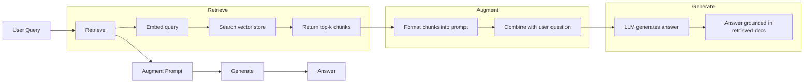
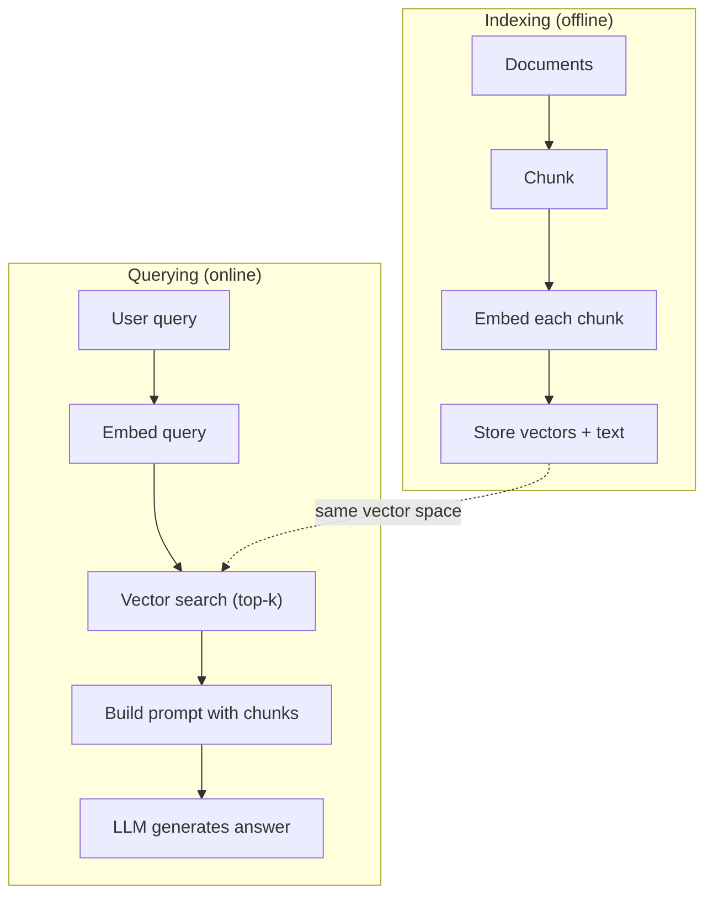

# RAG (генерация с дополнением поиском)

> Ваша большая языковая модель (LLM) знает всё вплоть до момента обрезки обучающих данных. Она ничего не знает о документации вашей компании, вашей кодовой базе или заметках со встречи на прошлой неделе. RAG решает эту проблему: находит релевантные документы и вставляет их в промпт. Это самый распространённый паттерн в продакшен-ИИ. Если вам предстоит построить всего одну вещь из этого курса — постройте RAG-конвейер.

**Тип:** Build
**Языки:** Python
**Предварительные требования:** этап 10 («LLM с нуля»), этап 11, уроки 01–05
**Время:** ~90 минут
**Связанные материалы:** этап 5 · 23 («Стратегии разбиения на фрагменты для RAG») — про шесть алгоритмов разбиения на фрагменты и то, когда каждый из них выигрывает. Этап 5 · 22 («Подробный разбор моделей эмбеддингов») — про выбор модели эмбеддингов. Этап 11 · 07 («Продвинутый RAG») — про гибридный поиск, реранкинг и трансформацию запросов.

## Цели обучения

- Постройте полный RAG-конвейер: загрузка документов, разбиение на фрагменты, эмбеддинг, векторное хранение, поиск и генерация
- Реализуйте семантический поиск с использованием векторной базы данных (ChromaDB, FAISS или Pinecone) с правильной индексацией
- Объясните, почему RAG предпочтительнее дообучения для приложений, основанных на знаниях (стоимость, актуальность, атрибуция)
- Оцените качество RAG с помощью метрик поиска (точность, полнота) и метрик генерации (достоверность, релевантность)

## Проблема

Вы создаёте чат-бота для своей компании. Клиент спрашивает: «Какова политика возврата средств для корпоративных тарифов?» LLM отвечает общей фразой о типичных политиках возврата в SaaS. Реальная политика, спрятанная в 200-страничной внутренней вики, гласит, что корпоративные клиенты получают 60-дневное окно с пропорциональным возвратом средств. LLM никогда не видела этот документ. Она не может знать то, на чём её не обучали.

Дообучение — одно из решений. Возьмите LLM, обучите её на внутренней документации и разверните обновлённую модель. Это работает, но создаёт серьёзные проблемы. Дообучение стоит тысячи долларов вычислений. Модель устаревает в тот момент, когда изменяется хотя бы один документ. У вас нет способа узнать, из какого источника модель почерпнула ответ. А если в следующем месяце компания приобретёт ещё одну продуктовую линейку, вам придётся дообучать модель заново.

RAG — другое решение. Модель остаётся нетронутой. Когда приходит вопрос, вы ищете релевантные фрагменты в хранилище документов, вставляете их в промпт перед вопросом и позволяете модели отвечать, используя эти фрагменты как контекст. Хранилище документов можно обновить за минуты. Вы точно видите, какие документы были найдены. Сама модель никогда не меняется. Именно поэтому RAG — доминирующий паттерн в продакшене: он дешевле, актуальнее, лучше поддаётся аудиту и работает с любой LLM.

## Концепция

### Паттерн RAG

Весь паттерн умещается в четыре шага:



Запрос -> Поиск -> Дополнение промпта -> Генерация. Каждая RAG-система следует этому паттерну. Различия между продакшен-системами RAG — в деталях каждого шага: как вы разбиваете на фрагменты, как эмбеддите, как ищете и как строите промпт.

### Почему RAG превосходит дообучение

| Аспект | Дообучение | RAG |
|---------|------------|-----|
| Стоимость | $1,000-$100,000+ за один цикл обучения | $0.01-$0.10 за запрос (эмбеддинг + LLM) |
| Актуальность | Устаревает до следующего переобучения | Обновляется за минуты путём повторной индексации документов |
| Возможность аудита | Нельзя проследить ответ до источника | Можно показать точные найденные фрагменты |
| Галлюцинации | По-прежнему свободно галлюцинирует | Опирается на найденные документы |
| Конфиденциальность данных | Обучающие данные встроены в веса | Документы остаются в вашем векторном хранилище |

Дообучение необратимо меняет веса модели. RAG временно меняет контекст модели. Для большинства приложений именно временный контекст и нужен.

Единственный случай, когда выигрывает дообучение: когда модели нужно усвоить конкретный стиль, тон или паттерн рассуждений, которого нельзя добиться одним промптингом. Для поиска фактических знаний RAG выигрывает всегда.

### Модели эмбеддингов

Модель эмбеддингов преобразует текст в плотный вектор. Похожие тексты порождают близкие друг к другу векторы в этом многомерном пространстве. «Как сбросить пароль?» и «Мне нужно изменить пароль» порождают почти идентичные векторы, хотя почти не пересекаются по словам. «Кот сидел на коврике» порождает совсем другой вектор.

Распространённые модели эмбеддингов (линейка 2026 года — полный разбор на этапе 5 · 22):

| Модель | Размерность | Провайдер | Примечания |
|-------|-----------|----------|-------|
| text-embedding-3-small | 1536 (матрёшечное представление) | OpenAI | Лучшее соотношение цены и качества для большинства сценариев |
| text-embedding-3-large | 3072 (матрёшечное представление) | OpenAI | Более высокая точность, можно усечь до 256/512/1024 |
| Gemini Embedding 2 | 3072 (матрёшечное представление) | Google | Лучший результат по поиску в MTEB; контекст 8K |
| voyage-4 | 1024/2048 (матрёшечное представление) | Voyage AI | Доменные варианты (код, финансы, право) |
| Cohere embed-v4 | 1024 (матрёшечное представление) | Cohere | Сильная многоязычность, контекст 128K |
| BGE-M3 | 1024 (плотное + разреженное + ColBERT) | BAAI (открытые веса) | Три представления из одной модели |
| Qwen3-Embedding | 4096 (матрёшечное представление) | Alibaba (открытые веса) | Лучший результат поиска среди моделей с открытыми весами |
| all-MiniLM-L6-v2 | 384 | Открытые веса (Sentence Transformers) | Базовый вариант для прототипирования |

Для этого урока мы строим собственный простой эмбеддинг с использованием TF-IDF. Не потому, что TF-IDF используется в продакшен-системах, а потому, что это делает концепцию наглядной: на входе текст, на выходе вектор, похожие тексты порождают похожие векторы.

### Векторное сходство

Даны два вектора — как измерить их сходство? Три варианта:

**Косинусное сходство**: косинус угла между двумя векторами. Изменяется от -1 (противоположные) до 1 (идентичные). Игнорирует величину, учитывает только направление. Это вариант по умолчанию для RAG.

```
cosine_sim(a, b) = dot(a, b) / (||a|| * ||b||)
```

**Скалярное произведение**: скалярное произведение без нормализации. Векторы большей нормы получают более высокие оценки. Полезно, когда величина несёт информацию (более длинные документы могут быть более релевантны).

```
dot(a, b) = sum(a_i * b_i)
```

**L2-расстояние (евклидово)**: расстояние по прямой в векторном пространстве. Меньшее расстояние = больше сходства. Чувствительно к разнице величин.

```
L2(a, b) = sqrt(sum((a_i - b_i)^2))
```

Косинусное сходство — стандарт. Оно корректно обрабатывает документы разной длины, потому что нормализует по величине. Когда говорят «векторный поиск», почти всегда имеют в виду косинусное сходство.

### Стратегии разбиения на фрагменты

Документы слишком длинны, чтобы эмбеддить их как единые векторы. 50-страничный PDF может дать ужасный эмбеддинг, потому что содержит десятки тем. Вместо этого документы разбивают на фрагменты и эмбеддят каждый фрагмент отдельно.

**Разбиение фиксированного размера**: разбивайте каждые N токенов. Просто и предсказуемо. Фрагмент в 512 токенов с перекрытием в 50 токенов означает, что фрагмент 1 — это токены 0-511, фрагмент 2 — токены 462-973 и так далее. Перекрытие гарантирует, что предложение не будет разорвано на неудачной границе.

**Семантическое разбиение**: разбивайте по естественным границам. Абзацы, разделы или заголовки Markdown. Каждый фрагмент — связная смысловая единица. Сложнее в реализации, но даёт лучший поиск.

**Рекурсивное разбиение**: сначала пытайтесь разбивать по самой крупной границе (заголовки разделов). Если раздел всё ещё слишком велик, разбивайте по границам абзацев. Если абзац всё ещё слишком велик, разбивайте по границам предложений. Это подход LangChain RecursiveCharacterTextSplitter, и на практике он работает хорошо.

Размер фрагмента важнее, чем принято думать:

- Слишком маленький (64-128 токенов): каждому фрагменту не хватает контекста. «В прошлом квартале этот показатель вырос на 15%» ничего не значит без понимания, о каком показателе идёт речь.
- Слишком большой (2048+ токенов): каждый фрагмент охватывает несколько тем, размывая релевантность. Когда вы ищете данные о выручке, получаете фрагмент, который на 10% о выручке и на 90% о штате сотрудников.
- Золотая середина (256-512 токенов): достаточно контекста, чтобы быть самодостаточным, и достаточно сфокусированности, чтобы быть релевантным.

Большинство продакшен-систем RAG используют фрагменты в 256-512 токенов с перекрытием в 50 токенов. Рекомендации Anthropic по RAG советуют именно этот диапазон.

### Векторные базы данных

После получения эмбеддингов нужно где-то их хранить и искать. Варианты:

| База данных | Тип | Лучше всего подходит для |
|----------|------|----------|
| FAISS | Библиотека (внутри процесса) | Прототипирования, наборов данных от малого до среднего размера |
| Chroma | Лёгкая БД | Локальной разработки, небольших развёртываний |
| Pinecone | Управляемый сервис | Продакшена без нагрузки на эксплуатацию |
| Weaviate | БД с открытым исходным кодом | Продакшена с самостоятельным хостингом |
| pgvector | Расширение Postgres | Случаев, когда вы уже используете Postgres |
| Qdrant | БД с открытым исходным кодом | Высокопроизводительного развёртывания на собственной инфраструктуре |

Для этого урока мы строим простое векторное хранилище в памяти. Оно хранит векторы в списке и выполняет полный перебор для поиска по косинусному сходству. Это эквивалентно FAISS с плоским индексом. Такое решение масштабируется примерно до 100 000 векторов, прежде чем начнёт замедляться. Продакшен-системы используют алгоритмы приближённого поиска ближайших соседей (ANN), например HNSW, чтобы искать среди миллионов векторов за миллисекунды.

### Полный конвейер



Фаза индексации выполняется один раз для каждого документа (или при обновлении документов). Фаза запросов выполняется при каждом пользовательском запросе. В продакшене индексация может обрабатывать миллионы документов за часы. Запросы должны получать ответ менее чем за секунду.

### Реальные цифры

Большинство продакшен-систем RAG используют такие параметры:

- **k = 5-10** найденных фрагментов на запрос
- **Размер фрагмента = 256-512 токенов** с перекрытием в 50 токенов
- **Бюджет контекста**: 2 500-5 000 токенов найденного контента на запрос
- **Полный промпт**: ~8 000-16 000 токенов (системный промпт + найденные фрагменты + история диалога + пользовательский запрос)
- **Размерность эмбеддинга**: 384-3072 в зависимости от модели
- **Пропускная способность индексации**: 100-1 000 документов в секунду при использовании API-эмбеддингов
- **Задержка запроса**: 50-200 мс на поиск, 500-3000 мс на генерацию

```figure
rag-chunking
```

## Соберите это

### Шаг 1: Разбиение документов на фрагменты

```python
def chunk_text(text, chunk_size=200, overlap=50):
    words = text.split()
    chunks = []
    start = 0
    while start < len(words):
        end = start + chunk_size
        chunk = " ".join(words[start:end])
        chunks.append(chunk)
        start += chunk_size - overlap
    return chunks
```

### Шаг 2: Эмбеддинги TF-IDF

Мы строим простую функцию эмбеддинга. TF-IDF (частота термина — обратная частота документа) — не нейросетевой эмбеддинг, но он преобразует текст в векторы так, что учитывает важность слов. Частые слова в документе получают более высокий TF. Редкие в корпусе слова получают более высокий IDF. Произведение даёт вектор, в котором важные, отличительные слова имеют высокие значения.

```python
import math
from collections import Counter

def build_vocabulary(documents):
    vocab = set()
    for doc in documents:
        vocab.update(doc.lower().split())
    return sorted(vocab)

def compute_tf(text, vocab):
    words = text.lower().split()
    count = Counter(words)
    total = len(words)
    return [count.get(word, 0) / total for word in vocab]

def compute_idf(documents, vocab):
    n = len(documents)
    idf = []
    for word in vocab:
        doc_count = sum(1 for doc in documents if word in doc.lower().split())
        idf.append(math.log((n + 1) / (doc_count + 1)) + 1)
    return idf

def tfidf_embed(text, vocab, idf):
    tf = compute_tf(text, vocab)
    return [t * i for t, i in zip(tf, idf)]
```

### Шаг 3: Поиск по косинусному сходству

```python
def cosine_similarity(a, b):
    dot = sum(x * y for x, y in zip(a, b))
    norm_a = math.sqrt(sum(x * x for x in a))
    norm_b = math.sqrt(sum(x * x for x in b))
    if norm_a == 0 or norm_b == 0:
        return 0.0
    return dot / (norm_a * norm_b)

def search(query_embedding, stored_embeddings, top_k=5):
    scores = []
    for i, emb in enumerate(stored_embeddings):
        sim = cosine_similarity(query_embedding, emb)
        scores.append((i, sim))
    scores.sort(key=lambda x: x[1], reverse=True)
    return scores[:top_k]
```

### Шаг 4: Построение промпта

Именно здесь происходит «дополнение» в RAG. Возьмите найденные фрагменты, отформатируйте их в промпт и попросите LLM ответить на основе предоставленного контекста.

```python
def build_rag_prompt(query, retrieved_chunks):
    context = "\n\n---\n\n".join(
        f"[Source {i+1}]\n{chunk}"
        for i, chunk in enumerate(retrieved_chunks)
    )
    return f"""Answer the question based ONLY on the following context.
If the context doesn't contain enough information, say "I don't have enough information to answer that."

Context:
{context}

Question: {query}

Answer:"""
```

### Шаг 5: Полный RAG-конвейер

```python
class RAGPipeline:
    def __init__(self):
        self.chunks = []
        self.embeddings = []
        self.vocab = []
        self.idf = []

    def index(self, documents):
        all_chunks = []
        for doc in documents:
            all_chunks.extend(chunk_text(doc))
        self.chunks = all_chunks
        self.vocab = build_vocabulary(all_chunks)
        self.idf = compute_idf(all_chunks, self.vocab)
        self.embeddings = [
            tfidf_embed(chunk, self.vocab, self.idf)
            for chunk in all_chunks
        ]

    def query(self, question, top_k=5):
        query_emb = tfidf_embed(question, self.vocab, self.idf)
        results = search(query_emb, self.embeddings, top_k)
        retrieved = [(self.chunks[i], score) for i, score in results]
        prompt = build_rag_prompt(
            question, [chunk for chunk, _ in retrieved]
        )
        return prompt, retrieved
```

### Шаг 6: Генерация (симуляция)

В продакшене здесь вы вызываете LLM API. Для этого урока мы симулируем генерацию, извлекая наиболее релевантное предложение из найденного контекста.

```python
def simple_generate(prompt, retrieved_chunks):
    query_words = set(prompt.lower().split("question:")[-1].split())
    best_sentence = ""
    best_score = 0
    for chunk in retrieved_chunks:
        for sentence in chunk.split("."):
            sentence = sentence.strip()
            if not sentence:
                continue
            words = set(sentence.lower().split())
            overlap = len(query_words & words)
            if overlap > best_score:
                best_score = overlap
                best_sentence = sentence
    return best_sentence if best_sentence else "I don't have enough information."
```

## Используйте это

С реальной моделью эмбеддингов и LLM код почти не меняется:

```python
from openai import OpenAI

client = OpenAI()

def embed(text):
    response = client.embeddings.create(
        model="text-embedding-3-small",
        input=text
    )
    return response.data[0].embedding

def generate(prompt):
    response = client.chat.completions.create(
        model="gpt-4o-mini",
        messages=[{"role": "user", "content": prompt}],
        temperature=0
    )
    return response.choices[0].message.content
```

Или с Anthropic:

```python
import anthropic

client = anthropic.Anthropic()

def generate(prompt):
    response = client.messages.create(
        model="claude-sonnet-5",
        max_tokens=1024,
        messages=[{"role": "user", "content": prompt}]
    )
    return response.content[0].text
```

Конвейер остаётся тем же. Замените функцию эмбеддинга. Замените функцию генерации. Логика поиска, разбиение на фрагменты, построение промпта — всё одинаково независимо от того, какие модели вы используете.

Для векторного хранения в масштабе замените полный перебор на полноценную векторную базу данных:

```python
import chromadb

client = chromadb.Client()
collection = client.create_collection("my_docs")

collection.add(
    documents=chunks,
    ids=[f"chunk_{i}" for i in range(len(chunks))]
)

results = collection.query(
    query_texts=["What is the refund policy?"],
    n_results=5
)
```

Chroma обрабатывает эмбеддинг внутри себя (по умолчанию использует all-MiniLM-L6-v2) и хранит векторы в локальной базе данных. Тот же паттерн, другая обвязка.

## Итоговое задание

Этот урок производит:
- `outputs/prompt-rag-architect.md` — промпт для проектирования RAG-систем под конкретные сценарии использования
- `outputs/skill-rag-pipeline.md` — навык, который учит агентов строить и отлаживать RAG-конвейеры

## Упражнения

1. Замените эмбеддинги TF-IDF на простой подход «мешок слов» (бинарный: 1, если слово присутствует, 0, если нет). Сравните качество поиска на тестовых документах. TF-IDF должен показать себя лучше, потому что придаёт больший вес редким словам.

2. Поэкспериментируйте с размерами фрагментов: попробуйте 50, 100, 200 и 500 слов на одном и том же наборе документов. Для каждого размера прогоните одни и те же 5 запросов и посчитайте, сколько раз в топ-3 попадает релевантный фрагмент. Найдите золотую середину, где качество поиска достигает пика.

3. Добавьте метаданные к каждому фрагменту (имя исходного документа, позиция фрагмента). Измените шаблон промпта так, чтобы включить атрибуцию источника, — чтобы LLM указывала свои источники.

4. Реализуйте простое оценивание: для 10 пар вопрос-ответ прогоните каждый вопрос через RAG-конвейер и измерьте, какой процент найденных фрагментов содержит ответ. Это полнота поиска при k.

5. Постройте RAG-конвейер с учётом истории диалога: храните историю последних 3 обменов репликами и включайте её в промпт вместе с найденными фрагментами. Протестируйте на уточняющих вопросах вроде «А что насчёт корпоративного тарифа?» после вопроса о ценах.

## Ключевые термины

| Термин | Что говорят люди | Что это на самом деле означает |
|------|----------------|----------------------|
| RAG | «ИИ, который читает вашу документацию» | Найти релевантные документы, вставить их в промпт и сгенерировать ответ, основанный на этих документах |
| Эмбеддинг | «Превратить текст в числа» | Плотное векторное представление текста, в котором похожие по смыслу тексты порождают похожие векторы |
| Векторная база данных | «Поисковик для ИИ» | Хранилище данных, оптимизированное для хранения векторов и поиска ближайших соседей по сходству |
| Разбиение на фрагменты | «Разбить документы на части» | Разделение документов на более мелкие сегменты (обычно 256-512 токенов), чтобы каждый можно было эмбеддить и находить независимо |
| Косинусное сходство | «Насколько похожи два вектора» | Косинус угла между двумя векторами; 1 = идентичное направление, 0 = ортогональность, -1 = противоположное направление |
| Топ-k поиск | «Получить k лучших совпадений» | Вернуть k наиболее похожих на запрос фрагментов из векторного хранилища |
| Контекстное окно | «Сколько текста может увидеть LLM» | Максимальное число токенов, которое LLM может обработать за один запрос; найденные фрагменты должны в него уместиться |
| Генерация с дополнением | «Отвечать, используя данный контекст» | Генерация ответа с использованием найденных документов как контекста вместо опоры исключительно на знания, усвоенные при обучении |
| TF-IDF | «Оценка важности слова» | Частота термина, умноженная на обратную частоту документа; придаёт словам вес в зависимости от их отличительности в корпусе |
| Индексация | «Подготовка документов к поиску» | Офлайн-процесс разбиения на фрагменты, эмбеддинга и сохранения документов, чтобы их можно было искать во время запроса |

## Дополнительное чтение

- Lewis et al., "Retrieval-Augmented Generation for Knowledge-Intensive NLP Tasks" (2020) — оригинальная статья о RAG от Facebook AI Research, формализовавшая паттерн «сначала найти, потом сгенерировать»
- Документация Anthropic по RAG (docs.anthropic.com) — практические рекомендации по размеру фрагментов, построению промптов и оцениванию
- Pinecone Learning Center, «Что такое RAG?» — понятные визуальные объяснения RAG-конвейера с учётом продакшен-нюансов
- Sentence-BERT: Reimers & Gurevych (2019) — статья, лежащая в основе моделей эмбеддингов all-MiniLM, показывающая, как обучать би-энкодеры для семантического сходства
- [Karpukhin et al., "Dense Passage Retrieval for Open-Domain Question Answering" (EMNLP 2020)](https://arxiv.org/abs/2004.04906) — статья о DPR, доказавшая, что плотный поиск на би-энкодерах превосходит BM25 в ответах на вопросы без ограничения предметной области, и задавшая паттерн для современных ретриверов RAG.
- [Основные понятия LlamaIndex](https://docs.llamaindex.ai/en/stable/getting_started/concepts.html) — основные понятия, которые нужно знать при построении RAG-конвейеров: загрузчики данных, парсеры узлов, индексы, ретриверы, синтезаторы ответов.
- [Руководство LangChain по RAG](https://python.langchain.com/docs/tutorials/rag/) — оркестратор с противоположным подходом; взгляд на тот же паттерн «сначала найти, потом сгенерировать» через цепочки выполняемых объектов.
