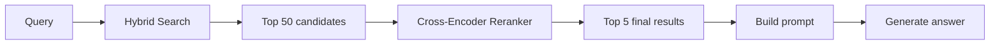
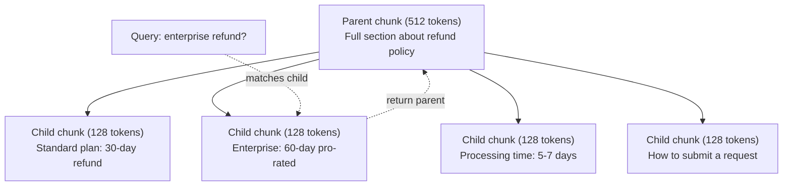
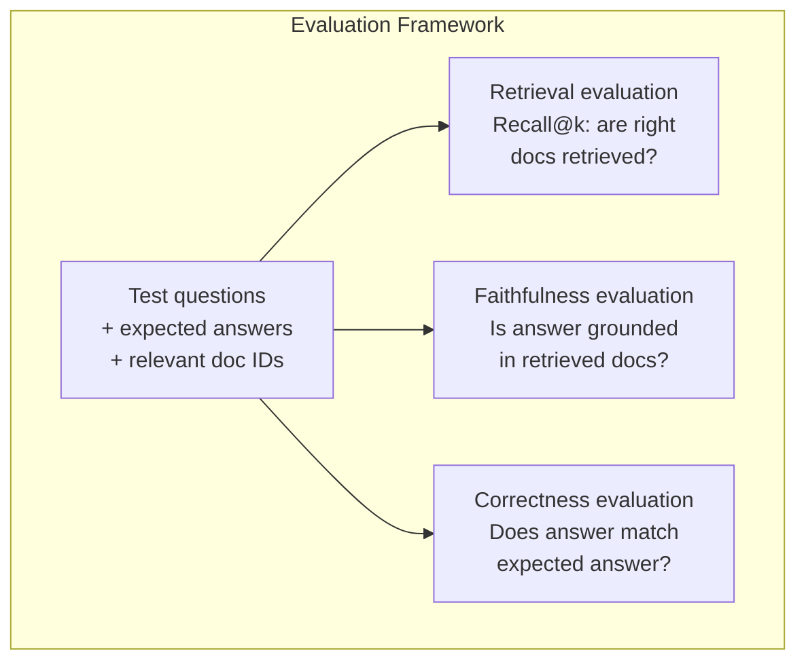

# Продвинутый RAG (разбиение на фрагменты, реранкинг, гибридный поиск)

> Базовый RAG находит топ-k наиболее похожих фрагментов. Это работает для простых вопросов. Но подход рассыпается при многошаговых (multi-hop) рассуждениях, неоднозначных запросах и больших корпусах. Продвинутый RAG — это разница между демо, которое работает на 10 документах, и системой, которая работает на 10 миллионах.

**Тип:** Build**Языки:** Python**Предварительные требования:** Фаза 11, Урок 06 (RAG)**Время:** ~90 минут**Связанные материалы:** Фаза 5 · 23 (Chunking Strategies for RAG) — про все шесть алгоритмов разбиения на фрагменты: рекурсивное, семантическое, по предложениям, parent-document, позднее разбиение (late chunking), контекстуальный поиск (contextual retrieval) — с бенчмарками Vectara/Anthropic. Этот урок строится поверх них: гибридный поиск, реранкинг, трансформация запросов.

## Цели обучения

- Реализуйте продвинутые стратегии разбиения на фрагменты (семантическое, рекурсивное, parent-child), сохраняющие структуру и контекст документа
- Постройте пайплайн гибридного поиска, объединяющий ключевой поиск BM25 с семантическим векторным поиском и реранкером на основе cross-encoder
- Примените техники трансформации запросов (HyDE, multi-query, step-back) для улучшения поиска по неоднозначным или сложным вопросам
- Диагностируйте и устраняйте типичные сбои RAG: найден не тот фрагмент, ответа нет в контексте, разрыв многошагового рассуждения

## Проблема

Вы построили базовый RAG-пайплайн в Уроке 06. Он работает для простых вопросов на небольшом корпусе. А теперь попробуйте вот это:

**Неоднозначный запрос**: «Какая была выручка в прошлом квартале?» Семантический поиск возвращает фрагменты о стратегии по выручке, прогнозах выручки и мыслях финансового директора о росте выручки. Все семантически похожи на слово «выручка». Ни один не содержит фактического числа. Правильный фрагмент гласит «$47.2M in Q3 2025», но использует слово «earnings» вместо «revenue». Модель эмбеддингов считает, что «revenue strategy» ближе к запросу, чем «Q3 earnings were $47.2M».

**Многошаговый вопрос**: «У какой команды больше всего выросла оценка удовлетворённости клиентов?» Это требует найти оценки удовлетворённости для каждой команды, сравнить их и определить максимум. Ни один отдельный фрагмент не содержит ответа. Информация рассеяна по отчётам разных команд.

**Проблема большого корпуса**: у вас 2 миллиона фрагментов. Правильный ответ — во фрагменте №1 847 293. Ваш топ-5 поиска вытаскивает фрагменты №14, №89 201, №1 200 000, №44 и №901 333. Близко в пространстве эмбеддингов, но ни один не содержит ответа. На таком масштабе приближённый поиск ближайших соседей вносит достаточно ошибок, чтобы релевантные результаты вылетали из топ-k.

Базовый RAG даёт сбой, потому что векторное сходство — не то же самое, что релевантность. Фрагмент может быть семантически похож на запрос, но бесполезен для ответа на него. Продвинутый RAG решает это четырьмя техниками: гибридный поиск (добавление ключевого поиска), реранкинг (более тщательная оценка кандидатов), трансформация запроса (исправление запроса перед поиском) и улучшенное разбиение на фрагменты (поиск на нужном уровне детализации).

## Концепция

### Гибридный поиск: семантика + ключевые слова

Семантический поиск (векторное сходство) хорошо понимает смысл. «How do I cancel my subscription?» совпадает с «Steps to terminate your plan», даже если у них нет общих слов. Но он упускает точные совпадения. «Error code E-4021» может не совпасть с фрагментом, содержащим «E-4021», если модель эмбеддингов сочтёт это шумом.

Ключевой поиск (BM25) — противоположность. Он превосходен в точных совпадениях. «E-4021» совпадает идеально. Но «cancel my subscription» вернёт ноль результатов, если в документе написано «terminate your plan».

Гибридный поиск запускает оба варианта, а затем объединяет результаты.

**BM25** (Best Matching 25) — стандартный алгоритм ключевого поиска. Он остаётся основой поисковых систем с 1990-х годов. Формула:

```
BM25(q, d) = sum over terms t in q:
    IDF(t) * (tf(t,d) * (k1 + 1)) / (tf(t,d) + k1 * (1 - b + b * |d| / avgdl))
```

Здесь tf(t,d) — частота термина t в документе d, IDF(t) — обратная частота документа, |d| — длина документа, avgdl — средняя длина документа, k1 управляет насыщением частоты термина (по умолчанию 1.2), а b управляет нормализацией по длине (по умолчанию 0.75).

Проще говоря: BM25 присваивает документам более высокую оценку, если они содержат термины запроса (особенно редкие), но с убывающей отдачей при повторении терминов. Документ со словом «revenue», встречающимся 50 раз, не в 50 раз релевантнее документа с этим словом, встречающимся один раз.

### Слияние обратных рангов (Reciprocal Rank Fusion, RRF)

У вас есть два ранжированных списка: один от векторного поиска, другой от BM25. Как их объединить? Слияние обратных рангов (RRF) — стандартный подход.

```
RRF_score(d) = sum over rankings R:
    1 / (k + rank_R(d))
```

Здесь k — константа (обычно 60), которая не даёт результату с самым высоким рангом доминировать.

Документ, занявший #1 место в векторном поиске и #5 в BM25, получает: 1/(60+1) + 1/(60+5) = 0.0164 + 0.0154 = 0.0318

Документ, занявший #3 место в векторном поиске и #2 в BM25, получает: 1/(60+3) + 1/(60+2) = 0.0159 + 0.0161 = 0.0320

RRF естественным образом балансирует два сигнала. Документ, который высоко ранжирован в обоих списках, получает лучшую оценку. Документ, который занял #1 в одном списке, но отсутствует в другом, получает умеренную оценку. Это устойчиво, потому что используются ранги, а не сырые оценки, — так что различия в распределениях оценок между двумя системами не имеют значения.

### Реранкинг

Поиск (векторный, ключевой или гибридный) быстрый, но неточный. Он использует би-энкодеры: запрос и каждый документ эмбеддятся независимо, а затем сравниваются. Эмбеддинги вычисляются один раз и кешируются. Это масштабируется до миллионов документов.

Реранкинг использует cross-encoder'ы: запрос и документ-кандидат подаются вместе в модель, которая выдаёт оценку релевантности. Модель видит оба текста одновременно и может улавливать тонкие взаимодействия между ними. Cross-encoder может понять, что «What were Q3 earnings?» высоко релевантен фрагменту, содержащему «$47.2M in Q3», даже если би-энкодер упустил эту связь.

Компромисс: cross-encoder'ы в 100-1000 раз медленнее би-энкодеров, потому что обрабатывают пару запрос-документ совместно. Нельзя заранее вычислить оценки cross-encoder для миллиона документов. Решение: находить более крупный набор кандидатов (топ-50 от гибридного поиска), а затем реранжировать с помощью cross-encoder, чтобы получить финальный топ-5.



Распространённые модели реранкинга (линейка 2026 года):
- Cohere Rerank 3.5: управляемый API, многоязычный, лучший прирост полноты на смешанных корпусах
- Voyage rerank-2.5: управляемый API, наименьшая задержка среди размещённых в облаке вариантов
- Jina-Reranker-v2 Multilingual: открытые веса, 100+ языков
- bge-reranker-v2-m3: открытые веса, сильный базовый вариант
- cross-encoder/ms-marco-MiniLM-L-6-v2: открытые веса, работает на CPU для прототипирования
- ColBERTv2 / Jina-ColBERT-v2: реранкеры с поздним взаимодействием и несколькими векторами (late-interaction) — O(tokens), а не O(docs) на момент оценки

### Трансформация запроса

Иногда проблема не в поиске, а в самом запросе. «What was that thing about the new policy change?» — ужасный поисковый запрос. В нём нет конкретных терминов. Эмбеддинг получается расплывчатым. Ни одна система поиска не найдёт по нему нужные документы.

**Переписывание запроса**: перефразируйте запрос пользователя в более качественный поисковый запрос. LLM может это сделать:

```
User: "What was that thing about the new policy change?"
Rewritten: "Recent policy changes and updates"
```

**HyDE (Hypothetical Document Embeddings, эмбеддинги гипотетического документа)**: вместо поиска по запросу сгенерируйте гипотетический ответ, заэмбеддите его и ищите похожие реальные документы.

```
Query: "What is the refund policy for enterprise?"
Hypothetical answer: "Enterprise customers are eligible for a full refund
within 60 days of purchase. Refunds are pro-rated based on the remaining
subscription period and processed within 5-7 business days."
```

Заэмбеддите гипотетический ответ и ищите реальные документы, похожие на него. Интуиция такова: гипотетический ответ находится в пространстве эмбеддингов ближе к реальному ответу, чем сам исходный вопрос. Вопросы и ответы имеют разную лингвистическую структуру. Генерируя гипотетический ответ, вы наводите мост между «пространством вопросов» и «пространством ответов» в эмбеддинге.

HyDE добавляет один вызов LLM перед поиском. Это увеличивает задержку на 500-2000 мс. Оправдано, когда качество поиска по исходным запросам низкое.

### Parent-Child разбиение

Стандартное разбиение на фрагменты вынуждает выбирать: маленькие фрагменты для точного поиска или большие фрагменты для достаточного контекста. Parent-child разбиение устраняет этот компромисс.

Индексируйте маленькие фрагменты (128 токенов) для поиска. Когда найден маленький фрагмент, возвращайте его родительский фрагмент (512 токенов) для промпта. Маленький фрагмент точно совпадает с запросом. Родительский фрагмент даёт достаточно контекста, чтобы LLM сгенерировала хороший ответ.



Запрос «enterprise refund?» точно совпадает с дочерним фрагментом C2. Но промпт получает полный родительский фрагмент P, который включает окружающий контекст о времени обработки и процессе подачи заявки.

### Фильтрация по метаданным

Перед запуском векторного поиска отфильтруйте корпус по метаданным: дата, источник, категория, автор, язык. Это уменьшает пространство поиска и предотвращает нерелевантные результаты.

«Что изменилось в политике безопасности в прошлом месяце?» должно искать только среди документов последних 30 дней в категории безопасности. Без фильтрации по метаданным вы ищете по всему корпусу и можете найти двухлетней давности документ по безопасности, который просто оказался семантически похож.

Продакшен-системы RAG хранят метаданные вместе с каждым фрагментом: исходный документ, дата создания, категория, автор, версия. Векторные базы данных поддерживают предварительную фильтрацию по метаданным перед поиском по сходству, что критично для производительности в масштабе.

### Оценивание

Вы построили RAG-систему. Как узнать, работает ли она? Три метрики:

**Релевантность поиска (Recall@k)**: для набора тестовых вопросов с известными релевантными документами — какой процент релевантных документов оказывается в топ-k результатов? Если ответ на вопрос находится во фрагменте №47, попадает ли фрагмент №47 в топ-5?

**Достоверность (Faithfulness)**: основан ли сгенерированный ответ на найденных документах? Если найденные фрагменты гласят «60-дневное окно возврата», а модель говорит «90-дневное окно возврата», это сбой достоверности. Модель галлюцинировала, несмотря на наличие правильного контекста.

**Корректность ответа**: совпадает ли сгенерированный ответ с ожидаемым? Это сквозная метрика. Она объединяет качество поиска и качество генерации.

Простая проверка достоверности: возьмите каждое утверждение в сгенерированном ответе и проверьте, встречается ли оно (по существу) в найденных фрагментах. Если ответ содержит факт, которого нет ни в одном найденном фрагменте, он, вероятно, галлюцинирован.



```figure
agentic-rag-loop
```

## Соберите это

### Шаг 1: Реализация BM25

```python
import math
from collections import Counter

class BM25:
    def __init__(self, k1=1.2, b=0.75):
        self.k1 = k1
        self.b = b
        self.docs = []
        self.doc_lengths = []
        self.avg_dl = 0
        self.doc_freqs = {}
        self.n_docs = 0

    def index(self, documents):
        self.docs = documents
        self.n_docs = len(documents)
        self.doc_lengths = []
        self.doc_freqs = {}

        for doc in documents:
            words = doc.lower().split()
            self.doc_lengths.append(len(words))
            unique_words = set(words)
            for word in unique_words:
                self.doc_freqs[word] = self.doc_freqs.get(word, 0) + 1

        self.avg_dl = sum(self.doc_lengths) / self.n_docs if self.n_docs else 1

    def score(self, query, doc_idx):
        query_words = query.lower().split()
        doc_words = self.docs[doc_idx].lower().split()
        doc_len = self.doc_lengths[doc_idx]
        word_counts = Counter(doc_words)
        score = 0.0

        for term in query_words:
            if term not in word_counts:
                continue
            tf = word_counts[term]
            df = self.doc_freqs.get(term, 0)
            idf = math.log((self.n_docs - df + 0.5) / (df + 0.5) + 1)
            numerator = tf * (self.k1 + 1)
            denominator = tf + self.k1 * (1 - self.b + self.b * doc_len / self.avg_dl)
            score += idf * numerator / denominator

        return score

    def search(self, query, top_k=10):
        scores = [(i, self.score(query, i)) for i in range(self.n_docs)]
        scores.sort(key=lambda x: x[1], reverse=True)
        return scores[:top_k]
```

### Шаг 2: Слияние обратных рангов

```python
def reciprocal_rank_fusion(ranked_lists, k=60):
    scores = {}
    for ranked_list in ranked_lists:
        for rank, (doc_id, _) in enumerate(ranked_list):
            if doc_id not in scores:
                scores[doc_id] = 0.0
            scores[doc_id] += 1.0 / (k + rank + 1)
    fused = sorted(scores.items(), key=lambda x: x[1], reverse=True)
    return fused
```

### Шаг 3: Пайплайн гибридного поиска

```python
def hybrid_search(query, chunks, vector_embeddings, vocab, idf, bm25_index, top_k=5, fusion_k=60):
    query_emb = tfidf_embed(query, vocab, idf)
    vector_results = search(query_emb, vector_embeddings, top_k=top_k * 3)
    bm25_results = bm25_index.search(query, top_k=top_k * 3)
    fused = reciprocal_rank_fusion([vector_results, bm25_results], k=fusion_k)
    return fused[:top_k]
```

### Шаг 4: Простой реранкер

В продакшене вы бы использовали модель cross-encoder. Здесь мы строим реранкер, который оценивает релевантность запроса и документа по пересечению слов, важности терминов и совпадению фраз.

```python
def rerank(query, candidates, chunks):
    query_words = set(query.lower().split())
    stop_words = {"the", "a", "an", "is", "are", "was", "were", "what", "how",
                  "why", "when", "where", "do", "does", "for", "of", "in", "to",
                  "and", "or", "on", "at", "by", "it", "its", "this", "that",
                  "with", "from", "be", "has", "have", "had", "not", "but"}
    query_terms = query_words - stop_words

    scored = []
    for doc_id, initial_score in candidates:
        chunk = chunks[doc_id].lower()
        chunk_words = set(chunk.split())

        term_overlap = len(query_terms & chunk_words)

        query_bigrams = set()
        q_list = [w for w in query.lower().split() if w not in stop_words]
        for i in range(len(q_list) - 1):
            query_bigrams.add(q_list[i] + " " + q_list[i + 1])
        bigram_matches = sum(1 for bg in query_bigrams if bg in chunk)

        position_boost = 0
        for term in query_terms:
            pos = chunk.find(term)
            if pos != -1 and pos < len(chunk) // 3:
                position_boost += 0.5

        rerank_score = (
            term_overlap * 1.0
            + bigram_matches * 2.0
            + position_boost
            + initial_score * 5.0
        )
        scored.append((doc_id, rerank_score))

    scored.sort(key=lambda x: x[1], reverse=True)
    return scored
```

### Шаг 5: HyDE (эмбеддинги гипотетического документа)

```python
def hyde_generate_hypothesis(query):
    templates = {
        "what": "The answer to '{query}' is as follows: Based on our documentation, {topic} involves specific policies and procedures that define how the process works.",
        "how": "To address '{query}': The process involves several steps. First, you need to initiate the request. Then, the system processes it according to the defined rules.",
        "default": "Regarding '{query}': Our records indicate specific details and policies related to this topic that provide a comprehensive answer."
    }
    query_lower = query.lower()
    if query_lower.startswith("what"):
        template = templates["what"]
    elif query_lower.startswith("how"):
        template = templates["how"]
    else:
        template = templates["default"]

    topic_words = [w for w in query.lower().split()
                   if w not in {"what", "is", "the", "how", "do", "does", "a", "an",
                                "for", "of", "to", "in", "on", "at", "by", "and", "or"}]
    topic = " ".join(topic_words) if topic_words else "this topic"

    return template.format(query=query, topic=topic)


def hyde_search(query, chunks, vector_embeddings, vocab, idf, top_k=5):
    hypothesis = hyde_generate_hypothesis(query)
    hypothesis_emb = tfidf_embed(hypothesis, vocab, idf)
    results = search(hypothesis_emb, vector_embeddings, top_k)
    return results, hypothesis
```

### Шаг 6: Parent-Child разбиение

```python
def create_parent_child_chunks(text, parent_size=200, child_size=50):
    words = text.split()
    parents = []
    children = []
    child_to_parent = {}

    parent_idx = 0
    start = 0
    while start < len(words):
        parent_end = min(start + parent_size, len(words))
        parent_text = " ".join(words[start:parent_end])
        parents.append(parent_text)

        child_start = start
        while child_start < parent_end:
            child_end = min(child_start + child_size, parent_end)
            child_text = " ".join(words[child_start:child_end])
            child_idx = len(children)
            children.append(child_text)
            child_to_parent[child_idx] = parent_idx
            child_start += child_size

        parent_idx += 1
        start += parent_size

    return parents, children, child_to_parent
```

### Шаг 7: Оценка достоверности

```python
def evaluate_faithfulness(answer, retrieved_chunks):
    answer_sentences = [s.strip() for s in answer.split(".") if len(s.strip()) > 10]
    if not answer_sentences:
        return 1.0, []

    grounded = 0
    ungrounded = []
    context = " ".join(retrieved_chunks).lower()

    for sentence in answer_sentences:
        words = set(sentence.lower().split())
        stop_words = {"the", "a", "an", "is", "are", "was", "were", "and", "or",
                      "to", "of", "in", "for", "on", "at", "by", "it", "this", "that"}
        content_words = words - stop_words
        if not content_words:
            grounded += 1
            continue

        matched = sum(1 for w in content_words if w in context)
        ratio = matched / len(content_words) if content_words else 0

        if ratio >= 0.5:
            grounded += 1
        else:
            ungrounded.append(sentence)

    score = grounded / len(answer_sentences) if answer_sentences else 1.0
    return score, ungrounded


def evaluate_retrieval_recall(queries_with_relevant, retrieval_fn, k=5):
    total_recall = 0.0
    results = []

    for query, relevant_indices in queries_with_relevant:
        retrieved = retrieval_fn(query, k)
        retrieved_indices = set(idx for idx, _ in retrieved)
        relevant_set = set(relevant_indices)
        hits = len(retrieved_indices & relevant_set)
        recall = hits / len(relevant_set) if relevant_set else 1.0
        total_recall += recall
        results.append({
            "query": query,
            "recall": recall,
            "hits": hits,
            "total_relevant": len(relevant_set)
        })

    avg_recall = total_recall / len(queries_with_relevant) if queries_with_relevant else 0
    return avg_recall, results
```

## Используйте это

С реальным cross-encoder для реранкинга:

```python
from sentence_transformers import CrossEncoder

reranker = CrossEncoder("cross-encoder/ms-marco-MiniLM-L-6-v2")

def rerank_with_cross_encoder(query, candidates, chunks, top_k=5):
    pairs = [(query, chunks[doc_id]) for doc_id, _ in candidates]
    scores = reranker.predict(pairs)
    scored = list(zip([doc_id for doc_id, _ in candidates], scores))
    scored.sort(key=lambda x: x[1], reverse=True)
    return scored[:top_k]
```

С управляемым реранкером Cohere:

```python
import cohere

co = cohere.Client()

def rerank_with_cohere(query, candidates, chunks, top_k=5):
    docs = [chunks[doc_id] for doc_id, _ in candidates]
    response = co.rerank(
        model="rerank-english-v3.0",
        query=query,
        documents=docs,
        top_n=top_k
    )
    return [(candidates[r.index][0], r.relevance_score) for r in response.results]
```

Для HyDE с реальной LLM:

```python
import anthropic

client = anthropic.Anthropic()

def hyde_with_llm(query):
    response = client.messages.create(
        model="claude-sonnet-5",
        max_tokens=256,
        messages=[{
            "role": "user",
            "content": f"Write a short paragraph that would be a good answer to this question. Do not say you don't know. Just write what the answer would look like.\n\nQuestion: {query}"
        }]
    )
    return response.content[0].text
```

Для продакшен гибридного поиска с Weaviate:

```python
import weaviate

client = weaviate.connect_to_local()

collection = client.collections.get("Documents")
response = collection.query.hybrid(
    query="enterprise refund policy",
    alpha=0.5,
    limit=10
)
```

Параметр alpha управляет балансом: 0.0 = чистый ключевой поиск (BM25), 1.0 = чистый векторный поиск, 0.5 = равный вес. Большинство продакшен-систем используют alpha между 0.3 и 0.7.

## Итоговое задание

Этот урок производит:
- `outputs/prompt-advanced-rag-debugger.md` — промпт для диагностики и устранения проблем с качеством RAG
- `outputs/skill-advanced-rag.md` — навык для построения продакшен-уровня RAG с гибридным поиском и реранкингом

## Упражнения

1. Сравните BM25, векторный поиск и гибридный поиск на тестовых документах. Для каждого из 5 тестовых запросов зафиксируйте, какой подход возвращает наиболее релевантный фрагмент на позиции №1. Гибридный поиск должен выиграть как минимум в 3 из 5 случаев.

2. Реализуйте фильтр по метаданным. Добавьте поле «category» к каждому документу (безопасность, биллинг, api, продукт). Перед запуском векторного поиска отфильтруйте фрагменты только по релевантной категории. Протестируйте на вопросе «Какое шифрование используется?» и убедитесь, что поиск идёт только по фрагментам категории безопасности.

3. Постройте полный пайплайн HyDE, используя простую функцию генерации из Урока 06. Сравните качество поиска (релевантность топ-3) между прямым поиском по запросу и поиском через HyDE на всех 5 тестовых запросах. HyDE должен улучшить результаты для расплывчатых запросов.

4. Реализуйте стратегию parent-child разбиения на тестовых документах. Используйте child_size=30 и parent_size=100. Ищите по дочерним фрагментам, но возвращайте родительские фрагменты в промпте. Сравните сгенерированные ответы со стандартным разбиением с chunk_size=50.

5. Создайте набор данных для оценивания: 10 вопросов с известными фрагментами-ответами. Измерьте Recall@3, Recall@5 и Recall@10 для (a) только векторного поиска, (b) только BM25, (c) гибридного поиска, (d) гибридного поиска с реранкингом. Постройте график результатов и определите, где реранкинг помогает больше всего.

## Ключевые термины

| Термин | Что говорят люди | Что это на самом деле означает |
|------|----------------|----------------------|
| BM25 | «Ключевой поиск» | Вероятностный алгоритм ранжирования, оценивающий документы по частоте термина, обратной частоте документа и нормализации по длине документа |
| Гибридный поиск | «Лучшее из двух миров» | Параллельный запуск семантического (векторного) и ключевого (BM25) поиска с последующим слиянием результатов через ранговое объединение |
| Слияние обратных рангов | «Объединение ранжированных списков» | Объединение нескольких ранжированных списков суммированием 1/(k + rank) для каждого документа по всем спискам |
| Реранкинг | «Оценка вторым проходом» | Использование более дорогой модели cross-encoder для повторной оценки набора кандидатов от начального поиска |
| Cross-encoder | «Совместная модель запрос-документ» | Модель, которая принимает запрос и документ как единый вход и выдаёт оценку релевантности; точнее би-энкодеров, но слишком медленная для поиска по всему корпусу |
| Bi-encoder | «Независимая модель эмбеддинга» | Модель, которая эмбеддит запросы и документы независимо; быстрая, потому что эмбеддинги предвычислены, но менее точная, чем cross-encoder |
| HyDE | «Поиск через выдуманный ответ» | Сгенерировать гипотетический ответ на запрос, заэмбеддить его и искать похожие на него реальные документы |
| Parent-child разбиение | «Маленький поиск, большой контекст» | Индексировать маленькие фрагменты для точного поиска, но возвращать более крупный родительский фрагмент для достаточного контекста |
| Фильтрация по метаданным | «Сузить перед поиском» | Фильтрация документов по атрибутам (дата, источник, категория) перед запуском векторного поиска, чтобы уменьшить пространство поиска |
| Достоверность | «Остался ли ответ обоснованным» | Подтверждён ли сгенерированный ответ найденными документами, в противовес галлюцинации из обучающих знаний модели |

## Дополнительное чтение

- Robertson & Zaragoza, "The Probabilistic Relevance Framework: BM25 and Beyond" (2009) — основополагающий источник по BM25, объясняющий вероятностные основы формулы
- Cormack et al., "Reciprocal Rank Fusion Outperforms Condorcet and Individual Rank Learning Methods" (2009) — оригинальная статья о RRF, показывающая, что он превосходит более сложные методы слияния
- Gao et al., "Precise Zero-Shot Dense Retrieval without Relevance Labels" (2022) — статья о HyDE, демонстрирующая, что эмбеддинги гипотетических документов улучшают поиск без каких-либо обучающих данных
- Nogueira & Cho, "Passage Re-ranking with BERT" (2019) — показала, что реранкинг на cross-encoder поверх BM25 значительно улучшает качество поиска
- [Khattab et al., "DSPy: Compiling Declarative Language Model Calls into Self-Improving Pipelines" (2023)](https://arxiv.org/abs/2310.03714) — рассматривает построение промптов и выбор весов как задачу оптимизации над RAG-пайплайнами поиска; читайте это ради подхода «программировать LLM», а не «промптить LLM».
- [Edge et al., "From Local to Global: A Graph RAG Approach to Query-Focused Summarization" (Microsoft Research 2024)](https://arxiv.org/abs/2404.16130) — статья о GraphRAG: извлечение сущностей и связей + обнаружение сообществ методом Лейдена для суммаризации, сфокусированной на запросе; различие между глобальным и локальным поиском.
- [Asai et al., "Self-RAG: Learning to Retrieve, Generate, and Critique through Self-Reflection" (ICLR 2024)](https://arxiv.org/abs/2310.11511) — самооценивающийся RAG с токенами рефлексии; агентный передний край за пределами статичного «сначала найти, потом сгенерировать».
- [LangChain Query Construction blog](https://blog.langchain.dev/query-construction/) — как переводить запросы на естественном языке в структурированные запросы к базе данных (Text-to-SQL, Cypher) как этап перед поиском.
