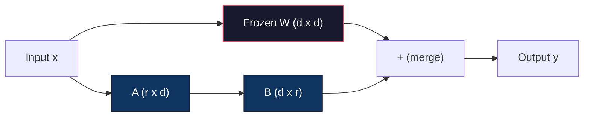
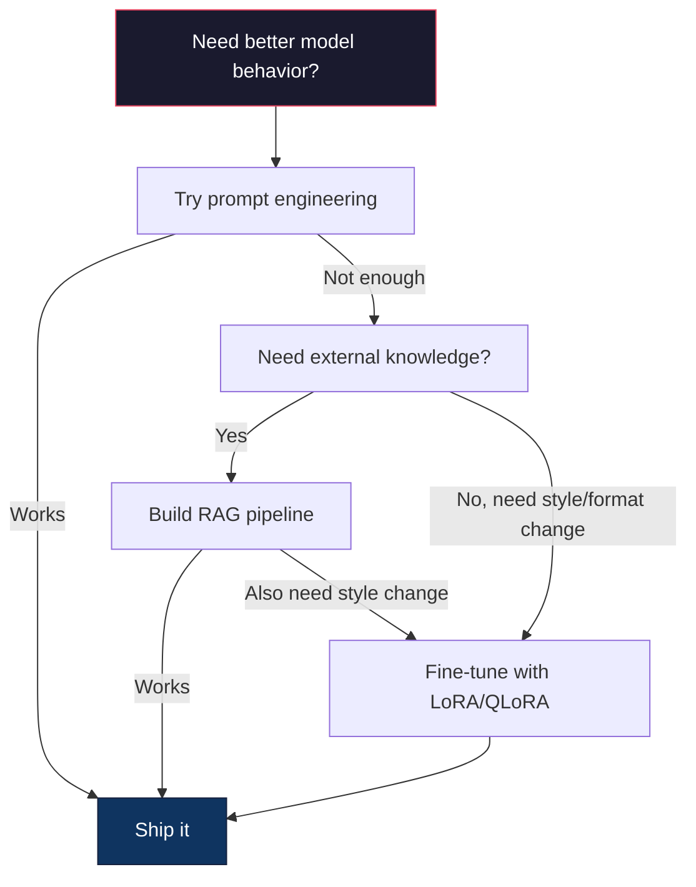

# Дообучение с LoRA и QLoRA

> Полное дообучение модели с 7 млрд параметров требует 56 ГБ видеопамяти. У вас её нет. У большинства компаний тоже. LoRA позволяет дообучить ту же модель в 6 ГБ, обучая менее 1% параметров. Это не компромисс — по качеству она соответствует полному дообучению на большинстве задач. Вся экосистема дообучения с открытым исходным кодом держится на этом одном трюке.

**Тип:** Build
**Языки:** Python
**Предварительные требования:** Этап 10, урок 06 (обучение на инструкциях / SFT)
**Время:** ~75 минут
**Связанные материалы:** Этап 10 разбирает циклы SFT/DPO с нуля. Этот урок подключает их к инструментарию PEFT образца 2026 года (PEFT, TRL, Unsloth, Axolotl, LLaMA-Factory).

## Цели обучения

- Реализуйте LoRA, внедрив матрицы адаптера низкого ранга (A и B) в слои внимания предобученной модели
- Рассчитайте экономию параметров LoRA по сравнению с полным дообучением: ранг r при размерности d_model обучает 2*r*d параметров вместо d^2
- Дообучите модель с помощью QLoRA (4-битная квантованная базовая модель + адаптеры LoRA), чтобы уложиться в память потребительского GPU
- Слейте веса LoRA обратно в базовую модель для развёртывания и сравните скорость инференса с адаптерами и без них

## Проблема

У вас есть базовая модель. Llama 3 8B. Вы хотите, чтобы она отвечала на тикеты поддержки клиентов голосом вашей компании. SFT — это решение. Но у SFT есть проблема со стоимостью.

Полное дообучение обновляет каждый параметр модели. У Llama 3 8B — 8 миллиардов параметров. В fp16 каждый параметр занимает 2 байта. Это 16 ГБ только на загрузку весов. Во время обучения также нужны градиенты (16 ГБ), состояния оптимизатора для Adam (32 ГБ на момент и дисперсию) и активации. Итого: примерно 56 ГБ видеопамяти для одной модели на 8 млрд параметров.

A100 80GB едва вмещает это. Два A100 у облачных провайдеров стоят $3-4 в час. Обучение в течение 3 эпох на 50,000 примерах занимает 6-10 часов. Это $30-40 за эксперимент. Проведите 10 экспериментов, чтобы подобрать гиперпараметры, и вы потратите $400 ещё до развёртывания.

Масштабируйте это до Llama 3 70B, и цифры становятся абсурдными. 140 ГБ только на веса. Нужен кластер. $100+ за эксперимент.

Есть и более глубокая проблема. Полное дообучение изменяет каждый вес в модели. Если вы дообучаете на данных поддержки клиентов, вы можете ухудшить общие способности модели. Это называется катастрофическим забыванием. Модель становится лучше в вашей задаче и хуже во всём остальном.

Вам нужен метод, который обучает меньше параметров, использует меньше памяти и не разрушает существующие знания модели.

## Концепция

### LoRA: адаптация низкого ранга

Эдвард Ху с коллегами из Microsoft опубликовали LoRA в июне 2021 года. Идея статьи: обновления весов при дообучении имеют низкий внутренний ранг. Вам не нужно обновлять все 16.7 миллиона параметров в матрице весов 4096x4096. Полезная информация в обновлении может быть захвачена матрицей ранга 16 или 32.

Вот математика. Стандартный линейный слой вычисляет:

```
y = Wx
```

Где W — матрица размером d_out x d_in. Для проекции внимания 4096x4096 это 16,777,216 параметров.

LoRA замораживает W и добавляет разложение низкого ранга:

```
y = Wx + BAx
```

Где B имеет размер (d_out x r), а A — (r x d_in). Ранг r намного меньше d — обычно 8, 16 или 32.

Для r=16 на слое 4096x4096:
- Исходные параметры: 4096 x 4096 = 16,777,216
- Параметры LoRA: (4096 x 16) + (16 x 4096) = 65,536 + 65,536 = 131,072
- Сокращение: 131,072 / 16,777,216 = 0.78%

Вы обучаете 0.78% параметров и получаете 95-100% качества.



A инициализируется случайным гауссовым распределением. B инициализируется нулями. Это значит, что вклад LoRA начинается с нуля — модель начинает обучение со своего исходного поведения и постепенно осваивает адаптацию.

### Масштабирующий коэффициент: alpha

LoRA вводит масштабирующий коэффициент alpha, который управляет тем, насколько сильно обновление низкого ранга влияет на выход:

```
y = Wx + (alpha / r) * BAx
```

Когда alpha = r, масштабирование составляет 1x. Когда alpha = 2r (частое значение по умолчанию), масштабирование составляет 2x. Этот гиперпараметр управляет скоростью обучения пути LoRA независимо от базовой скорости обучения.

Практические рекомендации:
- alpha = 2 * rank — распространённое соглашение в сообществе (в оригинальной статье в большинстве экспериментов использовалось alpha = rank)
- alpha = rank даёт масштабирование 1x, консервативно, но стабильно
- Более высокое alpha означает более крупные обновления на шаг, что может ускорить сходимость или вызвать нестабильность

### Куда применять LoRA

У трансформера много линейных слоёв. Не нужно добавлять LoRA во все из них. Оригинальная статья тестировала разные комбинации:

| Целевые слои | Обучаемые параметры (7B) | Качество |
|--------------|----------------------|---------|
| Только q_proj | 4.7M | Хорошее |
| q_proj + v_proj | 9.4M | Лучше |
| q_proj + k_proj + v_proj + o_proj | 18.9M | Лучшее для внимания |
| Все линейные слои (внимание + MLP) | 37.7M | Незначительный прирост, в 2 раза больше параметров |

Оптимальная точка для большинства задач: q_proj + v_proj. Это нацелено на проекции запроса и значения в self-attention, которые определяют, на что модель обращает внимание и какую информацию извлекает. Добавление слоёв MLP помогает для сложных задач вроде генерации кода, но удваивает количество параметров при убывающей отдаче на более простых задачах.

### Выбор ранга

Ранг r управляет выразительностью адаптации:

| Ранг | Обучаемые параметры (на слой) | Лучше всего подходит для |
|------|---------------------------|----------|
| 4 | 32,768 | Простой классификации, анализа тональности |
| 8 | 65,536 | Вопросов и ответов в одной предметной области, суммаризации |
| 16 | 131,072 | Задач из нескольких предметных областей, следования инструкциям |
| 32 | 262,144 | Сложных рассуждений, генерации кода |
| 64 | 524,288 | Убывающая отдача для большинства задач |
| 128 | 1,048,576 | Редко оправдан |

Ху и соавторы показали, что r=4 уже захватывает большую часть адаптации для простых задач. r=8 и r=16 — самые частые варианты на практике. Превышение r=64 редко улучшает качество и начинает терять преимущество LoRA по памяти.

### QLoRA: 4-битное квантование + LoRA

Тим Деттмерс с коллегами из Университета Вашингтона опубликовали QLoRA в мае 2023 года. Идея: квантовать замороженную базовую модель до 4-битной точности, а затем прикрепить сверху адаптеры LoRA в fp16.

Это радикально меняет уравнение памяти:

| Метод | Память для весов (7B) | Память для обучения (7B) | Требуемый GPU |
|--------|-------------------|---------------------|-------------|
| Полное дообучение (fp16) | 14GB | ~56GB | 1x A100 80GB |
| LoRA (базовая модель в fp16) | 14GB | ~18GB | 1x A100 40GB |
| QLoRA (4-битная базовая модель) | 3.5GB | ~6GB | 1x RTX 3090 24GB |

QLoRA вносит три технических вклада:

**NF4 (Normal Float 4-bit)**: новый тип данных, разработанный специально для весов нейронных сетей. Веса нейронных сетей примерно следуют нормальному распределению. NF4 размещает свои 16 уровней квантования на квантилях стандартного нормального распределения. Это информационно-теоретически оптимально для нормально распределённых данных. Он теряет меньше информации, чем равномерное 4-битное квантование (INT4) или стандартный Float4.

**Двойное квантование**: сами константы квантования занимают память. Каждому блоку из 64 весов нужен коэффициент масштаба fp32 (4 байта). Для модели на 7 млрд параметров это дополнительные 0.4GB. Двойное квантование квантует эти константы до fp8, снижая накладные расходы до 0.1GB. Немного, но накапливается.

**Paged optimizers (постраничные оптимизаторы)**: во время обучения состояния оптимизатора (момент и дисперсия Adam) могут превышать память GPU на длинных последовательностях. Постраничные оптимизаторы используют унифицированную память NVIDIA, чтобы автоматически выгружать состояния оптимизатора в оперативную память CPU при исчерпании памяти GPU и загружать их обратно по мере необходимости. Это предотвращает падения из-за нехватки памяти (OOM) ценой некоторой пропускной способности.

### Вопрос качества

Вредит ли качеству сокращение параметров или квантование базовой модели? Результаты из нескольких статей:

| Метод | MMLU (5-shot) | MT-Bench | HumanEval |
|--------|--------------|----------|-----------|
| Полное дообучение (Llama 2 7B) | 48.3 | 6.72 | 14.6 |
| LoRA r=16 | 47.9 | 6.68 | 14.0 |
| QLoRA r=16 (NF4) | 47.5 | 6.61 | 13.4 |
| QLoRA r=64 (NF4) | 48.1 | 6.70 | 14.2 |

LoRA при r=16 находится в пределах 1% от полного дообучения на большинстве бенчмарков. QLoRA при r=16 теряет ещё долю процента. QLoRA при r=64 практически соответствует полному дообучению, используя на 90% меньше памяти.

### Реальные затраты

Дообучение Llama 3 8B на 50,000 примеров (3 эпохи):

| Метод | GPU | Время | Стоимость |
|--------|-----|------|------|
| Полное дообучение | 2x A100 80GB | 8 часов | ~$32 |
| LoRA r=16 | 1x A100 40GB | 4 часа | ~$8 |
| QLoRA r=16 | 1x RTX 4090 24GB | 6 часов | ~$5 |
| QLoRA r=16 (Unsloth) | 1x RTX 4090 24GB | 2.5 часа | ~$2 |
| QLoRA r=16 | 1x T4 16GB | 12 часов | ~$4 |

QLoRA на одном потребительском GPU стоит меньше обеда. Именно поэтому сообщество дообучения открытых весов взорвалось в 2023 году и почему каждый обучающий фреймворк ниже поставляется с QLoRA по умолчанию в 2026 году.

### Стек PEFT образца 2026 года

| Фреймворк | Что это | Когда выбирать |
|-----------|-----------|-----------|
| **Hugging Face PEFT** | Каноническая библиотека LoRA/QLoRA/DoRA/IA3 | Вам нужен полный контроль, а цикл обучения уже работает на `transformers.Trainer` |
| **TRL** | Тренеры HF для обучения с подкреплением по обратной связи (SFT, DPO, GRPO, PPO, ORPO) | После SFT нужны DPO/GRPO; построен поверх PEFT |
| **Unsloth** | Переписанный на ядрах Triton прямой и обратный проход | Нужно ускорение в 2-5 раз и вдвое меньше видеопамяти без потери точности; семейства Llama/Mistral/Qwen |
| **Axolotl** | YAML-обёртка над PEFT + TRL + DeepSpeed + Unsloth | Нужны воспроизводимые запуски обучения с контролем версий |
| **LLaMA-Factory** | GUI/CLI/API над PEFT + TRL | Нужно дообучение без кода; поддерживается более 100 семейств моделей |
| **torchtune** | Нативные рецепты PyTorch без зависимости от `transformers` | Нужен минимум зависимостей, а организация уже стандартизировала работу на PyTorch |

Практическое правило: исследования или разовый эксперимент → PEFT. Воспроизводимый продакшн-пайплайн → Axolotl с включёнными ядрами Unsloth. Одноразовое прототипирование → LLaMA-Factory.

### Слияние адаптеров

После обучения у вас есть две вещи: замороженная базовая модель и небольшой адаптер LoRA (обычно 10-100 МБ). Вы можете либо:

1. **Держать их отдельно**: загрузить базовую модель, загрузить адаптер поверх неё. Менять адаптеры для разных задач. Так вы обслуживаете несколько дообученных вариантов из одной базовой модели.

2. **Слить их окончательно**: вычислить W' = W + (alpha/r) * BA и сохранить результат как новую полную модель. Слитая модель того же размера, что и оригинал. Никаких накладных расходов при инференсе. Никакого адаптера, которым нужно управлять.

Для обслуживания нескольких задач (адаптер поддержки клиентов, адаптер кода, адаптер перевода) держите их отдельно. Для развёртывания одной специализированной модели — сливайте.

Продвинутые техники слияния для объединения нескольких адаптеров:

- **TIES-Merging** (Yadav et al. 2023): обрезает параметры малой величины, разрешает конфликты знаков, затем сливает. Уменьшает интерференцию между адаптерами.
- **DARE** (Yu et al. 2023): случайным образом отбрасывает параметры адаптера перед слиянием и масштабирует остальные. Удивительно эффективен при объединении способностей.
- **Task arithmetic (арифметика задач)**: просто складывает или вычитает веса адаптеров. Добавление адаптера «код» и адаптера «математика» часто даёт модель, хорошую в обоих направлениях.

### Когда НЕ дообучать

Дообучение — это третий вариант, а не первый.

**Первое: проектирование промптов.** Напишите лучший системный промпт. Добавьте примеры с несколькими образцами (few-shot). Используйте цепочку рассуждений (chain-of-thought). Это ничего не стоит и занимает минуты. Если промптинг доводит вас до 80% нужного результата, вам, вероятно, не нужно дообучение.

**Второе: RAG.** Если модели нужно знать о ваших конкретных данных (документы, база знаний, каталог продуктов), поиск дешевле и удобнее в сопровождении, чем встраивание этого в веса. См. Урок 06.

**Третье: дообучение.** Используйте его, когда вам нужно, чтобы модель приняла определённый стиль, формат или паттерн рассуждения, которого нельзя достичь промптингом. Когда нужен стабильный структурированный вывод. Когда нужно дистиллировать более крупную модель в меньшую. Когда важна задержка и вы не можете позволить себе лишние токены от few-shot промптинга.



```figure
lora-params
```

## Соберите это

Мы реализуем LoRA с нуля на чистом PyTorch. Без библиотек. Без магии. Вы построите слой LoRA, внедрите его в модель, обучите и сольёте веса обратно.

### Шаг 1: Слой LoRA

```python
import torch
import torch.nn as nn
import math

class LoRALayer(nn.Module):
    def __init__(self, in_features, out_features, rank=8, alpha=16):
        super().__init__()
        self.rank = rank
        self.alpha = alpha
        self.scaling = alpha / rank

        self.A = nn.Parameter(torch.randn(in_features, rank) * (1 / math.sqrt(rank)))
        self.B = nn.Parameter(torch.zeros(rank, out_features))

    def forward(self, x):
        return (x @ self.A @ self.B) * self.scaling
```

A инициализируется масштабированными случайными значениями. B инициализируется нулями. Произведение BA начинается с нуля, поэтому модель начинает с исходного поведения.

### Шаг 2: Линейный слой, обёрнутый в LoRA

```python
class LinearWithLoRA(nn.Module):
    def __init__(self, linear, rank=8, alpha=16):
        super().__init__()
        self.linear = linear
        self.lora = LoRALayer(
            linear.in_features, linear.out_features, rank, alpha
        )

        for param in self.linear.parameters():
            param.requires_grad = False

    def forward(self, x):
        return self.linear(x) + self.lora(x)
```

Исходный линейный слой заморожен. Только параметры LoRA (A и B) обучаемы.

### Шаг 3: Внедрение LoRA в модель

```python
def inject_lora(model, target_modules, rank=8, alpha=16):
    for param in model.parameters():
        param.requires_grad = False

    lora_layers = {}
    for name, module in model.named_modules():
        if isinstance(module, nn.Linear):
            if any(t in name for t in target_modules):
                parent_name = ".".join(name.split(".")[:-1])
                child_name = name.split(".")[-1]
                parent = dict(model.named_modules())[parent_name]
                lora_linear = LinearWithLoRA(module, rank, alpha)
                setattr(parent, child_name, lora_linear)
                lora_layers[name] = lora_linear
    return lora_layers
```

Сначала заморозьте каждый параметр модели. Затем пройдите по дереву модели, найдите линейные слои, соответствующие вашим целевым именам, и замените их обёрнутыми в LoRA версиями. Матрицы A и B LoRA — единственные обучаемые параметры во всей модели.

### Шаг 4: Подсчёт параметров

```python
def count_parameters(model):
    total = sum(p.numel() for p in model.parameters())
    trainable = sum(p.numel() for p in model.parameters() if p.requires_grad)
    frozen = total - trainable
    return {
        "total": total,
        "trainable": trainable,
        "frozen": frozen,
        "trainable_pct": 100 * trainable / total if total > 0 else 0
    }
```

### Шаг 5: Слияние весов обратно

```python
def merge_lora_weights(model):
    for name, module in model.named_modules():
        if isinstance(module, LinearWithLoRA):
            with torch.no_grad():
                merged = (
                    module.lora.A @ module.lora.B
                ) * module.lora.scaling
                module.linear.weight.data += merged.T
            parent_name = ".".join(name.split(".")[:-1])
            child_name = name.split(".")[-1]
            if parent_name:
                parent = dict(model.named_modules())[parent_name]
            else:
                parent = model
            setattr(parent, child_name, module.linear)
```

После слияния слоёв LoRA больше нет. Модель того же размера, что и оригинал, с адаптацией, запечённой в весах. Никаких накладных расходов при инференсе.

### Шаг 6: Симулированное квантование QLoRA

```python
def quantize_to_nf4(tensor, block_size=64):
    blocks = tensor.reshape(-1, block_size)
    scales = blocks.abs().max(dim=1, keepdim=True).values / 7.0
    scales = torch.clamp(scales, min=1e-8)
    quantized = torch.round(blocks / scales).clamp(-8, 7).to(torch.int8)
    return quantized, scales

def dequantize_from_nf4(quantized, scales, original_shape):
    dequantized = quantized.float() * scales
    return dequantized.reshape(original_shape)
```

Это симулирует 4-битное квантование, отображая веса в 16 дискретных уровней внутри блоков по 64. В продакшене QLoRA использует библиотеку bitsandbytes для настоящего NF4 на GPU.

### Шаг 7: Цикл обучения

```python
def train_lora(model, data, epochs=5, lr=1e-3, batch_size=4):
    optimizer = torch.optim.AdamW(
        [p for p in model.parameters() if p.requires_grad], lr=lr
    )
    criterion = nn.MSELoss()

    losses = []
    for epoch in range(epochs):
        epoch_loss = 0.0
        n_batches = 0
        indices = torch.randperm(len(data["inputs"]))

        for i in range(0, len(indices), batch_size):
            batch_idx = indices[i:i + batch_size]
            x = data["inputs"][batch_idx]
            y = data["targets"][batch_idx]

            output = model(x)
            loss = criterion(output, y)

            optimizer.zero_grad()
            loss.backward()
            optimizer.step()

            epoch_loss += loss.item()
            n_batches += 1

        avg_loss = epoch_loss / n_batches
        losses.append(avg_loss)

    return losses
```

### Шаг 8: Полная демонстрация

```python
def demo():
    torch.manual_seed(42)
    d_model = 256
    n_classes = 10

    model = nn.Sequential(
        nn.Linear(d_model, 512),
        nn.ReLU(),
        nn.Linear(512, 512),
        nn.ReLU(),
        nn.Linear(512, n_classes),
    )

    n_samples = 500
    x = torch.randn(n_samples, d_model)
    y = torch.randint(0, n_classes, (n_samples,))
    y_onehot = torch.zeros(n_samples, n_classes).scatter_(1, y.unsqueeze(1), 1.0)

    data = {"inputs": x, "targets": y_onehot}

    params_before = count_parameters(model)

    lora_layers = inject_lora(
        model, target_modules=["0", "2"], rank=8, alpha=16
    )

    params_after = count_parameters(model)

    losses = train_lora(model, data, epochs=20, lr=1e-3)

    merge_lora_weights(model)
    params_merged = count_parameters(model)

    return {
        "params_before": params_before,
        "params_after": params_after,
        "params_merged": params_merged,
        "losses": losses,
    }
```

Демонстрация создаёт небольшую модель, внедряет LoRA в два слоя, обучает её и сливает веса обратно. Во время обучения LoRA доля обучаемых параметров снижается примерно со 100% до 1%, а после слияния восстанавливается исходная архитектура модели.

## Используйте это

С экосистемой Hugging Face LoRA на реальной модели занимает около 20 строк:

```python
from transformers import AutoModelForCausalLM, AutoTokenizer
from peft import LoraConfig, get_peft_model, TaskType

model = AutoModelForCausalLM.from_pretrained("meta-llama/Llama-3.1-8B")
tokenizer = AutoTokenizer.from_pretrained("meta-llama/Llama-3.1-8B")

lora_config = LoraConfig(
    task_type=TaskType.CAUSAL_LM,
    r=16,
    lora_alpha=32,
    lora_dropout=0.05,
    target_modules=["q_proj", "v_proj"],
)

model = get_peft_model(model, lora_config)
model.print_trainable_parameters()
```

Для QLoRA добавьте квантование bitsandbytes:

```python
from transformers import BitsAndBytesConfig

bnb_config = BitsAndBytesConfig(
    load_in_4bit=True,
    bnb_4bit_quant_type="nf4",
    bnb_4bit_compute_dtype=torch.bfloat16,
    bnb_4bit_use_double_quant=True,
)

model = AutoModelForCausalLM.from_pretrained(
    "meta-llama/Llama-3.1-8B",
    quantization_config=bnb_config,
    device_map="auto",
)

model = get_peft_model(model, lora_config)
```

Вот и всё. Тот же цикл обучения. Тот же конвейер данных. Теперь базовая модель живёт в 4-битном формате, адаптеры LoRA обучаются в fp16, и всё это умещается в 6 ГБ.

Для обучения с Hugging Face Trainer:

```python
from transformers import TrainingArguments, Trainer
from datasets import load_dataset

dataset = load_dataset("tatsu-lab/alpaca", split="train[:5000]")

training_args = TrainingArguments(
    output_dir="./lora-llama",
    num_train_epochs=3,
    per_device_train_batch_size=4,
    gradient_accumulation_steps=4,
    learning_rate=2e-4,
    fp16=True,
    logging_steps=10,
    save_strategy="epoch",
    optim="paged_adamw_8bit",
)

trainer = Trainer(
    model=model,
    args=training_args,
    train_dataset=dataset,
)

trainer.train()

model.save_pretrained("./lora-adapter")
```

Сохранённый адаптер занимает 10-100 МБ. Базовая модель остаётся нетронутой. Вы можете делиться адаптерами на Hugging Face Hub, не распространяя полную модель.

## Итоговое задание

Этот урок производит:
- `outputs/prompt-lora-advisor.md` -- промпт, который помогает выбрать ранг LoRA, целевые модули и гиперпараметры для вашей конкретной задачи
- `outputs/skill-fine-tuning-guide.md` -- навык (skill), который учит агентов дереву решений о том, когда и как дообучать

## Упражнения

1. **Исследование ранга (ablation study).** Запустите демонстрацию с рангами 2, 4, 8, 16, 32 и 64. Постройте график итоговых потерь в зависимости от ранга. Найдите точку убывающей отдачи, где удвоение ранга больше не уменьшает потери вдвое. Для простой задачи классификации на признаках размерности 256 это должно быть около r=8-16.

2. **Сравнение целевых модулей.** Измените inject_lora, чтобы нацелиться только на слой "0", только на слой "2", только на слой "4" и на все три. Обучите каждый вариант на 20 эпох. Сравните скорость сходимости и итоговые потери. Это отражает реальное решение о нацеливании на q_proj против v_proj против всех линейных слоёв.

3. **Анализ ошибки квантования.** Возьмите матрицы весов обученной модели до и после quantize_to_nf4 / dequantize_from_nf4. Вычислите среднеквадратичную ошибку, максимальную абсолютную ошибку и корреляцию между исходными и восстановленными весами. Поэкспериментируйте со значениями block_size 32, 64, 128 и 256.

4. **Обслуживание нескольких адаптеров.** Обучите два адаптера LoRA на разных подмножествах данных (чётные индексы против нечётных). Сохраните оба адаптера. Загрузите базовую модель один раз, затем меняйте адаптеры и убедитесь, что каждый даёт разные выходы на одном и том же входе. Именно так продакшн-системы обслуживают несколько дообученных моделей из одной базовой.

5. **Слитый инференс против неслитого.** Сравните выход модели LoRA до и после merge_lora_weights на одних и тех же 100 входах. Убедитесь, что выходы идентичны с точностью 1e-5 с учётом погрешности вычислений с плавающей точкой. Затем измерьте скорость инференса для обоих вариантов -- слитый должен быть немного быстрее, поскольку это одно матричное умножение вместо двух.

## Ключевые термины

| Термин | Что говорят люди | Что это на самом деле означает |
|------|----------------|----------------------|
| LoRA | «Эффективное дообучение» | Low-Rank Adaptation (адаптация низкого ранга): заморозить базовые веса, обучить две небольшие матрицы A и B, произведение которых аппроксимирует полное обновление весов |
| QLoRA | «Дообучение на ноутбуке» | Quantized LoRA (квантованная LoRA): загрузить базовую модель в 4-битном NF4, обучить адаптеры LoRA поверх неё в fp16, что позволяет дообучать модель на 7 млрд параметров в 6 ГБ видеопамяти |
| Ранг (r) | «Сколько модель может выучить» | Внутренняя размерность матриц A и B; управляет выразительностью против количества параметров |
| Alpha | «Скорость обучения LoRA» | Масштабирующий коэффициент, применяемый к выходу LoRA; alpha/r масштабирует вклад адаптации в итоговый выход |
| NF4 | «4-битное квантование» | Normal Float 4: 4-битный тип данных с уровнями квантования на квантилях нормального распределения, оптимальный для весов нейронных сетей |
| Адаптер (Adapter) | «Небольшая обученная часть» | Матрицы A и B LoRA, сохранённые как отдельный файл (10-100 МБ), загружаемый поверх любой копии базовой модели |
| Целевые модули (Target modules) | «Какие слои для LoRA» | Конкретные линейные слои (q_proj, v_proj и т. д.), в которые внедряются адаптеры LoRA |
| Слияние (Merging) | «Запечь это внутрь» | Вычисление W + (alpha/r) * BA и замена исходного веса, устраняющая накладные расходы адаптера при инференсе |
| Постраничные оптимизаторы (Paged optimizers) | «Не упасть в OOM во время обучения» | Выгрузка состояний оптимизатора (момент, дисперсия Adam) в CPU при исчерпании памяти GPU |
| Катастрофическое забывание (Catastrophic forgetting) | «Дообучение сломало всё остальное» | Когда обновление всех весов приводит к тому, что модель теряет ранее выученные способности |

## Дополнительное чтение

- Hu et al., "LoRA: Low-Rank Adaptation of Large Language Models" (2021) -- оригинальная статья, представляющая метод разложения низкого ранга, протестированный на GPT-3 175B с рангом вплоть до 4
- Dettmers et al., "QLoRA: Efficient Finetuning of Quantized Language Models" (2023) -- представляет NF4, двойное квантование и постраничные оптимизаторы, позволяя дообучать модель на 65 млрд параметров на одном GPU с 48 ГБ
- Документация библиотеки PEFT (huggingface.co/docs/peft) -- стандартная библиотека для LoRA, QLoRA и других параметрически эффективных методов в экосистеме Hugging Face
- Yadav et al., "TIES-Merging: Resolving Interference When Merging Models" (2023) -- техники объединения нескольких адаптеров LoRA без потери качества
- [Rafailov et al., "Direct Preference Optimization: Your Language Model is Secretly a Reward Model" (NeurIPS 2023)](https://arxiv.org/abs/2305.18290) -- вывод DPO; этап настройки предпочтений, который идёт после SFT, без модели вознаграждения.
- [Документация TRL](https://huggingface.co/docs/trl/) -- официальный справочник по `SFTTrainer`, `DPOTrainer`, `KTOTrainer` и поверхности интеграции с PEFT/bitsandbytes/Unsloth.
- [Документация Unsloth](https://docs.unsloth.ai/) -- объединённые вычислительные ядра, которые удваивают пропускную способность дообучения и вдвое сокращают потребление памяти; нижележащий слой оптимизации производительности для TRL.
- [Документация Axolotl](https://axolotl-ai-cloud.github.io/axolotl/) -- тренер SFT/DPO/QLoRA для обучения на нескольких GPU с конфигурацией на YAML; предлагает подход configuration-as-code как альтернативу написанным вручную скриптам.
