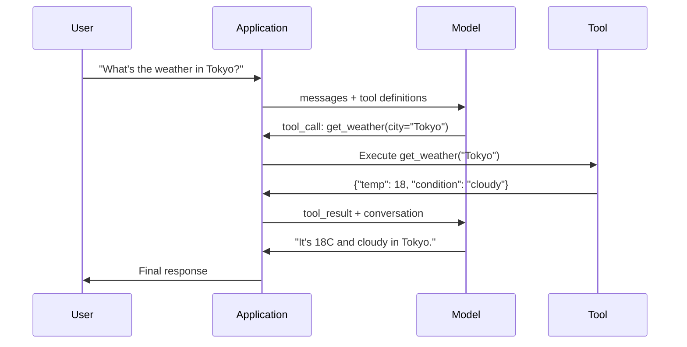

# Вызов функций и использование инструментов

> LLM ничего не умеют делать. Они генерируют текст. Это вся их способность. Они не могут проверить погоду, сделать запрос к базе данных, отправить письмо, выполнить код или прочитать файл. Каждый «ИИ-агент», который вы когда-либо видели, — это LLM, генерирующая JSON с указанием, какую функцию вызвать, — а затем ваш код, который её действительно вызывает. Модель — это мозг. Инструменты — это руки. Вызов функций — это нервная система, соединяющая их.

**Тип:** Build
**Языки:** Python
**Предварительные требования:** Этап 11, урок 03 («Структурированный вывод»)
**Время:** ~75 минут
**Связанный материал:** Этап 11 · 14 (Model Context Protocol) — когда инструмент используется совместно несколькими хостами, переходите от встроенного вызова функций к серверу MCP. Этот урок разбирает встроенный вариант, а MCP — протокольный.

## Цели обучения

- Реализовать цикл вызова функций: определить схемы инструментов, разобрать JSON вызова инструмента от модели, выполнить функции и вернуть результаты
- Спроектировать схемы инструментов с чёткими описаниями и типизированными параметрами, которые модель может надёжно вызывать
- Построить многошаговый цикл агента, который объединяет несколько вызовов функций для ответа на сложные запросы
- Обработать граничные случаи вызова функций: параллельные вызовы инструментов, распространение ошибок и предотвращение бесконечных циклов вызова инструментов

## Проблема

Вы создаёте чат-бота. Пользователь спрашивает: «Какая сейчас погода в Токио?»

Модель отвечает: «У меня нет доступа к данным о погоде в реальном времени, но, судя по сезону, в Токио сейчас, вероятно, около 15 градусов Цельсия...»

Это галлюцинация, замаскированная под оговорку. Модель не знает погоду. И никогда не узнает. Погода меняется каждый час. Обучающие данные модели устарели на месяцы.

Правильный ответ требует вызова API OpenWeatherMap, получения текущей температуры и возврата реального числа. Модель не может вызывать API. Ваш код может. Недостающее звено — структурированный протокол, который позволяет модели сказать «мне нужно вызвать API погоды с такими-то аргументами» и позволяет вашему коду выполнить этот вызов и вернуть результат обратно.

Это и есть вызов функций (function calling). Модель выводит структурированный JSON, описывающий, какую функцию вызвать с какими аргументами. Приложение выполняет функцию. Результат возвращается в диалог. Модель использует результат, чтобы сформировать окончательный ответ.

Без вызова функций LLM — это энциклопедии. С ним они становятся агентами.

## Концепция

### Цикл вызова функций

Каждое взаимодействие с использованием инструментов следует одному и тому же циклу из 5 шагов.



Шаг 1: пользователь отправляет сообщение. Шаг 2: модель получает сообщение вместе с определениями инструментов (JSON Schema, описывающая доступные функции). Шаг 3: вместо ответа текстом модель выводит вызов инструмента — структурированный JSON-объект с именем функции и аргументами. Шаг 4: ваш код выполняет функцию и фиксирует результат. Шаг 5: результат возвращается модели, у которой теперь есть реальные данные для формирования окончательного ответа.

Модель никогда ничего не выполняет сама. Она только решает, что вызывать и с какими аргументами. Ваш код — это исполнитель.

### Определения инструментов: контракт JSON Schema

Каждый инструмент определяется схемой JSON Schema, которая сообщает модели, что делает функция, какие аргументы она принимает и какого типа должны быть эти аргументы.

```json
{
  "type": "function",
  "function": {
    "name": "get_weather",
    "description": "Get current weather for a city. Returns temperature in Celsius and conditions.",
    "parameters": {
      "type": "object",
      "properties": {
        "city": {
          "type": "string",
          "description": "City name, e.g. 'Tokyo' or 'San Francisco'"
        },
        "units": {
          "type": "string",
          "enum": ["celsius", "fahrenheit"],
          "description": "Temperature units"
        }
      },
      "required": ["city"]
    }
  }
}
```

Поля `description` критически важны. Модель читает их, чтобы решить, когда и как использовать инструмент. Расплывчатое описание вроде «получает погоду» приводит к худшему выбору инструмента, чем «Получает текущую погоду в городе. Возвращает температуру в градусах Цельсия и погодные условия». Описание — это промпт для выбора инструмента.

### Сравнение провайдеров

Каждый крупный провайдер поддерживает вызов функций, но поверхность API отличается.

| Провайдер | Параметр API | Формат вызова инструмента | Параллельные вызовы | Принудительный вызов |
|----------|--------------|-----------------|---------------|----------------|
| OpenAI (GPT-5, o4) | `tools` | `tool_calls[].function` | Да (несколько за один шаг) | `tool_choice="required"` |
| Anthropic (Claude 4.6/4.7) | `tools` | `content[].type="tool_use"` | Да (несколько блоков) | `tool_choice={"type":"any"}` |
| Google (Gemini 3) | `function_declarations` | `functionCall` | Да | `function_calling_config` |
| Модели с открытыми весами (Llama 4, Qwen3, DeepSeek-V3) | Встроенный параметр `tools` в Llama 4; Hermes или ChatML в остальных моделях | Разные варианты | Зависит от модели | Через промпт или `tool_choice`, если он поддерживается |

К 2026 году три закрытых провайдера сошлись на почти идентичных форматах на основе JSON Schema. Llama 4 поставляется со встроенным полем `tools`, совпадающим по форме с OpenAI. Дообученные модели с открытыми весами всё ещё различаются — формат Hermes (NousResearch) наиболее распространён среди сторонних дообученных моделей. Для инструментов, используемых совместно несколькими хостами, предпочитайте MCP (этап 11 · 14) вместо встроенного вызова функций — сервер один и тот же для всех них.

### Выбор инструмента: автоматический, обязательный, конкретный

Вы управляете тем, когда модель использует инструменты.

**Автоматический режим** (по умолчанию): модель сама решает, вызывать ли инструмент или ответить напрямую. «Сколько будет 2+2?» — отвечает напрямую. «Какая погода?» — вызывает инструмент.

**Обязательный режим**: модель обязана вызвать хотя бы один инструмент. Используйте его, когда вы знаете, что намерение пользователя требует инструмента. Он не даёт модели угадывать вместо обращения к реальным данным.

**Конкретная функция**: модель принудительно вызывает заданную функцию. `tool_choice={"type":"function", "function": {"name": "get_weather"}}` гарантирует вызов инструмента погоды независимо от запроса. Используйте этот режим для маршрутизации, когда вышестоящая логика уже определила, какой инструмент нужен.

### Параллельный вызов функций

GPT-4o и Claude умеют вызывать несколько функций за один шаг. Пользователь спрашивает: «Какая погода в Токио и Нью-Йорке?» Модель выводит два вызова инструмента одновременно:

```json
[
  {"name": "get_weather", "arguments": {"city": "Tokyo"}},
  {"name": "get_weather", "arguments": {"city": "New York"}}
]
```

Ваш код выполняет оба (в идеале параллельно), возвращает оба результата, и модель синтезирует единый ответ. Это сокращает количество обменов запросами с 2 до 1. Для агентов с 5-10 вызовами инструментов на запрос параллельный вызов снижает задержку на 60-80%.

### Структурированный вывод против вызова функций

Урок 03 разбирал структурированный вывод. Вызов функций использует тот же аппарат JSON Schema, но с другой целью.

**Структурированный вывод**: заставляет модель формировать данные в заданной форме. Вывод — это конечный продукт. Пример: извлечь информацию о товаре из текста в виде `{name, price, in_stock}`.

**Вызов функций**: модель декларирует намерение выполнить действие. Вывод — это промежуточный шаг. Пример: `get_weather(city="Tokyo")` — модель запрашивает действие, а не выдаёт окончательный ответ.

Используйте структурированный вывод, когда нужно извлечение данных. Используйте вызов функций, когда нужно, чтобы модель взаимодействовала с внешними системами.

### Безопасность: правила без исключений

Вызов функций — самая опасная возможность, которую можно дать LLM. Модель выбирает, что выполнять. Если ваш набор инструментов включает запросы к базе данных, модель конструирует эти запросы. Если он включает команды shell, модель их пишет.

**Правило 1: никогда не передавайте SQL, сгенерированный моделью, напрямую в базу данных.** Модель может сгенерировать (и сгенерирует) DROP TABLE, UNION-инъекции или запросы, возвращающие все строки. Всегда параметризуйте. Всегда валидируйте. Всегда используйте разрешённый список операций.

**Правило 2: используйте разрешённый список функций.** Модель может вызывать только те функции, которые вы явно определили. Никогда не создавайте универсальный инструмент «выполнить любую функцию по имени». Если у вас 50 внутренних функций, открывайте только те 5, что нужны пользователю.

**Правило 3: валидируйте аргументы.** Модель может передать название города вида `"; DROP TABLE users; --"`. Проверяйте каждый аргумент на соответствие ожидаемым типам, диапазонам и форматам перед выполнением.

**Правило 4: очищайте результаты инструментов.** Если инструмент возвращает конфиденциальные данные (ключи API, персональные данные, внутренние ошибки), отфильтруйте их перед отправкой обратно модели. Модель дословно включит результаты инструмента в свой ответ.

**Правило 5: ограничивайте частоту вызовов инструментов.** Модель в цикле может вызвать инструменты сотни раз. Установите максимум (разумно 10-20 вызовов на диалог). Прерывайте бесконечные циклы.

### Обработка ошибок

Инструменты дают сбой. API не отвечают вовремя. Базы данных падают. Файлов не существует. Модели нужно знать, когда инструмент терпит неудачу и почему.

Возвращайте ошибки как структурированные результаты инструмента, а не как исключения:

```json
{
  "error": true,
  "message": "City 'Toky' not found. Did you mean 'Tokyo'?",
  "code": "CITY_NOT_FOUND"
}
```

Модель читает это, корректирует свои аргументы и повторяет попытку. Модели хорошо умеют самокорректироваться на основе структурированных сообщений об ошибках. Они плохо справляются с восстановлением после пустых ответов или обобщённых ошибок вида «что-то пошло не так».

### MCP: Model Context Protocol

MCP — это открытый стандарт Anthropic для взаимодействия инструментов. Вместо того чтобы каждое приложение определяло собственные инструменты, MCP предоставляет универсальный протокол: инструменты обслуживаются серверами MCP, потребляются клиентами MCP (такими как Claude Code, Cursor или ваше приложение).

Один сервер MCP может предоставлять инструменты любому совместимому клиенту. Сервер MCP для Postgres даёт доступ к базе данных любому агенту, совместимому с MCP. Сервер MCP для GitHub даёт доступ к репозиторию любому агенту. Инструменты определяются один раз, используются везде.

MCP относится к вызову функций так же, как HTTP относится к сетевому взаимодействию. Он стандартизирует транспортный уровень, поэтому инструменты становятся переносимыми.

```figure
mx-tool-call-loop
```

## Соберите это

### Шаг 1: Определите реестр инструментов

Постройте реестр, который хранит определения инструментов и их реализации. У каждого инструмента есть определение JSON Schema (то, что видит модель) и функция Python (то, что выполняет ваш код).

```python
import json
import math
import time
import hashlib


TOOL_REGISTRY = {}


def register_tool(name, description, parameters, function):
    TOOL_REGISTRY[name] = {
        "definition": {
            "type": "function",
            "function": {
                "name": name,
                "description": description,
                "parameters": parameters,
            },
        },
        "function": function,
    }
```

### Шаг 2: Реализуйте 5 инструментов

Постройте калькулятор, поиск погоды, симулятор веб-поиска, читатель файлов и исполнитель кода.

```python
def calculator(expression, precision=2):
    allowed = set("0123456789+-*/.() ")
    if not all(c in allowed for c in expression):
        return {"error": True, "message": f"Invalid characters in expression: {expression}"}
    try:
        result = eval(expression, {"__builtins__": {}}, {"math": math})
        return {"result": round(float(result), precision), "expression": expression}
    except Exception as e:
        return {"error": True, "message": str(e)}


WEATHER_DB = {
    "tokyo": {"temp_c": 18, "condition": "cloudy", "humidity": 72, "wind_kph": 14},
    "new york": {"temp_c": 22, "condition": "sunny", "humidity": 45, "wind_kph": 8},
    "london": {"temp_c": 12, "condition": "rainy", "humidity": 88, "wind_kph": 22},
    "san francisco": {"temp_c": 16, "condition": "foggy", "humidity": 80, "wind_kph": 18},
    "sydney": {"temp_c": 25, "condition": "sunny", "humidity": 55, "wind_kph": 10},
}


def get_weather(city, units="celsius"):
    key = city.lower().strip()
    if key not in WEATHER_DB:
        suggestions = [c for c in WEATHER_DB if c.startswith(key[:3])]
        return {
            "error": True,
            "message": f"City '{city}' not found.",
            "suggestions": suggestions,
            "code": "CITY_NOT_FOUND",
        }
    data = WEATHER_DB[key].copy()
    if units == "fahrenheit":
        data["temp_f"] = round(data["temp_c"] * 9 / 5 + 32, 1)
        del data["temp_c"]
    data["city"] = city
    return data


SEARCH_DB = {
    "python function calling": [
        {"title": "OpenAI Function Calling Guide", "url": "https://platform.openai.com/docs/guides/function-calling", "snippet": "Learn how to connect LLMs to external tools."},
        {"title": "Anthropic Tool Use", "url": "https://docs.anthropic.com/en/docs/tool-use", "snippet": "Claude can interact with external tools and APIs."},
    ],
    "MCP protocol": [
        {"title": "Model Context Protocol", "url": "https://modelcontextprotocol.io", "snippet": "An open standard for connecting AI models to data sources."},
    ],
    "weather API": [
        {"title": "OpenWeatherMap API", "url": "https://openweathermap.org/api", "snippet": "Free weather API with current, forecast, and historical data."},
    ],
}


def web_search(query, max_results=3):
    key = query.lower().strip()
    for db_key, results in SEARCH_DB.items():
        if db_key in key or key in db_key:
            return {"query": query, "results": results[:max_results], "total": len(results)}
    return {"query": query, "results": [], "total": 0}


FILE_SYSTEM = {
    "data/config.json": '{"model": "gpt-4o", "temperature": 0.7, "max_tokens": 4096}',
    "data/users.csv": "name,email,role\nAlice,alice@example.com,admin\nBob,bob@example.com,user",
    "README.md": "# My Project\nA tool-use agent built from scratch.",
}


def read_file(path):
    if ".." in path or path.startswith("/"):
        return {"error": True, "message": "Path traversal not allowed.", "code": "FORBIDDEN"}
    if path not in FILE_SYSTEM:
        available = list(FILE_SYSTEM.keys())
        return {"error": True, "message": f"File '{path}' not found.", "available_files": available, "code": "NOT_FOUND"}
    content = FILE_SYSTEM[path]
    return {"path": path, "content": content, "size_bytes": len(content), "lines": content.count("\n") + 1}


def run_code(code, language="python"):
    if language != "python":
        return {"error": True, "message": f"Language '{language}' not supported. Only 'python' is available."}
    forbidden = ["import os", "import sys", "import subprocess", "exec(", "eval(", "__import__", "open("]
    for pattern in forbidden:
        if pattern in code:
            return {"error": True, "message": f"Forbidden operation: {pattern}", "code": "SECURITY_VIOLATION"}
    try:
        local_vars = {}
        exec(code, {"__builtins__": {"print": print, "range": range, "len": len, "str": str, "int": int, "float": float, "list": list, "dict": dict, "sum": sum, "min": min, "max": max, "abs": abs, "round": round, "sorted": sorted, "enumerate": enumerate, "zip": zip, "map": map, "filter": filter, "math": math}}, local_vars)
        result = local_vars.get("result", None)
        return {"success": True, "result": result, "variables": {k: str(v) for k, v in local_vars.items() if not k.startswith("_")}}
    except Exception as e:
        return {"error": True, "message": f"{type(e).__name__}: {e}"}
```

### Шаг 3: Зарегистрируйте все инструменты

```python
def register_all_tools():
    register_tool(
        "calculator", "Evaluate a mathematical expression. Supports +, -, *, /, parentheses, and decimals. Returns the numeric result.",
        {"type": "object", "properties": {"expression": {"type": "string", "description": "Math expression, e.g. '(10 + 5) * 3'"}, "precision": {"type": "integer", "description": "Decimal places in result", "default": 2}}, "required": ["expression"]},
        calculator,
    )
    register_tool(
        "get_weather", "Get current weather for a city. Returns temperature, condition, humidity, and wind speed.",
        {"type": "object", "properties": {"city": {"type": "string", "description": "City name, e.g. 'Tokyo' or 'San Francisco'"}, "units": {"type": "string", "enum": ["celsius", "fahrenheit"], "description": "Temperature units, defaults to celsius"}}, "required": ["city"]},
        get_weather,
    )
    register_tool(
        "web_search", "Search the web for information. Returns a list of results with title, URL, and snippet.",
        {"type": "object", "properties": {"query": {"type": "string", "description": "Search query"}, "max_results": {"type": "integer", "description": "Maximum results to return", "default": 3}}, "required": ["query"]},
        web_search,
    )
    register_tool(
        "read_file", "Read the contents of a file. Returns the file content, size, and line count.",
        {"type": "object", "properties": {"path": {"type": "string", "description": "Relative file path, e.g. 'data/config.json'"}}, "required": ["path"]},
        read_file,
    )
    register_tool(
        "run_code", "Execute Python code in a sandboxed environment. Set a 'result' variable to return output.",
        {"type": "object", "properties": {"code": {"type": "string", "description": "Python code to execute"}, "language": {"type": "string", "enum": ["python"], "description": "Programming language"}}, "required": ["code"]},
        run_code,
    )
```

### Шаг 4: Постройте цикл вызова функций

Это ядро всей системы. Оно имитирует решение модели о том, какой инструмент вызвать, выполняет инструмент и возвращает результаты обратно.

```python
def simulate_model_decision(user_message, tools, conversation_history):
    msg = user_message.lower()

    if any(word in msg for word in ["weather", "temperature", "forecast"]):
        cities = []
        for city in WEATHER_DB:
            if city in msg:
                cities.append(city)
        if not cities:
            for word in msg.split():
                if word.capitalize() in [c.title() for c in WEATHER_DB]:
                    cities.append(word)
        if not cities:
            cities = ["tokyo"]
        calls = []
        for city in cities:
            calls.append({"name": "get_weather", "arguments": {"city": city.title()}})
        return calls

    if any(word in msg for word in ["calculate", "compute", "math", "what is", "how much"]):
        for token in msg.split():
            if any(c in token for c in "+-*/"):
                return [{"name": "calculator", "arguments": {"expression": token}}]
        if "+" in msg or "-" in msg or "*" in msg or "/" in msg:
            expr = "".join(c for c in msg if c in "0123456789+-*/.() ")
            if expr.strip():
                return [{"name": "calculator", "arguments": {"expression": expr.strip()}}]
        return [{"name": "calculator", "arguments": {"expression": "0"}}]

    if any(word in msg for word in ["search", "find", "look up", "google"]):
        query = msg.replace("search for", "").replace("look up", "").replace("find", "").strip()
        return [{"name": "web_search", "arguments": {"query": query}}]

    if any(word in msg for word in ["read", "file", "open", "cat", "show"]):
        for path in FILE_SYSTEM:
            if path.split("/")[-1].split(".")[0] in msg:
                return [{"name": "read_file", "arguments": {"path": path}}]
        return [{"name": "read_file", "arguments": {"path": "README.md"}}]

    if any(word in msg for word in ["run", "execute", "code", "python"]):
        return [{"name": "run_code", "arguments": {"code": "result = 'Hello from the sandbox!'", "language": "python"}}]

    return []


def execute_tool_call(tool_call):
    name = tool_call["name"]
    args = tool_call["arguments"]

    if name not in TOOL_REGISTRY:
        return {"error": True, "message": f"Unknown tool: {name}", "code": "UNKNOWN_TOOL"}

    tool = TOOL_REGISTRY[name]
    func = tool["function"]
    start = time.time()

    try:
        result = func(**args)
    except TypeError as e:
        result = {"error": True, "message": f"Invalid arguments: {e}"}

    elapsed_ms = round((time.time() - start) * 1000, 2)
    return {"tool": name, "result": result, "execution_time_ms": elapsed_ms}


def run_function_calling_loop(user_message, max_iterations=5):
    conversation = [{"role": "user", "content": user_message}]
    tool_definitions = [t["definition"] for t in TOOL_REGISTRY.values()]
    all_tool_results = []

    for iteration in range(max_iterations):
        tool_calls = simulate_model_decision(user_message, tool_definitions, conversation)

        if not tool_calls:
            break

        results = []
        for call in tool_calls:
            result = execute_tool_call(call)
            results.append(result)

        conversation.append({"role": "assistant", "content": None, "tool_calls": tool_calls})

        for result in results:
            conversation.append({"role": "tool", "content": json.dumps(result["result"]), "tool_name": result["tool"]})

        all_tool_results.extend(results)
        break

    return {"conversation": conversation, "tool_results": all_tool_results, "iterations": iteration + 1 if tool_calls else 0}
```

### Шаг 5: Валидация аргументов

Постройте валидатор, который проверяет аргументы вызова инструмента по JSON Schema перед выполнением.

```python
def validate_tool_arguments(tool_name, arguments):
    if tool_name not in TOOL_REGISTRY:
        return [f"Unknown tool: {tool_name}"]

    schema = TOOL_REGISTRY[tool_name]["definition"]["function"]["parameters"]
    errors = []

    if not isinstance(arguments, dict):
        return [f"Arguments must be an object, got {type(arguments).__name__}"]

    for required_field in schema.get("required", []):
        if required_field not in arguments:
            errors.append(f"Missing required argument: {required_field}")

    properties = schema.get("properties", {})
    for arg_name, arg_value in arguments.items():
        if arg_name not in properties:
            errors.append(f"Unknown argument: {arg_name}")
            continue

        prop_schema = properties[arg_name]
        expected_type = prop_schema.get("type")

        type_checks = {"string": str, "integer": int, "number": (int, float), "boolean": bool, "array": list, "object": dict}
        if expected_type in type_checks:
            if not isinstance(arg_value, type_checks[expected_type]):
                errors.append(f"Argument '{arg_name}': expected {expected_type}, got {type(arg_value).__name__}")

        if "enum" in prop_schema and arg_value not in prop_schema["enum"]:
            errors.append(f"Argument '{arg_name}': '{arg_value}' not in {prop_schema['enum']}")

    return errors
```

### Шаг 6: Запустите демонстрацию

```python
def run_demo():
    register_all_tools()

    print("=" * 60)
    print("  Function Calling & Tool Use Demo")
    print("=" * 60)

    print("\n--- Registered Tools ---")
    for name, tool in TOOL_REGISTRY.items():
        desc = tool["definition"]["function"]["description"][:60]
        params = list(tool["definition"]["function"]["parameters"].get("properties", {}).keys())
        print(f"  {name}: {desc}...")
        print(f"    params: {params}")

    print(f"\n--- Argument Validation ---")
    validation_tests = [
        ("get_weather", {"city": "Tokyo"}, "Valid call"),
        ("get_weather", {}, "Missing required arg"),
        ("get_weather", {"city": "Tokyo", "units": "kelvin"}, "Invalid enum value"),
        ("calculator", {"expression": 123}, "Wrong type (int for string)"),
        ("unknown_tool", {"x": 1}, "Unknown tool"),
    ]
    for tool_name, args, label in validation_tests:
        errors = validate_tool_arguments(tool_name, args)
        status = "VALID" if not errors else f"ERRORS: {errors}"
        print(f"  {label}: {status}")

    print(f"\n--- Tool Execution ---")
    direct_tests = [
        {"name": "calculator", "arguments": {"expression": "(10 + 5) * 3 / 2"}},
        {"name": "get_weather", "arguments": {"city": "Tokyo"}},
        {"name": "get_weather", "arguments": {"city": "Mars"}},
        {"name": "web_search", "arguments": {"query": "python function calling"}},
        {"name": "read_file", "arguments": {"path": "data/config.json"}},
        {"name": "read_file", "arguments": {"path": "../etc/passwd"}},
        {"name": "run_code", "arguments": {"code": "result = sum(range(1, 101))"}},
        {"name": "run_code", "arguments": {"code": "import os; os.system('rm -rf /')"}},
    ]
    for call in direct_tests:
        result = execute_tool_call(call)
        print(f"\n  {call['name']}({json.dumps(call['arguments'])})")
        print(f"    -> {json.dumps(result['result'], indent=None)[:100]}")
        print(f"    time: {result['execution_time_ms']}ms")

    print(f"\n--- Full Function Calling Loop ---")
    test_queries = [
        "What's the weather in Tokyo?",
        "Calculate (100 + 250) * 0.15",
        "Search for MCP protocol",
        "Read the config file",
        "Run some Python code",
        "Tell me a joke",
    ]
    for query in test_queries:
        print(f"\n  User: {query}")
        result = run_function_calling_loop(query)
        if result["tool_results"]:
            for tr in result["tool_results"]:
                print(f"    Tool: {tr['tool']} ({tr['execution_time_ms']}ms)")
                print(f"    Result: {json.dumps(tr['result'], indent=None)[:90]}")
        else:
            print(f"    [No tool called -- direct response]")
        print(f"    Iterations: {result['iterations']}")

    print(f"\n--- Parallel Tool Calls ---")
    multi_city_query = "What's the weather in tokyo and london?"
    print(f"  User: {multi_city_query}")
    result = run_function_calling_loop(multi_city_query)
    print(f"  Tool calls made: {len(result['tool_results'])}")
    for tr in result["tool_results"]:
        city = tr["result"].get("city", "unknown")
        temp = tr["result"].get("temp_c", "N/A")
        print(f"    {city}: {temp}C, {tr['result'].get('condition', 'N/A')}")

    print(f"\n--- Security Checks ---")
    security_tests = [
        ("read_file", {"path": "../../etc/passwd"}),
        ("run_code", {"code": "import subprocess; subprocess.run(['ls'])"}),
        ("calculator", {"expression": "__import__('os').system('ls')"}),
    ]
    for tool_name, args in security_tests:
        result = execute_tool_call({"name": tool_name, "arguments": args})
        blocked = result["result"].get("error", False)
        print(f"  {tool_name}({list(args.values())[0][:40]}): {'BLOCKED' if blocked else 'ALLOWED'}")
```

## Используйте это

### Вызов функций OpenAI

```python
# from openai import OpenAI
#
# client = OpenAI()
#
# tools = [{
#     "type": "function",
#     "function": {
#         "name": "get_weather",
#         "description": "Get current weather for a city",
#         "parameters": {
#             "type": "object",
#             "properties": {
#                 "city": {"type": "string"},
#                 "units": {"type": "string", "enum": ["celsius", "fahrenheit"]}
#             },
#             "required": ["city"]
#         }
#     }
# }]
#
# response = client.chat.completions.create(
#     model="gpt-4o",
#     messages=[{"role": "user", "content": "Weather in Tokyo?"}],
#     tools=tools,
#     tool_choice="auto",
# )
#
# tool_call = response.choices[0].message.tool_calls[0]
# args = json.loads(tool_call.function.arguments)
# result = get_weather(**args)
#
# final = client.chat.completions.create(
#     model="gpt-4o",
#     messages=[
#         {"role": "user", "content": "Weather in Tokyo?"},
#         response.choices[0].message,
#         {"role": "tool", "tool_call_id": tool_call.id, "content": json.dumps(result)},
#     ],
# )
# print(final.choices[0].message.content)
```

OpenAI возвращает вызовы инструментов как `response.choices[0].message.tool_calls`. У каждого вызова есть `id`, который нужно включить при возврате результата. Модель использует этот ID, чтобы сопоставить результаты с вызовами. GPT-4o может вернуть несколько вызовов инструментов в одном ответе — переберите и выполните их все.

### Использование инструментов Anthropic

```python
# import anthropic
#
# client = anthropic.Anthropic()
#
# response = client.messages.create(
#     model="claude-sonnet-5",
#     max_tokens=1024,
#     tools=[{
#         "name": "get_weather",
#         "description": "Get current weather for a city",
#         "input_schema": {
#             "type": "object",
#             "properties": {
#                 "city": {"type": "string"},
#                 "units": {"type": "string", "enum": ["celsius", "fahrenheit"]}
#             },
#             "required": ["city"]
#         }
#     }],
#     messages=[{"role": "user", "content": "Weather in Tokyo?"}],
# )
#
# tool_block = next(b for b in response.content if b.type == "tool_use")
# result = get_weather(**tool_block.input)
#
# final = client.messages.create(
#     model="claude-sonnet-5",
#     max_tokens=1024,
#     tools=[...],
#     messages=[
#         {"role": "user", "content": "Weather in Tokyo?"},
#         {"role": "assistant", "content": response.content},
#         {"role": "user", "content": [{"type": "tool_result", "tool_use_id": tool_block.id, "content": json.dumps(result)}]},
#     ],
# )
```

Anthropic возвращает вызовы инструментов как блоки содержимого с `type: "tool_use"`. Результат инструмента идёт в сообщении пользователя с `type: "tool_result"`. Обратите внимание на ключевое различие: Anthropic использует `input_schema` для определения параметров инструмента, а OpenAI использует `parameters`.

### Интеграция с MCP

```python
# MCP servers expose tools over a standardized protocol.
# Any MCP-compatible client can discover and call these tools.
#
# Example: connecting to a Postgres MCP server
#
# from mcp import ClientSession, StdioServerParameters
# from mcp.client.stdio import stdio_client
#
# server_params = StdioServerParameters(
#     command="npx",
#     args=["-y", "@modelcontextprotocol/server-postgres", "postgresql://localhost/mydb"],
# )
#
# async with stdio_client(server_params) as (read, write):
#     async with ClientSession(read, write) as session:
#         await session.initialize()
#         tools = await session.list_tools()
#         result = await session.call_tool("query", {"sql": "SELECT count(*) FROM users"})
```

MCP отделяет реализацию инструмента от его потребления. Сервер Postgres знает SQL. Сервер GitHub знает API. Ваш агент просто обнаруживает и вызывает инструменты — ему не нужен код, специфичный для каждого провайдера, для каждой интеграции.

## Итоговое задание

Этот урок производит `outputs/prompt-tool-designer.md` — переиспользуемый шаблон промпта для проектирования определений инструментов. Дайте ему описание того, что должен делать инструмент, и он выдаст полное определение JSON Schema с описаниями, типами и ограничениями.

Он также производит `outputs/skill-function-calling-patterns.md` — фреймворк принятия решений для реализации вызова функций в продакшене, охватывающий проектирование инструментов, обработку ошибок, безопасность и паттерны, специфичные для провайдеров.

## Упражнения

1. **Добавьте 6-й инструмент: запрос к базе данных.** Реализуйте симулированный SQL-инструмент с таблицей в памяти. Инструмент принимает имя таблицы и условия фильтрации (не сырой SQL). Проверьте, что имя таблицы входит в разрешённый список, а операторы фильтрации ограничены `=`, `>`, `<`, `>=`, `<=`. Верните подходящие строки в виде JSON.

2. **Реализуйте повтор с обратной связью по ошибкам.** Когда вызов инструмента терпит неудачу (например, город не найден), передайте сообщение об ошибке обратно в функцию принятия решений модели и позвольте ей скорректировать свои аргументы. Отслеживайте, сколько повторов требуется каждому вызову. Установите максимум 3 повтора на вызов инструмента.

3. **Постройте многошагового агента.** Некоторые запросы требуют цепочки вызовов инструментов: «Прочитай файл конфигурации и скажи, какая модель настроена, затем найди в вебе цены на эту модель». Реализуйте цикл, который выполняется, пока модель не решит, что больше инструменты не нужны, передавая накопленные результаты на каждый шаг принятия решения. Ограничьте 10 итерациями, чтобы предотвратить бесконечные циклы.

4. **Измерьте точность выбора инструмента.** Создайте 30 тестовых запросов с ожидаемыми именами инструментов. Запустите вашу функцию принятия решений на всех 30 и измерьте, в каком проценте случаев она выбирает правильный инструмент. Определите, какие запросы вызывают наибольшую путаницу между инструментами.

5. **Реализуйте кеширование вызовов инструментов.** Если один и тот же инструмент вызывается с идентичными аргументами в течение 60 секунд, возвращайте закешированный результат вместо повторного выполнения. Используйте словарь с ключом `(tool_name, frozenset(args.items()))`. Измерьте частоту попаданий в кеш на диалоге из 20 запросов.

## Ключевые термины

| Термин | Что говорят люди | Что это на самом деле означает |
|------|----------------|----------------------|
| Вызов функций | «Использование инструментов» | Модель выводит структурированный JSON, описывающий функцию для вызова с конкретными аргументами — ваш код выполняет её, а не модель |
| Определение инструмента | «Схема функции» | Объект JSON Schema, описывающий имя, назначение, параметры и типы инструмента — модель читает это, чтобы решить, когда и как использовать инструмент |
| Выбор инструмента | «Режим вызова» | Управляет тем, обязана ли модель вызвать инструмент (обязательный режим), может ли вызвать инструмент (автоматический режим) или обязана вызвать конкретный инструмент (именованный режим) |
| Параллельный вызов | «Мультиинструментальность» | Модель выводит несколько вызовов инструментов за один шаг, сокращая число обменов запросами — это поддерживают и GPT-4o, и Claude |
| Результат инструмента | «Вывод функции» | Возвращаемое значение выполнения инструмента, отправленное обратно модели в виде сообщения, чтобы она могла использовать реальные данные в своём ответе |
| Валидация аргументов | «Проверка ввода» | Проверка того, что аргументы, сгенерированные моделью, соответствуют ожидаемым типам, диапазонам и ограничениям перед выполнением инструмента |
| MCP | «Протокол для инструментов» | Model Context Protocol — открытый стандарт Anthropic для предоставления инструментов через серверы, которые может обнаружить и вызвать любой совместимый клиент |
| Цикл агента | «ReAct-цикл» | Итеративный цикл: модель решает вызвать инструмент, код выполняет инструмент, результат возвращается — пока у модели не будет достаточно информации для ответа |
| Отравление инструментов | «Инъекция промпта через инструменты» | Атака, при которой результаты инструмента содержат инструкции, манипулирующие поведением модели — очищайте весь вывод инструментов |
| Ограничение частоты запросов | «Бюджет вызовов» | Установка максимального числа вызовов инструментов на диалог для предотвращения бесконечных циклов и неконтролируемых расходов на API |

## Дополнительное чтение

- [Руководство OpenAI по вызову функций](https://platform.openai.com/docs/guides/function-calling) -- исчерпывающий справочник по использованию инструментов с GPT-4o, включая параллельные вызовы, принудительный вызов и структурированные аргументы
- [Руководство Anthropic по использованию инструментов](https://docs.anthropic.com/en/docs/tool-use) -- реализация использования инструментов у Claude с input_schema, многоинструментальными ответами и настройкой tool_choice
- [Спецификация Model Context Protocol](https://modelcontextprotocol.io) -- открытый стандарт взаимодействия инструментов между ИИ-приложениями с архитектурой «сервер — клиент»
- [Schick et al., 2023 -- "Toolformer: Language Models Can Teach Themselves to Use Tools"](https://arxiv.org/abs/2302.04761) -- основополагающая статья об обучении LLM решать, когда и как вызывать внешние инструменты
- [Patil et al., 2023 -- "Gorilla: Large Language Model Connected with Massive APIs"](https://arxiv.org/abs/2305.15334) -- дообучение LLM для точных вызовов API среди 1645 API со снижением галлюцинаций
- [Рейтинг Berkeley по вызову функций](https://gorilla.cs.berkeley.edu/leaderboard.html) -- бенчмарк в реальном времени, сравнивающий точность вызова функций у GPT-4o, Claude, Gemini и моделей с открытыми весами
- [Yao et al., "ReAct: Synergizing Reasoning and Acting in Language Models" (ICLR 2023)](https://arxiv.org/abs/2210.03629) -- цикл «Рассуждение — действие — наблюдение», являющийся внешним циклом агента вокруг каждого вызова инструмента; на этом урок заканчивается, а этап 14 продолжает тему
- [Anthropic — Building effective agents (Dec 2024)](https://www.anthropic.com/research/building-effective-agents) -- пять составных паттернов (цепочка промптов, маршрутизация, распараллеливание, оркестратор и исполнители, оценщик и оптимизатор), построенных на единственном примитиве использования инструментов
