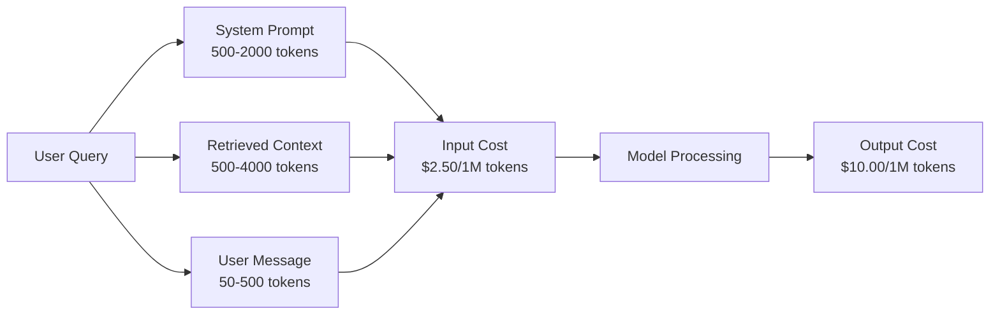
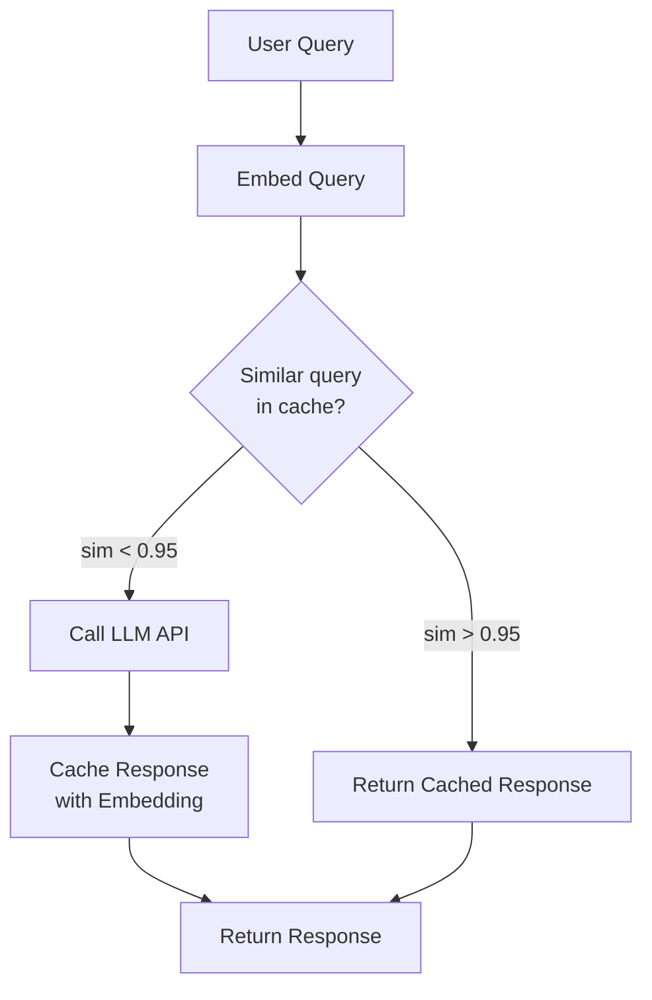
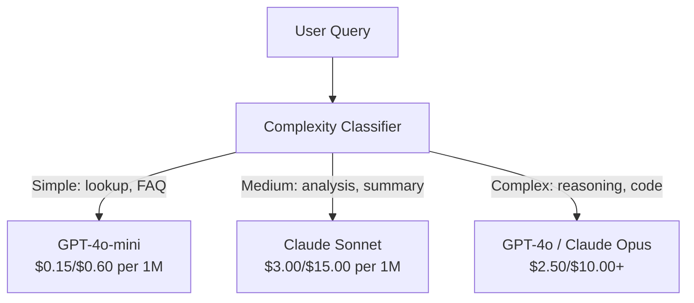

# Кеширование, ограничение частоты запросов и оптимизация затрат

> Большинство AI-стартапов умирают не из-за плохих моделей. Они умирают из-за плохой юнит-экономики. Один вызов GPT-4o стоит доли цента. Десять тысяч пользователей, делающих по десять вызовов в день, обходятся в $250 только на входных токенах -- ещё до того, как вы получите хоть один доллар выручки. Выживают те компании, которые относятся к каждому вызову API как к финансовой транзакции, а не как к вызову функции.

**Тип:** Build**Языки:** Python**Предварительные требования:** Фаза 11 Урок 09 (Function Calling)**Время:** ~45 минут**Связанные материалы:** Фаза 11 · 15 (Prompt Caching) — этот урок посвящён кешированию на уровне приложения (семантический кеш, кеш по точному хешу, маршрутизация моделей). Урок 15 посвящён кешированию промптов на уровне провайдера (Anthropic cache_control, OpenAI automatic, Gemini CachedContent). Сочетание обоих подходов даёт снижение затрат на 50-95%.

## Цели обучения

- Реализовать семантическое кеширование, которое обслуживает повторяющиеся или похожие запросы из кеша вместо нового вызова API
- Рассчитывать стоимость запроса для разных провайдеров и реализовать ограничение частоты запросов с учётом токенов и бюджетные оповещения
- Построить слой оптимизации затрат со сжатием промптов, маршрутизацией моделей (дорогие vs дешёвые) и кешированием ответов
- Спроектировать многоуровневую стратегию кеширования с точным совпадением, семантической близостью и кешированием префиксов для разных типов запросов

## Проблема

Вы создаёте RAG-чат-бота. Он работает прекрасно. Пользователям он нравится.

Затем приходит счёт.

GPT-5 стоит $5 за миллион входных токенов и $15 за миллион выходных. Claude Opus 4.7 стоит $15 за входные токены / $75 за выходные. Gemini 3 Pro стоит $1.25 за входные токены / $5 за выходные. GPT-5-mini стоит $0.25/$2. Цены ниже приведены для иллюстрации; всегда проверяйте актуальную страницу цен провайдера.

Вот математика, которая убивает стартапы:

- 10 000 активных пользователей в день
- 10 запросов на пользователя в день
- 1 000 входных токенов на запрос (системный промпт + контекст + сообщение пользователя)
- 500 выходных токенов на ответ

**Дневная стоимость входа:** 10 000 x 10 x 1 000 / 1 000 000 x $2.50 = **$250/день**
**Дневная стоимость выхода:** 10 000 x 10 x 500 / 1 000 000 x $10.00 = **$500/день**
**Итого за месяц:** **$22 500/месяц**

И это только LLM. Добавьте эмбеддинги, хостинг векторной базы данных, инфраструктуру. Вы получаете $30 000/месяц за чат-бота.

Самое неприятное: 40-60% этих запросов почти дублируют друг друга. Пользователи задают одни и те же вопросы немного разными словами. Ваш системный промпт -- одинаковый в каждом запросе -- оплачивается каждый раз заново. Контекстные документы, извлечённые с помощью RAG, повторяются у пользователей, спрашивающих об одной и той же теме.

Вы платите полную цену за избыточные вычисления.

## Концепция

### Анатомия стоимости вызова LLM

У каждого вызова API есть пять компонентов стоимости.



Системные промпты -- это тихий убийца. Системный промпт из 1 500 токенов, отправляемый с каждым запросом, стоит $3.75 на миллион запросов только за этот префикс. При 100K запросов в день это $375/день -- $11 250/месяц -- за текст, который никогда не меняется.

### Кеширование на стороне провайдера: встроенные скидки

Все три крупных провайдера в 2026 году предлагают кеширование промптов на стороне провайдера, но механизм у каждого свой. Подробный разбор — в Phase 11 · 15.

| Провайдер | Механизм | Скидка | Минимум | Срок хранения кеша |
|----------|-----------|----------|---------|----------------|
| Anthropic | Явные маркеры cache_control | 90% при попадании в кеш (надбавка 25% при записи) | 1,024 токена (Sonnet/Opus), 2,048 (Haiku) | По умолчанию 5 мин; расширенный срок 1 ч (двойная надбавка за запись) |
| OpenAI | Автоматическое сопоставление префиксов | 50% при попадании в кеш | 1,024 токена | По возможности до 1 часа |
| Google Gemini | Явный API CachedContent | Снижение примерно на 75% (плюс хранение) | 4,096 (Flash) / 32,768 (Pro) | TTL настраивается пользователем |

**Подход Anthropic** явный. Вы помечаете участки промпта маркером `cache_control: {"type": "ephemeral"}`. Первый запрос платит надбавку в 25% за запись. Последующие запросы с тем же префиксом получают скидку 90%. Системный промпт из 2 000 токенов, который обычно стоит $0.005, при попадании в кеш обходится в $0.000625. На 100 тыс. запросов это экономит $437.50/день.

**Подход OpenAI** автоматический. Любой префикс промпта, совпадающий с предыдущим запросом, получает скидку 50%. Маркеры не нужны. Компромисс: меньше скидка, меньше контроля, но нулевые усилия на реализацию.

### Семантическое кеширование: ваш собственный слой

Кеширование провайдера работает только для идентичных префиксов. Семантическое кеширование решает более сложный случай: разные запросы с одинаковым смыслом.

«What is the return policy?» и «How do I return an item?» -- разные строки, но идентичное намерение. Семантический кеш вычисляет эмбеддинги обоих запросов, считает косинусное сходство и возвращает закешированный ответ, если сходство превышает порог (обычно 0.92-0.95).



Затраты на эмбеддинги ничтожны. OpenAI text-embedding-3-small стоит $0.02 за миллион токенов. Проверка кеша почти ничего не стоит по сравнению с полным вызовом LLM.

### Точное кеширование: хеш и совпадение

Для детерминированных вызовов (temperature=0, та же модель, тот же промпт) точное кеширование проще и быстрее. Хешируете полный промпт, проверяете кеш, возвращаете найденный результат.

Это отлично работает для:
- Системный промпт + фиксированный контекст + идентичные запросы пользователя
- Вызов функций с идентичными определениями инструментов
- Пакетная обработка, при которой один и тот же документ обрабатывается несколько раз

### Ограничение частоты запросов: защита вашего бюджета

Ограничение частоты запросов -- это не только про справедливость. Это про выживание.

**Алгоритм token bucket:** у каждого пользователя есть корзина из N токенов, которая пополняется со скоростью R в секунду. Запрос расходует токены из корзины. Если корзина пуста, запрос отклоняется. Это допускает всплески (использовать всю корзину сразу), одновременно обеспечивая соблюдение средней скорости.

**Квоты на пользователя:** установите дневные/месячные лимиты токенов для каждого уровня пользователя.

| Уровень | Дневной лимит токенов | Макс. запросов/мин | Доступ к моделям |
|------|------------------|------------------|-------------|
| Бесплатный | 50,000 | 10 | Только GPT-4o-mini |
| Pro | 500,000 | 60 | GPT-4o, Claude Sonnet |
| Корпоративный | 5,000,000 | 300 | Все модели |

### Маршрутизация моделей: правильная модель для правильной задачи

Не каждому запросу нужна GPT-4o.

«Во сколько закрывается магазин?» не требует модели стоимостью $10 за миллион выходных токенов. GPT-4o-mini по цене $0.60 за миллион выходных токенов справится отлично. Claude Haiku по цене $1.25 за миллион выходных токенов тоже справится. Простой классификатор направляет дешёвые запросы к дешёвым моделям, а сложные -- к дорогим.



Хорошо настроенный роутер экономит 40-70% только на стоимости моделей.

### Отслеживание затрат: знать, куда уходят деньги

Нельзя оптимизировать то, что не измеряешь. Логируйте каждый вызов API с:

- Меткой времени
- Названием модели
- Входными токенами
- Выходными токенами
- Задержкой (мс)
- Рассчитанной стоимостью ($)
- ID пользователя
- Попаданием/промахом кеша
- Категорией запроса

Эти данные показывают, какие функции обходятся дорого, какие пользователи потребляют больше всего, и где кеширование даёт наибольший эффект.

### Пакетная обработка: оптовые скидки

Batch API от OpenAI обрабатывает запросы асинхронно со скидкой 50%. Вы отправляете пакет до 50 000 запросов, а результаты возвращаются в течение 24 часов.

Используйте пакетную обработку для:
- Ночной обработки документов
- Массовой классификации
- Прогонов оценивания
- Конвейеров обогащения данных

Не подходит для: запросов пользователей в реальном времени (важна задержка).

### Бюджетные оповещения и предохранители

Предохранитель (circuit breaker) останавливает расходы при достижении лимита. Без него баг или злоупотребление могут сжечь месячный бюджет за считанные часы.

Установите три порога:
1. **Предупреждение** (70% бюджета): отправить оповещение
2. **Замедление** (85% бюджета): переключиться только на более дешёвые модели
3. **Остановка** (95% бюджета): отклонять новые запросы, отдавать только закешированные ответы

### Стек оптимизации

Применяйте эти техники по порядку. Каждый уровень усиливает эффект предыдущих.

| Уровень | Метод | Типичная экономия | Сложность реализации |
|-------|-----------|----------------|----------------------|
| 1 | Кеширование промптов на стороне провайдера | 30-50% | Низкая (добавить маркеры кеширования) |
| 2 | Точное кеширование | 10-20% | Низкая (хеш + словарь) |
| 3 | Семантическое кеширование | 15-30% | Средняя (эмбеддинги + сходство) |
| 4 | Маршрутизация моделей | 40-70% | Средняя (классификатор) |
| 5 | Ограничение частоты запросов | Защита бюджета | Низкая (корзина токенов) |
| 6 | Сжатие промптов | 10-30% | Средняя (переписать промпты) |
| 7 | Пакетная обработка | 50% для подходящих задач | Низкая (Batch API) |

Приложение RAG, применяющее слои 1-5, обычно снижает затраты с $22,500/месяц до $4 000-6 000/месяц. В этом разница между расходованием финансовой подушки и построением бизнеса.

### Реальная экономия: до и после

Вот реальная разбивка для RAG-чат-бота, обслуживающего 10 000 DAU.

| Метрика | До оптимизации | После оптимизации | Экономия |
|--------|--------------------|--------------------|---------|
| Месячные затраты на LLM | $22,500 | $5,200 | 77% |
| Средняя стоимость запроса | $0.0075 | $0.0017 | 77% |
| Доля попаданий в кеш | 0% | 52% | -- |
| Запросы, направленные к mini | 0% | 65% | -- |
| Задержка P95 | 2,800ms | 900ms (при попадании в кеш: 50ms) | 68% |
| Месячные затраты на эмбеддинги | $0 | $180 | (новые затраты) |
| Общие месячные затраты | $22,500 | $5,380 | 76% |

Затраты на эмбеддинги для семантического кеширования ($180/месяц) окупаются уже в первый час попаданий в кеш.

```figure
semantic-cache
```

## Создаём

### Шаг 1: Калькулятор стоимости

Постройте калькулятор стоимости токенов, который знает актуальные цены основных моделей.

```python
import hashlib
import time
import json
import math
from dataclasses import dataclass, field


MODEL_PRICING = {
    "gpt-4o": {"input": 2.50, "output": 10.00, "cached_input": 1.25},
    "gpt-4o-mini": {"input": 0.15, "output": 0.60, "cached_input": 0.075},
    "gpt-4.1": {"input": 2.00, "output": 8.00, "cached_input": 0.50},
    "gpt-4.1-mini": {"input": 0.40, "output": 1.60, "cached_input": 0.10},
    "gpt-4.1-nano": {"input": 0.10, "output": 0.40, "cached_input": 0.025},
    "o3": {"input": 2.00, "output": 8.00, "cached_input": 0.50},
    "o3-mini": {"input": 1.10, "output": 4.40, "cached_input": 0.55},
    "o4-mini": {"input": 1.10, "output": 4.40, "cached_input": 0.275},
    "claude-opus-4": {"input": 15.00, "output": 75.00, "cached_input": 1.50},
    "claude-sonnet-4": {"input": 3.00, "output": 15.00, "cached_input": 0.30},
    "claude-haiku-3.5": {"input": 0.80, "output": 4.00, "cached_input": 0.08},
    "gemini-2.5-pro": {"input": 1.25, "output": 10.00, "cached_input": 0.3125},
    "gemini-2.5-flash": {"input": 0.15, "output": 0.60, "cached_input": 0.0375},
}


def calculate_cost(model, input_tokens, output_tokens, cached_input_tokens=0):
    if model not in MODEL_PRICING:
        return {"error": f"Unknown model: {model}"}
    pricing = MODEL_PRICING[model]
    non_cached = input_tokens - cached_input_tokens
    input_cost = (non_cached / 1_000_000) * pricing["input"]
    cached_cost = (cached_input_tokens / 1_000_000) * pricing["cached_input"]
    output_cost = (output_tokens / 1_000_000) * pricing["output"]
    total = input_cost + cached_cost + output_cost
    return {
        "model": model,
        "input_tokens": input_tokens,
        "output_tokens": output_tokens,
        "cached_input_tokens": cached_input_tokens,
        "input_cost": round(input_cost, 6),
        "cached_input_cost": round(cached_cost, 6),
        "output_cost": round(output_cost, 6),
        "total_cost": round(total, 6),
    }
```

### Шаг 2: Точный кеш

Хешируйте полный промпт и возвращайте закешированные ответы для идентичных запросов.

```python
class ExactCache:
    def __init__(self, max_size=1000, ttl_seconds=3600):
        self.cache = {}
        self.max_size = max_size
        self.ttl = ttl_seconds
        self.hits = 0
        self.misses = 0

    def _hash(self, model, messages, temperature):
        key_data = json.dumps({"model": model, "messages": messages, "temperature": temperature}, sort_keys=True)
        return hashlib.sha256(key_data.encode()).hexdigest()

    def get(self, model, messages, temperature=0.0):
        if temperature > 0:
            self.misses += 1
            return None
        key = self._hash(model, messages, temperature)
        if key in self.cache:
            entry = self.cache[key]
            if time.time() - entry["timestamp"] < self.ttl:
                self.hits += 1
                entry["access_count"] += 1
                return entry["response"]
            del self.cache[key]
        self.misses += 1
        return None

    def put(self, model, messages, temperature, response):
        if temperature > 0:
            return
        if len(self.cache) >= self.max_size:
            oldest_key = min(self.cache, key=lambda k: self.cache[k]["timestamp"])
            del self.cache[oldest_key]
        key = self._hash(model, messages, temperature)
        self.cache[key] = {
            "response": response,
            "timestamp": time.time(),
            "access_count": 1,
        }

    def stats(self):
        total = self.hits + self.misses
        return {
            "hits": self.hits,
            "misses": self.misses,
            "hit_rate": round(self.hits / total, 4) if total > 0 else 0,
            "cache_size": len(self.cache),
        }
```

### Шаг 3: Семантический кеш

Вычисляйте эмбеддинги запросов и возвращайте закешированные ответы, когда сходство превышает порог.

```python
def simple_embed(text):
    words = text.lower().split()
    vocab = {}
    for w in words:
        vocab[w] = vocab.get(w, 0) + 1
    norm = math.sqrt(sum(v * v for v in vocab.values()))
    if norm == 0:
        return {}
    return {k: v / norm for k, v in vocab.items()}


def cosine_similarity(a, b):
    if not a or not b:
        return 0.0
    all_keys = set(a) | set(b)
    dot = sum(a.get(k, 0) * b.get(k, 0) for k in all_keys)
    return dot


class SemanticCache:
    def __init__(self, similarity_threshold=0.85, max_size=500, ttl_seconds=3600):
        self.entries = []
        self.threshold = similarity_threshold
        self.max_size = max_size
        self.ttl = ttl_seconds
        self.hits = 0
        self.misses = 0

    def get(self, query):
        query_embedding = simple_embed(query)
        now = time.time()
        best_match = None
        best_sim = 0.0
        for entry in self.entries:
            if now - entry["timestamp"] > self.ttl:
                continue
            sim = cosine_similarity(query_embedding, entry["embedding"])
            if sim > best_sim:
                best_sim = sim
                best_match = entry
        if best_match and best_sim >= self.threshold:
            self.hits += 1
            best_match["access_count"] += 1
            return {"response": best_match["response"], "similarity": round(best_sim, 4), "original_query": best_match["query"]}
        self.misses += 1
        return None

    def put(self, query, response):
        if len(self.entries) >= self.max_size:
            self.entries.sort(key=lambda e: e["timestamp"])
            self.entries.pop(0)
        self.entries.append({
            "query": query,
            "embedding": simple_embed(query),
            "response": response,
            "timestamp": time.time(),
            "access_count": 1,
        })

    def stats(self):
        total = self.hits + self.misses
        return {
            "hits": self.hits,
            "misses": self.misses,
            "hit_rate": round(self.hits / total, 4) if total > 0 else 0,
            "cache_size": len(self.entries),
        }
```

### Шаг 4: Ограничитель частоты запросов

Ограничитель частоты запросов на основе token bucket с квотами на пользователя.

```python
class TokenBucketRateLimiter:
    def __init__(self):
        self.buckets = {}
        self.tiers = {
            "free": {"capacity": 50_000, "refill_rate": 500, "max_requests_per_min": 10},
            "pro": {"capacity": 500_000, "refill_rate": 5_000, "max_requests_per_min": 60},
            "enterprise": {"capacity": 5_000_000, "refill_rate": 50_000, "max_requests_per_min": 300},
        }

    def _get_bucket(self, user_id, tier="free"):
        if user_id not in self.buckets:
            tier_config = self.tiers.get(tier, self.tiers["free"])
            self.buckets[user_id] = {
                "tokens": tier_config["capacity"],
                "capacity": tier_config["capacity"],
                "refill_rate": tier_config["refill_rate"],
                "last_refill": time.time(),
                "request_timestamps": [],
                "max_rpm": tier_config["max_requests_per_min"],
                "tier": tier,
                "total_tokens_used": 0,
            }
        return self.buckets[user_id]

    def _refill(self, bucket):
        now = time.time()
        elapsed = now - bucket["last_refill"]
        refill = int(elapsed * bucket["refill_rate"])
        if refill > 0:
            bucket["tokens"] = min(bucket["capacity"], bucket["tokens"] + refill)
            bucket["last_refill"] = now

    def check(self, user_id, tokens_needed, tier="free"):
        bucket = self._get_bucket(user_id, tier)
        self._refill(bucket)
        now = time.time()
        bucket["request_timestamps"] = [t for t in bucket["request_timestamps"] if now - t < 60]
        if len(bucket["request_timestamps"]) >= bucket["max_rpm"]:
            return {"allowed": False, "reason": "rate_limit", "retry_after_seconds": 60 - (now - bucket["request_timestamps"][0])}
        if bucket["tokens"] < tokens_needed:
            deficit = tokens_needed - bucket["tokens"]
            wait = deficit / bucket["refill_rate"]
            return {"allowed": False, "reason": "token_limit", "tokens_available": bucket["tokens"], "retry_after_seconds": round(wait, 1)}
        return {"allowed": True, "tokens_available": bucket["tokens"]}

    def consume(self, user_id, tokens_used, tier="free"):
        bucket = self._get_bucket(user_id, tier)
        bucket["tokens"] -= tokens_used
        bucket["request_timestamps"].append(time.time())
        bucket["total_tokens_used"] += tokens_used

    def get_usage(self, user_id):
        if user_id not in self.buckets:
            return {"error": "User not found"}
        b = self.buckets[user_id]
        return {
            "user_id": user_id,
            "tier": b["tier"],
            "tokens_remaining": b["tokens"],
            "capacity": b["capacity"],
            "total_tokens_used": b["total_tokens_used"],
            "utilization": round(b["total_tokens_used"] / b["capacity"], 4) if b["capacity"] else 0,
        }
```

### Шаг 5: Учёт стоимости

Логируйте каждый вызов и вычисляйте текущие итоги.

```python
class CostTracker:
    def __init__(self, monthly_budget=1000.0):
        self.logs = []
        self.monthly_budget = monthly_budget
        self.alerts = []

    def log_call(self, model, input_tokens, output_tokens, cached_input_tokens=0, latency_ms=0, user_id="anonymous", cache_status="miss"):
        cost = calculate_cost(model, input_tokens, output_tokens, cached_input_tokens)
        entry = {
            "timestamp": time.time(),
            "model": model,
            "input_tokens": input_tokens,
            "output_tokens": output_tokens,
            "cached_input_tokens": cached_input_tokens,
            "latency_ms": latency_ms,
            "cost": cost["total_cost"],
            "user_id": user_id,
            "cache_status": cache_status,
        }
        self.logs.append(entry)
        self._check_budget()
        return entry

    def _check_budget(self):
        total = self.total_cost()
        pct = total / self.monthly_budget if self.monthly_budget > 0 else 0
        if pct >= 0.95 and not any(a["level"] == "stop" for a in self.alerts):
            self.alerts.append({"level": "stop", "message": f"Budget 95% consumed: ${total:.2f}/${self.monthly_budget:.2f}", "timestamp": time.time()})
        elif pct >= 0.85 and not any(a["level"] == "throttle" for a in self.alerts):
            self.alerts.append({"level": "throttle", "message": f"Budget 85% consumed: ${total:.2f}/${self.monthly_budget:.2f}", "timestamp": time.time()})
        elif pct >= 0.70 and not any(a["level"] == "warning" for a in self.alerts):
            self.alerts.append({"level": "warning", "message": f"Budget 70% consumed: ${total:.2f}/${self.monthly_budget:.2f}", "timestamp": time.time()})

    def total_cost(self):
        return round(sum(e["cost"] for e in self.logs), 6)

    def cost_by_model(self):
        by_model = {}
        for e in self.logs:
            m = e["model"]
            if m not in by_model:
                by_model[m] = {"calls": 0, "cost": 0, "input_tokens": 0, "output_tokens": 0}
            by_model[m]["calls"] += 1
            by_model[m]["cost"] = round(by_model[m]["cost"] + e["cost"], 6)
            by_model[m]["input_tokens"] += e["input_tokens"]
            by_model[m]["output_tokens"] += e["output_tokens"]
        return by_model

    def cache_savings(self):
        cache_hits = [e for e in self.logs if e["cache_status"] == "hit"]
        if not cache_hits:
            return {"saved": 0, "cache_hits": 0}
        saved = 0
        for e in cache_hits:
            full_cost = calculate_cost(e["model"], e["input_tokens"], e["output_tokens"])
            saved += full_cost["total_cost"]
        return {"saved": round(saved, 4), "cache_hits": len(cache_hits)}

    def summary(self):
        if not self.logs:
            return {"total_calls": 0, "total_cost": 0}
        total_latency = sum(e["latency_ms"] for e in self.logs)
        cache_hits = sum(1 for e in self.logs if e["cache_status"] == "hit")
        return {
            "total_calls": len(self.logs),
            "total_cost": self.total_cost(),
            "avg_cost_per_call": round(self.total_cost() / len(self.logs), 6),
            "avg_latency_ms": round(total_latency / len(self.logs), 1),
            "cache_hit_rate": round(cache_hits / len(self.logs), 4),
            "cost_by_model": self.cost_by_model(),
            "cache_savings": self.cache_savings(),
            "budget_remaining": round(self.monthly_budget - self.total_cost(), 2),
            "budget_utilization": round(self.total_cost() / self.monthly_budget, 4) if self.monthly_budget > 0 else 0,
            "alerts": self.alerts,
        }
```

### Шаг 6: Маршрутизатор моделей

Направляйте запросы к самой дешёвой модели, способной с ними справиться.

```python
SIMPLE_KEYWORDS = ["what time", "hours", "address", "phone", "price", "return policy", "hello", "hi", "thanks", "yes", "no"]
COMPLEX_KEYWORDS = ["analyze", "compare", "explain why", "write code", "debug", "architect", "design", "trade-off", "evaluate"]


def classify_complexity(query):
    q = query.lower()
    if len(q.split()) <= 5 or any(kw in q for kw in SIMPLE_KEYWORDS):
        return "simple"
    if any(kw in q for kw in COMPLEX_KEYWORDS):
        return "complex"
    return "medium"


def route_model(query, tier="pro"):
    complexity = classify_complexity(query)
    routing_table = {
        "simple": {"free": "gpt-4.1-nano", "pro": "gpt-4o-mini", "enterprise": "gpt-4o-mini"},
        "medium": {"free": "gpt-4o-mini", "pro": "claude-sonnet-4", "enterprise": "claude-sonnet-4"},
        "complex": {"free": "gpt-4o-mini", "pro": "gpt-4o", "enterprise": "claude-opus-4"},
    }
    model = routing_table[complexity].get(tier, "gpt-4o-mini")
    return {"query": query, "complexity": complexity, "model": model, "tier": tier}
```

### Шаг 7: Запуск демонстрации

```python
def simulate_llm_call(model, query):
    input_tokens = len(query.split()) * 4 + 500
    output_tokens = 150 + (len(query.split()) * 2)
    latency = 200 + (output_tokens * 2)
    return {
        "model": model,
        "response": f"[Simulated {model} response to: {query[:50]}...]",
        "input_tokens": input_tokens,
        "output_tokens": output_tokens,
        "latency_ms": latency,
    }


def run_demo():
    print("=" * 60)
    print("  Caching, Rate Limiting & Cost Optimization Demo")
    print("=" * 60)

    print("\n--- Model Pricing ---")
    for model, pricing in list(MODEL_PRICING.items())[:6]:
        cost_1k = calculate_cost(model, 1000, 500)
        print(f"  {model}: ${cost_1k['total_cost']:.6f} per 1K in + 500 out")

    print("\n--- Cost Comparison: 100K Requests ---")
    for model in ["gpt-4o", "gpt-4o-mini", "claude-sonnet-4", "claude-haiku-3.5"]:
        cost = calculate_cost(model, 1000 * 100_000, 500 * 100_000)
        print(f"  {model}: ${cost['total_cost']:.2f}")

    print("\n--- Anthropic Cache Savings ---")
    no_cache = calculate_cost("claude-sonnet-4", 2000, 500, 0)
    with_cache = calculate_cost("claude-sonnet-4", 2000, 500, 1500)
    saving = no_cache["total_cost"] - with_cache["total_cost"]
    print(f"  Without cache: ${no_cache['total_cost']:.6f}")
    print(f"  With 1500 cached tokens: ${with_cache['total_cost']:.6f}")
    print(f"  Savings per call: ${saving:.6f} ({saving/no_cache['total_cost']*100:.1f}%)")

    exact_cache = ExactCache(max_size=100, ttl_seconds=300)
    semantic_cache = SemanticCache(similarity_threshold=0.75, max_size=100)
    rate_limiter = TokenBucketRateLimiter()
    tracker = CostTracker(monthly_budget=100.0)

    print("\n--- Exact Cache ---")
    messages_1 = [{"role": "user", "content": "What is the return policy?"}]
    result = exact_cache.get("gpt-4o-mini", messages_1, 0.0)
    print(f"  First lookup: {'HIT' if result else 'MISS'}")
    exact_cache.put("gpt-4o-mini", messages_1, 0.0, "You can return items within 30 days.")
    result = exact_cache.get("gpt-4o-mini", messages_1, 0.0)
    print(f"  Second lookup: {'HIT' if result else 'MISS'} -> {result}")
    result = exact_cache.get("gpt-4o-mini", messages_1, 0.7)
    print(f"  With temp=0.7: {'HIT' if result else 'MISS (non-deterministic, skip cache)'}")
    print(f"  Stats: {exact_cache.stats()}")

    print("\n--- Semantic Cache ---")
    test_queries = [
        ("What is the return policy?", "Items can be returned within 30 days with receipt."),
        ("How do I return an item?", None),
        ("What are your store hours?", "We are open 9am-9pm Monday through Saturday."),
        ("When does the store open?", None),
        ("Tell me about quantum computing", "Quantum computers use qubits..."),
        ("Explain quantum mechanics", None),
    ]
    for query, response in test_queries:
        cached = semantic_cache.get(query)
        if cached:
            print(f"  '{query[:40]}' -> CACHE HIT (sim={cached['similarity']}, original='{cached['original_query'][:40]}')")
        elif response:
            semantic_cache.put(query, response)
            print(f"  '{query[:40]}' -> MISS (stored)")
        else:
            print(f"  '{query[:40]}' -> MISS (no match)")
    print(f"  Stats: {semantic_cache.stats()}")

    print("\n--- Rate Limiting ---")
    for i in range(12):
        check = rate_limiter.check("user_1", 1000, "free")
        if check["allowed"]:
            rate_limiter.consume("user_1", 1000, "free")
        status = "OK" if check["allowed"] else f"BLOCKED ({check['reason']})"
        if i < 5 or not check["allowed"]:
            print(f"  Request {i+1}: {status}")
    print(f"  Usage: {rate_limiter.get_usage('user_1')}")

    print("\n--- Model Routing ---")
    routing_queries = [
        "What time do you close?",
        "Summarize this quarterly earnings report",
        "Analyze the trade-offs between microservices and monoliths",
        "Hello",
        "Write code for a binary search tree with deletion",
    ]
    for q in routing_queries:
        route = route_model(q, "pro")
        print(f"  '{q[:50]}' -> {route['model']} ({route['complexity']})")

    print("\n--- Full Pipeline: Before vs After Optimization ---")
    queries = [
        "What is the return policy?",
        "How do I return something?",
        "What are your hours?",
        "When do you open?",
        "Explain the difference between TCP and UDP",
        "Compare TCP vs UDP protocols",
        "Hello",
        "What is your phone number?",
        "Write a Python function to sort a list",
        "Analyze the pros and cons of serverless architecture",
    ]

    print("\n  [Before: no caching, single model (gpt-4o)]")
    tracker_before = CostTracker(monthly_budget=1000.0)
    for q in queries:
        result = simulate_llm_call("gpt-4o", q)
        tracker_before.log_call("gpt-4o", result["input_tokens"], result["output_tokens"], latency_ms=result["latency_ms"], cache_status="miss")
    before = tracker_before.summary()
    print(f"  Total cost: ${before['total_cost']:.6f}")
    print(f"  Avg cost/call: ${before['avg_cost_per_call']:.6f}")
    print(f"  Avg latency: {before['avg_latency_ms']}ms")

    print("\n  [After: caching + routing + rate limiting]")
    exact_c = ExactCache()
    semantic_c = SemanticCache(similarity_threshold=0.75)
    tracker_after = CostTracker(monthly_budget=1000.0)

    for q in queries:
        messages = [{"role": "user", "content": q}]
        cached = exact_c.get("gpt-4o", messages, 0.0)
        if cached:
            tracker_after.log_call("gpt-4o-mini", 0, 0, latency_ms=5, cache_status="hit")
            continue
        sem_cached = semantic_c.get(q)
        if sem_cached:
            tracker_after.log_call("gpt-4o-mini", 0, 0, latency_ms=15, cache_status="hit")
            continue
        route = route_model(q)
        result = simulate_llm_call(route["model"], q)
        tracker_after.log_call(route["model"], result["input_tokens"], result["output_tokens"], latency_ms=result["latency_ms"], cache_status="miss")
        exact_c.put(route["model"], messages, 0.0, result["response"])
        semantic_c.put(q, result["response"])

    after = tracker_after.summary()
    print(f"  Total cost: ${after['total_cost']:.6f}")
    print(f"  Avg cost/call: ${after['avg_cost_per_call']:.6f}")
    print(f"  Avg latency: {after['avg_latency_ms']}ms")
    print(f"  Cache hit rate: {after['cache_hit_rate']:.0%}")

    if before["total_cost"] > 0:
        savings_pct = (1 - after["total_cost"] / before["total_cost"]) * 100
        print(f"\n  SAVINGS: {savings_pct:.1f}% cost reduction")
        print(f"  Latency improvement: {(1 - after['avg_latency_ms'] / before['avg_latency_ms']) * 100:.1f}% faster")

    print("\n--- Budget Alerts Demo ---")
    alert_tracker = CostTracker(monthly_budget=0.01)
    for i in range(5):
        alert_tracker.log_call("gpt-4o", 5000, 2000, latency_ms=500)
    print(f"  Total spent: ${alert_tracker.total_cost():.6f} / ${alert_tracker.monthly_budget}")
    for alert in alert_tracker.alerts:
        print(f"  ALERT [{alert['level'].upper()}]: {alert['message']}")

    print("\n--- Cost Breakdown by Model ---")
    multi_tracker = CostTracker(monthly_budget=500.0)
    for _ in range(50):
        multi_tracker.log_call("gpt-4o-mini", 800, 200, latency_ms=150)
    for _ in range(30):
        multi_tracker.log_call("claude-sonnet-4", 1500, 500, latency_ms=400)
    for _ in range(10):
        multi_tracker.log_call("gpt-4o", 2000, 800, latency_ms=600)
    for _ in range(10):
        multi_tracker.log_call("claude-opus-4", 3000, 1000, latency_ms=1200)
    breakdown = multi_tracker.cost_by_model()
    for model, data in sorted(breakdown.items(), key=lambda x: x[1]["cost"], reverse=True):
        print(f"  {model}: {data['calls']} calls, ${data['cost']:.6f}, {data['input_tokens']:,} in / {data['output_tokens']:,} out")
    print(f"  Total: ${multi_tracker.total_cost():.6f}")

    print("\n" + "=" * 60)
    print("  Demo complete.")
    print("=" * 60)


if __name__ == "__main__":
    run_demo()
```

## Применяем

### Кеширование промптов Anthropic

```python
# import anthropic
#
# client = anthropic.Anthropic()
#
# response = client.messages.create(
#     model="claude-sonnet-5",
#     max_tokens=1024,
#     system=[
#         {
#             "type": "text",
#             "text": "You are a helpful customer support agent for Acme Corp...",
#             "cache_control": {"type": "ephemeral"},
#         }
#     ],
#     messages=[{"role": "user", "content": "What is the return policy?"}],
# )
#
# print(f"Input tokens: {response.usage.input_tokens}")
# print(f"Cache creation tokens: {response.usage.cache_creation_input_tokens}")
# print(f"Cache read tokens: {response.usage.cache_read_input_tokens}")
```

Первый вызов записывает в кеш (надбавка 25%). Каждый последующий вызов с тем же префиксом системного промпта читает из кеша (скидка 90%). Кеш живёт 5 минут и сбрасывает таймер при каждом попадании.

### Автоматическое кеширование OpenAI

```python
# from openai import OpenAI
#
# client = OpenAI()
#
# response = client.chat.completions.create(
#     model="gpt-4o",
#     messages=[
#         {"role": "system", "content": "You are a helpful customer support agent..."},
#         {"role": "user", "content": "What is the return policy?"},
#     ],
# )
#
# print(f"Prompt tokens: {response.usage.prompt_tokens}")
# print(f"Cached tokens: {response.usage.prompt_tokens_details.cached_tokens}")
# print(f"Completion tokens: {response.usage.completion_tokens}")
```

OpenAI кеширует автоматически. Любой префикс промпта из 1 024+ токенов, совпадающий с недавним запросом, получает скидку 50%. Изменения кода не нужны -- просто проверьте `prompt_tokens_details.cached_tokens` в ответе, чтобы убедиться, что это работает.

### Пакетный API OpenAI

```python
# import json
# from openai import OpenAI
#
# client = OpenAI()
#
# requests = []
# for i, query in enumerate(queries):
#     requests.append({
#         "custom_id": f"request-{i}",
#         "method": "POST",
#         "url": "/v1/chat/completions",
#         "body": {
#             "model": "gpt-4o-mini",
#             "messages": [{"role": "user", "content": query}],
#         },
#     })
#
# with open("batch_input.jsonl", "w") as f:
#     for r in requests:
#         f.write(json.dumps(r) + "\n")
#
# batch_file = client.files.create(file=open("batch_input.jsonl", "rb"), purpose="batch")
# batch = client.batches.create(input_file_id=batch_file.id, endpoint="/v1/chat/completions", completion_window="24h")
# print(f"Batch ID: {batch.id}, Status: {batch.status}")
```

Batch API даёт фиксированную скидку 50% на все токены. Результаты приходят в течение 24 часов. Идеально подходит для задач, не требующих обработки в реальном времени: оценивания, разметки данных, массового суммирования.

### Промышленный семантический кеш с Redis

```python
# import redis
# import numpy as np
# from openai import OpenAI
#
# r = redis.Redis()
# client = OpenAI()
#
# def get_embedding(text):
#     response = client.embeddings.create(model="text-embedding-3-small", input=text)
#     return response.data[0].embedding
#
# def semantic_cache_lookup(query, threshold=0.95):
#     query_emb = np.array(get_embedding(query))
#     keys = r.keys("cache:emb:*")
#     best_sim, best_key = 0, None
#     for key in keys:
#         stored_emb = np.frombuffer(r.get(key), dtype=np.float32)
#         sim = np.dot(query_emb, stored_emb) / (np.linalg.norm(query_emb) * np.linalg.norm(stored_emb))
#         if sim > best_sim:
#             best_sim, best_key = sim, key
#     if best_sim >= threshold and best_key:
#         response_key = best_key.decode().replace("cache:emb:", "cache:resp:")
#         return r.get(response_key).decode()
#     return None
```

В production замените линейный перебор векторным индексом (Redis Vector Search, Pinecone или pgvector). Линейный перебор работает для <1 000 записей. Сверх этого используйте ANN (приближённый поиск ближайших соседей) для поиска за O(log n).

## Публикуем

Этот урок производит `outputs/prompt-cost-optimizer.md` -- переиспользуемый промпт, который анализирует ваше LLM-приложение и рекомендует конкретные оптимизации затрат с прогнозируемой экономией.

Он также производит `outputs/skill-cost-patterns.md` -- фреймворк принятия решений для выбора правильной стратегии кеширования, конфигурации ограничения частоты запросов и правил маршрутизации моделей под ваш случай использования.

## Упражнения

1. **Реализуйте LRU-вытеснение для семантического кеша.** Замените вытеснение «сначала самое старое» на вытеснение по принципу «наименее недавно использованное». Отслеживайте время последнего обращения для каждой записи и вытесняйте запись с самым старым временем обращения при заполнении кеша. Сравните hit rate между двумя стратегиями на 100 запросах.

2. **Постройте инструмент прогнозирования затрат.** По логу вызовов API (логи CostTracker) спрогнозируйте месячные затраты на основе скользящего среднего за 7 дней. Учтите паттерны будни/выходные. Срабатывайте оповещение, если прогнозируемые месячные затраты превышают бюджет более чем на 20%.

3. **Реализуйте многоуровневое семантическое кеширование.** Используйте два порога сходства: 0.98 для попаданий с высокой уверенностью (возвращать сразу) и 0.90 для попаданий со средней уверенностью (возвращать с оговоркой: «На основе похожего предыдущего вопроса...»). Отслеживайте, из какого уровня пришло каждое попадание, и измеряйте разницу в удовлетворённости пользователей.

4. **Постройте классификатор маршрутизации моделей.** Замените классификатор на основе ключевых слов на классификатор на основе эмбеддингов. Вычислите эмбеддинги 50 размеченных запросов (простой/средний/сложный), затем классифицируйте новые запросы, находя ближайший размеченный пример. Измерьте точность классификации на тестовом наборе из 20 запросов.

5. **Реализуйте предохранитель с уровнями деградации.** При 70% бюджета логируйте предупреждение. При 85% автоматически переключайте всю маршрутизацию на самую дешёвую модель (gpt-4o-mini). При 95% обслуживайте только закешированные ответы и отклоняйте новые запросы. Проверьте, симулировав 1 000 запросов при бюджете $1.00, и убедитесь, что каждый порог срабатывает корректно.

## Ключевые термины

| Термин | Как обычно говорят | Что это значит на самом деле |
|------|----------------|----------------------|
| Кеширование промптов | «Закешируйте системный промпт» | Кеширование на уровне провайдера, при котором повторяющиеся префиксы промпта получают скидку (90% Anthropic, 50% OpenAI) -- без изменений кода для OpenAI, явные маркеры для Anthropic |
| Семантическое кеширование | «Умное кеширование» | Вычисление эмбеддинга запроса, расчёт сходства с прошлыми запросами и возврат закешированного ответа, если сходство превышает порог -- ловит перефразировки, которые пропускает точное совпадение |
| Точное кеширование | «Кеширование по хешу» | Хеширование полного промпта (модель + сообщения + temperature) и возврат закешированного ответа для идентичных входных данных -- работает только для детерминированных вызовов с temperature=0 |
| Корзина токенов | «Ограничитель частоты запросов» | Алгоритм, при котором у каждого пользователя есть корзина из N токенов, пополняемая со скоростью R в секунду -- допускает всплески до N при соблюдении средней скорости R |
| Маршрутизация моделей | «Маршрутизация для экономных» | Использование классификатора для направления простых запросов к дешёвым моделям (GPT-4o-mini, Haiku), а сложных -- к дорогим (GPT-4o, Opus) -- экономит 40-70% на стоимости моделей |
| Учёт затрат | «Измерение расходов» | Логирование каждого вызова API с моделью, токенами, задержкой, стоимостью и ID пользователя, чтобы точно знать, куда уходят деньги и какие функции дорого обходятся |
| Предохранитель | «Аварийный выключатель» | Автоматическая деградация сервиса (более дешёвые модели, только кеш) или полная остановка запросов при приближении расходов к лимиту бюджета |
| Batch API | «Оптовая скидка» | Асинхронная обработка от OpenAI со скидкой 50% -- отправьте до 50 000 запросов, получите результаты в течение 24 часов |
| Сжатие промптов | «Токенная диета» | Переписывание системных промптов и контекста для использования меньшего числа токенов при сохранении смысла -- более короткие промпты стоят дешевле и часто работают лучше |
| Доля попаданий в кеш | «Эффективность кеша» | Процент запросов, обслуженных из кеша вместо вызова LLM -- 40-60% типично для production чат-ботов, экономит пропорционально на затратах |

## Дополнительное чтение

- [Anthropic Prompt Caching Guide](https://docs.anthropic.com/en/docs/build-with-claude/prompt-caching) -- официальная документация по явным маркерам cache_control от Anthropic, ценам и поведению времени жизни кеша
- [OpenAI Prompt Caching](https://platform.openai.com/docs/guides/prompt-caching) -- автоматическое кеширование OpenAI, как проверить попадания в кеш через поля usage и минимальные длины префикса
- [OpenAI Batch API](https://platform.openai.com/docs/guides/batch) -- скидка 50% за асинхронную обработку, формат JSONL, 24-часовое окно завершения и лимит 50 тыс. запросов
- [GPTCache](https://github.com/zilliztech/GPTCache) -- open-source библиотека семантического кеширования с поддержкой нескольких бэкендов эмбеддингов, векторных хранилищ и политик вытеснения
- [Martian Model Router](https://docs.withmartian.com) -- production-маршрутизация моделей, автоматически выбирающая самую дешёвую модель, способную справиться с каждым запросом
- [Not Diamond](https://www.notdiamond.ai) -- ML-маршрутизатор моделей, обучающийся на паттернах вашего трафика для оптимизации соотношения цена/качество между провайдерами
- [Helicone](https://www.helicone.ai) -- платформа наблюдаемости LLM с отслеживанием затрат, кешированием, ограничением частоты запросов и бюджетными оповещениями как слой прокси
- [Dean & Barroso, "The Tail at Scale" (CACM 2013)](https://research.google/pubs/the-tail-at-scale/) -- задержка, пропускная способность, перцентили TTFT/TPOT и hedged-запросы; модель затрат, стоящая за принципом «выбирайте самую дешёвую модель, которая всё ещё укладывается в P95»
- [Kwon et al., "Efficient Memory Management for Large Language Model Serving with PagedAttention" (SOSP 2023)](https://arxiv.org/abs/2309.06180) -- статья про vLLM; почему paged KV-cache и continuous batching превосходят наивные серверы в 24 раза по пропускной способности -- инфраструктурный слой под «кешированием и затратами»
- [Dao et al., "FlashAttention-2: Faster Attention with Better Parallelism and Work Partitioning" (ICLR 2024)](https://arxiv.org/abs/2307.08691) -- снижение затрат на уровне ядра, ортогональное кешированию промптов; читайте вместе со спекулятивным декодированием и GQA для полной картины кривой затрат
