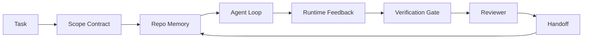

# Инженерия рабочего стенда агента: почему способные модели всё равно терпят неудачу

> Способной модели недостаточно. Надёжным агентам нужен рабочий стенд: инструкции, состояние, область действия, обратная связь, верификация, ревью и передача контекста. Уберите это — и даже передовая модель выдаёт работу, которую небезопасно поставлять.

**Тип:** Learn + Build
**Языки:** Python (stdlib)
**Предварительные требования:** Этап 14 · 01 (Цикл агента), Этап 14 · 26 (Режимы отказа)
**Время:** ~45 минут

## Цели обучения

- Отделить способности модели от надёжности выполнения.
- Назвать семь поверхностей рабочего стенда, которые определяют, дойдёт ли работа агента до продакшена.
- Сравнить прогон только с промптом и прогон с рабочим стендом на небольшой задаче в репозитории.
- Составить отчёт о режимах отказа, связывающий каждую пропущенную поверхность с вызванным ею симптомом.

## Проблема

Вы запускаете передовую модель в реальном репозитории и просите добавить валидацию входных данных. Она открывает четыре файла, пишет правдоподобный код, объявляет об успехе и останавливается. Вы запускаете тесты. Два падают. Затронут третий файл, не имевший отношения к валидации. Нет никакой записи о том, что агент предполагал, что пробовал первым делом и что осталось сделать.

Модель не ошиблась в Python. Она ошиблась в понимании работы. Она не имела представления о том, что считается завершением, куда ей разрешено писать, какие тесты авторитетны и как следующая сессия должна подхватить работу.

Это не баг модели. Это баг рабочего стенда. Окружению вокруг агента не хватает частей, превращающих генерацию за один проход в надёжную, возобновляемую инженерную работу.

## Концепция

Рабочий стенд (workbench) — это операционное окружение, оборачивающее модель во время выполнения задачи. У него семь поверхностей:

| Поверхность | Что она несёт | Отказ при отсутствии |
|---------|-----------------|----------------------|
| Инструкции | Стартовые правила, запрещённые действия, определение готовности | Агент угадывает, что значит «поставлено» |
| Состояние | Текущая задача, затронутые файлы, блокеры, следующее действие | Каждая сессия стартует с нуля |
| Область действия | Разрешённые файлы, запрещённые файлы, критерии приёмки | Правки просачиваются в несвязанный код |
| Обратная связь | Реальный вывод команд, попадающий в цикл | Агент объявляет об успехе при коде 400 |
| Верификация | Тесты, линт, дымовой прогон, проверка области действия | «Выглядит нормально» доходит до main |
| Ревью | Второй проход с другой ролью | Строитель сам проверяет свою домашнюю работу |
| Передача контекста | Что изменилось, почему, что осталось | Следующая сессия заново открывает всё с нуля |

Рабочий стенд не зависит от модели. Можно заменить модель и сохранить поверхности. Нельзя заменить поверхности и сохранить надёжность.



Цикл замыкается на файле состояния, а не на истории чата. Чат нестабилен. Репозиторий — система учёта.

### Рабочий стенд против проектирования промптов

Промпт говорит модели, что вы хотите в этом ходе. Рабочий стенд говорит модели, как выполнять работу через ходы и через сессии. Большинство историй о провалах агентов — это провалы рабочего стенда, переодетые в провалы проектирования промптов.

### Рабочий стенд против фреймворка

Фреймворк даёт вам рантайм (LangGraph, AutoGen, Agents SDK). Рабочий стенд даёт агенту место для работы внутри этого рантайма. Нужно и то, и другое. Этот мини-трек — про второе.

### Рассуждение от примитивов, а не от таксономий вендоров

Сейчас много пишут про «инженерию харнеса» (harness engineering). Addy Osmani, OpenAI, Anthropic, LangChain, Martin Fowler, MongoDB, HumanLayer, Augment Code, Thoughtworks, список walkinglabs awesome и непрерывный поток материалов на Medium и Hacker News — все несут эту тему. Они расходятся в том, где граница харнеса, что входит в его область и какой словарь использовать. Нам не нужно выбирать сторону. Семь поверхностей — это слой UX; под каждым рабочим стендом лежит один и тот же набор примитивов распределённых систем, на котором держится любой надёжный бэкенд.

Уберите на минуту ярлык «агент». Прогон агента — это вычисление, пересекающее время, процессы и машины. Чтобы сделать это надёжным, нужны те же примитивы, что нужны любой продакшен-системе.

| Примитив | Что это такое | Что он несёт для агента |
|-----------|------------|------------------------------|
| Функция | Типизированный обработчик. По возможности чистый. Владеет своими входами и выходами. | Вызов инструмента, проверка правила, шаг верификации, вызов модели |
| Воркер | Долгоживущий процесс, владеющий одной или несколькими функциями и жизненным циклом | Строитель, ревьюер, верификатор, MCP-сервер |
| Триггер | Источник событий, вызывающий функцию | Тик цикла агента, HTTP-запрос, сообщение из очереди, cron, изменение файла, хук |
| Рантайм | Граница, решающая, что где выполняется, с какими таймаутами и ресурсами | Процесс Claude Code, рантайм LangGraph, воркер-контейнер |
| HTTP / RPC | Провод между вызывающей стороной и воркером | Протокол вызова инструментов, запрос MCP, API модели |
| Очередь | Устойчивый буфер между триггером и воркером; обратное давление, повтор, идемпотентность | Доска задач, лог обратной связи, входящие ревью |
| Персистентность сессии | Состояние, переживающее сбои, перезапуски, замену модели | `agent_state.json`, контрольные точки, KV-хранилища, сам репозиторий |
| Политика авторизации | Кто может вызывать какую функцию и с какой областью действия | Разрешённые/запрещённые файлы, границы одобрения, списки возможностей MCP |

Теперь наложите семь поверхностей рабочего стенда на эти примитивы.

- **Инструкции** — политика + метаданные функций. Правила — это проверки (функции). Роутер (`AGENTS.md`) — это политика, прикреплённая к старту рантайма.
- **Состояние** — персистентность сессии. Хранилище с ключами, которое рантайм читает на каждом шаге. Файл, KV или БД; важна семантика персистентности, а не бэкенд хранения.
- **Область действия** — политика авторизации на уровне задачи. Разрешённые/запрещённые glob-шаблоны — это ACL. Требуемые одобрения — это решётка прав.
- **Обратная связь** — лог вызовов, записываемый в очередь. Каждый вызов командной оболочки — это запись, устойчивая и воспроизводимая.
- **Верификация** — функция. Детерминированная по входам. Срабатывает при закрытии задачи. При сбое запрещает дальнейшие действия.
- **Ревью** — отдельный воркер с правами только на чтение артефактов строителя и правами только на запись отчётов ревью.
- **Передача контекста** — устойчивая запись, испускаемая триггером конца сессии. Триггер старта следующей сессии читает её.

Сам цикл агента — это воркер, который потребляет события (сообщение пользователя, результат инструмента, тик таймера), вызывает функции (модель, затем инструменты, которые модель выбирает), пишет записи (состояние, обратная связь) и испускает триггеры (верификация, ревью, передача контекста). Никакой загадки — та же форма, что у обработчика заданий.

### Паттерны, циркулирующие в индустрии, переведённые на язык примитивов

Каждый популярный паттерн харнеса сводится к восьми примитивам. Таблица перевода.

| Паттерн вендора или сообщества | Что это на самом деле |
|------------------------------|--------------------|
| Ralph Loop (Claude Code, Codex, книга agentic_harness) — заново впрыснуть исходное намерение в свежее контекстное окно, когда агент пытается остановиться раньше времени | Триггер, который заново ставит задачу в очередь с чистым контекстом; персистентность сессии переносит цель дальше |
| Plan / Execute / Verify (PEV) | Три воркера, по одному на роль, общающиеся через состояние и очередь между фазами |
| Разделение харнеса и вычислений (OpenAI Agents SDK, апрель 2026) — разделение плоскости управления и плоскости выполнения | Переформулировка разделения плоскости управления и плоскости данных. Предшествует ярлыку «агент» на десятилетия |
| Open Agent Passport (OAP, март 2026) — подписывать и аудировать каждый вызов инструмента по декларативной политике перед выполнением | Политика авторизации, применяемая воркером до действия, с подписанной очередью аудита |
| Guides and Sensors (Birgitta Böckeler / Thoughtworks) — правила прямой связи (feedforward) + наблюдаемость обратной связи | Политика авторизации + функции верификации + трассировки наблюдаемости |
| Прогрессивное сжатие, 5 этапов (реверс-инжиниринг Claude Code, апрель 2026) | Воркер управления состоянием, работающий по расписанию наподобие cron над персистентностью сессии, чтобы удерживать её в бюджете |
| Хуки / промежуточное ПО (LangChain, Claude Code) — перехват вызовов модели и инструментов | Триггеры + функции, обёрнутые вокруг пути вызова рантайма |
| Навыки в виде Markdown с прогрессивным раскрытием (Anthropic, Flue) | Реестр функций, где метаданные функции загружаются в контекст точно в момент необходимости |
| Агенты в песочнице (Codex, Sandcastle, Vercel Sandbox) | Плоскость вычислений: рантайм с изолированной файловой системой, сетью и жизненным циклом |
| MCP-серверы | Воркеры, публикующие функции через стабильный RPC, со списками возможностей как авторизацией |

Каждая строка этой таблицы — это сообщество агентов, приходящее к примитиву, у которого уже было имя в распределённых системах, и дающее ему новое. Полезные ярлыки для маркетинга; бесполезные как инженерный словарь.

### Что на самом деле говорят цифры

За тезисом «харнес важнее модели» теперь стоят цифры. Их стоит знать, потому что это ещё и единственный честный аргумент против «просто подождите более умную модель».

- Terminal Bench 2.0 — та же модель, изменение харнеса подняло кодирующего агента с места за пределами топ-30 на пятое место (LangChain, *Anatomy of an Agent Harness*).
- Vercel — удалили 80% инструментов своего агента; доля успеха выросла с 80% до 100% (MongoDB).
- Harvey — юридические агенты более чем удвоили точность только за счёт оптимизации харнеса (MongoDB).
- 88% корпоративных проектов агентов ИИ не доходят до продакшена. Отказы концентрируются вокруг рантайма, а не рассуждений (preprints.org, *Harness Engineering for Language Agents*, март 2026).
- Исследование 2025 года по трём популярным фреймворкам с открытым исходным кодом показало ~50% завершения задач; в условиях длинного контекста WebAgent с длинным контекстом обвалился с 40-50% до менее чем 10%, в основном из-за бесконечных циклов и потери цели (широко освещалось в материалах начала 2026 года).

Вывод не в том, что «харнес побеждает навсегда». Модели действительно со временем впитывают трюки харнеса. Вывод в том, что сегодня несущая инженерия находится вокруг модели, а не внутри неё, и примитивы, несущие эту нагрузку, — те же, что всегда были нужны любой продакшен-системе.

### Где вендорские материалы останавливаются на полпути

В этой части не нужно проявлять вежливость.

- *Anatomy of an Agent Harness* от LangChain перечисляет одиннадцать компонентов — промпты, инструменты, хуки, песочницы, оркестрацию, память, навыки, субагентов и «тупой цикл» рантайма. Она не называет очереди, воркеров как единицу развёртывания, семантику триггеров, персистентность сессии как отдельную заботу или политику авторизации. Она трактует харнес как объект, который вы конфигурируете, а не как систему, которую вы развёртываете.
- *Agent Harness Engineering* от Addy Osmani вводит формулу `Agent = Model + Harness` и паттерн трещотки, но не доходит до того, из чего харнес состоит. Читается как позиция, а не как спецификация.
- Anthropic и OpenAI заходят глубже всех по поверхностям, но остаются внутри собственных рантаймов. Анонс «разделения харнеса и вычислений» в Agents SDK за апрель 2026 — первый материал вендора, явно поддерживающий разделение плоскости управления и плоскости данных. Это идея на уровне базовых примитивов, и она не нова.
- Книга agentic_harness трактует харнес как конфигурационный объект (*Agentic Engineering* Джеймина Уэста, глава 6), и самая сильная строка в ней — «харнес является основной границей безопасности в агентной системе». Это просто переформулированная политика авторизации.
- Треды на Hacker News раз за разом приходят к тому же месту. Тред *The agent harness belongs outside the sandbox* за апрель 2026 утверждает, что харнес должен работать «скорее как гипервизор, который сидит снаружи всего и авторизует доступ на основе контекста и пользователя». Это, опять же, политика авторизации как отдельная плоскость.

Не обязательно не соглашаться ни с одним из этих материалов, чтобы заметить пробел. Они пишут UX-описания системы, которая уже существует. Мы пишем саму систему. Когда система построена правильно, семь поверхностей вытекают из примитивов. Когда она построена неправильно, никакая полировка `AGENTS.md` не исправит отсутствующую очередь.

Так что когда вы слышите «инженерия харнеса» где-то ещё, переводите это на примитивы. Промпты и правила — это политика и функции. Каркас — это рантайм. Защитные ограничения — это авторизация + верификация. Хуки — это триггеры. Память — это персистентность сессии. Ralph Loop — это повторная постановка в очередь. Субагенты — это воркеры. Песочницы — это плоскости вычислений. Словарь меняется; инженерия — нет. Рабочий стенд — это UX, обращённый к агенту; харнес, в том смысле, который переживёт следующий вендорский ребрендинг, — это функции, воркеры, триггеры, рантаймы, очереди, персистентность и политика, правильно связанные вместе.

```figure
wb-seven-surfaces
```

## Реализация

`code/main.py` дважды прогоняет крошечную задачу в репозитории. Сначала только с промптом, затем с подключёнными семью поверхностями. Та же модель, та же задача. Скрипт считает, какие поверхности отсутствовали в неудачном прогоне, и печатает отчёт о режимах отказа.

Задача в репозитории намеренно маленькая: добавить валидацию входных данных в однофайловый обработчик в стиле FastAPI и написать проходящий тест.

Запустите:

```
python3 code/main.py
```

Вывод: параллельный лог двух прогонов, `failure_modes.json`, суммирующий прогон только с промптом, и однострочный вердикт для прогона с рабочим стендом.

Агент — это крошечная заглушка на правилах; суть в поверхностях, а не в модели. В остальной части этого мини-трека вы заново соберёте каждую поверхность как реальный, переиспользуемый артефакт.

## Применение

Три места, где поверхности рабочего стенда уже существуют в дикой природе, даже если их так никто не называет:

- **Claude Code, Codex, Cursor.** `AGENTS.md` и `CLAUDE.md` — это поверхность инструкций. Слэш-команды — это область действия. Хуки — это верификация.
- **LangGraph, OpenAI Agents SDK.** Контрольные точки и хранилища сессий — это поверхность состояния. Передачи контекста — это поверхность передачи контекста.
- **CI на реальном репозитории.** Тесты, линт и проверка типов — это верификация. Шаблон PR — это передача контекста. CODEOWNERS — это ревью.

Инженерия рабочего стенда — это дисциплина, делающая эти поверхности явными и переиспользуемыми, вместо того чтобы каждая команда заново открывала их для себя.

## Поставка

`outputs/skill-workbench-audit.md` — это переносимый навык, который аудирует существующий репозиторий на предмет семи поверхностей рабочего стенда и сообщает, какие отсутствуют, какие частичны, а какие здоровы. Положите его рядом с любой настройкой агента; он скажет, что чинить в первую очередь.

## Упражнения

1. Выберите репозиторий, где вы уже запускаете агента. Оцените семь поверхностей от 0 (отсутствует) до 2 (здорова). Какая поверхность у вас самая слабая?
2. Расширьте `main.py` так, чтобы прогон только с промптом тоже выдавал фиктивное заявление об «успехе». Проверьте, что шлюз верификации поймал бы это.
3. Добавьте восьмую поверхность для собственного продукта. Обоснуйте, почему она не сводится к одной из существующих семи.
4. Запустите скрипт заново с другой заглушкой агента, которая галлюцинирует лишнюю запись файла. Какая поверхность ловит это первой?
5. Наложите пять повторяющихся в индустрии режимов отказа из этапа 14 · 26 на семь поверхностей. Какой режим призвана поглощать каждая поверхность?

## Ключевые термины

| Термин | Как это обычно называют | Что это значит на самом деле |
|------|----------------|------------------------|
| Рабочий стенд | «Настройка» | Спроектированные поверхности вокруг модели, которые делают работу надёжной |
| Поверхность | «Документ» или «скрипт» | Именованный машиночитаемый ввод, который агент читает или записывает на каждом ходу |
| Система учёта | «Заметки» | Файл, который агент считает официальной записью, когда история чата утрачена |
| Определение готовности | «Приёмка» | Объективный, закреплённый в файле контрольный список, выполнение которого агент не может подделать |
| Аудит рабочего стенда | «Проверка готовности репозитория» | Проверка семи поверхностей, выявляющая недостающие элементы до начала работы |

## Дополнительное чтение

Читайте это как точки данных, а не как авторитетные источники. Каждый материал — частичная таксономия. Переводите каждое понятие обратно на примитив (функция, воркер, триггер, рантайм, HTTP/RPC, очередь, персистентность, политика), прежде чем решать, принимать его или нет.

Вендорские трактовки:

- [Addy Osmani, Agent Harness Engineering](https://addyosmani.com/blog/agent-harness-engineering/) — `Agent = Model + Harness` и паттерн трещотки; слабо по инфраструктуре
- [LangChain, The Anatomy of an Agent Harness](https://blog.langchain.com/the-anatomy-of-an-agent-harness/) — одиннадцать компонентов: промпты, инструменты, хуки, оркестрация, песочницы, память, навыки, субагенты, рантайм; опускает очереди, развёртывание, авторизацию
- [OpenAI, Harness engineering: leveraging Codex in an agent-first world](https://openai.com/index/harness-engineering/) — взгляд команды Codex на поверхности вокруг своего рантайма
- [OpenAI, Unrolling the Codex agent loop](https://openai.com/index/unrolling-the-codex-agent-loop/) — цикл агента, сведённый к `while` над вызовами функций
- [Anthropic, Effective harnesses for long-running agents](https://www.anthropic.com/engineering/effective-harnesses-for-long-running-agents) — поверхности долгого горизонта внутри конкретного рантайма
- [Anthropic, Harness design for long-running application development](https://www.anthropic.com/engineering/harness-design-long-running-apps) — прикладные заметки по проектированию
- [LangChain Deep Agents harness capabilities](https://docs.langchain.com/oss/python/deepagents/harness) — поверхность конфигурации рантайма

Материалы практиков с применимой детализацией:

- [Martin Fowler / Birgitta Böckeler, Harness engineering for coding agent users](https://martinfowler.com/articles/harness-engineering.html) — направляющие правила (прямая связь) + датчики (обратная связь); самая чистая формулировка в терминах теории управления
- [HumanLayer, Skill Issue: Harness Engineering for Coding Agents](https://www.humanlayer.dev/blog/skill-issue-harness-engineering-for-coding-agents) — «это не проблема модели, это проблема конфигурации»
- [MongoDB, The Agent Harness: Why the LLM Is the Smallest Part of Your Agent System](https://www.mongodb.com/company/blog/technical/agent-harness-why-llm-is-smallest-part-of-your-agent-system) — цифры: Vercel с 80% до 100%, Harvey 2x по точности, Terminal Bench с топ-30 до топ-5
- [Augment Code, Harness Engineering for AI Coding Agents](https://www.augmentcode.com/guides/harness-engineering-ai-coding-agents) — разбор в стиле «сначала ограничения»
- [Sequoia podcast, Harrison Chase on Context Engineering Long-Horizon Agents](https://sequoiacap.com/podcast/context-engineering-our-way-to-long-horizon-agents-langchains-harrison-chase/) — заботы рантайма важнее забот модели

Книги, статьи и референсные реализации:

- [Jaymin West, Agentic Engineering — Chapter 6: Harnesses](https://www.jayminwest.com/agentic-engineering-book/6-harnesses) — трактовка на уровне книги, харнес как основная граница безопасности
- [preprints.org, Harness Engineering for Language Agents (March 2026)](https://www.preprints.org/manuscript/202603.1756) — академическая формулировка через управление, агентность и рантайм
- [walkinglabs/awesome-harness-engineering](https://github.com/walkinglabs/awesome-harness-engineering) — курируемый список чтения по контексту, оцениванию, наблюдаемости, оркестрации
- [ai-boost/awesome-harness-engineering](https://github.com/ai-boost/awesome-harness-engineering) — альтернативный курируемый список (инструменты, оценивание, память, MCP, права)
- [andrewgarst/agentic_harness](https://github.com/andrewgarst/agentic_harness) — готовая к продакшену референсная реализация с памятью на Redis и набором средств оценивания
- [HKUDS/OpenHarness](https://github.com/HKUDS/OpenHarness) — открытый харнес агента со встроенным персональным агентом

Треды Hacker News, которые стоит читать ради разногласий, а не ради консенсуса:

- [HN: Effective harnesses for long-running agents](https://news.ycombinator.com/item?id=46081704)
- [HN: Improving 15 LLMs at Coding in One Afternoon. Only the Harness Changed](https://news.ycombinator.com/item?id=46988596)
- [HN: The agent harness belongs outside the sandbox](https://news.ycombinator.com/item?id=47990675) — аргументирует авторизацию как отдельную плоскость

Перекрёстные ссылки внутри курса:

- Этап 14 · 23 — конвенции OpenTelemetry GenAI: слой наблюдаемости, на который указывает литература о датчиках
- Этап 14 · 26 — каталог режимов отказа, которые призваны поглощать семь поверхностей
- Этап 14 · 27 — защита от инъекций промпта, находящаяся на примитиве политики авторизации
- Этап 14 · 29 — продакшен-рантаймы (очередь, событие, cron): где живут примитивы этого урока при развёртывании
