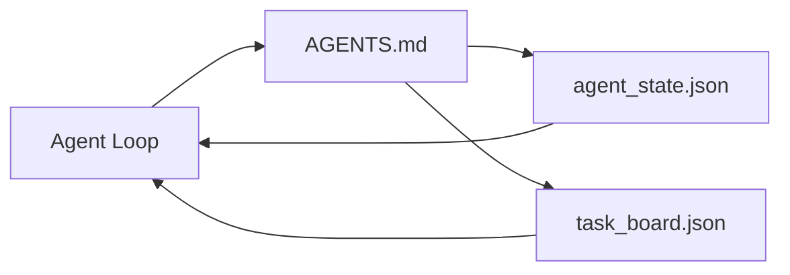

# Минимальный рабочий стенд агента

> Наименьший полезный рабочий стенд — это три файла: корневой роутер инструкций, файл состояния и доска задач. Всё остальное надстраивается сверху. Если репозиторий не может нести эти три файла, никакая модель его не спасёт.

**Тип:** Build
**Языки:** Python (stdlib)
**Предварительные требования:** Этап 14 · 31 («Почему даже способные модели по-прежнему терпят неудачу»)
**Время:** ~45 минут

## Цели обучения

- Определить три файла, составляющие минимально жизнеспособный рабочий стенд.
- Объяснить, почему короткий корневой роутер лучше длинного монолитного `AGENTS.md`.
- Построить файл состояния, который агент читает на каждом ходе и пишет в конце.
- Построить доску задач, переживающую многосессионную работу без истории чата.

## Проблема

Большинство команд начинают создавать рабочий стенд с `AGENTS.md` на 3000 строк и считают дело сделанным. Модель загружает его, игнорирует части, которые не может кратко изложить, и всё равно даёт сбои в тех же сценариях, что и прежде.

Нужна противоположность. Крошечный корневой файл, направляющий агента в более глубокие файлы только по мере необходимости. Устойчивое состояние, которое агент читает перед действием и пишет после. Доска задач, которая говорит, что в работе, что заблокировано и что дальше.

Три файла. Каждый выполняет свою задачу. Каждый достаточно машиночитаем, чтобы впоследствии стать частью полноценной системы.

## Концепция



### AGENTS.md — это роутер, а не руководство

Хороший `AGENTS.md` короткий. Он указывает агенту на:

- Файл состояния (где вы находитесь).
- Доску задач (что осталось).
- Более глубокие правила (в `docs/agent-rules.md`).
- Команду верификации (как узнать, что всё работает).

Всё, что длиннее, уходит в более глубокие документы, загружаемые только при необходимости. Длинные руководства игнорируются. Указания коротких роутеров выполняются.

### agent_state.json — система учёта

Файл состояния содержит идентификатор активной задачи, затронутые файлы, сделанные предположения, блокирующие проблемы и следующее действие. Агент читает его на каждом ходе. Следующая сессия обращается к нему вместо того, чтобы заново просматривать чат.

Состояние живёт в файле, потому что история чата ненадёжна. Сессии умирают. Разговоры обрезаются. Файл — нет.

### task_board.json — это очередь

На доске перечислены все задачи со статусом `todo | in_progress | done | blocked`. Это очередь, из которой агент берёт задачи, когда файл состояния пуст, и которую вы просматриваете, чтобы понять, идёт ли агент по плану.

У каждой задачи на доске есть идентификатор, цель, ответственный (`builder`, `reviewer` или `human`) и критерии приёмки. Доска намеренно невелика: если она перестаёт помещаться на одном экране, проблема уже в планировании, а не в самой доске.

### Три файла — необходимый минимум, а не предел

В последующих уроках появятся контракты области действия, средства сбора обратной связи, шлюзы верификации, чек-листы ревьюера и пакеты для передачи работы и контекста. Все они предполагают наличие описанных здесь трёх файлов.

```figure
wb-three-files
```

## Реализация

`code/main.py` записывает минимальный рабочий стенд в пустой репозиторий и демонстрирует один ход агента, который:

1. Читает `agent_state.json`.
2. Берёт следующую задачу из `task_board.json`, если состояние пусто.
3. Затрагивает один файл в пределах области действия.
4. Записывает обновлённое состояние обратно.

Запустите:

```
python3 code/main.py
```

Скрипт создаёт `workdir/` рядом с собой, размещает три файла, выполняет один ход и выводит различия. Запустите его ещё раз, чтобы увидеть, как второй ход подхватывает работу с того места, где закончился первый.

## Применение

Внутри продакшен-продуктов с агентами те же три файла появляются под разными именами:

- **Claude Code:** `AGENTS.md` или `CLAUDE.md` для роутера, хранилища в стиле `.claude/state.json` для состояния, хуки для доски.
- **Codex / Cursor:** правила рабочего пространства для роутера, память сессии для состояния, очередь задач в боковой панели чата для доски.
- **Собственный Python-агент:** те же файлы, что вы только что написали.

Названия меняются. Форма — нет.

## Продакшен-паттерны в дикой природе

Минимальный рабочий стенд переживает встречу с реальными монорепозиториями, когда сверху надстроены три паттерна. Они независимы; выбирайте те, что реально нужны вашему репозиторию.

**Вложенные `AGENTS.md` с приоритетом ближайшего.** OpenAI поставляет 88 файлов `AGENTS.md` в своём основном репозитории, по одному на подкомпонент. Codex, Cursor, Claude Code и Copilot идут от рабочего файла к корню репозитория и объединяют все найденные по пути файлы `AGENTS.md`. Файлы в подкаталогах расширяют корневой файл. Codex добавляет `AGENTS.override.md`, чтобы заменять, а не расширять; механизм переопределения специфичен для Codex, поэтому избегайте его при работе с несколькими инструментами. Важен результат измерений Augment Code: лучшие файлы `AGENTS.md` дают скачок качества, эквивалентный переходу с Haiku на Opus; худшие делают результат хуже, чем при полном отсутствии файла.

**Антипаттерны, от которых стоит отказаться, даже когда они выглядят как охват.** Противоречивые инструкции незаметно переводят агента из интерактивного режима в жадный (ICLR 2026 AMBIG-SWE: доля решения падает с 48,8% до 28%); нумеруйте приоритеты вместо того, чтобы складывать их плоским списком. Непроверяемые правила стиля («следуйте Google Python Style Guide») без команды автоматической проверки соблюдения требований позволяют агенту лишь изображать соответствие; сопровождайте каждое правило стиля точной командой линтера. Если начинать со стиля вместо команд, путь верификации теряется в тексте; сначала команды, стиль — в конце. Текст, рассчитанный на людей, а не на агентов, впустую расходует бюджет контекста; лаконичность — это преимущество.

**Кросс-инструментальные символические ссылки.** Единый корневой файл с символическими ссылками (`ln -s AGENTS.md CLAUDE.md`, `ln -s AGENTS.md .github/copilot-instructions.md`, `ln -s AGENTS.md .cursorrules`) удерживает каждого кодирующего агента на одном источнике истины. `nx ai-setup` от Nx автоматизирует это для Claude Code, Cursor, Copilot, Gemini, Codex и OpenCode из единой конфигурации.

## Поставка

`outputs/skill-minimal-workbench.md` генерирует трёхфайловый рабочий стенд для любого нового репозитория: роутер `AGENTS.md`, настроенный под проект, `agent_state.json` с правильными ключами и `task_board.json`, засеянный текущим бэклогом.

## Упражнения

1. Добавьте метку времени `last_run` в `agent_state.json`. Откажитесь от запуска, если файл старше 24 часов, если оператор не подтвердит.
2. Добавьте поле `priority` в доску задач и измените логику выбора так, чтобы всегда брать `todo` с наивысшим приоритетом.
3. Мигрируйте `task_board.json` в JSON Lines, чтобы каждая задача была отдельной строкой, а различия в системе контроля версий оставались чистыми.
4. Напишите `lint_workbench.py`, который падает, если `AGENTS.md` длиннее 80 строк или ссылается на несуществующий файл.
5. Решите, потерю какого из трёх файлов было бы больнее всего пережить. Обоснуйте.

## Ключевые термины

| Термин | Как это обычно называют | Что это означает на самом деле |
|------|----------------|------------------------|
| Роутер | `AGENTS.md` | Краткий корневой файл, который направляет агента к более подробной документации и другим файлам |
| Файл состояния | «Заметки» | Машиночитаемая запись о состоянии работы агента, обновляемая на каждом ходе |
| Доска задач | «Бэклог» | Очередь работ в формате JSON со статусом, ответственным и критериями приёмки |
| Система учёта | «Источник истины» | Файл, данные которого рабочий стенд считает достоверными, если история чата утрачена |

## Дополнительное чтение

- [agents.md — открытая спецификация](https://agents.md/) — принята в Cursor, Codex, Claude Code, Copilot, Gemini и OpenCode
- [Augment Code: хороший AGENTS.md равноценен обновлению модели, а плохой хуже полного отсутствия документации](https://www.augmentcode.com/blog/how-to-write-good-agents-dot-md-files) — измеренные скачки качества
- [Blake Crosley: паттерны AGENTS.md — что действительно меняет поведение агента](https://blakecrosley.com/blog/agents-md-patterns) — что работает эмпирически, а что нет
- [Datadog Frontend: управление ИИ-агентами в монорепозиториях с помощью AGENTS.md](https://dev.to/datadog-frontend-dev/steering-ai-agents-in-monorepos-with-agentsmd-13g0) — вложенный приоритет на практике
- [Nx Blog: научите своего ИИ-агента работать в монорепозитории](https://nx.dev/blog/nx-ai-agent-skills) — генерация из единого источника для шести инструментов
- [The Prompt Shelf: лучшие практики AGENTS.md — структура, область действия и реальные примеры](https://thepromptshelf.dev/blog/agents-md-best-practices/) — порядок разделов, выдерживающий ревью
- [Anthropic, субагенты Claude Code](https://code.claude.com/docs/en/sub-agents)
- Этап 14 · 31 — режимы отказа, которые компенсирует этот минимум
- Этап 14 · 34 — схема устойчивого состояния, которую предваряет этот урок
