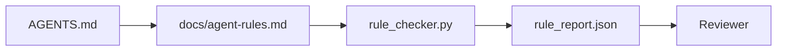

# Инструкции агента как исполняемые ограничения

> Инструкции, написанные прозой, — это пожелания. Инструкции, написанные как ограничения, — это тесты. Рабочий стенд превращает каждое правило в то, что агент может проверить во время выполнения, а ревьюер — верифицировать постфактум.

**Тип:** Build
**Языки:** Python (stdlib)
**Предварительные требования:** Этап 14 · 32 («Минимальный рабочий стенд»)
**Время:** ~50 минут

## Цели обучения

- Отделить прозу маршрутизации от операционных правил.
- Выразить стартовые правила, запрещённые действия, определение готовности, обработку неопределённости и границы одобрения как машинопроверяемые ограничения.
- Реализовать проверщик правил, оценивающий прогон относительно набора правил.
- Сделать набор правил удобным для сравнения версий, чтобы при ревью было видно, что изменилось.

## Проблема

Типичный `AGENTS.md` читается как онбординг-документация. Он говорит агенту «быть аккуратным», «тщательно тестировать» и «спрашивать, если не уверен». Три дня спустя агент поставляет изменение без тестов, пишет в запрещённый каталог и никогда не спрашивает, потому что никогда не знал, где проходит граница.

Инструкции сильны, когда они операционны, и слабы, когда они декларативны. Решение — писать правила, которые рабочий стенд может интерпретировать, а ревьюер — оценить.

## Концепция

Правила живут в `docs/agent-rules.md`, отдельно от короткого корневого роутера. У каждого правила есть имя, категория и проверка.



### Пять категорий, покрывающих большинство правил

| Категория | На какой вопрос отвечает правило | Пример |
|----------|---------------------------|---------|
| Запуск | Что должно быть истинно до начала работы? | «файл состояния существует и актуален» |
| Запрещённое | Что никогда не должно происходить? | «не редактировать `scripts/release.sh`» |
| Определение готовности | Что доказывает завершённость задачи? | «pytest завершается с кодом 0 и строка приёмки проходит проверку» |
| Неопределённость | Что делает агент, когда не уверен? | «создать заметку с вопросом вместо того, чтобы гадать» |
| Одобрение | Что требует одобрения человека? | «любая новая зависимость, любая запись в продакшен» |

Правило, не подходящее ни под одну из этих пяти категорий, обычно хочет быть двумя правилами. Заставьте его разделиться.

### Правила машиночитаемы

У каждого правила есть слаг, категория, однострочное описание и поле `check`, называющее функцию в `rule_checker.py`. Добавление правила означает добавление проверки; проверщик растёт вместе с рабочим стендом.

### Правила удобны для сравнения версий

Правила располагаются по одному под каждым заголовком в едином Markdown-файле. Переименования видны при сравнении версий. Новые правила располагаются в начале своей категории. Устаревшие правила удаляются, а не комментируются, потому что рабочий стенд — источник истины, а не журнал того, как команда себя чувствовала в прошлом квартале.

### Правила и защитные ограничения фреймворка

Защитные ограничения фреймворка (защитные ограничения OpenAI Agents SDK, прерывания LangGraph) применяют правила на уровне среды выполнения. Набор правил в этом уроке — человекочитаемый контракт, доступный для ревью и реализуемый этими защитными ограничениями. Нужно и то, и другое: среда выполнения ловит нарушения во время хода, а набор правил доказывает, что она работает правильно.

### Прогрессивное раскрытие: карта, а не энциклопедия

Причина, по которой `AGENTS.md` продолжает расти, в том, что каждый инцидент добавляет правило и ни один инцидент не убирает его. Через год файл — две тысячи строк, и агент читает первый экран, исчерпывает бюджет внимания и действует на основе доли того, что ему сказали. Гигантский файл инструкций отказывает по той же причине, по которой отказывает сорокастраничный онбординг-документ: читатель просматривает его один раз и никогда не возвращается к части, которая была важна.

Решение — не более короткий файл. Решение — многослойный файл. Корневой роутер остаётся достаточно маленьким, чтобы читаться каждую сессию, и не содержит ничего, кроме указателей. Глубина живёт в тематических файлах, которые агент загружает только тогда, когда задача их касается. Дайте агенту карту, а не всю энциклопедию, и пусть он дойдёт до нужной страницы.

```
AGENTS.md                  # router, < 50 lines: what this repo is, where to look, the 5 hard rules
docs/
  agent-rules.md           # the full rule set (this lesson)
  architecture.md          # loaded when the task touches module boundaries
  testing.md               # loaded when the task writes or runs tests
  deploy.md                # loaded only for release work, gated behind an approval rule
feature_list.json          # the backlog (Phase 14 · 36)
```

| Уровень | Живёт в | Читается когда | Бюджет размера |
|------|----------|-----------|--------------|
| Роутер | `AGENTS.md` | Каждую сессию, всегда | Меньше ~50 строк |
| Правила | `docs/agent-rules.md` | Каждую сессию, при старте | Один экран на категорию |
| Тематические документы | `docs/<topic>.md` | Только когда задача касается этой темы | Настолько подробно, насколько нужно |

Два теста удерживают этот слоистый подход честным. Тест достижимости: агент должен добираться до любого правила максимум за два перехода от роутера, поэтому роутер обязан ссылаться на каждый тематический документ по пути, а не описывать его прозой. Тест свежести: роутер достаточно короток, чтобы ревьюер перечитывал его при каждом PR, а это единственное, что останавливает его от незаметного возврата к энциклопедии, которую он заменил. Указатель, который больше не разрешается, — это отказ хуже, чем отсутствующее правило, поэтому битая ссылка в роутере сама по себе — нарушение стартовой проверки.

```figure
wb-rule-checkoff
```

## Реализация

`code/main.py` поставляет:

- Парсер `agent-rules.md`, загружающий правила в класс данных.
- Функции-проверщики в стиле `rule_checker.py`, по одной на каждую ссылку `check`.
- Демонстрационный прогон агента, нарушающий два правила, и проход проверки, ловящий их.

Запустите:

```
python3 code/main.py
```

Вывод: разобранный набор правил, трасса прогона, результат проверки каждого правила и сохранённый рядом со скриптом `rule_report.json`.

## Продакшен-паттерны в дикой природе

Три паттерна отделяют набор правил, который живёт квартал, от того, что деградирует за неделю.

**Маркировка серьёзности при написании.** Каждое правило несёт `severity`: `block`, `warn` или `info`. Проверщик сообщает обо всех трёх; среда выполнения отказывает только на `block`. Большинство команд завышают серьёзность вначале, а затем незаметно ослабляют её под давлением сроков; маркировка при написании заставляет откалибровать уровень заранее. Сочетайте её со шлюзом верификации (этап 14 · 38), который записывает любое переопределение правила `block` в журнал аудита `overrides.jsonl` с подписью.

**Истечение срока правила как принуждающий фактор.** Каждое правило несёт дату `expires_at` (по умолчанию 90 дней с момента написания). Проверщик выдаёт предупреждение, когда у непросроченного правила ноль нарушений за 60 дней подряд; следующее квартальное ревью либо обосновывает сохранение, либо ослабляет его до `info`, либо удаляет. Данные о работе AI Code Review в продакшене от Cloudflare (апрель 2026 года, 131 246 прогонов ревью по 5169 репозиториям за 30 дней) показали, что наборы правил с явным сроком действия содержали менее 30 правил на репозиторий; наборы без него разрастались до более чем 80 правил, причём большинство из них никогда не срабатывало.

**Markdown как источник, JSON как кеш.** `agent-rules.md` — авторский файл; `agent-rules.lock.json` — кеш, который проверщик читает в горячем пути. Файл блокировки пересоздаётся хуком перед коммитом. Изменения в Markdown удобно просматривать при ревью; JSON не приходится разбирать на каждом ходу. Это та же схема, что у `package.json` / `package-lock.json` и `Cargo.toml` / `Cargo.lock`.

## Применение

В продакшене:

- Claude Code, Codex, Cursor читают правила при старте сессии и цитируют их, отказываясь от действий. Проверщик перезапускает их в CI, чтобы поймать незаметный дрейф.
- Защитные ограничения OpenAI Agents SDK регистрируют те же проверки как входные и выходные защитные ограничения. Markdown — интерфейс документации; SDK — интерфейс среды выполнения.
- Прерывания LangGraph срабатывают, когда выполняющийся узел нарушает правило. Обработчик прерывания читает правило, задаёт вопрос человеку и возобновляет работу.

Набор правил переносим между всеми тремя, потому что он состоит лишь из Markdown и имён функций.

## Поставка

`outputs/skill-rule-set-builder.md` интервьюирует владельца проекта, классифицирует его существующие прозаические инструкции по пяти категориям и выдаёт версионированный `agent-rules.md` плюс заготовку проверщика.

## Упражнения

1. Добавьте шестую категорию, если вашему продукту она действительно нужна. Обоснуйте, почему она не сводится к одной из пяти.
2. Расширьте проверщик так, чтобы у правила был уровень серьёзности (`block`, `warn`, `info`), а отчёт группировал результаты по этим уровням.
3. Подключите проверщик к CI: сборка должна завершаться неудачей, если при последнем прогоне агента не выполняется правило с блокирующим уровнем серьёзности.
4. Добавьте каждому правилу поле «срок действия». После 90 дней без неудачных проверок правило подлежит ревью.
5. Найдите реальный `AGENTS.md` и перепишите его как правила по пяти категориям. Сколько его строк были операционными? Сколько — декларативными?

## Ключевые термины

| Термин | Как это называют | Что это означает на самом деле |
|------|----------------|------------------------|
| Операционное правило | «Настоящая инструкция» | Правило, которое рабочий стенд может проверить во время выполнения |
| Декларативное правило | «Будьте осторожны» | Правило без проверки; его следует либо удалить, либо сделать операционным |
| Определение готовности | «Приёмка» | Объективное подтверждение завершённости задачи, подкреплённое файлами |
| Блокирующий уровень серьёзности | «Жёсткое правило» | Нарушение останавливает прогон; без оператора его нельзя проигнорировать |
| Истечение срока правила | «Очистка устаревших правил» | Правило, проверки которого не завершались неудачей N дней, подлежит пересмотру на предмет удаления |

## Дополнительное чтение

- [Защитные ограничения OpenAI Agents SDK](https://openai.github.io/openai-agents-python/guardrails/)
- [Прерывания LangGraph](https://langchain-ai.github.io/langgraph/how-tos/human_in_the_loop/breakpoints/)
- [Anthropic, Building Effective Agents](https://www.anthropic.com/research/building-effective-agents)
- [Rick Hightower, Agent RuleZ: A Deterministic Policy Engine](https://medium.com/@richardhightower/agent-rulez-a-deterministic-policy-engine-for-ai-coding-agents-9489e0561edf) — уровни серьёзности block/warn/info в продакшене
- [Cloudflare, Orchestrating AI Code Review at Scale](https://blog.cloudflare.com/ai-code-review/) — 131 тыс. прогонов ревью, уроки композиции правил
- [microservices.io, GenAI development platform — part 1: guardrails](https://microservices.io/post/architecture/2026/03/09/genai-development-platform-part-1-development-guardrails.html) — эшелонированная защита с помощью правил и CI
- [Type-Checked Compliance: Deterministic Guardrails (arXiv 2604.01483)](https://arxiv.org/pdf/2604.01483) — Lean 4 как верхняя граница правил-как-проверок
- [logi-cmd/agent-guardrails](https://github.com/logi-cmd/agent-guardrails) — реализация шлюза слияния: область действия, мутационное тестирование, бюджеты нарушений
- Этап 14 · 32 — минимальный рабочий стенд, в который встраивается этот набор правил
- Этап 14 · 38 — шлюз верификации, потребляющий отчёт правил
- Этап 14 · 39 — агент-ревьюер, оценивающий соответствие правилам
