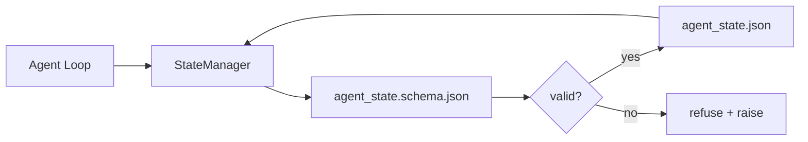

# Память репозитория и устойчивое состояние

> История чата нестабильна. Репозиторий устойчив. Рабочий стенд хранит состояние агента в версионируемых файлах, чтобы следующая сессия, следующий агент и следующий ревьюер читали из одного и того же источника истины.

**Тип:** Build
**Языки:** Python (стандартная библиотека + опционально `jsonschema`)
**Предварительные требования:** Этап 14 · 32 («Минимальный рабочий стенд»)
**Время:** ~60 минут

## Цели обучения

- Определить, что относится к памяти репозитория, а что — к истории чата.
- Написать JSON Schema для `agent_state.json` и `task_board.json`.
- Построить менеджер состояния, который загружает, валидирует, изменяет и атомарно сохраняет состояние.
- Использовать схему, чтобы отклонять плохие записи до того, как они повредят рабочий стенд.

## Проблема

Агент завершает сессию. Чат закрывается. Следующая сессия открывается и спрашивает, с чего начать. Модель говорит «дайте проверю файлы», читает устаревшие заметки и переделывает работу, которая уже была завершена. Или, хуже, переписывает готовый файл, потому что никто не сказал ей, что файл уже готов.

Решение рабочего стенда — память репозитория: состояние живёт в JSON-файлах в репозитории, записывается по схеме, сохраняется атомарно и удобно для просмотра изменений при ревью кода. Чат — это временный поток; репозиторий — источник истины.

## Концепция



### Что относится к памяти репозитория

| Относится | Не относится |
|---------|-----------------|
| Идентификатор активной задачи | Сырые стенограммы чата |
| Затронутые в этой сессии файлы | Трассы рассуждений на уровне токенов |
| Предположения, сделанные агентом | «Пользователь казался раздражённым» |
| Открытые блокеры | Сэмплированные завершения |
| Следующее действие | Идентификаторы моделей конкретных провайдеров |

Тест — устойчивость: будет ли это полезно через три месяца при повторном прогоне в CI? Если да — репозиторий. Если нет — телеметрия.

### Состояние прежде всего по схеме

JSON Schema — это контракт. Без неё каждый агент изобретает новые поля, каждый ревьюер заново изучает новую форму, а каждый скрипт CI вынужден отдельно обрабатывать прошлые версии. С ней плохая запись — это отклонённая запись.

Схема покрывает:

- Обязательные ключи.
- Допустимые значения `status`.
- Запрещённые значения (например, `null` для массивов).
- Ограничения по шаблону (идентификаторы задач соответствуют `T-\d{3,}`).
- Поле версии для миграций.

### Атомарные записи

Записи состояния должны переживать частичные сбои: записывайте данные во временный файл, вызывайте fsync и переименовывайте файл поверх целевого. Файл состояния — источник истины; наполовину записанный файл хуже, чем отсутствие файла вовсе.

### Миграции

Когда схема меняется, поставляйте скрипт миграции вместе с повышением её версии. Файл состояния содержит поле `schema_version`; менеджер отказывается загружать файл версии, которую не может мигрировать.

```figure
wb-state-persist
```

## Реализация

`code/main.py` реализует:

- `agent_state.schema.json` и `task_board.schema.json`.
- Валидатор только на стандартной библиотеке (подмножество JSON Schema: required, type, enum, pattern, items).
- `StateManager.load`, `StateManager.update`, `StateManager.commit` с атомарной записью через временный файл и переименование.
- Демонстрацию, которая изменяет состояние, сохраняет его, перезагружает и подтверждает корректность цикла записи и чтения.

Запустите:

```
python3 code/main.py
```

Скрипт записывает `workdir/agent_state.json` и `workdir/task_board.json`, изменяет их за два хода и печатает провалидированное состояние на каждом шаге.

## Продакшен-паттерны в дикой природе

Четыре паттерна превращают минимум из урока в то, что переживёт мультиагентный монорепозиторий.

**Атомарная запись через временный файл и переименование обязательна.** Отчёт об ошибке в проекте Hive за март 2026 года чётко описывает характер сбоя: `state.json` записывался через `write_text()`, а исключения перехватывались и заглушались. Из-за частичных записей сессии без каких-либо предупреждений возобновлялись с повреждённым состоянием. Решение всегда одно: вызвать `tempfile.mkstemp` в том же каталоге, где находится целевой файл, записать данные, вызвать `fsync`, а затем `os.replace` (атомарное переименование в POSIX и Windows). `atomic_write` из этого урока делает именно это.

**Ключи идемпотентности на каждом неидемпотентном вызове инструмента.** Если агент падает после вызова инструмента, но до сохранения контрольной точки с результатом, восстановление повторяет вызов инструмента. Это безопасно для операций чтения, но опасно для отправки писем, вставки записей в БД и загрузки файлов. Применяйте следующий паттерн: перед выполнением записывайте идентификатор каждого вызова инструмента в `pending_calls.jsonl`. При повторной попытке проверяйте наличие идентификатора; если он есть, пропускайте вызов и используйте результат из кеша. И Anthropic, и LangChain отмечают это в руководствах 2026 года; по той же причине средство создания контрольных точек LangGraph сохраняет незавершённые записи.

**Отделяйте крупные артефакты от состояния.** Не храните CSV, длинные стенограммы или сгенерированные файлы в `agent_state.json`. Сохраняйте артефакт как отдельный файл (или загружайте в объектное хранилище), а в состоянии оставляйте только путь. Контрольные точки остаются компактными и быстро обрабатываются; артефакты растут независимо.

**Журналирование событий для аудита, снимки состояния для возобновления.** При каждом изменении дописывайте запись в журнал событий (`state.events.jsonl`); периодически сохраняйте снимок состояния в `state.json`. При возобновлении система читает снимок, а затем воспроизводит все события, произошедшие после его метки времени. Такой подход требует больше места на диске, но позволяет дословно воспроизводить решения агента — это необходимо при отладке длительных прогонов. Эту же структуру Postgres использует внутри для WAL.

**Миграции схемы или отказ от загрузки.** Целое число `schema_version` — это контракт. Когда менеджер загружает файл неизвестной версии, он отказывается читать его. Поставляйте скрипт миграции вместе с повышением версии схемы; `tools/migrate_state.py` идемпотентно запускается при каждом запуске системы.

## Применение

В рабочей среде:

- **Чекпоинтеры LangGraph.** Та же идея, другое хранение. Чекпоинтер сохраняет состояние графа в SQLite, Postgres или собственный бэкенд. Схема, которой учит этот урок, — то, к чему вы обращаетесь, когда чекпоинтер падает и нужно прочитать состояние вручную.
- **Блоки памяти Letta.** Устойчивые блоки со структурированными схемами (этап 14 · 08). Та же дисциплина, применённая к долгоживущим персонам.
- **Хранилище сессий OpenAI Agents SDK.** Подключаемые бэкенды, осведомлённые о схеме. Файл состояния в этом уроке — локальный файловый бэкенд.

## Поставка

`outputs/skill-state-schema.md` генерирует пару JSON Schema для конкретного проекта (состояние + доска), `StateManager` на Python с атомарной записью и заготовку миграции, чтобы следующее повышение версии схемы не сломало рабочий стенд.

## Упражнения

1. Добавьте метку времени `last_human_touch`. Откажитесь от любой записи агента в течение пяти секунд после правки человека.
2. Расширьте валидатор для поддержки `oneOf`, чтобы задача могла быть либо задачей сборки, либо задачей ревью с разными обязательными полями.
3. Добавьте поле `schema_version` и напишите миграцию с v1 на v2 (переименование `blockers` в `risks`).
4. Перенесите бэкенд хранения с локального файла на SQLite. Сохраните API `StateManager` идентичным.
5. Запустите двух агентов против одного файла состояния с гонкой записи в 50 мс. Что идёт не так и как атомарное переименование вас спасает?

## Ключевые термины

| Термин | Как обычно говорят | Что это означает на самом деле |
|------|----------------|------------------------|
| Память репозитория | «Файл заметок» | Состояние, хранящееся по схеме в отслеживаемых файлах репозитория |
| Сначала схема | «Валидировать входные данные» | Определить контракт до создания средства записи и отклонять отклонения от него |
| Атомарная запись | «Просто переименовать» | Записать данные во временный файл, вызвать fsync и переименовать файл, чтобы частичный сбой не привёл к повреждению данных |
| Миграция | «Повышение версии схемы» | Скрипт, преобразующий состояние версии vN в состояние версии v(N+1) |
| Система учёта | «Источник истины» | Артефакт, который рабочий стенд считает авторитетным источником данных |

## Дополнительное чтение

- [Спецификация JSON Schema](https://json-schema.org/specification.html)
- [Средства создания контрольных точек LangGraph](https://langchain-ai.github.io/langgraph/concepts/persistence/)
- [Блоки памяти Letta](https://docs.letta.com/concepts/memory)
- [Fast.io: «Контрольные точки состояния ИИ-агентов: практическое руководство»](https://fast.io/resources/ai-agent-state-checkpointing/) — создание контрольных точек на основе заранее заданной схемы с обеспечением идемпотентности
- [Fast.io: «Сохранение состояния рабочих процессов ИИ-агентов: лучшие практики 2026 года»](https://fast.io/resources/ai-agent-workflow-state-persistence/) — управление конкурентным доступом, TTL и журналирование событий
- [Проблема Hive № 6263 — неатомарные записи в state.json молча игнорируются](https://github.com/aden-hive/hive/issues/6263) — режим отказа в реальном проекте
- [eunomia: «Системы создания и восстановления контрольных точек: эволюция, методы и применение»](https://eunomia.dev/blog/2025/05/11/checkpointrestore-systems-evolution-techniques-and-applications-in-ai-agents/) — примитивы CR из истории ОС, применённые к агентам
- [Indium: «7 стратегий сохранения состояния для долго работающих ИИ-агентов в 2026 году»](https://www.indium.tech/blog/7-state-persistence-strategies-ai-agents-2026/)
- [Microsoft Agent Framework: сжатие](https://learn.microsoft.com/en-us/agent-framework/agents/conversations/compaction) — менеджер контрольных точек конкретного вендора
- Этап 14 · 08 — блоки памяти и вычисления в периоды простоя
- Этап 14 · 32 — трёхфайловый минимум, который этот урок формализует в виде схемы
- Этап 14 · 40 — пакеты передачи полномочий, читаемые из той же схемы
