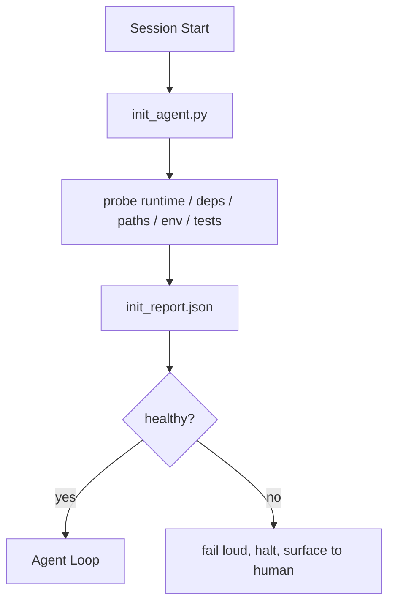

# Скрипты инициализации для агентов

> Каждая сессия, стартующая с холодного состояния, платит налог. Агент читает те же файлы, повторяет те же пробы, заново открывает те же пути. Скрипт инициализации платит этот налог один раз и записывает ответы в состояние.

**Тип:** Build
**Языки:** Python (stdlib)
**Предварительные требования:** Этап 14 · 32 («Минимальный рабочий стенд»), этап 14 · 34 («Память репозитория»)
**Время:** ~45 минут

## Цели обучения

- Определить работу, которую агенту никогда не следует переделывать за сессию.
- Создать детерминированный скрипт инициализации, проверяющий рантайм, зависимости и состояние репозитория.
- Сохранять результат проб, чтобы агент читал его вместо повторного прогона проверок.
- Отказывать громко, быстро и с одним местом для поиска причины при сбое инициализации.

## Проблема

Откройте сессию. Агент угадывает версию Python. Угадывает команду тестов. Пять раз перечисляет корень репозитория в поисках точки входа. Пытается импортировать пакет, который не установлен. Спрашивает пользователя, где лежит конфигурационный файл. К моменту, когда он делает реальную правку, десять тысяч токенов уже ушли на настроечную работу, которая должна была быть одним скриптом.

Решение — единый скрипт инициализации, который запускается до того, как агент делает что-либо ещё, и записывает `init_report.json`, который агент читает при старте.

## Концепция



### Что проверяет скрипт инициализации

| Проба | Почему это важно |
|-------|----------------|
| Версии рантайма | Неверная версия Python или Node означает тихие баги неверной версии |
| Доступность зависимостей | Отсутствующий пакет позже стоит в десять раз дороже, чем поймать его сейчас |
| Команда тестов | Агент должен знать, как верифицировать; если команда отсутствует, рабочий стенд сломан |
| Пути репозитория | Жёстко прописанные пути дрейфуют; разрешите их один раз и закрепите |
| Переменные окружения | Отсутствующий `OPENAI_API_KEY` — это поверхность отказа, а не загадка рантайма |
| Свежесть состояния и доски | Устаревшее состояние от рухнувшей сессии — это ловушка |
| Последний заведомо рабочий коммит | Ориентир для сравнения изменений при передаче результатов в конце сессии |

### Отказывай громко, отказывай быстро, отказывай в одном месте

Провал пробы означает остановку и передачу человеку. Никакого «агент сам разберётся». Весь смысл инициализации — отказаться стартовать, когда рабочий стенд сломан.

### Идемпотентность

Запустите его дважды подряд. Второй прогон не должен ничего менять, кроме метки времени. Идемпотентность позволяет подключить скрипт к CI, хукам или слэш-команде, выполняемой перед задачей.

### Инициализация против стартовых правил

Правила (этап 14 · 33) описывают, какие условия должны выполняться для начала работы. Инициализация — это скрипт, который обеспечивает возможность проверки этих правил. Правила без инициализации превращаются в призыв «будь осторожен». Инициализация без правил превращается в аккуратно оформленный отказ.

```figure
wb-init-probes
```

## Реализация

`code/main.py` реализует `init_agent.py`:

- Пять проб: версия Python, перечисленные зависимости через `importlib.util.find_spec`, разрешимость команды тестов, обязательные переменные окружения, свежесть файла состояния.
- Каждая проба возвращает `(name, status, detail)`.
- Скрипт записывает `init_report.json` с полным набором проб и завершается с ненулевым кодом, если не пройдена хотя бы одна блокирующая проба.

Запустите:

```
python3 code/main.py
```

Скрипт печатает таблицу проб, записывает `init_report.json` и при успешном выполнении завершается с нулевым кодом, а при сбое — с ненулевым кодом и списком непройденных проб.

## Продакшен-паттерны в дикой природе

Три паттерна отделяют полезный скрипт инициализации от церемонии.

**Привязка к последнему заведомо рабочему коммиту.** Сравните текущий коммит с файлом `LKG`, записанным при последнем успешном слиянии. Если объём различий превышает лимит (по умолчанию 50 файлов), откажитесь от запуска и потребуйте, чтобы человек утвердил новую базовую версию. Именно этот подход использует AI Code Review от Cloudflare для ограничения области работы агентов-рецензентов: каждая сессия рецензирования опирается на одно и то же последнее заведомо рабочее состояние, поэтому дрейф между сессиями не накапливается.

**Файлы блокировки с TTL.** Записывайте `prereqs.lock` после первого успешного прохода проб. Последующие запуски доверяют файлу блокировки в течение N часов (по умолчанию 24 ч) и пропускают дорогостоящие пробы. Скрипт инициализации сначала читает файл блокировки; если он свежий, а хеш манифеста зависимостей совпадает, проверка завершается досрочно. Этот же паттерн Docker использует для кеширования слоёв: идемпотентная проба + хеш содержимого = пропуск.

**Никакой сети, никаких LLM, никаких сюрпризов на критическом пути.** Пробы инициализации — это детерминированная инфраструктура. Проба, которая вызывает LLM для классификации сбоя или обращается к внешнему сервису для проверки лицензии, — уже не проба, а рабочий процесс. Если проба при пробном запуске занимает больше трёх секунд, считайте это признаком проблемы в рабочем стенде и либо вынесите её из инициализации, либо кешируйте результат.

## Применение

В продакшене:

- **Хуки Claude Code.** Хук `pre-task` вызывает скрипт инициализации и отказывается запускать агента, если он провалился.
- **GitHub Actions.** Задание `setup-agent` запускает скрипт инициализации; задание агента зависит от него.
- **Точка входа Docker.** Контейнер агента запускает скрипт инициализации перед передачей управления рантайму агента через exec; при сбое выводятся логи.

Скрипт инициализации переносим, потому что не делает вызовов к конкретному фреймворку. Bash, Make или файл задач — все могут его обернуть.

## Поставка

`outputs/skill-init-script.md` собирает сведения о проекте, распределяет задачи настройки по пробам и создаёт адаптированный для проекта `init_agent.py`, а также рабочий процесс CI, который запускает его перед любым шагом агента.

## Упражнения

1. Добавьте пробу, сравнивающую текущий коммит с последним заведомо рабочим и отказывающуюся стартовать, если изменилось больше 50 файлов.
2. Настройте скрипт на запись файла `prereqs.lock` и откажитесь от запуска, если файл блокировки старше семи дней.
3. Добавьте флаг `--fix`, который автоматически устанавливает отсутствующие зависимости для разработки, но никогда не изменяет зависимости рантайма без одобрения.
4. Перенесите пробы из жёстко прописанных функций в реестр YAML. Обоснуйте компромисс.
5. Добавьте бюджет времени на пробу. Проба, работающая дольше трёх секунд, — это запах рабочего стенда.

## Ключевые термины

| Термин | Как обычно говорят | Что это означает на самом деле |
|------|----------------|------------------------|
| Проба | «Проверка» | Детерминированная функция, возвращающая `(name, status, detail)` |
| Отчёт инициализации | «Результат настройки» | JSON, записанный рядом с состоянием и содержащий результаты проб |
| Идемпотентность | «Можно безопасно запустить повторно» | Два последовательных запуска создают одинаковые отчёты, за исключением метки времени |
| Громкий отказ | «Не подавлять ошибку» | Остановить работу и сообщить человеку, не переходя молча к резервному варианту |
| Налог на настройку | «Стоимость первоначальной настройки» | Токены, которые агент в каждой сессии тратит на повторное обнаружение очевидных вещей |

## Дополнительное чтение

- [Anthropic, Effective harnesses for long-running agents](https://www.anthropic.com/engineering/effective-harnesses-for-long-running-agents)
- [GitHub Actions, composite actions for setup](https://docs.github.com/en/actions/sharing-automations/creating-actions/creating-a-composite-action)
- [microservices.io, GenAI dev platform: guardrails](https://microservices.io/post/architecture/2026/03/09/genai-development-platform-part-1-development-guardrails.html) — проверки перед коммитом и в CI как часть инициализации
- [Augment Code, How to Build Your AGENTS.md (2026)](https://www.augmentcode.com/guides/how-to-build-agents-md) — ожидания от инициализации
- [Codex Blog, Codex CLI Context Compaction](https://codex.danielvaughan.com/2026/03/31/codex-cli-context-compaction-architecture/) — старт сессии как инициализация, осведомлённая о сжатии
- Этап 14 · 33 — набор правил, проверку которого обеспечивает этот скрипт
- Этап 14 · 34 — файл состояния, который создаёт этот скрипт
- Этап 14 · 38 — шлюз верификации, получающий данные из отчёта скрипта инициализации
- Этап 14 · 40 — передача результатов, использующая последний заведомо рабочий коммит из отчёта инициализации
