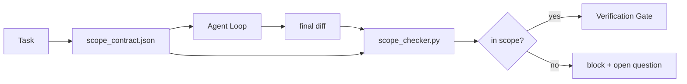

# Контракты границ задачи

> Модель не знает, где заканчивается работа. Контракт области действия (scope contract) — это файл на каждую задачу, который говорит, где работа начинается, где заканчивается и как откатиться, если она вышла за рамки. Контракт превращает «оставайся в рамках задачи» из пожелания в проверку.

**Тип:** Build
**Языки:** Python (stdlib)
**Предварительные требования:** Фаза 14 · 32 («Минимальный рабочий стенд»), фаза 14 · 33 («Правила как ограничения»)
**Время:** ~50 минут

## Цели обучения

- Написать контракт области действия, который агент читает в начале задачи, а верификатор — в конце.
- Задать разрешённые файлы, запрещённые файлы, критерии приёмки (acceptance criteria), план отката (rollback plan) и границы согласования.
- Реализовать проверку области действия, которая сравнивает диф с контрактом и помечает нарушения.
- Сделать расползание границ задачи (scope creep) видимым, автоматическим и проверяемым.

## Проблема

Агенты расползаются. Задача — «исправить баг входа в систему». Диф затрагивает маршрут входа, помощник для отправки писем, драйвер базы данных, README и скрипт релиза. У каждого затронутого места в момент правки была правдоподобная причина. Вместе они складываются в другое изменение, чем то, которое проверялось.

Расползание границ задачи — самый недооценённый вид сбоя в работе агентов, потому что агент добросовестно объясняет каждый свой шаг. Решение — не более строгий промпт. Решение — контракт на диске, который фиксирует, что было обещано, и проверка, которая сравнивает результат с обещанием.

## Концепция



### Что входит в контракт области действия

| Поле | Назначение |
|-------|---------|
| `task_id` | Связывает с задачей на доске |
| `goal` | Одно предложение, которое рецензент может проверить |
| `allowed_files` | Глобы, которые агент может записывать |
| `forbidden_files` | Глобы, которых агент не должен касаться даже случайно |
| `acceptance_criteria` | Команды тестов или строки утверждений, доказывающие завершение |
| `rollback_plan` | Один абзац, который оператор может выполнить при необходимости остановки |
| `approvals_required` | Действия вне области действия, требующие явного согласования человеком |

Контракт без `forbidden_files` неполон. Отрицательное пространство — это половина контракта.

### Глобы, а не сырые пути

Реальные репозитории перемещают файлы. Привязывайте контракты к глобам (`app/**/*.py`, `tests/test_signup*.py`), чтобы рефакторинг между сессиями не делал контракт недействительным.

### Откат — часть области действия

Перечисление способа отката заставляет автора контракта задуматься о том, что может пойти не так. Контракт, из которого нельзя откатиться, — это контракт, который не следует утверждать.

### Проверка области действия — это проверка дифа

Агент пишет диф. Проверка читает диф, разрешённые глобы, запрещённые глобы и список выполненных команд приёмки. Каждое нарушение — это помеченная находка, которую верификационный шлюз (verification gate) может отклонить.

### Два уровня области действия: список функций и контракт задачи

Контракт области действия ограничивает одну задачу. Он не ограничивает проект. Агент может безупречно оставаться внутри контракта для исправления входа в систему и всё же на следующем шаге решить, что проекту также нужны страница настроек, переключатель тёмной темы и переписывание роутера. У контракта никогда не спрашивали, какая работа входит в область действия проекта, — только какие файлы входят в область действия задачи.

Этот второй уровень нуждается в собственном примитиве: `feature_list.json`, который агент читает в начале сессии. Это бэклог проекта в виде машиночитаемого упорядоченного файла. Агент выбирает ровно одну функцию, чей `status` равен `todo`, записывает её `id` в активный контракт области действия и ему запрещено начинать вторую функцию в той же сессии. «Одна функция за раз» перестаёт быть строкой в промпте, мимо которой агент может рационализировать, и становится значением, которое он считывает с диска, и проверкой, которую обеспечивает шлюз.

```json
{
  "project": "knowledge-base",
  "active": "import-pdf",
  "features": [
    { "id": "import-pdf",   "status": "in_progress", "goal": "import a PDF into the library",        "done_when": "pytest tests/test_import.py && a sample PDF appears in the library view" },
    { "id": "full-text-search", "status": "todo",     "goal": "search document text and rank hits",   "done_when": "query returns ranked results with snippets" },
    { "id": "cite-answers", "status": "todo",         "goal": "answers carry source citations",        "done_when": "every answer renders at least one clickable citation" }
  ]
}
```

| Поле | Назначение |
|-------|---------|
| `active` | Единственная функция, которую может затрагивать текущая сессия; пусто означает «выбери и установи» |
| `features[].id` | Стабильный слаг, на который указывает `task_id` контракта области действия |
| `features[].status` | `todo`, `in_progress`, `done`, `blocked`; только одна `in_progress` одновременно |
| `features[].goal` | Одно предложение, которое рецензент может проверить |
| `features[].done_when` | Строка приёмки, переводящая `in_progress` в `done` |

Два правила делают список несущим, а не декоративным. Во-первых, инвариант «не более одной `in_progress`» сам по себе является проверкой при запуске (фаза 14 · 33): если список показывает две, сессия отказывается начинаться, пока человек не разрешит ситуацию. Во-вторых, список функций — это файл, а не сообщение в чате, потому что чат прокручивается за пределы контекста, а файл сохраняется между сессиями и между агентами. Передача (фаза 14 · 40) записывает статус завершённой функции обратно как `done`, чтобы следующая сессия открывалась к точной доске, а не заново выводила, что осталось.

Контракт и список объединяются по принципу наименьших привилегий (least privilege) — то же слияние, описанное ниже: `allowed_files` контракта задачи должны находиться внутри того, что затрагивает активная функция, никогда не за его пределами.

```figure
wb-scope-bounce
```

## Реализация

`code/main.py` реализует:

- Схему `scope_contract.json` (подмножество JSON Schema, массивы глобов).
- Парсер дифа, который превращает список затронутых файлов и список выполненных команд в `RunSummary`.
- `scope_check`, который возвращает `(violations, in_scope, off_scope)` относительно контракта.
- Два демонстрационных запуска: один остаётся в границах, другой расползается. Проверка помечает расползание с точным файлом и причиной.

Запустите:

```
python3 code/main.py
```

Вывод: контракт, два запуска, вердикты по каждому запуску и сохранённый `scope_report.json`.

## Практика в реальных проектах

Практик, применяющий «specsmaxxing» (контракты области действия в YAML перед вызовом агента), сообщает, что доля уходов в сторону упала с 52% до 21% за три недели без изменения агента. Работу выполнил контракт, а не модель. Три паттерна закрепляют этот выигрыш.

**Бюджеты нарушений, а не бинарные отказы.** `agent-guardrails` (OSS-шлюз слияния, используемый Claude Code, Cursor, Windsurf, Codex через MCP) поставляется с `violationBudget` на задачу: незначительные отклонения от области действия в пределах бюджета отображаются как предупреждения; только когда бюджет превышен, шлюз слияния отказывает. Сочетается с `violationSeverity: "error" | "warning"`. Бюджет — это разница между шлюзом, который используется в продакшене, и шлюзом, который команда, возненавидевшая его, отключает.

**Асимметрия серьёзности по семействам путей.** Записи вне области действия в `docs/**` обычно `warn`; записи вне области действия в `scripts/**`, `migrations/**`, `config/prod/**` всегда `block`. Эта асимметрия должна жить в контракте, а не в рантайме, потому что она специфична для проекта и меняется от задачи к задаче.

**Бюджеты времени и сети рядом с бюджетами файлов.** Поле `time_budget_minutes` ограничивает время по часам; рантайм отказывается продолжать после его превышения без повторного согласования. Список разрешённых хостов `network_egress` не даёт агенту незаметно обратиться к внешнему API, который не входил в задачу. Это тоже измерения области действия; глобы файлов необходимы, но недостаточны.

**Семантика слияния нескольких контрактов (принцип наименьших привилегий).** Когда применяются два контракта области действия (например, общепроектный контракт плюс контракт для конкретной задачи), слияние происходит так: **пересечение** `allowed_files` (оба контракта должны разрешать путь), **объединение** `forbidden_files` (любой может запретить), `time_budget_minutes` — самое строгое значение (минимум), `approvals_required` накапливается. `network_egress` равно `None`, если проверка не применяется, `[]` — запрет всего, `[...]` — список разрешённых; при слиянии `None` уступает другой стороне, два списка пересекаются, а запрет всего остаётся запретом всего. Зафиксируйте это в схеме контракта, чтобы слияние было механическим и проверяемым.

## Применение

Паттерны продакшена:

- **Слэш-команды Claude Code.** Команда `/scope` записывает контракт и закрепляет его как контекст сессии. Подагенты читают контракт перед действием.
- **GitHub PR.** Публикуйте контракт как JSON-файл в теле PR или как зафиксированный артефакт. CI запускает проверку области действия по дифу слияния.
- **Прерывания LangGraph.** Нарушение области действия вызывает прерывание; обработчик спрашивает человека, нужно ли расширить контракт или агенту нужно отступить.

Контракт сопровождает задачу. Когда задача закрывается, контракт архивируется в `outputs/scope/closed/`.

## Поставка

`outputs/skill-scope-contract.md` генерирует контракт области действия для описания задачи и проверку с учётом глобов, которая запускается в CI на каждом дифе агента.

## Упражнения

1. Добавьте поле `network_egress` со списком разрешённых внешних хостов. Отклоняйте запуски, которые обращаются к другим хостам.
2. Расширьте проверку так, чтобы она мягко отказывала на `docs/**` и жёстко на `scripts/**`. Обоснуйте эту асимметрию.
3. Сделайте так, чтобы контракт выводил `allowed_files` из поля `goal` с помощью статического набора правил (без LLM). Что пойдёт не так на первом же граничном случае?
4. Добавьте `time_budget_minutes` и откажитесь продолжать, как только время по часам превысит его.
5. Запустите два контракта против одного и того же дифа. Какая семантика слияния верна, когда применяются оба?

## Ключевые термины

| Термин | Как обычно говорят | Что это означает на самом деле |
|------|----------------|------------------------|
| Контракт области действия | «Описание задачи» | JSON для отдельной задачи с разрешёнными и запрещёнными файлами, критериями приёмки и планом отката |
| Расползание границ задачи | «Заодно затронули и...» | В рамках той же задачи изменились файлы за пределами контракта |
| План отката | «Мы можем откатить изменения» | Краткая инструкция оператора по остановке, изложенная в одном абзаце |
| Граница согласования | «Требуется согласование» | Указанное в контракте действие, которое требует явного одобрения человеком |
| Проверка дифа | «Аудит путей» | Сопоставление затронутых файлов с глобами контракта |

## Дополнительное чтение

- [Прерывания LangGraph с участием человека](https://langchain-ai.github.io/langgraph/concepts/human_in_the_loop/)
- [Политики согласования инструментов в OpenAI Agents SDK](https://platform.openai.com/docs/guides/agents-sdk)
- [logi-cmd/agent-guardrails — шлюзы слияния и проверка области действия](https://github.com/logi-cmd/agent-guardrails) — бюджеты нарушений, уровни серьёзности
- [Dev|Journal: предотвращение дрейфа конфигурации ИИ-агентов с помощью контрактного тестирования агентов](https://earezki.com/ai-news/2026-05-05-i-built-a-tiny-ci-tool-to-keep-ai-agent-configs-from-drifting-in-my-repo/) — режим `--strict` без внешних зависимостей
- [Агентное программирование — не ловушка (журналы продакшена)](https://dev.to/jtorchia/agentic-coding-is-not-a-trap-i-answered-the-viral-hn-post-with-my-own-production-logs-33d9) — подтверждение эффективности specsmaxxing: 52% → 21%
- [Глобы разрешений OpenCode](https://opencode.ai/docs/agents/) — тонкая настройка области действия по каждому разрешению
- [Knostic: безопасность ИИ-агентов для программирования — модели угроз и стратегии защиты](https://www.knostic.ai/blog/ai-coding-agent-security) — область действия как часть принципа наименьших привилегий
- [Augment Code: шаблон спецификации ИИ](https://www.augmentcode.com/guides/ai-spec-template) — трёхуровневая система границ («обязательно» / «спросить» / «никогда»)
- Фаза 14 · 27 — защита от инъекций промпта (prompt injection), которая сочетается с блокировками области действия
- Фаза 14 · 33 — набор правил, который этот контракт специализирует под задачу
- Фаза 14 · 38 — верификационный шлюз, в который отчитывается проверка
