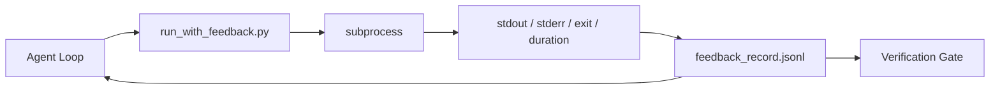

# Циклы обратной связи во время выполнения

> Агенты, которые не видят реальный вывод команд, вынуждены гадать. Раннер обратной связи (feedback runner) записывает stdout, stderr, код возврата и время выполнения в структурированную запись, которую можно прочитать на следующем шаге. Тогда агент реагирует на факты, а не на собственное предсказание фактов.

**Тип:** Build
**Языки:** Python (stdlib)
**Предварительные требования:** Фаза 14 · 32 («Минимальный рабочий стенд»), Фаза 14 · 35 («Скрипт инициализации»)
**Время:** ~50 минут

## Цели обучения

- Отличать обратную связь во время выполнения (runtime feedback) от телеметрии наблюдаемости (observability).
- Построить раннер обратной связи, который оборачивает команды командной оболочки и сохраняет структурированные записи.
- Детерминированно усекать (truncate) большой вывод, чтобы цикл оставался в пределах бюджета токенов.
- Отказываться продолжать цикл, если обратная связь отсутствует.

## Проблема

Агент говорит: «сейчас запускаю тесты». Следующее сообщение гласит: «все тесты прошли». В реальности ни один тест не выполнялся. Агент либо вообразил вывод, либо запустил команду и никогда не прочитал результат, либо прочитал результат и молча усёк строку с ошибкой.

Раннер обратной связи устраняет этот разрыв. Каждая команда проходит через раннер. Каждая запись несёт команду, захваченные stdout и stderr, код возврата, фактическое время выполнения и однострочную заметку агента. Агент читает запись на следующем шаге. Верификационный шлюз (verification gate) читает записи в конце задачи.

## Концепция



### Что входит в запись обратной связи

| Поле | Почему это важно |
|-------|----------------|
| `command` | Точный argv, без неожиданностей от раскрытия в командной оболочке |
| `stdout_tail` | Последние N строк, детерминированное усечение |
| `stderr_tail` | Последние N строк, отдельно от stdout |
| `exit_code` | Однозначный сигнал успеха |
| `duration_ms` | Выявляет медленные пробы и вышедшие из-под контроля процессы |
| `started_at` | Временная метка для воспроизведения |
| `agent_note` | Одна строка, которую агент пишет о том, чего он ожидал |

### Усечение детерминировано

50-мегабайтный лог разрушает цикл. Раннер детерминированно сохраняет фрагменты начала и конца, помещая между ними маркер `...truncated N lines...`, поэтому один и тот же вывод всегда порождает одну и ту же запись. Никакого сэмплирования; части, которые агенту нужно увидеть (финальная ошибка, финальное резюме), находятся в хвосте.

### Обратная связь против телеметрии

Телеметрия (Фаза 14 · 23, конвенции OTel GenAI) предназначена для операторов-людей, просматривающих запуски во времени. Обратная связь — для следующего шага именно этого запуска. Они разделяют поля, но живут в разных файлах с разной политикой хранения.

### Отказ продолжать без обратной связи

Если раннер завершается с ошибкой до захвата кода возврата, запись несёт `exit_code: null` и `error: <reason>`. Цикл агента обязан отказаться заявлять об успехе при `null`-коде возврата. Нет кода возврата — нет продвижения.

```figure
wb-feedback-loop
```

## Реализация

`code/main.py` реализует:

- `run_with_feedback(command, agent_note)`, который оборачивает `subprocess.run`, захватывает stdout/stderr/код возврата/длительность, детерминированно усекает вывод и дописывает запись в `feedback_record.jsonl`.
- Небольшой загрузчик, который потоково читает JSONL в список Python.
- Демонстрацию, которая запускает три команды (успех, отказ, медленная) и печатает последнюю запись по каждой команде.

Запустите:

```
python3 code/main.py
```

Вывод: три записи обратной связи, добавленные в `feedback_record.jsonl`, последняя из которых по каждой команде выводится прямо в консоль. Отслеживайте хвост файла между повторными запусками, чтобы увидеть, как цикл накапливает данные.

## Практика в реальных проектах

Три приёма делают раннер достаточно надёжным для использования в реальных проектах.

**Маскируйте конфиденциальные данные при записи, а не при чтении.** Любая запись, содержащая stdout или stderr, может раскрыть секреты. Перед добавлением записи в JSONL раннер выполняет маскирование: удаляет строки, совпадающие с `^Bearer `, `password=`, `api[_-]?key=`, `AKIA[0-9A-Z]{16}` (AWS), `xox[baprs]-` (Slack). Маскирование при чтении — опасная ошибка: злоумышленник получит доступ именно к файлу на диске. Ежеквартально сверяйте шаблоны маскирования с форматами секретов, которые встречаются в рабочей среде.

**Политика ротации, а не единый файл.** Ограничьте `feedback_record.jsonl` до 1 МБ на файл; при переполнении ротируйте в `.1`, `.2`, отбрасывайте `.5`. Цикл агента читает только текущий файл, поэтому затраты во время выполнения ограничены. Хранилище артефактов CI получает полный ротированный набор. Без ротации файл становится узким местом при каждом вызове загрузчика.

**Id родительской команды для цепочек повторов.** Каждая запись получает `command_id`; повторные попытки несут `parent_command_id`, указывающий на предыдущую попытку. Список «неудачных попыток» ревьюера (Фаза 14 · 40) и аудит верификационных ворот следуют по этой цепочке. Без этой связи повторы выглядят как независимые успехи, и аудит скрывает историю отказов.

## Применение

Паттерны продакшена:

- **Инструмент Bash в Claude Code.** Инструмент уже захватывает stdout, stderr, код возврата и длительность. Раннер из этого урока — фреймворк-независимый эквивалент для любого агентного продукта.
- **Узлы LangGraph.** Оборачивайте любой узел командной оболочки в раннер, чтобы запись сохранялась вне состояния графа.
- **Логи CI.** Передавайте JSONL в хранилище артефактов CI; ревьюеры смогут воспроизвести любую команду без повторного запуска сессии.

Раннер — это тонкая обёртка, которая переживает любую миграцию на другой фреймворк, поскольку сама задаёт формат записи.

## Поставка

`outputs/skill-feedback-runner.md` генерирует адаптированный под проект `run_with_feedback.py` с подходящим бюджетом усечения, подключённым к рабочему стенду (workbench) модулем записи JSONL и загрузчиком, который агент читает на каждом шаге.

## Упражнения

1. Добавьте поле `cwd` в каждую запись, чтобы одна и та же команда, запущенная из разных каталогов, была различимой.
2. Добавьте шаг `redaction`, который вырезает строки, совпадающие с `^Bearer ` или `password=`. Проверьте на фикстурной записи.
3. Ограничьте общий размер `feedback_record.jsonl` в 1 МБ, ротируя в файлы `.1`, `.2`. Обоснуйте политику ротации.
4. Добавьте `parent_command_id`, чтобы цепочки повторов были видны: какая команда произвела ввод, который потребила следующая команда.
5. Передайте JSONL в небольшой TUI, который подсвечивает последний ненулевой код возврата. Восемь ключевых функций, которые TUI обязан показывать, чтобы быть полезным при ревью.

## Ключевые термины

| Термин | Как обычно говорят | Что это на самом деле означает |
|------|----------------|------------------------|
| Запись обратной связи | «Лог запуска» | Структурированная запись JSONL с командой, выводом, кодом возврата и длительностью |
| Усечение хвоста | «Обрезать лог» | Детерминированное сохранение начала и конца, позволяющее уместить записи в бюджет токенов |
| Отказ при null | «Блокироваться при отсутствии данных» | Цикл не должен продолжаться, когда `exit_code` равен null |
| Заметка агента | «Метка ожидания» | Однострочное предсказание, которое агент записывает перед чтением результата |
| Разделение телеметрии | «Два файла логов» | Обратная связь — для следующего шага, телеметрия — для оператора |

## Дополнительное чтение

- [OpenTelemetry GenAI semantic conventions](https://opentelemetry.io/docs/specs/semconv/gen-ai/)
- [Anthropic, Effective harnesses for long-running agents](https://www.anthropic.com/engineering/effective-harnesses-for-long-running-agents)
- [Guardrails AI x MLflow — deterministic safety, PII, quality validators](https://guardrailsai.com/blog/guardrails-mlflow) — шаблоны маскирования как регрессионные тесты
- [Aport.io, Best AI Agent Guardrails 2026: Pre-Action Authorization Compared](https://aport.io/blog/best-ai-agent-guardrails-2026-pre-action-authorization-compared/) — захват до/после вызова инструмента
- [Andrii Furmanets, AI Agents in 2026: Practical Architecture for Tools, Memory, Evals, Guardrails](https://andriifurmanets.com/blogs/ai-agents-2026-practical-architecture-tools-memory-evals-guardrails) — поверхности наблюдаемости
- Фаза 14 · 23 — конвенции OTel GenAI для стороны телеметрии
- Фаза 14 · 24 — платформы наблюдаемости агентов (Langfuse, Phoenix, Opik)
- Фаза 14 · 33 — правило, требующее обратной связи перед объявлением о завершении
- Фаза 14 · 38 — верификационный шлюз, читающий JSONL
