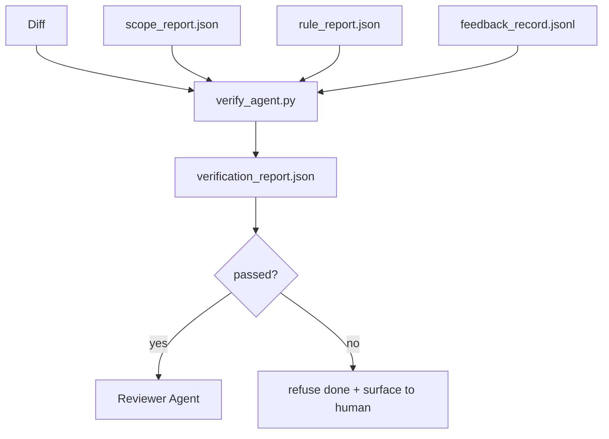

# Верификационные шлюзы

> Агент не имеет права сам отмечать свою работу как выполненную. Верификационный шлюз (verification gate) читает контракт области действия (scope contract), журнал обратной связи, отчёт о правилах и диф и отвечает на один вопрос: действительно ли задача завершена? Если шлюз говорит «нет», задача не завершена — что бы ни утверждал чат.

**Тип:** Build
**Языки:** Python (stdlib)
**Предварительные требования:** Этап 14 · 33 (Правила), этап 14 · 36 (Область действия), этап 14 · 37 (Обратная связь)
**Время:** ~55 минут

## Цели обучения

- Определить верификационный шлюз как детерминированную функцию над артефактами верстака (workbench).
- Объединить отчёт о правилах, отчёт об области действия, записи обратной связи и диф в единый вердикт.
- Выпустить `verification_report.json`, который могут прочитать и агент-ревьюер, и CI.
- Отказываться продвигать задачу при любом отказе с уровнем серьёзности block, без исключений.

## Проблема

Агенты слишком легко объявляют успех. Преобладают три формы сбоя:

- «Выглядит хорошо.» Модель прочитала собственный диф и решила, что он верен.
- «Тесты прошли.» Сказано уверенно. Никакой записи о том, что тест реально запускался, не существует.
- «Критерии приёмки соблюдены.» Критерии приёмки истолкованы настолько вольно, что означают «что угодно, отдалённо похожее на завершение».

Решение верстака — единый верификационный шлюз, который читает артефакты, уже произведённые агентом, и выносит решение. Шлюз детерминирован. Шлюз находится под контролем версий. Шлюз подключён к CI. Агент не может его подкупить.

## Концепция



### Что проверяет шлюз

| Проверка | Исходный артефакт | Серьёзность |
|-------|-----------------|----------|
| Все команды приёмки выполнены | `feedback_record.jsonl` | block |
| Все команды приёмки завершились с нулевым кодом | `feedback_record.jsonl` | block |
| Проверка области действия не находит запрещённых изменений файлов | `scope_report.json` | block |
| Проверка области действия не находит изменений файлов вне области действия | `scope_report.json` | block или warn |
| Все правила с уровнем серьёзности block проходят | `rule_report.json` | block |
| Нет `null`-кодов возврата в обратной связи | `feedback_record.jsonl` | block |
| Затронутые файлы соответствуют `scope.allowed_files` | оба артефакта | warn |

Находка с уровнем серьёзности `warn` аннотирует вердикт; находка с уровнем серьёзности `block` не даёт установить `passed: true`.

### Детерминированный, а не вероятностный

Шлюз обязан выносить один и тот же вердикт для одного и того же набора артефактов каждый раз. Никаких LLM-судей. LLM-судьи — на стороне ревьюера (этап 14 · 39), где цель — качественная оценка, а не статус.

### Один отчёт, один путь

Шлюз выпускает один `verification_report.json` на каждое закрытие задачи, записанный по пути `outputs/verification/<task_id>.json`. CI использует тот же путь. Несколько шлюзов с разными путями раскалывают единый источник истины.

### Отказ без исключений

Находки с уровнем серьёзности block не может переопределить (override) агент. Их может переопределить только человек, зафиксировав `override_reason` и идентификатор пользователя в поле `overridden_by`. Переопределение — это подписанное изменение, а не решение агента.

```figure
wb-gate-sequence
```

## Реализация

`code/main.py` реализует:

- Загрузчик для каждого входного артефакта, все они заглушены локально, чтобы урок был самодостаточным.
- Чистую функцию `verify(task_id, artifacts) -> VerdictReport`.
- Средство вывода, показывающее результаты каждой проверки и итоговый вердикт «пройдено / не пройдено».
- Демонстрацию с тремя сценариями задач: чистое прохождение, расползание области действия, отсутствующая приёмка.

Запустите:

```
python3 code/main.py
```

Вывод: три отчёта о вердикте, каждый сохранён рядом со скриптом.

## Практика в реальных проектах

Четыре паттерна поднимают шлюз с уровня «ещё одна линтер-проверка» до уровня «решающего рубежа».

**Эшелонированная защита (defense-in-depth), а не единственный шлюз.** Хук перед коммитом → проверка статуса CI → хук авторизации перед вызовом инструмента → шлюз перед слиянием. Каждый уровень детерминирован, поэтому отказ на одном уровне будет пойман следующим. Плейбук microservices.io за март 2026 года прямо утверждает: хук перед коммитом нельзя обойти, потому что, в отличие от навыка на стороне модели, он не зависит от того, следует ли агент инструкциям. Верификационный шлюз находится на уровне CI / перед слиянием.

**Защита детерминированной проверкой, модель-судья — только для нюансов.** Гибридная норма Anthropic 2026 года сочетает: проверяемые вознаграждения (юнит-тесты, проверки схемы, коды возврата) отвечают на вопрос «решил ли код проблему?» — рубрики LLM отвечают на вопрос «читаем ли код, безопасен ли он, соответствует ли стилю?». Шлюз выполняет проверки первого класса; ревьюер (этап 14 · 39) — второго. Смешение их схлопывает сигнал.

**Подписанный журнал переопределений, а не переписка в Slack.** Каждое переопределение порождает строку в `outputs/verification/overrides.jsonl` с полями: временная метка, код находки, причина, подписавший пользователь, текущий коммит HEAD. Рантайм отклоняет любое переопределение без подписи; журнал аудита отслеживается в git. Это и есть граница между политикой переопределений и театром переопределений.

**Минимальный порог покрытия (coverage floor) как проверка первого класса.** `coverage_report.json` подаёт данные в проверку `coverage_floor` (по умолчанию 80%). Шлюз отказывает, если измеренное покрытие падает ниже порога или более чем на 1 процентный пункт ниже порога предыдущего слияния. Без этой проверки агенты незаметно удаляют падающие тесты, а отчёты верификации остаются зелёными.

**Режим `--strict` повышает warn до block.** Для релизных веток, PR, блокирующих поставку, или разбора инцидентов постфактум `--strict` превращает каждое предупреждение в жёсткий отказ. Флаг включается по ветке, а не является глобальным значением по умолчанию, потому что строгий режим на всём подряд разъедает повседневный поток работы.

## Применение

Паттерны продакшена:

- **Шаг CI.** Задача `verify_agent` запускает шлюз над финальными артефактами агента. Защита слияния отказывает без `passed: true`.
- **Хук перед передачей.** Рантайм агента вызывает шлюз перед генерацией документа передачи (handoff). Нет зелёного вердикта — нет передачи.
- **Ручной разбор.** Операторы читают отчёт, когда агент заявляет об успехе, а человек подозревает обратное.

Шлюз — это решающий рубеж в потоке верстака. Любая другая поверхность стоит выше по потоку относительно него.

## Поставка

`outputs/skill-verification-gate.md` подключает шлюз к конкретному проекту: какие команды приёмки его питают, какие правила имеют уровень серьёзности block, какие изменения файлов вне области действия допустимы, как хранится журнал аудита переопределений.

## Упражнения

1. Добавьте проверку `coverage_floor`: команда тестов должна выдавать отчёт о покрытии не менее 80%. Решите, какой артефакт несёт этот порог.
2. Поддержите режим `--strict`, повышающий каждый `warn` до `block`. Задокументируйте случаи, когда строгий режим — правильное значение по умолчанию.
3. Сделайте так, чтобы шлюз производил сводку в Markdown в дополнение к JSON. Обоснуйте, какие поля должны входить в сводку.
4. Добавьте проверку `time_since_last_human_touch`: любой файл, отредактированный в течение 60 секунд после нажатия клавиши человеком, освобождается от отметок об изменениях вне области действия.
5. Запустите шлюз на реальном дифе агента из вашего продукта. Сколько находок реальны, а сколько — шум? Где шлюзу нужно расти?

## Ключевые термины

| Термин | Как обычно говорят | Что означает на самом деле |
|------|----------------|------------------------|
| Верификационный шлюз | «Проверка, которая всё останавливает» | Детерминированная функция над артефактами верстака, выдающая вердикт «пройдено / не пройдено» |
| Уровень серьёзности block | «Жёсткий отказ» | Находка, которая не даёт установить `passed: true` и требует подписанного переопределения |
| Журнал переопределений | «Почему мы это пропустили» | Подписанные записи с причиной и идентификатором пользователя, проверяемые при ревью |
| Команда приёмки | «Доказательство» | Команда оболочки, нулевой код возврата которой и означает `done` |
| Единый путь отчёта | «Источник истины» | `outputs/verification/<task_id>.json`, используемый и CI, и людьми |

## Дополнительное чтение

- [Anthropic, Проектирование инфраструктуры для долгосрочной разработки приложений](https://www.anthropic.com/engineering/harness-design-long-running-apps)
- [Защитные ограничения OpenAI Agents SDK](https://openai.github.io/openai-agents-python/guardrails/)
- [microservices.io, Платформа GenAI для разработки: защитные ограничения](https://microservices.io/post/architecture/2026/03/09/genai-development-platform-part-1-development-guardrails.html) — эшелонированная защита между хуком перед коммитом и CI
- [ICMD, Практическое руководство 2026 года по агентным операциям ИИ](https://icmd.app/article/the-2026-playbook-for-agentic-ai-ops-guardrails-costs-and-reliability-at-scale-1776661990431) — лестница шлюзов согласования (черновик → согласование → авто ниже порогов)
- [Type-Checked Compliance: Deterministic Guardrails (arXiv 2604.01483)](https://arxiv.org/pdf/2604.01483) — Lean 4 как верхняя граница детерминированного контроля
- [logi-cmd/agent-guardrails — спецификация шлюза слияния](https://github.com/logi-cmd/agent-guardrails) — область действия + шлюзы мутационного тестирования
- [Guardrails AI x MLflow](https://guardrailsai.com/blog/guardrails-mlflow) — детерминированные валидаторы как CI-скореры
- [Akira, Защитные ограничения реального времени для агентных систем](https://www.akira.ai/blog/real-time-guardrails-agentic-systems) — шлюзы до/после вызова инструмента
- Этап 14 · 27 — защита от инъекции промпта (prompt injection), противник этого шлюза
- Этап 14 · 36 — контракт области действия, соблюдение которого обеспечивает этот шлюз
- Этап 14 · 37 — журнал обратной связи, который оценивает этот шлюз
- Этап 14 · 39 — агент-ревьюер, которому шлюз передаёт работу
