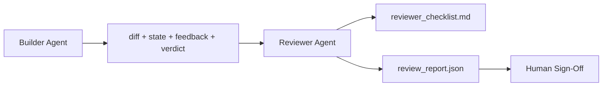

# Агент-ревьюер: отделяем билдера от проверяющего

> Агент, который написал код, не может сам его оценить. Ревьюер (reviewer) — это второй цикл с другим системным промптом, другой целью и доступом только для чтения ко всему, что произвёл билдер (builder). Разрыв между билдером и ревьюером — это то место, где живёт большая часть надёжности.

**Тип:** Build
**Языки:** Python (stdlib)
**Предварительные требования:** Этап 14 · 38 (верификационный шлюз)
**Время:** ~55 минут

## Цели обучения

- Сформулировать, почему один и тот же агент не может надёжно проверять собственную работу.
- Построить цикл агента-ревьюера, который потребляет артефакты билдера и выдаёт структурированный отчёт о проверке.
- Составить рубрику ревьюера (rubric), которая оценивает конкретные измерения, а не общее впечатление.
- Подключить ревьюера к рабочему стенду (workbench), чтобы этап проверки человеком начинался с реального артефакта.

## Проблема

Вы просите агента исправить баг. Он редактирует четыре файла, запускает тесты и сообщает о готовности. Верификационный шлюз (verification gate, этап 14 · 38) подтверждает, что приёмка прошла и область действия не была нарушена. Шлюз говорит `passed: true`. Вы сливаете изменения. Через два дня выясняется, что исправление решило не ту половину бага.

Приёмка необходима, но недостаточна. Ревьюер задаёт вопросы, которые приёмка задать не может: решило ли это правильную проблему? Расширило ли это область действия, не пометив это? Задокументированы ли предположения, которые следовало поставить под сомнение? Оставило ли это рабочий стенд в состоянии, из которого следующая сессия сможет продолжить?

## Концепция



### Рубрика ревьюера

Пять измерений, каждое оценивается от 0 до 2.

| Измерение | Вопрос |
|-----------|----------|
| Соответствие проблеме | Решило ли изменение задачу так, как она была сформулирована, а не смежную задачу? |
| Дисциплина области действия | Были ли правки ограничены контрактом, или контракт был расширен намеренно? |
| Предположения | Все ли скрытые предположения записаны где-то в проверяемом виде? |
| Качество верификации | Действительно ли команда приёмки доказывает цель, или она доказывает более слабую версию? |
| Готовность к передаче | Сможет ли следующая сессия аккуратно продолжить с текущего состояния? |

Итог — из 10. Прогон ниже 7 — это мягкий отказ (soft fail); прогон ниже 5 — это жёсткий отказ (hard fail).

### Ревьюер — это отдельная роль, а не отдельная модель

Ревьюера можно запускать на той же модели, что и билдера. Дисциплина заключается в разделении ролей: другой системный промпт, другие входные данные, отсутствие доступа на запись к дифу. Изменение позиции — это и есть изменение сигнала.

### Ревьюер не может редактировать диф

Ревьюер читает диф, состояние, обратную связь, вердикт. Он пишет отчёт. Он не патчит диф. Если отчёт говорит «исправьте это», исправление делает следующий ход билдера; ревьюер возвращается к проверке. Смешение ролей сводит на нет весь смысл разрыва.

### Рубрика ревьюера против верификационного шлюза

Шлюз (этап 14 · 38) проверяет детерминированные факты: прошла ли приёмка, выполнились ли правила, удержалась ли область действия. Ревьюер выносит качественные суждения: была ли это правильная работа, задокументирована ли она, пригодна ли передача. Требуются оба.

```figure
wb-builder-marker
```

## Реализация

`code/main.py` реализует:

- Датакласс `ReviewerInputs`, объединяющий артефакты, которые читает ревьюер.
- Оценщик рубрики с одной функцией на каждое измерение. Каждая функция детерминирована и упрощена до уровня заглушки для целей урока; реальная реализация вызывала бы LLM.
- Писатель `review_report.json` с пятью оценками, итогом и вердиктом (`pass`, `soft_fail`, `hard_fail`).
- Два демонстрационных случая: чистое изменение и изменение «правильные тесты, неправильная проблема».

Запустите:

```
python3 code/main.py
```

Вывод: два отчёта о проверке, записанные на диск, и консольная таблица оценок по измерениям.

## Практика в реальных проектах

Доказательства: система AI Code Review компании Cloudflare в апреле 2026 года выполнила 131,246 прогонов проверки по 48,095 запросам на слияние (merge requests) в 5,169 репозиториях за 30 дней. Медианная проверка завершалась за 3 минуты 39 секунд. До семи специализированных ревьюеров (безопасность, производительность, качество кода, документация, управление релизами, комплаенс, Engineering Codex) работали параллельно под управлением координатора проверки (Review Coordinator), который дедуплицировал находки и оценивал серьёзность. Топовая модель зарезервирована исключительно для координатора; специалисты работали на более дешёвых уровнях.

Работу в таком масштабе обеспечивают четыре паттерна.

**Пул специалистов, а не один большой ревьюер.** Один ревьюер с 5-мерной рубрикой хорошо работает для одиночных репозиториев. Как только в кодовой базе появляются критичные для безопасности, критичные для производительности и документационные поверхности, разделяйтесь на специалистов с более короткими промптами. Дедупликацию выполняет координатор; специалисты никогда не прогоняют рубрику целиком. Разделение по уровням моделей возникает само собой: дешёвые специалисты, дорогой координатор.

**Смягчение смещений как требование проектирования, а не оптимизация.** LLM-судьи демонстрируют четыре устойчивых смещения (Adnan Masood, апрель 2026): смещение по позиции (position bias) (GPT-4 ~40% непоследователен при сравнении порядка (A,B) против (B,A)), смещение по многословности (verbosity bias) (~15% завышение оценки в пользу более длинных результатов), предпочтение своей модели (self-preference) (судьи предпочитают результаты из того же семейства моделей), смещение по авторитетности (authority) (судьи завышают оценку ссылкам на известных авторов). Способы смягчения: оценивать оба порядка и засчитывать только согласованные победы; использовать шкалы 1-4, явно вознаграждающие лаконичность; ротировать судей между семействами моделей; удалять имена авторов перед оцениванием.

**Калибровочный набор (calibration set), а не общее впечатление.** Исторический набор из 10-20 задач с известными правильными вердиктами. Прогоняйте ревьюера по нему при каждом изменении промпта. Если согласие с историческими данными падает ниже 80%, рубрику нужно пересмотреть до того, как ревьюер отправится в поставку. Это то, что рано или поздно заново открывает для себя каждая команда; лучше начать с этого сразу.

**Гибридная норма совместно со шлюзом.** Верификационный шлюз (этап 14 · 38) выполняет детерминированные проверки (прошла ли приёмка, прошли ли тесты, удержалась ли область действия). Ревьюер выполняет семантические проверки (была ли это правильная работа, задокументированы ли предположения, пригодна ли передача). Рекомендации Anthropic 2026 года явно указывают на это разделение: не просите ревьюера переделывать то, что шлюз уже доказал.

## Применение

Паттерны продакшена:

- **Подагенты Claude Code.** Подагент-ревьюер запускается после того, как билдер закрывает задачу. Он публикует комментарий к PR с оценками по рубрике.
- **Хендоффы OpenAI Agents SDK.** Билдер передаёт управление ревьюеру по завершении задачи. Ревьюер может вернуть управление со списком находок или эскалировать к человеку.
- **Парное использование двух моделей.** Билдер работает на более быстрой и дешёвой модели. Ревьюер работает на более сильной модели с меньшим контекстом, сфокусированной на суждении.

Ревьюер — это вторая пара глаз, которую рабочий стенд отращивает, когда люди не могут выполнять каждую проверку сами.

## Поставка

`outputs/skill-reviewer-agent.md` генерирует проектно-специфичную рубрику ревьюера, заготовку агента-ревьюера, подключённую к артефактам билдера, и интеграцию с верификационным шлюзом, чтобы проверка человеком начиналась с написанного отчёта, а не с чистого листа.

## Упражнения

1. Добавьте шестое измерение, специфичное для вашего продуктового домена. Обоснуйте, почему оно не поглощается существующими пятью.
2. Запустите ревьюера с двумя разными системными промптами (лаконичным и многословным). Какой из них с большей вероятностью даёт отчёт, который человек действительно прочитает?
3. Добавьте поле `confidence` для каждого измерения. Откажитесь публиковать отчёт, если уверенность по самому низкому измерению ниже 0.6.
4. Постройте калибровочный набор: 10 исторических закрытий задач с известными правильными вердиктами. Прогоните ревьюера по ним. В чём он расходится с историческими данными?
5. Добавьте возможность «запросить больше доказательств»: ревьюер может попросить билдера выполнить конкретный тестовый прогон перед оцениванием. Какая задержка с увеличением интервала (back-off) правильна, чтобы это не зациклилось?

## Ключевые термины

| Термин | Как обычно говорят | Что это на самом деле означает |
|------|----------------|------------------------|
| Рубрика ревьюера | «Чек-лист» | Оценивание по пяти измерениям от 0 до 2 с письменным вопросом для каждого измерения |
| Мягкий отказ | «Требуются доработки» | Итог ниже 7; билдер получает список замечаний, которые нужно устранить |
| Жёсткий отказ | «Отклонить» | Итог ниже 5 или оценка 0 по любому измерению; остановить процесс и передать результат человеку |
| Разделение ролей | «Другой промпт» | Одна и та же модель может выполнять обе роли; разделение обеспечивается разными входными данными и подходом к задаче |
| Нижний порог уверенности | «Не публиковать отчёты с недостаточно надёжным сигналом» | Не выдавать вердикт, если уверенности в оценке по рубрике недостаточно |

## Дополнительное чтение

- [Передача управления в OpenAI Agents SDK](https://openai.github.io/openai-agents-python/handoffs/)
- [Подагенты Anthropic Claude Code](https://code.claude.com/docs/en/sub-agents)
- [Cloudflare: оркестрация проверки кода средствами ИИ в масштабе](https://blog.cloudflare.com/ai-code-review/) — архитектура «7 специалистов + координатор», 131k прогонов / 30 дней
- [Agent-as-a-Judge: Evaluating Agents with Agents (OpenReview / ICLR)](https://openreview.net/forum?id=DeVm3YUnpj) — бенчмарк DevAI, 366 иерархических требований к решению
- [Adnan Masood: оценивания на основе рубрик и LLM в роли судьи — методологии, смещения, эмпирическая валидация](https://medium.com/@adnanmasood/rubric-based-evals-llm-as-a-judge-methodologies-and-empirical-validation-in-domain-context-71936b989e80) — 4 смещения и способы их смягчения
- [MLflow: оценивание с помощью LLM в роли судьи](https://mlflow.org/llm-as-a-judge) — продакшен-инструментарий для разделённых билдера/оценщика
- [LangChain: как откалибровать LLM в роли судьи с помощью исправлений человека](https://www.langchain.com/articles/llm-as-a-judge) — рабочий процесс с калибровочным набором
- [Evidently AI: LLM в роли судьи — полное руководство](https://www.evidentlyai.com/llm-guide/llm-as-a-judge)
- [Arize: LLM в роли судьи — введение и готовые оценщики](https://arize.com/llm-as-a-judge/)
- Этап 14 · 05 — Self-Refine и CRITIC (базовый вариант самопроверки одного агента)
- Этап 14 · 30 — разработка агентов на основе оценивания (генератор калибровочного набора)
- Этап 14 · 38 — верификационный шлюз, который читает ревьюер
- Этап 14 · 40 — пакет передачи, в который поступает отчёт ревьюера
