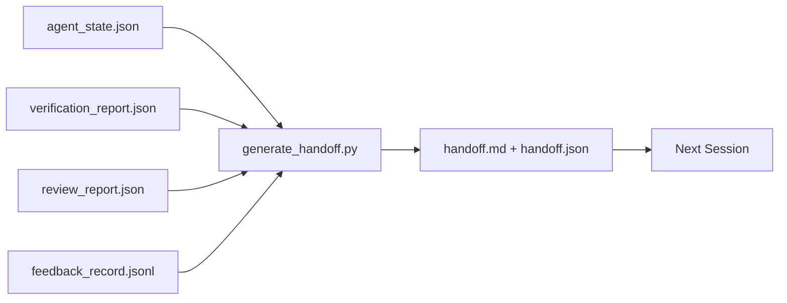

# Передача между сессиями

> Сессия закончится. Работа — нет. Пакет передачи (handoff) — это артефакт, который превращает «агент работал час» в «следующая сессия продуктивна с первой минуты». Создавайте его целенаправленно, а не в последний момент.

**Тип:** Build
**Языки:** Python (stdlib)
**Предварительные требования:** Фаза 14 · 34 (Память репозитория), фаза 14 · 38 (Верификация), фаза 14 · 39 (Ревьюер)
**Время:** ~50 минут

## Цели обучения

- Назвать семь полей, которые нужны каждому пакету передачи.
- Сгенерировать пакет передачи из артефактов рабочего стенда (workbench) без написания текста вручную.
- Урезать большие логи обратной связи до резюме размером с пакет передачи.
- Сделать первое действие следующей сессии детерминированным.

## Проблема

Сессия заканчивается. Агент говорит: «отлично, мы продвинулись». Открывается следующая сессия. Следующий агент спрашивает: «на чём мы остановились?» Ответ первого агента исчез. Следующий агент заново всё выясняет, повторно запускает те же команды, повторно задаёт человеку те же вопросы и тратит тридцать минут на восстановление последних тридцати секунд предыдущей сессии.

Цена плохой передачи оплачивается в каждой сессии на протяжении всей жизни задачи. Решение — пакет, генерируемый автоматически при завершении сессии: что изменилось, почему, что было испробовано, что не сработало, что осталось и что сделать первым в следующий раз.

## Концепция



### Семь полей, которые несёт каждая передача

| Поле | На какой вопрос отвечает |
|-------|---------------------|
| `summary` | Один абзац о том, что было сделано |
| `changed_files` | Краткий обзор изменений |
| `commands_run` | Что было фактически выполнено |
| `failed_attempts` | Что было испробовано и почему не сработало |
| `open_risks` | Что может навредить следующей сессии, с указанием серьёзности |
| `next_action` | Первый конкретный шаг, который делает следующая сессия |
| `verdict_pointer` | Путь к отчётам верификации и ревью |

Поле `next_action` — несущее. Передача, в которой есть всё, кроме `next_action`, — это статус-отчёт, а не передача.

### Передачи генерируются, а не пишутся

Написанная вручную передача — это передача, которую пропустят в тяжёлый день. Генератор читает артефакты рабочего стенда и выдаёт пакет. Задача агента — оставить рабочий стенд в состоянии, которое генератор способен резюмировать, а не писать резюме самому.

### Две формы: для человека и для машины

`handoff.md` читает человек. `handoff.json` загружает следующий агент. Оба получаются из одних и тех же исходных артефактов. Если они расходятся, побеждает JSON.

### Урезание лога обратной связи

Полный `feedback_record.jsonl` может содержать сотни записей. Передача несёт только последние K записей плюс каждую запись с ненулевым кодом выхода. Следующая сессия при необходимости загружает полный лог, но пакет остаётся небольшим.

### Оставляйте чистое состояние

Передача описывает работу. Чистое состояние делает работу возобновляемой. Это не одно и то же. Идеальный `handoff.md` ничего не стоит, если следующая сессия начинается с наполовину применённым дифом, забытым агентом временным файлом, случайной веткой и тестами, которые падают с ошибкой ещё до запуска. Тогда следующий агент тратит первые десять минут на уборку за предыдущим вместо того, чтобы строить, и эта цена накапливается в каждой сессии на протяжении всей жизни задачи.

Поэтому сессия заканчивается не тогда, когда функция работает. Она заканчивается тогда, когда рабочий стенд находится в состоянии, которое генератор может резюмировать, а следующая сессия — доверять. Уборка — это отдельная фаза, выполняемая перед передачей, и это проверка, а не привычка, потому что привычку пропускают в тяжёлый день.

| Проверка | Что значит «чисто» | Почему «грязно» блокирует |
|-------|-------------|----------------------|
| Рабочее дерево | Каждое изменение закоммичено или явно отложено (stash) с пометкой | Наполовину применённый диф выглядит для следующего агента как намеренная работа |
| Временные артефакты | Не осталось `*.tmp`, черновых каталогов, отладочных сообщений или закомментированных блоков | Случайные файлы засоряют диф и ментальную модель следующего агента |
| Тесты | Зелёные, либо красные с указанием сбоя в `open_risks` | Падающий тест, не указанный в рисках, — ловушка, в которую попадёт следующая сессия |
| Доска возможностей | Статус `feature_list.json` отражает реальность (фаза 14 · 36) | Устаревшая доска отправляет следующую сессию на работу, которая уже сделана |
| Ветка | На ожидаемой ветке, без отсоединённого HEAD (detached HEAD), без бесхозных веток | Не та ветка означает, что первый коммит следующей сессии попадёт не туда |

Фаза уборки выдаёт `clean_state.json` с блокирующими проблемами; пустой список — это предусловие, которое генератор передачи проверяет перед тем, как записать пакет. Передача, построенная на грязном дереве, — это не передача, а пересланный беспорядок. Эти два артефакта работают в паре: уборка доказывает, что рабочий стенд можно безопасно оставить, а передача доказывает, что следующая сессия знает, с чего начать.

```figure
wb-handoff-packet
```

## Реализация

`code/main.py` реализует:

- Загрузчик, который собирает состояние, вердикт, ревью и обратную связь в единый `WorkbenchSnapshot`.
- Функцию `generate_handoff(snapshot) -> (markdown, payload)`.
- Фильтр, который выбирает последние K записей обратной связи плюс все записи с ненулевым выходом.
- Демонстрационный запуск, который записывает `handoff.md` и `handoff.json` рядом со скриптом.

Запустите:

```
python3 code/main.py
```

Вывод: напечатанное тело передачи, плюс оба файла на диске.

## Практика в реальных проектах

У Codex CLI, Claude Code и OpenCode — разные истории сжатия контекста (compaction); структурированный пакет передачи стоит поверх всех трёх.

**Стратегии сжатия разные, схема пакета — нет.** POST /v1/responses/compact в Codex CLI — это непрозрачный AES-блоб на стороне сервера (быстрый путь для моделей OpenAI); резервный вариант — локальное «резюме передачи», добавляемое как сообщение `_summary` с ролью пользователя. Claude Code выполняет пятиэтапное прогрессивное сжатие при 95% контекста. OpenCode скрывает сообщения по временным меткам плюс делает LLM-резюме из 5 заголовков. Три разных механизма, одна и та же потребность: сериализовать то, что переживает сжатие, в переносимый артефакт. Пакет и есть этот артефакт.

**Передача в свежую сессию — это не сжатие.** Сжатие продлевает сессию; передача аккуратно закрывает одну и начинает следующую. Формулировка из Hermes Issue #20372 (апрель 2026) верна: когда сжатие в рамках текущей сессии начинает ухудшать качество, агент должен написать компактную передачу, завершить сессию и возобновить работу в свежем контексте. Пакет — это то, что делает такой переход дешёвым. Ошибка — продолжать сжимать, пока качество не рухнет; решение — заранее заложить бюджет на раннюю, чистую передачу.

**Одна активная передача на ветку и тему.** Координация между несколькими агентами ломается на устаревших передачах чаще, чем из-за плохого вывода модели. Всегда включайте `branch`, `last_known_good_commit` и `status` со значением `active | superseded | archived`. Устаревшие передачи архивируются; только активная управляет следующей сессией. В этом разница между передачей-как-заметкой и передачей-как-состоянием.

**Завершайте работу до 50-75% контекста, а не у стены.** Плейбук с паттерном ручного написания (CLAUDE.md + HANDOVER.md) сообщает о лучших результатах, когда сессия заканчивается при 50-75% бюджета контекста вместо 95%. Генератор пакета работает чисто, пока артефакты сжатия ещё не загрязнили исходное состояние. Дёшево писать, пока контекст цел; дорого — когда модель уже теряет нить.

## Применение

Паттерны продакшена:

- **Хук на завершение сессии.** Рантайм запускает генератор, когда пользователь закрывает чат. Пакет попадает в `outputs/handoff/<session_id>/`.
- **Шаблон PR.** Markdown генератора служит и телом PR. Ревьюеры читают его, не открывая пять других файлов.
- **Межагентная передача.** Начните работу в одном продукте (Claude Code), продолжите в другом (Codex). Пакет — это общий язык (lingua franca).

Пакет маленький, регулярный и дешёвый в производстве. Экономия накапливается с каждой сессией.

## Поставка

`outputs/skill-handoff-generator.md` создаёт генератор, настроенный под пути артефактов проекта, хук завершения сессии, который его запускает, и схему `handoff.json`, которую следующий агент читает при старте.

## Упражнения

1. Добавьте поле `assumptions_to_validate`, которое выявляет каждое допущение, зафиксированное билдером, но не получившее от ревьюера оценку выше 1.
2. Урезайте резюме обратной связи по-разному для неудачных и успешных запусков. Обоснуйте эту асимметрию.
3. Добавьте список «вопросы для человека». Каков порог для того, чтобы вопрос попал в пакет, а не в сообщение чата?
4. Сделайте генератор идемпотентным: повторный запуск даёт тот же пакет. Что должно оставаться стабильным, чтобы это выполнялось?
5. Добавьте раздел «предпосылки следующей сессии», перечисляющий именно те артефакты, которые следующая сессия обязана загрузить перед тем, как действовать.

## Ключевые термины

| Термин | Как обычно говорят | Что это означает на самом деле |
|------|----------------|------------------------|
| Пакет передачи | «Резюме сессии» | Генерируемый артефакт с семью полями в форматах Markdown и JSON |
| Первое действие | «С чего начать» | Конкретный шаг, с которого начинается следующая сессия |
| Урезанное резюме обратной связи | «Резюме лога» | Последние K записей плюс каждая запись с ненулевым кодом выхода |
| Отчёт о состоянии | «Что мы сделали» | Документ без `next_action`: он полезен, но не является пакетом передачи |
| Указатель на вердикт | «Квитанция» | Путь к отчётам о верификации и ревью, обеспечивающий трассируемость |

## Дополнительное чтение

- [Anthropic, Effective harnesses for long-running agents](https://www.anthropic.com/engineering/effective-harnesses-for-long-running-agents)
- [OpenAI Agents SDK handoffs](https://openai.github.io/openai-agents-python/handoffs/)
- [Codex Blog, Codex CLI Context Compaction: Architecture, Configuration, Managing Long Sessions](https://codex.danielvaughan.com/2026/03/31/codex-cli-context-compaction-architecture/) — POST /v1/responses/compact и локальный резервный вариант
- [Justin3go, Shedding Heavy Memories: Context Compaction in Codex, Claude Code, OpenCode](https://justin3go.com/en/posts/2026/04/09-context-compaction-in-codex-claude-code-and-opencode) — сравнение сжатия контекста у трёх поставщиков
- [JD Hodges, Claude Handoff Prompt: How to Keep Context Across Sessions (2026)](https://www.jdhodges.com/blog/ai-session-handoffs-keep-context-across-conversations/) — CLAUDE.md + HANDOVER.md, бюджет контекста 50-75%
- [Mervin Praison, Managing Handoffs in Multi-Agent Coding Sessions: Fresh Context Without Losing Continuity](https://mer.vin/2026/04/managing-handoffs-in-multi-agent-coding-sessions-fresh-context-without-losing-continuity/) — формулировка в терминах распределённых систем
- [Hermes Issue #20372 — automatic fresh-session handoff when compression becomes risky](https://github.com/NousResearch/hermes-agent/issues/20372)
- [Hermes Issue #499 — Context Compaction Quality Overhaul](https://github.com/NousResearch/hermes-agent/issues/499) — промпты, ориентированные на передачу, в Codex CLI
- [Microsoft Agent Framework, Compaction](https://learn.microsoft.com/en-us/agent-framework/agents/conversations/compaction)
- [OpenCode, Context Management and Compaction](https://deepwiki.com/sst/opencode/2.4-context-management-and-compaction)
- [LangChain, Context Engineering for Agents](https://www.langchain.com/blog/context-engineering-for-agents)
- Фаза 14 · 34 — файл состояния, который читает генератор
- Фаза 14 · 38 — вердикт верификации, на который указывает пакет
- Фаза 14 · 39 — отчёт ревьюера, упакованный в пакет
