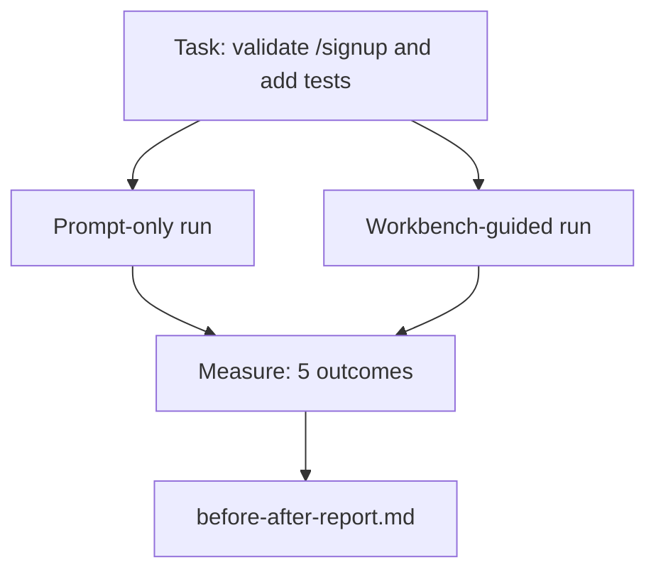

# Рабочий стенд на реальном репозитории

> Одиннадцать уроков о поверхностях ничего не стоят, если они не выживают при столкновении с реальной кодовой базой. В этом уроке одна и та же задача выполняется дважды на небольшом тестовом приложении: только с промптом против варианта под управлением рабочего стенда. Спорят цифры.

**Тип:** Build
**Языки:** Python (stdlib)
**Предварительные требования:** Уроки 14 · 32–14 · 40
**Время:** ~60 минут

## Цели обучения

- Свести семь поверхностей рабочего стенда воедино на небольшом приложении.
- Выполнить одну и ту же задачу дважды (только с промптом и под управлением рабочего стенда) и измерить пять результатов.
- Прочитать отчёт «до/после» и определить, какие поверхности дали наибольший эффект.
- Отстоять рабочий стенд перед возражением «но моей модели достаточно».

## Проблема

Демонстрация на игрушечной задаче никого не убеждает. Аргумент в пользу рабочего стенда работает, когда правдоподобная задача на правдоподобном репозитории попадает в продакшен с меньшим числом отказов, меньшим числом откатов и пакетом, которым сможет воспользоваться следующая сессия.

Этот урок поставляет такой правдоподобный репозиторий и прогоняет одну и ту же задачу через оба конвейера. Результат — отчёт «до/после», который можно вручить скептику.

## Концепция



### Тестовое приложение

Минимальный обработчик в стиле FastAPI в `sample_app/`:

- `app.py` с `/signup` (валидации пока нет).
- `test_app.py` с одним тестом успешного сценария.
- `README.md` и `scripts/release.sh` как приманка для запретной зоны.

### Задача

> Добавьте валидацию входных данных для `/signup`: отклоняйте пароли короче 8 символов, возвращайте 422 с типизированным конвертом ошибки. Добавьте тест, который доказывает новое поведение.

### Два конвейера

Только с промптом:

1. Прочитать README.
2. Прочитать `app.py`.
3. Отредактировать файлы.
4. Заявить о завершении.

Под управлением рабочего стенда:

1. Запустить скрипт инициализации (Урок 35).
2. Прочитать контракт области (Урок 36).
3. Прочитать состояние (Урок 34).
4. Редактировать только разрешённые файлы.
5. Запустить команду приёмки через раннер обратной связи (Урок 37).
6. Запустить ворота верификации (Урок 38).
7. Запустить ревьюера (Урок 39).
8. Сгенерировать пакет передачи (Урок 40).

### Пять измеряемых результатов

| Результат | Почему это важно |
|---------|----------------|
| `tests_actually_run` | Большинство заявлений «тесты прошли» невозможно проверить |
| `acceptance_met` | Тест, доказывающий достижение цели, должен быть тем тестом, который реально выполнился |
| `files_outside_scope` | Расползание области — доминирующий вид молчаливого отказа |
| `handoff_quality` | Следующая сессия платит за это или выигрывает от этого |
| `reviewer_total` | Качественная оценка поверх ворот верификации |

```figure
wb-ab-runs
```

## Реализация

`code/main.py` оркестрирует оба конвейера на одной и той же фикстуре тестового приложения. Оба конвейера выполняются по сценарию — LLM в цикле нет, — поэтому измерение воспроизводимо. Скрипт записывает сравнение в `before-after-report.md` и `comparison.json`.

Запустите:

```
python3 code/main.py
```

Вывод: консольная таблица результатов по каждому конвейеру, markdown-отчёт, сохранённый рядом со скриптом, и JSON для тех, кто хочет построить по нему графики.

## Продакшен-паттерны на практике

Вопрос скептика — «насколько рабочий стенд реально помогает?». Цифры 2026 года говорят намного больше, чем объяснение.

**Terminal Bench: с места вне топ-30 на пятое место на той же модели.** *Anatomy of an Agent Harness* от LangChain (апрель 2026 года): кодовый агент поднялся с позиции вне топ-30 на пятое место в Terminal Bench 2.0, изменив только харнес. Та же модель. Другие поверхности. Разница в двадцать пять позиций.

**Vercel: с 80% до 100% путём удаления инструментов.** Vercel сообщили, что удаление 80% инструментов агента подняло долю успеха с 80% до 100%. Меньшая поверхность инструментов, более чёткая область, меньше способов ошибиться. Побеждает негативное пространство.

**Harvey: двукратный рост точности только за счёт харнеса.** Юридические агенты более чем удвоили точность благодаря оптимизации харнеса, без изменения модели.

**88% корпоративных проектов ИИ-агентов не доходят до продакшена.** Статья *Harness Engineering for Language Agents* на preprints.org (март 2026 года) прослеживает причины отказов до рантайма, а не до рассуждений: устаревшее состояние, хрупкие повторные попытки, разросшийся контекст, плохое восстановление после промежуточных ошибок.

**Коллапс длинного контекста.** Базовая доля успеха WebAgent в 40-50% падает ниже 10% в условиях длинного контекста — в основном из-за бесконечных циклов и потери цели. Ralph Loop и пакет передачи существуют именно для того, чтобы это поглощать.

**Ложноотрицательные случаи никуда не делись.** Одношаговые фактологические задачи, однострочные проверки линтером, запуски форматтера, всё, что модель заучила дословно, — всё это быстрее выполняется только с промптом. Бенчмарк должен честно перечислять такие случаи, чтобы рабочий стенд не выглядел избыточным.

Вывод не в том, что «харнес побеждает навсегда». Модели действительно со временем усваивают трюки харнеса. Вывод в том, что сегодня инженерная нагрузка сосредоточена в семи поверхностях, и цифры это доказывают.

## Применение

Этот урок — досье, на которое вы ссылаетесь, когда:

- Кто-то спрашивает, почему каждый PR несёт с собой `agent-rules.md` и контракт области.
- Команда хочет отказаться от ворот верификации «только на этот спринт».
- Запускается новый агентный продукт, и вам нужен переносимый бенчмарк, чтобы проверить, действительно ли он экономит время.

Цифры доходят дальше, чем объяснение.

## Поставка

`outputs/skill-workbench-benchmark.md` — переносимый харнес для оценивания, который прогоняет любой агентный продукт через оба конвейера на собственном тестовом приложении проекта и сообщает пять результатов.

## Упражнения

1. Добавьте шестой результат: время до первого содержательного изменения. Как измерить его корректно?
2. Прогоните сравнение на реальной задаче «второго дня» в вашей кодовой базе. Где показатели рабочего стенда просаживаются?
3. Добавьте проход «ложноотрицательных случаев»: задачи, где только промпт был бы быстрее, а накладные расходы рабочего стенда — реальная цена. Обоснуйте, почему рабочий стенд всё равно стоит сохранить.
4. Замените сценарного «агента» реальным вызовом LLM. Какие результаты становятся более шумными?
5. Напишите сводку на одну страницу для нетехнического специалиста. Что переживёт сокращение?

## Ключевые термины

| Термин | Как это называют | Что это значит на самом деле |
|------|----------------|------------------------|
| Тестовое приложение | «Игрушечный репозиторий» | Небольшое, но достаточно реалистичное приложение, чтобы задействовать все семь поверхностей |
| Конвейер | «Рабочий процесс» | Упорядоченная последовательность чтений и записей поверхностей, которой следует агент |
| Отчёт «до/после» | «Вот доказательства» | Артефакт, который вы вручаете скептику |
| Ложноотрицательный случай | «Рабочий стенд — это излишество» | Задачи, которые быстрее выполнять только с промптом; такие случаи полезно честно перечислять |
| Бенчмарк рабочего стенда | «Оценка надёжности» | Переносимый харнес, который выполняет сравнение на вашей кодовой базе |

## Дополнительное чтение

- [LangChain, The Anatomy of an Agent Harness](https://blog.langchain.com/the-anatomy-of-an-agent-harness/) — доказательство Terminal Bench: с места вне топ-30 на топ-5
- [MongoDB, The Agent Harness: Why the LLM Is the Smallest Part of Your Agent System](https://www.mongodb.com/company/blog/technical/agent-harness-why-llm-is-smallest-part-of-your-agent-system) — цифры Vercel и Harvey
- [preprints.org, Harness Engineering for Language Agents](https://www.preprints.org/manuscript/202603.1756) — 88% отказов на уровне предприятий, корневые причины в рантайме
- [HN: Improving 15 LLMs at Coding in One Afternoon. Only the Harness Changed](https://news.ycombinator.com/item?id=46988596) — воспроизведено на 15 моделях
- [Cloudflare, Orchestrating AI Code Review at Scale](https://blog.cloudflare.com/ai-code-review/) — 131 тыс. прогонов ревью за 30 дней в продакшене
- [Anthropic, Building Effective Agents](https://www.anthropic.com/research/building-effective-agents)
- Уроки 14 · 32–14 · 40 — поверхности, которые этот урок задействует от начала до конца
- Урок 14 · 19 — SWE-bench, GAIA, AgentBench как макро-бенчмарки, которые дополняет этот урок
- Урок 14 · 30 — разработка агентов на основе оценивания, к которой подключается тот же харнес
