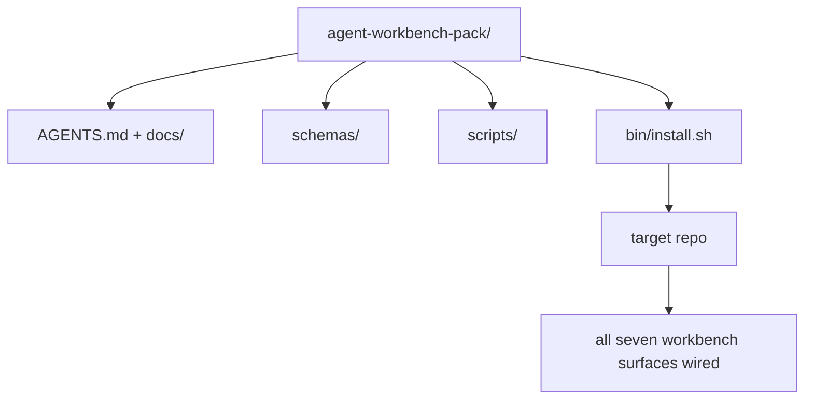

# Капстоун: поставьте переиспользуемый пакет рабочего стенда агента

> Мини-трек завершается пакетом, который можно поместить в любой репозиторий. Одиннадцать уроков о поверхностях, сжатых в каталог, который можно скопировать командой `cp -r`, и уже на следующее утро агент будет работать надёжно. Капстоун — это артефакт, вокруг которого выстроен весь этот курс.

**Тип:** Build
**Языки:** Python (stdlib)
**Предварительные требования:** Фазы 14 · 31–14 · 41
**Время:** ~75 минут

## Цели обучения

- Упаковать семь поверхностей рабочего стенда в один каталог, готовый к использованию «из коробки».
- Зафиксировать схемы, скрипты и шаблоны, чтобы новый репозиторий получал заведомо рабочую базовую линию.
- Добавить единственный скрипт-инсталлятор, который идемпотентно разворачивает пакет.
- Решить, что остаётся в пакете, а что нет, и обосновать каждое решение.

## Проблема

Рабочий стенд, который живёт в Google Docs, истории чата и трёх наполовину забытых скриптах, — это рабочий стенд, который приходится пересобирать каждый квартал. Лекарство — версионированный пакет: репозиторий или каталог с поверхностями, схемами, скриптами и однокомандным инсталлятором.

К концу этого урока у вас будет `outputs/agent-workbench-pack/`, поставленный на диск, и `bin/install.sh`, который разворачивает его в любом целевом репозитории.

## Концепция



### Структура пакета

```
outputs/agent-workbench-pack/
├── AGENTS.md
├── docs/
│   ├── agent-rules.md
│   ├── reliability-policy.md
│   ├── handoff-protocol.md
│   └── reviewer-rubric.md
├── schemas/
│   ├── agent_state.schema.json
│   ├── task_board.schema.json
│   └── scope_contract.schema.json
├── scripts/
│   ├── init_agent.py
│   ├── run_with_feedback.py
│   ├── verify_agent.py
│   └── generate_handoff.py
├── bin/
│   └── install.sh
└── README.md
```

### Что входит в пакет, а что нет

Входит:

- Схемы поверхностей. Это контракт.
- Четыре скрипта выше. Это рантайм.
- Четыре документа. Это правила и рубрика.

Не входит:

- Задачи, специфичные для проекта. Задачи принадлежат доске целевого репозитория, а не пакету.
- Вызовы вендорских SDK. Пакет не привязан к конкретному фреймворку.
- Онбординговый текст. Пакет живёт рядом с существующим онбордингом команды, а не внутри него.

### Инсталлятор

Короткий `bin/install.sh` (или `bin/install.py`):

1. Отказывается устанавливаться поверх существующего пакета без `--force`.
2. Копирует пакет в целевой репозиторий.
3. Подключает CI, если существует `.github/workflows/`.
4. Печатает дальнейшие шаги: заполнить доску, задать команды приёмки, запустить скрипт инициализации.

### Версионирование

Пакет несёт файл `VERSION`. Изменения схем и скриптов, требующие миграций, повышают мажорную версию. Изменения только в документах повышают патч-версию. `agent_state.json` целевого репозитория фиксирует, против какой версии пакета он был инициализирован.

```figure
wb-pack-install
```

## Реализация

`code/main.py` собирает пакет в `outputs/agent-workbench-pack/` рядом с уроком, заполняя его схемами и скриптами из предыдущих уроков этого мини-трека, а также уже написанными документами.

Запустите:

```
python3 code/main.py
```

Скрипт копирует и фиксирует поверхности, записывает README, печатает дерево пакета и завершается с кодом 0. Повторный запуск идемпотентен.

## Продакшен-паттерны на практике

Пакет ценен, только если он переживает форки, обновления и недружелюбный апстрим. Это обеспечивают четыре паттерна.

**`VERSION` — это контракт, а не маркетинг.** Мажорные повышения требуют миграции состояния. Минорные повышения требуют повторного запуска чекера. Патч-повышения затрагивают только документы. Инсталлятор при каждой установке записывает `.workbench-version` в целевой репозиторий; `lint_pack.py` отказывается поставлять пакет, если лок целевого репозитория расходится с `VERSION` пакета. Именно так `npm`, `Cargo` и `pyproject.toml` переживают 10 лет постоянных изменений; в случае агентов правила не меняются.

**Единый источник для распространения между инструментами.** Nx поставляет одну команду `nx ai-setup`, которая разворачивает `AGENTS.md`, `CLAUDE.md`, `.cursor/rules/`, `.github/copilot-instructions.md` и MCP-сервер из единой конфигурации. Пакет должен делать то же самое; инсталлятор создаёт симлинки (`ln -s AGENTS.md CLAUDE.md`), чтобы единый источник истины расходился на все кодовые агенты. Форк пакета ради поддержки одного инструмента в ущерб другому — это отказ.

**`uninstall.sh`, который отказывается работать при нетривиальном состоянии.** Удаление пакета не должно удалять пользовательские `agent_state.json`, `task_board.json` или `outputs/`. Деинсталлятор удаляет схемы, скрипты, документы и `AGENTS.md`, если не указан флаг `--keep-agents-md`, позволяющий сохранить этот файл, и отказывается продолжать, если в файлах состояния есть незафиксированные изменения. Состояние принадлежит пользователю; пакет им не владеет.

**Навык как публикуемая единица. Распространение в стиле SkillKit.** Пакет поставляется как навык SkillKit: `skillkit install agent-workbench-pack` разворачивает его на 32 ИИ-агентах из единого источника. Репозиторий пакета — источник истины; SkillKit — канал распространения. Вендорская привязка исчезает; семь поверхностей остаются теми же.

## Применение

Пакет поставляется тремя способами:

- **Как каталог, который вы помещаете в репозиторий.** `cp -r outputs/agent-workbench-pack /path/to/repo`.
- **Как публичный репозиторий-шаблон.** Форк и настройка под себя, где `VERSION` контролирует расхождение.
- **Как навык SkillKit.** Встроен в ваш агентный продукт, так что одна команда разворачивает всё.

Пакет — это рецепт. Каждая установка — это порция.

## Поставка

`outputs/skill-workbench-pack.md` генерирует пакет, настроенный под проект: правила адаптированы с учётом истории команды, glob-шаблоны области действия соответствуют репозиторию, а критерии рубрики дополнены одним пунктом, специфичным для предметной области.

## Упражнения

1. Решите, какой из опциональных пятых документов заслуживает включения в канонический пакет. Обоснуйте решение.
2. Перепишите инсталлятор на Python с флагом `--dry-run`. Сравните удобство использования с bash-версией.
3. Добавьте `bin/uninstall.sh`, который безопасно удаляет пакет и отказывается работать, если у файлов состояния есть нетривиальная история. Что считать нетривиальным?
4. Добавьте `lint_pack.py`, который завершается с ошибкой, если пакет расходится с `VERSION`. Подключите его к CI для собственного репозитория пакета.
5. Напишите руководство по миграции с самодельного рабочего стенда на этот пакет. Какая последовательность операций минимизирует простой?

## Ключевые термины

| Термин | Как обычно говорят | Что означает на самом деле |
|------|----------------|------------------------|
| Пакет рабочего стенда | «Стартовый набор» | Версионированный каталог, содержащий все семь поверхностей |
| Инсталлятор | «Скрипт настройки» | `bin/install.sh`, который идемпотентно разворачивает пакет |
| Версия пакета | «VERSION» | Мажорную версию повышают при изменениях схем или скриптов, патч-версию — при изменениях только в документах |
| Готовый к подключению пакет | «cp -r — и готово» | Пакет работает с первого дня без настройки под конкретный репозиторий |
| Шаблон для форка | «Шаблон на GitHub» | Публичный репозиторий, который можно клонировать с помощью функции GitHub «Использовать этот шаблон» |

## Дополнительное чтение

- Фазы 14 · 31–14 · 41 — каждая поверхность, которую объединяет этот пакет
- [SkillKit](https://github.com/rohitg00/skillkit) — установите этот навык на 32 ИИ-агентах
- [Блог Nx: научите своего ИИ-агента работать в монорепозитории](https://nx.dev/blog/nx-ai-agent-skills) — генератор из единого источника для шести инструментов
- [agents.md — открытая спецификация](https://agents.md/) — что должен реализовывать роутер вашего пакета
- [HKUDS/OpenHarness](https://github.com/HKUDS/OpenHarness) — референсная реализация эквивалента пакета
- [andrewgarst/agentic_harness](https://github.com/andrewgarst/agentic_harness) — референс на Redis с набором оценок
- [Augment Code: хороший AGENTS.md — это обновление модели](https://www.augmentcode.com/blog/how-to-write-good-agents-dot-md-files) — планка качества документов пакета
- [Anthropic: эффективная рабочая среда для агентов, выполняющих долгие задачи](https://www.anthropic.com/engineering/effective-harnesses-for-long-running-agents)
- [Anthropic: проектирование рабочей среды для длительной разработки приложений](https://www.anthropic.com/engineering/harness-design-long-running-apps)
- Фаза 14 · 30 — разработка агентов на основе оценивания, которая использует ворота верификации пакета
- Фаза 14 · 41 — бенчмарк «до/после», который улучшает этот пакет
