# Протоколы взаимодействия

> Агенты, которые не говорят на одном языке, — не команда. Это незнакомцы, кричащие в пустоту.

**Тип:** Build
**Языки:** TypeScript
**Предварительные требования:** этап 14 («Инженерия агентов»), урок 16.01 («Зачем нужны мультиагентные системы»)
**Время:** ~120 минут

## Цели обучения

- Реализовать обнаружение и вызов инструментов MCP, чтобы агенты могли использовать инструменты, предоставляемые внешними серверами
- Построить карточку агента A2A и конечную точку задач, позволяющую одному агенту делегировать работу другому по HTTP
- Сравнить MCP (доступ к инструментам), A2A (взаимодействие агент-агент), ACP (корпоративный аудит) и ANP (децентрализованное доверие) и объяснить, какой протокол решает какую задачу
- Соединить несколько протоколов в единой системе, где агенты обнаруживают инструменты через MCP и делегируют задачи через A2A

## Проблема

Вы разделили систему на несколько агентов. Исследователь, программист, рецензент. Каждый хорош в своей задаче. Но теперь им нужно на самом деле общаться друг с другом.

Первая попытка очевидна: передавать строки. Исследователь возвращает блок текста, программист парсит его как может. Это работает, пока программист не неверно истолкует сводку исследования, или два агента не зайдут в дедлок, ожидая друг друга, или вам не понадобится, чтобы агенты, написанные разными командами, сотрудничали. Внезапно подход «просто передавайте строки» рассыпается.

Это и есть проблема протокола взаимодействия. Без общего контракта на обмен информацией мультиагентные системы хрупки, не поддаются аудиту и не масштабируются за пределы горстки агентов, которых вы написали лично.

Экосистема ИИ ответила на это четырьмя протоколами, каждый из которых решает свою часть проблемы:

- **MCP** — для доступа к инструментам
- **A2A** — для взаимодействия агент-агент
- **ACP** — для корпоративной аудируемости
- **ANP** — для децентрализованной идентичности и доверия

Этот урок идёт вглубь. Вы прочитаете реальные форматы передачи данных из каждой спецификации, соберёте рабочие реализации и объедините все четыре протокола в единую систему.

## Концепция

### Ландшафт протоколов

Представьте эти четыре протокола как слои, каждый из которых отвечает на свой вопрос:

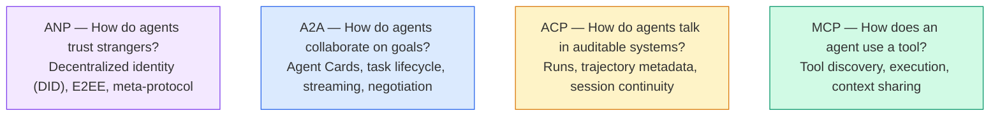

Это не конкуренты. Они решают разные проблемы на разных уровнях.

### MCP (напоминание)

MCP подробно рассматривается на этапе 13. Краткое напоминание: MCP стандартизирует, как LLM подключается к внешним инструментам и источникам данных. Это протокол по модели **клиент-сервер**, в котором агент (клиент) обнаруживает и вызывает инструменты, предоставляемые сервером.

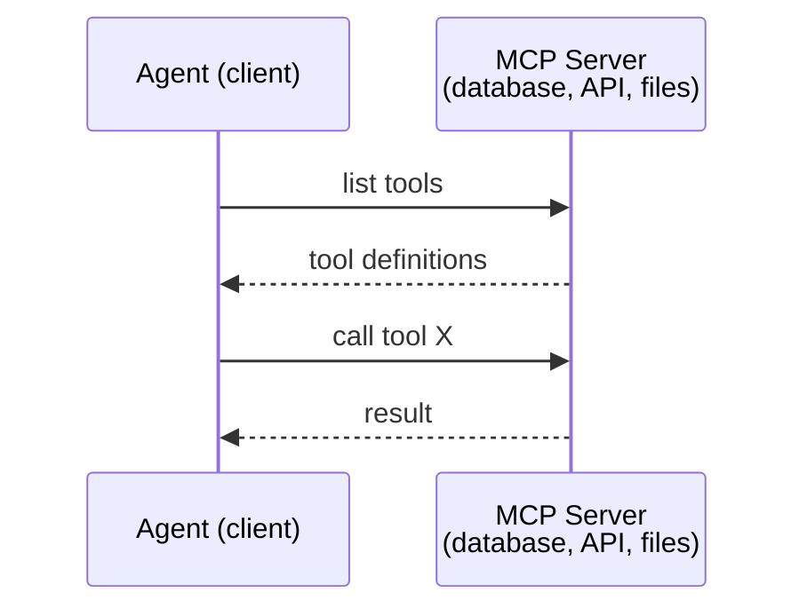

MCP — это взаимодействие **агент-инструмент**. Он не помогает агентам общаться друг с другом.

### A2A (Agent2Agent Protocol)

**Создан:** Google (сейчас под Linux Foundation как `lf.a2a.v1`)
**Версия спецификации:** 1.0.0
**Проблема:** Как автономные агенты сотрудничают, ведут переговоры и делегируют задачи друг другу?

A2A — это протокол для **одноранговой (peer-to-peer) кооперации агентов**. Если MCP соединяет агента с инструментами, то A2A соединяет агента с другими агентами. Каждый агент публикует **карточку агента (Agent Card)** по общеизвестному URL, а другие агенты обнаруживают его, ведут с ним переговоры и делегируют ему задачи.

#### Как работает A2A

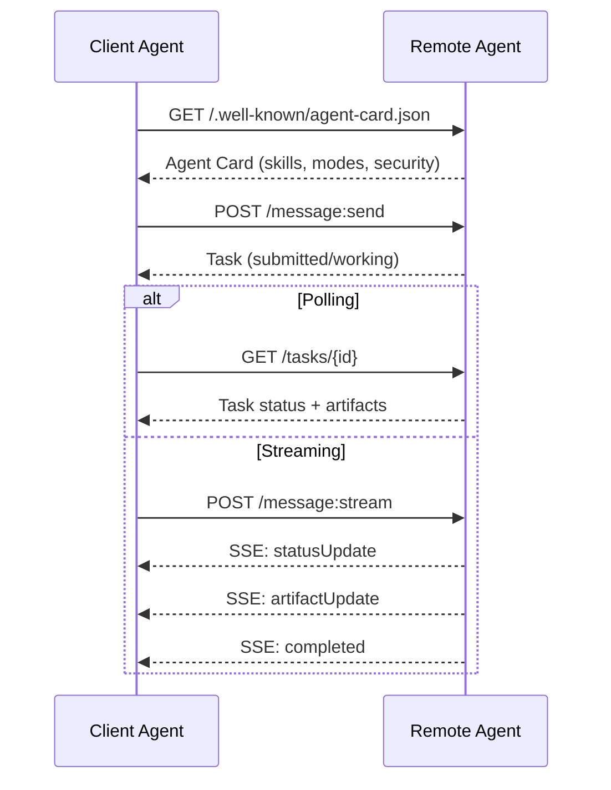

#### Настоящая карточка агента

Вот как в реальности выглядит карточка агента A2A. Отдаётся по `GET /.well-known/agent-card.json`:

```json
{
  "name": "Research Agent",
  "description": "Searches documentation and summarizes findings",
  "version": "1.0.0",
  "supportedInterfaces": [
    {
      "url": "https://research-agent.example.com/a2a/v1",
      "protocolBinding": "JSONRPC",
      "protocolVersion": "1.0"
    },
    {
      "url": "https://research-agent.example.com/a2a/rest",
      "protocolBinding": "HTTP+JSON",
      "protocolVersion": "1.0"
    }
  ],
  "provider": {
    "organization": "Your Company",
    "url": "https://example.com"
  },
  "capabilities": {
    "streaming": true,
    "pushNotifications": false
  },
  "defaultInputModes": ["text/plain", "application/json"],
  "defaultOutputModes": ["text/plain", "application/json"],
  "skills": [
    {
      "id": "web-research",
      "name": "Web Research",
      "description": "Searches the web and synthesizes findings",
      "tags": ["research", "search", "summarization"],
      "examples": ["Research the latest changes in React 19"]
    },
    {
      "id": "doc-analysis",
      "name": "Documentation Analysis",
      "description": "Reads and analyzes technical documentation",
      "tags": ["docs", "analysis"],
      "inputModes": ["text/plain", "application/pdf"],
      "outputModes": ["application/json"]
    }
  ],
  "securitySchemes": {
    "bearer": {
      "httpAuthSecurityScheme": {
        "scheme": "Bearer",
        "bearerFormat": "JWT"
      }
    }
  },
  "security": [{ "bearer": [] }]
}
```

На что стоит обратить внимание:
- **Навыки (Skills)** — это то, что агент умеет делать. У каждого навыка есть ID, теги и поддерживаемые MIME-типы ввода/вывода. Именно так агент-клиент решает, справится ли этот удалённый агент с его запросом.
- **supportedInterfaces** перечисляет несколько привязок протокола. Один агент может одновременно говорить на JSON-RPC, REST и gRPC.
- **Безопасность** встроена прямо в карточку. Клиент знает, какая авторизация ему нужна, ещё до первого запроса.

#### Жизненный цикл задачи

Задачи (tasks) — базовая единица работы в A2A. Они проходят через определённые состояния:

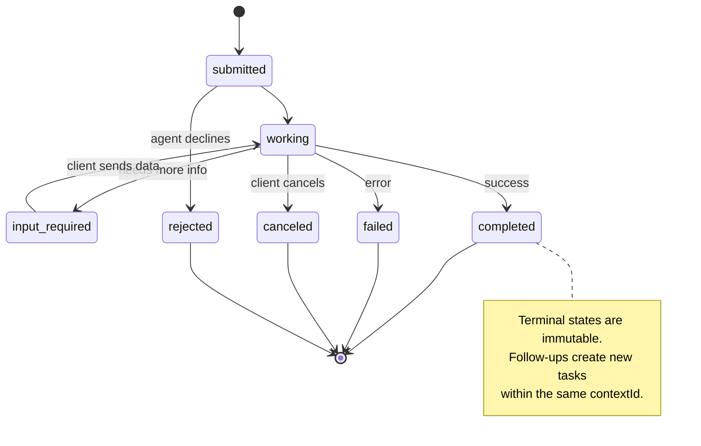

Все 8 состояний (спецификация также определяет `UNSPECIFIED` как сторожевое значение, здесь опущено):

| Состояние | Терминальное? | Значение |
|---|---|---|
| `TASK_STATE_SUBMITTED` | Нет | Принято, обработка ещё не началась |
| `TASK_STATE_WORKING` | Нет | Активно обрабатывается |
| `TASK_STATE_INPUT_REQUIRED` | Нет | Агенту нужна дополнительная информация от клиента |
| `TASK_STATE_AUTH_REQUIRED` | Нет | Требуется аутентификация |
| `TASK_STATE_COMPLETED` | Да | Успешно завершено |
| `TASK_STATE_FAILED` | Да | Завершено с ошибкой |
| `TASK_STATE_CANCELED` | Да | Отменено до завершения |
| `TASK_STATE_REJECTED` | Да | Агент отклонил задачу |

Как только задача достигает терминального состояния, она становится неизменяемой. Больше никаких сообщений. Последующие запросы создают новую задачу в рамках того же `contextId`.

#### Формат передачи данных

A2A использует JSON-RPC 2.0. Вот как выглядит реальный обмен сообщениями:

**Клиент отправляет задачу:**
```json
{
  "jsonrpc": "2.0",
  "id": 1,
  "method": "SendMessage",
  "params": {
    "message": {
      "messageId": "msg-001",
      "role": "ROLE_USER",
      "parts": [{ "text": "Research React 19 compiler features" }]
    },
    "configuration": {
      "acceptedOutputModes": ["text/plain", "application/json"],
      "historyLength": 10
    }
  }
}
```

**Агент отвечает задачей:**
```json
{
  "jsonrpc": "2.0",
  "id": 1,
  "result": {
    "task": {
      "id": "task-abc-123",
      "contextId": "ctx-xyz-789",
      "status": {
        "state": "TASK_STATE_COMPLETED",
        "timestamp": "2026-03-27T10:30:00Z"
      },
      "artifacts": [
        {
          "artifactId": "art-001",
          "name": "research-results",
          "parts": [{
            "data": {
              "findings": [
                "React 19 compiler auto-memoizes components",
                "No more manual useMemo/useCallback needed",
                "Compiler runs at build time, not runtime"
              ]
            },
            "mediaType": "application/json"
          }]
        }
      ]
    }
  }
}
```

**Стриминг через SSE:**
```text
POST /message:stream HTTP/1.1
Content-Type: application/json
A2A-Version: 1.0

data: {"task":{"id":"task-123","status":{"state":"TASK_STATE_WORKING"}}}

data: {"statusUpdate":{"taskId":"task-123","status":{"state":"TASK_STATE_WORKING","message":{"role":"ROLE_AGENT","parts":[{"text":"Searching documentation..."}]}}}}

data: {"artifactUpdate":{"taskId":"task-123","artifact":{"artifactId":"art-1","parts":[{"text":"partial findings..."}]},"append":true,"lastChunk":false}}

data: {"statusUpdate":{"taskId":"task-123","status":{"state":"TASK_STATE_COMPLETED"}}}
```

### ACP (Agent Communication Protocol)

**Создан:** IBM / BeeAI
**Версия спецификации:** 0.2.0 (OpenAPI 3.1.1)
**Статус:** Объединяется с A2A под эгидой Linux Foundation
**Проблема:** Как агентам взаимодействовать с полной аудируемостью, непрерывностью сессий и отслеживанием траектории?

ACP — это **корпоративный протокол**. Вопреки тому, что утверждают многие обзоры, ACP **не** использует JSON-LD. Это простой REST/JSON API, описанный через OpenAPI. Его особенность — **TrajectoryMetadata**: каждый ответ агента может нести детальный журнал шагов рассуждения и вызовов инструментов, которые к нему привели.

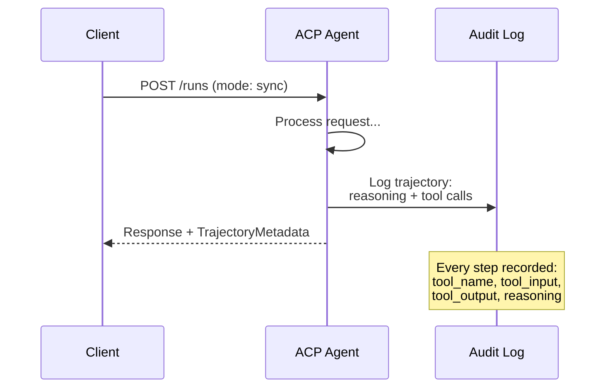

#### Обнаружение агентов в ACP

ACP определяет четыре способа обнаружения агентов:

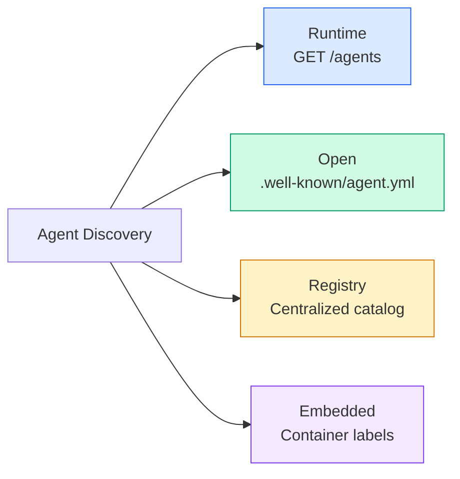

**AgentManifest** проще, чем карточка агента A2A:

```json
{
  "name": "summarizer",
  "description": "Summarizes documents with source citations",
  "input_content_types": ["text/plain", "application/pdf"],
  "output_content_types": ["text/plain", "application/json"],
  "metadata": {
    "tags": ["summarization", "RAG"],
    "framework": "BeeAI",
    "capabilities": [
      {
        "name": "Document Summarization",
        "description": "Condenses long documents into key points"
      }
    ],
    "recommended_models": ["llama3.3:70b-instruct-fp16"],
    "license": "Apache-2.0",
    "programming_language": "Python"
  }
}
```

#### Жизненный цикл прогона

ACP использует «прогоны» (Runs) вместо «задач» (Tasks). Прогон — это выполнение агента с тремя режимами:

| Режим | Поведение |
|---|---|
| `sync` | Блокирующий. Ответ содержит полный результат. |
| `async` | Немедленно возвращает 202. Опрашивайте `GET /runs/{id}` для получения статуса. |
| `stream` | SSE-поток. События поступают по мере работы агента. |

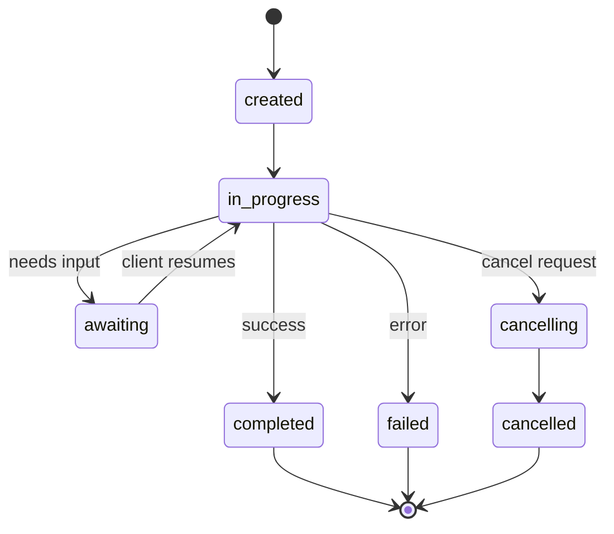

#### TrajectoryMetadata (журнал аудита)

Это ключевая отличительная черта ACP. Каждая часть сообщения может нести метаданные, показывающие, что именно сделал агент:

```json
{
  "role": "agent/researcher",
  "parts": [
    {
      "content_type": "text/plain",
      "content": "The weather in San Francisco is 72F and sunny.",
      "metadata": {
        "kind": "trajectory",
        "message": "I need to check the weather for this location",
        "tool_name": "weather_api",
        "tool_input": { "location": "San Francisco, CA" },
        "tool_output": { "temperature": 72, "condition": "sunny" }
      }
    }
  ]
}
```

Для регулируемых отраслей это золото. Каждый ответ сопровождается доказуемой цепочкой рассуждений: какие инструменты были вызваны, какие входные данные использовались, какие выходные данные получены. Никакого чёрного ящика.

ACP также поддерживает **CitationMetadata** для указания источников:

```json
{
  "kind": "citation",
  "start_index": 0,
  "end_index": 47,
  "url": "https://weather.gov/sf",
  "title": "NWS San Francisco Forecast"
}
```

### ANP (Agent Network Protocol)

**Создан:** открытым сообществом (основатель — GaoWei Chang)
**Репозиторий:** [github.com/agent-network-protocol/AgentNetworkProtocol](https://github.com/agent-network-protocol/AgentNetworkProtocol)
**Проблема:** Как агентам из разных организаций доверять друг другу без центрального органа?

ANP — это **протокол децентрализованной идентичности**. Он строит доверие на основе W3C Decentralized Identifiers (DID) и сквозного шифрования (E2EE). В отличие от A2A, где вы обнаруживаете агентов через известные конечные точки, ANP позволяет агентам криптографически доказывать свою идентичность.

У ANP три уровня:

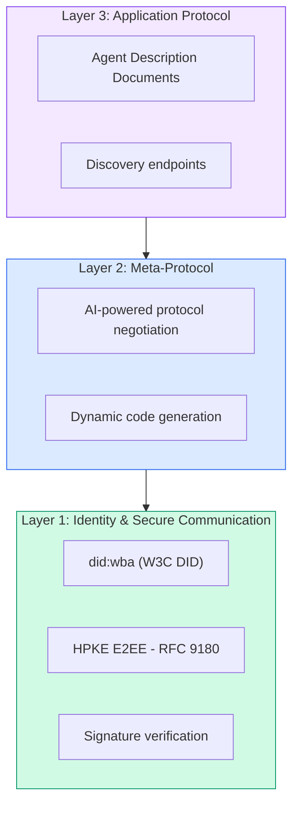

#### Документы DID (реальная структура)

ANP использует собственный метод DID под названием `did:wba` (Web-Based Agent). DID `did:wba:example.com:user:alice` разрешается в `https://example.com/user/alice/did.json`:

```json
{
  "@context": [
    "https://www.w3.org/ns/did/v1",
    "https://w3id.org/security/suites/jws-2020/v1",
    "https://w3id.org/security/suites/secp256k1-2019/v1"
  ],
  "id": "did:wba:example.com:user:alice",
  "verificationMethod": [
    {
      "id": "did:wba:example.com:user:alice#key-1",
      "type": "EcdsaSecp256k1VerificationKey2019",
      "controller": "did:wba:example.com:user:alice",
      "publicKeyJwk": {
        "crv": "secp256k1",
        "x": "NtngWpJUr-rlNNbs0u-Aa8e16OwSJu6UiFf0Rdo1oJ4",
        "y": "qN1jKupJlFsPFc1UkWinqljv4YE0mq_Ickwnjgasvmo",
        "kty": "EC"
      }
    },
    {
      "id": "did:wba:example.com:user:alice#key-x25519-1",
      "type": "X25519KeyAgreementKey2019",
      "controller": "did:wba:example.com:user:alice",
      "publicKeyMultibase": "z9hFgmPVfmBZwRvFEyniQDBkz9LmV7gDEqytWyGZLmDXE"
    }
  ],
  "authentication": [
    "did:wba:example.com:user:alice#key-1"
  ],
  "keyAgreement": [
    "did:wba:example.com:user:alice#key-x25519-1"
  ],
  "humanAuthorization": [
    "did:wba:example.com:user:alice#key-1"
  ],
  "service": [
    {
      "id": "did:wba:example.com:user:alice#agent-description",
      "type": "AgentDescription",
      "serviceEndpoint": "https://example.com/agents/alice/ad.json"
    }
  ]
}
```

На что стоит обратить внимание:
- **Разделение ключей** соблюдается строго. Ключи для подписи (secp256k1) отделены от ключей шифрования (X25519).
- **`humanAuthorization`** — уникальная особенность ANP. Эти ключи требуют явного одобрения человеком (биометрия, пароль, HSM) перед использованием. Операции повышенного риска, такие как перевод средств, проходят именно через этот путь.
- **`keyAgreement`**-ключи используются для сквозного шифрования HPKE (RFC 9180).
- Секция **service** ссылается на документ Agent Description.

#### Как работает доверие в ANP

ANP **не** использует сеть доверия (web of trust) или граф одобрений. Доверие двустороннее и проверяется при каждом взаимодействии:

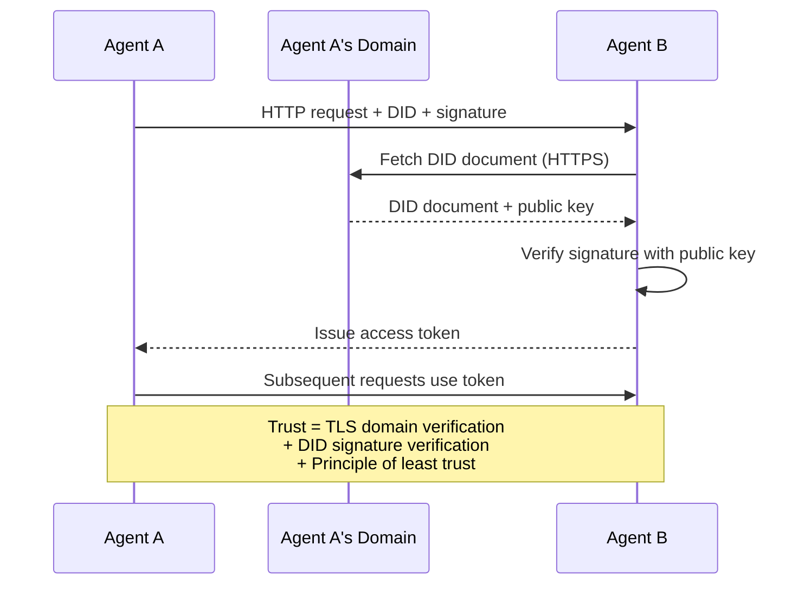

Доверие складывается из трёх источников:
1. **TLS на уровне домена** подтверждает хост документа DID
2. **Криптографические подписи DID** подтверждают идентичность агента
3. **Принцип минимального доверия** предоставляет только минимально необходимые права

Здесь нет распространения доверия по принципу «сарафанного радио» или PageRank-подобного скоринга. Вы проверяете каждого агента напрямую через его DID.

#### Согласование метапротокола

Это самая новаторская черта ANP. Когда встречаются два агента из разных экосистем, им не нужны заранее согласованные форматы данных. Они договариваются на естественном языке:

```json
{
  "action": "protocolNegotiation",
  "sequenceId": 0,
  "candidateProtocols": "I can communicate using:\n1. JSON-RPC with hotel booking schema\n2. REST with OpenAPI 3.1 spec\n3. Natural language over HTTP",
  "modificationSummary": "Initial proposal",
  "status": "negotiating"
}
```

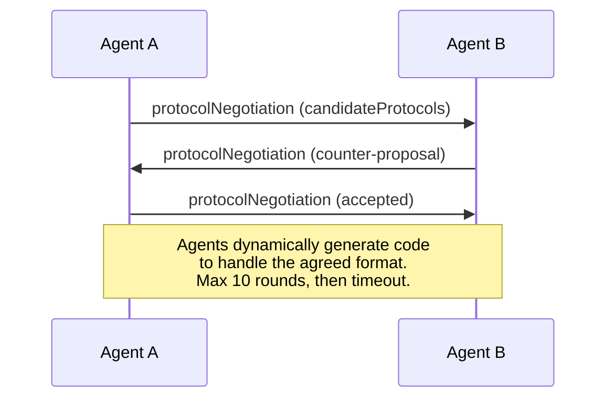

Агенты обмениваются предложениями туда-обратно (максимум 10 раундов), пока не согласуют формат, а затем динамически генерируют код для его обработки. Значения статуса: `negotiating`, `rejected`, `accepted`, `timeout`.

Это означает, что два агента, никогда прежде не встречавшихся, могут договориться о способе общения без того, чтобы кто-то заранее описал общую схему.

### Сравнение (уточнённое)

| | MCP | A2A | ACP | ANP |
|---|---|---|---|---|
| **Создан** | Anthropic | Google / Linux Foundation | IBM / BeeAI | Сообщество |
| **Формат спецификации** | JSON-RPC | JSON-RPC / REST / gRPC | OpenAPI 3.1 (REST) | JSON-RPC |
| **Основное назначение** | Агент → инструмент | Агент → агент | Агент → агент | Агент → агент |
| **Обнаружение** | Список инструментов | `/.well-known/agent-card.json` | `GET /agents`, `/.well-known/agent.yml` | `/.well-known/agent-descriptions`, конечные точки службы DID |
| **Идентичность** | Неявная (локальная) | Схемы безопасности (OAuth, mTLS) | На уровне сервера | W3C DID (`did:wba`) с E2EE |
| **Журнал аудита** | Н/д | Базовый (история задач) | TrajectoryMetadata (вызовы инструментов, рассуждения) | Формально не определён |
| **Машина состояний** | Н/д | 9 состояний задачи | 7 состояний прогона | Н/д |
| **Стриминг** | Н/д | SSE | SSE | Не зависит от транспорта |
| **Уникальная особенность** | Схемы инструментов | Карточки агентов + навыки | Журнал аудита траектории | Согласование метапротокола |
| **Лучше всего подходит для** | Инструментов и данных | Динамического взаимодействия | Регулируемых отраслей | Межорганизационного доверия |
| **Статус** | Стабилен | Стабилен (v1.0) | Объединяется с A2A | Активная разработка |

### Как они работают вместе

Эти протоколы не исключают друг друга. Реалистичная корпоративная система использует несколько сразу:

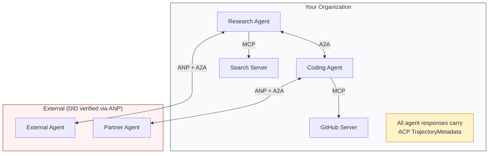

- **MCP** соединяет каждого агента с его инструментами
- **A2A** обеспечивает взаимодействие между агентами (внутри организации и вовне)
- **ACP** оборачивает ответы в метаданные траектории для обеспечения аудируемости
- **ANP** обеспечивает проверку идентичности для агентов, которые вам не подконтрольны

```figure
swarm-message-bus
```

## Реализация

### Шаг 1: базовые типы сообщений

Любая мультиагентная система начинается с формата сообщений. Определим типы, соответствующие тому, что используют реальные протоколы:

```typescript
import crypto from "node:crypto";

type MessageRole = "user" | "agent";

type MessagePart =
  | { kind: "text"; text: string }
  | { kind: "data"; data: unknown; mediaType: string }
  | { kind: "file"; name: string; url: string; mediaType: string };

type TrajectoryEntry = {
  reasoning: string;
  toolName?: string;
  toolInput?: unknown;
  toolOutput?: unknown;
  timestamp: number;
};

type AgentMessage = {
  id: string;
  role: MessageRole;
  parts: MessagePart[];
  trajectory?: TrajectoryEntry[];
  replyTo?: string;
  timestamp: number;
};

function createMessage(
  role: MessageRole,
  parts: MessagePart[],
  replyTo?: string
): AgentMessage {
  return {
    id: crypto.randomUUID(),
    role,
    parts,
    replyTo,
    timestamp: Date.now(),
  };
}

function textMessage(role: MessageRole, text: string): AgentMessage {
  return createMessage(role, [{ kind: "text", text }]);
}
```

Обратите внимание: `MessagePart` мультимодален (текст, структурированные данные, файлы) — точно так же, как в реальных спецификациях A2A и ACP. `TrajectoryEntry` фиксирует цепочку рассуждений, повторяя TrajectoryMetadata из ACP.

### Шаг 2: карточка агента A2A и реестр

Построим механизм обнаружения агентов, соответствующий реальной спецификации A2A:

```typescript
type Skill = {
  id: string;
  name: string;
  description: string;
  tags: string[];
  inputModes: string[];
  outputModes: string[];
};

type AgentCard = {
  name: string;
  description: string;
  version: string;
  url: string;
  capabilities: {
    streaming: boolean;
    pushNotifications: boolean;
  };
  defaultInputModes: string[];
  defaultOutputModes: string[];
  skills: Skill[];
};

class AgentRegistry {
  private cards: Map<string, AgentCard> = new Map();

  register(card: AgentCard) {
    this.cards.set(card.name, card);
  }

  discoverBySkillTag(tag: string): AgentCard[] {
    return [...this.cards.values()].filter((card) =>
      card.skills.some((skill) => skill.tags.includes(tag))
    );
  }

  discoverByInputMode(mimeType: string): AgentCard[] {
    return [...this.cards.values()].filter(
      (card) =>
        card.defaultInputModes.includes(mimeType) ||
        card.skills.some((skill) => skill.inputModes.includes(mimeType))
    );
  }

  resolve(name: string): AgentCard | undefined {
    return this.cards.get(name);
  }

  listAll(): AgentCard[] {
    return [...this.cards.values()];
  }
}
```

Это существенно богаче, чем простая карта «имя → возможности». Вы можете обнаруживать агентов по тегам навыков, по MIME-типам ввода или по имени — точно так же, как это позволяет реальная спецификация A2A.

### Шаг 3: жизненный цикл задачи A2A

Построим полную машину состояний задачи:

```typescript
type TaskState =
  | "submitted"
  | "working"
  | "input-required"
  | "auth-required"
  | "completed"
  | "failed"
  | "canceled"
  | "rejected";

const TERMINAL_STATES: TaskState[] = [
  "completed",
  "failed",
  "canceled",
  "rejected",
];

type TaskStatus = {
  state: TaskState;
  message?: AgentMessage;
  timestamp: number;
};

type Artifact = {
  id: string;
  name: string;
  parts: MessagePart[];
};

type Task = {
  id: string;
  contextId: string;
  status: TaskStatus;
  artifacts: Artifact[];
  history: AgentMessage[];
};

type TaskEvent =
  | { kind: "statusUpdate"; taskId: string; status: TaskStatus }
  | {
      kind: "artifactUpdate";
      taskId: string;
      artifact: Artifact;
      append: boolean;
      lastChunk: boolean;
    };

type TaskHandler = (
  task: Task,
  message: AgentMessage
) => AsyncGenerator<TaskEvent>;

class TaskManager {
  private tasks: Map<string, Task> = new Map();
  private handlers: Map<string, TaskHandler> = new Map();
  private listeners: Map<string, ((event: TaskEvent) => void)[]> = new Map();

  registerHandler(agentName: string, handler: TaskHandler) {
    this.handlers.set(agentName, handler);
  }

  subscribe(taskId: string, listener: (event: TaskEvent) => void) {
    const existing = this.listeners.get(taskId) ?? [];
    existing.push(listener);
    this.listeners.set(taskId, existing);
  }

  async sendMessage(
    agentName: string,
    message: AgentMessage,
    contextId?: string
  ): Promise<Task> {
    const handler = this.handlers.get(agentName);
    if (!handler) {
      const task = this.createTask(contextId);
      task.status = {
        state: "rejected",
        timestamp: Date.now(),
        message: textMessage("agent", `No handler for ${agentName}`),
      };
      return task;
    }

    const task = this.createTask(contextId);
    task.history.push(message);
    task.status = { state: "submitted", timestamp: Date.now() };

    this.processTask(task, handler, message).catch((err) => {
      task.status = {
        state: "failed",
        timestamp: Date.now(),
        message: textMessage("agent", String(err)),
      };
    });
    return task;
  }

  getTask(taskId: string): Task | undefined {
    return this.tasks.get(taskId);
  }

  cancelTask(taskId: string): boolean {
    const task = this.tasks.get(taskId);
    if (!task || TERMINAL_STATES.includes(task.status.state)) return false;
    task.status = { state: "canceled", timestamp: Date.now() };
    this.emit(taskId, {
      kind: "statusUpdate",
      taskId,
      status: task.status,
    });
    return true;
  }

  private createTask(contextId?: string): Task {
    const task: Task = {
      id: crypto.randomUUID(),
      contextId: contextId ?? crypto.randomUUID(),
      status: { state: "submitted", timestamp: Date.now() },
      artifacts: [],
      history: [],
    };
    this.tasks.set(task.id, task);
    return task;
  }

  private async processTask(
    task: Task,
    handler: TaskHandler,
    message: AgentMessage
  ) {
    task.status = { state: "working", timestamp: Date.now() };
    this.emit(task.id, {
      kind: "statusUpdate",
      taskId: task.id,
      status: task.status,
    });

    try {
      for await (const event of handler(task, message)) {
        if (TERMINAL_STATES.includes(task.status.state)) break;

        if (event.kind === "statusUpdate") {
          task.status = event.status;
        }
        if (event.kind === "artifactUpdate") {
          const existing = task.artifacts.find(
            (a) => a.id === event.artifact.id
          );
          if (existing && event.append) {
            existing.parts.push(...event.artifact.parts);
          } else {
            task.artifacts.push(event.artifact);
          }
        }
        this.emit(task.id, event);
      }
    } catch (err) {
      task.status = {
        state: "failed",
        timestamp: Date.now(),
        message: textMessage("agent", String(err)),
      };
      this.emit(task.id, {
        kind: "statusUpdate",
        taskId: task.id,
        status: task.status,
      });
    }
  }

  private emit(taskId: string, event: TaskEvent) {
    for (const listener of this.listeners.get(taskId) ?? []) {
      listener(event);
    }
  }
}
```

Это реализует реальный жизненный цикл задачи A2A: submitted, working, input-required, терминальные состояния. Обработчики — это асинхронные генераторы, которые выдают события (обновления статуса и фрагменты артефактов), что соответствует модели стриминга SSE.

### Шаг 4: журнал аудита в стиле ACP

Обернём взаимодействие отслеживанием траектории:

```typescript
type AuditEntry = {
  runId: string;
  agentName: string;
  input: AgentMessage[];
  output: AgentMessage[];
  trajectory: TrajectoryEntry[];
  status: "created" | "in-progress" | "completed" | "failed" | "awaiting";
  startedAt: number;
  completedAt?: number;
  sessionId?: string;
};

class AuditableRunner {
  private log: AuditEntry[] = [];
  private handlers: Map<
    string,
    (input: AgentMessage[]) => Promise<{
      output: AgentMessage[];
      trajectory: TrajectoryEntry[];
    }>
  > = new Map();

  registerAgent(
    name: string,
    handler: (input: AgentMessage[]) => Promise<{
      output: AgentMessage[];
      trajectory: TrajectoryEntry[];
    }>
  ) {
    this.handlers.set(name, handler);
  }

  async run(
    agentName: string,
    input: AgentMessage[],
    sessionId?: string
  ): Promise<AuditEntry> {
    const entry: AuditEntry = {
      runId: crypto.randomUUID(),
      agentName,
      input: structuredClone(input),
      output: [],
      trajectory: [],
      status: "created",
      startedAt: Date.now(),
      sessionId,
    };
    this.log.push(entry);

    const handler = this.handlers.get(agentName);
    if (!handler) {
      entry.status = "failed";
      return entry;
    }

    entry.status = "in-progress";
    try {
      const result = await handler(input);
      entry.output = structuredClone(result.output);
      entry.trajectory = structuredClone(result.trajectory);
      entry.status = "completed";
      entry.completedAt = Date.now();
    } catch (err) {
      entry.status = "failed";
      entry.trajectory.push({
        reasoning: `Error: ${String(err)}`,
        timestamp: Date.now(),
      });
      entry.completedAt = Date.now();
    }
    return entry;
  }

  getFullAuditLog(): AuditEntry[] {
    return structuredClone(this.log);
  }

  getAuditLogForAgent(agentName: string): AuditEntry[] {
    return structuredClone(
      this.log.filter((e) => e.agentName === agentName)
    );
  }

  getAuditLogForSession(sessionId: string): AuditEntry[] {
    return structuredClone(
      this.log.filter((e) => e.sessionId === sessionId)
    );
  }

  getTrajectoryForRun(runId: string): TrajectoryEntry[] {
    const entry = this.log.find((e) => e.runId === runId);
    return entry ? structuredClone(entry.trajectory) : [];
  }
}
```

Каждое выполнение агента порождает полную запись аудита: что поступило на вход, что получилось на выходе, и полную траекторию вызовов инструментов и шагов рассуждений между ними. Вы можете запрашивать её по агенту, по сессии или по отдельному прогону.

### Шаг 5: проверка идентичности в стиле ANP

Построим идентификацию и проверку на основе DID:

```typescript
type VerificationMethod = {
  id: string;
  type: string;
  controller: string;
  publicKeyDer: string;
};

type DIDDocument = {
  id: string;
  verificationMethod: VerificationMethod[];
  authentication: string[];
  keyAgreement: string[];
  humanAuthorization: string[];
  service: { id: string; type: string; serviceEndpoint: string }[];
};

type AgentIdentity = {
  did: string;
  document: DIDDocument;
  privateKey: crypto.KeyObject;
  publicKey: crypto.KeyObject;
};

class IdentityRegistry {
  private documents: Map<string, DIDDocument> = new Map();

  publish(doc: DIDDocument) {
    this.documents.set(doc.id, doc);
  }

  resolve(did: string): DIDDocument | undefined {
    return this.documents.get(did);
  }

  verify(did: string, signature: string, payload: string): boolean {
    const doc = this.documents.get(did);
    if (!doc) return false;

    const authKeyIds = doc.authentication;
    const authKeys = doc.verificationMethod.filter((vm) =>
      authKeyIds.includes(vm.id)
    );

    for (const key of authKeys) {
      const publicKey = crypto.createPublicKey({
        key: Buffer.from(key.publicKeyDer, "base64"),
        format: "der",
        type: "spki",
      });
      const isValid = crypto.verify(
        null,
        Buffer.from(payload),
        publicKey,
        Buffer.from(signature, "hex")
      );
      if (isValid) return true;
    }
    return false;
  }

  requiresHumanAuth(did: string, operationKeyId: string): boolean {
    const doc = this.documents.get(did);
    if (!doc) return false;
    return doc.humanAuthorization.includes(operationKeyId);
  }
}

function createIdentity(domain: string, agentName: string): AgentIdentity {
  const did = `did:wba:${domain}:agent:${agentName}`;
  const { publicKey, privateKey } = crypto.generateKeyPairSync("ed25519");

  const publicKeyDer = publicKey
    .export({ format: "der", type: "spki" })
    .toString("base64");

  const keyId = `${did}#key-1`;
  const encKeyId = `${did}#key-x25519-1`;

  const document: DIDDocument = {
    id: did,
    verificationMethod: [
      {
        id: keyId,
        type: "Ed25519VerificationKey2020",
        controller: did,
        publicKeyDer,
      },
      {
        id: encKeyId,
        type: "X25519KeyAgreementKey2019",
        controller: did,
        publicKeyDer,
      },
    ],
    authentication: [keyId],
    keyAgreement: [encKeyId],
    humanAuthorization: [],
    service: [
      {
        id: `${did}#agent-description`,
        type: "AgentDescription",
        serviceEndpoint: `https://${domain}/agents/${agentName}/ad.json`,
      },
    ],
  };

  return { did, document, privateKey, publicKey };
}

function signPayload(identity: AgentIdentity, payload: string): string {
  return crypto
    .sign(null, Buffer.from(payload), identity.privateKey)
    .toString("hex");
}
```

Это повторяет реальную модель идентичности ANP: у агентов есть документы DID с отдельными ключами для аутентификации, согласования ключей и человеческого одобрения. `IdentityRegistry` имитирует разрешение DID (в продакшене это были бы HTTP-запросы к домену агента).

### Шаг 6: шлюз протоколов

Соединим все четыре протокола в единой системе:

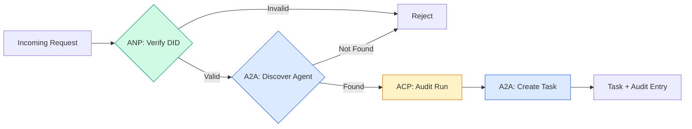

```typescript
class ProtocolGateway {
  private registry: AgentRegistry;
  private taskManager: TaskManager;
  private auditRunner: AuditableRunner;
  private identityRegistry: IdentityRegistry;

  constructor(
    registry: AgentRegistry,
    taskManager: TaskManager,
    auditRunner: AuditableRunner,
    identityRegistry: IdentityRegistry
  ) {
    this.registry = registry;
    this.taskManager = taskManager;
    this.auditRunner = auditRunner;
    this.identityRegistry = identityRegistry;
  }

  async delegateTask(
    fromDid: string,
    signature: string,
    targetAgent: string,
    message: AgentMessage,
    sessionId?: string
  ): Promise<{ task: Task; audit: AuditEntry } | { error: string }> {
    if (!this.identityRegistry.verify(fromDid, signature, message.id)) {
      return { error: "Identity verification failed" };
    }

    const card = this.registry.resolve(targetAgent);
    if (!card) {
      return { error: `Agent ${targetAgent} not found in registry` };
    }

    const audit = await this.auditRunner.run(
      targetAgent,
      [message],
      sessionId
    );
    const task = await this.taskManager.sendMessage(targetAgent, message);

    return { task, audit };
  }

  discoverAndDelegate(
    fromDid: string,
    signature: string,
    skillTag: string,
    message: AgentMessage
  ): Promise<{ task: Task; audit: AuditEntry } | { error: string }> {
    const candidates = this.registry.discoverBySkillTag(skillTag);
    if (candidates.length === 0) {
      return Promise.resolve({
        error: `No agents found with skill tag: ${skillTag}`,
      });
    }
    return this.delegateTask(
      fromDid,
      signature,
      candidates[0].name,
      message
    );
  }
}
```

Шлюз делает четыре вещи за один вызов:
1. **ANP**: проверяет идентичность вызывающего через подпись DID
2. **A2A**: обнаруживает целевого агента и проверяет его возможности
3. **ACP**: оборачивает выполнение в журнал аудита с траекторией
4. **A2A**: создаёт задачу с полным отслеживанием жизненного цикла

### Шаг 7: соединяем всё вместе

```typescript
async function protocolDemo() {
  const registry = new AgentRegistry();
  registry.register({
    name: "researcher",
    description: "Searches and summarizes findings",
    version: "1.0.0",
    url: "https://researcher.local/a2a/v1",
    capabilities: { streaming: true, pushNotifications: false },
    defaultInputModes: ["text/plain"],
    defaultOutputModes: ["text/plain", "application/json"],
    skills: [
      {
        id: "web-research",
        name: "Web Research",
        description: "Searches the web",
        tags: ["research", "search", "summarization"],
        inputModes: ["text/plain"],
        outputModes: ["application/json"],
      },
    ],
  });
  registry.register({
    name: "coder",
    description: "Writes code from specs",
    version: "1.0.0",
    url: "https://coder.local/a2a/v1",
    capabilities: { streaming: false, pushNotifications: false },
    defaultInputModes: ["text/plain", "application/json"],
    defaultOutputModes: ["text/plain"],
    skills: [
      {
        id: "code-gen",
        name: "Code Generation",
        description: "Generates code",
        tags: ["coding", "generation"],
        inputModes: ["text/plain", "application/json"],
        outputModes: ["text/plain"],
      },
    ],
  });

  const taskManager = new TaskManager();
  const auditRunner = new AuditableRunner();

  const researchTrajectory: TrajectoryEntry[] = [];

  taskManager.registerHandler(
    "researcher",
    async function* (task, message) {
      yield {
        kind: "statusUpdate" as const,
        taskId: task.id,
        status: { state: "working" as const, timestamp: Date.now() },
      };

      researchTrajectory.push({
        reasoning: "Searching for React 19 documentation",
        toolName: "web_search",
        toolInput: { query: "React 19 compiler features" },
        toolOutput: {
          results: ["react.dev/blog/react-19", "github.com/react/react"],
        },
        timestamp: Date.now(),
      });

      researchTrajectory.push({
        reasoning: "Extracting key findings from search results",
        toolName: "doc_analysis",
        toolInput: { url: "react.dev/blog/react-19" },
        toolOutput: {
          summary:
            "React 19 compiler auto-memoizes, no manual useMemo needed",
        },
        timestamp: Date.now(),
      });

      yield {
        kind: "artifactUpdate" as const,
        taskId: task.id,
        artifact: {
          id: crypto.randomUUID(),
          name: "research-results",
          parts: [
            {
              kind: "data" as const,
              data: {
                findings: [
                  "React 19 compiler auto-memoizes components",
                  "No more manual useMemo/useCallback needed",
                  "Compiler runs at build time, not runtime",
                ],
                sources: ["react.dev/blog/react-19"],
              },
              mediaType: "application/json",
            },
          ],
        },
        append: false,
        lastChunk: true,
      };

      yield {
        kind: "statusUpdate" as const,
        taskId: task.id,
        status: { state: "completed" as const, timestamp: Date.now() },
      };
    }
  );

  auditRunner.registerAgent("researcher", async () => ({
    output: [
      textMessage("agent", "React 19 compiler auto-memoizes components"),
    ],
    trajectory: researchTrajectory,
  }));

  const identityRegistry = new IdentityRegistry();

  const coderIdentity = createIdentity("coder.local", "coder");
  const researcherIdentity = createIdentity("researcher.local", "researcher");

  identityRegistry.publish(coderIdentity.document);
  identityRegistry.publish(researcherIdentity.document);

  const gateway = new ProtocolGateway(
    registry,
    taskManager,
    auditRunner,
    identityRegistry
  );

  console.log("=== Protocol Demo ===\n");

  console.log("1. Agent Discovery (A2A)");
  const researchAgents = registry.discoverBySkillTag("research");
  console.log(
    `   Found ${researchAgents.length} agent(s):`,
    researchAgents.map((a) => a.name)
  );

  console.log("\n2. Identity Verification (ANP)");
  const message = textMessage("user", "Research React 19 compiler features");
  const signature = signPayload(coderIdentity, message.id);
  const verified = identityRegistry.verify(
    coderIdentity.did,
    signature,
    message.id
  );
  console.log(`   Coder DID: ${coderIdentity.did}`);
  console.log(`   Signature verified: ${verified}`);

  console.log("\n3. Task Delegation (A2A + ACP + ANP)");
  const result = await gateway.delegateTask(
    coderIdentity.did,
    signature,
    "researcher",
    message,
    "session-001"
  );

  if ("error" in result) {
    console.log(`   Error: ${result.error}`);
    return;
  }

  console.log(`   Task ID: ${result.task.id}`);
  console.log(`   Task state: ${result.task.status.state}`);
  console.log(`   Artifacts: ${result.task.artifacts.length}`);

  console.log("\n4. Audit Trail (ACP)");
  console.log(`   Run ID: ${result.audit.runId}`);
  console.log(`   Status: ${result.audit.status}`);
  console.log(`   Trajectory steps: ${result.audit.trajectory.length}`);
  for (const step of result.audit.trajectory) {
    console.log(`     - ${step.reasoning}`);
    if (step.toolName) {
      console.log(`       Tool: ${step.toolName}`);
    }
  }

  console.log("\n5. Full Audit Log");
  const fullLog = auditRunner.getFullAuditLog();
  console.log(`   Total runs: ${fullLog.length}`);
  for (const entry of fullLog) {
    const duration = entry.completedAt
      ? `${entry.completedAt - entry.startedAt}ms`
      : "in-progress";
    console.log(`   ${entry.agentName}: ${entry.status} (${duration})`);
  }
}

protocolDemo().catch((err) => {
  console.error("Protocol demo failed:", err);
  process.exitCode = 1;
});
```

## Что идёт не так

Протоколы решают задачу для счастливого пути. Вот что ломается в продакшене:

**Дрейф схемы.** Агент A публикует карточку агента, объявляющую вывод `application/json`. Но JSON-схема меняется между версиями. Агент B парсит старый формат и получает мусор. Решение: версионируйте свои навыки и схемы вывода. Спецификация A2A не зря поддерживает поле `version` в карточках агентов.

**Нарушения машины состояний.** Обработчик агента выдаёт событие `completed`, а затем пытается выдать ещё артефакты. Задача неизменяема. Ваш код либо молча отбрасывает обновления, либо выбрасывает исключение. Решение: проверяйте терминальное состояние перед выдачей события. Реализация `TaskManager` выше принудительно следит за этим через `break` после терминальных состояний.

**Сбои разрешения доверия.** Агент A пытается проверить DID агента B, но домен агента B недоступен. Документ DID невозможно получить. Открывать доступ (принимать непроверенных агентов) или закрывать (отклонять всё)? ANP рекомендует закрывать доступ, следуя принципу минимального доверия.

**Раздувание траектории.** Журналирование траектории в ACP — мощный, но дорогой механизм. Сложный агент, делающий 200 вызовов инструментов за один прогон, порождает огромные записи аудита. Решение: журналируйте траекторию с настраиваемым уровнем детализации. Записывайте имена инструментов и вход/выход для соответствия требованиям, пропускайте шаги рассуждений для нерегулируемых нагрузок.

**«Громовое стадо» при обнаружении.** 50 агентов одновременно запрашивают `GET /agents` при старте. Решение: кешируйте карточки агентов с TTL, разносите интервалы обнаружения по времени или используйте регистрацию по инициативе сервера вместо опроса.

## Применение

### Реальные реализации

**A2A** — самый зрелый протокол. [Официальная спецификация](https://github.com/google/A2A) Google открыта и развивается под Linux Foundation. Есть SDK для Python и TypeScript. Если вашим агентам нужны динамическое обнаружение и взаимодействие — начните отсюда.

**ACP** объединяется с A2A. Проект [BeeAI](https://github.com/i-am-bee/acp) от IBM создал ACP как REST-ориентированную альтернативу, но концепция метаданных траектории поглощается экосистемой A2A. Используйте паттерны ACP (журналирование траектории, жизненный цикл прогона), даже если в качестве транспорта вы используете A2A.

**ANP** — самый экспериментальный протокол. В [репозитории сообщества](https://github.com/agent-network-protocol/AgentNetworkProtocol) есть SDK на Python (AgentConnect). Концепция согласования метапротокола действительно нова. Стоит следить за ней для межорганизационных развёртываний агентов.

**MCP** уже рассмотрен на этапе 13. Если вы хотите, чтобы агенты использовали инструменты, MCP — это стандарт.

### Выбор подходящего протокола

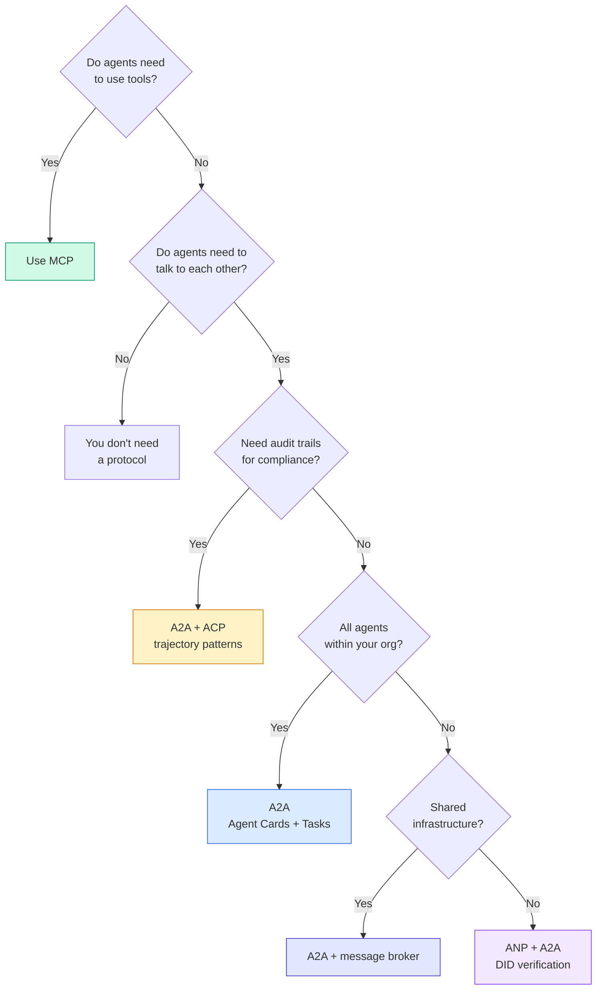

## Поставка

Этот урок производит:
- `code/main.ts` — полная реализация всех четырёх паттернов протоколов
- `outputs/prompt-protocol-selector.md` — промпт, который помогает выбрать протоколы для вашей системы

## Упражнения

1. **Многошаговое делегирование задач.** Расширьте `TaskManager` так, чтобы обработчик агента мог делегировать подзадачи другим агентам. Исследователь получает задачу, делегирует подзадачи «поиск» и «сводка» двум специализированным агентам, дожидается завершения обеих, а затем объединяет результаты в собственные артефакты.

2. **Потоковый журнал аудита.** Измените `AuditableRunner` так, чтобы поддерживать потоковый режим. Вместо ожидания полного результата выдавайте обновления `AuditEntry` в реальном времени по мере добавления записей траектории. Используйте асинхронный генератор, выдающий снимки состояния аудита.

3. **Ротация DID.** Добавьте ротацию ключей в `IdentityRegistry`. Агент должен иметь возможность опубликовать новый документ DID с обновлёнными ключами, сохранив ссылку `previousDid`. Верификаторы должны принимать подписи как текущим, так и предыдущим ключом в течение льготного периода.

4. **Согласование протокола.** Реализуйте концепцию метапротокола ANP. Два агента обмениваются сообщениями `protocolNegotiation` с кандидатными форматами (например, «Я умею JSON-RPC» против «Я предпочитаю REST»). После максимум 3 раундов они либо соглашаются на формат, либо получают таймаут. Согласованный формат определяет, какой `TaskManager` или `AuditableRunner` они будут использовать.

5. **Обнаружение с ограничением частоты.** Добавьте обёртку `RateLimitedRegistry`, кеширующую поиск карточек агентов с настраиваемым TTL и ограничивающую количество запросов обнаружения на агента в секунду. Смоделируйте «громовое стадо» из 100 агентов, обнаруживающих друг друга при старте, и измерьте разницу.

## Ключевые термины

| Термин | Что говорят люди | Что это на самом деле означает |
|------|----------------|----------------------|
| MCP | «Протокол для инструментов ИИ» | Протокол клиент-сервер, позволяющий агентам обнаруживать и использовать инструменты. Агент-инструмент, а не агент-агент. |
| A2A | «Протокол агентов от Google» | Одноранговый протокол для взаимодействия агентов под эгидой Linux Foundation. Обнаружение через карточки агентов, жизненный цикл задачи из 9 состояний, стриминг через SSE. Поддерживает привязки JSON-RPC, REST и gRPC. |
| ACP | «Корпоративный обмен сообщениями между агентами» | REST API от IBM/BeeAI для прогонов агентов с TrajectoryMetadata: каждый ответ несёт полную цепочку рассуждений и вызовов инструментов. Объединяется с A2A. |
| ANP | «Децентрализованная идентичность агентов» | Протокол сообщества, использующий `did:wba` (DID) для криптографической идентичности, HPKE для сквозного шифрования и согласование метапротокола на базе ИИ для агентов, никогда прежде не встречавшихся. |
| Agent Card | «Визитная карточка агента» | JSON-документ по адресу `/.well-known/agent-card.json`, описывающий навыки, поддерживаемые MIME-типы, схемы безопасности и привязки протокола. |
| DID | «Децентрализованный ID» | Стандарт W3C для криптографически проверяемых идентичностей, размещённых на собственном домене агента. ANP использует метод `did:wba`. |
| TrajectoryMetadata | «Квитанция аудита» | Механизм ACP для прикрепления шагов рассуждений, вызовов инструментов и их входов/выходов к каждому ответу агента. |
| Meta-protocol | «Агенты договариваются, как общаться» | Подход ANP, при котором агенты используют естественный язык, чтобы динамически согласовать форматы данных, а затем генерируют код для их обработки. |
| Task | «Единица работы» | Объект A2A с состоянием, отслеживающий работу от подачи до завершения. Неизменяем после достижения терминального состояния. |

## Дополнительное чтение

- [Спецификация Google A2A](https://github.com/google/A2A) -- официальная спецификация и SDK (v1.0.0, Linux Foundation)
- [Спецификация IBM/BeeAI ACP](https://github.com/i-am-bee/acp) -- спецификация OpenAPI 3.1 для прогонов агентов и метаданных траектории
- [Agent Network Protocol](https://github.com/agent-network-protocol/AgentNetworkProtocol) -- идентичность на основе DID, E2EE, согласование метапротокола
- [Документация Model Context Protocol](https://modelcontextprotocol.io/) -- спецификация MCP от Anthropic (рассмотрена на этапе 13)
- [W3C Decentralized Identifiers](https://www.w3.org/TR/did-core/) -- стандарт идентичности, лежащий в основе ANP
- [RFC 9180 (HPKE)](https://www.rfc-editor.org/rfc/rfc9180) -- схема шифрования, которую ANP использует для E2EE
- [FIPA Agent Communication Language](http://www.fipa.org/specs/fipa00061/SC00061G.html) -- академический предшественник современных протоколов взаимодействия агентов
