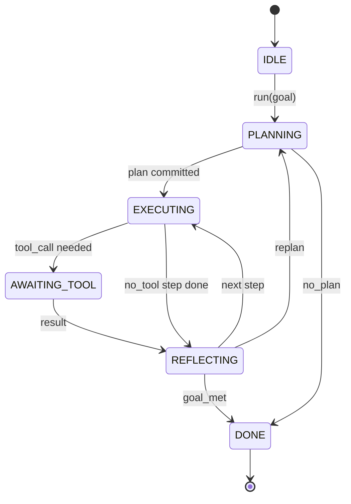

# Контракт цикла харнесса агента

> Харнесс — это и есть агент. Модель — сопроцессор. Этот урок фиксирует контракт цикла, в который можно подключить любую модель.

**Тип:** Build**Языки:** Python**Предварительные требования:** Фаза 13 уроки 01-07, Фаза 14 урок 01**Время:** ~90 минут
## Цели обучения
- Специфицируйте цикл харнесса агента как детерминированный конечный автомат (state machine) с явными переходами.
- Реализуйте десять тем хуков жизненного цикла, в которые операторы встраивают политику, телеметрию и защитные ограничения (guardrails).
- Определите две точки вытягивания (pull points), в которых цикл отдаёт управление вызывающей стороне и возобновляется на новом входе.
- Обеспечивайте соблюдение бюджетов на сессию (ходы, вызовы инструментов, фактическое время (wall-clock)), не допуская утечки частичного состояния при превышении.
- Испускайте типизированный поток из одиннадцати типов событий, чтобы нижестоящие UI и трассировщики могли подписываться, не заглядывая напрямую в цикл.

```figure
cf-loop-contract
```

## Общая картина

Агент для написания кода, который работает без присмотра сорок ходов подряд, — это не чат-цикл. Это конечный автомат (state machine), узлы которого оператор может перехватывать, а рёбра — аудировать. Как только контракт зафиксирован на бумаге, замена моделей, инструментов или политик перестаёт быть рефакторингом. Она становится вызовом регистрации.

Этот урок строит именно такой контракт. Мы называем шесть состояний, десять тем хуков, две точки вытягивания, одиннадцать типов событий и одну бюджетную оболочку. Всё остальное в харнессе (реестр инструментов, транспорт JSON-RPC, диспетчер, планировщик) подключается к этой форме.

## Состояния

У цикла шесть состояний. Пять активных. Одно терминальное.



`IDLE` — единственная допустимая точка входа. `DONE` — единственный допустимый выход. `AWAITING_TOOL` — единственное состояние, которое даёт точку вытягивания. Все остальные переходы — внутренние.

Конечный автомат детерминирован. При одном и том же журнале событий харнесс заново приходит в то же самое состояние. Именно это свойство позволяет воспроизводить (replay) сессии для отладки, не вызывая модель повторно.

## Темы хуков

Хуки — это шов, через который оператор встраивается в цикл. Харнесс генерирует десять тем. Каждая тема принимает любое число подписчиков. Подписчики срабатывают в порядке регистрации. Подписчик может изменить полезную нагрузку (payload), вызвать исключение, чтобы прервать ход, или вернуть специальное значение (sentinel), чтобы пропустить следующий шаг.

```text
before_plan         after_plan
before_tool_call    after_tool_call
before_step         after_step
on_error
on_pause
on_budget_exceeded
on_complete
```

Эта форма повторяет то, к чему независимо пришли Claude Code, Cursor и OpenCode к середине 2025 года. Названия функциональные, а не брендированные. Хук, который блокирует `rm -rf`, живёт в `before_tool_call`. Хук, который отправляет спан OpenTelemetry, живёт в `after_step`. Хук, который возобновляет приостановленную сессию, живёт в `on_pause`.

## Точки вытягивания

Цикл отдаёт управление дважды. Первый раз — в `AWAITING_TOOL`, когда без результата инструмента продвинуться дальше нельзя. Второй раз — в `on_pause`, когда бюджет исчерпан или хук явно запрашивает проверку человеком.

Точка вытягивания — это не исключение. Это возврат. Вызывающая сторона проверяет состояние харнесса, получает то, что харнесс запросил, и вызывает `resume(payload)`. Харнесс продолжает с того места, где остановился. Это та же форма, что и у генератора Python. Транспорт поверх точки вытягивания вы выбираете сами. В TUI это нажатие клавиши. Через MCP это `tools/call`. Через очередь это опрос задания.

## Поток событий

Цикл добавляет события в типизированный поток в определённых точках контракта. Поток допускает только добавление (append-only), и подписчики могут воспроизводить его с любого смещения. Одиннадцать реализованных типов событий:

- `session.start` — генерируется один раз при вызове `run(goal)`
- `plan.draft` — генерируется, когда планировщик возвращает черновой план
- `plan.commit` — генерируется после того, как черновик зафиксирован как активный план
- `step.start` — генерируется в начале каждого выполняемого шага
- `step.end` — генерируется в конце каждого выполняемого шага
- `tool.call` — генерируется, когда шаг, требующий инструмента, отдаёт управление вызывающей стороне
- `tool.result` — генерируется при возобновлении с результатом инструмента
- `tool.error` — генерируется при возобновлении с ошибкой или когда хук прерывает вызов
- `budget.warn` — генерируется при достижении лимита бюджета
- `session.pause` — генерируется, когда цикл останавливается на паузе (из-за бюджета или хука)
- `session.complete` — генерируется один раз, когда цикл достигает `DONE`

События не дублируют полезные нагрузки хуков. Хуки императивны (изменяют, прерывают). События наблюдательны (фиксируют, отправляют). Считайте их ортогональными.

## Бюджетная оболочка

У сессии три лимита. Число ходов, число вызовов инструментов, секунды фактического времени (wall-clock). Каждый ход увеличивает счётчик ходов на единицу. Каждый вызов инструмента увеличивает счётчик вызовов инструментов на единицу. Фактическое время проверяется при каждом переходе состояния. Когда любой из лимитов достигнут, цикл генерирует `on_budget_exceeded`, испускает `budget.warn`, а затем на следующей точке вытягивания переходит в `IDLE` с причиной «бюджет исчерпан».

Бюджет — это не аварийный выключатель (kill switch). Это уступка управления (yield). Вызывающая сторона решает, продлить ли бюджет и возобновить работу, или закрыть сессию.

## Чего этот урок не делает

Он не вызывает модель. Он не регистрирует реальные инструменты. Он не реализует транспорт. Это темы следующих четырёх уроков. Этот урок фиксирует контракт так, чтобы следующие четыре могли подключиться к нему без переписывания.

Детерминированный планировщик в `main.py` — это заглушка (stand-in). Он возвращает жёстко заданный план из трёх шагов, два из которых требуют результата инструмента. Суть — в цикле, а не в плане.

## Как читать код

`HarnessLoop` — основной класс. Он хранит состояние, генерирует хуки, испускает события. `Budget` отслеживает лимиты. `Event` — типизированный конверт (envelope) в потоке. `HookRegistry` — таблица диспетчеризации. `_transition` — единственная функция, которая меняет состояние, поэтому инварианты конечного автомата живут в одном месте.

Прочитайте `main.py` от начала до конца. Затем прочитайте `code/tests/test_loop.py`. Тесты фиксируют каждый переход и порядок срабатывания каждого хука.

## Что дальше

Самая сложная часть построения харнесса в продакшене — не конечный автомат. Это обеспечение принудительного исполнения контракта. Контракт должен пережить горячую перезагрузку (hot reload) планировщика. Он должен пережить инструмент, который возвращает некорректный JSON. Он должен пережить хук, который выбрасывает исключение в `before_tool_call` на двух третях сессии из сорока ходов. Тесты в этом уроке проверяют именно эти сценарии отказа. Запустите их. Сломайте их. Добавьте свои случаи.

Следующий урок добавляет реестр инструментов. После него — транспорт JSON-RPC. После него — диспетчер. К двадцать четвёртому уроку цикл из этого файла будет выполнять настоящий план с настоящими инструментами и настоящим принудительным контролем бюджета.
