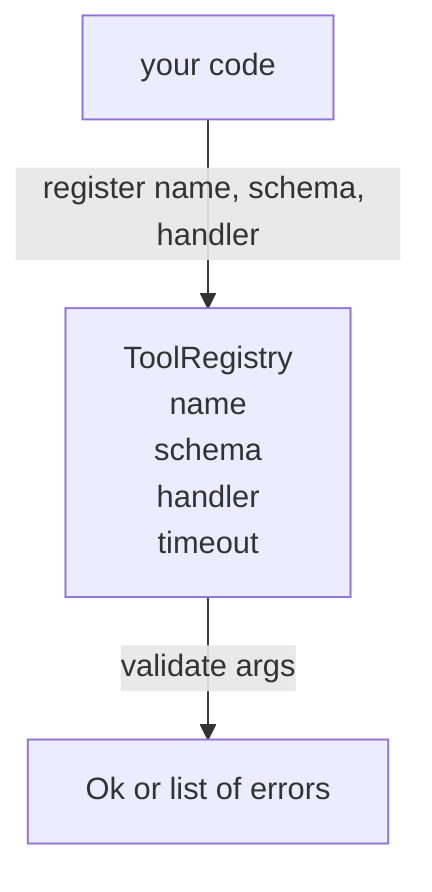

# Реестр инструментов с проверкой по схеме

> Инструмент, который агент не может проверить, — это инструмент, который агент не может вызвать. Постройте реестр и модуль проверки схемы прежде, чем строить сами инструменты.

**Тип:** Build**Языки:** Python**Предварительные требования:** Фаза 13 уроки 01-07, Фаза 14 урок 01**Время:** ~90 минут
## Цели обучения
- Хранить типизированный реестр «имя инструмента → схема → обработчик», к которому диспетчер обращается один раз и после этого доверяет результату.
- Реализовать подмножество JSON Schema 2020-12, которое покрывает ключевые слова, реально используемые в девяноста процентах вызовов инструментов.
- Возвращать точные пути ошибок в формате JSON Pointer, чтобы модель могла исправиться самостоятельно за один цикл обмена.
- Отклонять повторную регистрацию без явного переопределения, поскольку именно молчаливая перезапись приводит к расхождению боевых каталогов инструментов.
- Держать валидатор чистым (без I/O, без обращений к времени, без глобального состояния), чтобы его можно было повторно запускать на логе воспроизведения.

```figure
cf-registry-validate
```

## Почему реестр появляется раньше инструмента

У агента для написания кода в 2026 году зарегистрировано больше инструментов, чем модель способна уместить в одном контекстном окне. Нетривиальный харнесс регистрирует две сотни инструментов и показывает от десяти до сорока на каждом ходу. Реестр — это источник истины для вопросов «какие инструменты существуют», «какую форму имеют их аргументы» и «какой обработчик вызвать». Как только эти три ответа зафиксированы, остальной части харнесса больше не нужно гадать.

Ошибка, которой мы избегаем, — это поставка обработчиков без схем или схем без проверки. И то, и другое встречается часто. И то, и другое превращает следующий слой (диспетчер из урока двадцать три) в игру в угадайку, единственным режимом отказа в которой становится трассировка стека из обработчика.

## Как выглядит запись инструмента

```text
ToolRecord
  name        : str          (unique, lowercase alphanumeric and underscore segments separated by dots, e.g., snake_case.segment.case)
  description : str          (one line, shown to the model)
  schema      : dict         (JSON Schema 2020-12 subset)
  handler     : Callable     (async or sync, returns Any)
  idempotent  : bool         (dispatcher uses this for retry decisions)
  timeout_ms  : int          (override per-tool dispatcher default)
```

Схема — единственное поле, к которому обращается валидатор. Обработчик для него непрозрачен. Мы разделяем их намеренно. Схема — это данные. Обработчик — это код. Смешение их подталкивает к тому, чтобы поместить логику проверки внутрь обработчика, а именно эту ошибку мы и останавливаем.

## Подмножество JSON Schema 2020-12

Полная спецификация 2020-12 тянет на отдельную научную статью. Нам нужно восемь ключевых слов.

```text
type           string / number / integer / boolean / object / array / null
properties     map of property name -> schema
required       list of property names
enum           list of allowed primitive values
minLength      integer, applies to strings
maxLength      integer, applies to strings
pattern        ECMA-262-compatible regex, applies to strings
items          schema applied to every array element
```

Этого достаточно, чтобы покрыть реальные потребности API инструментов. Ключевые слова, которые мы не добавляем (oneOf, anyOf, allOf, $ref, условия), допустимы в боевых схемах, но превращают валидатор в обходчик дерева с циклами. Мы строим реестр, а не движок JSON Schema.

## Пути ошибок в формате JSON Pointer

Когда проверка не проходит, валидатор возвращает список ошибок. Каждая ошибка несёт путь в формате JSON Pointer, указывающий место во входных данных. Указатель — это последовательность имён свойств и индексов массива, начинающаяся с косой черты.

```text
{"a": {"b": [1, 2, "x"]}}
                    ^
                    /a/b/2
```

Модель считывает пути ошибок лучше, чем предложения. Если схема требует `args.user.email`, а модель передала целое число, ошибка должна выглядеть как `/user/email` с `expected_type: string`. Модель исправит это при следующем вызове без единого раунда естественного языка.

## Регистрация и переопределение

`register(name, schema, handler, **opts)` по умолчанию отклоняет повторную регистрацию. Чтобы заменить запись, вызывающий код должен передать `override=True`. Это эксплуатационная гигиена. Ситуация, когда две части кодовой базы молча регистрируют один и тот же инструмент под одним именем, — это тот тип бага, поиск которого в продакшене занимает неделю.

Реестр предоставляет три метода чтения. `get(name)` возвращает запись или выбрасывает исключение. `validate(name, args)` возвращает `Ok` либо список ошибок. `names()` возвращает имена инструментов в порядке регистрации.

## Что валидатор делает, а чего не делает

Это один рекурсивный проход по дереву схемы. Он чистый. Он не вызывает обработчики. Он не приводит типы (строка `"42"` не проходит проверку по схеме number). Он не выполняет молчаливое усечение.

Это не граница безопасности. Вредоносный обработчик всё ещё может повести себя неправильно после успешной проверки. Диспетчер из урока двадцать три добавляет слои тайм-аута и песочницы. Реестр добавляет форму.

## Форма



## Как читать код

`code/main.py` определяет `ToolRegistry`, `ToolRecord`, `ValidationError` и восемь функций-валидаторов. Валидатор выбирает ветвь по `schema["type"]` (либо, если в схеме присутствует `enum`, трактует её как нетипизированную проверку перечисления). Каждый валидатор типа возвращает либо пустой список, либо список `ValidationError`. Обходчик верхнего уровня объединяет ошибки и добавляет сегменты пути по мере погружения вглубь.

`code/tests/test_registry.py` покрывает регистрацию, переопределение, успешную проверку, неуспешную проверку с путями и каждое ключевое слово из подмножества.

## Что дальше

Как только этот урок уляжется, вам захочется добавить два расширения: разрешение `$ref` относительно локального блока определений и `additionalProperties: false` для строгой формы. Оба небольшие. Оба обычно добавляют, когда каталог инструментов вырастает за пятьдесят штук. Мы оставили их за рамками урока, чтобы файл читался за один присест.

Следующий урок (двадцать два) строит транспорт JSON-RPC поверх stdio, который открывает этот реестр клиенту модели. Урок после него (двадцать три) оборачивает оба слоя диспетчером с тайм-аутами и повторными попытками.
