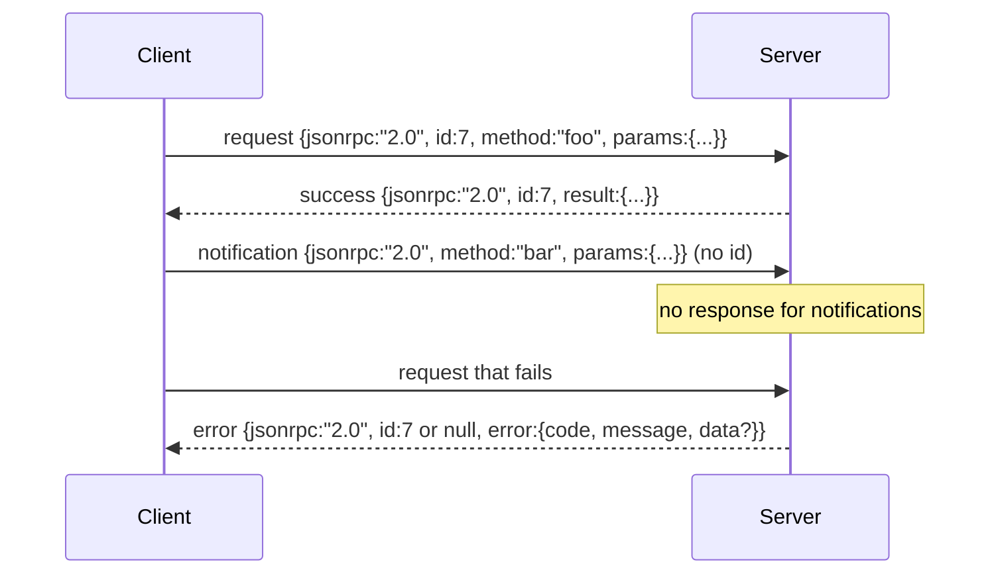

# JSON-RPC 2.0 через stdio с разделением строками

> Транспорт между клиентом модели и сервером инструментов — это JSON-RPC поверх stdio. Реализовав его один раз вручную, вы поймёте, за что платит каждый уровень фрейминга.

**Тип:** Build**Языки:** Python**Предварительные требования:** Фаза 13 уроки 01-07, Фаза 14 урок 01**Время:** ~90 минут
## Цели обучения
- Общайтесь по протоколу JSON-RPC 2.0, оформленному в виде newline-delimited JSON (построчного JSON) поверх stdin и stdout.
- Сопоставьте пять стандартных кодов ошибок (-32700, -32600, -32601, -32602, -32603) и передавайте их с правильной семантикой.
- Различайте запросы, ответы, уведомления и пакеты (batches), не изобретая новые ключи конверта.
- Обрабатывайте одну ошибку разбора на строку, не отравляя остальную часть потока.
- Постройте самозавершающуюся демонстрацию на основе io.BytesIO, чтобы урок выполнялся без порождения дочернего процесса.

```figure
cf-jsonrpc-frames
```

## Почему JSON-RPC остаётся общим языком

Агент для написания кода в 2026 году общается, возможно, с двенадцатью серверами инструментов в рамках одной сессии. Каждый сервер — это отдельный процесс или удалённая конечная точка. Формат передачи данных не менялся с 2013 года. JSON-RPC 2.0 — это спецификация на две страницы. Она выживает, потому что альтернативы (gRPC, HTTP на каждый вызов, собственный бинарный формат) неизбежно навязывают компромисс, которого нет у JSON-RPC: они выбирают либо потоковую передачу, либо пакетирование, либо привязку к конкретному транспорту. JSON-RPC симметричен для stdio, сокетов, websocket и HTTP, и клиент может управлять сервером, которого никогда раньше не видел, если оба соблюдают спецификацию.

В этом уроке мы реализуем вариант поверх stdio. Newline-delimited JSON — построчный JSON. Каждый запрос — это одна строка. Каждый ответ — это одна строка. Граница транспортного уровня — `\n`.

## Форма данных на проводе

Существует четыре формы конверта. Две использует клиент. Две — сервер.



У уведомления нет `id`. Сервер не должен отвечать на него. Если сервер всё же возвращает ответ на уведомление, у клиента нет способа привязать его к месту вызова. Именно это единственное правило делает арифметику фрейминга простой.

Пакет (batch) — это JSON-массив запросов или уведомлений. Сервер отвечает массивом ответов в произвольном порядке, по одному на каждый элемент, не являющийся уведомлением. Если все элементы пакета — уведомления, сервер ничего не отправляет в ответ.

## Пять кодов ошибок

```text
-32700  Parse error      JSON could not be parsed
-32600  Invalid Request  Envelope shape is wrong
-32601  Method not found
-32602  Invalid params
-32603  Internal error
```

Коды от -32000 до -32099 зарезервированы под ошибки, определяемые сервером. Всё остальное определяется приложением. Урок ограничивается этими пятью. Если ваш обработчик выбрасывает исключение, транспорт оборачивает его в -32603, помещая имя класса исключения в `data.exception`.

Для ошибки разбора действует особое правило. `id` в ответе равен `null`, потому что запрос не удалось разобрать настолько, чтобы извлечь id.

## Фрейминг по новой строке и демонстрация на BytesIO

Транспорт читает данные по одной строке за раз. Строка — это байты вплоть до `\n` включительно. Если строку не удаётся разобрать, транспорт записывает ответ -32700 с `id: null` и продолжает работу. Поток не отравляется. Следующая строка разбирается заново, с чистого листа.

Для урока мы оборачиваем пару `io.BytesIO` в качестве stdin и stdout. Сервер читает запросы до EOF, записывает ответ на каждый из них и завершает работу. Клиент считывает ответы обратно. Никакого порождения процессов. Никаких тайм-аутов. Поведение транспорта идентично поведению настоящего pipe дочернего процесса, потому что интерфейс `io` в Python предоставляет тот же контракт `.readline()` и `.write()`.

## Диспетчеризация методов

Транспорт не знает, какие методы существуют. Он передаёт управление вызываемому объекту `handler(method, params)`, который предоставляет харнесс. Обработчик возвращает результат либо выбрасывает исключение. Три класса исключений передают конкретные коды.

```text
MethodNotFound -> -32601
InvalidParams  -> -32602
Anything else  -> -32603 with exception name in data
```

Транспорт никогда не видит реестр инструментов. Реестр находится за обработчиком. Именно такое разделение на уровни нам и нужно. Транспорт говорит на языке JSON-RPC. Реестр говорит на языке форм инструментов. Диспетчер (урок двадцать три) сшивает их вместе.

## Поведение потока при ошибках

```text
client writes              server reads             server writes
---------------            -----------              -------------
{...valid request...}      parses ok                {...response, id matches...}
{...broken json...         parse fails              {id:null, error: -32700}
{...valid request...}      parses ok                {...response, id matches...}
{...missing method...}     invalid envelope         {id:X, error: -32600}
```

Сломанная строка JSON не останавливает цикл. Отсутствующее поле `method` не останавливает цикл. Исключение в обработчике не останавливает цикл. Транспорт продолжает чтение до EOF.

## Уведомления и асимметричные потоки

Уведомление — это «выстрелил и забыл» (fire-and-forget). Харнесс использует уведомления для событий прогресса, сигналов отмены и строк журнала. Именно благодаря уведомлениям долго выполняющийся инструмент может транслировать обновления статуса без обмена запрос-ответ для каждого из них.

В уроке реализован один вспомогательный метод для исходящих уведомлений — `write_notification`. Сервер использует его, чтобы сообщать о прогрессе, пока запрос находится в обработке. Демонстрация показывает этот паттерн: приходит запрос, обработчик генерирует два уведомления о прогрессе, а затем записывает финальный ответ.

## Как читать код

В `code/main.py` определены `StdioTransport`, вспомогательная функция разбора (`parse_request`), три вспомогательные функции записи (`write_response`, `write_error`, `write_notification`) и цикл диспетчеризации `serve`. Константы кодов ошибок объявлены на уровне модуля.

`code/tests/test_transport.py` покрывает пять кодов ошибок, уведомления (ответ не записывается), пакеты (массив на входе, массив на выходе, уведомления пропускаются), сломанный JSON (ошибка разбора, затем продолжение) и асимметричный поток, в котором обработчик записывает уведомление в середине вызова.

## Что дальше

Этого транспорта достаточно для последующих уроков. Промышленные (production) транспорты добавляют ещё три вещи. Поле correlation id, которое переживает пересылку (ваш `id` уже выполняет эту роль, но в mesh-архитектуре нужен ещё и внешний trace id). Канал отмены (уведомление вроде `$/cancelRequest` с id выполняющегося вызова). И handshake согласования content-type, чтобы один и тот же сокет мог говорить и на JSON-RPC, и на Streamable HTTP. Ничто из этого не меняет сам «провод». Они лишь добавляют метаданные.
