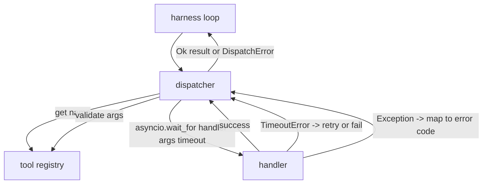
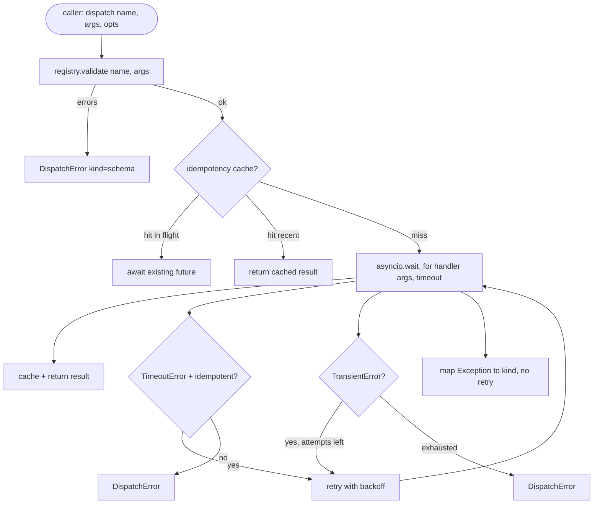

# Диспетчер вызовов функций

> Диспетчер — это место, где харнесс (harness) расплачивается за каждое обещание, данное схемой. Тайм-ауты, повторы, дедупликация, отображение ошибок. Всё в одном шве.

**Тип:** Build
**Языки:** Python
**Предварительные требования:** Фаза 13 уроки 01-07, Фаза 14 урок 01
**Время:** ~90 минут

## Цели обучения
- Оберните обработчик инструмента в тайм-аут на каждый вызов, который возвращает типизированную ошибку вместо зависания цикла.
- Примените повтор с экспоненциальной задержкой (backoff) и джиттером, ограниченный максимальным числом попыток.
- Дедуплицируйте повторы по ключу идемпотентности, чтобы повтор, который обгоняет медленный оригинальный вызов, не выполнился дважды.
- Отобразите исключения обработчика и сбои транспорта в единый конверт ошибки, который цикл харнесса уже умеет обрабатывать.
- Ограничьте параллельную диспетчеризацию лимитом параллелизма, чтобы веерный вызов (fan-out) из сорока вызовов инструментов не исчерпал цикл событий (event loop).

```figure
cf-dispatch-retry
```

## Где находится диспетчер

Между циклом харнесса (урок двадцать) и реестром инструментов (урок двадцать один). Транспорт (урок двадцать два) питает цикл. Цикл передаёт вызов инструмента диспетчеру. Диспетчер обращается к реестру, запускает обработчик и возвращает либо результат, либо конверт ошибки в форме JSON-RPC.



Диспетчер — единственный слой, который знает о таймерах, повторах и идемпотентности. Цикл не знает. Реестр не знает. Обработчик не знает. В этом и есть смысл изоляции.

## Тайм-ауты

У каждого инструмента есть тайм-аут по умолчанию. Запись реестра содержит `timeout_ms`. Диспетчер переопределяет его значением из переопределения на конкретный вызов, если харнесс его передаёт. Мы используем `asyncio.wait_for`. При тайм-ауте задача обработчика отменяется, и диспетчер возвращает `DispatchError(kind="timeout")`.

По умолчанию тайм-аут не является ошибкой, допускающей повтор, для неидемпотентных инструментов. `db.write`, у которого случился тайм-аут, мог зафиксировать изменения, а мог и не зафиксировать. Повтор продублирует запись. Диспетчер учитывает флаг `idempotent` из записи реестра. Идемпотентные инструменты повторяются. Неидемпотентные — нет.

## Повторы с экспоненциальной задержкой

Политика повторов — максимум три попытки. Задержка растёт экспоненциально, с джиттером.

```text
attempt 1  -> delay 0
attempt 2  -> delay 0.1s * (1 + random[0..0.5])
attempt 3  -> delay 0.4s * (1 + random[0..0.5])
```

Повторяются только ошибки `timeout` и `transient`. Ошибка `schema`, `not_found` или `internal` не повторяется. Ошибки схемы детерминированы. Повтор не изменит результат и лишь израсходует бюджет.

Цикл повторов учитывает бюджет, полученный от харнесса. Если у вызывающей стороны в бюджете не осталось вызовов инструментов, диспетчер сразу же завершается ошибкой на первой попытке и возвращает `kind="budget_exceeded"`.

## Дедупликация по ключу идемпотентности

Повтор, который срабатывает, пока оригинальный вызов ещё выполняется, — это реальный баг в продакшене. Первый вызов зависает на четырёх целых девяти десятых секунды (чуть меньше тайм-аута). Повтор срабатывает на пятой секунде. Теперь два запроса конкурируют за один и тот же бэкенд. Если инструмент — `payments.charge`, деньги списаны дважды.

Диспетчер принимает необязательный `idempotency_key`. Если тот же ключ уже выполняется в момент поступления вызова, диспетчер дожидается уже выполняющегося future и возвращает его результат. Кеш хранит ключи шестьдесят секунд после завершения, чтобы поглощать запоздавшие повторы.

Ответственность за ключ лежит на вызывающей стороне. Харнесс выводит его из планировщика: `f"{step_id}:{tool_name}:{hash(args)}"`. Диспетчер не изобретает ключи сам, потому что вывод ключа только из аргументов заставляет два семантически разных вызова выглядеть одинаково.

## Конверт ошибки

Неудачная диспетчеризация возвращает единую форму.

```text
DispatchError
  kind        : "timeout" | "transient" | "schema" | "not_found" | "internal" | "budget_exceeded"
  message     : str
  attempts    : int
  jsonrpc_code: int   (one of -32601, -32602, -32603)
```

Цикл харнесса отображает `kind` на следующее состояние. `schema` и `not_found` уходят в `on_error` и запускают перепланирование. `timeout` и `transient` тоже уходят в `on_error`, а перепланирование происходит или нет в зависимости от числа попыток. `budget_exceeded` запускает `on_budget_exceeded`.

## Ограничение параллелизма при веерном вызове

`gather(*calls)` запускает все корутины одновременно. При сорока вызовах инструментов это сорок открытых сокетов или сорок каналов подпроцессов. Большинству бэкендов не нравятся сорок параллельных соединений от одного клиента.

Диспетчер оборачивает `gather` семафором. Лимит параллелизма по умолчанию — восемь. Каждый вызов захватывает семафор перед диспетчеризацией и освобождает его по завершении. Вызывающая сторона видит вывод в форме `gather`, но фактическое планирование ограничено.

## Поток для одного вызова



## Как читать код

`code/main.py` определяет `Dispatcher`, `DispatchError` и `TransientError`. Диспетчер получает реестр при конструировании. Асинхронный `dispatch(name, args, ...)` — единственная точка входа. Тайм-ауты на каждую попытку применяются прямо внутри `_run_with_retries` с помощью `asyncio.wait_for`. `gather_bounded(calls)` запускает множество диспетчеризаций с учётом лимита параллелизма.

`code/tests/test_dispatcher.py` покрывает срабатывание тайм-аута, повтор при ошибке transient, отсутствие повтора при ошибке схемы, дедупликацию по идемпотентности (два параллельных вызова с одним и тем же ключом схлопываются в один вызов обработчика) и ограничение параллелизма (семафор в действии).

Тесты используют `asyncio.sleep(0)` и детерминированные обработчики на основе `Counter`, поэтому они завершаются за миллисекунды и не зависят от реального времени выполнения.

## Что дальше

Продакшен-диспетчеры обычно добавляют два расширения. Первое — структурированное логирование на каждом переходе (поток событий цикла уже даёт это, но диспетчер должен также генерировать события `dispatch.attempt` и `dispatch.retry`). Второе — предохранители (circuit breaker): после N сбоев в течение окна инструмент получает период охлаждения, в течение которого диспетчеризация сразу возвращает `kind="circuit_open"` вместо попытки вызвать обработчик. Оба расширения ложатся поверх этого диспетчера, не меняя контракт.

Урок двадцать четыре соединяет диспетчер с агентом, работающим по принципу «планирование и выполнение», чтобы вы увидели все четыре компонента в действии.
