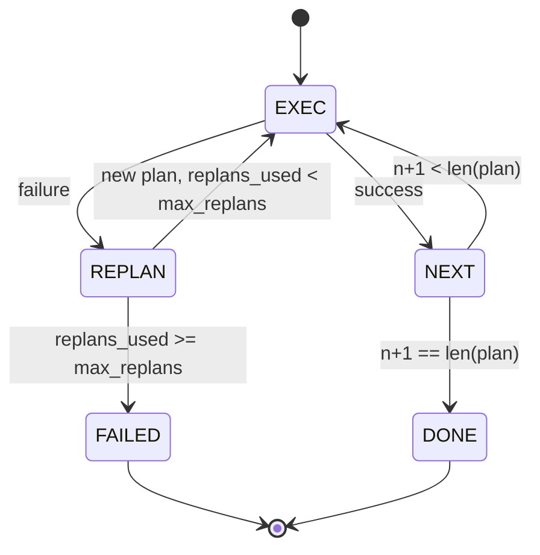

# Управляющий поток «планирование — выполнение»

> План, который не переживает сбой, — это сценарий. Сценарий, способный на перепланирование, — это агент. Сначала постройте перепланировщик.

**Тип:** Build
**Языки:** Python
**Предварительные требования:** Фаза 13 уроки 01-07, Фаза 14 урок 01
**Время:** ~90 минут

## Цели обучения
- Представляйте план как упорядоченный список типизированных шагов, чтобы исполнитель мог рассуждать о прогрессе и результате.
- Выполняйте шаги последовательно, обеспечивая контролируемую передачу сбоя обратно планировщику.
- Перепланируйте с текущего курсора, добавляя в контекст предыдущую ошибку, чтобы следующий план учитывал её.
- Выдавайте diff плана при каждой ревизии, чтобы последующий трассировщик или UI мог показать, почему план изменился.
- Обеспечивайте соблюдение двух бюджетов: жёсткого предела на количество шагов и жёсткого предела на количество перепланирований.

```figure
cg-plan-replan
```

## Планирование и выполнение, а не цепочка рассуждений

Агент с цепочкой рассуждений генерирует токены и оставляет циклу гадать, где заканчивается вызов инструмента. Агент планирования и выполнения сначала выдаёт структурированный план, а затем детерминированно выполняет каждый шаг. План — это данные, которые харнесс может анализировать. Выполнение — это харнесс, прогоняющий эти данные через диспетчер.

Два компонента. Планировщик, который создаёт план. Исполнитель, который выполняет план. Самое интересное происходит, когда исполнитель сталкивается со сбоем. Три варианта:

```text
1. Abort         (return failed, surface the error)
2. Skip          (mark step failed, continue with the rest)
3. Replan        (hand the error to the planner, get a new plan from the cursor)
```

Именно перепланирование превращает сценарий в агента.

## Структура Step

```text
Step
  id              : int           (monotonic within a plan revision)
  tool_name       : str
  args            : dict
  expected_outcome: str           (planner's stated success condition)
  result          : Any | None
  error           : str | None
```

`expected_outcome` — короткое предложение, которое планировщик выдаёт вместе с шагом. Исполнитель не проверяет его принудительно. Оно нужно для двух вещей: перепланировщик читает его при пересмотре плана; поток событий выдаёт его, чтобы трассировщик мог показать «этот шаг должен был сделать X».

## Структура планировщика

```python
def planner(goal: str, history: list[Step], last_error: str | None) -> list[Step]:
    ...
```

Чистая функция. `goal` — цель пользователя. `history` — уже выполненные шаги (с заполненными результатами и ошибками). `last_error` равен None при первом вызове и содержит сообщение о последнем сбое при каждом последующем вызове. Планировщик возвращает следующий план, начиная с курсора.

Планировщик ничего не знает об исполнителе. Он ничего не знает о повторных попытках. Он ничего не знает о таймаутах. Он создаёт план. Это всё.

## Исполнитель

Исполнитель — это небольшой автомат состояний (state machine). Каждый шаг проходит через диспетчер. Результат — один из трёх вариантов: успех, сбой с возможностью перепланирования, фатальный сбой. Сбои с возможностью перепланирования передаются обратно планировщику. Фатальные сбои (превышен бюджет, достигнут предел перепланирований) возвращают результат сессии `FAILED`.



## Diff плана при пересмотре

Когда планировщик возвращает новый план после сбоя, исполнитель выдаёт событие `plan.diff` с тремя полями.

```text
removed: list of step ids that were in the old plan and are not in the new
added  : list of step ids in the new plan that were not in the old
revised: list of step ids whose tool_name or args changed
```

Трассировщик или UI может отрисовать это как зачёркивание удалённых шагов и подсветку добавленных. Дело не в формате diff. Дело в том, что пересмотр плана — это видимое событие, а не молчаливая перезапись.

## Два бюджета, оба жёсткие

`max_steps` ограничивает общее число выполнений шагов за всю сессию, включая перепланирования. Значение по умолчанию — двенадцать. Линейный план из пяти шагов, который дважды перепланируется и каждый раз добавляет по три шага, доходит до шестнадцати выполнений и превысил бы бюджет. Исполнитель откажет в перепланировании и вернёт FAILED.

`max_replans` ограничивает число вызовов планировщика после первого плана. Значение по умолчанию — пять. Это более важное ограничение. Планировщик, который пять раз подряд возвращает один и тот же неработающий план, иначе зацикливался бы, пока его не остановит бюджет шагов. Ограничение числа перепланирований делает сбой быстрее, а его причину — яснее.

## Детерминированный планировщик в этом уроке

В этом уроке мы не вызываем модель. Урок поставляется с детерминированным планировщиком, который выбирает план на основе `last_error`.

```text
last_error is None    -> emit a four-step plan
last_error matches X  -> emit a three-step plan that routes around X
last_error matches Y  -> emit a two-step plan that gives up gracefully
otherwise             -> return [] (signals nothing to replan)
```

Этого достаточно, чтобы протестировать поведение исполнителя на каждом переходном пути: успех, однократное перепланирование, двукратное перепланирование, исчерпание перепланирований и исчерпание бюджета шагов.

## Структура результата

```text
SessionResult
  status      : "completed" | "failed"
  reason      : str     ("goal_met" | "step_budget" | "replan_budget" | "no_plan")
  history     : list[Step]
  revisions   : list[PlanDiff]
  events      : list[Event]
```

Цикл харнесса из урока двадцать может читать это напрямую. Диспетчер из урока двадцать три — это то, что выполняет каждый шаг. Реестр из урока двадцать один валидирует args каждого шага. Транспорт из урока двадцать два предоставил бы весь этот поток по JSON-RPC клиенту модели.

## Как читать код

`code/main.py` определяет `PlanExecuteAgent`, `Step`, `PlanDiff`, `SessionResult` и детерминированный планировщик. Исполнитель — это единственный метод `run(goal)`, который возвращает `SessionResult`. Diff плана вычисляется путём сравнения id шагов и кортежей `(tool_name, args)`.

`code/tests/test_agent.py` покрывает линейный успех, сбой в середине плана с одним перепланированием, исчерпание перепланирований с возвратом `failed:replan_budget`, исчерпание бюджета шагов и формат события diff плана.

## Что дальше

Как только вы подключите это к настоящей модели, вам понадобятся два расширения. Первое — кеширование частичного плана: когда план успешно выполняет первые три шага из шести, а затем даёт сбой, вы не хотите повторно запускать первые три. Исполнитель уже хранит историю; планировщику нужно только её прочитать. Второе — параллельные ветви: текущий исполнитель строго последователен. Планировщик, который выдаёт независимую ветвь (`gather_step` вместо `next_step`), может выполнять два вызова инструментов параллельно через диспетчер.

Оба варианта добавляют реальную сложность. Оба проще добавить, когда линейный исполнитель уже закреплён. Именно это и делает этот урок.
