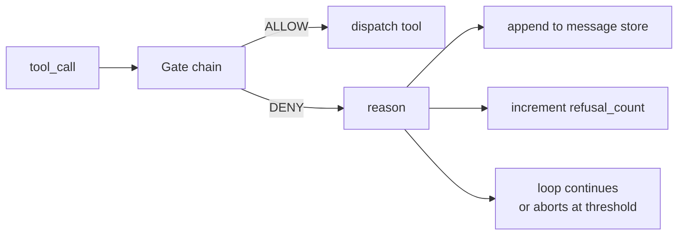
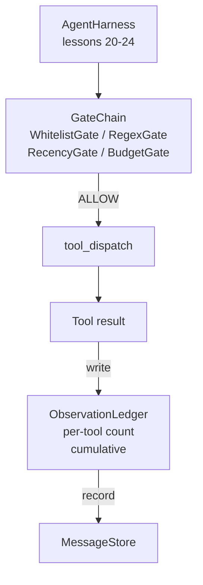

# Урок 25 капстоуна: шлюзы верификации и бюджет наблюдений

> Харнесс агента без слоя верификации — это просто желание в плаще. Этот урок строит детерминированную цепочку шлюзов, которая решает, разрешено ли сработать вызову инструмента, сколько его вывода агенту позволено увидеть и когда цикл обязан остановиться, потому что агент прочитал слишком много. Цепочка — это функция от небольших именованных шлюзов плюс реестр наблюдений, отслеживающий каждый токен, показанный модели.

**Тип:** Build
**Языки:** Python (stdlib)
**Предварительные требования:** Фаза 19 · 20-24 (Track A1: agent loop, tool registry, message store, prompt builder, model router), Фаза 14 · 33 (instructions as constraints), Фаза 14 · 36 (scope contracts), Фаза 14 · 38 (verification gates)
**Время:** ~90 минут

## Цели обучения

- Построить протокол `VerificationGate` с детерминированным методом `evaluate(call)`.
- Собрать шлюзы бюджета, давности, белого списка и регулярных выражений в цепочку с семантикой короткого замыкания.
- Отслеживать каждое наблюдение через `ObservationLedger`, индексированный по инструменту и ходу.
- Отказывать в вызове инструмента, если это превысило бы совокупный бюджет наблюдений.
- Выдавать структурированную запись `GateDecision`, которую может принять нижестоящая система наблюдаемости.

## Проблема

Когда харнесс агента позволяет модели свободно вызывать инструменты, в первый же час реального использования проявляются три класса багов.

Первый — неограниченное наблюдение. Grep по репозиторию на 200 тысяч строк сбрасывает в следующий ход полмиллиона токенов вывода. Модель видит одно совпадение на килобайт, а остальной контекст потрачен впустую. Счёт за токены велик, и агент теперь хуже, а не лучше справляется с задачей.

Второй — устаревшая давность. Долгая задача накапливает пятьдесят вызовов инструментов. Модель перечитывает первый read_file с третьего хода так, будто это актуальное состояние. Правки, сделанные на сорок седьмом ходу, никогда не всплывают, потому что построитель промпта сериализовал самые ранние наблюдения первыми.

Третий — расползание привилегий. Исследовательская задача начинается с вызова `web_search`, а затем каким-то образом заканчивается запуском `shell`, потому что модель выдумала имя инструмента, а харнесс по умолчанию был снисходителен. К тому моменту, когда кто-то читает трассировку, в /tmp уже лежит мусорный файл, а curl уже сходил в приватный API.

Шлюз верификации (verification gate) — это компонент харнесса, который говорит «нет». Это не модель. Это не судья. Это детерминированная функция от `(call, history, ledger)`, которая возвращает либо ALLOW, либо DENY с причиной. Причина логируется. Модели сообщают об этом. Цикл либо продолжается, либо прерывается.

## Концепция



Шлюз — это всё, что имеет метод `evaluate(call, ctx) -> GateDecision`. Цепочка — это упорядоченный список. Оценка прерывается по короткому замыканию на первом отказе. Порядок важен: дешёвые структурные шлюзы выполняются раньше дорогих шлюзов подсчёта токенов.

В этом уроке реализованы четыре шлюза:

- `WhitelistGate`. Разрешённые имена инструментов — явное множество. Всё, что вне него, отклоняется. Это самый дешёвый шлюз, и он выполняется первым.
- `RegexGate`. Аргументы инструмента сверяются с регулярным выражением. Полезно для отказа вызовов shell с `rm -rf` внутри или HTTP-вызовов на внутренние IP-адреса. Чистая функция от полезной нагрузки вызова.
- `RecencyGate`. Модель видит только наблюдения за последние N ходов. Более старые наблюдения маскируются. Шлюз отклоняет вызов инструмента, результат которого расширил бы окно наблюдения, уже вышедшее за пределы актуальности.
- `BudgetGate`. Совокупное число токенов, прочитанных моделью за сессию, имеет потолок. Когда реестр сообщает, что потолок достигнут, каждый последующий вызов инструмента отклоняется.

Реестр наблюдений (observation ledger) — это бухгалтерия. Каждый успешный вызов инструмента записывает одну строку: имя инструмента, ход, число выданных токенов, накопленная сумма. Реестр отвечает на два вопроса: сколько всего увидела модель и сколько она увидела от инструмента X. Шлюз бюджета читает первый ответ. Шлюз бюджета по инструменту, который вы напишете в качестве упражнения, читает второй.

```figure
cg-gate-chain
```

## Архитектура



Харнесс обращается к цепочке. Цепочка либо кивает, либо отказывает. Если она кивает, инструмент запускается, реестр тикает, а результат добавляется в хранилище сообщений. Если она отказывает, модели передаётся отказ в виде системного сообщения, и цикл решает, повторить попытку или прервать выполнение.

## Что вы построите

Реализация — это единственный `main.py` плюс тесты.

1. Датаклассы `Observation` и `ToolCall` определяют форматы данных на проводе.
2. `ObservationLedger` записывает строки `(turn, tool, tokens)` и отвечает на `cumulative()` и `per_tool(name)`.
3. `GateDecision` несёт `(allow, reason, gate_name)`.
4. `VerificationGate` — это протокол. Каждый шлюз реализует `evaluate(call, ctx)`.
5. `GateChain` оборачивает упорядоченный список. Он вызывает каждый шлюз, возвращает первый отказ или возвращает разрешение, если каждый шлюз пройден.
6. Демонстрация запускает крошечный синтетический цикл агента. Три хода. Третий ход спотыкается о шлюз бюджета, и цикл сообщает о чистом отказе с ненулевым счётчиком отказов.

Счётчик токенов намеренно представляет собой тупую эвристику `len(text) // 4`. Смысл этого урока — в устройстве шлюзов, а не в токенизаторе. В продакшене подставьте настоящий токенизатор.

## Почему порядок цепочки важен

Отказ дешевле разрешения. `WhitelistGate` выполняется за O(1) поиском по хеш-таблице. `RegexGate` выполняется за O(pattern * argv). `RecencyGate` читает небольшой срез хранилища сообщений. `BudgetGate` читает весь реестр целиком. Их упорядочивают по возрастанию стоимости, чтобы отклонённый вызов прерывался по короткому замыканию раньше, чем будет выполнена дорогая работа.

Их также упорядочивают по радиусу поражения. Белый список — самое сильное утверждение: этого инструмента нет в контракте. Следующий — шлюз регулярных выражений: этого аргумента нет в контракте. Давность идёт после: харнессу это всё ещё важно, но вызов структурно легален. Бюджет идёт последним, потому что по определению он срабатывает только тогда, когда всё остальное уже пройдено.

## Как это соотносится с остальной частью трека A

Предыдущие уроки дали вам цикл, реестр инструментов, хранилище сообщений, построитель промпта и роутер моделей. Этот урок добавляет слой между моделью и инструментами. Урок 26 поставляет песочницу, которой диспетчер передаёт вызов инструмента, как только цепочка шлюзов говорит ALLOW. Урок 27 поставляет харнесс для оценивания, который фиксирует число отказов как сигнал качества. Урок 28 подключает решения шлюзов к спанам OpenTelemetry. Урок 29 сшивает всё это в работающего агента для написания кода.

## Запуск

```bash
cd phases/19-capstone-projects/25-verification-gates-observation-budget
python3 code/main.py
python3 -m pytest code/tests/ -v
```

Демонстрация печатает пошаговую трассировку по ходам, включая каждое решение шлюза, и завершается с нулевым кодом возврата. Тесты покрывают реестр, каждый шлюз по отдельности, короткое замыкание цепочки и синтетический цикл целиком.
