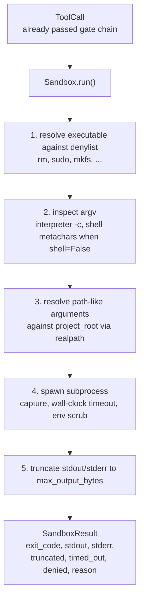
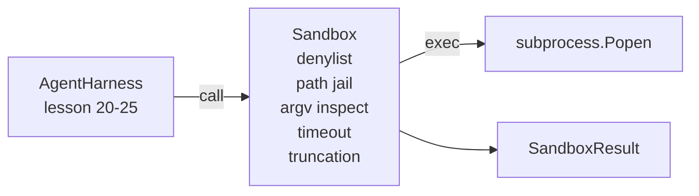

# Урок 26 капстоуна: песочница-исполнитель с чёрным списком и изоляцией путей

> Шлюз верификации (verification gate) решает, должен ли выполниться вызов инструмента. Песочница решает, что происходит, когда он выполняется. Этот урок поставляет исполнитель подпроцессов (runner), который отказывает опасным исполняемым файлам, отказывает опасным формам argv, изолирует (jail) каждый путь к файлу в пределах объявленного корня проекта, обрезает избыточный вывод и завершает неуправляемые процессы по истечении тайм-аута реального времени (wall-clock timeout). Это второй из двух слоёв, расположенных между моделью и операционной системой.

**Тип:** Build
**Языки:** Python (stdlib)
**Предварительные требования:** Фаза 19 · 25 (verification gates and observation budget), Фаза 14 · 33 (instructions as constraints), Фаза 14 · 38 (verification gates)
**Время:** ~90 минут

## Цели обучения

- Построить класс `Sandbox`, оборачивающий `subprocess.run` с тайм-аутом, захватом вывода и обрезкой.
- Отклонять команду по имени с помощью чёрного списка (denylist) и по структуре — с помощью argv-инспектора.
- Отклонять любой аргумент-путь, который разрешается за пределы объявленного корня проекта.
- Отклонять метасимволы shell, когда режим shell отключён.
- Возвращать структурированный `SandboxResult`, который могут принять нижестоящая система наблюдаемости и харнесс для оценивания.

## Проблема

Агент для написания кода, который может выполнять команды shell, способен за один ход установить бэкдор, похитить ключи, вывести из строя ноутбук разработчика и накрутить огромный облачный счёт. Самая дешёвая защита — не давать ему shell. Вторая по дешевизне — песочница, которая отказывает по точному списку шаблонов.

В трассировках агентов повторяются три класса сбоев.

Первый — опасные исполняемые файлы. Модель, которой нужно любой ценой починить проблему с путём, попробует `sudo`, `chmod -R 777`, `rm -rf`, `mkfs`, `dd`. Ничему из этого не место в прогоне агента. Чёрный список (denylist) отслеживает их по имени и по псевдониму.

Второй — трюки с argv. Модель, которой запретили shell, проведёт атаку через интерпретатор: `python3 -c "import os; os.system('rm -rf /')"`, `bash -c '...'`, `node -e '...'`, `perl -e '...'`. Песочница должна знать, что запуск любого интерпретатора с флагом вида `-c` — это просто вызов shell в несколько дополнительных шагов.

Третий — выход за пределы пути. Модели говорят прочитать `./src/main.py`, а она вместо этого читает `../../etc/passwd`. Песочница изолирует (jail) каждый аргумент-путь, разрешая его через `os.path.realpath` и проверяя префикс.

Песочница — это не граница безопасности в смысле операционной системы. Решительный злоумышленник с возможностью выполнения кода всё ещё способен из неё вырваться. Песочница — это защитное ограничение (guardrail) уровня разработки: она делает типичные сбои заметными и не даёт агенту навредить по чистой неумелости.

## Концепция



У песочницы четыре оси отказа: имя, argv, путь, структура. Каждая ось — чистая функция от вызова, подпроцесс ещё не создаётся. Подпроцесс запускается только после того, как пройдены все оси.

Коды возврата `SandboxResult` — обычные: 0 означает успех, ненулевое значение — неудачу, плюс три сигнальных кода для denied (-100), timed_out (-101) и truncated (код возврата в этом случае настоящий, но выставлен флаг). Последующие уроки читают этот структурированный результат, а не разбирают stderr.

```figure
cg-path-jail
```

## Архитектура



Чёрный список — это frozenset базовых имён исполняемых файлов. Псевдонимы (`/bin/rm`, `/usr/bin/rm`) все разрешаются в одно и то же базовое имя. argv-инспектор знает форму интерпретатора: любой argv, где argv[0] — интерпретатор, а более поздний аргумент начинается с `-c` или `-e`, отклоняется. Метасимволы shell (`;`, `|`, `&`, `>`, `<`, обратные кавычки, `$()`) вызывают отказ, если вызов явно не запрашивал shell.

Изоляция путей (path jail) — самая тонкая часть механизма. При создании песочница принимает `project_root`. Любой аргумент, похожий на путь (содержит `/` или совпадает с существующим файлом), нормализуется через `os.path.realpath`, а затем сверяется с realpath корня проекта. Если итоговая цель оказывается вне корня — отказ. Попытки выхода через симлинк (симлинк внутри корня проекта, указывающий наружу) блокируются проверкой realpath, а не буквального пути.

## Что вы построите

Реализация — это `main.py` плюс каталог тестов.

1. Датакласс `SandboxResult`: exit_code, stdout, stderr, truncated, timed_out, denied, reason, duration_ms.
2. Датакласс `SandboxConfig`: project_root, max_output_bytes, timeout_seconds, denylist, interpreter_block.
3. Класс `Sandbox`: `run(argv, *, shell=False, cwd=None)` возвращает `SandboxResult`.
4. Внутренние вспомогательные функции отказа: `_check_executable_denylist`, `_check_argv_interpreter`, `_check_shell_metachars`, `_check_path_jail`.
5. Обрезка вывода с явным флагом `truncated` и строкой-маркером в захваченном потоке.
6. Демонстрация внизу: последовательность легитимных и состязательных вызовов. Каждый показан вместе со своим результатом.

Песочница по умолчанию использует `subprocess.run` с `shell=False` и `capture_output=True`. Тайм-аут по реальному времени использует аргумент `timeout`; при `TimeoutExpired` песочница завершает группу процессов и синтезирует SandboxResult.

## Почему это не настоящая песочница

Песочница этого урока не использует namespaces, cgroups, seccomp, gVisor, Firecracker или какую-либо изоляцию на уровне ядра. Всё, что может сделать подпроцесс, может сделать и песочница. Защита здесь структурная: агенту отказывают в самых распространённых опасных вызовах, а громкий отказ уходит в наблюдаемость вместо того, чтобы выполниться незаметно.

Для продакшен-агентов сверху добавляют слои: запуск в непривилегированном Docker-контейнере, запуск внутри microVM, сброс capabilities, монтирование корня проекта только для чтения и рабочего каталога для чтения и записи, установку ulimit по памяти и CPU, очистку окружения до заведомо безопасного белого списка. Урок 29 частично делает это. Изоляция на уровне операционной системы выходит за рамки этого урока.

## Запуск

```bash
cd phases/19-capstone-projects/26-sandbox-runner-denylist
python3 code/main.py
python3 -m pytest code/tests/ -v
```

Демонстрация создаёт временный каталог, кладёт в него чистый файл, а затем прогоняет батарею вызовов. Легитимные вызовы завершаются успешно. Отклонённые вызовы возвращают SandboxResult с `denied=True` и причиной. Тайм-ауты возвращают `timed_out=True`. Обрезка выставляет `truncated=True`. Демонстрация печатает JSON-таблицу результатов и завершается с нулевым кодом возврата.

## Как это соотносится с остальной частью трека A

Урок 25 подготовил цепочку шлюзов. Урок 26 — это исполнитель, который запускается после того, как шлюз возвращает ALLOW. Harness для оценивания из урока 27 сравнивает результаты песочницы с ожидаемым кодом возврата для каждой задачи. Урок 28 создаёт спан `gen_ai.tool.execution` вокруг каждого вызова `Sandbox.run`. Сквозная демонстрация урока 29 связывает настоящего агента для написания кода через оба слоя.
