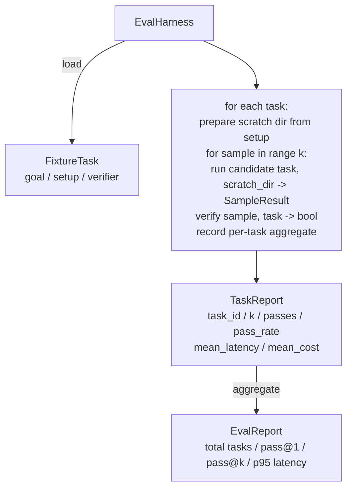

# Урок 27 капстоуна: харнесс оценивания с фикстурными задачами

> Кодовый агент настолько хорош, насколько хорош набор задач, на которых вы его измеряете. Этот урок строит харнесс оценивания, который берёт папку с фикстурными задачами, прогоняет каждую через агента-кандидата, оценивает прохождение или провал с помощью детерминированного верификатора и агрегирует результаты в pass@1, pass@k, среднюю задержку и среднюю стоимость. Харнесс — это источник истины, который позволяет отличить регрессию от рефакторинга.

**Тип:** Build
**Языки:** Python (stdlib)
**Предварительные требования:** Фаза 19 · 25 (verification gates), Фаза 19 · 26 (sandbox runner), Фаза 14 · 30 (eval-driven agent development), Фаза 14 · 19 (SWE-bench and GAIA benchmarks)
**Время:** ~90 минут

## Цели обучения

- Определите фикстурную задачу как тройку из цели, настройки и верификатора.
- Оценивайте несколько прогонов-сэмплов на задачу и вычисляйте pass@1 и pass@k.
- Агрегируйте задержку и стоимость в средние значения и метрики 95-го процентиля.
- Оформите детерминированные верификаторы (diff файлов, код возврата, совпадение по регулярному выражению) в виде переиспользуемых функций.
- Выдавайте структурированный JSON-отчёт, который может считать скрипт отслеживания регрессий.

## Проблема

Три режима сбоя преследуют бенчмарки агентов, построенные без харнесса оценивания.

Первый — непроверенное прохождение. Агент утверждает, что исправил баг, человек бросает взгляд на diff, набор тестов помечается зелёным, а три недели спустя регрессионный тест выявляет тот же баг. Агент рассуждал правдоподобно, но на самом деле ничего не исправил.

Второй — необнаруженная регрессия. Изменение шаблона промпта делает агента на 4% лучше на «громкой» задаче и на 14% хуже на «тихой». Без золотого набора и оценки по каждой задаче регрессия проникает в main и всплывает только тогда, когда пожалуется клиент.

Третий — дрейф по задачам. Оценивание запускали в понедельник со 100 задачами, а в пятницу — с 95, потому что кто-то переименовал пять фикстур. Доля прохождений выглядит как улучшение на 5%. На самом деле это не так.

Харнесс — это программа, которая превращает эти сбои в факты. Он прогоняет каждую фикстуру, каждый раз, в воспроизводимом порядке, против верификатора, который возвращает true или false по результату детерминированной проверки.

## Концепция

```mermaid
flowchart LR
  F1[fixtures/task_001/<br/>task.json + expected/] --> Harness
  F2[fixtures/task_002/<br/>...] --> Harness
  Harness[Harness<br/>for each task:<br/>setup / run agent k samples /<br/>verify each sample /<br/>record latency, cost]
  Harness --> Report[EvalReport<br/>pass@1 / pass@k<br/>mean ms / p95 ms<br/>mean cost]
```

`FixtureTask` — это небольшой JSON-файл плюс необязательный каталог `expected/`. JSON объявляет `id`, `goal` (промпт, который передаётся агенту), блок `setup` (файлы, которые нужно поместить во временный каталог) и блок `verifier`. Блок verifier называет функцию в реестре верификаторов харнесса и передаёт её аргументы.

Три формы верификатора покрывают большинство полезных задач.

Первая — `file_equals`. После запуска агента именованный файл сравнивается с ожидаемым содержимым. Это ловит задачи вида «исправь этот баг именно так».

Вторая — `regex_match`. Содержимое именованного файла сопоставляется с регулярным выражением. Это ловит задачи вида «функция должна существовать и возвращать X», где допустимо множество решений.

Третья — `shell_exit_zero`. Харнесс запускает shell-команду (через песочницу из урока 26) и засчитывает задачу как пройденную, только если команда завершается с нулевым кодом возврата. Это ловит задачи вида «тесты должны проходить».

Харнесс прогоняет каждую задачу `k` раз. Pass@k равен `1 - (1 - p)^k`, где p — эмпирическая доля прохождений; харнесс также сообщает необработанные счётчики, чтобы можно было заметить разброс. Задержка — это реальное время на один сэмпл. Стоимость — это то, что агент сообщает о себе сам (число токенов, доллары США или оба показателя); харнесс суммирует её по сэмплам и представляет числа как по задаче, так и в совокупности.

```figure
pass-at-k
```

## Архитектура



Кандидат — это вызываемый объект: `Callable[[FixtureTask, str], SampleResult]`. Харнесс создаёт временный каталог через `tempfile.mkdtemp()` и передаёт его путь в виде обычной строки. Харнессу всё равно, как работает кандидат. Кандидатом может быть детерминированный применитель патчей (полезно для самотестирования харнесса), настоящий LLM-агент, фаззер. Контракт — это SampleResult.

## Что вы построите

`main.py` поставляет:

1. Датакласс `FixtureTask`.
2. Датакласс `SampleResult`: success_self_reported, latency_ms, cost_units, edits.
3. Датаклассы `TaskReport`, `EvalReport` с `to_dict()`.
4. `VerifierRegistry`, сопоставляющий имя верификатора с функцией. Встроенные верификаторы: file_equals, regex_match, shell_exit_zero.
5. Класс `EvalHarness`. Прогоняет каталог задач против кандидата. Возвращает EvalReport.
6. Пять фикстурных задач, собранных в `tasks/`:
   - ошибка на единицу в `fizzbuzz`
   - отсутствующий return в `factorial`
   - опечатка в сообщении об ошибке
   - пустое тело функции
   - ошибка на единицу при обходе связного списка
7. Детерминированный эталонный кандидат (`apply_known_fixes`), который харнесс использует, чтобы продемонстрировать чистый pass@1, равный 1.0.
8. Демонстрация печатает JSON EvalReport и завершается с нулевым кодом возврата.

Фикстурные задачи собраны как JSON-файлы в `tasks/` плюс парные исходные файлы в `tasks/<id>/buggy/` и `tasks/<id>/expected/`. Харнесс копирует buggy во временный каталог, передаёт его кандидату и проверяет результат по expected.

## Почему pass@k, а не только pass@1

Реальные LLM-агенты стохастичны. Pass@1, равный 0.6, выглядит как провал. Pass@5, равный 0.95, говорит о том, что агент чаще всего находит правильный ответ, но выбирает неверный вариант на ранних сэмплах. Решение — сэмплирование и ранжирование, а не всегда больше обучения. Pass@k делает это видимым.

Pass@k приводится наряду с pass@1, потому что pass@k маскирует реальный сбой: если модель находит правильный ответ один раз из двадцати попыток, у вас нет полезного агента. Харнесс показывает оба показателя.

## Как это соотносится с остальной частью трека A

Урок 25 произвёл цепочку шлюзов. Урок 26 произвёл песочницу. Харнесс использует песочницу для любого верификатора `shell_exit_zero`. Урок 28 оборачивает каждый прогон харнесса в трассировку OTel. Урок 29 запускает сквозную демонстрацию против одной из собранных фикстур и утверждает, что pass@1 = 1.0 для эталонного кандидата.

## Запуск

```bash
cd phases/19-capstone-projects/27-eval-harness-fixture-tasks
python3 code/main.py
python3 -m pytest code/tests/ -v
```

Демонстрация печатает EvalReport в формате JSON, включая pass@1, pass@5, среднюю задержку и разбивку по задачам. Код возврата — ноль. Тесты покрывают функции верификаторов, математику pass@k, загрузку фикстур и харнесс целиком против собранного эталонного кандидата.
