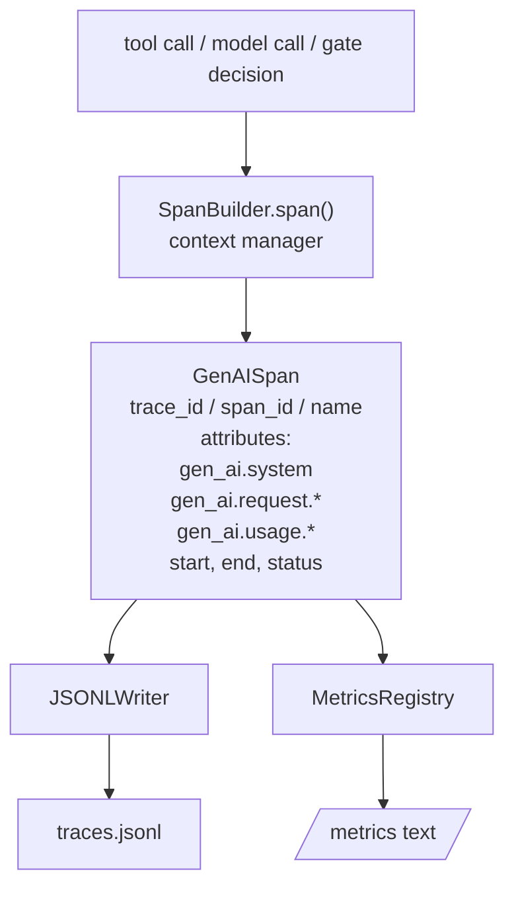
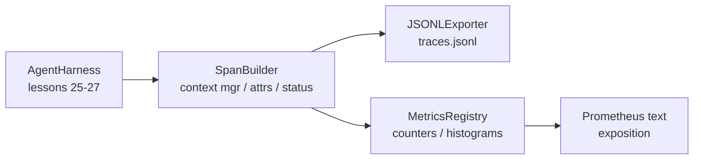

# Капстоун — урок 28: наблюдаемость на основе GenAI-спанов OTel и метрик Prometheus

> Харнес агента без наблюдаемости — это чёрный ящик, который стоит денег. В этом уроке вручную реализован построитель спанов, который создаёт записи, соответствующие семантическим соглашениям OpenTelemetry GenAI, записывает их в файл JSON Lines по одному спану на строку и предоставляет счётчики и гистограммы в текстовом формате Prometheus. Всё это написано на стандартной библиотеке Python (stdlib) и работает офлайн.

**Тип:** Build**Языки:** Python (stdlib)**Предварительные требования:** Фаза 19 · 25 (verification gates), Фаза 19 · 26 (sandbox), Фаза 19 · 27 (eval harness), Фаза 13 · 20 (OpenTelemetry GenAI), Фаза 14 · 23 (OTel GenAI conventions)**Время:** ~90 минут
## Цели обучения

- Постройте dataclass для спана, соответствующий структуре семантических соглашений OpenTelemetry GenAI.
- Реализуйте JSONL-экспортёр, который записывает по одному самодостаточному спану на строку.
- Постройте счётчики и гистограммы с метками и экспозицией в текстовом формате Prometheus (Prometheus text-format exposition).
- Оберните произвольный вызываемый объект (callable) в контекстный менеджер спана, который фиксирует длительность, статус и исключения.
- Проверьте, что созданные спаны корректно проходят туда и обратно (roundtrip) через `json.loads` и соответствуют форме, заданной спецификацией.

## Проблема

Кодовый агент в продакшене производит на каждом шаге три класса артефактов: вызов модели, выполнение инструмента и решение верификационного шлюза. Ни один из них не полезен без структурированной телеметрии.

Первый режим отказа — отсутствующая трасса. Во вторник что-то пошло не так, но единственная запись — это 500-строчный лог чата. Нет записи о том, какой инструмент выполнялся, сколько времени это заняло, сколько токенов ушло в промпт и отклонил ли что-нибудь шлюз. Автору агента остаётся только гадать.

Второй режим отказа — неразбираемая трасса. Харнес записывал спаны, но использовал собственные произвольные имена полей. Ничто в Grafana, Honeycomb, Jaeger или локальном CLI не может их прочитать. Любые инструменты, уже имеющиеся в стеке команды, оказываются бесполезны, потому что спаны нестандартны.

Третий режим отказа — неагрегированная метрика. В трассе видно один медленный вызов инструмента, но нельзя ответить на вопрос «какова p95-задержка вызовов read_file за последний час?», потому что метрик нет — есть только трассы.

Семантические соглашения OpenTelemetry GenAI существуют именно для этого. Они определяют небольшой набор стандартных атрибутов, которые используют все эмиттеры спанов в LLM-фреймворках. Если ваш харнес записывает эти атрибуты, их сможет прочитать любой OTel-совместимый бэкенд.

## Концепция



Каждая операция в харнесе порождает спан. У спана есть идентификатор трассы (trace id) — вся операция агента целиком, идентификатор спана (span id) — эта конкретная операция, имя (например, `gen_ai.chat`, `gen_ai.tool.execution`), атрибуты, соответствующие соглашениям GenAI, время начала и окончания, а также статус.

Соглашения GenAI стандартизируют следующие ключи атрибутов: `gen_ai.system` (какой провайдер, например `anthropic`, `openai`), `gen_ai.request.model` (идентификатор модели), `gen_ai.request.max_tokens`, `gen_ai.usage.input_tokens`, `gen_ai.usage.output_tokens`, `gen_ai.response.model`, `gen_ai.response.id`, `gen_ai.operation.name`, а также специфичные для инструментов ключи `gen_ai.tool.name` и `gen_ai.tool.call.id`.

Экспортёр пишет JSONL. По одному JSON-объекту на строку. Это простейший из возможных форматов, который последующие инструменты могут обрабатывать потоково, искать в нём (grep) и импортировать. Настоящий экспортёр OTel говорил бы по протоколу OTLP gRPC; экспортёр JSONL из этого урока — офлайн-эквивалент, который на любой рабочей станции завершается с нулевым кодом возврата.

Метрики живут рядом с трассами. Счётчик увеличивается при каждом вызове инструмента: `tools_called_total{tool="read_file"}`. Гистограмма фиксирует наблюдаемую задержку: `tool_latency_ms{tool="read_file"}`. Оба сериализуются в текстовый формат экспозиции Prometheus, который де-факто является стандартом для метрик, собираемых по модели pull.

```figure
trace-spans
```

## Архитектура



Построитель спанов — небольшой класс с методом `span(name, attrs)`, который возвращает контекстный менеджер. Контекстный менеджер фиксирует время начала при входе, фиксирует время окончания при выходе, прикрепляет исключение, если оно было выброшено, и передаёт финализированный спан экспортёру.

Реестр метрик — это два словаря (dict). Счётчики представлены как `{(name, frozen_labels): int}`. Гистограммы хранят сырые сэмплы в списке и сериализуются в бакеты гистограммы Prometheus в момент экспозиции.

## Что вы построите

`main.py` поставляет:

1. `GenAISpan` dataclass: trace_id, span_id, parent_span_id, name, attributes, start_unix_nano, end_unix_nano, status, status_message, events.
2. класс `SpanBuilder` с контекстным менеджером `span(name, attrs, parent=None)`.
3. класс `JSONLExporter` с методом `export(span)`, который дописывает одну строку.
4. классы `Counter` и `Histogram`, а также `MetricsRegistry`.
5. `prometheus_exposition(registry)`, которая формирует вывод в текстовом формате.
6. декоратор `wrap_tool_call(name)`, который создаёт спан и обновляет метрики.
7. Демо: синтезирует полный вызов агента (спан gen_ai.chat, оборачивающий спаны инструментов), записывает traces.jsonl, печатает экспозицию Prometheus, завершается с нулевым кодом возврата.

Идентификаторы спана и трассы — это 16-байтные hex-строки, генерируемые через `os.urandom`. Это соответствует W3C trace context в OTel. Экспортёр никогда не выбрасывает исключения; ошибки ввода-вывода всплывают наружу, но харнес продолжает работу.

У гистограммы фиксированный набор бакетов (значение по умолчанию OTel для задержки в миллисекундах: 5, 10, 25, 50, 100, 250, 500, 1000, 2500, 5000, 10000, +Inf). Сэмплы хранятся в виде списка; количество по каждому бакету вычисляется в момент экспозиции по требованию.

## Почему решение написано вручную, а не через opentelemetry-sdk

OTel Python SDK — это полноценная зависимость. Это также несколько тысяч строк кода, несколько процессов для экспортёра OTLP и накладные расходы времени выполнения, которые превышают бюджет урока. Написанная вручную версия учит формату передачи данных (wire format). В продакшене те же атрибуты подключаются к настоящему SDK, и вы бесплатно получаете экспортёр OTLP, батчинг и автоматическое определение ресурсов.

Соглашения стабильны. Формат передачи данных, который выдаёт этот урок, будет по-прежнему разбираться и в 2030 году, потому что OTel никогда не ломает имена атрибутов GenAI — он только добавляет новые.

## Как это связано с остальной частью Track A

Урок 25 создал цепочку шлюзов (gate chain). Урок 26 создал песочницу. Урок 27 создал харнес для оценивания. Урок 28 делает все три наблюдаемыми. Урок 29 оборачивает каждый шаг сквозного демо в спаны и в конце печатает текст Prometheus.

## Запуск

```bash
cd phases/19-capstone-projects/28-observability-otel-traces
python3 code/main.py
python3 -m pytest code/tests/ -v
```

Демо создаёт `traces.jsonl` в рабочей директории урока (удаляется в конце), затем печатает выборку из трёх спанов, затем печатает экспозицию Prometheus для счётчиков и гистограмм. Тесты проверяют, что спаны сериализуются и десериализуются без потерь (round-trip), что присутствуют канонические атрибуты GenAI, что счётчики корректно увеличиваются и что экспозиция гистограммы содержит ожидаемые количества по бакетам.
